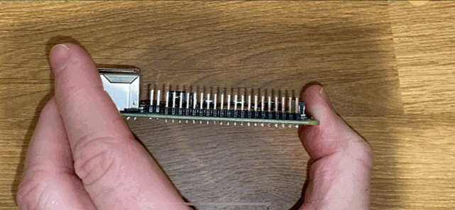
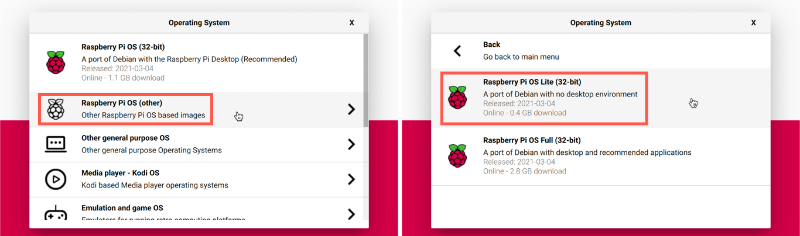
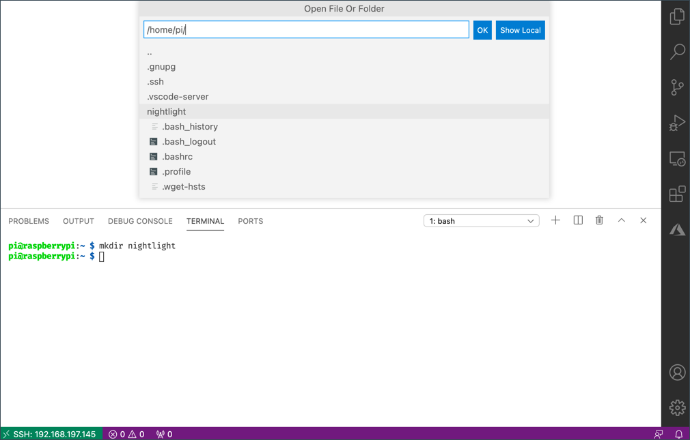

# Raspberry Pi

The [Raspberry Pi](https://raspberrypi.org) is a single-board computer. You can add sensors and actuators using a wide range of devices and ecosystems, and for these lessons using a hardware ecosystem called [Grove](https://www.seeedstudio.com/category/Grove-c-1003.html). You will code your Pi and access the Grove sensors using Python.


## Setup

If you are using a Raspberry Pi as your IoT hardware, you have two choices - you can work through all these lessons and code directly on the Pi, or you can connect remotely to a 'headless' Pi and code from your computer.

Before you begin, you also need to connect the Grove Base Hat to your Pi.

### Task - setup

Install the Grove base hat on your Pi and configure the Pi

1. Connect the Grove base hat to your Pi. The socket on the hat fits over all of the GPIO pins on the Pi, sliding all the way down the pins to sit firmly on the base. It sits over the Pi, covering it.

    

1. Decide how you want to program your Pi, and head to the relevant section below:

    * [Work directly on your Pi](#work-directly-on-your-pi)
    * [Remote access to code the Pi](#remote-access-to-code-the-pi)

### Work directly on your Pi

If you want to work directly on your Pi, you can use the desktop version of Raspberry Pi OS and install all the tools you need.

#### Task - work directly on your Pi

Set up your Pi for development.

1. Follow the instructions in the [Raspberry Pi setup guide](https://projects.raspberrypi.org/en/projects/raspberry-pi-setting-up) to set up your Pi, connect it to a keyboard/mouse/monitor, connect it to your WiFi or ethernet network, and update the software.

To program the Pi using the Grove sensors and actuators, you will need to install an editor to allow you to write the device code, and various libraries and tools that interact with the Grove hardware.

1. Once your Pi has rebooted, launch the Terminal by clicking the **Terminal** icon on the top menu bar, or choose *Menu -> Accessories -> Terminal*

1. Run the following command to ensure the OS and installed software is up to date:

    ```sh
    sudo apt update && sudo apt full-upgrade --yes
    ```

1. Run the following commands to install all the needed libraries for the Grove hardware:

    ```sh
    sudo apt install git python3-dev python3-pip --yes

    git clone https://github.com/Seeed-Studio/grove.py
    cd grove.py
    sudo pip3 install .

    sudo raspi-config nonint do_i2c 0
    ```

    This starts by installing Git, along with Pip to install Python packages.

    One of the powerful features of Python is the ability to install [Pip packages](https://pypi.org) - these are packages of code written by other people and published to the Internet. You can install a Pip package onto your computer with one command, then use that package in your code.

    The Seeed Grove Python packages need to be installed from source. These commands will clone the repo containing the source code for this package, then install it locally.

    > 💁 By default when you install a package it is available everywhere on your computer, and this can lead to problems with package versions - such as one application depending on one version of a package that breaks when you install a new version for a different application. To work around this problem, you can use a [Python virtual environment](https://docs.python.org/3/library/venv.html), essentially a copy of Python in a dedicated folder, and when you install Pip packages they get installed just to that folder. You won't be using virtual environments when using your Pi. The Grove install script installs the Grove Python packages globally, so to use a virtual environment you would need to set up a virtual environment then manually re-install the Grove packages inside that environment. It's easier to just use global packages, especially as a lot of Pi developers will re-flash a clean SD card for each project.

    Finally, this enables the I<sup>2</sup>C interface.

1. Reboot the Pi either using the menu or running the following command in the Terminal:

    ```sh
    sudo reboot
    ```

1. Once the Pi has rebooted, relaunch the Terminal and run the following command to install [Visual Studio Code (VS Code)](https://code.visualstudio.com?WT.mc_id=academic-17441-jabenn) - this is the editor you will be using to write your device code in Python.

    ```sh
    sudo apt install code
    ```

    Once this is installed, VS Code will be available from the top menu.

    > 💁 You are free to use any Python IDE or editor for these lessons if you have a preferred tool, but the lessons will give instructions based off using VS Code.

1. Install Pylance. This is an extension for VS Code that provides Python language support. Refer to the [Pylance extension documentation](https://marketplace.visualstudio.com/items?WT.mc_id=academic-17441-jabenn&itemName=ms-python.vscode-pylance) for instructions on installing this extension in VS Code.

### Remote access to code the Pi

Rather than coding directly on the Pi, it can run 'headless', that is not connected to a keyboard/mouse/monitor, and configure and code on it from your computer, using Visual Studio Code.

#### Set up the Pi OS

To code remotely, the Pi OS needs to be installed on an SD Card.

##### Task - set up the Pi OS

Set up the headless Pi OS.

1. Download the **Raspberry Pi Imager** from the [Raspberry Pi OS software page](https://www.raspberrypi.org/software/) and install it

1. Insert an SD card into your computer, using an adapter if necessary

1. Launch the Raspberry Pi Imager

1. From the Raspberry Pi Imager, select the **CHOOSE OS** button, then select *Raspberry Pi OS (Other)*, followed by *Raspberry Pi OS Lite (32-bit)*

    

    > 💁 Raspberry Pi OS Lite is a version of Raspberry Pi OS that doesn't have the desktop UI or UI based tools. These aren't needed for a headless Pi and makes the install smaller and boot up time faster.

1. Select the **CHOOSE STORAGE** button, then select your SD card

1. Launch the **Advanced Options** by pressing `Ctrl+Shift+X`. These options allow some pre-configuration of the Raspberry Pi OS before it is imaged to the SD card.

    1. Check the **Enable SSH** check box, and set a password for the `pi` user. This is the password you will use to log in to the Pi later.

    1. If you are planning to connect to the Pi over WiFi, check the **Configure WiFi** check box, and enter your WiFi SSID and password, as well as selecting your WiFi country. You do not need to do this if you will use an ethernet cable. Make sure the network you connect to is the same one your computer is on.

    1. Check the **Set locale settings** check box, and set your country and timezone

    1. Select the **SAVE** button

1. Select the **WRITE** button to write the OS to the SD card. If you are using macOS, you will be asked to enter your password as the underlying tool that writes disk images needs privileged access.

The OS will be written to the SD card, and once complete the card will be ejected by the OS, and you will be notified. Remove the SD card from your computer, insert it into the Pi, power up the Pi and wait for about 2 mins for it to properly boot.

#### Connect to the Pi

The next step is to remotely access the Pi. You can do this using `ssh`, which is available on macOS, Linux and recent versions of Windows.

##### Task - connect to the Pi

Remotely access the Pi.

1. Launch a Terminal or Command Prompt, and enter the following command to connect to the Pi:

    ```sh
    ssh pi@raspberrypi.local
    ```

    If you are on Windows using an older version that doesn't have `ssh` installed, you can use OpenSSH. You can find the installation instructions in the [OpenSSH installation documentation](https://docs.microsoft.com//windows-server/administration/openssh/openssh_install_firstuse?WT.mc_id=academic-17441-jabenn).

1. This should connect to your Pi and ask for the password.

    Being able to find computers on your network by using `<hostname>.local` is a fairly recent addition to Linux and Windows. If you are using Linux or Windows and you get any errors about the Hostname not being found, you will need to install additional software to enable ZeroConf networking (also referred to by Apple as Bonjour):

    1. If you are using Linux, install Avahi using the following command:

        ```sh
        sudo apt-get install avahi-daemon
        ```

    1. If you are using Windows, the easiest way to enable ZeroConf is to install [Bonjour Print Services for Windows](http://support.apple.com/kb/DL999). You can also install [iTunes for Windows](https://www.apple.com/itunes/download/) to get a newer version of the utility (which is not available standalone).

    > 💁 If you cannot connect using `raspberrypi.local`, then you can use the IP address of your Pi. Refer to the [Raspberry Pi IP address documentation](https://www.raspberrypi.org/documentation/remote-access/ip-address.md) for instructions on a number of ways to get the IP address.

1. Enter the password you set in the Raspberry Pi Imager Advanced Options

#### Configure software on the Pi

Once you are connected to the Pi, you need to ensure the OS is up to date, and install various libraries and tools that interact with the Grove hardware.

##### Task - configure software on the Pi

Configure the installed Pi software and install the Grove libraries.

1. From your `ssh` session, run the following command to update then reboot the Pi:

    ```sh
    sudo apt update && sudo apt full-upgrade --yes && sudo reboot
    ```

    The Pi will be updated and rebooted. The `ssh` session will end when the Pi is rebooted, so leave it for about 30 seconds then reconnect.

1. From the reconnected `ssh` session, run the following commands to install all the needed libraries for the Grove hardware:

    ```sh
    sudo apt install git python3-dev python3-pip --yes

    git clone https://github.com/Seeed-Studio/grove.py
    cd grove.py
    sudo pip3 install .

    sudo raspi-config nonint do_i2c 0
    ```

    This starts by installing Git, along with Pip to install Python packages.

    One of the powerful features of Python is the ability to install [Pip packages](https://pypi.org) - these are packages of code written by other people and published to the Internet. You can install a Pip package onto your computer with one command, then use that package in your code.

    The Seeed Grove Python packages need to be installed from source. These commands will clone the repo containing the source code for this package, then install it locally.

    > 💁 By default when you install a package it is available everywhere on your computer, and this can lead to problems with package versions - such as one application depending on one version of a package that breaks when you install a new version for a different application. To work around this problem, you can use a [Python virtual environment](https://docs.python.org/3/library/venv.html), essentially a copy of Python in a dedicated folder, and when you install Pip packages they get installed just to that folder. You won't be using virtual environments when using your Pi. The Grove install script installs the Grove Python packages globally, so to use a virtual environment you would need to set up a virtual environment then manually re-install the Grove packages inside that environment. It's easier to just use global packages, especially as a lot of Pi developers will re-flash a clean SD card for each project.

    Finally, this enables the I<sup>2</sup>C interface.

1. Reboot the Pi by running the following command:

    ```sh
    sudo reboot
    ```

    The `ssh` session will end when the Pi is rebooted. There is no need to reconnect.

#### Configure VS Code for remote access

Once the Pi is configured, you can connect to it using Visual Studio Code (VS Code) from your computer - this is a free developer text editor you will be using to write your device code in Python.

##### Task - configure VS Code for remote access

Install the required software and connect remotely to your Pi.

1. Install VS Code on your computer by following the [VS Code documentation](https://code.visualstudio.com?WT.mc_id=academic-17441-jabenn)

1. Follow the instructions in the [VS Code Remote Development using SSH documentation](https://code.visualstudio.com/docs/remote/ssh?WT.mc_id=academic-17441-jabenn) to install the components needed

1. Following the same instructions, connect VS Code to the Pi

1. Once connected, follow the [managing extensions](https://code.visualstudio.com/docs/remote/ssh#_managing-extensions?WT.mc_id=academic-17441-jabenn) instructions to install the [Pylance extension](https://marketplace.visualstudio.com/items?WT.mc_id=academic-17441-jabenn&itemName=ms-python.vscode-pylance) remotely onto the Pi

## Hello world

It is traditional when starting out with a new programming language or technology to create a 'Hello World' application - a small application that outputs something like the text `"Hello World"` to show that all the tools are correctly configured.

The Hello World app for the Pi will ensure that you have Python and Visual Studio code installed correctly.

This app will be in a folder called `nightlight`, and it will be re-used with different code in later parts of this assignment to build the nightlight application.

### Task - hello world

Create the Hello World app.

1. Launch VS Code, either directly on the Pi, or on your computer and connected to the Pi using the Remote SSH extension

1. Launch the VS Code Terminal by selecting *Terminal -> New Terminal, or pressing `` CTRL+` ``. It will open to the `pi` users home directory.

1. Run the following commands to create a directory for your code, and create a Python file called `app.py` inside that directory:

    ```sh
    mkdir nightlight
    cd nightlight
    touch app.py
    ```

1. Open this folder in VS Code by selecting *File -> Open...* and selecting the *nightlight* folder, then select **OK**

    

1. Open the `app.py` file from the VS Code explorer and add the following code:

    ```python
    print('Hello World!')
    ```

    The `print` function prints whatever is passed to it to the console.

1. From the VS Code Terminal, run the following to run your Python app:

    ```sh
    python app.py
    ```

    > 💁 You may need to explicitly call `python3` to run this code if you have Python 2 installed in addition to Python 3 (the latest version). If you have Python2 installed then calling `python` will use Python 2 instead of Python 3. By default, the latest Raspberry Pi OS versions only have Python 3 installed.

    The following output will appear in the terminal:

    ```output
    pi@raspberrypi:~/nightlight $ python3 app.py
    Hello World!
    ```

> 💁 You can find this code in the [code/pi](code/pi) folder.

😀 Your 'Hello World' program was a success!
