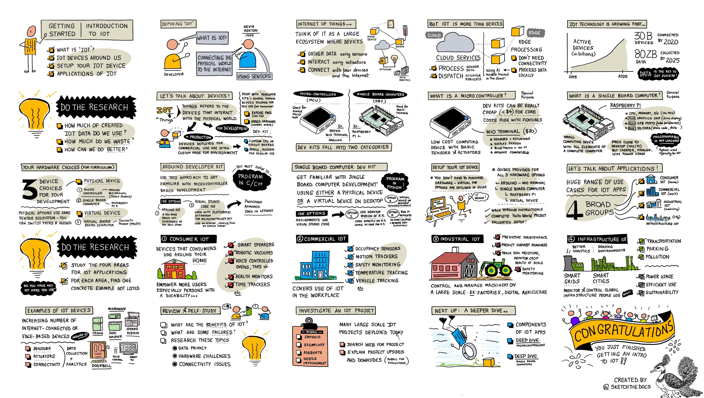
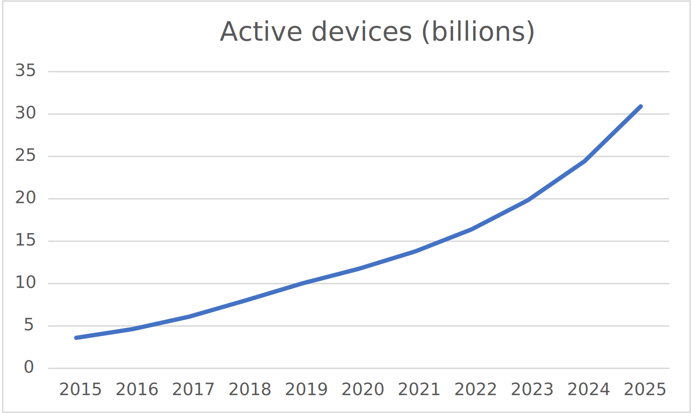
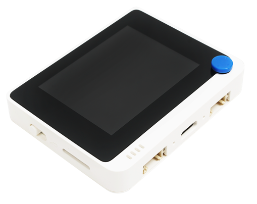

# Pengenalan IoT

> Sketsa dibuat oleh [Nitya Narasimhan](https://github.com/nitya). Klik gambar untuk versi yang lebih besar.

## Kuis prakuliah

[Kuis prakuliah](https://black-meadow-040d15503.1.azurestaticapps.net/quiz/1)

## Pengantar

Pelajaran ini mencakup beberapa topik pengantar mengenai Internet of Things, dan membuat Anda dapat mempersiapkan dan mengatur perangkat keras Anda.

Dalam pelajaran ini kita akan membahas:

* [Apa itu 'Internet of Things'?](#apa-itu-internet-of-things)
* [Perangkat IoT](#perangkat-iot)
* [Mengatur Perangkat Anda](#set-up-your-device)
* [Penerapan dari IoT](#applications-of-iot)
* [Contoh Perangkat IoT yang Mungkin Anda Punya di Sekitar](#examples-of-iot-devices-you-may-have-around-you)

## Apa itu 'Internet of Things'?

Istilah 'Internet of Things' diciptakan oleh [Kevin Ashton](https://wikipedia.org/wiki/Kevin_Ashton) pada tahun 1999, yang merujuk pada menghubungkan Internet ke dunia fisik melalui sensor. Sejak saat itu, istilah IoT digunakan untuk menggambarkan perangkat apa pun yang berinteraksi dengan dunia fisik di sekitarnya, baik dengan mengumpulkan data dari sensor, atau menyediakan interaksi dunia nyata melalui aktuator (perangkat yang melakukan sesuatu seperti menyalakan sakelar atau menyalakan LED), dan terhubung ke perangkat lain atau Internet.

> **Sensor** mengumpulkan informasi dari lingkungan, seperti mengukur kecepatan, suhu, atau lokasi.
>
> **Aktuator** mengubah sinyal listrik menjadi interaksi pada lingkungan seperti memicu sakelar, menyalakan lampu, membuat suara, atau mengirim *control signal* ke perangkat keras lain, misalnya untuk menyalakan soket listrik.

IoT sebagai suatu bidang teknologi lebih dari sekadar perangkat. Hal ini mencakup layanan berbasis cloud yang dapat memproses data sensor, atau mengirim permintaan ke aktuator yang terhubung ke perangkat IoT. IoT juga mencakup perangkat yang tidak memiliki atau tidak memerlukan konektivitas Internet, sering disebut sebagai *edge devices* atau perangkat tepi. Perangkat tepi adalah perangkat yang dapat memproses dan merespons data sensor itu sendiri, biasanya menggunakan model AI yang dilatih di cloud.

IoT merupakan bidang teknologi yang berkembang pesat. Diperkirakan pada akhir tahun 2020, 30 miliar perangkat IoT dikerahkan dan terhubung ke Internet. Jika melihat ke masa depan, diperkirakan pada tahun 2025, perangkat IoT akan mengumpulkan hampir 80 zettabytes data atau 80 triliun gigabyte. Banyak sekali bukan?

✅ Lakukan sedikit riset: Berapa banyak data yang dihasilkan oleh perangkat IoT yang benar-benar digunakan, dan berapa banyak yang terbuang? Mengapa begitu banyak data yang diabaikan?

Data ini adalah kunci kesuksesan IoT. Untuk menjadi pengembang IoT yang sukses, Anda perlu memahami data yang perlu Anda kumpulkan, cara mengumpulkannya, cara membuat keputusan berdasarkan data tersebut, dan cara menggunakan keputusan tersebut untuk berinteraksi dengan lingkungan fisik jika diperlukan.

## Perangkat IoT

Huruf **T** di IoT adalah singkatan dari **Things** - perangkat yang berinteraksi dengan lingkungan fisik di sekitarnya baik dengan mengumpulkan data dari sensor atau menyediakan interaksi dunia nyata melalui aktuator.

Perangkat untuk produksi atau penggunaan komersial, seperti pelacak kebugaran konsumen, atau pengontrol mesin industri, biasanya dibuat khusus. Mereka menggunakan papan sirkuit khusus, bahkan mungkin prosesor khusus, yang dirancang untuk memenuhi kebutuhan tugas tertentu, apakah itu cukup kecil untuk muat di pergelangan tangan, atau cukup kuat untuk bekerja di lingkungan pabrik dengan suhu tinggi, stres tinggi, atau getaran tinggi.

Sebagai pengembang yang belajar tentang IoT atau membuat prototipe perangkat, Anda harus mulai dengan *developer kit* atau perangkat pengembang. Perangkat tersebut adalah perangkat IoT untuk tujuan umum yang dirancang untuk digunakan pengembang, seringkali dengan fitur yang tidak akan Anda miliki di perangkat produksi, seperti satu set pin eksternal untuk menghubungkan sensor atau aktuator, perangkat keras untuk mendukung debugging, atau sumber daya tambahan yang akan menambah biaya yang tidak perlu saat melakukan produksi manufaktur.

Perangkat pengembang ini biasanya terbagi dalam dua kategori - mikrokontroler dan komputer papan tunggal. Perangkat tersebut akan diperkenalkan di sini, dan kita akan membahas lebih detail di pelajaran berikutnya.

> 💁 Ponsel Anda juga dapat dianggap sebagai perangkat IoT tujuan umum, dengan sensor dan aktuator bawaan, dengan berbagai aplikasi yang menggunakan sensor dan aktuator dengan cara yang berbeda dengan layanan cloud yang berbeda. Anda bahkan dapat menemukan beberapa tutorial IoT yang menggunakan aplikasi ponsel sebagai perangkat IoT.

### Mikrokontroler

Mikrokontroler atau Pengendali mikro (juga disebut sebagai MCU, kependekan dari microcontroller unit) adalah komputer kecil yang terdiri dari:

🧠 Satu atau lebih unit pemrosesan pusat (CPU) - 'otak' mikrokontroler yang menjalankan program Anda

💾 Memori (RAM dan memori program) - tempat program, data, dan variabel Anda disimpan

🔌 Koneksi input/output (I/O) yang dapat diprogram - untuk berbicara dengan periferal eksternal (perangkat yang terhubung) seperti sensor dan aktuator

Mikrokontroler biasanya merupakan perangkat komputasi berbiaya rendah, dengan harga rata-rata untuk yang digunakan dalam perangkat keras khusus turun menjadi sekitar US$0,50, dan beberapa perangkat bahkan semurah US$0,03. Perangkat pengembang dapat ditemukan mulai dari harga US$4, dengan biaya meningkat karena Anda menambahkan lebih banyak fitur. [Wio Terminal](https://www.seeedstudio.com/Wio-Terminal-p-4509.html), perangkat pengembang mikrokontroler dari [Seeed studios](https://www.seeedstudio.com) yang memiliki sensor , aktuator, WiFi, dan layar berharga sekitar US$30.

> 💁 Saat mencari mikrokontroler di Internet, berhati-hatilah saat mencari istilah **MCU** karena ini akan mengembalikan banyak hasil untuk Marvel Cinematic Universe, bukan mikrokontroler.

Mikrokontroler dirancang untuk diprogram untuk melakukan sejumlah tugas yang sangat spesifik, daripada menjadi komputer dengan tujuan umum seperti PC atau Mac. Kecuali untuk skenario yang sangat spesifik, Anda tidak dapat menghubungkan monitor, keyboard, dan mouse dan menggunakannya untuk tugas umum.

Perangkat pengembang mikrokontroler biasanya dilengkapi dengan sensor dan aktuator tambahan. Sebagian besar papan (board) akan memiliki satu atau lebih LED yang dapat Anda program, bersama dengan perangkat lain seperti steker standar untuk menambahkan lebih banyak sensor atau aktuator menggunakan berbagai ekosistem pabrikan atau sensor bawaan (biasanya yang paling populer seperti sensor suhu). Beberapa mikrokontroler memiliki konektivitas nirkabel bawaan seperti Bluetooth atau WiFi atau memiliki mikrokontroler tambahan di papan untuk menambahkan konektivitas ini.

> 💁 Mikrokontroler biasanya diprogram dalam bahasa C/C++.

### Komputer papan tunggal

Komputer papan tunggal adalah perangkat komputasi kecil yang memiliki semua elemen komputer lengkap yang terdapat pada satu papan kecil. Ini adalah perangkat yang memiliki spesifikasi yang mirip dengan desktop atau laptop PC atau Mac, menjalankan sistem operasi lengkap, tetapi berukuran kecil, menggunakan lebih sedikit daya, dan jauh lebih murah.

Raspberry Pi adalah salah satu komputer papan tunggal yang paling populer.

Seperti mikrokontroler, komputer papan tunggal memiliki CPU, memori dan pin input/output, tetapi mereka memiliki fitur tambahan seperti chip grafis untuk memungkinkan Anda menghubungkan monitor, output audio, dan port USB untuk menghubungkan mouse keyboard dan USB standar lainnya. perangkat seperti webcam atau penyimpanan eksternal. Program disimpan di kartu SD atau hard drive bersama dengan sistem operasi, bukan chip memori yang terpasang di papan.

> 🎓 Anda dapat menganggap komputer papan tunggal sebagai versi PC atau Mac yang lebih kecil dan lebih murah, dengan tambahan pin GPIO (general-purpose input/output) untuk berinteraksi dengan sensor dan aktuator.

Komputer papan tunggal adalah komputer berfitur lengkap, sehingga dapat diprogram dalam bahasa apa pun. Perangkat IoT biasanya diprogram dengan Python.

### Pilihan perangkat keras untuk sisa pelajaran

Semua pelajaran selanjutnya mencakup tugas menggunakan perangkat IoT untuk berinteraksi dengan dunia fisik dan berkomunikasi dengan cloud. Setiap pelajaran mendukung 3 pilihan perangkat - Arduino (menggunakan Terminal Seeed Studios Wio), atau komputer papan tunggal, baik perangkat fisik (Raspberry Pi 4) atau komputer papan tunggal virtual yang berjalan di PC atau Mac Anda.

Anda dapat membaca tentang perangkat keras yang diperlukan untuk menyelesaikan semua tugas di [panduan perangkat keras](../../../hardware.md).

> 💁 Anda tidak perlu membeli perangkat keras IoT apa pun untuk menyelesaikan tugas, Anda dapat melakukan semuanya menggunakan komputer papan tunggal virtual.

Perangkat keras mana yang Anda pilih terserah Anda - itu tergantung pada apa yang Anda miliki di rumah di sekolah Anda, dan bahasa pemrograman apa yang Anda ketahui atau rencanakan untuk dipelajari. Kedua varian perangkat keras akan menggunakan ekosistem sensor yang sama, jadi jika Anda memulai pada salah satu perangkat, Anda dapat dengan mudah melakukannya pada perangkat lain tanpa harus mengganti sebagian besar perangkat pengembang. Komputer papan tunggal virtual akan setara dengan pembelajaran di Raspberry Pi, dengan sebagian besar kode dapat ditransfer ke Pi jika Anda akhirnya mendapatkan perangkat dan sensor.
