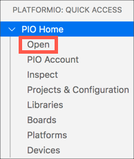
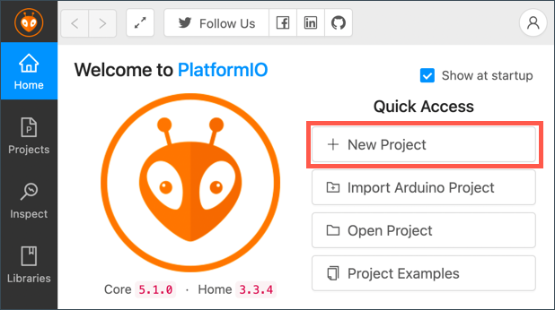
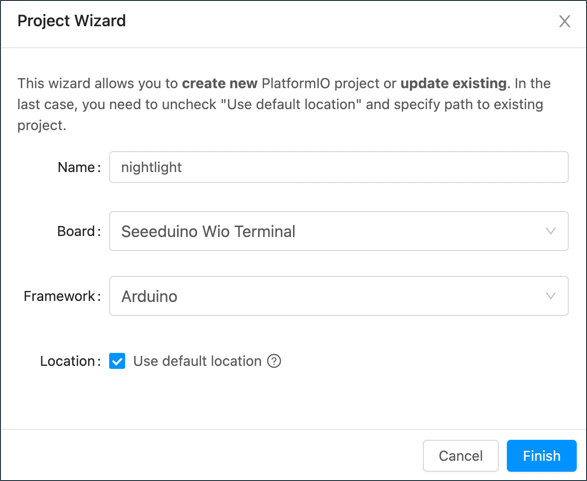
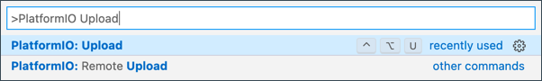
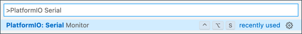

# Wio 终端

[Seeed Studios 的 Wio 终端](https://www.seeedstudio.com/Wio-Terminal-p-4509.html) 是个Arduino兼容的微控制器；无线上网以及一些传感器和执行器已经被装上，还有端口让你用叫做 [Grove](https://www.seeedstudio.com/category/Grove-c-1003.html) 的硬件生态系统加更多传感器和执行器。


## 设置

想用你个 Wio 终端，你必须在你的电脑上安装几个免费软件。你也需要在连接无线上网前更新 Wio 终端的固件。

### 任务：设置

安装需要的软件以及更新固件。

1. 安装 Visual Studio Code (VS Code)。这是你将用来写 C 或 C++ 的设备代码的编辑器。在 [VS Code 文档](https://code.visualstudio.com?WT.mc_id=academic-17441-jabenn) 找一下安装 VS Code 的指示。

    > 💁 另外一个为 Arduino 开发的 IDE 是  [Arduino IDE](https://www.arduino.cc/en/software)。如果你已经对这个工具熟悉，那你可以把它用来代替 VS Code 和 PlatformIO，但这个课程的指示将基于 VS Code。

1. 安装 VS Code 的 PlatformIO 扩展。这是支持用 C 或 C++ 来为微控制器写编码的 VS Code 扩展。在 [PlatformIO 扩展文档](https://marketplace.visualstudio.com/items?itemName=platformio.platformio-ide&WT.mc_id=academic-17441-jabenn) 找一下在 VS Code 安装扩展的指示。这个扩展依赖着Microsoft C/C++ 扩展来与 C 和 C++ 代码工作，而这个C/C++ 扩展在默认情况下会被安装当你安装 PlatformIO。

1. 将你的 Wio 终端连接到你的电脑。Wio 终端底下有个 USB-C 端口，而它需要连接到你的电脑的一个 USB 端口。Wio 终端包括一个 USB-C 至 USB-A 电缆，但万一你的电脑只有 USB-C 端口，那你就需要一个 USB-C 电缆或者一个 USB-A 至USB-C 适配器。 

1. 按照 [Wio 终端 Wiki WiFi Overview 文档](https://wiki.seeedstudio.com/Wio-Terminal-Network-Overview/) 的指示来设置你的 Wio 终端和更新固件。

## Hello world（你好，世界）

第一次用新的编程语言或科技，通常以创建一个“Hello World”应用开始——一个输出像 `"Hello World"` 的字的小小应用，为了确保所有的工具被设置好。

Wio 终端的 Hello World 应用将确保你安装好了 Visual Studio Code 与 PlatformIO，并为微控制器开发做好设置。

### 创建一个 PlatformIO 项目

第一步是使用为 Wio 终端配置的 PlatformIO 创建一个新项目。

#### 任务：创建一个 PlatformIO 项目

创建 PlatformIO 项目。

1. 将 Wio 终端连接到你的电脑。

1. 启动 VS Code。

1. PlatformIO 的图表应该在旁边的菜单栏上：

    

    选择这个菜单项，再选择 *PIO Home -> Open*

    

1. 从欢迎屏幕，选择 **+ New Project** 的按钮。

    

1. 在 *Project Wizard* 配置项目：

    1. 给你的项目取名为 `nightlight`

    1. 从 *Board* 的下拉式选单，输入 `WIO` 来过滤板，再选择 *Seeeduino Wio Terminal*

1.	将 *Framework* 保留为 *Arduino*

    1. 选中 *Use default location* 复选框，或取消选中它并为你的项目选择一个位置

    1. 选择 **Finish** 的按钮

    

    PlatformIO 将下载它需要使用为 Wio 终端编译代码和创建项目的组件。它可能花几分钟。

### 调查 PlatformIO 项目

VS Code explorer 将显示PlatformIO向导创建的几个文件与文件夹。

#### 文件夹

* `.pio` - 这个文件夹包含 PlatformIO 需要的临时数据，例如：库或编译代码。万一它被删除，它就会自动重新创造，而如果你在GitHub或其它网络分享项目，你也不必把它加进源代码管理。
* `.vscode` - 这个文件夹包含 PlatformIO 和 VS Code 用到的配置。万一它被删除，它就会自动重新创造，而如果你在GitHub或其它网络分享项目，你也不必把它加进源代码管理。
* `include` - 这个文件夹是给添加其它库时所需的外部头文件。课程中你不会用到这个文件夹。
* `lib` - 这个文件夹是给要从代码中调用的外部库。课程中你不会用到这个文件夹。* `src` - 这个文件夹包含你应用程序的主要源代码。一开始，它会包含一个文件—— `main.cpp`。
* `test` - 这个文件夹是给你放代码的任何单元测试。

#### 文件

* `main.cpp` - 这个文件在 `src` 文件夹中；它包含应用程序的入口点，还有会包含以下的代码：

    ```cpp
    #include <Arduino.h>
    
    void setup() {
      // put your setup code here, to run once:
    }
    
    void loop() {
      // put your main code here, to run repeatedly:
    }
    ```

    当设备启动，Arduino 框架将运行一次`setup` 函数，然后重复运行 `loop` 函数，直到设备关闭。

* `.gitignore` - 这个文件列出了将代码添加到 git 源代码控制时（例如：上传到 GitHub 上的存储库）要忽略的文件和目录。

* `platformio.ini` - 这个文件包含你的设备和应用的配置。打开这个文件，它就包含以下的代码：

    ```ini
    [env:seeed_wio_terminal]
    platform = atmelsam
    board = seeed_wio_terminal
    framework = arduino
    ```

    `[env:seeed_wio_terminal]` 部分有 Wio 终端的配置。你可以有多数的 `env` 部分，让你的代码能为更多板编译。

    其它值与项目向导中的配置相匹配：

  * `platform = atmelsam` 定义了 Wio 终端使用的硬件（基于 ATSAMD51 的微控制器）
  * `board = seeed_wio_terminal` 定义了微控制器板的类型（Wio 终端）
  * framework = arduino` 定义这个项目使用 Arduino 框架。

### 写 Hello World 应用

你现在已准备好写 Hello World 应用。

#### 任务：写 Hello World 应用

写Hello World 应用。

1. 在 VS Code 打开 `main.cpp` 文件

1. 更改代码以匹配以下内容：

    ```cpp
    #include <Arduino.h>

    void setup()
    {
        Serial.begin(9600);

        while (!Serial)
            ; // Wait for Serial to be ready
    
        delay(1000);
    }
    
    void loop()
    {
        Serial.println("Hello World");
        delay(5000);
    }
    ```

    `setup`函数初始化与串行端口的连接；在这个情况下，用来将 Wio 终端连接到你的电脑的USB 端口。`9600` 参数是[波特率](https://wikipedia.org/wiki/Symbol_rate) (also known as Symbol rate)，以每秒位数为单位的数据通过串行端口发送的速度。这个设置代表每秒发送 9,600 位（0 和 1）数据。 然后，它等待串行端口准备就绪。

    `loop` 函数把 `Hello World!` 发送到串行端口，也就是 `Hello World!` 的字符与换行符。然后，它将花 5,000毫秒或 5 秒睡眠。当 `loop` 结束，它会重新运行，而只要微控制器上电，它会一直重新运行着。 

1. 构建代码和把它上传到 Wio 终端

    1. 打开 VS Code 的命令面板

    1. 输入 `PlatformIO Upload` 来搜索上传选项，再选择 *PlatformIO: Upload*

        

        如果有必要的话，PlatformIO上传代码前将自动构建代码。

    1. 代码将被编译并上传到 Wio 终端

        > 💁 如果你正在用macOS, *DISK NOT EJECTED PROPERLY* 的通知将出现。这是因为 Wio 终端作为闪存过程的一部分安装为驱动器，并且在将编译的代码写入设备时断开连接。 你可以忽略这个通知。

    ⚠️ 如果你收到关于上传端口不可用的错误消息，请首先确保你已经将 Wio 终端连接到你的电脑，并使用屏幕左侧的开关打开。 底部的绿灯应该亮着。 如果仍然出现错误，请快速连续两次拉下开关以强制 Wio 终端进入引导加载程序模式，然后再次尝试上传。

PlatformIO 有一个串行监视器，可以监视从 Wio 终端通过 USB 电缆发送的数据。 这允许你监视由`Serial.println("Hello World");` 命令发送的数据。

1. 打开 VS Code 的命令面板

1. 输入 `PlatformIO Serial` 来搜索串行监视器选项，再选择 *PlatformIO: Serial Monitor*

    

    这将打开一个新终端，而通过串行端口发送的数据将流入这个终端：

    ```output
    > Executing task: platformio device monitor <
    
    --- Available filters and text transformations: colorize, debug, default, direct, hexlify, log2file, nocontrol, printable, send_on_enter, time
    --- More details at http://bit.ly/pio-monitor-filters
    --- Miniterm on /dev/cu.usbmodem101  9600,8,N,1 ---
    --- Quit: Ctrl+C | Menu: Ctrl+T | Help: Ctrl+T followed by Ctrl+H ---
    Hello World
    Hello World
    ```

    每 5 秒，`Hello World` 将打印在串行监视器上

> 💁 你可以在 [code/wio-terminal](code/wio-terminal) 文件夹找到这个代码。

😀 你的 “Hello World” 编码成功了！
