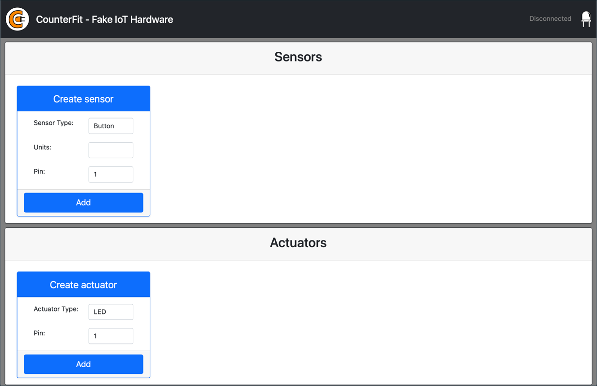
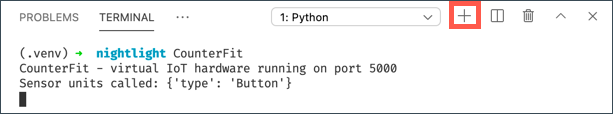
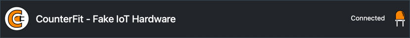

# Virtual single-board computer

Instead of purchasing an IoT device, along with sensors and actuators, you can use your computer to simulate IoT hardware. The [CounterFit project](https://github.com/CounterFit-IoT/CounterFit) allows you to run an app locally that simulates IoT hardware such as sensors and actuators, and access the sensors and actuators from local Python code that is written in the same way as the code you would write on a Raspberry Pi using physical hardware.

## Setup

To use CounterFit, you will need to install some free software on your computer.

### Task

Install the required software.

1. Install Python. Refer to the [Python downloads page](https://www.python.org/downloads/) for instructions on install the latest version of Python.

1. Install Visual Studio Code (VS Code). This is the editor you will be using to write your virtual device code in Python. Refer to the [VS Code documentation](https://code.visualstudio.com?WT.mc_id=academic-17441-jabenn) for instructions on installing VS Code.

    > 💁 You are free to use any Python IDE or editor for these lessons if you have a preferred tool, but the lessons will give instructions based off using VS Code.

1. Install the VS Code Pylance extension. This is an extension for VS Code that provides Python language support. Refer to the [Pylance extension documentation](https://marketplace.visualstudio.com/items?WT.mc_id=academic-17441-jabenn&itemName=ms-python.vscode-pylance) for instructions on installing this extension in VS Code.

The instructions to install and configure the CounterFit app will be given at the relevant time in the assignment instructions as it is installed on a per-project basis.

## Hello world

It is traditional when starting out with a new programming language or technology to create a 'Hello World' application - a small application that outputs something like the text `"Hello World"` to show that all the tools are correctly configured.

The Hello World app for the virtual IoT hardware will ensure that you have Python and Visual Studio code installed correctly. It will also connect to CounterFit for the virtual IoT sensors and actuators. It won't use any hardware, it will just connect to prove everything is working.

This app will be in a folder called `nightlight`, and it will be re-used with different code in later parts of this assignment to build the nightlight application.

### Configure a Python virtual environment

One of the powerful features of Python is the ability to install [Pip packages](https://pypi.org) - these are packages of code written by other people and published to the Internet. You can install a Pip package onto your computer with one command, then use that package in your code. You'll be using Pip to install a package to talk to CounterFit.

By default when you install a package it is available everywhere on your computer, and this can lead to problems with package versions - such as one application depending on one version of a package that breaks when you install a new version for a different application. To work around this problem, you can use a [Python virtual environment](https://docs.python.org/3/library/venv.html), essentially a copy of Python in a dedicated folder, and when you install Pip packages they get installed just to that folder.

> 💁 If you are using a Raspberry Pi then you didn't set up a virtual environment on that device to manage Pip packages, instead you are using global packages, as the Grove packages are installed globally by the installer script.

#### Task - configure a Python virtual environment

Configure a Python virtual environment and install the Pip packages for CounterFit.

1. From your terminal or command line, run the following at a location of your choice to create and navigate to a new directory:

    ```sh
    mkdir nightlight
    cd nightlight
    ```

1. Now run the following to create a virtual environment in the `.venv` folder

    ```sh
    python3 -m venv .venv
    ```

    > 💁 You need to explicitly call `python3` to create the virtual environment just in case you have Python 2 installed in addition to Python 3 (the latest version). If you have Python2 installed then calling `python` will use Python 2 instead of Python 3

1. Activate the virtual environment:

    * On Windows:
        * If you are using the Command Prompt, or the Command Prompt through Windows Terminal, run:

            ```cmd
            .venv\Scripts\activate.bat
            ```

        * If you are using PowerShell, run:

            ```powershell
            .\.venv\Scripts\Activate.ps1
            ```

            > If you get an error about running scripts being disabled on this system, you will need to enable running scripts by setting an appropriate execution policy. You can do this by launching PowerShell as an administrator, then running the following command:

            ```powershell
            Set-ExecutionPolicy -ExecutionPolicy Unrestricted
            ```

            Enter `Y` when asked to confirm. Then re-launch PowerShell and try again.

            You can reset this execution policy at a later date if needed. You can read more on this in the [Execution Policies page on Microsoft Docs](https://docs.microsoft.com/powershell/module/microsoft.powershell.core/about/about_execution_policies?WT.mc_id=academic-17441-jabenn).

    * On macOS or Linux, run:

        ```cmd
        source ./.venv/bin/activate
        ```

    > 💁 These commands should be run from the same location you ran the command to create the virtual environment. You will never need to navigate into the `.venv` folder, you should always run the activate command and any commands to install packages or run code from the folder you were in when you created the virtual environment.

1. Once the virtual environment has been activated, the default `python` command will run the version of Python that was used to create the virtual environment. Run the following to get the version:

    ```sh
    python --version
    ```

    The output should contain the following:

    ```output
    (.venv) ➜  nightlight python --version
    Python 3.9.1
    ```

    > 💁 Your Python version may be different - as long as it's version 3.6 or higher you are good. If not, delete this folder, install a newer version of Python and try again.

1. Run the following commands to install the Pip packages for CounterFit. These packages include the main CounterFit app as well as shims for Grove hardware. These shims allow you to write code as if you were programming using physical sensors and actuators from the Grove ecosystem but connected to virtual IoT devices.

    ```sh
    pip install CounterFit
    pip install counterfit-connection
    pip install counterfit-shims-grove
    ```

    These pip packages will only be installed in the virtual environment, and will not be available outside of this.

### Write the code

Once the Python virtual environment is ready, you can write the code for the 'Hello World' application

#### Task - write the code

Create a Python application to print `"Hello World"` to the console.

1. From your terminal or command line, run the following inside the virtual environment to create a Python file called `app.py`:

    * From Windows run:

        ```cmd
        type nul > app.py
        ```

    * On macOS or Linux, run:

        ```cmd
        touch app.py
        ```

1. Open the current folder in VS Code:

    ```sh
    code .
    ```

    > 💁 If your terminal returns `command not found` on macOS it means VS Code has not been added to your PATH. You can add VS Code to your PATH by following the instructions in the [Launching from the command line section of the VS Code documentation](https://code.visualstudio.com/docs/setup/mac?WT.mc_id=academic-17441-jabenn#_launching-from-the-command-line) and run the command afterwards. VS Code is installed to your PATH by default on Windows and Linux.

1. When VS Code launches, it will activate the Python virtual environment. The selected virtual environment will appear in the bottom status bar:

    

1. If the VS Code Terminal is already running when VS Code starts up, it won't have the virtual environment activated in it. The easiest thing to do is kill the terminal using the **Kill the active terminal instance** button:

    

    You can tell if the terminal has the virtual environment activated as the name of the virtual environment will be a prefix on the terminal prompt. For example, it might be:

    ```sh
    (.venv) ➜  nightlight
    ```

    If you don't have `.venv` as a prefix on the prompt, the virtual environment is not active in the terminal.

1. Launch a new VS Code Terminal by selecting *Terminal -> New Terminal, or pressing `` CTRL+` ``. The new terminal will load the virtual environment, and the call to activate this will appear in the terminal. The prompt will also have the name of the virtual environment (`.venv`):

    ```output
    ➜  nightlight source .venv/bin/activate
    (.venv) ➜  nightlight 
    ```

1. Open the `app.py` file from the VS Code explorer and add the following code:

    ```python
    print('Hello World!')
    ```

    The `print` function prints whatever is passed to it to the console.

1. From the VS Code terminal, run the following to run your Python app:

    ```sh
    python app.py
    ```

    The following will be in the output:

    ```output
    (.venv) ➜  nightlight python app.py 
    Hello World!
    ```

😀 Your 'Hello World' program was a success!

### Connect the 'hardware'

As a second 'Hello World' step, you will run the CounterFit app and connect your code to it. This is the virtual equivalent of plugging in some IoT hardware to a dev kit.

#### Task - connect the 'hardware'

1. From the VS Code terminal, launch the CounterFit app with the following command:

    ```sh
    counterfit
    ```

    The app will start running and open in your web browser:

    

    It will be marked as *Disconnected*, with the LED in the top-right corner turned off.

1. Add the following code to the top of `app.py`:

    ```python
    from counterfit_connection import CounterFitConnection
    CounterFitConnection.init('127.0.0.1', 5000)
    ```

    This code imports the `CounterFitConnection` class from the `counterfit_connection` module, which comes from the `counterfit-connection` pip package you installed earlier. It then initializes a connection to the CounterFit app running on `127.0.0.1`, which is an IP address you can always use to access your local computer (often referred to as *localhost*), on port 5000.

    > 💁 If you have other apps running on port 5000, you can change this by updating the port in the code, and running CounterFit using `CounterFit --port <port_number>`, replacing `<port_number>` with the port you want to use.

1. You will need to launch a new VS Code terminal by selecting the **Create a new integrated terminal** button. This is because the CounterFit app is running in the current terminal.

    

1. In this new terminal, run the `app.py` file as before. The status of CounterFit will change to **Connected** and the LED will light up.

    

> 💁 You can find this code in the [code/virtual-device](code/virtual-device) folder.

😀 Your connection to the hardware was a success!
