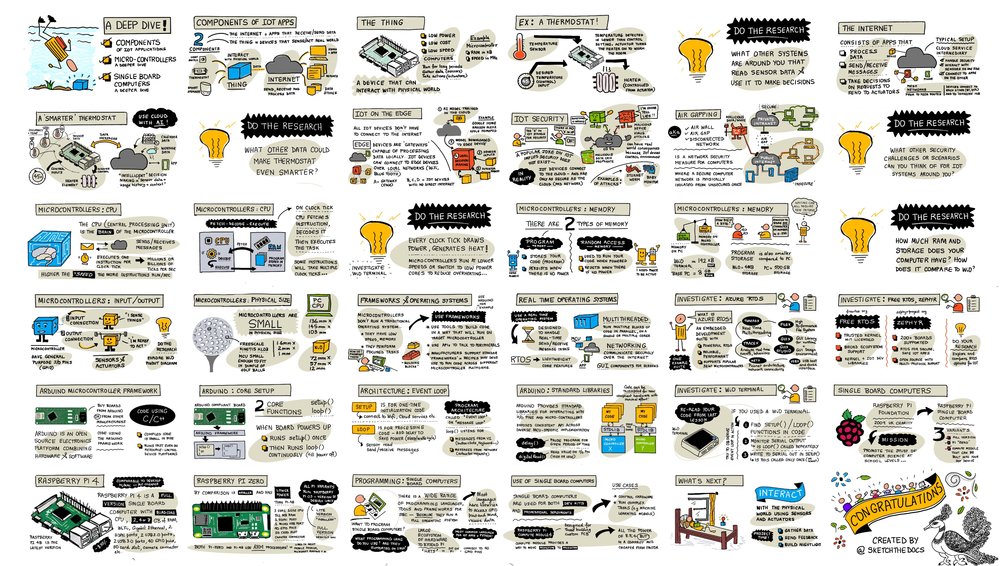
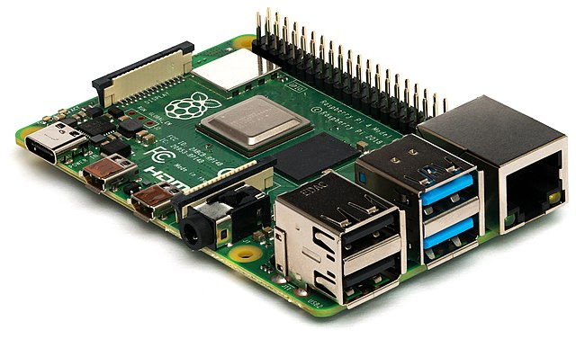
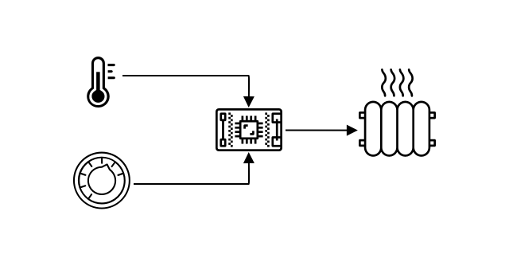
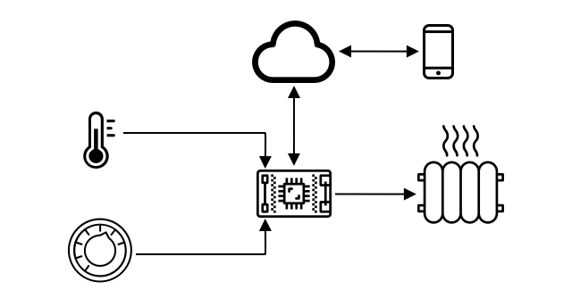
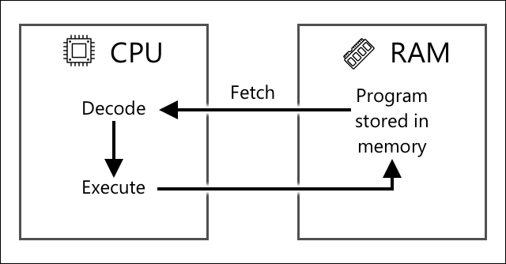
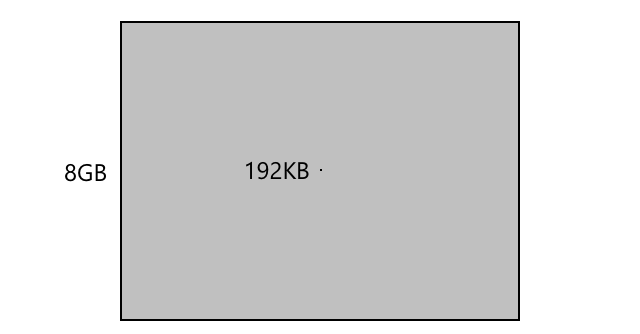
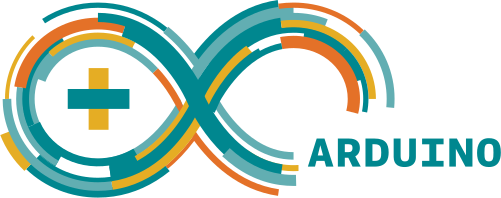
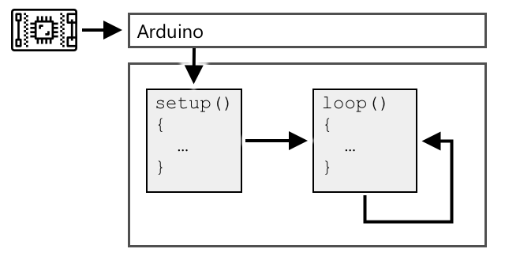
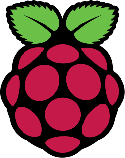
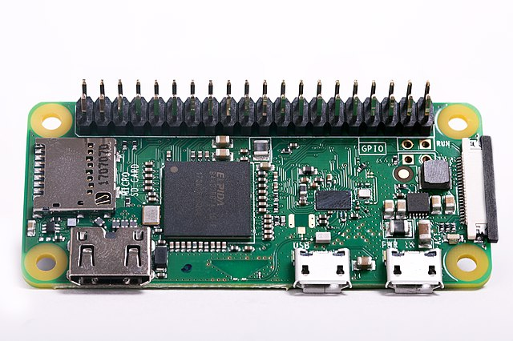

# A deeper dive into IoT

> Sketchnote by [Nitya Narasimhan](https://github.com/nitya). Click the image for a larger version.

This lesson was taught as part of the [Hello IoT series](https://youtube.com/playlist?list=PLmsFUfdnGr3xRts0TIwyaHyQuHaNQcb6-) from the [Microsoft Reactor](https://developer.microsoft.com/reactor/?WT.mc_id=academic-17441-jabenn). The lesson was taught as 2 videos - a 1 hour lesson, and a 1 hour office hour diving deeper into parts of the lesson and answering questions.

> 🎥 Click the images above to watch the videos

## Pre-lecture quiz

[Pre-lecture quiz](https://brave-island-0b7c7f50f.azurestaticapps.net/quiz/3)

## Introduction

This lesson dives deeper into some of the concepts covered in the last lesson.

In this lesson we'll cover:

* [Components of an IoT application](#components-of-an-iot-application)
* [Deeper dive into microcontrollers](#deeper-dive-into-microcontrollers)
* [Deeper dive into single-board computers](#deeper-dive-into-single-board-computers)

## Components of an IoT application

The two components of an IoT application are the *Internet* and the *thing*. Let's look at these two components in a bit more detail.

### The Thing

The **Thing** part of IoT refers to a device that can interact with the physical world. These devices are usually small, low-priced computers, running at low speeds and using low power - for example, simple microcontrollers with kilobytes of RAM (as opposed to gigabytes in a PC) running at only a few hundred megahertz (as opposed to gigahertz in a PC), but consuming sometimes so little power they can run for weeks, months or even years on batteries.

These devices interact with the physical world, either by using sensors to gather data from their surroundings or by controlling outputs or actuators to make physical changes. The typical example of this is a smart thermostat - a device that has a temperature sensor, a means to set a desired temperature such as a dial or touchscreen, and a connection to a heating or cooling system that can be turned on when the temperature detected is outside the desired range. The temperature sensor detects that the room is too cold and an actuator turns the heating on.

There are a huge range of different things that can act as IoT devices, from dedicated hardware that senses one thing, to general purpose devices, even your smartphone! A smartphone can use sensors to detect the world around it, and actuators to interact with the world - for example using a GPS sensor to detect your location and a speaker to give you navigation instructions to a destination.

✅ Think of other systems you have around you that read data from a sensor and use that to make decisions. One example would be the thermostat on an oven. Can you find more?

### The Internet

The **Internet** side of an IoT application consists of applications that the IoT device can connect to send and receive data, as well as other applications that can process the data from the IoT device and help make decisions on what requests to send to the IoT devices actuators.

One typical setup would be having some kind of cloud service that the IoT device connects to, and this cloud service handles things like security, as well as receiving messages from the IoT device, and sending messages back to the device. This cloud service would then connect to other applications that can process or store sensor data, or use the sensor data with data from other systems to make decisions.

Devices also don't always connect directly to the Internet themselves via WiFi or wired connections. Some devices use mesh networking to talk to each other over technologies such as Bluetooth, connecting via a hub device that has an Internet connection.

With the example of a smart thermostat, the thermostat would connect using home WiFi to a cloud service running in the cloud. It would send the temperature data to this cloud service, and from there it will be written to a database of some kind allowing the homeowner to check the current and past temperatures using a phone app. Another service in the cloud would know what temperature the homeowner wants, and send messages back to the IoT device via the cloud service to tell the heating system to turn on or off.

An even smarter version could use AI in the cloud with data from other sensors connected to other IoT devices such as occupancy sensors that detect what rooms are in use, as well as data such as weather and even your calendar, to make decisions on how to set the temperature in a smart fashion. For example, it could turn your heating off if it reads from your calendar you are on vacation, or turn off the heating on a room by room basis depending on what rooms you use, learning from the data to be more and more accurate over time.

✅ What other data could help make an Internet connected thermostat smarter?

### IoT on the Edge

Although the I in IoT stands for Internet, these devices don't have to connect to the Internet. In some cases, devices can connect to 'edge' devices - gateway devices that run on your local network meaning you can process data without making a call over the Internet. This can be faster when you have a lot of data or a slow Internet connection, it allows you to run offline where Internet connectivity is not possible such as on a ship or in a disaster area when responding to a humanitarian crisis, and allows you to keep data private. Some devices will contain processing code created using cloud tools and run this locally to gather and respond to data without using an Internet connection to make a decision.

One example of this is a smart home device such as an Apple HomePod, Amazon Alexa, or Google Home, which will listen to your voice using AI models trained in the cloud, but running locally on the device. These devices will 'wake up' when a certain word or phrase is spoken, and only then send your speech over the Internet for processing. The device will stop sending speech at an appropriate point such as when it detects a pause in your speech. Everything you say before waking up the device with the wake word, and everything you say after the device has stopped listening will not be sent over the internet to the device provider, and therefore will be private.

✅ Think of other scenarios where privacy is important so processing of data would be better done on the edge rather than in the cloud. As a hint - think about IoT devices with cameras or other imaging devices on them.

### IoT Security

With any Internet connection, security is an important consideration. There is an old joke that 'the S in IoT stands for Security' -  there is no 'S' in IoT, implying it is not secure.

IoT devices connect to a cloud service, and therefore are only as secure as that cloud service - if your cloud service allows any device to connect then malicious data can be sent, or virus attacks can take place. This can have very real world consequences as IoT devices interact and control other devices. For example, the [Stuxnet worm](https://wikipedia.org/wiki/Stuxnet) manipulated valves in centrifuges to damage them. Hackers have also taken advantage of [poor security to access baby monitors](https://www.npr.org/sections/thetwo-way/2018/06/05/617196788/s-c-mom-says-baby-monitor-was-hacked-experts-say-many-devices-are-vulnerable) and other home surveillance devices.

> 💁 Sometimes IoT devices and edge devices run on a network completely isolated from the Internet to keep the data private and secure. This is known as [air-gapping](https://wikipedia.org/wiki/Air_gap_(networking)).

## Deeper dive into microcontrollers

In the last lesson, we introduced microcontrollers. Let's now look deeper into them.

### CPU

The CPU is the 'brain' of the microcontroller. It is the processor that runs your code and can send data to and receive data from any connected devices. CPUs can contain one or more cores - essentially one or more CPUs that can work together to run your code.

CPUs rely on a clock to tick many millions or billions of times a second. Each tick, or cycle, synchronizes the actions that the CPU can take. With each tick, the CPU can execute an instruction from a program, such as to retrieve data from an external device or perform a mathematical calculation. This regular cycle allows for all actions to be completed before the next instruction is processed.

The faster the clock cycle, the more instructions that can be processed each second, and therefore the faster the CPU. CPU speeds are measured in [Hertz (Hz)](https://wikipedia.org/wiki/Hertz), a standard unit where 1 Hz means one cycle or clock tick per second.

> 🎓 CPU speeds are often given in MHz or GHz. 1MHz is 1 million Hz, 1GHz is 1 billion Hz.

> 💁 CPUs execute programs using the [fetch-decode-execute cycle](https://wikipedia.org/wiki/Instruction_cycle). For every clock tick, the CPU will fetch the next instruction from memory, decode it, then execute it such as using an arithmetic logic unit (ALU) to add 2 numbers. Some executions will take multiple ticks to run, so the next cycle will run at the next tick after the instruction has completed.

Microcontrollers have much lower clock speeds than desktop or laptop computers, or even most smartphones. The Wio Terminal for example has a CPU that runs at 120MHz or 120,000,000 cycles per second.

✅ An average PC or Mac has a CPU with multiple cores running at multiple GigaHertz, meaning the clock ticks billions of times a second. Research the clock speed of your computer and compare how many times faster it is than the Wio terminal.

Each clock cycle draws power and generates heat. The faster the ticks, the more power consumed and more heat generated. PC's have heat sinks and fans to remove heat, without which they would overheat and shut down within seconds. Microcontrollers often have neither as they run much cooler and therefore much slower. PC's run off mains power or large batteries for a few hours, microcontrollers can run for days, months, or even years off small batteries. Microcontrollers can also have cores that run at different speeds, switching to slower low power cores when the demand on the CPU is low to reduce power consumption.

> 💁 Some PCs and Macs are adopting the same mix of fast high power cores and slower low power cores, switching to save battery. For example, the M1 chip in the latest Apple laptops can switch between 4 performance cores and 4 efficiency cores to optimize battery life or speed depending on the task being run.

✅ Do a little research: Read up on CPUs on the [Wikipedia CPU article](https://wikipedia.org/wiki/Central_processing_unit)

#### Task

Investigate the Wio Terminal.

If you are using a Wio Terminal for these lessons, try to find the CPU. Find the *Hardware Overview* section of the [Wio Terminal product page](https://www.seeedstudio.com/Wio-Terminal-p-4509.html) for a picture of the internals, and try to find the CPU through the clear plastic window on the back.

### Memory

Microcontrollers usually have two types of memory - program memory and random-access memory (RAM).

Program memory is non-volatile, which means whatever is written to it stays when there is no power to the device. This is the memory that stores your program code.

RAM is the memory used by the program to run, containing variables allocated by your program and data gathered from peripherals. RAM is volatile, when the power goes out the contents are lost, effectively resetting your program.

> 🎓 Program memory stores your code and stays when there is no power.

> 🎓 RAM is used to run your program and is reset when there is no power

Like with the CPU, the memory on a microcontroller is orders of magnitude smaller than a PC or Mac. A typical PC might have 8 Gigabytes (GB) of RAM, or 8,000,0000,000 bytes, with each byte enough space to store a single letter or a number from 0-255. A microcontroller would have only Kilobytes (KB) of RAM, with a kilobyte being 1,000 bytes. The Wio terminal mentioned above has 192KB of RAM, or 192,000 bytes - more than 40,000 times less than an average PC!

The diagram below shows the relative size difference between 192KB and 8GB - the small dot in the center represents 192KB.

Program storage is also smaller than a PC. A typical PC might have a 500GB hard drive for program storage, whereas a microcontroller might have only kilobytes or maybe a few megabytes (MB) of storage (1MB is 1,000KB, or 1,000,000 bytes). The Wio terminal has 4MB of program storage.

✅ Do a little research: How much RAM and storage does the computer you are using to read this have? How does this compare to a microcontroller?

### Input/Output

Microcontrollers need input and output (I/O) connections to read data from sensors and send control signals to actuators. They usually contain a number of general-purpose input/output (GPIO) pins. These pins can be configured in software to be input (that is they receive a signal), or output (they send a signal).

🧠⬅️ Input pins are used to read values from sensors

🧠➡️ Output pins send instructions to actuators

✅ You'll learn more about this in a subsequent lesson.

#### Task

Investigate the Wio Terminal.

If you are using a Wio Terminal for these lessons, find the GPIO pins. Find the *Pinout diagram* section of the [Wio Terminal product page](https://www.seeedstudio.com/Wio-Terminal-p-4509.html) to learn which pins are which. The Wio Terminal comes with a sticker you can mount on the back with pin numbers, so add this now if you haven't already.

### Physical size

Microcontrollers are typically small in size, with the smallest, a [Freescale Kinetis KL03 MCU is small enough to fit in the dimple of a golf ball](https://www.edn.com/tiny-arm-cortex-m0-based-mcu-shrinks-package/). Just the CPU in a PC can measure 40mm x 40mm, and that's not including the heat sinks and fans needed to ensure the CPU can run for more than a few seconds without overheating, substantially larger than a complete microcontroller. The Wio terminal developer kit with a microcontroller, case, screen and a range of connections and components isn't much bigger than a bare Intel i9 CPU, and substantially smaller than the CPU with a heat sink and fan!

| Device                          | Size                  |
| ------------------------------- | --------------------- |
| Freescale Kinetis KL03          | 1.6mm x 2mm x 1mm     |
| Wio terminal                    | 72mm x 57mm x 12mm    |
| Intel i9 CPU, Heat sink and fan | 136mm x 145mm x 103mm |

### Frameworks and operating systems

Due to their low speed and memory size, microcontrollers don't run an operating system (OS) in the desktop sense of the word. The operating system that makes your computer run (Windows, Linux or macOS) needs a lot of memory and processing power to run tasks that are completely unnecessary for a microcontroller. Remember that microcontrollers are usually programmed to perform one or more very specific tasks, unlike a general purpose computer like a PC or Mac that needs to support a user interface, play music or movies, provide tools to write documents or code, play games, or browse the Internet.

To program a microcontroller without an OS you do need some tooling to allow you to build your code in a way that the microcontroller can run, using APIs that can talk to any peripherals. Each microcontroller is different, so manufacturers normally support standard frameworks which allow you to follow a standard 'recipe' to build your code and have it run on any microcontroller that supports that framework.

You can program microcontrollers using an OS - often referred to as a real-time operating system (RTOS), as these are designed to handle sending data to and from peripherals in real time. These operating systems are very lightweight and provide features such as:

* Multi-threading, allowing your code to run more than one block of code at the same time, either on multiple cores or by taking turns on one core
* Networking to allow communicating over the Internet securely
* Graphical user interface (GUI) components for building user interfaces (UI) on devices that have screens.

✅ Read up on some different RTOSes: [Azure RTOS](https://azure.microsoft.com/services/rtos/?WT.mc_id=academic-17441-jabenn), [FreeRTOS](https://www.freertos.org), [Zephyr](https://www.zephyrproject.org)

#### Arduino

[Arduino](https://www.arduino.cc) is probably the most popular microcontroller framework, especially among students, hobbyists and makers. Arduino is an open source electronics platform combining software and hardware. You can buy Arduino compatible boards from Arduino themselves or from other manufacturers, then code using the Arduino framework.

Arduino boards are coded in C or C++. Using C/C++ allows your code to be compiled very small and run fast, something needed on a constrained device such as a microcontroller. The core of an Arduino application is referred to as a sketch and is C/C++ code with 2 functions - `setup` and `loop`. When the board starts up, the Arduino framework code will run the `setup` function once, then it will run the `loop` function again and again, running it continuously until the power is powered off.

You would write your setup code in the `setup` function, such as connecting to WiFi and cloud services or initializing pins for input and output. Your loop code would then contain processing code, such as reading from a sensor and sending the value to the cloud. You would normally include a delay in each loop, for example, if you only want sensor data to be sent every 10 seconds you would add a delay of 10 seconds at the end of the loop so the microcontroller can sleep, saving power, then run the loop again when needed 10 seconds later.

✅ This program architecture is known as an *event loop* or *message loop*. Many applications use this under the hood and is the standard for most desktop applications that run on OSes like Windows, macOS or Linux. The `loop` listens for messages from user interface components such as buttons, or devices like the keyboard, and responds to them. You can read more in this [article on the event loop](https://wikipedia.org/wiki/Event_loop).

Arduino provides standard libraries for interacting with microcontrollers and the I/O pins, with different implementations under the hood to run on different microcontrollers. For example, the [`delay` function](https://www.arduino.cc/reference/en/language/functions/time/delay/) will pause the program for a given period of time, the [`digitalRead` function](https://www.arduino.cc/reference/en/language/functions/digital-io/digitalread/) will read a value of `HIGH` or `LOW` from the given pin, regardless of which board the code is run on. These standard libraries mean that Arduino code written for one board can be recompiled for any other Arduino board and will run, assuming that the pins are the same and the boards support the same features.

There is a large ecosystem of third-party Arduino libraries that allow you to add extra features to your Arduino projects, such as using sensors and actuators or connecting to cloud IoT services.

##### Task

Investigate the Wio Terminal.

If you are using a Wio Terminal for these lessons, re-read the code you wrote in the last lesson. Find the `setup` and `loop` function. Monitor the serial output for the loop function being called repeatedly. Try adding code to the `setup` function to write to the serial port and observe that this code is only called once each time you reboot. Try rebooting your device with the power switch on the side to show this is called each time the device reboots.

## Deeper dive into single-board computers

In the last lesson, we introduced single-board computers. Let's now look deeper into them.

### Raspberry Pi

The [Raspberry Pi Foundation](https://www.raspberrypi.org) is a charity from the UK founded in 2009 to promote the study of computer science, especially at school level. As part of this mission, they developed a single-board computer, called the Raspberry Pi. Raspberry Pis are currently available in 3 variants - a full size version, the smaller Pi Zero, and a compute module that can be built into your final IoT device.

The latest iteration of the full size Raspberry Pi is the Raspberry Pi 4B. This has a quad-core (4 core) CPU running at 1.5GHz, 2, 4, or 8GB of RAM, gigabit ethernet, WiFi, 2 HDMI ports supporting 4k screens, an audio and composite video output port, USB ports (2 USB 2.0, 2 USB 3.0), 40 GPIO pins, a camera connector for a Raspberry Pi camera module, and an SD card slot. All this on a board that is 88mm x 58mm x 19.5mm and is powered by a 3A USB-C power supply. These start at US$35, much cheaper than a PC or Mac.

> 💁 There is also a Pi400 all in one computer with a Pi4 built into a keyboard.

The Pi Zero is much smaller, with lower power. It has a single core 1GHz CPU, 512MB of RAM, WiFi (in the Zero W model), a single HDMI port, a micro-USB port, 40 GPIO pins, a camera connector for a Raspberry Pi camera module, and an SD card slot. It measures 65mm x 30mm x 5mm, and draws very little power. The Zero is US$5, with the W version with WiFi US$10.

> 🎓 The CPUs in both of these are ARM processors, as opposed to the Intel/AMD x86 or x64 processors you find in most PCs and Macs. These are similar to the CPUs you find in some microcontrollers, as well as nearly all mobile phones, the Microsoft Surface X, and the new Apple Silicon based Apple Macs.

All variants of the Raspberry Pi run a version of Debian Linux called Raspberry Pi OS. This is available as a lite version with no desktop, which is perfect for 'headless' projects where you don't need a screen, or a full version with a full desktop environment, with web browser, office applications, coding tools and games. As the OS is a version of Debian Linux, you can install any application or tool that runs on Debian and is built for the ARM processor inside the Pi.

#### Task

Investigate the Raspberry Pi.

If you are using a Raspberry Pi for these lessons, read up about the different hardware components on the board.

* You can find details on the processors used on the [Raspberry Pi hardware documentation page](https://www.raspberrypi.org/documentation/hardware/raspberrypi/). Read up on the processor used in the Pi you are using.
* Locate the GPIO pins. Read more about them on the [Raspberry Pi GPIO documentation](https://www.raspberrypi.org/documentation/hardware/raspberrypi/gpio/README.md). Use the [GPIO Pin Usage guide](https://www.raspberrypi.org/documentation/usage/gpio/README.md) to identify the different pins on your Pi.

### Programming single-board computers

Single-board computers are full computers, running a full OS. This means there is a wide range of programming languages, frameworks and tools you can use to code them, unlike microcontrollers which rely on support for the board in frameworks like Arduino. Most programming languages have libraries that can access the GPIO pins to send and receive data from sensors and actuators.

✅ What programming languages are you familiar with? Are they supported on Linux?

The most common programming language for building IoT applications on a Raspberry Pi is Python. There is a huge ecosystem of hardware designed for the Pi, and nearly all of these include the relevant code needed to use them as Python libraries. Some of these ecosystems are based off 'hats' - so called because they sit on top of the Pi like a hat and connect with a large socket to the 40 GPIO pins. These hats provide additional capabilities, such as screens, sensors, remote controlled cars, or adapters to allow you to plug in sensors with standardized cables

### Use of single-board computers in professional IoT deployments

Single-board computers are used for professional IoT deployments, not just as developer kits. They can provide a powerful way to control hardware and run complex tasks such as running machine learning models. For example, there is a [Raspberry Pi 4 compute module](https://www.raspberrypi.org/blog/raspberry-pi-compute-module-4/) that provides all the power of a Raspberry Pi 4 but in a compact and cheaper form factor without most of the ports, designed to be installed into custom hardware.

---

## 🚀 Challenge

The challenge in the last lesson was to list as many IoT devices as you can that are in your home, school or workplace. For every device in this list, do you think they are built around microcontrollers or single-board computers, or even a mixture of both?

## Post-lecture quiz

[Post-lecture quiz](https://brave-island-0b7c7f50f.azurestaticapps.net/quiz/4)

## Review & Self Study

* Read the [Arduino getting started guide](https://www.arduino.cc/en/Guide/Introduction) to understand more about the Arduino platform.
* Read the [introduction to the Raspberry Pi 4](https://www.raspberrypi.org/products/raspberry-pi-4-model-b/) to learn more about Raspberry Pis.
* Learn more on some of the concepts and acronyms in the [What the FAQ are CPUs, MPUs, MCUs, and GPUs article in the Electrical Engineering Journal](https://www.eejournal.com/article/what-the-faq-are-cpus-mpus-mcus-and-gpus/).

✅ Use these guides, along with the costs shown by following the links in the [hardware guide](../../../hardware.md) to decide on what hardware platform you want to use, or if you would rather use a virtual device.

## Assignment

[Compare and contrast microcontrollers and single-board computers](assignment.md)
