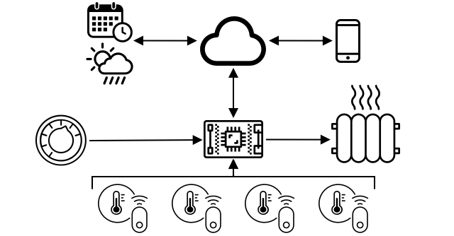

# IoT에 대한 심화 학습

> Nitya Narasumhan의 스케치 노트. 클릭하시면 이미지를 더 크게 보실 수 있습니다.

이 수업은 [Microsoft Reactor](https://developer.microsoft.com/reactor/?WT.mc_id=academic-17441-jabenn)에서 [Hello IoT series](https://youtube.com/playlist?list=PLmsFUfdnGr3xRts0TIwyaHyQuHaNQcb6-) 의 일부로 제공되었습니다. 이 수업은 1시간짜리 수업과 1시간짜리의 강의에 대한 집중탐구 및 질의 응답으로 총 2개의 비디오로 구성되어 있습니다.

> 🎥 상단의 이미지를 클릭하여 비디오를 시청하실 수 있습니다.

## 강의 전 퀴즈

[강의 전 퀴즈](https://black-meadow-040d15503.1.azurestaticapps.net/quiz/3)

## 개요

이 수업은 지난 수업에 다뤘던 개념의 일부에 대한 심화 학습입니다.

이 단원에서는 다음을 다룹니다:

- [IoT 애플리케이션의 구성 요소](#iot-애플리케이션의-구성-요소)
- [마이크로컨트롤러 심화 학습](#마이크로컨트롤러-심화-학습)
- [싱글 보드 컴퓨터 심화 학습](#싱글-보드-컴퓨터-심화-학습)

## IoT 애플리케이션의 구성 요소

IoT를 구성하는 2개의 요소는 _인터넷_ 과 _사물_ 입니다. 이 두 가지 구성요소에 대해 조금 더 자세히 살펴보도록 하겠습니다.

### 사물

**사물**은 IoT의 한 부분으로서 물리적인 세계와 상호작용할 수 있는 장치를 의미합니다. 이러한 장치들은 일반적으로 낮은 전력을 소비하며 느린 속도로 돌아가는 저렴하고 작은 컴퓨터입니다. - 예를 들어, 수백 메가헤르츠(PC의 기가헤르츠와 달리)의 RAM(PC의 기가바이트가 아닌)에 불과하지만 때때로 배터리를 사용하여 몇 주, 몇 달, 심지어 1년 동안 작동할 수 있는 매우 적은 전력을 소비하는 간단한 마이크로컨트롤러입니다.

이러한 장치는 센서를 사용하여 자신의 주변 환경에서 데이터를 수집하거나, 출력 또는 액추에이터를 제어하여 물리적 변경을 수행함으로써 물리적 세계와 상호 작용합니다. 이러한 장치의 전형적인 예시는 스마트 온도 조절기입니다. 스마트 온도 조절기는 온도 센서, 다이얼 또는 터치스크린과 같은 원하는 온도를 설정하기 위한 수단, 감지된 온도가 원하는 범위를 벗어날 때 켜질 수 있는 냉난방 시스템에 대한 연결을 갖는 장치입니다. 온도 센서가 실내가 너무 춥다는 것을 감지하면 액추에이터가 난방을 켭니다.

IoT 장치로 동작할 수 있는 다른 사물들은 한 가지를 감지하는 전용 하드웨어로부터, 심지어는 당신의 스마트폰과 같은 범용 기기들을 포함하는 넓은 범위를 갖습니다! 스마트폰은 우리 주변을 감지하는 센서로 사용할 수 있고, 세상과 상호작용하기 위한 액추에이터로도 사용할 수 있습니다. 예를 들어, 당신의 위치를 감지하기 위해 GPS 센서를 사용하고 스피커를 사용하여 당신에게 목적지까지의 길을 안내합니다.

✅ 센서에서 데이터를 읽고 이를 사용하여 결정을 내리는 주변의 다른 시스템을 생각해 보십시오. 오븐의 온도 조절 장치를 하나의 예로 들을 수 있습니다. 다른 예시를 더 찾을 수 있습니까?

### 인터넷

IoT 애플리케이션의 **인터넷** 측면은 IoT 장치가 데이터를 송수신하기 위해 연결할 수 있는 애플리케이션뿐만 아니라 IoT 장치의 데이터를 처리하고 IoT 장치 액추에이터에 보낼 요청을 결정하는 데 도움을 줄 수 있는 다른 애플리케이션으로 구성됩니다.

일반적인 설정 중 하나는 IoT 장치가 연결되는 일종의 클라우드 서비스를 갖는 것이고, 이러한 클라우드 서비스는 IoT 장치에서 메시지를 수신하고 장치로 메시지를 다시 보내는 것뿐만 아니라 보안과 같은 것들을 처리합니다. 이 클라우드 서비스는 센서의 데이터를 처리하거나 저장하는 다른 애플리케이션들에 연결하거나 다른 시스템으로 부터 얻은 데이터와 센서의 데이터를 사용하여 결정을 내리는 데에 사용합니다.

장치들이 항상 WiFi나 유선 연결을 통해 인터넷에 직접 연결되는 것은 아닙니다. 일부 장치들은 인터넷에 연결된 허브 장치를 통해 연결하는 블루투스 같은 기술을 통해 서로 대화하기 위해 메시 네트워킹을 사용합니다.

스마트 온도 조절기의 예시를 살펴보면, 온도 조절기는 가정의 WiFi를 통해 클라우드에서 실행되는 클라우스 서비스에 연결합니다. 온도 조절기는 이 클라우드 서비스에 온도 데이터를 보내고, 클라우드에서는 휴대폰의 앱을 사용하여 집주인이 현재와 과거의 온도를 확인 할 수 있도록하는 데이터베이스에 기록됩니다. 클라우드의 다른 서비스에서는 집주인이 원하는 온도를 인지하고 클라우드 서비스를 통해 IoT 장치에 메시지를 보내 난방 시스템을 켜거나 끄도록 명령합니다.

더욱 스마트한 버전에서는 사용 중인 방을 감지하는 점유 센서와 같은 다른 IoT 장치에 연결된 다른 센서의 데이터와 날씨 및 캘린더와 같은 데이터와 함께 클라우드의 AI를 사용하여 어떻게 온도를 영리하게 설정할 것인지 결정할 수 있습니다. 예를 들어, 당신이 휴가 중이라는 사실을 당신의 캘린더에서 읽어와 난방을 끈다든지, 당신이 사용하는 방에 따라 난방을 끈다든지, 시간이 지남에 따라 데이터로부터 학습하여 더욱 더 정확해질 수 있습니다.

✅ 인터넷이 연결된 온도 조절기를 좀 더 스마트하게 만드는 다른 데이터에는 무엇이 있습니까?

### Edge에서의 IoT

IoT에서 I 는 인터넷을 의미하지만, 이러한 장치들은 반드시 인터넷에 연결될 필요는 없습니다. 경우에 따라 장치들은 ‘edge’ 장치에 연결할 수 있습니다. ‘edge’는 당신의 로컬 네트워크에서 동작하는 게이트웨이 장치로 인터넷을 통해 전화를 걸지 않고도 데이터를 처리할 수 있습니다. 이는 데이터가 많거나 인터넷 연결이 느릴 때 더 빠를 수 있으며, 인도적 위기에 대응할 때 선박이나 재난 지역과 같이 인터넷 연결이 불가능한 곳에서 오프라인으로 실행할 수 있게 해주며, 데이터를 비공개로 유지할 수 있도록 해줍니다. 일부 장치에는 클라우드 도구를 사용하여 생성된 처리 코드가 포함되어 있으며, 결정을 내리기 위해 이를 로컬에서 실행하여 인터넷 연결을 사용하지 않고 데이터를 수집하고 응답합니다.

하나의 예시로 Apple의 Homepod, Amazon의 Alexa, Google Home과 같은 스마트 홈 디바이스들은 당신의 목소리를 클라우드에서 학습된 AI 모델로 듣지만 디바이스에서 로컬 환경으로 동작합니다. 이러한 디바이스들은 특정한 단어나 구문을 말할 때 ‘깨어나’게 되고 처리를 위해 당신의 음성을 인터넷을 통해 전송합니다. 이 장치들은 당신이 말하는 것을 멈추는 것을 감지하는 경우와 같은 적절한 시점에서 음성을 전송하는 것을 멈춥니다. 깨우기 단어로 장치를 깨우기 전에 말하는 모든 내용과 장치가 듣기를 멈춘 뒤 말하는 모든 내용은 인터넷을 통해 장치 공급자에게 전송되지 않으므로 비공개됩니다.

✅ 개인 정보의 중요성에 의해 클라우드보다 edge에서 수행하는 것이 더 나은 다른 시나리오를 생각해 보십시오. 힌트를 드리자면, 카메라나 다른 이미징 장치를 가지고 있는 IoT 장치를 생각해 보십시오.

### IoT 보안

모든 인터넷 연결에서 보안은 아주 중요한 고려사항입니다. ‘IoT의 S는 보안을 의미한다’라는 오래된 농담이 있습니다. IoT에는 ‘S’가 없으므로 안전하지 않다는 뜻입니다.

IoT 장치들은 클라우드 서비스에 연결되어 있으므로 해당 클라우드 서비스만큼 안전합니다. 만약 당신의 클라우드 서비스가 어떤 장치에 연결되도록 허용한다면, 악의적인 데이터가 전송되거나 바이러스 공격이 발생할 수 있습니다. 이는 IoT 장치가 다른 장치와 상호 작용하고 제어할 때 매우 실제적인 결과를 초래할 수 있습니다. 예를 들어, [Stuxnet worm](https://wikipedia.org/wiki/Stuxnet) 은 원심분리기의 밸브를 조작하여 밸브를 손상시킵니다. 해커들은 또한 [열악한 보안을 이용해 아기 모니터](https://www.npr.org/sections/thetwo-way/2018/06/05/617196788/s-c-mom-says-baby-monitor-was-hacked-experts-say-many-devices-are-vulnerable)와 다른 가정용 감시 장치에 접근했습니다.

> 💁 일부 IoT 장치들과 edge 장치들은 데이터를 안전하고 비공개로 유지하기 위해 네트워크에서 인터넷과 완전히 고립된 상태로 동작합니다. 이것은 air-gapping 이라고 불립니다.

## 마이크로컨트롤러 심화 학습

지난 수업에서 우리는 마이크로컨트롤러를 소개했습니다. 이제 그것에 대해 더 자세히 알아봅시다.

### CPU

CPU는 마이크로컨트롤러의 ‘두뇌‘입니다. 이것은 당신의 코드를 실행하고 다른 연결된 장치들에 데이터를 송수신하는 처리장치입니다. CPU는 하나 이상의 코어를 포함할 수 있습니다. 필수적으로 하나 이상의 CPU들이 당신의 코드를 실행하기 위해 함께 동작할 수 있습니다.

CPU는 클럭에 의존하여 초당 수백만 또는 수십억 번 tick합니다. 각 tick 또는 주기는 CPU가 수행할 수 있는 작업과 동기화합니다. 각 tick마다 CPU는 외부 장치에서 데이터를 검색하거나 수학적 계산을 수행하는 것과 같이 프로그램에서 명령을 실행할 수 있습니다. 이 규칙적인 사이클을 통해 다음 명령이 처리되기 전에 모든 작업을 완료할 수 있습니다.

클럭 주기가 빠를수록 초당 처리할 수 있는 명령어가 많아지므로 CPU가 빨라집니다. CPU 속도는 [헤르츠(Hz)](https://wikipedia.org/wiki/Hertz)로 측정되는데, 1Hz는 초당 1 사이클 또는 클럭 tick을 의미하는 표준 단위입니다.

> 🎓 CPU의 속도는 주로 MHz 또는 GHz로 주어집니다. 1MHz는 100만 Hz이고, 1GHz는 10억Hz입니다.

> 💁 CPU는 프로그램을 페치-디코딩-실행 사이클을 사용하여 실행합니다. 클럭의 tick마다 CPU는 메모리로부터 다음 명령어를 가져오고, 그것을 디코딩하고, 두 숫자를 더하기 위해 산술논리연산장치(ALU)를 사용하는 것과 같이 그것을 실행합니다. 몇몇 실행은 동작하는 데에 다수의 tick이 필요하므로 다음 사이클은 명령이 완료된 이후의 다음 tick에서 실행됩니다.

마이크로컨트롤러는 데스크탑이나 노트북 컴퓨터, 심지어 대부분의 스마트폰보다 훨씬 낮은 클럭 속도를 가집니다. 예를 들어 Wio Terminal은 120MHz 또는 초당 120,000,000 사이클에서 실행되는 CPU를 가집니다.

✅ 일반적인 PC 또는 Mac에는 여러 기가헤르츠에서 실행되는 다중 코어가 있는 CPU가 있습니다. 이는 클럭이 초당 수십억 번 tick한다는 의미입니다. 당신의 컴퓨터의 클럭 속도를 조사하고 Wio Terminal보다 몇 배나 빠른지 비교하십시오.

각각의 클럭 사이클은 전력을 끌어오고 열을 생성합니다. tick이 더 빠를수록, 더 많은 전력이 소비되고 더 많은 열을 발생시킵니다. PC는 열을 제거하기 위한 방열판과 팬들을 가지고 있으며, 이 기능이 없다면 과열되어 수 초만에 종료됩니다. 마이크로컨트롤러는 훨씬 더 낮은 온도에서 실행되고 따라서 훨씬 느리게 동작하기 때문에 둘 다 없는 경우도 있습니다. PC는 주 전원이나 대용량 배터리로 몇 시간 동안만 작동하며, 마이크로컨트롤러는 작은 배터리로 며칠, 몇 달 또는 몇 년 동안 작동할 수 있습니다. 마이크로컨트롤러 또한 다른 속도로 실행되는 코어를 가질 수 있으며, CPU의 수요가 낮을 때 전력 소비를 줄이기 위해 더 느린 저전력 코어로 전환할 수 있습니다.

> 💁 몇몇 PC와 Mac들은 배터리를 절약하기 위해 빠른 고전력 코어와 느린 저전력 코어를 동일하게 혼합하여 사용하고 있습니다. 예를 들어, Apple의 최신 노트북에 들어가는 M1 칩은 4개의 성능 코어와 4개의 효율 코어 사이를 전환해가며 배터리 수명을 최적화하거나 속도를 최적화할 수 있습니다.

✅ 간단한 조사를 해봅시다 : [Wikipedia CPU article](https://wikipedia.org/wiki/Central_processing_unit)에서 CPU에 대해 읽어봅시다.

### 작업

Wio Terminal을 조사하십시오.

당신이 Wio Terminal을 이번 수업을 위해 사용한다면, CPU를 찾아보십시오. 내부 사진을 보려면 [Wio Terminal product page](https://www.seeedstudio.com/Wio-Terminal-p-4509.html) 의 _하드웨어 개요_ 섹션을 찾아 뒷면의 투명한 플라스틱 창을 통해 CPU를 찾으십시오.

### 메모리

마이크로컨트롤러는 대부분 프로그램 메모리와 RAM(Random-Access Memory)의 두 가지 유형의 메모리를 가집니다.

프로그램 메모리는 비휘발성입니다. 즉, 장치에 전원이 공급되지 않더라도 작성된 내용이 유지됩니다. 이것은 프로그램 코드를 저장하는 메모리입니다.

RAM은 프로그램이 실행하는 데 사용하는 메모리로, 프로그램에서 할당한 변수와 주변 장치에서 수집한 데이터를 포함합니다. RAM은 휘발성이며, 전원이 꺼지면 내용이 손실되어 프로그램을 효과적으로 재설정합니다.

> 🎓 프로그램 메모리는 당신의 코드를 저장하고 전원이 들어오지 않는 경우에도 유지합니다.

> 🎓 RAM은 당신의 프로그램을 실행하는 데 사용되며 전원이 차단되면 리셋합니다.

CPU와 마찬가지로, 마이크로컨트롤러의 메모리는 PC나 Mac의 메모리보다 훨씬 작습니다. 일반적인 PC는 8기가바이트(GB) 또는 8,000,000,000 바이트의 램을 가지고 있으며, 각각의 바이트에는 하나의 문자나 0에서 255까지의 숫자를 저장하는 충분한 공간이 있습니다. 마이크로컨트롤러는 킬로바이트(KB)의 램만 있습니다. 킬로바이트는 1,000 바이트를 의미합니다. 위에서 언급된 Wio Terminal은 192KB(192,000 바이트)의 램을 가지고있습니다. 이는 평균적인 PC보다 40,000배 이상 작습니다!

하단의 다이어그램은 192KB와 8GB 사이의 상대적인 크기 차이를 보여줍니다. 중앙의 작은 점이 192KB를 나타냅니다.

프로그램 저장 용량 또한 PC보다 작습니다. 일반적인 PC는 프로그램 저장을 위해 500GB의 하드 드라이브가 존재합니다. 반면에 마이크로컨트롤러는 킬로바이트 또는 몇 메가바이트(1MB는 1,000KB 또는 1,000,000바이트)의 저장 공간이 있을 수 있습니다. Wio Terminal은 4MB의 프로그램 저장 공간이 있습니다.

✅ 간단한 조사를 해봅시다 : 당신이 이것을 읽기 위해 컴퓨터에 얼마나 많은 RAM과 저장공간이 필요할까요? 마이크로컨트롤러와 비교했을 때에는 어떻습니까?

### 입/출력

마이크로컨트롤러는 센서로부터 데이를 읽어오고 액추에이터로 제어 신호를 보내기 위해 입력과 출력(I/O) 연결이 필요합니다. 마이크로컨트롤러는 대부분 다수의 범용 입출력 핀(GPIO)을 포함하고 있습니다. 이러한 핀들은 소프트웨어에서 입력(신호 수신) 또는 출력(신호 전송)으로 구성할 수 있습니다.

🧠⬅️ 입력 핀들은 센서로부터 값을 읽어오는 데에 사용됩니다.

🧠➡️ 출력 핀들은 명령들을 액추에이터에 전송합니다.

✅ 이것에 대해서는 차후의 수업에서 더 자세히 배웁니다.

### 작업

Wio Terminal에 대해 조사하십시오.

만약 이 수업에서 Wio Terminal을 사용하고 있다면, GPIO 핀을 찾아보십시오. 어떤 핀이 어떤 역할을 하는 지에 대해 배우기 위해서는 [Wio Terminal product page](https://www.seeedstudio.com/Wio-Terminal-p-4509.html) 에서 _핀아웃 다이어그램_ 섹션을 찾아보십시오. Wio Terminal에는 핀 번호가 있는 뒷면에 부착할 수 있는 스티커가 함께 제공되므로 아직 부착하지 않았다면 지금 부착하십시오.

### 물리적인 크기

마이크로컨트롤러는 일반적으로 크기가 작으며, 가장 작은 [Freescale Kinetis KL03 MCU](https://www.edn.com/tiny-arm-cortex-m0-based-mcu-shrinks-package/)의 경우 골프공의 딤플에 들어갈 수 있을 정도로 충분히 작습니다. PC의 CPU만 측정했을 경우 40mm x 40mm이며, 여기에는 CPU가 과열 없이 몇 초 이상 작동할 수 있도록 하는 데 필요한 방열판과 팬은 포함되지 않습니다. 이것들은 완전한 마이크로컨트롤러보다도 훨씬 큽니다. Wio Terminal의 개발자 키트는 마이크로컨트롤러, 케이스, 화면, 다양한 연결 및 구성 요소를 포함하고 있으며, Intel의 i9 CPU보다 크지 않고 방열판과 팬이 있는 CPU보다도 훨씬 작습니다.

### 프레임워크와 운영 체제

느린 속도와 메모리 크기 때문에, 마이크로컨트롤러는 데스크탑에서의 운영체제(OS)를 구동하지 않습니다. 컴퓨터를 실행하는 운영 체제(Windows, Linux 또는 macOS)는 마이크로컨트롤러에게는 완전히 불필요한 작업을 실행하기 위해 많은 메모리와 처리 능력을 필요로 합니다. 사용자 인터페이스를 지원하고, 음악이나 영화를 재생하고, 문서나 코드를 작성하거나, 게임을 하거나, 인터넷을 탐색해야 하는 PC나 Mac과 같은 범용 컴퓨터와는 달리 마이크로컨트롤러는 일반적으로 하나 이상의 매우 구체적인 작업을 수행하도록 프로그래밍되어 있습니다.

OS 없이 마이크로컨트롤러를 프로그래밍하기 위해서는 모든 주변 장치와 통신할 수 있는 API를 사용하여 마이크로컨트롤러가 실행할 수 있는 방식으로 코드를 빌드할 수 있는 도구가 필요합니다. 각각의 마이크로컨트롤러는 다르기 때문에 제조업체는 일반적으로 표준 '레시피'를 따라 코드를 빌드하고 해당 프레임워크를 지원하는 모든 마이크로컨트롤러에서 실행할 수 있는 표준 프레임워크를 지원합니다.

실시간 운영 체제(RTOS)라고도 하는 OS를 사용하여 마이크로컨트롤러를 프로그래밍할 수 있습니다. 이러한 OS는 주변 장치와 실시간으로 데이터를 주고받도록 설계되었기 때문입니다. 이러한 운영 체제는 매우 가볍고 다음과 같은 기능을 제공합니다:

- 멀티 쓰레딩, 멀티 또는 싱글 코어에서 차례로 코드를 실행하여 동시에 둘 이상의 코드 블럭을 실행
- 인터넷을 통한 안전한 통신을 가능하게 하는 네트워킹
- 화면이 있는 장치에서 사용자 인터페이스(UI)를 구축하기 위한 GUI(그래픽 사용자 인터페이스)

✅ 다른 RTOS들에 대해 읽어보세요: [Azure RTOS](https://azure.microsoft.com/services/rtos/?WT.mc_id=academic-17441-jabenn), [FreeRTOS](https://www.freertos.org/), [Zephyr](https://www.zephyrproject.org/)

### Arduino

[Arduino](https://www.arduino.cc/) 는 특히나 학생, 취미로 즐기는 사람, 제작자 사이에서 가장 유명한 마이크로컨트롤러 프레임워크일 것입니다. Arduino 소프트웨어와 하드웨어를 결합한 오픈 소스 전자 플랫폼입니다. Arduino 자체 또는 다른 제조업체에서 Arduinod와 호환되는 보드를 구입한 다음 Arduino 프레임워크를 사용하여 코딩할 수 있습니다.

Arduino 보드는 C나 C++로 코딩됩니다. C/C++를 사용하면 코드를 매우 작게 컴파일하고 빠르게 실행할 수 있는데, 이는 마이크로컨트롤러와 같은 제약이 있는 장치에서 필요합니다. Arduino 애플리케이션의 핵심은 스케치라고 불리며, `setup` 과 `loop`라고 하는 두가지 기능을 가진 C/C++ 코드입니다. 보드가 시작되면 Arduino 프레임워크 코드는 `setup`기능을 한 번 실행한 다음 전원이 꺼질 때까지 계속해서 `loop`기능을 계속해서 실행합니다.

WiFi나 클라우드 서비스에 연결하거나 입출력을 위한 핀들을 초기화 하는 설정 코드를 `setup` 함수 안에 작성합니다. loop 코드에는 센서로부터 읽어오거나 클라우드에 값을 전송하는 것과 같은 처리 코드가 포함됩니다. 각각의 loop에는 지연을 포함시킬 수 있는데, 예를 들면 센서 데이터가 10초마다 전송되도록 하기 위해선 루프 끝에 10초 지연을 추가하여 마이크로컨트롤러가 sleep 모드로 전환되어 전력을 절약한 다음, 10초 후에 필요할 때 다시 loop를 실행할 수 있도록 하면 됩니다.

✅ 이 프로그램 아키텍쳐는 _이벤트 루프_ 또는 _메세지 루프_ 로 알려져 있습니다. 많은 애플리케이션들이 이를 내부적으로 사용하며 Windows, macOs, Linux에서 실행되는 대부분의 데스크탑 애플리케이션의 표준입니다. 이 loop는 버튼과 같은 유저 인터페이스의 구성 요소나 키보드와 같은 장치에서 메세지를 수신하고 그들에게 응답합니다. 이 [이벤트 루프에 대한 글](https://en.wikipedia.org/wiki/Event_loop)에서 더 많은 내용을 읽을 수 있습니다.

Arduino는 마이크로 컨트롤러 및 I/O 핀과 상호 작용하기 위한 표준 라이브러리를 제공하며, 서로 다른 마이크로 컨트롤러에서 실행되도록 후드 아래에서 서로 다른 구현을 제공합니다. 예를 들어, [`delay` 함수](https://www.arduino.cc/reference/en/language/functions/time/delay/)는 주어진 시간동안 프로그램을 잠시 중단하고, [`digitalRead` 함수](https://www.arduino.cc/reference/en/language/functions/digital-io/digitalread/)는 코드가 실행되는 보드와 상관없이 주어진 핀으로부터 값이 `HIGH`인지 `LOW`인지 읽어옵니다. 이러한 표준 라이브러리는 핀이 동일하고 보드가 동일한 기능을 지원한다는 가정 하에 특정한 보드를 위해 작성된 Arduino 코드가 다른 어떠한 Arduino 보드에서 재컴파일될 수 있고 실행 가능하다는 것을 의미합니다.

센서 및 액추에이터를 사용하거나 클라우드 IoT 서비스에 연결하는 등 Arduino 프로젝트에 추가 기능을 추가할 수 있는 서드파티 Arduino 라이브러리의 대규모 생태계가 존재합니다.

### 작업

Wio Terminal에 대해 조사하십시오.

만약 이 수업에서 Wio Terminal을 사용하고 있다면, 지난 시간에 작성한 코드를 다시 읽어보십시오. 그리고 `setup` 함수와 `loop` 함수를 찾아보십시오. `loop`함수가 반복적으로 호출되면서 나오는 일련의 출력들을 모니터링 하십시오. 일련의 포트에 작성할 코드를 `setup`함수에 추가하여 재부팅할 때마다 이 코드가 한 번만 호출되는지 확인하십시오. 장치가 재부팅될 때마다 호출된다는 것을 보여주려면 측면에 있는 전원 스위치로 장치를 재부팅하십시오.

## 싱글 보드 컴퓨터 심화 학습

지난 수업에서 우리는 싱글 보드 컴퓨터에 대해 소개했습니다. 더 자세히 알아보도록 합시다.

### Raspberry Pi

[Raspberry Pi Foundation](https://www.raspberrypi.org/)은 특히 학교 수준에서 컴퓨터 과학에 대한 학습을 촉진하기 위해 2009년에 설립된 영국의 자선단체 입니다. 이 임무의 일환으로 그들은 Raspberry Pi라고 불리는 싱글 보드 컴퓨터를 개발하였습니다. Raspberry Pi는 현재 전체 크기 버전, 더 작은 Pi Zero, 최종 IoT 장치에 구축할 수 있는 컴퓨팅 모델의 3가지 종류로 제공됩니다.

풀 사이즈 Raspberry Pi의 가장 최신 버전은 Raspberry Pi 4B입니다. 이것은 1.5GHz의 쿼드코어(4 코어) CPU를 가지고 있으며 2, 4 또는 8GB의 램, 기가비트 이더넷, WiFi, 4k 화면을 지원하는 2개의 HDMI 포트, 오디오 및 컴포지트 비디오 출력 포트, USB 포트들(2개의 USB 2.0, 2개의 USB 3.0)과 40개의 GPIO핀들, Raspberry Pi 카메라 모듈을 위한 카메라 커넥터, SD 카드 슬롯을 가지고 있습니다. 이 모든 것이 88mm x 58mm x 19.5mm 크기의 3A USB-C 전원 공급 장치로 구동되는 보드에 있습니다. PC나 Mac보다 훨씬 저렴한 35달러부터 시작합니다.

> 💁 또한 Pi4가 키보드에 내장된 Pi400 올인원 컴퓨터도 있습니다.

Pi Zero는 훨씬 작고, 더 적은 전력으로 구동 가능 합니다. 이것은 1GHz의 싱글 코어 CPU, 512MB의 램, WiFi(Zero W 모델의 경우), 하나의 HDMI 포트, micro-USB 포트, 40개의 GPIO 핀, Raspberry Pi 카메라 모듈을 위한 카메라 커넥터, SD카드 슬롯을 가지고 있습니다. 이것은 65mm x 30mm x 5mm의 크기를 가지고 있으며, 아주 적은 전력을 소모합니다. Zero 버전은 미화 5달러, WiFi 버전은 미화 10달러입니다.

> 🎓 이 두가지의 CPU는 대부분의 컴퓨터나 Mac에서 찾을 수 있는 Intel/AMD의 x86이나 x64와는 달리 모두 ARM 프로세서입니다. 이는 일부 마이크로컨트롤러뿐만 아니라 거의 모든 휴대폰, Microsoft Surface X 및 새로운 Apple Silicon 기반 Apple Mac에서 볼 수 있는 CPU와 유사합니다.

모든 Raspberry Pi는 Raspberry Pi OS라고 불리는 Debian Linux 버전을 실행합니다. 이것은 화면이 필요하지 않은 '헤드리스' 프로젝트에 적합한 데스크탑이 없는 라이트 버전 또는 웹 브라우저, 사무용 애플리케이션, 코딩 도구 및 게임이 포함된 전체 데스크탑 환경이 있는 정식 버전으로 제공됩니다. OS가 Debian Linux의 한 버전이기 때문에, Pi 내부의 ARM 프로세서용으로 구현된 Debian에서 동작하는 모든 애플리케이션이나 도구를 설치할 수 있습니다.

### 작업

Raspberry Pi에 대해 조사하십시오.

이번 강의를 위해 Raspberry Pi를 사용중이라면, 보드의 다른 하드웨어 구성요소에 대해 읽어 보십시오.

- [Raspberry Pi hardware documentation page](https://www.raspberrypi.org/documentation/hardware/raspberrypi/) 에서 프로세서에 대한 자세한 내용을 찾을 수 있습니다. 당신이 사용중인 Pi에 사용된 프로세서에 대해 읽어보십시오.
- GPIO핀을 찾으십시오. [Raspberry Pi GPIO documentation](https://www.raspberrypi.org/documentation/hardware/raspberrypi/gpio/README.md)에서 더 많은 내용을 읽어보십시오. [GPIO Pin Usage guide](https://www.raspberrypi.org/documentation/usage/gpio/README.md)를 사용하여 Pi의 다른 핀들을 확인하십시오.

### 싱글 보드 컴퓨터 프로그래밍

싱글 보드 컴퓨터는 완전한 OS 실행하는 완전한 컴퓨터입니다. 이것은 Arduino와 같은 프레임워크에서 보드 지원에 의존하는 마이크로컨트롤러와 달리 이를 코딩하는 데 사용할 수 있는 다양한 프로그래밍 언어, 프레임워크 및 도구가 있음을 의미합니다. 대부분의 프로그래밍 언어는 센서와 액추에이터와 데이터를 송수신 하기 위해 GPIO에 접근할 수 있는 라이브러리들을 가지고 있습니다.

✅ 당신이 친숙한 프로그래밍 언어는 무엇인가요? Linux에서 지원되나요?

Raspberry Pi에서 IoT 애플리케이션을 구축하기 위한 가장 일반적인 프로그래밍 언어는 Python입니다. Pi를 위해 설계된 거대한 하드웨어 생태계가 있으며, 이것들의 대부분에는 Python 라이브러리로 사용하는 데 필요한 관련 코드가 포함되어 있습니다. 이러한 생태계 중 일부는 'hats'를 기반으로 합니다. 모자처럼 Pi 위에 앉아서 40개의 GPIO 핀에 큰 소켓을 연결하기 때문에 그렇게 부릅니다. 이 hats는 표준화된 케이블로 센서를 연결할 수 있도록 스크린, 센서, 원격 제어 자동차 또는 어댑터와 같은 추가 기능을 제공합니다.

### 전문적인 IoT 배포에서의 싱글 보드 컴퓨터의 사용

싱글 보드 컴퓨터는 단순한 개발자용 키트 뿐만 아니라, 전문적인 IoT 배포에 사용됩니다. 하드웨어를 제어하거나 머신러닝 모델을 실행하는 등 복잡한 임무를 수행하는 강력한 방법을 제공할 수 있습니다. 예를 들면, [Raspberry Pi 4 compute module](https://www.raspberrypi.org/blog/raspberry-pi-compute-module-4/) 는 Raspberry Pi 4 의 모든 기능을 제공하지만 대부분의 포트가 없는 작고 저렴한 폼 팩터로 사용자 지정 하드웨어에 설치되도록 설계되었습니다.

---

## 🚀 도전

지난 수업의 과제는 당신의 집, 학교, 회사에서 찾아 볼 수 있는 IoT 장치들에 대해 가능한 많이 나열하는 것이었습니다. 이 목록에 있는 모든 장치에 대해 마이크로컨트롤러나 싱글 보드 컴퓨터 또는 두 가지의 합작으로 되어있다고 생각하나요?

## 강의 후 퀴즈

[강의 후 퀴즈](https://black-meadow-040d15503.1.azurestaticapps.net/quiz/4)

## 복습 및 독학

- Arduino 플랫폼에 대한 자세한 내용은 [Arduino 시작 가이드](https://www.arduino.cc/en/Guide/Introduction)를 읽어보십시오.
- Raspberry Pi에 대해 더 배워보려면 [Raspberry Pi 4에 대한 소개](https://www.raspberrypi.org/products/raspberry-pi-4-model-b/)를 읽어보십시오.
- [What the FAQ are CPUs, MPUs, MCUs, and GPUs article in the Electrical Engineering Journal](https://www.eejournal.com/article/what-the-faq-are-cpus-mpus-mcus-and-gpus/)에서 일부 개념과 약어에 대해 더 배우실 수 있습니다.

✅ 이 가이드와 [hardware guide](https://github.com/microsoft/IoT-For-Beginners/blob/main/hardware.md)의 링크를 따라가면 나오는 비용을 고려하여 사용할 하드웨어 플랫폼을 결정하거나 가상 장치를 사용할 지 결정하십시오.

## 과제

[마이크로컨트롤러와 싱글 보드 컴퓨터를 비교하고 대조해보십시오.](assignment.ko.md)
