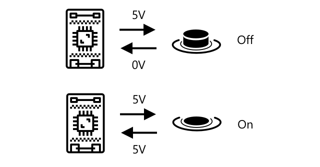
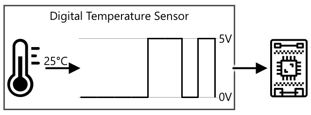
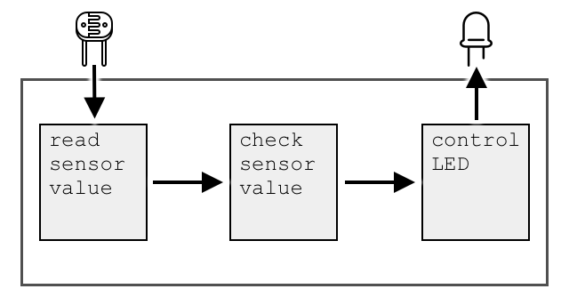
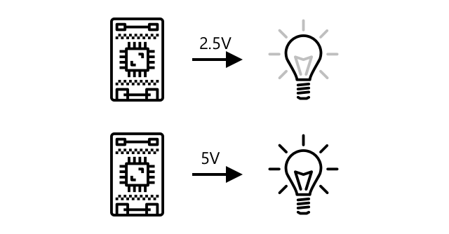
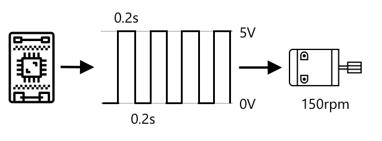
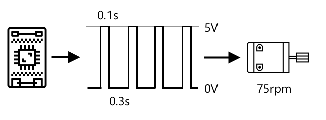

# Interact with the physical world with sensors and actuators


> Sketchnote by [Nitya Narasimhan](https://github.com/nitya). Click the image for a larger version.

## Pre-lecture quiz

[Pre-lecture quiz](https://brave-island-0b7c7f50f.azurestaticapps.net/quiz/5)

## Introduction

This lesson introduces two of the important concepts for your IoT device - sensors and actuators. You will also get hands on with them both, adding a light sensor to your IoT project, then adding an LED controlled by light levels, effectively building a nightlight.

In this lesson we'll cover:

* [What are sensors?](#what-are-sensors)
* [Use a sensor](#use-a-sensor)
* [Sensor types](#sensor-types)
* [What are actuators?](#what-are-actuators)
* [Use an actuator](#use-an-actuator)
* [Actuator types](#actuator-types)

## What are sensors?

Sensors are hardware devices that sense the physical world - that is they measure one or more properties around them and send the information to an IoT device. Sensors cover a huge range of devices as there are so many things that can be measured, from natural properties such as air temperature to physical interactions such as movement.

Some common sensors include:

* Temperature sensors - these sense the air temperature or the temperature of what they are immersed in. For hobbyists and developer, these are often combined with air pressure and humidity in a single sensor.
* Buttons - they sense when they have been pressed.
* Light sensors - these detect light levels and can be for specific colors, UV light, IR light, or general visible light.
* Cameras - these sense a visual representation of the world by taking a photograph or streaming video.
* Accelerometers - these sense movement in multiple directions.
* Microphones - these sense sound, either general sound levels or directional sound.

✅ Do some research. What sensors does your phone have?

All sensors have one thing in common - they convert whatever they sense into an electrical signal that can be interpreted by an IoT device. How this electrical signal is interpreted depends on the sensor, as well as the communication protocol used to communicate with the IoT device.

## Use a sensor

Follow the relevant guide below to add a sensor to your IoT device:

* [Arduino - Wio Terminal](wio-terminal-sensor.md)
* [Single-board computer - Raspberry Pi](pi-sensor.md)
* [Single-board computer - Virtual device](virtual-device-sensor.md)

## Sensor types

Sensors are either analog or digital.

### Analog sensors

Some of the most basic sensors are analog sensors. These sensors receive a voltage from the IoT device, the sensor components adjust this voltage, and the voltage that is returned from the sensor is measured to give the sensor value.

> 🎓 Voltage is a measure of how much push there is to move electricity from one place to another, such as from a positive terminal of a battery to the negative terminal. For example, a standard AA battery is 1.5V (V is the symbol for volts) and can push electricity with the force of 1.5V from it's positive terminal to its negative terminal. Different electrical hardware requires different voltages to work, for example, an LED can light with between 2-3V, but a 100W filament lightbulb would need 240V. You can read more about voltage on the [Voltage page on Wikipedia](https://wikipedia.org/wiki/Voltage).

One example of this is a potentiometer. This is a dial that you can rotate between two positions and the sensor measures the rotation.


The IoT device will send an electrical signal to the potentiometer at a voltage, such as 5 volts (5V). As the potentiometer is adjusted it changes the voltage that comes out of the other side. Imagine you have a potentiometer labelled as a dial that goes from 0 to [11](https://wikipedia.org/wiki/Up_to_eleven), such as a volume knob on an amplifier. When the potentiometer is in the full off position (0) then 0V (0 volts) will come out. When it is in the full on position (11), 5V (5 volts) will come out.

> 🎓 This is an oversimplification, and you can read more on potentiometers and variable resistors on the [potentiometer Wikipedia page](https://wikipedia.org/wiki/Potentiometer).

The voltage that comes out of the sensor is then read by the IoT device, and the device can respond to it. Depending on the sensor, this voltage can be an arbitrary value or can map to a standard unit. For example, an analog temperature sensor based on a [thermistor](https://wikipedia.org/wiki/Thermistor) changes it's resistance depending on the temperature. The output voltage can then be converted to a temperature in Kelvin, and correspondingly into °C or °F, by calculations in code.

✅ What do you think happens if the sensor returns a higher voltage than was sent (for example coming from an external power supply)? ⛔️ DO NOT test this out.

#### Analog to digital conversion

IoT devices are digital - they can't work with analog values, they only work with 0s and 1s. This means that analog sensor values need to be converted to a digital signal before they can be processed. Many IoT devices have analog-to-digital converters (ADCs) to convert analog inputs to digital representations of their value. Sensors can also work with ADCs via a connector board. For example, in the Seeed Grove ecosystem with a Raspberry Pi, analog sensors connect to specific ports on a 'hat' that sits on the Pi connected to the Pi's GPIO pins, and this hat has an ADC to convert the voltage into a digital signal that can be sent off the Pi's GPIO pins.

Imagine you have an analog light sensor connected to an IoT device that uses 3.3V and is returning a value of 1V. This 1V doesn't mean anything in the digital world, so needs to be converted. The voltage will be converted to an analog value using a scale depending on the device and sensor. One example is the Seeed Grove light sensor which outputs values from 0 to 1,023. For this sensor running at 3.3V, a 1V output would be a value of 300. An IoT device can't handle 300 as an analog value, so the value would be converted to `0000000100101100`, the binary representation of 300 by the Grove hat. This would then be processed by the IoT device.

✅ If you don't know binary, then do a small amount of research to learn how numbers are represented by 0s and 1s. The [BBC Bitesize introduction to binary lesson](https://www.bbc.co.uk/bitesize/guides/zwsbwmn/revision/1) is a great place to start.

From a coding perspective, all this is usually handled by libraries that come with the sensors, so you don't need to worry about this conversion yourself. For the Grove light sensor you would use the Python library and call the `light` property, or use the Arduino library and call `analogRead` to get a value of 300.

### Digital sensors

Digital sensors, like analog sensors, detect the world around them using changes in electrical voltage. The difference is they output a digital signal, either by only measuring two states or by using a built-in ADC. Digital sensors are becoming more and more common to avoid the need to use an ADC either in a connector board or on the IoT device itself.

The simplest digital sensor is a button or switch. This is a sensor with two states, on or off.



Pins on IoT devices such as GPIO pins can measure this signal directly as a 0 or 1. If the voltage sent is the same as the voltage returned, the value read is 1, otherwise the value read is 0. There is no need to convert the signal, it can only be 1 or 0.

> 💁 Voltages are never exact especially as the components in a sensor will have some resistance, so there is usually a tolerance. For example, the GPIO pins on a Raspberry Pi work on 3.3V, and read a return signal above 1.8V as a 1, below 1.8V as 0.

* 3.3V goes into the button. The button is off so 0V comes out, giving a value of 0
* 3.3V goes into the button. The button is on so 3.3V comes out, giving a value of 1

More advanced digital sensors read analog values, then convert them using on-board ADCs to digital signals. For example, a digital temperature sensor will still use a thermocouple in the same way as an analog sensor, and will still measure the change in voltage caused by the resistance of the thermocouple at the current temperature. Instead of returning an analog value and relying on the device or connector board to convert to a digital signal, an ADC built into the sensor will convert the value and send it as a series of 0s and 1s to the IoT device. These 0s and 1s are sent in the same way as the digital signal for a button with 1 being full voltage and 0 being 0v.



Sending digital data allows sensors to become more complex and send more detailed data, even encrypted data for secure sensors. One example is a camera. This is a sensor that captures an image and sends it as digital data containing that image, usually in a compressed format such as JPEG, to be read by the IoT device. It can even stream video by capturing images and sending either the complete image frame by frame or a compressed video stream.

## What are actuators?

Actuators are the opposite of sensors - they convert an electrical signal from your IoT device into an interaction with the physical world such as emitting light or sound, or moving a motor.

Some common actuators include:

* LED - these emit light when turned on
* Speaker - these emit sound based on the signal sent to them, from a basic buzzer to an audio speaker that can play music
* Stepper motor - these convert a signal into a defined amount of rotation, such as turning a dial 90°
* Relay - these are switches that can be turned on or off by an electrical signal. They allow a small voltage from an IoT device to turn on larger voltages.
* Screens - these are more complex actuators and show information on a multi-segment display. Screens vary from simple LED displays to high-resolution video monitors.

✅ Do some research. What actuators does your phone have?

## Use an actuator

Follow the relevant guide below to add an actuator to your IoT device, controlled by the sensor, to build an IoT nightlight. It will gather light levels from the light sensor, and use an actuator in the form of an LED to emit light when the detected light level is too low.



* [Arduino - Wio Terminal](wio-terminal-actuator.md)
* [Single-board computer - Raspberry Pi](pi-actuator.md)
* [Single-board computer - Virtual device](virtual-device-actuator.md)

## Actuator types

Like sensors, actuators are either analog or digital.

### Analog actuators

Analog actuators take an analog signal and convert it into some kind of interaction, where the interaction changes based off the voltage supplied.

One example is a dimmable light, such as the ones you might have in your house. The amount of voltage supplied to the light determines how bright it is.



Like with sensors, the actual IoT device works on digital signals, not analog. This means to send an analog signal, the IoT device needs a digital to analog converter (DAC), either on the IoT device directly, or on a connector board. This will convert the 0s and 1s from the IoT device to an analog voltage that the actuator can use.

✅ What do you think happens if the IoT device sends a higher voltage than the actuator can handle? ⛔️ DO NOT test this out.

#### Pulse-Width Modulation

Another option for converting digital signals from an IoT device to an analog signal is pulse-width modulation. This involves sending lots of short digital pulses that act as if it was an analog signal.

For example, you can use PWM to control the speed of a motor.

Imagine you are controlling a motor with a 5V supply. You send a short pulse to your motor, switching the voltage to high (5V) for two hundredths of a second (0.02s). In that time your motor can rotate one tenth of a rotation, or 36°. The signal then pauses for two hundredths of a second (0.02s), sending a low signal (0V). Each cycle of on then off lasts 0.04s. The cycle then repeats.



This means in one second you have 25 5V pulses of 0.02s that rotate the motor, each followed by 0.02s pause of 0V not rotating the motor. Each pulse rotates the motor one tenth of a rotation, meaning the motor completes 2.5 rotations per second. You've used a digital signal to rotate the motor at 2.5 rotations per second, or 150 ([revolutions per minute](https://wikipedia.org/wiki/Revolutions_per_minute), a non-standard measure of rotational velocity).

```output
25 pulses per second x 0.1 rotations per pulse = 2.5 rotations per second
2.5 rotations per second x 60 seconds in a minute = 150rpm
```

> 🎓 When a PWM signal is on for half the time, and off for half it is referred to as a [50% duty cycle](https://wikipedia.org/wiki/Duty_cycle). Duty cycles are measured as the percentage time the signal is in the on state compared to the off state.



You can change the motor speed by changing the size of the pulses. For example, with the same motor you can keep the same cycle time of 0.04s, with the on pulse halved to 0.01s, and the off pulse increasing to 0.03s. You have the same number of pulses per second (25), but each on pulse is half the length. A half length pulse only turns the motor one twentieth of a rotation, and at 25 pulses a second will complete 1.25 rotations per second or 75rpm. By changing the pulse speed of a digital signal you've halved the speed of an analog motor.

```output
25 pulses per second x 0.05 rotations per pulse = 1.25 rotations per second
1.25 rotations per second x 60 seconds in a minute = 75rpm
```

✅ How would you keep the motor rotation smooth, especially at low speeds? Would you use a small number of long pulses with long pauses or lots of very short pulses with very short pauses?

> 💁 Some sensors also use PWM to convert analog signals to digital signals.

> 🎓 You can read more on pulse-width modulation on the [pulse-width modulation page on Wikipedia](https://wikipedia.org/wiki/Pulse-width_modulation).

### Digital actuators

Digital actuators, like digital sensors, either have two states controlled by a high or low voltage or have a DAC built in so can convert a digital signal to an analog one.

One simple digital actuator is an LED. When a device sends a digital signal of 1, a high voltage is sent that lights the LED. When a digital signal of 0 is sent, the voltage drops to 0V and the LED turns off.


✅ What other simple 2-state actuators can you think of? One example is a solenoid, which is an electromagnet that can be activated to do things like move a door bolt locking/unlocking a door.

More advanced digital actuators, such as screens require the digital data to be sent in certain formats. They usually come with libraries that make it easier to send the correct data to control them.

---

## 🚀 Challenge

The challenge in the last two lessons was to list as many IoT devices as you can that are in your home, school or workplace and decide if they are built around microcontrollers or single-board computers, or even a mixture of both.

For every device you listed, what sensors and actuators are they connected to? What is the purpose of each sensor and actuator connected to these devices?

## Post-lecture quiz

[Post-lecture quiz](https://brave-island-0b7c7f50f.azurestaticapps.net/quiz/6)

## Review & Self Study

* Read up on electricity and circuits on [ThingLearn](http://www.thinglearn.com/essentials/).
* Read about the different types of temperature sensors on the [Seeed Studios Temperature Sensors guide](https://www.seeedstudio.com/blog/2019/10/14/temperature-sensors-for-arduino-projects/)
* Read about LEDs on the [Wikipedia LED page](https://wikipedia.org/wiki/Light-emitting_diode)

## Assignment

[Research sensors and actuators](assignment.md)
