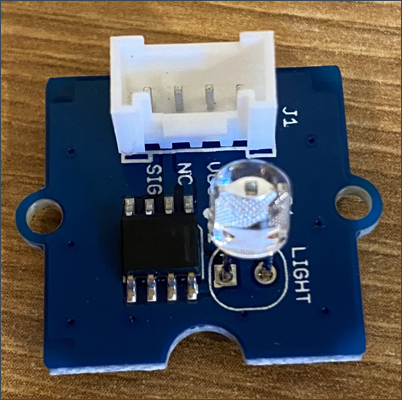
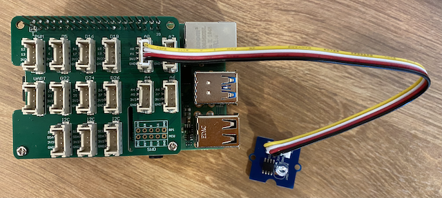

# Build a nightlight - Raspberry Pi

In this part of the lesson, you will add a light sensor to your Raspberry Pi.

## Hardware

The sensor for this lesson is a **light sensor** that uses a [photodiode](https://wikipedia.org/wiki/Photodiode) to convert light to an electrical signal. This is an analog sensor that sends an integer value from 0 to 1,000 indicating a relative amount of light that doesn't map to any standard unit of measurement such as [lux](https://wikipedia.org/wiki/Lux).

The light sensor is an eternal Grove sensor and needs to be connected to the Grove Base hat on the Raspberry Pi.

### Connect the light sensor

The Grove light sensor that is used to detect the light levels needs to be connected to the Raspberry Pi.

#### Task - connect the light sensor

Connect the light sensor



1. Insert one end of a Grove cable into the socket on the light sensor module. It will only go in one way round.

1. With the Raspberry Pi powered off, connect the other end of the Grove cable to the analog socket marked **A0** on the Grove Base hat attached to the Pi. This socket is the second from the right, on the row of sockets next to the GPIO pins.



## Program the light sensor

The device can now be programmed using the Grove light sensor.

### Task - program the light sensor

Program the device.

1. Power up the Pi and wait for it to boot

1. Open the nightlight project in VS Code that you created in the previous part of this assignment, either running directly on the Pi or connected using the Remote SSH extension.

1. Open the `app.py` file and remove all code from it

1. Add the following code to the `app.py` file to import some required libraries:

    ```python
    import time
    from grove.grove_light_sensor_v1_2 import GroveLightSensor
    ```

    The `import time` statement imports the `time` module that will be used later in this assignment.

    The `from grove.grove_light_sensor_v1_2 import GroveLightSensor` statement imports the `GroveLightSensor` from the Grove Python libraries. This library has code to interact with a Grove light sensor, and was installed globally during the Pi setup.

1. Add the following code after the code above to create an instance of the class that manages the light sensor:

    ```python
    light_sensor = GroveLightSensor(0)
    ```

    The line `light_sensor = GroveLightSensor(0)` creates an instance of the `GroveLightSensor` class connecting to pin **A0** - the analog Grove pin that the light sensor is connected to.

1. Add an infinite loop after the code above to poll the light sensor value and print it to the console:

    ```python
    while True:
        light = light_sensor.light
        print('Light level:', light)
    ```

    This will read the current light level on a scale of 0-1,023 using the `light` property of the `GroveLightSensor` class. This property reads the analog value from the pin. This value is then printed to the console.

1. Add a small sleep of one second at the end of the `loop` as the light levels don't need to be checked continuously. A sleep reduces the power consumption of the device.

    ```python
    time.sleep(1)
    ```

1. From the VS Code Terminal, run the following to run your Python app:

    ```sh
    python3 app.py
    ```

    Light values will be output to the console. Cover and uncover the light sensor, and the values will change:

    ```output
    pi@raspberrypi:~/nightlight $ python3 app.py 
    Light level: 634
    Light level: 634
    Light level: 634
    Light level: 230
    Light level: 104
    Light level: 290
    ```

> 💁 You can find this code in the [code-sensor/pi](code-sensor/pi) folder.

😀 Adding a sensor to your nightlight program was a success!
