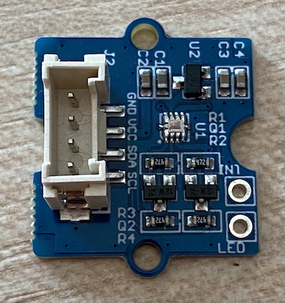
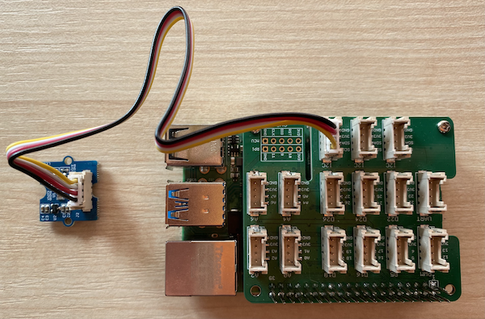

# Build a nightlight - Raspberry Pi

In this part of the lesson, you will add a light sensor to your Raspberry Pi.

## Hardware

The sensor for this lesson is a **sunlight sensor** that uses [photodiodes](https://wikipedia.org/wiki/Photodiode) to convert visible and infrared light to an electrical signal. This is an analog sensor that sends an integer value from 0 to 1,023 indicating a relative amount of light, but this can be used to calculate exact values in [lux](https://wikipedia.org/wiki/Lux) by taking data from the separate infrared and visible light sensors.

The sunlight sensor is an eternal Grove sensor and needs to be connected to the Grove Base hat on the Raspberry Pi.

### Connect the sunlight sensor

The Grove sunlight sensor that is used to detect the light levels needs to be connected to the Raspberry Pi.

#### Task - connect the sunlight sensor

Connect the sunlight sensor



1. Insert one end of a Grove cable into the socket on the sunlight sensor module. It will only go in one way round.

1. With the Raspberry Pi powered off, connect the other end of the Grove cable to one of the three the I<sup>2</sup>C sockets marked **I2C** on the Grove Base hat attached to the Pi. This socket is the second from the right, on the row of sockets next to the GPIO pins.

    > 💁 I<sup>2</sup>C is a way sensors and actuators can communicate with an IoT device. It will be covered in more detail in a later lesson.



## Program the sunlight sensor

The device can now be programmed using the Grove sunlight sensor.

### Task - program the sunlight sensor

Program the device.

1. Power up the Pi and wait for it to boot

1. Open the nightlight project in VS Code that you created in the previous part of this assignment, either running directly on the Pi or connected using the Remote SSH extension.

1. Run the following command to install a pip package for working with the sunlight sensor:

    ```sh
    pip3 install seeed-python-si114x
    ```

    Not all the libraries for the Grove Sensors are installed with the Grove install script you used in an earlier lesson. Some need additional packages.

1. Open the `app.py` file and remove all code from it

1. Add the following code to the `app.py` file to import some required libraries:

    ```python
    import time
    import seeed_si114x
    ```

    The `import time` statement imports the `time` module that will be used later in this assignment.

    The `import seeed_si114x` statement imports the `seeed_si114x` module that has code to interact with the Grove sunlight sensor.

1. Add the following code after the code above to create an instance of the class that manages the light sensor:

    ```python
    light_sensor = seeed_si114x.grove_si114x()
    ```

    The line `light_sensor = seeed_si114x.grove_si114x()` creates an instance of the `grove_si114x` sunlight sensor class.

1. Add an infinite loop after the code above to poll the light sensor value and print it to the console:

    ```python
    while True:
        light = light_sensor.ReadVisible
        print('Light level:', light)
    ```

    This will read the current sunlight level on a scale of 0-1,023 using the `ReadVisible` property of the `grove_si114x` class. This value is then printed to the console.

1. Add a small sleep of one second at the end of the `loop` as the light levels don't need to be checked continuously. A sleep reduces the power consumption of the device.

    ```python
    time.sleep(1)
    ```

1. From the VS Code Terminal, run the following to run your Python app:

    ```sh
    python3 app.py
    ```

    Sunlight values will be output to the console. Cover and uncover the sunlight sensor, and the values will change:

    ```output
    pi@raspberrypi:~/nightlight $ python3 app.py 
    Light level: 259
    Light level: 265
    Light level: 265
    Light level: 584
    Light level: 550
    Light level: 497
    ```

> 💁 You can find this code in the [code-sensor/pi](code-sensor/pi) folder.

😀 Adding a sensor to your nightlight program was a success!
