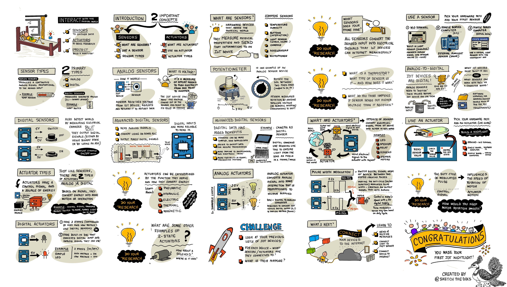

# Interagir avec le monde physique à l'aide de capteurs et d'actionneurs



> Sketchnote de [Nitya Narasimhan](https://github.com/nitya). Cliquez sur l'image pour l'agrandir.

Cette leçon a été enseignée dans le cadre de la [série Hello IoT](https://youtube.com/playlist?list=PLmsFUfdnGr3xRts0TIwyaHyQuHaNQcb6-) du [Microsoft Reactor](https://developer.microsoft.com/reactor/?WT.mc_id=academic-17441-jabenn). La leçon a été enseignée sous forme de deux vidéos - une leçon d'une heure et une heure de bureau pour approfondir certaines parties de la leçon et répondre aux questions.

[](https://youtu.be/Lqalu1v6aF4)

[](https://youtu.be/qR3ekcMlLWA)

> 🎥 Cliquez sur les images ci-dessus pour visionner les vidéos

## Quiz préalable

[Quiz préalable](https://black-meadow-040d15503.1.azurestaticapps.net/quiz/5)

## Introduction

Cette leçon présente deux concepts importants pour votre appareil IoT : les capteurs et les actionneurs. Vous en ferez une prise en main en ajoutant un capteur de lumière à votre projet IoT, puis en ajoutant une LED contrôlée par les niveaux de lumière, ce qui vous permettra de développer une veilleuse.

Dans cette leçon, nous aborderons les points suivants

* [Qu'est-ce qu'un capteur?](#quest-ce-quun-capteur)
* [Utiliser un capteur](#utiliser-un-capteur)
* [Les types de capteurs](#les-types-de-capteurs)
* [Qu'est-ce que les actionneurs?](#quest-ce-que-les-actionneurs)
* [Utiliser un actionneur](#utiliser-un-actionneur)
* [Les types d'actionneurs](#les-types-dactionneurs)

## Qu'est-ce qu'un capteur?

Les capteurs sont des dispositifs matériels qui détectent le monde physique, c'est-à-dire qu'ils mesurent une ou plusieurs propriétés autour d'eux et envoient l'information à un dispositif IoT. Les capteurs couvrent une vaste gamme d'appareils car il y a beaucoup de choses qui peuvent être mesurées, des propriétés naturelles telles que la température de l'air aux interactions physiques telles que le mouvement.

Les capteurs les plus courants sont les suivants :

* Capteurs de température - ils détectent la température de l'air ou la température de ce dans quoi ils sont immergés. Pour les amateurs et les développeurs, ces capteurs sont souvent combinés avec la pression atmosphérique et l'humidité dans un seul capteur.
* Boutons - ils détectent le moment où ils ont été pressés.
* Capteurs de lumière : ils détectent les niveaux de lumière et peuvent concerner des couleurs spécifiques, la lumière UV, la lumière IR ou la lumière visible en général.
* Les caméras : elles détectent une représentation visuelle du monde en prenant une photo ou en diffusant une vidéo.
* Accéléromètres : ils détectent les mouvements dans plusieurs directions.
* Microphones - ils détectent les sons, qu'il s'agisse de niveaux sonores généraux ou de sons directionnels.

✅ Faites des recherches. Quels sont les capteurs de votre téléphone ?

Tous les capteurs ont un point commun : ils convertissent ce qu'ils détectent en un signal électrique qui peut être interprété par un appareil IoT. La manière dont ce signal électrique est interprété dépend du capteur, ainsi que du protocole de communication utilisé pour communiquer avec l'appareil IoT.

## Utiliser un capteur

Suivez le guide approprié ci-dessous pour ajouter un capteur à votre appareil IoT :

* [Arduino - Terminal Wio](wio-terminal-sensor.fr.md)
* [Ordinateur monocarte - Raspberry Pi](pi-sensor.fr.md)
* [Ordinateur monocarte - Dispositif virtuel](virtual-device-sensor.fr.md)

## Les types de capteurs

Les capteurs sont soit analogiques, soit numériques.

### Capteurs analogiques

Les capteurs analogiques comptent parmi les capteurs les plus élémentaires. Ces capteurs reçoivent une tension de l'appareil IoT, les composants du capteur ajustent cette tension et la tension renvoyée par le capteur est mesurée pour donner la valeur du capteur.

> 🎓 La tension ("Voltage" en anglais) est une mesure de la force exercée pour déplacer l'électricité d'un endroit à un autre, par exemple de la borne positive d'une pile à la borne négative. Par exemple, une pile AA standard a une tension de 1,5V (V est le symbole des volts) et peut pousser l'électricité avec une force de 1,5V de sa borne positive à sa borne négative. Par exemple, une LED peut s'allumer avec une tension de 2 à 3V, alors qu'une ampoule à filament de 100W nécessite une tension de 240V. Pour en savoir plus sur la tension, consultez la [page sur la tension sur Wikipédia](https://wikipedia.org/wiki/Voltage).

Le potentiomètre en est un exemple. Il s'agit d'un cadran que l'on peut faire tourner entre deux positions et dont le capteur mesure la rotation.

.

L'appareil IoT envoie un signal électrique au potentiomètre à une tension, par exemple 5 volts (5V). Lorsque le potentiomètre est ajusté, il modifie la tension qui sort de l'autre côté. Imaginez que vous ayez un potentiomètre étiqueté comme un cadran qui va de 0 à [11](https://wikipedia.org/wiki/Up_to_eleven), comme le bouton de volume d'un amplificateur. Lorsque le potentiomètre est en position complètement désactivée (0), 0V (0 volt) sort. Lorsqu'il est en position d'activation totale (11), 5V (5 volts) sont émis.

> 🎓 Il s'agit d'une simplification excessive, et vous pouvez en savoir plus sur les potentiomètres et les résistances variables sur la [page Wikipédia sur les potentiomètres](https://wikipedia.org/wiki/Potentiometer).

La tension qui sort du capteur est alors lue par l'appareil IoT, qui peut alors y répondre. Selon le capteur, cette tension peut être une valeur arbitraire ou correspondre à une unité standard. Par exemple, un capteur de température analogique basé sur une [thermistance](https://wikipedia.org/wiki/Thermistor) modifie sa résistance en fonction de la température. La tension de sortie peut alors être convertie en température en Kelvin, et donc en °C ou °F, par des calculs en code.

✅ Que pensez-vous qu'il se passe si le capteur renvoie une tension plus élevée que celle qui a été envoyée (par exemple en provenance d'une alimentation externe)? ⛔️ NE TESTEZ PAS cela.

#### Conversion analogique-numérique (CAN)

Les appareils IoT sont numériques - ils ne peuvent pas fonctionner avec des valeurs analogiques, ils ne fonctionnent qu'avec des 0 et des 1. Cela signifie que les valeurs analogiques des capteurs doivent être converties en un signal numérique avant de pouvoir être traitées. De nombreux appareils IoT sont équipés de convertisseurs analogique-numérique (CAN) (ou analog-to-digital converters abrégé en "ADC" en anglais) pour convertir les entrées analogiques en représentations numériques de leur valeur. Les capteurs peuvent également fonctionner avec des convertisseurs analogiques-numériques par l'intermédiaire d'une carte de connexion. Par exemple, dans l'écosystème Seeed Grove avec un Raspberry Pi, les capteurs analogiques se connectent à des ports spécifiques sur un 'chapeau' ('hat' en anglais) qui se trouve sur le Pi connecté aux broches GPIO du Pi, et ce chapeau a un CAN pour convertir la tension en un signal numérique qui peut être envoyé hors des broches GPIO du Pi.

Imaginez que vous ayez un capteur de lumière analogique connecté à un dispositif IoT qui utilise 3,3V et renvoie une valeur de 1V. Cette valeur de 1V ne signifie rien dans le monde numérique et doit donc être convertie. La tension sera convertie en valeur analogique à l'aide d'une échelle qui dépend de l'appareil et du capteur. Le capteur de lumière Seeed Grove, par exemple, émet des valeurs comprises entre 0 et 1023. Pour ce capteur fonctionnant à 3,3V, une sortie de 1V correspondrait à une valeur de 300. Un appareil IoT ne peut pas traiter 300 comme une valeur analogique, donc la valeur serait convertie en `0000000100101100`, la représentation binaire de 300 par le chapeau Grove. Cette valeur serait ensuite traitée par l'appareil IoT.

✅ Si vous ne connaissez pas le binaire, faites quelques recherches pour apprendre comment les nombres sont représentés par des 0 et des 1. La [leçon d'introduction au binaire de BBC Bitesize](https://www.bbc.co.uk/bitesize/guides/zwsbwmn/revision/1) est un excellent point de départ.

Du point de vue du codage, tout cela est généralement géré par les bibliothèques fournies avec les capteurs, de sorte que vous n'avez pas à vous préoccuper de cette conversion vous-même. Pour le capteur de lumière Grove, vous devez utiliser la bibliothèque Python et appeler la propriété `light`, ou utiliser la bibliothèque Arduino et appeler `analogRead` pour obtenir une valeur de 300.

### Capteurs numériques

Les capteurs numériques, comme les capteurs analogiques, détectent le monde qui les entoure en utilisant les changements de tension électrique. La différence est qu'ils émettent un signal numérique, soit en mesurant seulement deux états, soit en utilisant un CAN intégré. Les capteurs numériques sont de plus en plus courants pour éviter d'avoir à utiliser un CAN, que ce soit sur une carte de connexion ou sur l'appareil IoT lui-même.

Le capteur numérique le plus simple est un bouton ou un interrupteur. Il s'agit d'un capteur à deux états, marche ou arrêt.


Les broches des appareils IoT, telles que les broches GPIO, peuvent mesurer ce signal directement sous la forme d'un 0 ou d'un 1. Si la tension envoyée est la même que la tension renvoyée, la valeur lue est 1, sinon la valeur lue est 0. Il n'est pas nécessaire de convertir le signal, il ne peut être que 1 ou 0.

> 💁 Les tensions ne sont jamais exactes, en particulier parce que les composants d'un capteur ont une certaine résistance, et il y a donc généralement une tolérance. Par exemple, les broches GPIO d'un Raspberry Pi fonctionnent sur 3,3V et lisent un signal de retour supérieur à 1,8V comme un 1, inférieur à 1,8 V comme un 0.

* 3,3V entrent dans le bouton. Le bouton étant éteint, 0V en sort, ce qui donne une valeur de 0
* 3,3V entrent dans le bouton. Le bouton est allumé, donc 3,3V sort, ce qui donne une valeur de 1

Les capteurs numériques plus avancés lisent les valeurs analogiques, puis les convertissent en signaux numériques à l'aide de convertisseurs analogiques/numériques embarqués. Par exemple, un capteur de température numérique utilise toujours un thermocouple de la même manière qu'un capteur analogique et mesure toujours la variation de tension causée par la résistance du thermocouple à la température actuelle. Au lieu de renvoyer une valeur analogique et de compter sur l'appareil ou la carte de connexion pour la convertir en un signal numérique, un CAN intégré au capteur convertira la valeur et l'enverra sous la forme d'une série de 0 et de 1 à l'appareil IoT. Ces 0 et 1 sont envoyés de la même manière que le signal numérique d'un bouton, 1 étant la pleine tension et 0 étant 0v.


L'envoi de données numériques permet aux capteurs de devenir plus complexes et d'envoyer des données plus détaillées, voire des données cryptées pour les capteurs sécurisés. L'appareil photo en est un exemple. Il s'agit d'un capteur qui capture une image et l'envoie sous forme de données numériques contenant cette image, généralement dans un format compressé tel que JPEG, pour qu'elle soit lue par l'appareil IoT. Il peut même diffuser de la vidéo en capturant des images et en envoyant soit l'image complète image par image, soit un flux vidéo compressé.

## Qu'est-ce que les actionneurs?

Les actionneurs sont l'opposé des capteurs : ils convertissent un signal électrique provenant de votre appareil IoT en une interaction avec le monde physique, par exemple en émettant une lumière ou un son, ou en faisant bouger un moteur.

Les actionneurs les plus courants sont les suivants

* LED - elles émettent de la lumière lorsqu'elles sont allumées.
* Haut-parleur : il émet un son en fonction du signal qui lui est envoyé, qu'il s'agisse d'un simple buzzer ou d'un haut-parleur audio capable de diffuser de la musique.
* Moteur pas à pas : il convertit un signal en une quantité définie de rotation, par exemple en tournant un cadran de 90°.
* Relais : il s'agit d'interrupteurs qui peuvent être activés ou désactivés par un signal électrique. Ils permettent à une petite tension provenant d'un appareil IoT d'activer des tensions plus importantes.
* Écrans - il s'agit d'actionneurs plus complexes qui affichent des informations sur un écran à segments multiples. Les écrans varient d'un simple affichage LED à des moniteurs vidéo haute résolution.

✅ Faites des recherches. Quels sont les actionneurs de votre téléphone ?

## Utiliser un actionneur

Suivez le guide ci-dessous pour ajouter un actionneur à votre appareil IoT, contrôlé par le capteur, afin de créer une veilleuse IoT. Elle recueillera les niveaux de lumière du capteur de lumière et utilisera un actionneur sous la forme d'une LED pour émettre de la lumière lorsque le niveau de lumière détecté est trop faible.


* [Arduino - Terminal Wio](wio-terminal-actuator.fr.md)
* [Ordinateur monocarte - Raspberry Pi](pi-actuator.fr.md)
* [Ordinateur monocarte - Dispositif virtuel](virtual-device-actuator.fr.md)

## Les types d'actionneurs

Comme les capteurs, les actionneurs sont soit analogiques, soit numériques.

### Actionneurs analogiques

Les actionneurs analogiques prennent un signal analogique et le convertissent en une sorte d'interaction, où l'interaction change en fonction de la tension fournie.

Un exemple est celui d'une lampe à intensité variable, comme celles que vous avez peut-être dans votre maison. La quantité de tension fournie à la lampe détermine sa luminosité.


Comme pour les capteurs, l'appareil IoT proprement dit fonctionne avec des signaux numériques et non analogiques. Cela signifie que pour envoyer un signal analogique, l'appareil IoT a besoin d'un convertisseur numérique-analogique (CNA), soit directement sur l'appareil IoT, soit sur une carte de connexion. Cela convertira les 0 et les 1 de l'appareil IoT en une tension analogique que l'actionneur peut utiliser.

✅ À votre avis, que se passe-t-il si l'appareil IoT envoie une tension plus élevée que celle que l'actionneur peut gérer ?
⛔️ NE PAS tester cela.

#### Modulation de largeur d'impulsion (ou Pulse-Width Modulation en anglais abrégé en PWM)

Une autre option pour convertir les signaux numériques d'un appareil IoT en un signal analogique est la modulation de largeur d'impulsion. Il s'agit d'envoyer de nombreuses impulsions numériques courtes qui agissent comme s'il s'agissait d'un signal analogique.

Par exemple, vous pouvez utiliser la modulation de largeur d'impulsion pour contrôler la vitesse d'un moteur.

Imaginez que vous contrôliez un moteur avec une alimentation de 5V. Vous envoyez une brève impulsion à votre moteur, en faisant passer la tension à un niveau élevé (5V) pendant deux centièmes de seconde (0,02s). Pendant ce temps, votre moteur peut effectuer un dixième de tour, soit 36°. Le signal s'interrompt ensuite pendant deux centièmes de seconde (0,02 s), envoyant un signal bas (0V). Chaque cycle de marche puis d'arrêt dure 0,04s. Le cycle se répète ensuite.


Cela signifie qu'en une seconde, 25 impulsions de 5V de 0,02s font tourner le moteur, chacune étant suivie d'une pause de 0V de 0,02s qui ne fait pas tourner le moteur. Chaque impulsion fait tourner le moteur d'un dixième de tour, ce qui signifie que le moteur effectue 2,5 rotations par seconde. Vous avez utilisé un signal numérique pour faire tourner le moteur à 2,5 tours par seconde, soit 150 [tours par minute](https://wikipedia.org/wiki/Revolutions_per_minute) (une mesure non standard de la vitesse de rotation).

```sortie
25 pulses per second x 0.1 rotations per pulse = 2.5 rotations per second
2.5 rotations per second x 60 seconds in a minute = 150rpm
```

> 🎓 Lorsqu'un signal PWM est activé pendant la moitié du temps et désactivé pendant l'autre moitié, on parle d'un [cycle de service de 50 %](https://wikipedia.org/wiki/Duty_cycle). Les rapports cycliques sont mesurés en pourcentage du temps pendant lequel le signal est activé par rapport au temps pendant lequel il est désactivé.


Vous pouvez modifier la vitesse du moteur en changeant la taille des impulsions. Par exemple, avec le même moteur, vous pouvez conserver le même temps de cycle de 0,04 s, en réduisant de moitié l'impulsion de marche à 0,01 s et en augmentant l'impulsion d'arrêt à 0,03 s. Vous avez le même nombre d'impulsions par seconde (25), mais chaque impulsion de marche est réduite de moitié. Vous avez le même nombre d'impulsions par seconde (25), mais chaque impulsion de marche est deux fois moins longue. Une impulsion de demi-longueur ne fait tourner le moteur que d'un vingtième de tour, et à 25 impulsions par seconde, le moteur effectue 1,25 rotation par seconde, soit 75 tours par minute. En modifiant la vitesse d'impulsion d'un signal numérique, vous avez réduit de moitié la vitesse d'un moteur analogique.

```sortie
25 pulses per second x 0.05 rotations per pulse = 1.25 rotations per second
1.25 rotations per second x 60 seconds in a minute = 75rpm
```

✅ Comment assurer la fluidité de la rotation du moteur, en particulier à faible vitesse ? Utilisez-vous un petit nombre d'impulsions longues avec de longues pauses ou un grand nombre d'impulsions très courtes avec de très courtes pauses?

> 💁 Certains capteurs utilisent également le PWM pour convertir les signaux analogiques en signaux numériques.

> 🎓 Pour en savoir plus sur la modulation de largeur d'impulsion, consultez la page consacrée à [la modulation de largeur d'impulsion sur Wikipédia](https://wikipedia.org/wiki/Pulse-width_modulation).

### Actionneurs numériques

Les actionneurs numériques, comme les capteurs numériques, ont soit deux états contrôlés par une tension haute ou basse, soit un convertisseur numérique-analogique intégré qui permet de convertir un signal numérique en un signal analogique.

Un actionneur numérique simple est une LED. Lorsqu'un dispositif envoie un signal numérique de 1, une haute tension est envoyée et allume la LED. Lorsqu'un signal numérique de 0 est envoyé, la tension chute à 0V et la LED s'éteint.


✅ À quels autres actionneurs simples à deux états pouvez-vous penser ? Un exemple est le solénoïde, qui est un électro-aimant qui peut être activé pour faire des choses comme déplacer un pêne de porte qui verrouille/déverrouille une porte.

Les actionneurs numériques plus avancés, tels que les écrans, exigent que les données numériques soient envoyées dans certains formats. Ils sont généralement livrés avec des bibliothèques qui facilitent l'envoi des données correctes pour les contrôler.

---

## 🚀 Challenge

Le défi des deux dernières leçons consistait à dresser la liste du plus grand nombre possible d'appareils IoT présents chez vous, à l'école ou sur votre lieu de travail, et de déterminer s'ils sont construits autour de microcontrôleurs ou d'ordinateurs monocartes, ou même d'un mélange des deux.

Pour chaque appareil que vous avez répertorié, à quels capteurs et actionneurs sont-ils connectés? Quelle est l'utilité de chaque capteur et actionneur connecté à ces dispositifs?

## Quiz de validation des connaissances

[Quiz de validation des connaissances](https://black-meadow-040d15503.1.azurestaticapps.net/quiz/6)

## Révision et auto-apprentissage

* En apprendre plus sur l'électricité et les circuits sur [ThingLearn](http://thinglearn.jenlooper.com/curriculum/).
* Pour en savoir plus sur les différents types de capteurs de température, consultez le [guide des capteurs de température de Seeed Studios](https://www.seeedstudio.com/blog/2019/10/14/temperature-sensors-for-arduino-projects/)
* Pour en savoir plus sur les LED, consultez [la page LED de Wikipédia](https://wikipedia.org/wiki/Light-emitting_diode)

## Affectation

[Recherche sur les capteurs et les actionneurs](assignment.fr.md)
