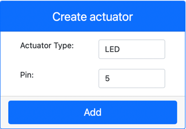
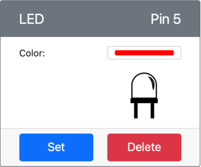
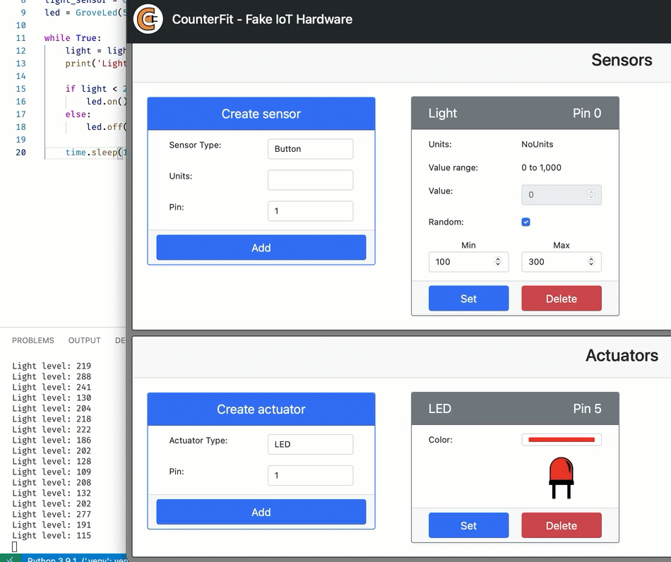

# Build a nightlight - Virtual IoT Hardware

In this part of the lesson, you will add an LED to your virtual IoT device and use it to create a nightlight.

## Virtual Hardware

The nightlight needs one actuator, created in the CounterFit app.

The actuator is an **LED**. In a physical IoT device, it would be a [light-emitting diode](https://wikipedia.org/wiki/Light-emitting_diode) that emits light when current flows through it. This is a digital actuator that has 2 states, on and off. Sending a value of 1 turns the LED on, and 0 turns it off.

The nightlight logic in pseudo-code is:

```output
Check the light level.
If the light is less than 300
    Turn the LED on
Otherwise
    Turn the LED off
```

### Add the actuator to CounterFit

To use a virtual LED, you need to add it to the CounterFit app

#### Task - add the actuator to CounterFit

Add the LED to the CounterFit app.

1. Make sure the CounterFit web app is running from the previous part of this assignment. If not, start it and re-add the light sensor.

1. Create an LED:

    1. In the *Create actuator* box in the *Actuator* pane, drop down the *Actuator type* box and select *LED*.

    1. Set the *Pin* to *5*

    1. Select the **Add** button to create the LED on Pin 5

    

    The LED will be created and appear in the actuators list.

    

    Once the LED has been created, you can change the color using the *Color* picker. Select the **Set** button to change the color after you have selected it.

### Program the nightlight

The nightlight can now be programmed using the CounterFit light sensor and LED.

#### Task - program the nightlight

Program the nightlight.

1. Open the nightlight project in VS Code that you created in the previous part of this assignment. Kill and re-create the terminal to ensure it is running using the virtual environment if necessary.

1. Open the `app.py` file

1. Add the following code to the `app.py` file to connect to import a required library. This should be added to the top, below the other `import` lines.

    ```python
    from counterfit_shims_grove.grove_led import GroveLed
    ```

    The `from counterfit_shims_grove.grove_led import GroveLed` statement imports the `GroveLed` from the CounterFit Grove shim Python libraries. This library has code to interact with an LED created in the CounterFit app.

1. Add the following code after the `light_sensor` declaration to create an instance of the class that manages the LED:

    ```python
    led = GroveLed(5)
    ```

    The line `led = GroveLed(5)` creates an instance of the `GroveLed` class connecting to pin **5** - the CounterFit Grove pin that the LED is connected to.

1. Add a check inside the `while` loop, and before the `time.sleep` to check the light levels and turn the LED on or off:

    ```python
    if light < 300:
        led.on()
    else:
        led.off()
    ```

    This code checks the `light` value. If this is less than 300 it calls the `on` method of the `GroveLed` class which sends a digital value of 1 to the LED, turning it on. If the light value is greater than or equal to 300 it calls the `off` method, sending a digital value of 0 to the LED, turning it off.

    > 💁 This code should be indented to the same level as the `print('Light level:', light)` line to be inside the while loop!

1. From the VS Code Terminal, run the following to run your Python app:

    ```sh
    python3 app.py
    ```

    You should see light values being output to the console.

    ```output
    (.venv) ➜  GroveTest python3 app.py 
    Light level: 143
    Light level: 244
    Light level: 246
    Light level: 253
    ```

1. Change the *Value* or the *Random* settings to vary the light level above and below 300. You will see the LED turn on and off.



> 💁 You can find this code in the [code-actuator/virtual-device](code-actuator/virtual-device) folder.

😀 Your nightlight program was a success!
