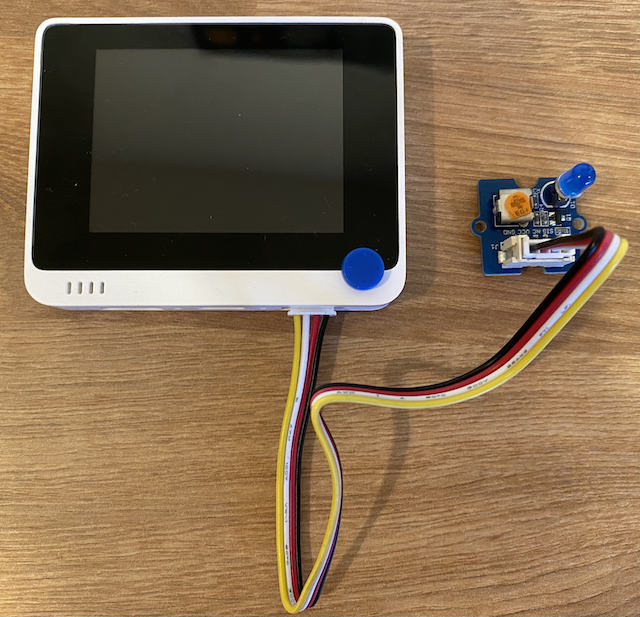

# Build a nightlight - Wio Terminal

In this part of the lesson, you will add an LED to your Wio Terminal and use it to create a nightlight.

## Hardware

The nightlight now needs an actuator.

The actuator is an **LED**, a [light-emitting diode](https://wikipedia.org/wiki/Light-emitting_diode) that emits light when current flows through it. This is a digital actuator that has 2 states, on and off. Sending a value of 1 turns the LED on, and 0 turns it off. This is an external Grove actuator and needs to be connected to the Wio Terminal.

The nightlight logic in pseudo-code is:

```output
Check the light level.
If the light is less than 300
    Turn the LED on
Otherwise
    Turn the LED off
```

### Connect the LED

The Grove LED comes as a module with a selection of LEDs, allowing you to choose the color.

#### Task - connect the LED

Connect the LED.


1. Pick your favorite LED and insert the legs into the two holes on the LED module.

    LEDs are light-emitting diodes, and diodes are electronic devices that can only carry current one way. This means the LED needs to be connected the right way round, otherwise it won't work.

    One of the legs of the LED is the positive pin, the other is the negative pin. The LED is not perfectly round, and is slightly flatter on one side. The slightly flatter side is the negative pin. When you connect the LED to the module, make sure the pin by the rounded side is connected to the socket marked **+** on the outside of the module, and the flatter side is connected to the socket closer to the middle of the module.

1. The LED module has a spin button that allows you to control the brightness. Turn this all the way up to start with by rotating it anti-clockwise as far as it will go using a small Phillips head screwdriver.

1. Insert one end of a Grove cable into the socket on the LED module. It will only go in one way round.

1. With the Wio Terminal disconnected from your computer or other power supply, connect the other end of the Grove cable to the right-hand side Grove socket on the Wio Terminal as you look at the screen. This is the socket farthest away from the power button.

    > 💁 The right-hand Grove socket can be used with analog or digital sensors and actuators. The left-hand socket is for I<sup>2</sup>C and digital sensors and actuators only. I<sup>2</sup>C will be covered in a later lesson.



## Program the nightlight

The nightlight can now be programmed using the built in light sensor and the Grove LED.

### Task - program the nightlight

Program the nightlight.

1. Open the nightlight project in VS Code that you created in the previous part of this assignment

1. Add the following line to the bottom of the `setup` function:

    ```cpp
    pinMode(D0, OUTPUT);
    ```

    This line configures the pin used to communicate with the LED via the Grove port.

    The `D0` pin is the digital pin for the right-hand Grove socket. This pin is set to `OUTPUT`, meaning it connects to an actuator and data will be written to the pin.

1. Add the following code immediately before the `delay` in the loop function:

    ```cpp
    if (light < 300)
    {
        digitalWrite(D0, HIGH);
    }
    else
    {
        digitalWrite(D0, LOW);
    }
    ```

    This code checks the `light` value. If this is less than 300 it sends a `HIGH` value to the `D0` digital pin. This `HIGH` is a value of 1, turning on the LED. If the light is greater than or equal to 300, a `LOW` value of 0 is sent to the pin, turning the LED off.

    > 💁 When sending digital values to actuators, a LOW value is 0v, and a HIGH value is the max voltage for the device. For the Wio Terminal, the HIGH voltage is 3.3V.

1. Reconnect the Wio Terminal to your computer, and upload the new code as you did before.

1. Connect the Serial Monitor. You should see light values being output to the terminal.

    ```output
    > Executing task: platformio device monitor <

    --- Available filters and text transformations: colorize, debug, default, direct, hexlify, log2file, nocontrol, printable, send_on_enter, time
    --- More details at http://bit.ly/pio-monitor-filters
    --- Miniterm on /dev/cu.usbmodem101  9600,8,N,1 ---
    --- Quit: Ctrl+C | Menu: Ctrl+T | Help: Ctrl+T followed by Ctrl+H ---
    Light value: 4
    Light value: 5
    Light value: 4
    Light value: 158
    Light value: 343
    Light value: 348
    Light value: 344
    ```

1. Cover and uncover the light sensor. Notice how the LED will light up if the light level is 300 or less, and turn off when the light level is greater than 300.


> 💁 You can find this code in the [code-actuator/wio-terminal](code-actuator/wio-terminal) folder.

😀 Your nightlight program was a success!
