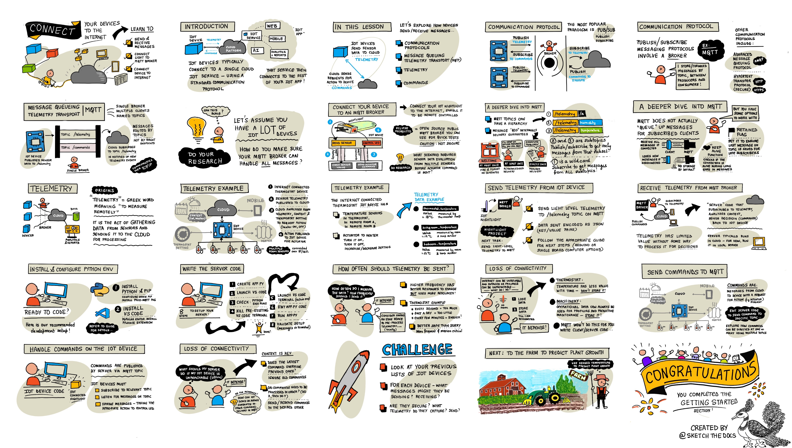
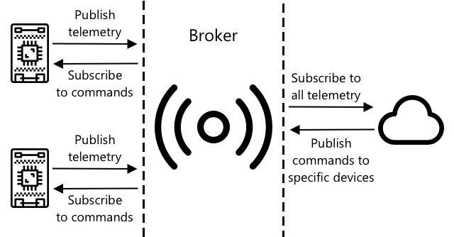
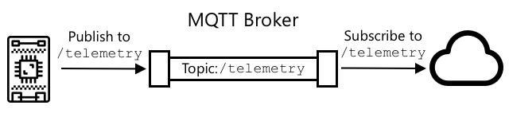
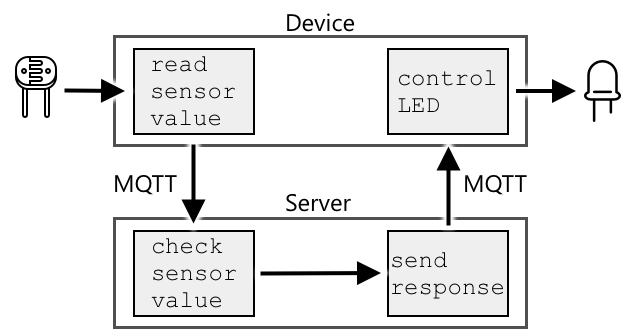
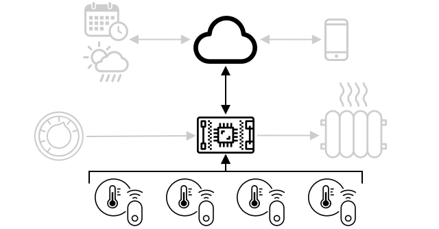
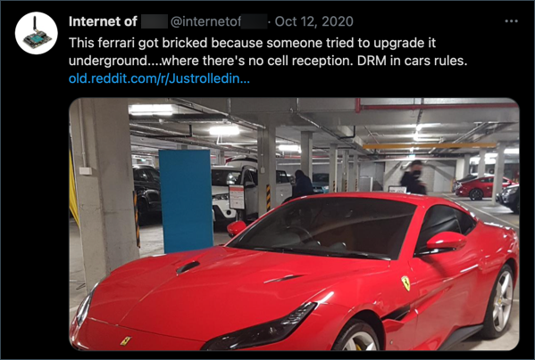
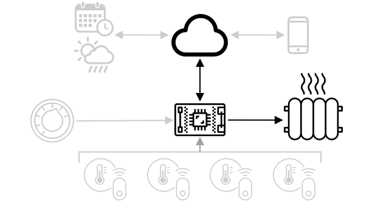

# Connect your device to the Internet



> Sketchnote by [Nitya Narasimhan](https://github.com/nitya). Click the image for a larger version.

## Pre-lecture quiz

[Pre-lecture quiz](https://brave-island-0b7c7f50f.azurestaticapps.net/quiz/7)

## Introduction

The **I** in IoT stands for **Internet** - the cloud connectivity and services that enable a lot of the features of IoT devices, from gathering measurements from the sensors connected to the device, to sending messages to control the actuators. IoT devices typically connect to a single cloud IoT service using a standard communication protocol, and that service is connected to the rest of your IoT application, from AI services to make smart decisions around your data, to web apps for control or reporting.

> 🎓 Data gathered from sensors and sent to the cloud is called telemetry.

IoT devices can receive messages from the cloud. Often the messages contain commands - that is instructions to perform an action either internally (such as reboot or update firmware), or using an actuator (such as turning on a light).

This lesson introduces some of the communication protocols IoT devices can use to connect to the cloud, and the types of data they might send or receive. You will also get hands-on with them both, adding internet control to your nightlight, moving the LED control logic to 'server' code running locally.

In this lesson we'll cover:

* [Communication protocols](#communication-protocols)
* [Message Queueing Telemetry Transport (MQTT)](#message-queueing-telemetry-transport-mqtt)
* [Telemetry](#telemetry)
* [Commands](#commands)

## Communication protocols

There are a number of popular communication protocols used by IoT devices to communicate with the Internet. The most popular are based around publish/subscribe messaging via some kind of broker. The IoT devices connect to the broker and publish telemetry and subscribe to commands. The cloud services also connect to the broker and subscribe to all the telemetry messages and publish commands either to specific devices, or to groups of devices.



MQTT is the most popular communication protocol for IoT devices and is covered in this lesson. Others protocols include AMQP and HTTP/HTTPS.

## Message Queueing Telemetry Transport (MQTT)

[MQTT](http://mqtt.org) is a lightweight, open standard messaging protocol that can send messages between devices. It was designed in 1999 to monitor oil pipelines, before being released as an open standard 15 years later by IBM.

MQTT has a single broker and multiple clients. All clients connect to the broker, and the broker routes messages to the relevant clients. Messages are routed using named topics, rather than being sent directly to an individual client. A client can publish to a topic, and any clients that subscribe to that topic will receive the message.



✅ Do some research. If you have a lot of IoT devices, how can you ensure your MQTT broker can handle all the messages?

### Connect your IoT device to MQTT

The first part of adding Internet control to your nightlight is connecting it to an MQTT broker.

#### Task

Connect your device to an MQTT broker.

In this part of the lesson, you will connect your IoT nightlight to the internet to allow it to be remotely controlled. Later in this lesson, your IoT device will send a telemetry message over MQTT to a public MQTT broker with the light level, where it will be picked up by some server code that you will write. This code will check the light level and send a command message back to the device telling it to turn the LED on or off.

The real-world use case for such a setup could be to gather data from multiple light sensors before deciding to turn on lights, in a location that has a lot of lights, such as a stadium. This could stop the lights from being turned on if only one sensor was covered by clouds or a bird, but the other sensors detected enough light.

✅ What other situations would require data from multiple sensors to be evaluated before sending commands?

Rather than dealing with the complexities of setting up an MQTT broker as part of this assignment, you can use a public test server that runs [Eclipse Mosquitto](https://www.mosquitto.org), an open-source MQTT broker. This test broker is publicly available at [test.mosquitto.org](https://test.mosquitto.org), and doesn't require an account to be set up, making it a great tool for testing MQTT clients and servers.

> 💁 This test broker is public and not secure. Anyone could be listening to what you publish, so it should not be used with any data that needs to be kept private



Follow the relevant step below to connect your device to the MQTT broker:

* [Arduino - Wio Terminal](wio-terminal-mqtt.md)
* [Single-board computer - Raspberry Pi/Virtual IoT device](single-board-computer-mqtt.md)

### A deeper dive into MQTT

Topics can have a hierarchy, and clients can subscribe to different levels of the hierarchy using wildcards. For example, you can send temperature telemetry messages to the `/telemetry/temperature` topic and humidity messages to the `/telemetry/humidity` topic, then in your cloud app subscribe to the `/telemetry/*` topic to receive both the temperature and humidity telemetry messages.

Messages can be sent with a quality of service (QoS), which determines the guarantee of the message being received.

* At most once - the message is sent only once and the client and broker take no additional steps to acknowledge delivery (fire and forget).
* At least once - the message is re-tried by the sender multiple times until acknowledgement is received (acknowledged delivery).
* Exactly once - the sender and receiver engage in a two-level handshake to ensure only one copy of the message is received (assured delivery).

✅ What situations might require an assured delivery message over a fire and forget message?

Although the name is Message Queueing (initials in MQTT), it doesn't actually support message queues. This means that if a client disconnects, then reconnects it won't receive messages sent during the disconnection, except for those messages that it had already started to process using the QoS process. Messages can have a retained flag set on them. If this is set, the MQTT broker will store the last message sent on a topic with this flag, and send this to any clients who later subscribe to the topic. This way, the clients will always get the latest message.

MQTT also supports a keep alive function that checks if the connection is still alive during long gaps between messages.

> 🦟 [Mosquitto from the Eclipse Foundation](https://mosquitto.org) has a free MQTT broker you can run yourself to experiment with MQTT, along with a public MQTT broker you can use to test your code, hosted at [test.mosquitto.org](https://test.mosquitto.org).

MQTT connections can be public and open, or encrypted and secured using usernames and passwords, or certificates.

> 💁 MQTT communicates over TCP/IP, the same underlying network protocol as HTTP, but on a different port. You can also use MQTT over websockets to communicate with web apps running in a browser, or in situations where firewalls or other networking rules block standard MQTT connections.

## Telemetry

The word telemetry is derived from Greek roots meaning to measure remotely. Telemetry is the act of gathering data from sensors and sending it to the cloud.

> 💁 One of the earliest telemetry devices was invented in France in 1874 and sent real-time weather and snow depths from Mont Blanc to Paris. It used physical wires as wireless technologies were not available at the time.

Let's look back at the example of the smart thermostat from Lesson 1.



The thermostat has temperature sensors to gather telemetry. It would most likely have one temperature sensor built in, and it might connect to multiple external temperature sensors over a wireless protocol such as [Bluetooth Low Energy](https://wikipedia.org/wiki/Bluetooth_Low_Energy) (BLE).

An example of the telemetry data it would send could be:

| Name | Value | Description |
| ---- | ----- | ----------- |
| `thermostat_temperature` | 18°C | The temperature measured by the thermostat's built-in temperature sensor |
| `livingroom_temperature` | 19°C | The temperature measured by a remote temperature sensor that has been named `livingroom` to identify the room it is in |
| `bedroom_temperature` | 21°C | The temperature measured by a remote temperature sensor that has been named `bedroom` to identify the room it is in |

The cloud service can then use this telemetry data to make decisions around what commands to send to control the heating.

### Send telemetry from your IoT device

The next part in adding Internet control to your nightlight is sending the light level telemetry to the MQTT broker on a telemetry topic.

#### Task

Send light level telemetry to the MQTT broker.

Data is sent encoded as JSON - short for JavaScript Object Notation, a standard for encoding data in text using key/value pairs.

✅ If you've not come across JSON before, you can learn more about it on the [JSON.org documentation](https://www.json.org/).

Follow the relevant step below to send telemetry from your device to the MQTT broker:

* [Arduino - Wio Terminal](wio-terminal-telemetry.md)
* [Single-board computer - Raspberry Pi/Virtual IoT device](single-board-computer-telemetry.md)

### Receive telemetry from the MQTT broker

There's no point in sending telemetry if there's nothing on the other end to listen for it. The light level telemetry needs something listening to it to process the data. This 'server' code is the kind of code you will deploy to a cloud service as part of a larger IoT application, but here you are going to run this code locally on your computer (or on your Pi if you are coding directly on there). The server code consists of a Python app that listens to telemetry messages over MQTT with light levels. Later in this lesson you will make it reply with a command message with instructions to turn the LED on or off.

✅ Do some research: What happens to MQTT messages if there is no listener?

#### Install Python and VS Code

If you don't have Python and VS Code installed locally, you will need to install them both to code the server. If you are using a virtual device, or are working on your Raspberry Pi you can skip this step.

##### Task

Install Python and VS Code.

1. Install Python. Refer to the [Python downloads page](https://www.python.org/downloads/) for instructions on install the latest version of Python.

1. Install Visual Studio Code (VS Code). This is the editor you will be using to write your virtual device code in Python. Refer to the [VS Code documentation](https://code.visualstudio.com?WT.mc_id=academic-17441-jabenn) for instructions on installing VS Code.

    > 💁 You are free to use any Python IDE or editor for these lessons if you have a preferred tool, but the lessons will give instructions based off using VS Code.

1. Install the VS Code Pylance extension. This is an extension for VS Code that provides Python language support. Refer to the [Pylance extension documentation](https://marketplace.visualstudio.com/items?itemName=ms-python.vscode-pylance&WT.mc_id=academic-17441-jabenn) for instructions on installing this extension in VS Code.

#### Configure a Python virtual environment

One of the powerful features of Python is the ability to install [pip packages](https://pypi.org) - these are packages of code written by other people and published to the Internet. You can install a pip package onto your computer with one command, then use that package in your code. You'll be using pip to install a package to communicate over MQTT.

By default when you install a package it is available everywhere on your computer, and this can lead to problems with package versions - such as one application depending on one version of a package that breaks when you install a new version for a different application. To work around this problem, you can use a [Python virtual environment](https://docs.python.org/3/library/venv.html), essentially a copy of Python in a dedicated folder, and when you install pip packages they get installed just to that folder.

##### Task

Configure a Python virtual environment and install the MQTT pip packages.

1. From your terminal or command line, run the following at a location of your choice to create and navigate to a new directory:

    ```sh
    mkdir nightlight-server
    cd nightlight-server
    ```

1. Now run the following to create a virtual environment in the `.venv` folder

    ```sh
    python3 -m venv .venv
    ```

    > 💁 You need to explicitly call `python3` to create the virtual environment just in case you have Python 2 installed in addition to Python 3 (the latest version). If you have Python2 installed then calling `python` will use Python 2 instead of Python 3

1. Activate the virtual environment:

    * On Windows:
        * If you are using the Command Prompt, or the Command Prompt through Windows Terminal, run:

            ```cmd
            .venv\Scripts\activate.bat
            ```

        * If you are using PowerShell, run:

            ```powershell
            .\.venv\Scripts\Activate.ps1
            ```

    * On macOS or Linux, run:

        ```cmd
        source ./.venv/bin/activate
        ```

    > 💁 These commands should be run from the same location you ran the command to create the virtual environment. You will never need to navigate into the `.venv` folder, you should always run the activate command and any commands to install packages or run code from the folder you were in when you created the virtual environment.

1. Once the virtual environment has been activated, the default `python` command will run the version of Python that was used to create the virtual environment. Run the following to get the version:

    ```sh
    python --version
    ```

    The output will be similar to the following:

    ```output
    (.venv) ➜  nightlight-server python --version
    Python 3.9.1
    ```

    > 💁 Your Python version may be different - as long as it's version 3.6 or higher you are good. If not, delete this folder, install a newer version of Python and try again.

1. Run the following commands to install the pip package for [Paho-MQTT](https://pypi.org/project/paho-mqtt/), a popular MQTT library.

    ```sh
    pip install paho-mqtt
    ```

    This pip package will only be installed in the virtual environment, and will not be available outside of this.

#### Write the server code

The server code can now be written in Python.

##### Task

Write the server code.

1. From your terminal or command line, run the following inside the virtual environment to create a Python file called `app.py`:

    * From Windows run:

        ```cmd
        type nul > app.py
        ```

    * On macOS or Linux, run:

        ```cmd
        touch app.py
        ```

1. Open the current folder in VS Code:

    ```sh
    code .
    ```

1. When VS Code launches, it will activate the Python virtual environment. This will be reported in the bottom status bar:

    

1. If the VS Code Terminal is already running when VS Code starts up, it won't have the virtual environment activated in it. The easiest thing to do is kill the terminal using the **Kill the active terminal instance** button:

    

1. Launch a new VS Code Terminal by selecting *Terminal -> New Terminal, or pressing `` CTRL+` ``. The new terminal will load the virtual environment, with the call to activate this appearing in the terminal. The name of the virtual environment (`.venv`) will also be in the prompt:

    ```output
    ➜  nightlight source .venv/bin/activate
    (.venv) ➜  nightlight 
    ```

1. Open the `app.py` file from the VS Code explorer and add the following code:

    ```python
    import json
    import time
    
    import paho.mqtt.client as mqtt
    
    id = '<ID>'
    
    client_telemetry_topic = id + '/telemetry'
    client_name = id + 'nightlight_server'
    
    mqtt_client = mqtt.Client(client_name)
    mqtt_client.connect('test.mosquitto.org')
    
    mqtt_client.loop_start()
    
    def handle_telemetry(client, userdata, message):
        payload = json.loads(message.payload.decode())
        print("Message received:", payload)
    
    mqtt_client.subscribe(client_telemetry_topic)
    mqtt_client.on_message = handle_telemetry
    
    while True:
        time.sleep(2)
    ```

    Replace `<ID>` on line 6 with the unique ID you used when creating your device code.

    ⚠️ This **must** be the same ID that you used on your device, or the server code won't subscribe or publish to the right topic.

    This code creates an MQTT client with a unique name, and connects to the *test.mosquitto.org* broker. It then starts a processing loop that runs in on a background thread listening for messages on any subscribed topics.

    The client then subscribes to messages on the telemetry topic, and defines a function that is called when a message is received. When a telemetry message is received, the `handle_telemetry` function is called, printing the message received to the console.

    Finally an infinite loop keeps the application running. The MQTT client is listening to messages on a background thread and runs all the time the main application is running.

1. From the VS Code terminal, run the following to run your Python app:

    ```sh
    python app.py
    ```

    The app will start listening to messages from the IoT device.

1. Make sure your device is running and sending telemetry messages. Adjust the light levels detected by your physical or virtual device. Messages being received will be printed to the terminal.

    ```output
    (.venv) ➜  nightlight-server python app.py
    Message received: {'light': 0}
    Message received: {'light': 400}
    ```

    The app.py file in the nightlight virtual environment has to be running for the app.py file in the nightlight-server virtual environment to receive the messages being sent.

> 💁 You can find this code in the [code-server/server](code-server/server) folder.

### How often should telemetry be sent?

One important consideration with telemetry is how often to measure and send the data? The answer is - it depends. If you measure often you can respond faster to changes in measurements, but you use more power, more bandwidth, generate more data and need more cloud resources to process. You need to measure often enough, but not too often.

For a thermostat, measuring every few minutes is probably more than enough as temperatures don't change that often. If you only measure once a day then you could end up heating your house for nighttime temperatures in the middle of a sunny day, whereas if you measure every second you will have thousands of unnecessarily duplicated temperature measurements that will eat into the users' Internet speed and bandwidth (a problem for people with limited bandwidth plans), use more power which can be a problem for battery powered devices like remote sensors, and increase the cost of the providers cloud computing resources processing and storing them.

If you are monitoring data around a piece of machinery in a factory that if it fails could cause catastrophic damage and millions of dollars in lost revenue, then measuring multiple times a second might be necessary. It's better to waste bandwidth than miss telemetry that indicates that a machine needs to be stopped and fixed before it breaks.

> 💁 In this situation, you might consider having an edge device to process the telemetry first to reduce reliance on the Internet.

### Loss of connectivity

Internet connections can be unreliable, with outages common. What should an IoT device do under these circumstances - should it lose the data, or should it store it until connectivity is restored? Again, the answer is it depends.

For a thermostat the data can probably be lost as soon as a new temperature measurement has been taken. The heating system doesn't care that 20 minutes ago it was 20.5°C if the temperature is now 19°C, it's the temperature now that determines if the heating should be on or off.

For machinery you might want to keep the data, especially if it is used to look for trends. There are machine learning models that can detect anomalies in streams of data by looking over data from defined period of time (such as the last hour) and spotting anomalous data. This is often used for predictive maintenance, looking for indications that something might break soon so you can repair or replace it before that happens. You might want every bit of telemetry for a machine sent so it can be processed for anomaly detection, so once the IoT device can reconnect it will send all the telemetry generated during the Internet outage.

IoT device designers should also consider if the IoT device can be used during an Internet outage or loss of signal caused by location. A smart thermostat should be able to make some limited decisions to control heating if it can't send telemetry to the cloud due to an outage.

[](https://twitter.com/internetofshit/status/1315736960082808832)

For MQTT to handle a loss of connectivity, the device and server code will need to be responsible for ensuring message delivery if it is needed, for example by requiring that all messages sent are replied to by additional messages on a reply topic, and if not they are queued manually to be replayed later.

## Commands

Commands are messages sent by the cloud to a device, instructing it to do something. Most of the time this involves giving some kind of output via an actuator, but it can be an instruction for the device itself, such as to reboot, or gather extra telemetry and return it as a response to the command.



A thermostat could receive a command from the cloud to turn the heating on. Based on the telemetry data from all the sensors, if the cloud service has decided that the heating should be on, so it sends the relevant command.

### Send commands to the MQTT broker

The next step for our Internet controlled nightlight is for the server code to send a command back to the IoT device to control the light based on the light levels it senses.

1. Open the server code in VS Code

1. Add the following line after the declaration of the `client_telemetry_topic` to define which topic to send commands to:

    ```python
    server_command_topic = id + '/commands'
    ```

1. Add the following code to the end of the `handle_telemetry` function:

    ```python
    command = { 'led_on' : payload['light'] < 300 }
    print("Sending message:", command)
    
    client.publish(server_command_topic, json.dumps(command))
    ```

    This sends a JSON message to the command topic with the value of `led_on` set to true or false depending on if the light is less than 300 or not. If the light is less than 300, true is sent to instruct the device to turn the LED on.

1. Run the code as before

1. Adjust the light levels detected by your physical or virtual device. Messages being received and commands being sent will be written to the terminal:

    ```output
    (.venv) ➜  nightlight-server python app.py
    Message received: {'light': 0}
    Sending message: {'led_on': True}
    Message received: {'light': 400}
    Sending message: {'led_on': False}
    ```

> 💁 The telemetry and commands are being sent on a single topic each. This means telemetry from multiple devices will appear on the same telemetry topic, and commands to multiple devices will appear on the same commands topic. If you wanted to send a command to a specific device, you could use multiple topics, named with a unique device id, such as `/commands/device1`, `/commands/device2`. That way a device can listen on messages just meant for that one device.

> 💁 You can find this code in the [code-commands/server](code-commands/server) folder.

### Handle commands on the IoT device

Now that commands are being sent from the server, you can now add code to the IoT device to handle them and control the LED.

Follow the relevant step below to listen to commands from the MQTT broker:

* [Arduino - Wio Terminal](wio-terminal-commands.md)
* [Single-board computer - Raspberry Pi/Virtual IoT device](single-board-computer-commands.md)

Once this code is written and running, experiment with changing light levels. Watch the output from the server and device, and watch the LED as you change light levels.

### Loss of connectivity

What should a cloud service do if it needs to send a command to an IoT device that is offline? Again, the answer is it depends.

If the latest command overrides an earlier one then the earlier ones can probably be ignored. If a cloud service sends a command to turn the heating on, then sends a command to turn it off, then the on command can be ignored and not resent.

If the commands need to be processed in sequence, such as move a robot arm up, then close a grabber then they need to be sent in order once connectivity is restored.

✅ How could the device or server code ensure commands are always sent and handled in order over MQTT if needed?

---

## 🚀 Challenge

The challenge in the last three lessons was to list as many IoT devices as you can that are in your home, school or workplace and decide if they are built around microcontrollers or single-board computers, or even a mixture of both, and think about what sensors and actuators they are using.

For these devices, think about what messages they might be sending or receiving. What telemetry do they send? What messages or commands might they receive? Do you think they are secure?

## Post-lecture quiz

[Post-lecture quiz](https://brave-island-0b7c7f50f.azurestaticapps.net/quiz/8)

## Review & Self Study

Read more on MQTT on the [MQTT Wikipedia page](https://wikipedia.org/wiki/MQTT).

Try running an MQTT broker yourself using [Mosquitto](https://www.mosquitto.org) and connect to it from your IoT device and server code.

> 💁 Tip - by default Mosquitto doesn't allow anonymous connections (that is connecting without a username and password), and doesn't allow connections from outside of the computer it's running on.
> You can fix this with a [`mosquitto.conf` config file](https://www.mosquitto.org/man/mosquitto-conf-5.html) with the following:
>
> ```sh
> listener 1883 0.0.0.0
> allow_anonymous true
> ```

## Assignment

[Compare and contrast MQTT with other communication protocols](assignment.md)
