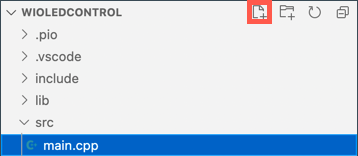

# Control your nightlight over the Internet - Wio Terminal

The IoT device needs to be coded to communicate with *test.mosquitto.org* using MQTT to send telemetry values with the light sensor reading, and receive commands to control the LED.

In this part of the lesson, you will connect your Wio Terminal to an MQTT broker.

## Install the WiFi and MQTT Arduino libraries

To communicate with the MQTT broker, you need to install some Arduino libraries to use the WiFi chip in the Wio Terminal, and communicate with MQTT. When developing for Arduino devices, you can use a wide range of libraries that contain open-source code and implement a huge range of capabilities. Seeed publish libraries for the Wio Terminal that allow it to communicate over WiFi. Other developers have published libraries to communicate with MQTT brokers, and you will be using these with your device.

These libraries are provided as source code that can be imported automatically into PlatformIO, and compiled for your device. This way Arduino libraries will work on any device that supports the Arduino framework, assuming that the device has any specific hardware needed by that library. Some libraries, such as the Seeed WiFi libraries, are specific to certain hardware.

Libraries can be installed globally and compiled in if needed, or into a specific project. For this assignment, the libraries will be installed into the project.

✅ You can learn more about library management and how to find and install libraries in the [PlatformIO library documentation](https://docs.platformio.org/en/latest/librarymanager/index.html).

### Task

Install the Arduino libraries.

1. Open the nightlight project in VS Code.

1. Add the following to the end of the `platformio.ini` file:

    ```ini
    lib_deps =
        seeed-studio/Seeed Arduino rpcWiFi @ 1.0.3
        seeed-studio/Seeed Arduino FS @ 2.0.2
        seeed-studio/Seeed Arduino SFUD @ 2.0.1
        seeed-studio/Seeed Arduino rpcUnified @ 2.1.3
        seeed-studio/Seeed_Arduino_mbedtls @ 3.0.1
    ```

    This imports the Seeed WiFi libraries. The `@ <number>` syntax refers to a specific version number of the library.

    > 💁 You can remove the `@ <number>` to always use the latest version of the libraries, but there's no guarantees the later versions will work with the code below. The code here has been tested with this version of the libraries.

    This is all you need to do to add the libraries. Next time PlatformIO builds the project it will download the source code for these libraries and compile it into your project.

1. Add the following to the `lib_deps`:

    ```ini
    knolleary/PubSubClient @ 2.8
    ```

    This imports [PubSubClient](https://github.com/knolleary/pubsubclient), an Arduino MQTT client

## Connect to WiFi

The Wio Terminal can now be connected to WiFi.

### Task

Connect the Wio Terminal to WiFi.

1. Create a new file in the `src` folder called `config.h`. You can do this by selecting the `src` folder, or the `main.cpp` file inside, and selecting the **New file** button from the explorer. This button only appears when your cursor is over the explorer.

    

1. Add the following code to this file to define constants for your WiFi credentials:

    ```cpp
    #pragma once

    #include <string>
    
    using namespace std;
    
    // WiFi credentials
    const char *SSID = "<SSID>";
    const char *PASSWORD = "<PASSWORD>";
    ```

    Replace `<SSID>` with the SSID of your WiFi. Replace `<PASSWORD>` with your WiFi password.

1. Open the `main.cpp` file

1. Add the following `#include` directives to the top of the file:

    ```cpp
    #include <PubSubClient.h>
    #include <rpcWiFi.h>
    #include <SPI.h>
    
    #include "config.h"
    ```

    This includes header files for the libraries you added earlier, as well as the config header file.

1. Add the following code above the `setup` function:

    ```cpp
    void connectWiFi()
    {
        while (WiFi.status() != WL_CONNECTED)
        {
            Serial.println("Connecting to WiFi..");
            WiFi.begin(SSID, PASSWORD);
            delay(500);
        }
    
        Serial.println("Connected!");
    }
    ```

    This code loops whilst the device is not connected to WiFi, and tries the connecting using the SSID and password from the config header file.

1. Add a call to this function at the bottom of the `setup` function, after the pins have been configured.

    ```cpp
    connectWiFi();
    ```

1. Upload this code to your device to check the WiFi connection is working. You should see this in the serial monitor.

    ```output
    > Executing task: platformio device monitor <
    
    --- Available filters and text transformations: colorize, debug, default, direct, hexlify, log2file, nocontrol, printable, send_on_enter, time
    --- More details at http://bit.ly/pio-monitor-filters
    --- Miniterm on /dev/cu.usbmodem1101  9600,8,N,1 ---
    --- Quit: Ctrl+C | Menu: Ctrl+T | Help: Ctrl+T followed by Ctrl+H ---
    Connecting to WiFi..
    Connected!
    ```

## Connect to MQTT

Once the Wio Terminal is connected to WiFi, it can connect to the MQTT broker.

### Task

Connect to the MQTT broker.

1. Add the following code to the bottom of the `config.h` file to define the connection details for the MQTT broker:

    ```cpp
    // MQTT settings
    const string ID = "<ID>";
    
    const string BROKER = "test.mosquitto.org";
    const string CLIENT_NAME = ID + "nightlight_client";
    ```

    Replace `<ID>` with a unique ID that will be used the name of this device client, and later for the topics that this device publishes and subscribes to. The *test.mosquitto.org* broker is public and used by many people, including other students working through this assignment. Having a unique MQTT client name and topic names ensures your code won't clash with anyone elses. You will also need this ID when you are creating the server code later in this assignment.

    > 💁 You can use a website like [GUIDGen](https://www.guidgen.com) to generate a unique ID.

    The `BROKER` is the URL of the MQTT broker.

    The `CLIENT_NAME` is a unique name for this MQTT client on the broker.

1. Open the `main.cpp` file, and add the following code below the `connectWiFi` function and above the `setup` function:

    ```cpp
    WiFiClient wioClient;
    PubSubClient client(wioClient);
    ```

    This code creates a WiFi client using the Wio Terminal WiFI libraries, and uses it to create an MQTT client.

1. Below this code, add the following:

    ```cpp
    void reconnectMQTTClient()
    {
        while (!client.connected())
        {
            Serial.print("Attempting MQTT connection...");
    
            if (client.connect(CLIENT_NAME.c_str()))
            {
                Serial.println("connected");
            }
            else
            {
                Serial.print("Retying in 5 seconds - failed, rc=");
                Serial.println(client.state());
                
                delay(5000);
            }
        }
    }
    ```

    This function tests the connection to the MQTT broker and reconnects if it is not connected. It loops all the time it is not connected, and attempts to connect using the unique client name defined in the config header file.

    If the connection fails, it retries after 5 seconds.

1. Add the following code below the `reconnectMQTTClient` function:

    ```cpp
    void createMQTTClient()
    {
        client.setServer(BROKER.c_str(), 1883);
        reconnectMQTTClient();
    }
    ```

    This code sets the MQTT broker for the client, as well as setting up the callback when a message is received. It then attempts to connect to the broker.

1. Call the `createMQTTClient` function in the `setup` function after the WiFi is connected.

1. Replace the entire `loop` function with the following:

    ```cpp
    void loop()
    {
        reconnectMQTTClient();
        client.loop();
    
        delay(2000);
    }
    ```

    This code starts by reconnecting to the MQTT broker. These connections can be broken easily, so it's worth regularly checking and reconnecting if necessary. It then calls the `loop` method on the MQTT client to process any messages that are coming in on the topic subscribed to. This app is single-threaded, so messages cannot be received on a background thread, therefore time on the main thread needs to be allocated to processing any messages that are waiting on the network connection.

    Finally a delay of 2 seconds ensures the light levels are not sent too often and reduces the power consumption of the device.

1. Upload the code to your Wio Terminal, and use the Serial Monitor to see the device connecting to WiFi and MQTT.

    ```output
    > Executing task: platformio device monitor <
    
    source /Users/jimbennett/GitHub/IoT-For-Beginners/1-getting-started/lessons/4-connect-internet/code-mqtt/wio-terminal/nightlight/.venv/bin/activate
    --- Available filters and text transformations: colorize, debug, default, direct, hexlify, log2file, nocontrol, printable, send_on_enter, time
    --- More details at http://bit.ly/pio-monitor-filters
    --- Miniterm on /dev/cu.usbmodem1201  9600,8,N,1 ---
    --- Quit: Ctrl+C | Menu: Ctrl+T | Help: Ctrl+T followed by Ctrl+H ---
    Connecting to WiFi..
    Connected!
    Attempting MQTT connection...connected
    ```

> 💁 You can find this code in the [code-mqtt/wio-terminal](code-mqtt/wio-terminal) folder.

😀 You have successfully connected your device to an MQTT broker.
