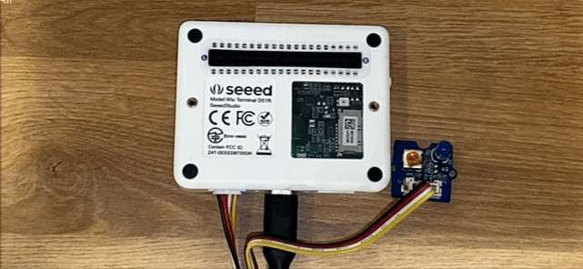

#  
 البدء مع IoT (إنترنت الأشياء) 

في هذا القسم من المنهج ، سيتم تقديمك إلى إنترنت الأشياء ، وستتعلم المفاهيم الأساسية بما في ذلك بناء أول مشروع إنترنت الأشياء الخاص بك "Hello World" المتصل بالسحابة. هذا المشروع عبارة عن ضوء ليلي يضيء عندما تكون مستويات الضوء التي يقيسها المستشعر منخفضة.

# 
المواضيع

1. [مقدمة لإنترنت الأشياء](lessons/1-introduction-to-iot/README.md)
1. [التعمق أكثر بإنترنت الأشياء](lessons/2-deeper-dive/README.md)
1. [تفاعل مع العالم باستخدام المستشعرات والمحركات](lessons/3-sensors-and-actuators/README.md)
1. [قم بتوصيل جهازك بالإنترنت](lessons/4-connect-internet/README.md)

# 
الاعتمادات

 [Jim Bennett](https://GitHub.com/JimBobBennett) كتبت جميع الدروس مع ♥️ من قبل
