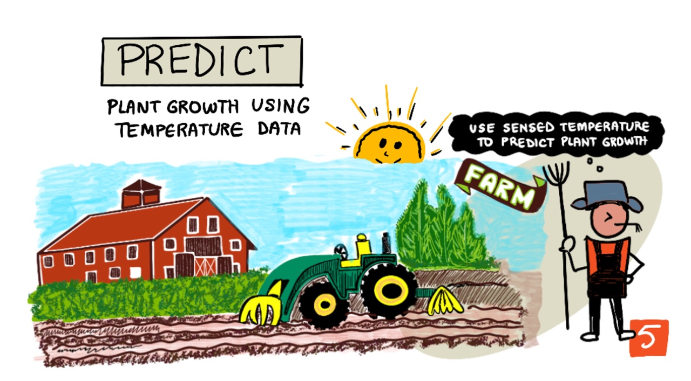
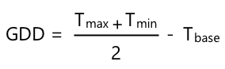
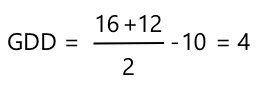
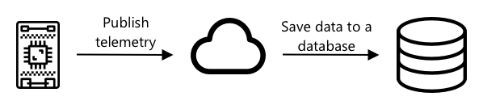
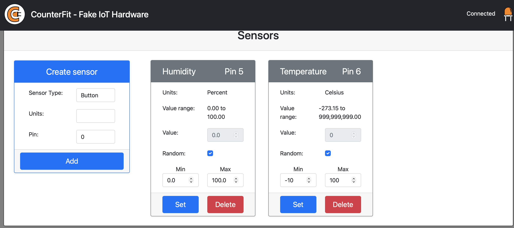
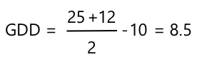

# Predict plant growth with IoT



> Sketchnote by [Nitya Narasimhan](https://github.com/nitya). Click the image for a larger version.

## Pre-lecture quiz

[Pre-lecture quiz](https://thankful-pond-0eba8f10f.1.azurestaticapps.net/quiz/9)

## Introduction

Plants need certain things to grow - water, carbon dioxide, nutrients, light, and heat. In this lesson, you'll learn how to calculate the growth and maturity rates of plants by measuring the air temperature.

In this lesson we'll cover:

* [Digital agriculture](#digital-agriculture)
* [Why is temperature important when farming?](#why-is-temperature-important-when-farming)
* [Measure ambient temperature](#measure-ambient-temperature)
* [Growing degree days (GDD)](#growing-degree-days)
* [Calculate GDD using temperature sensor data](#calculate-gdd-using-temperature-sensor-data)

## Digital agriculture

Digital Agriculture is transforming how we farm, using tools to collect, store and analyze data from farming. We are currently in a period described as the 'Fourth Industrial Revolution' by the World Economic Forum, and the rise of digital agriculture has been labelled as the 'Fourth Agricultural Revolution', or 'Agriculture 4.0'.

> 🎓 The term Digital Agriculture also includes the whole 'agriculture value chain', that is the entire journey from farm to table. It includes tracking produce quality as food is shipped and processed, warehouse and e-commerce systems, even tractor rental apps!

These changes allow farmers to increase yields, use less fertilizers and pesticides, and water more efficiently. Although primarily used in richer nations, sensors and other devices are slowly reducing in price, making them more accessible in developing nations.

Some techniques enabled by digital agriculture are:

* Temperature measurement - measuring temperature allows farmers to predict plant growth and maturity.
* Automated watering - measuring soil moisture and turning on irrigation systems when the soil is too dry, rather than timed watering. Timed watering can lead to crops being under-watered during a hot, dry spell, or over-watered during rain. By watering only when the soil needs it farmers can optimize their water use.
* Pest control - farmers can use cameras on automated robots or drones to check for pests, then apply pesticides only where needed, reducing the amount of pesticides used and reducing pesticide run-off into local water supplies.

✅ Do some research. What other techniques are used to improve farming yields?

> 🎓 The term 'Precision Agriculture' is used to define observing, measuring and responding to crops on a per-field basis, or even on parts of a field. This includes measuring water, nutrient and pest levels and responding accurately, such as watering only a small part of a field.

## Why is temperature important when farming?

When learning about plants, most students are taught about the necessity of water, light, carbon dioxide (CO<sub>2</sub>) and nutrients. Plants also need warmth to grow - this is why plants bloom in spring as the temperature rises, why snowdrops or daffodils can sprout early due to a short warm spell, and why hothouses and greenhouses are so good at making plants grow.

> 🎓 Hothouses and greenhouses do a similar job, but with an important difference. Hothouses are heated artificially and allow farmers to control temperatures more accurately, greenhouses rely on the sun for warmth and usually the only control is windows or other openings to let heat out.

Plants have a base or minimum temperature, optimal temperature, and maximum temperature, all based on daily average temperatures.

* Base temperature - this is the minimum daily average temperature needed for a plant to grow.
* Optimum temperature - this is the best daily average temperature to get the most growth.
* Maximum temperature - The is the maximum temperature a plant can withstand. Above this the plant will shut down it's growth in an attempt to conserve water and stay alive.

> 💁 These are average temperatures, averaged over the daily and nightly temperatures. Plants also need different temperatures day and night to help them photosynthesize more efficiently and save energy at night.

Each species of plant has different values for their base, optimal and maximum. This is why some plants thrive in hot countries, and others in colder countries.

✅ Do some research. For any plants you have in your garden, school, or local park see if you can find the base temperature.


The graph above shows an example growth rate to temperature graph. Up to the base temperature there is no growth. The growth rate increases up to the optimum temperature, then falls after reaching this peak. At the maximum temperature growth stops.

The shape of this graph varies from plant species to plant species. Some have sharper drop offs above the optimum, some have slower increases from tbe base to the optimum.

> 💁 For a farmer to get the best growth, they will need to know the three temperature values and understand the shape of the graphs for the plants they are growing.

If a farmer has control of temperature, for example in a commercial hothouse, then they can optimise for their plants. A commercial hothouse growing tomatoes for example will have the temperature set to around 25°C during the day and 20°C at night to get the fastest growth.

> 🍅 Combining these temperatures with artificial lights, fertilizers and controlled CO<sub>2</sub> levels means commercial growers can grow and harvest all year round.

## Measure ambient temperature

Temperature sensors can be used with IoT devices to measure ambient temperature.

### Task - measure temperature

Work through the relevant guide to monitor temperatures using your IoT device:

* [Arduino - Wio Terminal](wio-terminal-temp.md)
* [Single-board computer - Raspberry Pi](pi-temp.md)
* [Single-board computer - Virtual device](virtual-device-temp.md)

## Growing degree days

Growing degree days (also know as growing degree units) are a way of measuring the growth of plants based off the temperature. Assuming a plant has enough water, nutrients and CO<sub>2</sub>, the temperature determines the growth rate.

Growing degree days, or GDD are calculated per day as the average temperature in Celsius for a day above the plants base temperature. Each plant needs a certain number of GDD to grow, flower or produce and mature a crop. The more GDD each day, the faster the plant will grow.

> 🇺🇸 For Americans, growing degree days can also be calculated using Fahrenheit. 5 GDD<sup>C</sup> (growing degree days in Celsius) is the equivalent of 9 GDD<sup>F</sup> (growing degree days in Fahrenheit).

The full formula for GDD is a little complicated, but there is a simplified equation that is often used as a good approximation:



* **GDD** - this is the number of growing degree days
* **T<sub>max</sub>** - this is the daily maximum temperature in degrees Celsius
* **T<sub>min</sub>** - this is the daily minimum temperature in degrees Celsius
* **T<sub>base</sub>** - this is the plants base temperature in degrees Celsius

> 💁 There are variations that deal with T<sub>max</sub> above 30°C or T<sub>min</sub> below T<sub>base</sub>, but we'll ignore these for now.

### Example - Corn/Maize 🌽

Depending on the variety, corn (or maize) needs between 800 and 2,700 GDD to mature, with a base temperature of 10°C.

On the first day above the base temperature, the following temperatures were measured:

| Measurement | Temp °C |
| :---------- | :-----: |
| Maximum     | 16      |
| Minimum     | 12      |

Plugging these numbers in to our calculation:

* T<sub>max</sub> = 16
* T<sub>min</sub> = 12
* T<sub>base</sub> = 10

This gives a calculation of:



The corn received 4 GDD on that day. Assuming a corn variety that needs 800 GDD days to mature, it will need another 796 GDD to reach maturity.

✅ Do some research. For any plants you have in your garden, school, or local park see if you can find the number of GDD required to reach maturity or produce crops.

## Calculate GDD using temperature sensor data

Plants don't grow on fixed dates - for example you can't plant a seed and know that the plant will bear fruit exactly 100 days later. Instead as a farmer you can have a rough idea how long a plant takes to grow, then you would check daily to see when the crops were ready.

This has a huge labour impact on a large farm, and risks the farmer missing crops that are ready unexpectedly early. By measuring temperatures, the farmer can calculate the GDD a plant has received, allowing them to only check close to the expected maturity.

By gathering temperature data using an IoT device, a farmer can automatically be notified when plants are close to maturity. A typical architecture for this is to have the IoT devices measure temperature, then publish this telemetry data over the Internet using something like MQTT. Server code then listens to this data and saves it somewhere, such as to a database. This means the data can then be analyzed later, such as a nightly job to calculate the GDD for the day, total up the GDD for each crop so far and alert if a plant is close to maturity.



The server code can also augment the data by adding extra information. For example, the IoT device can publish an identifier to indicate which device it is, and the sever code can use this to look up the location of the device, and what crops it is monitoring. It can also add basic data like the current time as some IoT devices don't have the necessary hardware to keep track of an accurate time, or require additional code to read the current time over the Internet.

✅ Why do you think different fields might have different temperatures?

### Task - publish temperature information

Work through the relevant guide to publish temperature data over MQTT using your IoT device so it can be analyzed later:

* [Arduino - Wio Terminal](wio-terminal-temp-publish.md)
* [Single-board computer - Raspberry Pi/Virtual IoT device](single-board-computer-temp-publish.md)

### Task - capture and store the temperature information

Once the IoT device is publishing telemetry, the server code can be written to subscribe to this data and store it. Rather than save it to a database, the server code will save it to a Comma Separated Values (CSV) file. CSV files store data as rows of values as text, with each value separated by a comma, and each record on a new line. They are a convenient, human-readable and well supported way to save data as a file.

The CSV file will have two columns - *date* and *temperature*. The *date* column is set as the current date and time that the message was received by the server, the *temperature* comes from the telemetry message.

1. Repeat the steps in lesson 4 to create server code to subscribe to telemetry. You don't need to add code to publish commands.

    The steps for this are:

    * Configure and activate a Python Virtual Environment

    * Install the paho-mqtt pip package

    * Write the code to listen for MQTT messages published on the telemetry topic

      > ⚠️ You can refer to [the instructions in lesson 4 for creating a Python app to receive telemetry if needed](../../../1-getting-started/lessons/4-connect-internet/README.md#receive-telemetry-from-the-mqtt-broker).

    Name the folder for this project `temperature-sensor-server`.

1. Make sure the `client_name` reflects this project:

    ```cpp
    client_name = id + 'temperature_sensor_server'
    ```

1. Add the following imports to the top of the file, below the existing imports:

    ```python
    from os import path
    import csv
    from datetime import datetime
    ```

    This imports a library for reading files, a library to interact with CSV files, and a library to help with dates and times.

1. Add the following code before the `handle_telemetry` function:

    ```python
    temperature_file_name = 'temperature.csv'
    fieldnames = ['date', 'temperature']
    
    if not path.exists(temperature_file_name):
        with open(temperature_file_name, mode='w') as csv_file:
            writer = csv.DictWriter(csv_file, fieldnames=fieldnames)
            writer.writeheader()
    ```

    This code declares some constants for the name of the file to write to, and the name of the column headers for the CSV file. The first row of a CSV file traditionally contains column headers separated by commas.

    The code then checks to see if the CSV file already exists. If it doesn't exist, it is created with the column headers on the first row.

1. Add the following code to the end of the `handle_telemetry` function:

    ```python
    with open(temperature_file_name, mode='a') as temperature_file:        
        temperature_writer = csv.DictWriter(temperature_file, fieldnames=fieldnames)
        temperature_writer.writerow({'date' : datetime.now().astimezone().replace(microsecond=0).isoformat(), 'temperature' : payload['temperature']})
    ```

    This code opens the CSV file, then appends a new row on the end. The row has the current data and time formatted into a human-readable format, followed by the temperature received from the IoT device. The data is stored in [ISO 8601 format](https://wikipedia.org/wiki/ISO_8601) with the timezone, but without microseconds.

1. Run this code in the same way as before, making sure your IoT device is sending data. A CSV file called `temperature.csv` will be created in the same folder. If you view it you will see date/times and temperature measurements:

    ```output
    date,temperature
    2021-04-19T17:21:36-07:00,25
    2021-04-19T17:31:36-07:00,24
    2021-04-19T17:41:36-07:00,25
    ```

1. Run this code for a while to capture data. Ideally you should run this for an entire day to gather enough data for GDD calculations.

    > 💁 If you are using Virtual IoT Device, select the random checkbox and set a range to avoid getting the same temperature everytime the temperature value is returned.
     

    > 💁 If you want to run this for an entire day, then you need to make sure the computer your server code is running on won't go to sleep, either by changing your power settings, or running something like [this keep system active Python script](https://github.com/jaqsparow/keep-system-active).
    
> 💁 You can find this code in the [code-server/temperature-sensor-server](code-server/temperature-sensor-server) folder.

### Task - calculate GDD using the stored data

Once the server has captured temperature data, the GDD for a plant can be calculated.

The steps to do this manually are:

1. Find the base temperature for the plant. For example, for strawberries the base temperature is 10°C.

1. From the `temperature.csv`, find the highest and lowest temperatures for the day

1. Use the GDD calculation given earlier to calculate GDD

For example, if the highest temperature for the day is 25°C, and the lowest is 12°C:



* 25 + 12 = 37
* 37 / 2 = 18.5
* 18.5 - 10 = 8.5

Therefore the strawberries have received **8.5** GDD. Strawberries need about 250 GDD to bear fruit, so still a while to go.

---

## 🚀 Challenge

Plants need more than heat to grow. What other things are needed?

For these, find if there are sensors that can measure them. What about actuators to control these levels? How would you put together one or more IoT devices to optimize plant growth?

## Post-lecture quiz

[Post-lecture quiz](https://thankful-pond-0eba8f10f.1.azurestaticapps.net/quiz/10)

## Review & Self Study

* Read more on digital agriculture on the [Digital Agriculture Wikipedia page](https://wikipedia.org/wiki/Digital_agriculture). Also read more about precision agriculture the [Precision Agriculture Wikipedia page](https://wikipedia.org/wiki/Precision_agriculture).
* The full growing degree days calculation is more complicated than the simplified one given here. Read more about the more complicated equation and how to deal with temperatures below the baseline on the [Growing Degree Day Wikipedia page](https://wikipedia.org/wiki/Growing_degree-day).
* Food may be scarce in future even we still use same methods for farming. Learn more about hi-tech farming techniques in this [Hi-Tech Farms of Future video on YouTube](https://www.youtube.com/watch?v=KIEOuKD9KX8).

## Assignment

[Visualize GDD data using a Jupyter Notebook](assignment.md)
