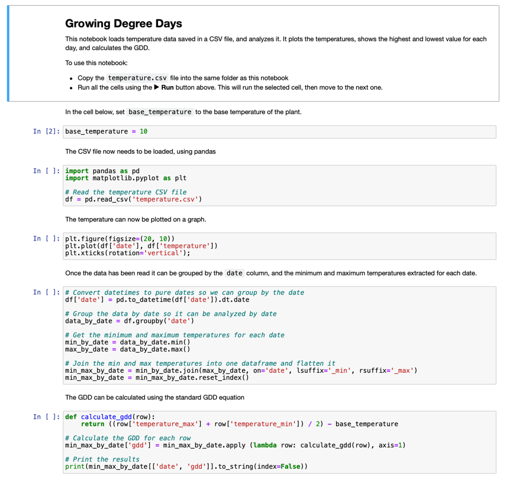

# Visualiser les données DJC à l'aide d'un Jupyter Notebook

## Instructions

Dans cette leçon, vous avez recueilli des données DJC à l'aide d'un capteur IoT. Pour obtenir de bonnes données DJC, vous devez recueillir des données pendant plusieurs jours. Pour vous aider à visualiser les données de température et à calculer le DJC, vous pouvez utiliser des outils tels que [Jupyter Notebooks](https://jupyter.org) pour analyser les données.

Commencez par recueillir des données pendant quelques jours. Vous devez vous assurer que le code de votre serveur fonctionne tout le temps que votre dispositif IoT est en marche, soit en ajustant vos paramètres de gestion de l'énergie, soit en exécutant quelque chose comme [ce script Python maintenant le système actif].(https://github.com/jaqsparow/keep-system-active).

Une fois que vous avez les données de température, vous pouvez utiliser le Jupyter Notebook dans ce repo pour les visualiser et calculer le JDC. Les notebooks Jupyter mélangent du code et des instructions dans des blocs appelés *cellules*, souvent du code en Python. Vous pouvez lire les instructions, puis exécuter chaque bloc de code, bloc par bloc. Vous pouvez également modifier le code. Dans ce notebook par exemple, vous pouvez modifier la température de base utilisée pour calculer le JDC de votre installation.

1. Créez un dossier `gdd-calcul` (GDD correspond à DJC en français)

1. Téléchargez le fichier [gdd.ipynb](../code-notebook/gdd.ipynb) et copiez le dans le dossier`gdd-calcul`.

1. Copiez le fichier `temperature.csv` créé par le serveur MQTT.

1. Créez un nouvel environnement virtuel Python dans le dossier `gdd-calcul`.

1. Installez quelques paquets pip pour les carnets Jupyter, ainsi que les bibliothèques nécessaires à la gestion et au tracé des données :

    ```sh
    pip install --upgrade pip
    pip install pandas
    pip install matplotlib
    pip install jupyter
    ```

1. Exécutez le notebook dans Jupyter :

    ```sh
    jupyter notebook gdd.ipynb
    ```

    Jupyter démarre et ouvre le notebook dans votre navigateur. Suivez les instructions du carnet de notes pour visualiser les températures mesurées et calculer les degrés-jours de croissance.

    

## Rubrique

| Critère | Exemplaire | Adequat | À améliorer |
| -------- | --------- | -------- | ----------------- |
| Capture de données | Capture au moins deux journées de données | Capture au moins une journée de données | Capture des données |
| Calcul du DJC | Exécute le notebook et calcul le DJC | Exécute le notebook | Incapable d'exécuter le notebook |
