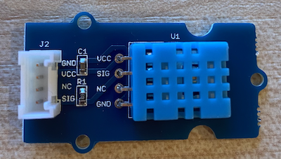
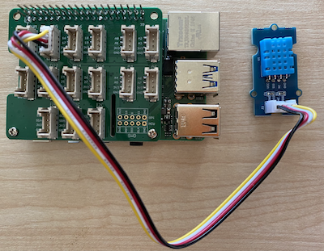

# 온도 측정 - 라즈베리 파이

이 단원에서는 라즈베리 파이에 온도 센서를 추가합니다.

## 하드웨어

당신이 사용할 센서는 두 센서를 하나의 패키지로 결합한 [DHT11 습도 및 온도 센서](https://www.seeedstudio.com/Grove-Temperature-Humidity-Sensor-DHT11.html)입니다. 이것은 온도, 습도와 때로는 대기압을 결합한 다수의 상업적으로 이용 가능한 센서로 상당히 인기가 있습니다. 온도 센서 구성 요소는 음의 온도 계수(NTC) 서미스터로, 온도가 증가함에 따라 저항이 감소하는 서미스터입니다.

이것은 디지털 센서이므로 마이크로컨트롤러가 읽을 수 있는 온도와 습도 데이터가 포함된 디지털 신호를 생성하는 온보드 ADC를 가지고 있습니다.

### 온도 센서 연결

Grove 온도 센서는 라즈베리 파이에 연결할 수 있습니다.

#### 임무

온도 센서를 연결하십시오.



1. 온도와 습도 센서의 소켓에 Grove 케이블의 한 쪽 끝을 삽입합니다. 한쪽 방향으로만 진행됩니다.

1. 라즈베리 파이의 전원을 끈 상태에서 Grove 케이블의 다른 쪽 끝을 Pi에 부착된 Grove Base hat의 **D5**가 적힌 디지털 소켓에 연결합니다. 이 소켓은 GPIO 핀 옆의 소켓 행에서 왼쪽 두 번째입니다.



## 온도 센서 프로그래밍

이제 부착된 온도 센서를 사용하도록 장치를 프로그래밍할 수 있습니다.

### 임무

장치를 프로그래밍합니다.

1. Pi의 전원을 켜고 부팅될 때까지 기다립니다.

1. Pi에서 직접 VS Code를 실행하거나 원격 SSH 확장을 통해 연결합니다.

   > ⚠️ 필요한 경우 [레슨 1의 VS Code를 설정 및 실행 설명](../../../../1-getting-started/lessons/1-introduction-to-iot/pi.md)을 참고할 수 있습니다.

1. 터미널에서 `pi` 사용자 홈 디렉토리에 `temperature-sensor`라는 새 폴더를 만듭니다. 이 폴더 안에 `app.py` 파일을 생성합니다.

   ```sh
   mkdir temperature-sensor
   cd temperature-sensor
   touch app.py
   ```

1. 이 폴더를 VS Code에서 엽니다.

1. 온습도 센서를 사용하기 위해서는 추가적인 pip 패키지 설치가 필요합니다. VS Code의 터미널에서 Pi에 이 pip 패키지를 설치하기 위한 다음의 명령어를 실행합니다:

   ```sh
   pip3 install seeed-python-dht
   ```

1. 필요한 라이브러리를 import하기 위해 다음의 코드를 `app.py` 파일에 추가합니다:

   ```python
   import time
   from seeed_dht import DHT
   ```

   `from seeed_dht import DHT`는 `seeed_dht` 모듈에서 Grove 온도 센서와 상호 작용할 `DHT` 클래스를 import 합니다.

1. 위의 코드 뒤에 다음의 코드를 추가하여 온도 센서를 관리하는 클래스의 인스턴스를 생성합니다:

   ```python
   sensor = DHT("11", 5)
   ```

   이것은 디지털 온습도 센서(**D**igital **H**umidity and **T**emperature)를 제어하는 `DHT` 클래스의 인스턴스를 선언입니다. 첫 번째 파라미터는 사용되는 센서가 _DHT11_ 센서임을 나타내는 코드입니다. 사용 중인 라이브러리는 이 센서의 다른 버전들을 지원합니다. 두 번째 파라미터는 센서가 Grove base hat에서 디지털 포트 `D5`에 연결되었다는 것을 나타내는 코드입니다.

   > ✅ 모든 소켓은 고유한 핀 번호를 가졌다는 것을 기억하세요.핀 번호 0, 2, 4, 6번은 아날로그 핀이고, 핀 번호 5, 16, 18, 22, 24, 26 번은 디지털 핀입니다.

1. 위의 코드 뒤에 무한 루프를 추가하여 온도 센서 값을 폴링하고 콘솔에 출력합니다:

   ```python
   while True:
      _, temp = sensor.read()
      print(f'Temperature {temp}°C')
   ```

   `sensor.read()`의 호출은 습도와 온도의 튜플을 반환합니다. 온도 값만 필요하므로 습도 값은 무시됩니다. 온도 값은 콘솔에 출력됩니다.

1. 온도를 지속적으로 확인할 필요는 없으므로 10초의 짧은 sleep을 `loop`의 끝에 추가합니다. sleep은 장치가 소비하는 전력을 줄여줍니다.

   ```python
   time.sleep(10)
   ```

1. VS Code의 터미널에서 다음을 실행하여 Python 앱을 실행합니다:

   ```sh
   python3 app.py
   ```

   콘솔에 온도 값이 출력되는 것을 볼 수 있습니다. 엄지 손가락으로 누르는 것처럼 센서에 따뜻한 것을 데거나 팬을 사용하여 값이 변하는 것을 확인하십시오:

   ```output
   pi@raspberrypi:~/temperature-sensor $ python3 app.py
   Temperature 26°C
   Temperature 26°C
   Temperature 28°C
   Temperature 30°C
   Temperature 32°C
   ```

> 💁 이 코드는 [code-temperature/pi](../code-temperature/pi) 폴더에 있습니다.

😀 온도 센서 프로그램이 성공적이었습니다!
