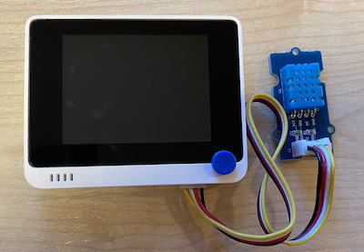

# Mesure de la température - Terminal Wio

Dans cette partie de la leçon, vous allez ajouter un capteur de température à votre terminal Wio, et lire les valeurs de température à partir de celui-ci.

## Matériel

Le terminal Wio a besoin d'un capteur de température.

La sonde que vous utiliserez est une [sonde d'humidité et de température DHT11](https://www.seeedstudio.com/Grove-Temperature-Humidity-Sensor-DHT11.html), combinant deux capteurs dans un même boîtier. Cette méthode est assez populaire, avec un certain nombre de capteurs disponibles dans le commerce combinant température, humidité et parfois pression atmosphérique. Le composant du capteur de température est une thermistance à coefficient de température négatif (CTN), une thermistance dont la résistance diminue lorsque la température augmente.

Il s'agit d'un capteur numérique, qui dispose donc d'un ADC intégré pour créer un signal numérique contenant les données de température et d'humidité que le microcontrôleur peut lire.

### Connecter le capteur de température

Le capteur de température Grove peut être connecté au port numérique des terminaux Wio.

#### Tâche - connecter le capteur de température

Connectez le capteur de température.


1. Insérez une extrémité d'un câble Grove dans la prise du capteur d'humidité et de température. Il ne peut être inséré que dans un seul sens.

1. Le terminal Wio étant déconnecté de votre ordinateur ou de toute autre source d'alimentation, connectez l'autre extrémité du câble Grove à la prise Grove de droite du terminal Wio lorsque vous regardez l'écran. Il s'agit de la prise la plus éloignée du bouton d'alimentation.



## Programmer le capteur de température

Le terminal Wio peut maintenant être programmé pour utiliser le capteur de température joint.

### Tâche - programmer le capteur de température

Programmez l'appareil.

1. Créez un tout nouveau projet Wio Terminal en utilisant PlatformIO. Appelez ce projet `temperature-sensor`. Ajoutez du code dans la fonction `setup` pour configurer le port série.

    > ⚠️ Vous pouvez vous référer [aux instructions pour créer un projet PlatformIO dans le projet 1, leçon 1 si nécessaire](../../../../1-getting-started/lessons/1-introduction-to-iot/wio-terminal.md#create-a-platformio-project).

1. Ajoutez une dépendance de la bibliothèque de capteurs d'humidité et de température Seeed Grove au fichier `platformio.ini` du projet :

    ```ini
    lib_deps =
        seeed-studio/Grove Temperature And Humidity Sensor @ 1.0.1
    ```

    > ⚠️ Vous pouvez vous référer [aux instructions pour ajouter des bibliothèques à un projet PlatformIO dans le projet 1, leçon 4 si nécessaire](../../../../1-getting-started/lessons/4-connect-internet/wio-terminal-mqtt.md#install-the-wifi-and-mqtt-arduino-libraries).

1. Ajoutez les directives `#include` suivantes en haut du fichier, sous la directive existante `#include <Arduino.h>` :

    ```cpp
    #include <DHT.h>
    #include <SPI.h>
    ```

    Ceci importe les fichiers nécessaires pour interagir avec le capteur. Le fichier d'en-tête `DHT.h` contient le code du capteur lui-même, et l'ajout de l'en-tête `SPI.h` garantit que le code nécessaire pour parler au capteur est lié lors de la compilation de l'application.

1. Avant la fonction "setup", déclarez le capteur DHT :

    ```cpp
    DHT dht(D0, DHT11);
    ```

    Ceci déclare une instance de la classe `DHT` qui gère le capteur **D**numérique **H** d'humidité et **T** de température. Celle-ci est connectée au port `D0`, le connecteur Grove de droite sur le terminal Wio. Le second paramètre indique au code que le capteur utilisé est le capteur *DHT11* - la bibliothèque que vous utilisez supporte d'autres variantes de ce capteur.

1. Dans la fonction `setup`, ajoutez du code pour configurer la connexion série :

    ```cpp
    void setup()
    {
        Serial.begin(9600);
    
        while (!Serial)
            ; // Wait for Serial to be ready
    
        delay(1000);
    }
    ```

1. A la fin de la fonction `setup`, après le dernier `delay`, ajoutez un appel pour démarrer le capteur DHT :

    ```cpp
    dht.begin();
    ```

1. Dans la fonction `loop`, ajoutez du code pour appeler le capteur et imprimer la température sur le port série :

    ```cpp
    void loop()
    {
        float temp_hum_val[2] = {0};
        dht.readTempAndHumidity(temp_hum_val);
        Serial.print("Temperature: ");
        Serial.print(temp_hum_val[1]);
        Serial.println ("°C");
    
        delay(10000);
    }
    ```

    Ce code déclare un tableau vide de 2 flottants, et le passe à l'appel à `readTempAndHumidity` sur l'instance `DHT`. Cet appel remplit le tableau avec 2 valeurs - l'humidité va dans l'élément 0 du tableau (rappelez-vous qu'en C++ les tableaux sont basés sur 0, donc le 0ème élément est le 'premier' élément du tableau), et la température va dans le 1er élément.

    La température est lue à partir du premier élément du tableau, et imprimée sur le port série.

    > 🇺🇸 La température est lue en Celsius. Pour les Américains, pour la convertir en Fahrenheit, il faut diviser la valeur Celsius lue par 5, puis multiplier par 9, puis ajouter 32. Par exemple, une température de 20°C devient ((20/5)*9) + 32 = 68°F.

1. Construisez et téléchargez le code sur le terminal Wio.

    > ⚠️ Vous pouvez vous référer [aux instructions pour créer un projet PlatformIO dans le projet 1, leçon 1 si nécessaire](../../../../1-getting-started/lessons/1-introduction-to-iot/wio-terminal.md#write-the-hello-world-app).

1. Une fois téléchargé, vous pouvez surveiller la température en utilisant le moniteur série :

    ```output
    > Executing task: platformio device monitor <
    
    --- Available filters and text transformations: colorize, debug, default, direct, hexlify, log2file, nocontrol, printable, send_on_enter, time
    --- More details at http://bit.ly/pio-monitor-filters
    --- Miniterm on /dev/cu.usbmodem1201  9600,8,N,1 ---
    --- Quit: Ctrl+C | Menu: Ctrl+T | Help: Ctrl+T followed by Ctrl+H ---
    Temperature: 25.00°C
    Temperature: 25.00°C
    Temperature: 25.00°C
    Temperature: 24.00°C
    ```

> 💁 Vous pouvez trouver ce code dans le fichier [code-température/wio-terminal](../code-temperature/wio-terminal).

😀 Votre programme de capteur de température a été un succès !
