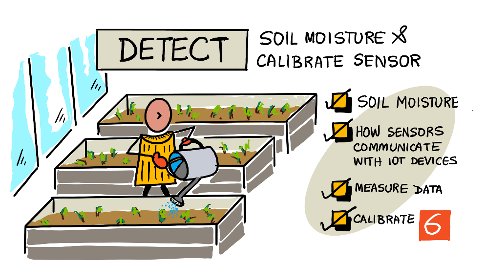

# Detect soil moisture

> Sketchnote by [Nitya Narasimhan](https://github.com/nitya). Click the image for a larger version.

## Pre-lecture quiz

[Pre-lecture quiz](https://brave-island-0b7c7f50f.azurestaticapps.net/quiz/11)

## Introduction

In the last lesson we looked at measuring an ambient property and using it to predict plant growth. Temperature can be controlled, but it is expensive to do so, requiring controlled environments. The easiest ambient property to control for plants is water - something that is controlled everyday from large-scale irrigation systems to young kids with watering cans watering their gardens.

In this lesson you will learn about measuring soil moisture, and in the next lesson you will learn how to control an automated watering system. This lesson introduces a third sensor, you've already used a light sensor, a temperature sensor, so in this lesson you will also learn more about how sensors and actuators communicate with IoT devices to understand more about how a soil moisture sensor can send data to an IoT device.

In this lesson we'll cover:

* [Soil moisture](#soil-moisture)
* [How sensors communicate with IoT devices](#how-sensors-communicate-with-iot-devices)
* [Measure the moisture levels in soil](#measure-the-moisture-levels-in-soil)
* [Sensor calibration](#sensor-calibration)

## Soil moisture

Plants require water to grow. They absorb water throughout the entire plant, with the majority being absorbed by the root system. Water is used by the plant for three things:

* [Photosynthesis](https://wikipedia.org/wiki/Photosynthesis) - plants creates a chemical reaction with water, carbon dioxide and light to produce carbohydrates and oxygen.
* [Transpiration](https://wikipedia.org/wiki/Transpiration) - plants use water for diffusion of carbon dioxide from the air into the plant via pores in the leaves. This process also carries nutrients around the plant, and cools the plant, similar to how humans sweat.
* Structure - plants also need water to maintain their structure - they are 90% water (as opposed to humans at only 60%), and this water keeps the cells rigid. If a plant doesn't have enough water it will wilt and eventually die.

✅ Do some research: how much water is lost through transpiration?

The root system provides water from moisture in the soil where the plant grows. Too little water in the soil and the plant cannot absorb enough to grow, too much water and roots cannot absorb enough oxygen needed to function. This leads to roots dying and the plant unable to get enough nutrients to survive.

For a farmer to get the best plant growth, the soil needs to be not too wet and not too dry. IoT devices can help with this by measuring soil moisture, allowing a farmer to only water when needed.

### Ways to measure soil moisture

There are a range of different types of sensor you can use to measure soil moisture:

* Resistive - a resistive sensor has 2 probes that go into the soil. An electric current is sent to one probe, and received by the other. The sensor then measures the resistance of the soil - measuring how much the current drops at the second probe. Water is a good conductor of electricity, so the higher the water content of the soil, the lower the resistance.

    

    > 💁 You can build a resistive soil moisture sensor using two pieces of metal, such as nails, separated by a couple of centimeters, and measuring the resistance between them using a multimeter.

* Capacitive - a capacitive moisture sensor measures the amount of electric charge that can be stored across a positive and a negative electrical plate, or [capacitance](https://wikipedia.org/wiki/Capacitance). The capacitance of soil changes as the moisture level changes, and this can be converted to a voltage that can be measured by an IoT device. The wetter the soil, the lower the voltage that comes out.

    

These are both analog sensors, returning a voltage to indicate soil moisture. So how does this voltage get to your code? Before going any further with these sensors, let's look at how sensors and actuators communicate with IoT devices.

## How sensors communicate with IoT devices

So far in these lessons you've learned about a number of sensors and actuators, and these have been communicating with your IoT dev kit if you've been doing the physical hardware labs. But how does this communication work? How does a resistance measurement from a soil moisture sensor become a number you can use from code?

To communicate with most sensors and actuators you need some hardware, and a communication protocol - that is a well defined way for data to be sent and received. Take for example a capacitive soil moisture sensor:

* How is this sensor connected to the IoT device?
* If it measures a voltage that is an analog signal, it will need an ADC to create a digital representation of the value, and this value is sent as an alternating voltage to send 0s and 1s - but how long is each bit sent for?
* If the sensor returns a digital value, that will be a stream of 0s and 1s, again how long is each bit sent for?
* If the voltage is high for 0.1s is that a single 1 bit, or 2 consecutive 1 bits, or 10?
* At what point does the number start? Is `00001101` 25, or are the first 5 bits the end of the previous value?

The hardware provides the physical connectivity over which the data is sent, the different communication protocols ensure that the data is sent or received in the correct way so it can be interpreted.

### General Purpose Input Output (GPIO) pins

GPIO is a set of pins you can use to connect hardware to your IoT device, and are often available on IoT developer kits such as the Raspberry Pi or Wio Terminal. You can use the various communication protocols covered in this section over the GPIO pins. Some GPIO pins provide a voltage, usually 3.3V or 5V, some pins are ground, and others can be programmatically set to either send a voltage (output), or receive a voltage (input).

> 💁 An electrical circuit needs to connect a voltage to ground via whatever circuitry you are using. You can think of voltage as the positive (+ve) terminal of a battery and ground as the negative (-ve) terminal.

You can use GPIO pins directly with some digital sensors and actuators when you only care about on or off values - on referred to as high, off as low. Some examples are:

* Button. You can connect a button between a 5V pin and a pin set to input. When you press the button it completes a circuit between the 5V pin, through the button to the input pin. From code you can read the voltage at the input pin, and if it is high (5V) then the button is pressed, if it is low (0v) then the button is not pressed. Remember the actual voltage itself is not read, instead you get a digital signal of 1 or 0 depending on if the voltage is above a threshold or not.

    

* LED. You can connect an LED between an output pin and a ground pin (using a resistor otherwise you'll burn out the LED). From code you can set the output pin to high and it will send 3.3V, making a circuit from the 3.3V pin, through the LED, to the ground pin. This will light the LED.

    

For more advanced sensors, you can use GPIO pins to send and receive digital data directly with digital sensors and actuators, or via controller boards with ADCs and DACs to talk to analog sensors and actuators.

> 💁 if you are using a Raspberry Pi for these labs, the Grove Base Hat has hardware to convert analog sensor signals to digital to send over GPIO.

✅ If you have an IoT device with GPIO pins, locate these pins and find a diagram indicating which pins are voltage, ground or programmable.

### Analog pins

Some devices, such as Arduino devices, provide analog pins. These are the same as GPIO pins, but instead of only supporting a digital signal, they have an ADC to convert voltage ranges to numerical values. Usually the ADC has a 10-bit resolution, meaning it converts voltages to a value of 0-1,023.

For example, on a 3.3V board, if the sensor returns 3.3V, the value returned would be 1,023. If the voltage returned was 1.65v, the value returned will be 511.

> 💁 Back in nightlight - lesson 3, the light sensor returned a value from 0-1,023. If you are using a Wio Terminal, the sensor was connected to an analog pin. If you are using a Raspberry Pi, then the sensor was connected to an analog pin on the base hat that has an integrated ADC to communicate over the GPIO pins. The virtual device was set to send a value from 0-1,023 to simulate an analog pin.

Soil moisture sensors rely on voltages, so will use analog pins and give values from 0-1,023.

### Inter Integrated Circuit  (I2C)

I2C, pronounced *I-squared-C*, is a multi-controller, multi-peripheral protocol, with any connected device able to act as a controller or peripheral communicating over the I2C bus (the name for a communication system that transfers data). Data is sent as addressed packets, with each packet containing the address of the connected device it is intended for.

> 💁 This model used to be referred to as master/slave, but this terminology is being dropped due to its association with slavery. The [Open Source Hardware Association has adopted controller/peripheral](https://www.oshwa.org/a-resolution-to-redefine-spi-signal-names/), but you may still see references to the old terminology.

Devices have an address that is used when they connect to the I2C bus, and is usually hard coded on the device. For example, each type of Grove sensor from Seeed has the same address, so all the light sensors have the same address, all the buttons have the same address that is different from the light sensor address. Some devices have ways to change the address, by changing jumper settings or soldering pins together.

I2C has a bus made of 2 main wires, along with 2 power wires:

| Wire | Name | Description |
| ---- | --------- | ----------- |
| SDA | Serial Data | This wire is for sending data between devices. |
| SCL | Serial Clock | This wire sends a clock signal at a rate set by the controller. |
| VCC | Voltage common collector | The power supply for the devices. This is connected to the SDA and SCL wires to provide their power via a pull-up resistor that switches the signal off when no device is the controller. |
| GND | Ground | This provides a common ground for the electrical circuit. |

To send data, one device will issue a start condition to show it is ready to send data. It will then become the controller. The controller then sends the address of the device that it wants to communicate with, along with if it wants to read or write data. After the data has been transmitted, the controller sends a stop condition to indicate that it has finished. After this another device can become the controller and send or receive data.

I2C has speed limits, with 3 different modes running at fixed speeds. The fastest is High Speed mode with a maximum speed of 3.4Mbps (megabits per second), though very few devices support that speed. The Raspberry Pi for example, is limited to fast mode at 400Kbps (kilobits per second). Standard mode runs at 100Kbps.

> 💁 If you are using a Raspberry Pi with a Grove Base hat as your IoT hardware, you will be able to see a number of I2C sockets on the board you can use to communicate with I2C sensors. Analog Grove sensors also use I2C with an ADC to send analog values as digital data, so the light sensor you used simulated an analog pin, with the value sent over I2C as the Raspberry Pi only supports digital pins.

### Universal asynchronous receiver-transmitter (UART)

UART involves physical circuitry that allows two devices to communicate. Each device has 2 communication pins - transmit (Tx) and receive (Rx), with the Tx pin of the first device connected to the Rx pin of the second, and with the Tx pin of the second device connected to the Rx pin of the first. This allows data to be sent in both directions.

* Device 1 transmits data from its Tx pin, which is received by device 2 on it's Rx pin
* Device 1 receives data on its Rx pin that is transmitted by device 2 from its Tx pin

> 🎓 The data is sent one bit at a time, and this is known as *serial* communication. Most operating systems and microcontrollers have *serial ports*, that is connections that can send and receive serial data that are available to your code.

UART devices have a [baud rate](https://wikipedia.org/wiki/Symbol_rate) (also known as Symbol rate), which is the speed that data will be sent and received in bits per second. A common baud rate is 9,600, meaning 9,600 bits (0s and 1s) of data are sent each second.

UART uses start and stop bits - that is it sends a start bit to indicate that it's about to send a byte (8 bits) of data, then a stop bit after it sends the 8 bits.

UART speed is dependent on hardware, but even the fastest implementations don't exceed 6.5 Mbps (megabits per second, or millions of bits, 0 or 1, sent per second).

You can use UART over GPIO pins - you can set one pin as Tx and another as Rx, then connect these to another device.

> 💁 If you are using a Raspberry Pi with a Grove Base hat as your IoT hardware, you will be able to see a UART socket on the board you can use to communicate with sensors that use the UART protocol.

### Serial Peripheral Interface (SPI)

SPI is designed for communicating over short distances, such as on a microcontroller to talk to a storage device such as flash memory. It is based on a controller/peripheral model with a single controller (usually the processor of the IoT device) interacting with multiple peripherals. The controller controls everything by selecting a peripheral and sending or requesting data.

> 💁 Like I2C, the terms controller and peripheral are recent changes, so you may see the older terms still used.

SPI controllers use 3 wires, along with 1 extra wire per peripheral. Peripherals use 4 wires. These wires are:

| Wire | Name | Description |
| ---- | --------- | ----------- |
| COPI | Controller Output, Peripheral Input | This wire is for sending data from the controller to the peripheral. |
| CIPO | Controller Input, peripheral Output | This wire is for sending data from the peripheral to the controller. |
| SCLK | Serial Clock | This wire sends a clock signal at a rate set by the controller. |
| CS   | Chip Select | The controller has multiple wires, one per peripheral, and each wire connects to the CS wire on the corresponding peripheral. |

The CS wire is used to activate one peripheral at a time, communicating over the COPI and CIPO wires. When the controller needs to change peripheral, it deactivates the CS wire connected to the currently active peripheral, then activates the wire connected to the peripheral it wants to communicate with next.

SPI is *full-duplex*, meaning the controller can send and receive data at the same time from the same peripheral using the COPI and CIPO wires. SPI uses a clock signal on the SCLK wire to keep the devices in sync, so unlike sending directly over UART it doesn't need start and stop bits.

There are no defined speed limits for SPI, with implementations often able to transmit multiple megabytes of data per second.

IoT developer kits often support SPI over some of the GPIO pins. For example, on a Raspberry Pi you can use GPIO pins 19, 21, 23, 24 and 26 for SPI.

### Wireless

Some sensors can communicate over standard wireless protocols, such as Bluetooth (mainly Bluetooth Low Energy, or BLE), LoRaWAN (a **Lo**ng **Ra**nge low power networking protocol), or WiFi. These allow for remote sensors not physically connected to an IoT device.

One such example is in commercial soil moisture sensors. These will measure soil moisture in a field, then send the data over LoRaWan to a hub device, which will process the data or send it over the Internet. This allows the sensor to be away from the IoT device that manages the data, reducing power consumption and the need for large WiFi networks or long cables.

BLE is popular for advanced sensors such as fitness trackers work on the wrist. These combine multiple sensors and send the sensor data to an IoT device in the form of your phone via BLE.

✅ Do you have any bluetooth sensors on your person, in your house or in your school? These might include temperature sensors, occupancy sensors, device trackers and fitness devices.

One popular way for commercial devices to connect is Zigbee. Zigbee uses WiFi to form mesh networks between devices, where each device connects to as many nearby devices as possible, forming a large number of connections like a spiders web. When one device wants to send a message to the Internet it can send it to the nearest devices, which then forward it on to other nearby devices and so on, until it reaches a coordinator and can be sent to the Internet.

> 🐝 The name Zigbee refers to the waggle dance of honey bees after their return to the beehive.

## Measure the moisture levels in soil

You can measure the moisture level in soil using a soil moisture sensor, an IoT device, and a house plant or nearby patch of soil.

### Task - measure soil moisture

Work through the relevant guide to measure soil moisture using your IoT device:

* [Arduino - Wio Terminal](wio-terminal-soil-moisture.md)
* [Single-board computer - Raspberry Pi](pi-soil-moisture.md)
* [Single-board computer - Virtual device](virtual-device-soil-moisture.md)

## Sensor calibration

Sensors rely on measuring electrical properties such as resistance or capacitance.

> 🎓 Resistance, measured in ohms (Ω) is how much opposition there is to the electric current travelling through something. When a voltage is applied to a material, the amount of current that passes through it is dependant on the resistance of the material. You can read more on the [electrical resistance page on Wikipedia](https://wikipedia.org/wiki/Electrical_resistance_and_conductance).

> 🎓 Capacitance, measured in farads (F), is the ability of a component or circuit to collect and store electrical energy. You can read more on capacitance on the [capacitance page on Wikipedia](https://wikipedia.org/wiki/Capacitance).

These measurements are not always useful - imagine a temperature sensor that gave you a measurement of 22.5KΩ! Instead the value measured needs to be converted into a useful unit by being calibrated - that is matching the values measured to the quantity measured to allow new measurements to be converted to the right unit.

Some sensors come pre-calibrated. For example the temperature sensor you used in the last lesson was already calibrated so that it can return a temperature measurement in °C. In the factory the first sensor created would be exposed to a range of known temperatures and the resistance measured. This would then be used to build a calculation that can convert from the value measured in Ω (the unit of resistance) to °C.

> 💁 The formula to calculate resistance from temperature is called the [Steinhart–Hart equation](https://wikipedia.org/wiki/Steinhart–Hart_equation).

### Soil moisture sensor calibration

Soil moisture is measured using gravimetric or volumetric water content.

* Gravimetric is the weight of water in a unit weight of soil measured, as the number of kilograms of water per kilogram of dry soil
* Volumetric is the volume of water in a unit volume of soil measured, as the number of cubic metres of water per cubic metres of dry soil

> 🇺🇸 For Americans, because of the consistency of the units, these can be measured in pounds instead of kilograms or cubic feet instead of cubic metres.

Soil moisture sensors measure electrical resistance or capacitance - this not only varies by soil moisture, but also soil type as the components in the soil can change its electrical characteristics. Ideally sensors should be calibrated - that is taking readings from the sensor and comparing them to measurements found using a more scientific approach. For example a lab can calculate the gravimetric soil moisture using samples of a specific field taken a few times a year, and these numbers used to calibrate the sensor, matching the sensor reading to the gravimetric soil moisture.

The graph above shows how to calibrate a sensor . The voltage is captured for a soil sample that is then measured in a lab by comparing the moist weight to the dry weight (by measuring the weight wet, then drying in an oven and measuring dry). Once a few readings have been taken, this can be plotted on a graph and a line fitted to the points. This line can then be used to convert soil moisture sensor readings taken by an IoT device into actual soil moisture measurements.

💁 For resistive soil moisture sensors, the voltage increases as soil moisture increases. For capacitive soil moisture sensors, the voltage decreases as soil moisture increases, so the graphs for these would slope downwards, not upwards.

The graph above shows a voltage reading from a soil moisture sensor, and by following that to the line on the graph, the actual soil moisture can be calculated.

This approach means the farmer only needs to get a few lab measurements for a field, then they can use IoT devices to measure soil moisture - drastically speeding up the time to take measurements.

---

## 🚀 Challenge

Resistive and capacitive soil moisture sensors have a number of differences. What are these differences, and which type (if any) is the best for a farmer to use? Does this answer change between developing and developed countries?

## Post-lecture quiz

[Post-lecture quiz](https://brave-island-0b7c7f50f.azurestaticapps.net/quiz/12)

## Review & Self Study

Read up on the hardware and protocols used by sensors and actuators:

* [GPIO Wikipedia page](https://wikipedia.org/wiki/General-purpose_input/output)
* [UART Wikipedia page](https://wikipedia.org/wiki/Universal_asynchronous_receiver-transmitter)
* [SPI Wikipedia page](https://wikipedia.org/wiki/Serial_Peripheral_Interface)
* [I2C Wikipedia page](https://wikipedia.org/wiki/I²C)
* [Zigbee Wikipedia page](https://wikipedia.org/wiki/Zigbee)

## Assignment

[Calibrate your sensor](assignment.md)
