# Détecter l'humidité du sol

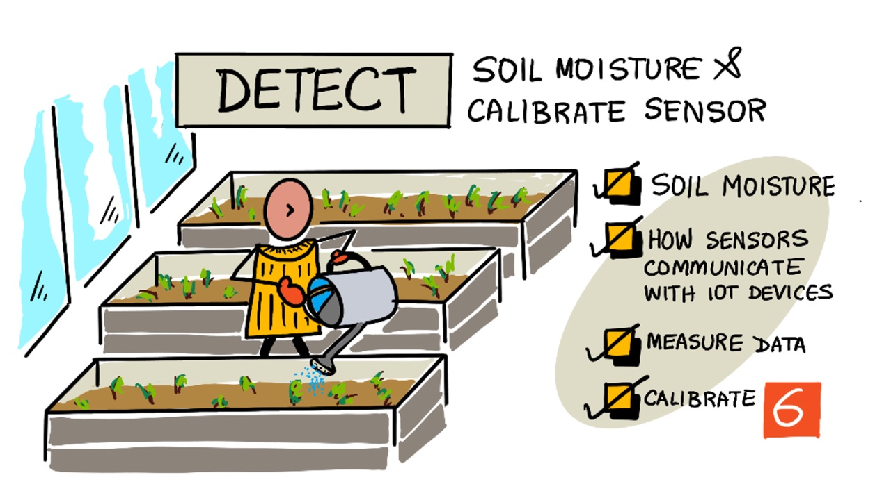

> Illustré par [Nitya Narasimhan](https://github.com/nitya). Click the image for a larger version.

## Quiz Pré-lecture

[Quiz Pré-lecture](https://black-meadow-040d15503.1.azurestaticapps.net/quiz/11)

## Introduction

Dans la dernière leçon, nous avons étudié la mesure d'une propriété ambiante ainsi que son utilisation afin de prédire la croissance des plantes. La température peut être contrôlée, mais cette opération est coûteuse et nécessite des environnements contrôlés. La propriété ambiante la plus facile à contrôler pour les plantes est l'eau - un élément qui est contrôlé tous les jours, depuis les systèmes d'irrigation à grande échelle jusqu'aux jeunes enfants qui arrosent leur jardin avec un arrosoir.

Dans cette leçon, vous apprendrez à mesurer l'humidité du sol, et dans la leçon suivante, vous apprendrez à contrôler un système d'arrosage automatisé. Cette leçon introduit un troisième capteur, vous avez déjà utilisé un capteur de lumière, un capteur de température, donc dans cette leçon vous allez également en apprendre plus sur la façon dont les capteurs et les actionneurs communiquent avec les dispositifs IoT pour comprendre davantage comment un capteur d'humidité du sol peut envoyer des données à un dispositif IoT.

Dans cette leçon, nous aborderons:

* [Humidité du sol](#humidité-du-sol)
* [Comment les senseurs communiquent avec les composants IoT](#comment-les-senseurs-communiquent-avec-les-composants-IoT)
* [Mesurer les niveaux d'humidité dans le sol](#mesurer-les-niveaux-d-humidité-dans-le-sol)
* [Étalonnage du capteur](#étalonnage-du-capteur)

## Humidité du sol

Les plantes ont besoin d'eau pour se développer. Elles absorbent l'eau dans toute la plante, la majorité étant absorbée par le système racinaire. L'eau est utilisée par la plante pour trois choses :

* [Photosynthèse](https://wikipedia.org/wiki/Photosynthesis) - Les plantes créent une réaction chimique avec l'eau, le dioxyde de carbone et la lumière pour produire des hydrates de carbone et de l'oxygène.
* [Transpiration](https://wikipedia.org/wiki/Transpiration) - Les plantes utilisent l'eau pour diffuser le dioxyde de carbone de l'air dans la plante via les pores des feuilles. Ce processus permet également de transporter les nutriments autour de la plante et de la refroidir, comme la transpiration humaine.
* Structure - les plantes ont également besoin d'eau pour maintenir leur structure - elles sont composées à 90 % d'eau (contrairement aux humains qui n'en ont que 60 %), et cette eau maintient les cellules rigides. Si une plante n'a pas assez d'eau, elle se flétrit et finit par mourir.

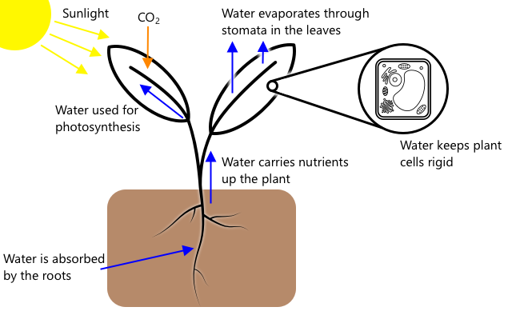

✅ Faites des recherches : quelle quantité d'eau est perdue par transpiration ?

Le système racinaire fournit de l'eau à partir de l'humidité du sol où pousse la plante. Trop peu d'eau dans le sol et la plante ne peut pas en absorber suffisamment pour se développer, trop d'eau et les racines ne peuvent pas absorber suffisamment d'oxygène nécessaire à leur fonctionnement. Les racines meurent alors et la plante ne peut pas obtenir suffisamment de nutriments pour survivre.

Pour qu'un agriculteur obtienne la meilleure croissance des plantes, le sol doit être ni trop humide ni trop sec. Les dispositifs IoT peuvent y contribuer en mesurant l'humidité du sol, ce qui permet à l'agriculteur de n'arroser que lorsque cela est nécessaire.

### Comment les senseurs communiquent avec les composants IoT

Il existe différents types de capteurs que vous pouvez utiliser pour mesurer l'humidité du sol :

* Résistif - un capteur résistif possède deux sondes qui pénètrent dans le sol. Un courant électrique est envoyé à une sonde et reçu par l'autre. Le capteur mesure alors la résistance du sol - en mesurant de combien le courant chute au niveau de la deuxième sonde. L'eau est un bon conducteur d'électricité, donc plus la teneur en eau du sol est élevée, plus la résistance est faible.

    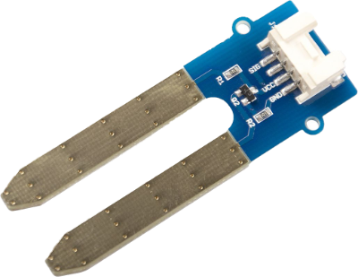

    > 💁 Vous pouvez construire un capteur d'humidité du sol résistif en utilisant deux morceaux de métal, comme des clous, séparés de quelques centimètres, et en mesurant la résistance entre eux à l'aide d'un multimètre.

* Capacitif - un capteur d'humidité capacitif mesure la quantité de charge électrique qui peut être stockée entre une plaque électrique positive et une plaque négative, ou [capacitance](https://wikipedia.org/wiki/Capacitance). La capacitance du sol change en fonction du niveau d'humidité, et cela peut être converti en une tension qui peut être mesurée par un appareil IoT. Plus le sol est humide, plus la tension qui en ressort est faible.

    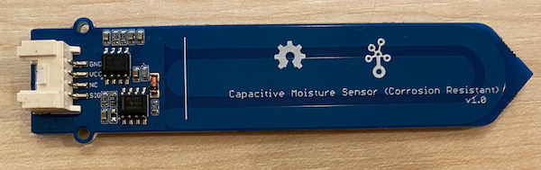

Ce sont tous deux des capteurs analogiques, qui renvoient une tension pour indiquer l'humidité du sol. Comment cette tension arrive-t-elle dans votre code ? Avant d'aller plus loin avec ces capteurs, voyons comment les capteurs et les actionneurs communiquent avec les appareils IoT.

## Comment les senseurs communiquent avec les composants IoT

Jusqu'à présent, dans ces leçons, vous avez appris à connaître un certain nombre de capteurs et d'actionneurs, et ceux-ci ont communiqué avec votre kit de développement IoT si vous avez fait les laboratoires de matériel physique. Mais comment cette communication fonctionne-t-elle ? Comment une mesure de résistance d'un capteur d'humidité du sol devient-elle un nombre utilisable dans le code ?

Pour communiquer avec la plupart des capteurs et des actionneurs, il faut du matériel et un protocole de communication, c'est-à-dire une méthode bien définie d'envoi et de réception des données. Prenons l'exemple d'un capteur capacitif d'humidité du sol :

* Comment ce capteur est-il connecté à l'appareil IoT ?
* S'il mesure une tension qui est un signal analogique, il aura besoin d'un "ADC" pour créer une représentation numérique de la valeur, et cette valeur est envoyée sous forme de tension alternative pour envoyer des 0 et des 1 - mais pendant combien de temps chaque bit est-il envoyé ?
* Si le capteur renvoie une valeur numérique, il s'agira d'un flux de 0 et de 1. Là encore, pendant combien de temps chaque bit est-il envoyé ?
* Si la tension est élevée pendant 0,1 s, s'agit-il d'un seul bit, de deux bits consécutifs ou de dix bits ?
* A quel moment le nombre commence-t-il ? Est-ce que `00001101` 25, ou est-ce que les 5 premiers bits sont la fin de la valeur précédente ?

Le matériel fournit la connectivité physique sur laquelle les données sont envoyées, les différents protocoles de communication garantissent que les données sont envoyées ou reçues de manière correcte pour pouvoir être interprétées.

### Broches d'entrée-sortie à usage général (GPIO)

GPIO est un ensemble de broches que vous pouvez utiliser pour connecter du matériel à votre dispositif IoT, et qui sont souvent disponibles sur les kits de développement IoT tels que le Raspberry Pi ou le Terminal Wio. Vous pouvez utiliser les différents protocoles de communication abordés dans cette section sur les broches GPIO. Certaines broches GPIO fournissent une tension, généralement 3,3 V ou 5 V, certaines broches sont des masses, et d'autres peuvent être configurées par programmation pour envoyer une tension (sortie) ou recevoir une tension (entrée).

> 💁 Un circuit électrique doit relier une tension à la terre via le circuit que vous utilisez. Vous pouvez considérer la tension comme la borne positive (+ve) d'une batterie et la terre comme la borne négative (-ve).

Vous pouvez utiliser les broches GPIO directement avec certains capteurs et actionneurs numériques lorsque vous ne vous préoccupez que des valeurs de marche ou d'arrêt - marche étant désignée comme haute, arrêt comme basse. Voici quelques exemples :

* Bouton. Vous pouvez connecter un bouton entre une broche 5V et une broche définie comme entrée. Lorsque vous appuyez sur le bouton, un circuit est créé entre la broche 5V, le bouton et la broche d'entrée. A partir du code, vous pouvez lire la tension sur la broche d'entrée, et si elle est élevée (5V), le bouton est enfoncé, si elle est basse (0V), le bouton n'est pas enfoncé. Rappelez-vous que la tension réelle elle-même n'est pas lue, mais que vous obtenez un signal numérique de 1 ou 0 selon que la tension est supérieure ou non à un seuil.

    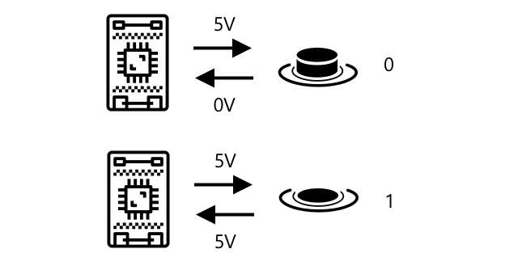

* LED. Vous pouvez connecter une LED entre une broche de sortie et une broche de masse (en utilisant une résistance, sinon vous allez brûler la LED). À partir du code, vous pouvez mettre la broche de sortie à un niveau élevé et elle enverra 3,3 V, créant un circuit de la broche 3,3 V à la broche de terre en passant par la DEL. Ceci allumera la LED.

    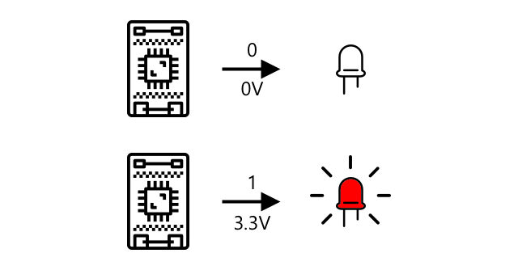

Pour les capteurs plus avancés, vous pouvez utiliser les broches GPIO pour envoyer et recevoir des données numériques directement avec des capteurs et des actionneurs numériques, ou via des cartes de contrôle avec des ADC et des DAC pour parler aux capteurs et actionneurs analogiques.

> 💁 Si vous utilisez un Raspberry Pi pour ces travaux pratiques, le Grove Base Hat dispose d'un matériel permettant de convertir les signaux analogiques des capteurs en signaux numériques à envoyer via GPIO.

✅ Si vous avez un dispositif IoT avec des broches GPIO, localisez ces broches et trouvez un diagramme indiquant quelles broches sont sous tension, reliées à la masse (ground) ou programmables.

### Broches analogiques

Certains appareils, tels que les appareils Arduino, fournissent des broches analogiques. Elles sont identiques aux broches GPIO, mais au lieu de supporter uniquement un signal numérique, elles disposent d'un ADC pour convertir les plages de tension en valeurs numériques. En général, l'ADC a une résolution de 10 bits, ce qui signifie qu'il convertit les tensions en une valeur de 0-1,023.

Par exemple, sur une carte 3.3V, si le capteur renvoie 3.3V, la valeur renvoyée sera de 1,023. Si la tension renvoyée est de 1,65 V, la valeur renvoyée sera de 511.

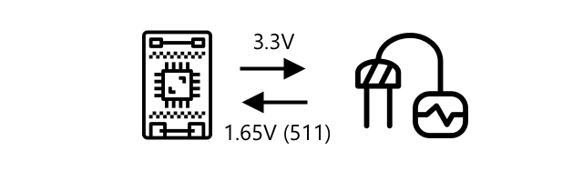

> 💁 Dans la leçon 3 de la veilleuse, le capteur de lumière renvoyait une valeur comprise entre 0 et 1,023. Si vous utilisez un terminal Wio, le capteur était connecté à une broche analogique. Si vous utilisez un Raspberry Pi, le capteur a été connecté à une broche analogique sur le chapeau de base qui a un ADC intégré pour communiquer sur les broches GPIO. Le dispositif virtuel a été configuré pour envoyer une valeur de 0-1,023 pour simuler une broche analogique.

Les capteurs d'humidité du sol reposent sur des tensions, ils utilisent donc des broches analogiques et donnent des valeurs comprises entre 0 et 1 023.

### Protocol "Inter Integrated Circuit"  (I2C)

I2C, prononcé *I-squared-C*, est un protocole multi-contrôleur, multi-périphérique, avec tout dispositif connecté capable d'agir comme un contrôleur ou un périphérique communiquant sur le bus I2C (le nom d'un système de communication qui transfère des données). Les données sont envoyées sous forme de paquets adressés, chaque paquet contenant l'adresse du périphérique connecté auquel il est destiné.

> 💁 Ce modèle était autrefois appelé "maître/esclave", mais cette terminologie est abandonnée en raison de son association avec l'esclavage. L'association [Open Source Hardware Association a adopté un contrôleur/périphérique](https://www.oshwa.org/a-resolution-to-redefine-spi-signal-names/), mais vous pouvez encore voir des références à l'ancienne terminologie.

Les dispositifs ont une adresse qui est utilisée lorsqu'ils se connectent au bus I2C, et qui est généralement écrite mot pour mot (hardcoded) sur le dispositif. Par exemple, chaque type de capteur Grove de Seeed a la même adresse, donc tous les capteurs de lumière ont la même adresse, tous les boutons ont la même adresse qui est différente de celle du capteur de lumière. Certains appareils permettent de modifier l'adresse, en changeant le réglage des cavaliers ou en soudant les broches ensemble.

I2C a un bus composé de 2 fils principaux, ainsi que de 2 fils d'alimentation :

| Fil | Nom | Description |
| ---- | --------- | ----------- |
| SDA | Serial Data | Ce fil sert à envoyer des données entre les appareils. |
| SCL | Serial Clock | Ce fil envoie un signal d'horloge à un rythme défini par le contrôleur. |
| VCC | Voltage common collector | L'alimentation des périphériques. Elle est connectée aux fils SDA et SCL pour fournir leur alimentation via une résistance pull-up qui coupe le signal lorsqu'aucun dispositif n'est le contrôleur. |
| GND | Ground | Cela fournit une masse commune pour le circuit électrique. |

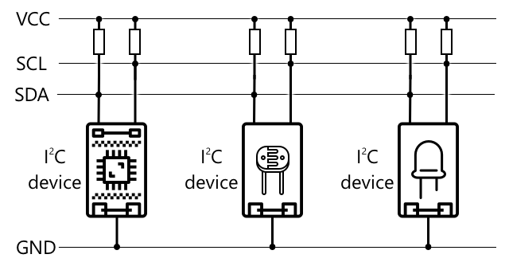

Pour envoyer des données, un dispositif émet une condition de démarrage pour montrer qu'il est prêt à envoyer des données. Il devient alors le contrôleur. Le contrôleur envoie alors l'adresse du dispositif avec lequel il veut communiquer, et indique s'il veut lire ou écrire des données. Une fois que les données ont été transmises, le contrôleur envoie une condition d'arrêt pour indiquer qu'il a terminé. Après cela, un autre dispositif peut devenir le contrôleur et envoyer ou recevoir des données.

I2C a des limites de vitesse, avec 3 modes différents fonctionnant à des vitesses fixes. Le plus rapide est le mode High Speed avec une vitesse maximale de 3,4Mbps (mégabits par seconde), bien que très peu d'appareils supportent cette vitesse. Le Raspberry Pi, par exemple, est limité au mode rapide à 400Kbps (kilobits par seconde). Le mode standard fonctionne à 100Kbps.

> 💁 Si vous utilisez un Raspberry Pi avec un chapeau Grove Base comme matériel IoT, vous pourrez voir un certain nombre de prises I2C sur la carte que vous pouvez utiliser pour communiquer avec des capteurs I2C. Les capteurs Analog Grove utilisent également l'I2C avec un ADC pour envoyer des valeurs analogiques sous forme de données numériques, de sorte que le capteur de lumière que vous avez utilisé a simulé une broche analogique, avec la valeur envoyée sur I2C car le Raspberry Pi ne prend en charge que les broches numériques.

### Récepteur-émetteur asynchrone universel (UART)

UART est un circuit physique qui permet à deux appareils de communiquer. Chaque périphérique dispose de 2 broches de communication - transmission (Tx) et réception (Rx), la broche Tx du premier périphérique étant connectée à la broche Rx du second, et la broche Tx du second périphérique étant connectée à la broche Rx du premier. Cela permet d'envoyer des données dans les deux sens.

* Le dispositif 1 transmet des données depuis sa broche Tx, qui sont reçues par le dispositif 2 sur sa broche Rx.
* Le dispositif 1 reçoit des données sur sa broche Rx qui sont transmises par le dispositif 2 depuis sa broche Tx.

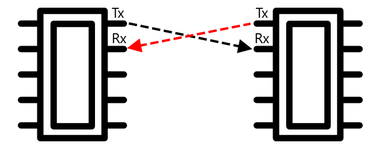

> 🎓 Les données sont envoyées un bit à la fois, c'est ce qu'on appelle la communication *série*. La plupart des systèmes d'exploitation et des microcontrôleurs ont des *ports série*, c'est-à-dire des connexions permettant d'envoyer et de recevoir des données série qui sont à la disposition de votre code.

Les dispositifs UART ont un [débit en bauds](https://wikipedia.org/wiki/Symbol_rate) (également connu sous le nom de taux de symbole), qui est la vitesse à laquelle les données sont envoyées et reçues en bits par seconde. Une vitesse de transmission courante est de 9 600 bauds, ce qui signifie que 9 600 bits (0 et 1) de données sont envoyés chaque seconde.

UART utilise des bits de départ et d'arrêt, c'est-à-dire qu'il envoie un bit de départ pour indiquer qu'il est sur le point d'envoyer un octet (8 bits) de données, puis un bit d'arrêt après avoir envoyé les 8 bits.

La vitesse de l'UART dépend du matériel, mais même les implémentations les plus rapides ne dépassent pas 6,5 Mbps (mégabits par seconde, ou millions de bits, 0 ou 1, envoyés par seconde).

Vous pouvez utiliser UART sur les broches GPIO - vous pouvez définir une broche comme Tx et une autre comme Rx, puis les connecter à un autre appareil.

> 💁 Si vous utilisez un Raspberry Pi avec un "hat" de base Grove comme matériel IoT, vous pourrez voir une prise UART sur la carte que vous pouvez utiliser pour communiquer avec des capteurs qui utilisent le protocole UART.

### Serial Peripheral Interface (SPI)

SPI est conçu pour communiquer sur de courtes distances, comme sur un microcontrôleur pour parler à un périphérique de stockage tel que la mémoire flash. Il est basé sur un modèle contrôleur/périphérique avec un seul contrôleur (généralement le processeur du dispositif IoT) interagissant avec plusieurs périphériques. Le contrôleur contrôle tout en sélectionnant un périphérique et en envoyant ou en demandant des données.

> 💁 Comme pour l'I2C, les termes contrôleur et périphérique sont des changements récents, vous verrez donc peut-être les anciens termes encore utilisés.

Les contrôleurs SPI utilisent 3 fils, ainsi qu'un fil supplémentaire par périphérique. Les périphériques utilisent 4 fils. Ces fils sont :

| Fil | Nom | Description |
| ---- | --------- | ----------- |
| COPI | Controller Output, Peripheral Input | Ce fil sert à envoyer des données du contrôleur au périphérique. |
| CIPO | Controller Input, peripheral Output | Ce fil sert à envoyer des données du périphérique au contrôleur. |
| SCLK | Serial Clock | Ce fil envoie un signal d'horloge à un rythme défini par le contrôleur. |
| CS   | Chip Select | Le contrôleur comporte plusieurs fils, un par périphérique, et chaque fil se connecte au fil CS du périphérique correspondant. |

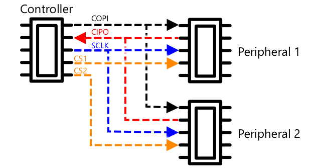

Le fil CS est utilisé pour activer un périphérique à la fois, en communiquant par les fils COPI et CIPO. Lorsque le contrôleur doit changer de périphérique, il désactive le fil CS connecté au périphérique actuellement actif, puis active le fil connecté au périphérique suivant avec lequel il veut communiquer.

SPI est *full-duplex*, ce qui signifie que le contrôleur peut envoyer et recevoir des données en même temps depuis le même périphérique en utilisant les fils COPI et CIPO. SPI utilise un signal d'horloge sur le fil SCLK pour garder les périphériques synchronisés, donc contrairement à l'envoi direct sur UART, il n'a pas besoin de bits de départ et d'arrêt.

Il n'y a pas de limites de vitesse définies pour SPI, les implémentations étant souvent capables de transmettre plusieurs mégaoctets de données par seconde.

Les kits de développement IoT prennent souvent en charge SPI sur certaines des broches GPIO. Par exemple, sur un Raspberry Pi, vous pouvez utiliser les broches GPIO 19, 21, 23, 24 et 26 pour SPI.

### Sans fil

Certains capteurs peuvent communiquer via des protocoles sans fil standard, tels que Bluetooth (principalement Bluetooth Low Energy, ou BLE), LoRaWAN (un protocole de réseau **Lo**ng **Ra**nge à faible consommation) ou WiFi. Ceux-ci permettent d'utiliser des capteurs distants qui ne sont pas physiquement connectés à un dispositif IoT.

Les capteurs commerciaux d'humidité du sol en sont un exemple. Ceux-ci vont mesurer l'humidité du sol dans un champ, puis envoyer les données sur LoRaWan à un dispositif hub, qui va traiter les données ou les envoyer sur Internet. Cela permet au capteur d'être éloigné du dispositif IoT qui gère les données, ce qui réduit la consommation d'énergie et la nécessité de grands réseaux WiFi ou de longs câbles.

BLE est populaire pour les capteurs avancés tels que les trackers de fitness fonctionnent au poignet. Ceux-ci combinent plusieurs capteurs et envoient les données du capteur à un dispositif IoT sous la forme de votre téléphone via BLE.

✅ Avez-vous des capteurs Bluetooth sur vous, dans votre maison ou dans votre école ? Il peut s'agir de capteurs de température, de capteurs d'occupation, de traqueurs d'appareils et d'appareils de fitness.

Zigbee est un moyen populaire de connecter les appareils commerciaux. Zigbee utilise le WiFi pour former des réseaux maillés entre les appareils, où chaque appareil se connecte à autant d'appareils proches que possible, formant un grand nombre de connexions comme une toile d'araignée. Lorsqu'un appareil veut envoyer un message à l'internet, il peut l'envoyer aux appareils les plus proches, qui le transmettent ensuite à d'autres appareils proches et ainsi de suite, jusqu'à ce qu'il atteigne un coordinateur et puisse être envoyé à l'internet.

> 🐝 Le nom Zigbee fait référence à la danse de l'agitation des abeilles à miel après leur retour à la ruche.

## Mesurer les niveaux d'humidité dans le sol

Vous pouvez mesurer le niveau d'humidité du sol à l'aide d'un capteur d'humidité du sol, d'un dispositif IoT et d'une plante d'intérieur ou d'une parcelle de terre à proximité.

### Tâche - mesurer l'humidité du sol

Suivez le guide correspondant pour mesurer l'humidité du sol à l'aide de votre appareil IoT :

* [Arduino - Terminal Wio](wio-terminal-soil-moisture.fr.md)
* [Ordinateur monocarte - Raspberry Pi](pi-soil-moisture.fr.md)
* [Ordinateur monocarte - Virtuel](virtual-device-soil-moisture.fr.md)

## Étalonnage du capteur

Les capteurs reposent sur la mesure de propriétés électriques telles que la résistance ou la capacité.

> 🎓 La résistance, mesurée en ohms (Ω), est la quantité d'opposition au courant électrique qui traverse quelque chose. Lorsqu'une tension est appliquée à un matériau, la quantité de courant qui le traverse dépend de la résistance du matériau. Vous pouvez en savoir plus sur la page [résistance électrique sur Wikipédia](https://wikipedia.org/wiki/Electrical_resistance_and_conductance).

> 🎓 La capacité, mesurée en farads (F), est la capacité d'un composant ou d'un circuit à collecter et à stocker l'énergie électrique. Pour en savoir plus sur la capacité, consultez la [page sur la capacité dans Wikipédia](https://wikipedia.org/wiki/Capacitance).

Ces mesures ne sont pas toujours utiles - imaginez un capteur de température qui vous donne une mesure de 22.5KΩ ! Au lieu de cela, la valeur mesurée doit être convertie en une unité utile en étant étalonnée - c'est-à-dire en faisant correspondre les valeurs mesurées à la quantité mesurée pour permettre aux nouvelles mesures d'être converties dans la bonne unité.

Certains capteurs sont livrés pré-calibrés. Par exemple, le capteur de température que vous avez utilisé dans la dernière leçon a déjà été calibré de façon à pouvoir fournir une mesure de température en °C. En usine, le premier capteur créé est exposé à une gamme de températures connues et la résistance est mesurée. Cette mesure est ensuite utilisée pour élaborer un calcul permettant de convertir la valeur mesurée en Ω (l'unité de résistance) en °C.

> 💁 La formule permettant de calculer la résistance à partir de la température est appelée [équation de Steinhart-Hart](https://wikipedia.org/wiki/Steinhart–Hart_equation).

### Étalonnage du capteur d'humidité du sol

L'humidité du sol est mesurée par la teneur en eau gravimétrique ou volumétrique.

* Gravimétrique : le poids de l'eau dans une unité de poids de sol mesurée, comme le nombre de kilogrammes d'eau par kilogramme de sol sec.
* Volumétrique : le volume d'eau dans une unité de volume de sol mesuré en nombre de mètres cubes d'eau par mètre cube de sol sec.

> 🇺🇸 Pour les Américains, en raison de la cohérence des unités, on peut les mesurer en livres au lieu de kilogrammes ou en pieds cubes au lieu de mètres cubes.

Les capteurs d'humidité du sol mesurent la résistance électrique ou la capacité - celle-ci varie non seulement en fonction de l'humidité du sol, mais aussi du type de sol, car les composants du sol peuvent modifier ses caractéristiques électriques. Idéalement, les capteurs doivent être étalonnés, c'est-à-dire qu'il faut prendre les lectures du capteur et les comparer aux mesures obtenues par une approche plus scientifique. Par exemple, un laboratoire peut calculer l'humidité gravimétrique du sol en utilisant des échantillons d'un champ spécifique prélevés plusieurs fois par an, et ces chiffres sont utilisés pour calibrer le capteur, en faisant correspondre la lecture du capteur à l'humidité gravimétrique du sol.

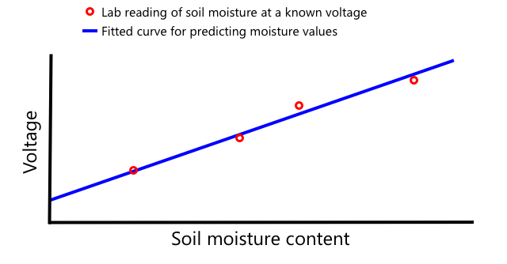

Le graphique ci-dessus montre comment calibrer un capteur. La tension est capturée pour un échantillon de sol qui est ensuite mesuré dans un laboratoire en comparant le poids humide au poids sec (en mesurant le poids humide, puis en le séchant dans un four et en le mesurant sec). Une fois que quelques mesures ont été effectuées, elles peuvent être reportées sur un graphique et une ligne peut être ajustée aux points. Cette ligne peut ensuite être utilisée pour convertir les lectures du capteur d'humidité du sol prises par un dispositif IoT en mesures réelles de l'humidité du sol.

💁 Pour les capteurs d'humidité du sol résistifs, la tension augmente avec l'humidité du sol. Dans le cas des capteurs d'humidité du sol capacitifs, la tension diminue lorsque l'humidité du sol augmente, de sorte que les graphiques de ces capteurs sont orientés vers le bas et non vers le haut.

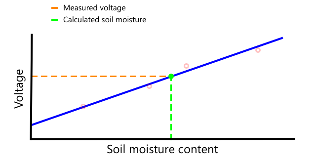

Le graphique ci-dessus montre une lecture de tension d'un capteur d'humidité du sol, et en suivant cette lecture jusqu'à la ligne du graphique, l'humidité réelle du sol peut être calculée.

Cette approche signifie que l'agriculteur n'a besoin que d'obtenir quelques mesures de laboratoire pour un champ, puis il peut utiliser des dispositifs IoT pour mesurer l'humidité du sol - ce qui accélère considérablement le temps de prise de mesures.

---

## 🚀 Défi

Les capteurs d'humidité du sol résistifs et capacitifs présentent un certain nombre de différences. Quelles sont ces différences, et quel type (le cas échéant) est le meilleur pour un agriculteur ? Cette réponse change-t-elle entre les pays en développement et les pays développés ?

## Quiz post-lecture

[Quiz post-lecture](https://black-meadow-040d15503.1.azurestaticapps.net/quiz/12)

## Révision et étude personnelle

Renseignez-vous sur le matériel et les protocoles utilisés par les capteurs et les actionneurs :

* [GPIO - Wikipedia](https://wikipedia.org/wiki/General-purpose_input/output)
* [UART - Wikipedia](https://wikipedia.org/wiki/Universal_asynchronous_receiver-transmitter)
* [SPI - Wikipedia](https://wikipedia.org/wiki/Serial_Peripheral_Interface)
* [I2C - Wikipedia](https://wikipedia.org/wiki/I²C)
* [Zigbee - Wikipedia](https://wikipedia.org/wiki/Zigbee)

## Devoir

[Calibrez votre capteur](assignment.fr.md)