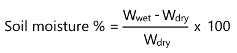
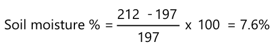

# Calibrez votre capteur

## Instructions

Dans cette leçon, vous avez recueilli les lectures de la sonde d'humidité du sol mesurées sous forme de valeurs comprises entre 0 et 1023. Pour les convertir en valeurs réelles d'humidité du sol, vous devez étalonner votre capteur. Pour ce faire, vous pouvez effectuer des relevés sur des échantillons de sol, puis calculer la teneur en eau gravimétrique du sol à partir de ces échantillons.

Vous devrez répéter ces étapes plusieurs fois pour obtenir les lectures nécessaires, avec une humidité différente du sol à chaque fois.

1. Relevez l'humidité du sol à l'aide du capteur d'humidité du sol. Notez cette mesure.

1. Prenez un échantillon du sol et pesez-le. Notez ce poids.

1. Séchez la terre - un four chaud à 110°C (230°F) pendant quelques heures est le meilleur moyen, vous pouvez le faire à la lumière du soleil, ou le placer dans un endroit chaud et sec jusqu'à ce que la terre soit complètement sèche. Elle doit être poudreuse et meuble.

    > 💁 Dans un laboratoire, pour obtenir les résultats les plus précis, vous devez sécher dans un four pendant 48 à 72 heures. Si vous avez des étuves à votre école, voyez si vous pouvez les utiliser pour sécher plus longtemps. Plus le temps est long, plus l'échantillon est sec et plus les résultats sont précis.

1. Pesez à nouveau la terre.

    > 🔥 Si vous l'avez séché dans un four, assurez-vous qu'il a d'abord refroidi !

L'humidité gravimétrique du sol est calculée comme suit :

* Whumide - le poids de la terre humide
* Wsec - le poids du sol sec

Par exemple, disons que vous avez un échantillon de sol qui pèse 212 g humide et 197 g sec.

* Whumide = 212g
* Wsec = 197g
* 212 - 197 = 15
* 15 / 197 = 0.076
* 0.076 * 100 = 7.6%

Dans cet exemple, le sol a une humidité gravimétrique de 7,6 %.

Une fois que vous avez les lectures d'au moins 3 échantillons, tracez un graphique du pourcentage d'humidité du sol par rapport à la lecture du capteur d'humidité du sol et ajoutez la ligne qui correspond le mieux aux points. Vous pouvez ensuite utiliser ce graphique pour calculer la teneur en eau gravimétrique du sol pour une lecture de capteur donnée en lisant la valeur de la ligne.

## Grille d'évaluation

| Critère | Exemple | Adéquat | Nécessite amélioration |
| -------- | --------- | -------- | ----------------- |
| Recueillir les données d'étalonnage | Capturez au moins 3 échantillons d'étalonnage | Capturez au moins 2 échantillons d'étalonnage | Capturez au moins un échantillon d'étalonnage |
| Effectuer une lecture calibrée | Tracez avec succès le graphique d'étalonnage, effectuez une lecture du capteur et convertissez-la en teneur en eau gravimétrique du sol | Tracer avec succès le graphique d'étalonnage | Impossible de tracer le graphique |
