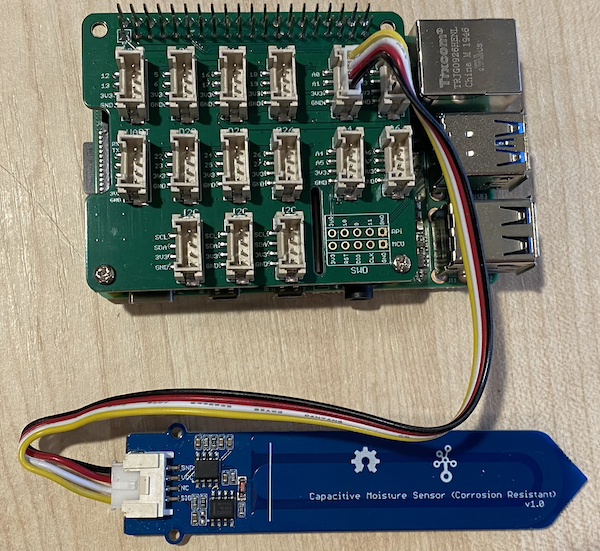

# Mesurer l'humidité du sol - Raspberry Pi

Dans cette partie de la leçon, vous allez ajouter un capteur capacitif d'humidité du sol à votre Raspberry Pi, et lire des valeurs à partir de celui-ci.

## Matériel

Le Raspberry Pi a besoin d'un capteur capacitif d'humidité du sol.

Le capteur que vous utiliserez est un [Capteur d'humidité du sol capacitif](https://www.seeedstudio.com/Grove-Capacitive-Moisture-Sensor-Corrosion-Resistant.html). Ce dernier mesure l'humidité du sol en détectant la capacité du sol, une propriété qui change en fonction de l'humidité du sol. Plus l'humidité du sol augmente, plus la tension diminue.

Il s'agit d'un capteur analogique, qui utilise donc une broche analogique et le ADC 10 bits du "Grove Base Hat" sur le Pi pour convertir la tension en un signal numérique de 1 à 1023. Celui-ci est ensuite envoyé sur I<sup>2</sup>C via les broches GPIO du Pi.

### Connecter le capteur d'humidité du sol

Le capteur d'humidité du sol Grove peut être connecté au Raspberry Pi.

#### Tâche - connecter le capteur d'humidité du sol

Connectez le capteur d'humidité du sol.


1. Insérez une extrémité d'un câble Grove dans la prise du capteur d'humidité du sol. Il ne peut être inséré que dans un seul sens.

1. Lorsque le Raspberry Pi est hors tension, connectez l'autre extrémité du câble Grove à la prise analogique marquée **A0** sur le "Grove Base Hat" fixé au Pi. Cette prise est la deuxième en partant de la droite, sur la rangée de prises à côté des broches GPIO.



1. Insérez le capteur d'humidité du sol dans le sol. Il est doté d'une " ligne de position la plus élevée ", une ligne blanche qui traverse le capteur. Insérez le capteur jusqu'à cette ligne mais sans la dépasser.


## Programmer le capteur d'humidité du sol

Le Raspberry Pi peut maintenant être programmé pour utiliser la sonde d'humidité du sol jointe.

### Tâche - programmer le capteur d'humidité du sol

Programmez l'appareil.

1. Allumez le Pi et attendez qu'il démarre.

1. Lancez VS Code, soit directement sur le Pi, soit en vous connectant via l'extension SSH à distance.

    > ⚠️ Vous pouvez vous référer [aux instructions pour configurer et lancer VS Code dans la veilleuse - leçon 1 si nécessaire](../../../../1-getting-started/lessons/1-introduction-to-iot/pi.fr.md).

1. Depuis le terminal, créez un nouveau dossier dans le répertoire personnel de l'utilisateur `pi` appelé `soil-moisture-sensor`. Créez un fichier dans ce dossier appelé `app.py`.

1. Ouvrez ce dossier dans VS Code

1. Ajoutez le code suivant au fichier `app.py` pour importer certaines bibliothèques requises :

    ```python
    import time
    from grove.adc import ADC
    ```

    L'instruction `import time` importe le module `time` qui sera utilisé plus tard dans ce devoir.

    L'instruction `from grove.adc import ADC` importe le `ADC` des bibliothèques Python de Grove. Cette bibliothèque contient du code pour interagir avec le convertisseur analogique-numérique du chapeau de base Pi et lire les tensions des capteurs analogiques.

1. Ajoutez le code suivant en dessous pour créer une instance de la classe `ADC` :

    ```python
    adc = ADC()
    ```

1. Ajoutez une boucle infinie qui lit depuis cet ADC sur la broche A0, et écrit le résultat sur la console. Cette boucle peut ensuite dormir pendant 10 secondes entre les lectures.

    ```python
    while True:
        soil_moisture = adc.read(0)
        print("Soil moisture:", soil_moisture)

        time.sleep(10)
    ```

1. Exécutez l'application Python. Vous verrez les mesures d'humidité du sol écrites dans la console. Ajoutez de l'eau au sol ou retirez le capteur du sol et observez le changement de valeur.

    ```output
    pi@raspberrypi:~/soil-moisture-sensor $ python3 app.py 
    Soil moisture: 615
    Soil moisture: 612
    Soil moisture: 498
    Soil moisture: 493
    Soil moisture: 490
    Soil Moisture: 388
    ```

    Dans l'exemple de sortie ci-dessus, vous pouvez voir la chute de tension lorsque de l'eau est ajoutée.

> 💁 Vous pouvez trouver ce code dans le dossier [code/pi](../code/pi).

😀 Votre programme de capteurs d'humidité du sol a été un succès !
