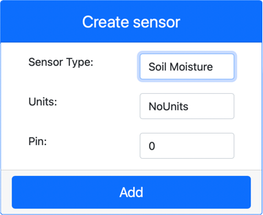
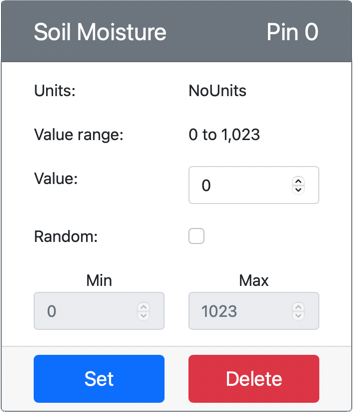

# Measure soil moisture - Virtual IoT Hardware

In this part of the lesson, you will add a capacitive soil moisture sensor to your virtual IoT device, and read values from it.

## Virtual Hardware

The virtual IoT device will use a simulated Grove capacitive soil moisture sensor. This keeps this lab the same as using a Raspberry Pi with a physical Grove capacitive soil moisture sensor.

In a physical IoT device, the soil moisture sensor would be a capacitive sensor that measures soil moisture by detecting the capacitance of the soil, a property than changes as the soil moisture changes. As the soil moisture increases, the voltage decreases.

This is an analog sensor, so uses a simulated 10-bit ADC to report a value from 1-1,023.

### Add the soil moisture sensor to CounterFit

To use a virtual soil moisture sensor, you need to add it to the CounterFit app

#### Task - Add the soil moisture sensor to CounterFit

Add the soil moisture sensor to the CounterFit app.

1. Create a new Python app on your computer in a folder called `soil-moisture-sensor` with a single file called `app.py` and a Python virtual environment, and add the CounterFit pip packages.

    > ⚠️ You can refer to [the instructions for creating and setting up a CounterFit Python project in lesson 1 if needed](../../../1-getting-started/lessons/1-introduction-to-iot/virtual-device.md).

1. Make sure the CounterFit web app is running

1. Create a soil moisture sensor:

    1. In the *Create sensor* box in the *Sensors* pane, drop down the *Sensor type* box and select *Soil Moisture*.

    1. Leave the *Units* set to *NoUnits*

    1. Ensure the *Pin* is set to *0*

    1. Select the **Add** button to create the humidity sensor on Pin 0

    

    The soil moisture sensor will be created and appear in the sensors list.

    

## Program the soil moisture sensor app

The soil moisture sensor app can now be programmed using the CounterFit sensors.

### Task - program the soil moisture sensor app

Program the soil moisture sensor app.

1. Make sure the `soil-moisture-sensor` app is open in VS Code

1. Open the `app.py` file

1. Add the following code to the top of `app.py` to connect the app to CounterFit:

    ```python
    from counterfit_connection import CounterFitConnection
    CounterFitConnection.init('127.0.0.1', 5000)
    ```

1. Add the following code to the `app.py` file to import some required libraries:

    ```python
    import time
    from counterfit_shims_grove.adc import ADC
    ```

    The `import time` statement imports the `time` module that will be used later in this assignment.

    The `from counterfit_shims_grove.adc import ADC` statement imports the `ADC` class to interact with a virtual analog to digital converter that can connect to a CounterFit sensor.

1. Add the following code below this to create an instance of the `ADC` class:

    ```python
    adc = ADC()
    ```

1. Add an infinite loop that reads from this ADC on pin 0 and write the result to the console. This loop can then sleep for 10 seconds between reads.

    ```python
    while True:
        soil_moisture = adc.read(0)
        print("Soil moisture:", soil_moisture)
    
        time.sleep(10)
    ```

1. From the CounterFit app, change the value of the soil moisture sensor that will be read by the app. You can do this in one of two ways:

    * Enter a number in the *Value* box for the soil moisture sensor, then select the **Set** button. The number you enter will be the value returned by the sensor.

    * Check the *Random* checkbox, and enter a *Min* and *Max* value, then select the **Set** button. Every time the sensor reads a value, it will read a random number between *Min* and *Max*.

1. Run the Python app. You will see the soil moisture measurements written to the console. Change the *Value* or the *Random* settings to see the value change.

    ```output
    (.venv) ➜ soil-moisture-sensor $ python app.py 
    Soil moisture: 615
    Soil moisture: 612
    Soil moisture: 498
    Soil moisture: 493
    Soil moisture: 490
    Soil Moisture: 388
    ```

> 💁 You can find this code in the [code/virtual-device](code/virtual-device) folder.

😀 Your soil moisture sensor program was a success!
