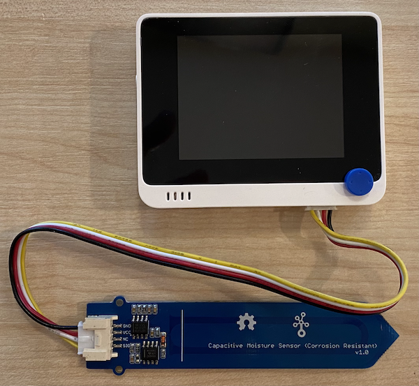

# Measure soil moisture - Wio Terminal

In this part of the lesson, you will add a capacitive soil moisture sensor to your Wio Terminal, and read values from it.

## Hardware

The Wio Terminal needs a capacitive soil moisture sensor.

The sensor you'll use is a [Capacitive Soil Moisture Sensor](https://www.seeedstudio.com/Grove-Capacitive-Moisture-Sensor-Corrosion-Resistant.html), that measures soil moisture by detecting the capacitance of the soil, a property than changes as the soil moisture changes. As the soil moisture increases, the voltage decreases.

This is an analog sensor, so connects to analog pins on the Wio Terminal, using an onboard ADC to create a value from 0-1,023.

### Connect the soil moisture sensor

The Grove soil moisture sensor can be connected to the Wio Terminals configurable analog/digital port.

#### Task - connect the soil moisture sensor

Connect the soil moisture sensor.


1. Insert one end of a Grove cable into the socket on the soil moisture sensor. It will only go in one way round.

1. With the Wio Terminal disconnected from your computer or other power supply, connect the other end of the Grove cable to the right-hand side Grove socket on the Wio Terminal as you look at the screen. This is the socket farthest away from the power button.



1. Insert the soil moisture sensor into soil. It has a 'highest position line' - a white line across the sensor. Insert the sensor up to but not past this line.


1. You can now connect the Wio Terminal to your computer.

## Program the soil moisture sensor

The Wio Terminal can now be programmed to use the attached soil moisture sensor.

### Task - program the soil moisture sensor

Program the device.

1. Create a brand new Wio Terminal project using PlatformIO. Call this project `soil-moisture-sensor`. Add code in the `setup` function to configure the serial port.

    > ⚠️ You can refer to [the instructions for creating a PlatformIO project in project 1, lesson 1 if needed](../../../1-getting-started/lessons/1-introduction-to-iot/wio-terminal.md#create-a-platformio-project).

1. There isn't a library for this sensor, instead you can read from the analog pin using the built in Arduino [`analogRead`](https://www.arduino.cc/reference/en/language/functions/analog-io/analogread/) function. Start by configuring the analog pin for input so values can be read from it by adding the following to the `setup` function.

    ```cpp
    pinMode(A0, INPUT);
    ```

    This sets the `A0` pin, the combined analog/digital pin, as an input pin that voltage can be read from.

1. Add the following to the `loop` function to read the voltage from this pin:

    ```cpp
    int soil_moisture = analogRead(A0);
    ```

1. Below this code, add the following code to print the value to the serial port:

    ```cpp
    Serial.print("Soil Moisture: ");
    Serial.println(soil_moisture);
    ```

1. Finally add a delay at the end of 10 seconds:

    ```cpp
    delay(10000);
    ```

1. Build and upload the code to the Wio Terminal.

    > ⚠️ You can refer to [the instructions for creating a PlatformIO project in project 1, lesson 1 if needed](../../../1-getting-started/lessons/1-introduction-to-iot/wio-terminal.md#write-the-hello-world-app).

1. Once uploaded, you can monitor the soil moisture using the serial monitor. Add some water to the soil, or remove the sensor from the soil, and see the value change.

    ```output
    > Executing task: platformio device monitor <
    
    --- Available filters and text transformations: colorize, debug, default, direct, hexlify, log2file, nocontrol, printable, send_on_enter, time
    --- More details at http://bit.ly/pio-monitor-filters
    --- Miniterm on /dev/cu.usbmodem1201  9600,8,N,1 ---
    --- Quit: Ctrl+C | Menu: Ctrl+T | Help: Ctrl+T followed by Ctrl+H ---
    Soil Moisture: 526
    Soil Moisture: 529
    Soil Moisture: 521
    Soil Moisture: 494
    Soil Moisture: 454
    Soil Moisture: 456
    Soil Moisture: 395
    Soil Moisture: 388
    Soil Moisture: 394
    Soil Moisture: 391
    ```

    In the example output above, you can see the voltage drop as water is added.

> 💁 You can find this code in the [code/wio-terminal](code/wio-terminal) folder.

😀 Your soil moisture sensor program was a success!
