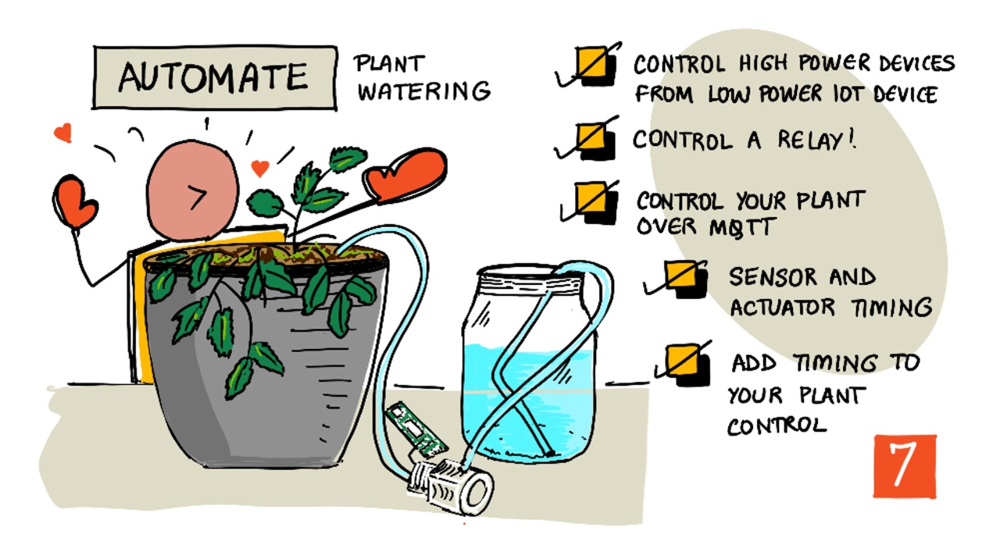
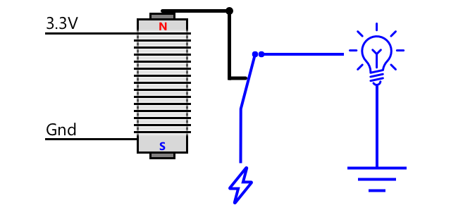
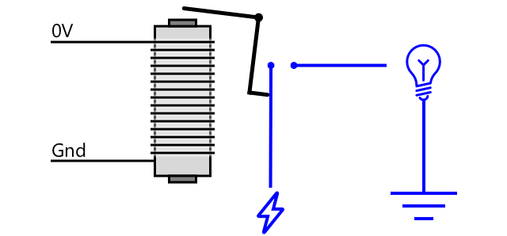
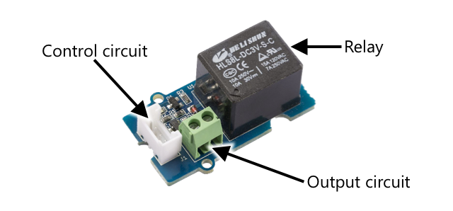
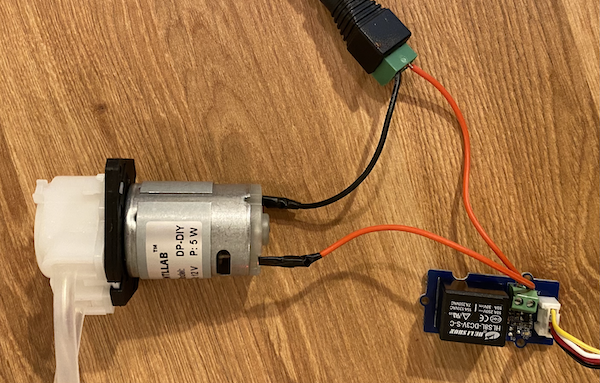
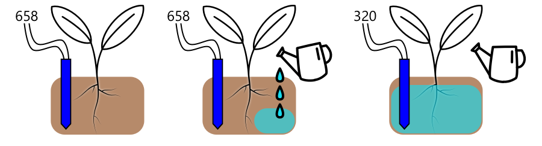
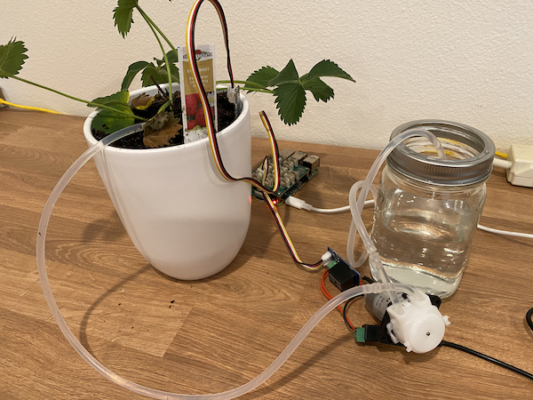
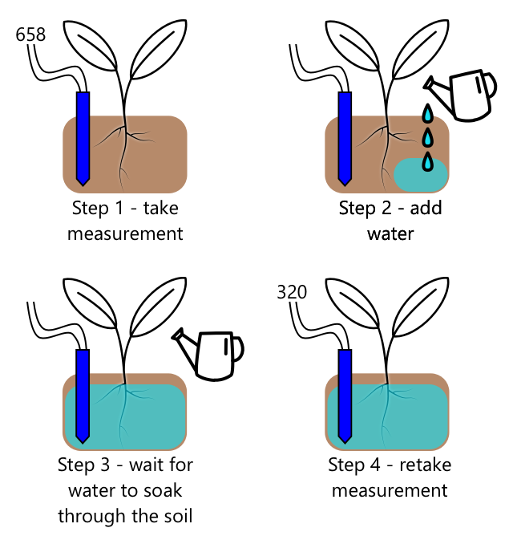

# Automated plant watering



> Sketchnote by [Nitya Narasimhan](https://github.com/nitya). Click the image for a larger version.

This lesson was taught as part of the [IoT for Beginners Project 2 - Digital Agriculture series](https://youtube.com/playlist?list=PLmsFUfdnGr3yCutmcVg6eAUEfsGiFXgcx) from the [Microsoft Reactor](https://developer.microsoft.com/reactor/?WT.mc_id=academic-17441-jabenn).

[](https://youtu.be/g9FfZwv9R58)

## Pre-lecture quiz

[Pre-lecture quiz](https://black-meadow-040d15503.1.azurestaticapps.net/quiz/13)

## Introduction

In the last lesson, you learned how to monitor soil moisture. In this lesson you will learn how to build the core components of an automated watering system that responds to soil moisture. You'll also learn about timing - how sensors can take a while to respond to changes, and how actuators can take time to change the properties being measured by sensors.

In this lesson we'll cover:

* [Control high power devices from a low power IoT device](#control-high-power-devices-from-a-low-power-iot-device)
* [Control a relay](#control-a-relay)
* [Control your plant over MQTT](#control-a-relay)
* [Sensor and actuator timing](#sensor-and-actuator-timing)
* [Add timing to your plant control server](#add-timing-to-your-plant-control-server)

## Control high power devices from a low power IoT device

IoT devices use a low voltage. While this is enough for sensors and low-power actuators like LEDs, this is too low to control larger hardware, such as a water pump used for irrigation. Even small pumps you could use for houseplants draw too much current for an IoT dev kit and would burn out the board.

> 🎓 Current, measured in Amps (A), is the amount of electricity moving through a circuit. Voltage provides the push, current is how much is pushed. You can read more about current on the [electric current page on Wikipedia](https://wikipedia.org/wiki/Electric_current).

The solution to this is to have a pump connected to an external power supply, and use an actuator to switch on the pump, similar to how you would switch on a light. It takes a tiny amount of power (in the form of energy in your body) for your finger to flip a switch, and this connects the light to mains electricity running at 110v/240v.


> 🎓 [Mains electricity](https://wikipedia.org/wiki/Mains_electricity) refers to the electricity delivered to homes and businesses through national infrastructure in many parts of the world.

✅ IoT devices can usually provide 3.3V or 5V, at less than 1 amp (1A) of current. Compare this to mains electricity which is most often at 230V (120V in North America and 100V in Japan), and can provide power for devices that draw 30A.

There are a number of actuators that can do this, including mechanical devices you can attach to existing switches that mimic a finger turning them on. The most popular is a relay.

### Relays

A relay is an electromechanical switch that converts an electrical signal into a mechanical movement that turns on a switch. The core of a relay is an electromagnet.

> 🎓 [Electromagnets](https://wikipedia.org/wiki/Electromagnet) are magnets that are created by passing electricity through a coil of wire. When the electricity is turned on, the coil becomes magnetized. When the electricity is turned off, the coil loses it magnetism.



In a relay, a control circuit powers the electromagnet. When the electromagnet is on, it pulls a lever that moves a switch, closing a pair of contacts and completing an output circuit.



When the control circuit is off, the electromagnet turns off, releasing the lever and opening the contacts, turning off the output circuit. Relays are digital actuators - a high signal to the relay turns it on, a low signal turns it off.

The output circuit can be used to power additional hardware, like an irrigation system. The IoT device can turn the relay on, completing the output circuit that powers the irrigation system, and plants get watered. The IoT device can then turn the relay off, cutting the power to the irrigation system, turning the water off.


In the video above, a relay is turned on. An LED on the relay lights up to indicate it is on (some relay boards have LEDs to indicate if the relay is on or off), and power is sent to the pump, turning it on and pumping water into a plant.

> 💁 Relays can also be used to switch between two output circuits instead of turning one on and off. As the lever moves, it moves a switch from completing one output circuit to completing a different output circuit, usually sharing a common power connection, or common ground connection.

✅ Do some research: There are multiple types of relays, with differences such as if the control circuit turns the relay on or off when power is applied, or multiple output circuits. Find out about these different types.

When the lever moves, you can usually hear it make contact with the electromagnet with a well defined click noise.

> 💁 A relay can be wired so that making the connection actually breaks power to the relay, turning the relay off, which then sends power to the relay turning it back on again, and so on. This means the relay will click incredibly fast making a buzzing noise. This is how some of the first buzzers used in electric doorbells worked.

### Relay power

The electromagnet doesn't need a lot of power to activate and pull the lever, it can be controlled using the 3.3V or 5V output from an IoT dev kit. The output circuit can carry a lot more power, depending on the relay, including mains voltage or even higher power levels for industrial use. This way an IoT Dev kit can control an irrigation system, from a small pump for a single plant, up to a massive industrial system for an entire commercial farm.



The image above shows a Grove relay. The control circuit connects to an IoT device and turns the relay on or off using 3.3V or 5V. The output circuit has two terminals, either one can be power or ground. The output circuit can handle up to 250V at 10A, enough for a range of mains-powered devices. You can get relays that can handle even high power levels.



In the image above, power is supplied to a pump via a relay. There is a red wire connecting the +5V terminal of a USB power supply to one terminal of the output circuit of the relay, and another red wire connecting the other terminal of the output circuit to the pump. A black wire connects the pump to the ground on the USB power supply. When the relay turns on, it completes the circuit, sending 5V to the pump, turning the pump on.

## Control a relay

You can control a relay from your IoT Dev kit.

### Task - control a relay

Work through the relevant guide to control a relay using your IoT device:

* [Arduino - Wio Terminal](wio-terminal-relay.md)
* [Single-board computer - Raspberry Pi](pi-relay.md)
* [Single-board computer - Virtual device](virtual-device-relay.md)

## Control your plant over MQTT

So far your relay is controlled by the IoT device directly based off a single soil moisture reading. In a commercial irrigation system, the control logic will be centralized, allowing it to make decisions on watering using data from multiple sensors, and allowing any configuration to be changed in one single place. To simulate this, you can control the relay over MQTT.

### Task - control the relay over MQTT

1. Add the relevant MQTT libraries/pip packages and code to your `soil-moisture-sensor` project to connect to MQTT. Name the client ID as `soilmoisturesensor_client` prefixed by your ID.

    > ⚠️ You can refer to [the instructions for connecting to MQTT in project 1, lesson 4 if needed](../../../1-getting-started/lessons/4-connect-internet/README.md#connect-your-iot-device-to-mqtt).

1. Add the relevant device code to send telemetry with the soil moisture settings. For the telemetry message, name the property `soil_moisture`.

    > ⚠️ You can refer to [the instructions for sending telemetry to MQTT in project 1, lesson 4 if needed](../../../1-getting-started/lessons/4-connect-internet/README.md#send-telemetry-from-your-iot-device).

1. Create some local server code to subscribe to telemetry and send a command to control the relay in a folder called `soil-moisture-sensor-server`. Name the property in the command message `relay_on`, and set the client ID as `soilmoisturesensor_server` prefixed by your ID. Keep the same structure as the server code you wrote for project 1, lesson 4 as you will be adding to this code later in this lesson.

    > ⚠️ You can refer to [the instructions for sending telemetry to MQTT](../../../1-getting-started/lessons/4-connect-internet/README.md#write-the-server-code) and [sending commands over MQTT](../../../1-getting-started/lessons/4-connect-internet/README.md#send-commands-to-the-mqtt-broker) in project 1, lesson 4 if needed.

1. Add the relevant device code to control the relay from received commands, using the `relay_on` property from the message. Send true for `relay_on` if the `soil_moisture` is greater than 450, otherwise send false, the same as the logic you added for the IoT device earlier.

    > ⚠️ You can refer to [the instructions for responding to commands from MQTT in project 1, lesson 4 if needed](../../../1-getting-started/lessons/4-connect-internet/README.md#handle-commands-on-the-iot-device).

> 💁 You can find this code in the [code-mqtt](./code-mqtt) folder.

Make sure the code is running on your device and local server, and test it out by changing soil moisture levels, either by changing the values sent by the virtual sensor, or by changing the moisture levels of the soil by adding water or removing the sensor from the soil.

## Sensor and actuator timing

Back in lesson 3 you built a nightlight - an LED that turns on as soon as a low level of light was detected by a light sensor. The light sensor detected a change in light levels instantly, and the device was able to respond quickly, only limited by the length of the delay in the `loop` function or `while True:` loop. As an IoT developer, you can't always rely on such a fast feedback loop.

### Timing for soil moisture

If you did the last lesson on soil moisture using a physical sensor, you would have noticed that it took a few seconds for the soil moisture reading to drop after you watered your plant. This is not because the sensor is slow, but because it takes time for water to soak through the soil.

> 💁 If you watered too close to the sensor you may have seen the reading drop quickly, then come back up - this is caused by water near the sensor spreading throughout the rest of the soil, reducing the soil moisture by the sensor.



In the diagram above, a soil moisture reading shows 658. The plant is watered, but this reading doesn't change immediately, as the water has yet to reach the sensor. Watering can even finish before the water reaches the sensor and the value drops to reflect the new moisture level.

If you were writing code to control an irrigation system via a relay based off soil moisture levels, you would need to take this delay into consideration and build smarter timing into your IoT device.

✅ Take a moment to think about how you might do this.

### Control sensor and actuator timing

Imagine you have been tasked with building an irrigation system for a farm. Based on the soil type, the ideal soil moisture level for the plants grown has been found to match an analog voltage reading of 400-450.

You could program the device in the same way as the nightlight - all the time the sensor reads above 450, turn on a relay to turn on a pump. The problem is that water takes a while to get from the pump, through the soil to the sensor. The sensor will stop the water when it detects a level of 450, but the water level will continue dropping as the pumped water keeps soaking through the soil. The end result is wasted water, and the risk of root damage.

✅ Remember - too much water can be as bad for plants as too little, and wastes a precious resource.

The better solution is to understand that there is a delay between the actuator turning on and the property that the sensor reads changing. This means not only should the sensor wait for a while before measuring the value again, but the actuator needs to turn off for a while before the next sensor measurement is taken.

How long should the relay be on each time? It's better to err on the side of caution and only turn the relay on for a short time, then wait for the water to soak through, then re-check the moisture levels. After all, you can always turn it on again to add more water, you can't remove water from the soil.

> 💁 This kind of timing control is very specific to the IoT device you are building, the property you are measuring and the sensors and actuators used.



For example, I have a strawberry plant with a soil moisture sensor and a pump controlled by a relay. I've observed that when I add water it takes about 20 seconds for the soil moisture reading to stabilize. This means I need to turn the relay off and wait 20 seconds before checking the moisture levels. I'd rather have too little water than too much - I can always turn the pump on again, but I can't take water out of the plant.



This means the best process would be a watering cycle that is something like:

* Turn on the pump for 5 seconds
* Wait 20 seconds
* Check the soil moisture
* If the level is still above what I need, repeat the above steps

5 seconds could be too long for the pump, especially if the moisture levels are only slightly above the required level. The best way to know what timing to use is to try it, then adjust when you have sensor data, with a constant feedback loop. This can even lead to more granular timing, such as turning the pump on for 1s for every 100 above the required soil moisture, instead of a fixed 5 seconds.

✅ Do some research: Are there other timing considerations? Can the plant be watered any time that the soil moisture is too low, or are there specific times of day that are good and bad times to water plants?

> 💁 Weather predictions can also be taken into consideration when controlling automated watering systems for outdoor growing. If rain is expected, then the watering can be put on hold till after the rain finishes. At that point the soil may be moist enough that it doesn't need watering, much more efficient that wasting water by watering just before rain.

## Add timing to your plant control server

The server code can be modified to add control around the timing of the watering cycle, and waiting for the soil moisture levels to change. The server logic for controlling the relay timing is:

1. Telemetry message received
1. Check the soil moisture level
1. If it's ok, do nothing. If the reading is too high (meaning the soil moisture is too low) then:
    1. Send a command to turn the relay on
    1. Wait for 5 seconds
    1. Send a command to turn the relay off
    1. Wait for 20 seconds for the soil moisture levels to stabilize

The watering cycle, the process from receiving the telemetry message to being ready to process soil moisture levels again, takes about 25 seconds. We're sending soil moisture levels every 10 seconds, so there is an overlap where a message is received whilst the server is waiting for soil moisture levels to stabilize, which could start another watering cycle.

There are two options to work around this:

* Change the IoT device code to only send telemetry every minute, this way the watering cycle will be completed before the next message is sent
* Unsubscribe from the telemetry during the watering cycle

The first option is not always a good solution for large farms. The farmer might want to capture the soil moisture levels as the soil is being watered for later analysis, for example to be aware of water flow in different areas on the farm to guide more targeted watering. The second option is better - the code is just ignoring telemetry when it can't use it, but the telemetry is still there for other services that might subscribe to it.

> 💁 IoT data is not sent from only one device to only one service, instead many devices can send data to a broker, and many services can listen to the data off the broker. For example, one service could listen to soil moisture data and store it in a database for analysis at a later date. Another service can also listen to the same telemetry to control an irrigation system.

### Task - add timing to your plant control server

Update your server code to run the relay for 5 seconds, then wait 20 seconds.

1. Open the `soil-moisture-sensor-server` folder in VS Code if it isn't already open. Make sure the virtual environment is activated.

1. Open the `app.py` file

1. Add the following code to the `app.py` file below the existing imports:

    ```python
    import threading
    ```

    This statement imports `threading` from Python libraries, threading allows python to execute other code while waiting.

1. Add the following code before the `handle_telemetry` function that handles telemetry messages received by the server code:

    ```python
    water_time = 5
    wait_time = 20
    ```

    This defines how long to run the relay for (`water_time`), and how long to wait afterwards to check the soil moisture (`wait_time`).

1. Below this code, add the following:

    ```python
    def send_relay_command(client, state):
        command = { 'relay_on' : state }
        print("Sending message:", command)
        client.publish(server_command_topic, json.dumps(command))
    ```

    This code defines a function called `send_relay_command` that sends a command over MQTT to control the relay. The telemetry is created as a dictionary, then converted to a JSON string. The value passed in to `state` determines if the relay should be on or off.

1. After the `send_relay_code` function, add the following code:

    ```python
    def control_relay(client):
        print("Unsubscribing from telemetry")
        mqtt_client.unsubscribe(client_telemetry_topic)
    
        send_relay_command(client, True)
        time.sleep(water_time)
        send_relay_command(client, False)
    
        time.sleep(wait_time)
    
        print("Subscribing to telemetry")
        mqtt_client.subscribe(client_telemetry_topic)
    ```

    This defines a function to control the relay based off the required timing. It starts by unsubscribing from telemetry so that soil moisture messages are not processed whilst the watering is happening. Next it sends a command to turn the relay on. It then waits for the `water_time` before sending a command to turn the relay off. Finally it waits for the soil moisture levels to stabilize for `wait_time` seconds. It then re-subscribes to telemetry.

1. Change the `handle_telemetry` function to the following:

    ```python
    def handle_telemetry(client, userdata, message):
        payload = json.loads(message.payload.decode())
        print("Message received:", payload)
    
        if payload['soil_moisture'] > 450:
            threading.Thread(target=control_relay, args=(client,)).start()
    ```

    This code checks the soil moisture level. If it is greater than 450, the soil needs watering, so it calls the `control_relay` function. This function is run on a separate thread, running in the background.

1. Make sure your IoT device is running, then run this code. Change the soil moisture levels and observe what happens to the relay - it should turn on for 5 seconds then remain off for at least 20 seconds, only turning on if the soil moisture levels are not sufficient.

    ```output
    (.venv) ➜  soil-moisture-sensor-server ✗ python app.py
    Message received: {'soil_moisture': 457}
    Unsubscribing from telemetry
    Sending message: {'relay_on': True}
    Sending message: {'relay_on': False}
    Subscribing to telemetry
    Message received: {'soil_moisture': 302}
    ```

    A good way to test this in a simulated irrigation system is to use dry soil, then pour water in manually whilst the relay is on, stopping pouring when the relay turns off.

> 💁 You can find this code in the [code-timing](./code-timing) folder.

> 💁 If you want to use a pump to build a real irrigation system, then you can use a [6V water pump](https://www.seeedstudio.com/6V-Mini-Water-Pump-p-1945.html) with a [USB terminal power supply](https://www.adafruit.com/product/3628). Make sure the power to or from the pump is connected via the relay.

---

## 🚀 Challenge

Can you think of any other IoT or other electrical devices that have a similar problem where it takes a while for the results of the actuator to reach the sensor. You probably have a couple in your house or school.

* What properties do they measure?
* How long does it take for the property to change after an actuator is used?
* Is it ok for the property to change past the required value?
* How can it be returned back to the required value if needed?

## Post-lecture quiz

[Post-lecture quiz](https://black-meadow-040d15503.1.azurestaticapps.net/quiz/14)

## Review & Self Study

* Read more on relays including their historical use in telephone exchanges on the [relay Wikipedia page](https://wikipedia.org/wiki/Relay).

## Assignment

[Build a more efficient watering cycle](assignment.md)
