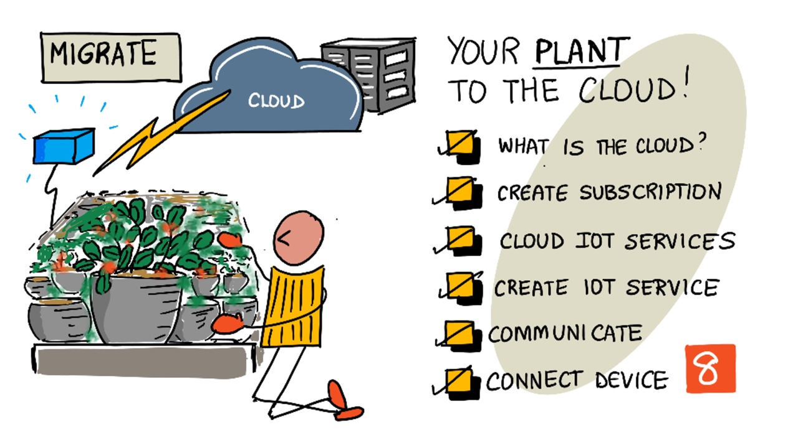
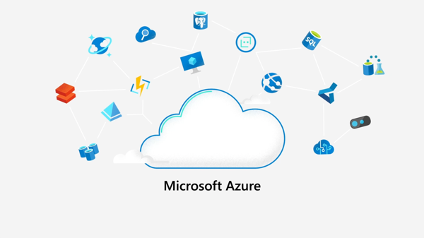
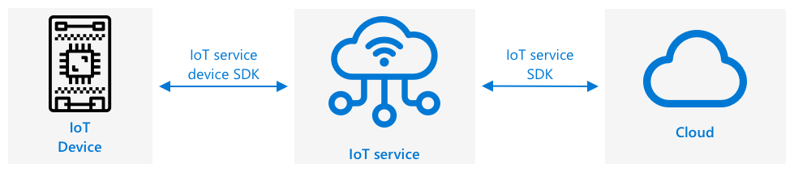
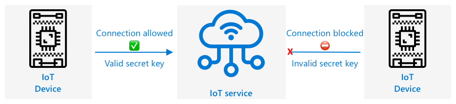
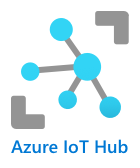

# Migrate your plant to the cloud



> Sketchnote by [Nitya Narasimhan](https://github.com/nitya). Click the image for a larger version.

## Pre-lecture quiz

[Pre-lecture quiz](https://black-meadow-040d15503.1.azurestaticapps.net/quiz/15)

## Introduction

In the last lesson, you learned how to connect your plant to an MQTT broker and controlled a relay from some server code running locally. This forms the core of the kind of internet-connected automated watering system that is used from individual plants at home up to commercial farms.

The IoT device communicated with a public MQTT broker as a way to demonstrate the principles, but this is not the most reliable or secure way. In this lesson you will learn about the cloud, and the IoT capabilities provided by public cloud services. You will also learn how to migrate your plant to one of these cloud services from the public MQTT broker.

In this lesson we'll cover:

* [What is the cloud?](#what-is-the-cloud)
* [Create a cloud subscription](#create-a-cloud-subscription)
* [Cloud IoT services](#cloud-iot-services)
* [Create an IoT service in the cloud](#create-an-iot-service-in-the-cloud)
* [Communicate with IoT Hub](#communicate-with-iot-hub)
* [Connect your device to the IoT service](#connect-your-device-to-the-iot-service)

## What is the cloud?

Before the cloud, when a company wanted to provide services to their employees (such as databases or file storage), or to the public (such as websites), they would build and run a data center. This ranged from a room with a small number of computers, to a building with many computers. The company would manage everything, including:

* Buying computers
* Hardware maintenance
* Power and cooling
* Networking
* Security, including securing the building and securing the software on the computers
* Software installation and updates

This could be very expensive, require a wide range of skilled employees, and be very slow to change when needed. For example, if an online store needed to plan for a busy holiday season, they would need to plan months in advance to buy more hardware, configure it, install it and install the software to run their sales process. After the holiday season was over and sales dropped back down, they would be left with computers they've paid for sitting idle till the next busy season.

✅ Do you think this would allow companies to move quickly? If an online clothing retailer suddenly got popular due to a celebrity being seen in their clothes, would they be able to increase their computing power quickly enough to support the sudden influx of orders?

### Someone else's computer

The cloud is often jokingly referred to as 'someone else's computer'. The initial idea was simple - instead of buying computers, you rent someone else's computer. Someone else, a cloud computing provider, would manage huge data centers. They would be responsible for buying and installing the hardware, managing power and cooling, networking, building security, hardware and software updates, everything. As a customer, you would rent the computers you need, renting more as demand spikes, then reducing the number you rent if demand drops. These cloud data centers are all around the world.


These data centers can be multiple square kilometers in size. The images above were taken a few years ago at a Microsoft cloud data center, and show the initial size, along with a planned expansion. The area cleared for the expansion is over 5 square kilometers.

> 💁 These data centers require such large amounts of power that some have their own power stations. Because of their size and the level of investment from the cloud providers, they are usually very environmentally friendly. They are more efficient than huge numbers of small data centers, they run mostly on renewable energy, and cloud providers work hard to reduce waste, cut water usage, and replant forests to make up for those cut down to provide space to build data centers. You can read more about how one cloud provider is working on sustainability on the [Azure sustainability site](https://azure.microsoft.com/global-infrastructure/sustainability/?WT.mc_id=academic-17441-jabenn).

✅ Do some research: Read up on the major clouds such as [Azure from Microsoft](https://azure.microsoft.com/?WT.mc_id=academic-17441-jabenn) or [GCP from Google](https://cloud.google.com). How many data centers do they have, and where are they in the world?

Using the cloud keeps costs down for companies, and allows them to focus on what they do best, leaving the cloud computing expertise in the hands of the provider. Companies no longer need to rent or buy data center space, pay different providers for connectivity and power, or employ experts. Instead, they can pay one monthly bill to the cloud provider to have everything taken care off.

The cloud provider can then use economies of scale to drive costs down, buying computers in bulk at lower costs, investing in tooling to reduce their workload for maintenance, even designing and building their own hardware to improve their cloud offering.

### Microsoft Azure

Azure is the developer cloud from Microsoft, and this is the cloud you will be using for these lessons. The video below gives a short overview of Azure:

[](https://www.microsoft.com/videoplayer/embed/RE4Ibng?WT.mc_id=academic-17441-jabenn)

## Create a cloud subscription

To use services in the cloud, you will need to sign up for a subscription with a cloud provider. For this lesson, you will be signing up for a Microsoft Azure subscription. If you already have an Azure subscription you can skip this task. The subscription details described here are correct at the time of writing, but may change.

> 💁 If you are accessing these lessons through your school, you may already have an Azure subscription available to you. Check with your teacher.

There are two different types of free Azure subscription you can sign up for:

* **Azure for Students** - This is a subscription designed for students 18+. You don't need a credit card to sign up, and you use your school email address to validate that you are a student. When you sign up you get US$100 to spend on cloud resources, along with free services including a free version of an IoT service. This lasts 12 months, and you can renew every year that you remain a student.

* **Azure free subscription** - This is a subscription for anyone who is not a student. You will need a credit card to sign up to for the subscription, but your card will not be billed, this is just used to verify you are a real human, not a bot. You get $200 of credit to use in the first 30 days on any service, along with free tiers of Azure services. Once your credit has been used up, your card will not be charged unless you convert to a pay as you go subscription.

> 💁 Microsoft does offer an Azure for Students Starter subscription for students under 18, but at the time of writing this doesn't support any IoT services.

### Task - sign up for a free cloud subscription

If you are a student aged 18+, then you can sign up for an Azure for Students subscription. You will need to validate with a school email address. You can do this in one of two ways:

* Sign up for a GitHub student developer pack at [education.github.com/pack](https://education.github.com/pack). This gives you access to a range of tools and offers, including GitHub and Microsoft Azure. Once you sign up for the developer pack, you can then activate the Azure for Students offer.

* Sign up directly for an Azure for Students account at [azure.microsoft.com/free/students](https://azure.microsoft.com/free/students/?WT.mc_id=academic-17441-jabenn).

> ⚠️ If your school email address is not recognized, raise an [issue in this repo](https://github.com/Microsoft/IoT-For-Beginners/issues) and we'll see if it can be added to the Azure for Students allow list.

If you are not a student, or you don't have a valid school email address, then you can sign up for an Azure Free subscription.

* Sign up for an Azure Free Subscription at [azure.microsoft.com/free](https://azure.microsoft.com/free/?WT.mc_id=academic-17441-jabenn)

## Cloud IoT services

The public test MQTT broker you have been using is a great tool when learning, but has a number of drawbacks as a tool to use in a commercial setting:

* Reliability - it's a free service with no guarantees, and can be turned off at any time
* Security - it is public, so anyone could listen to your telemetry or send commands to control your hardware
* Performance - it is designed for only a few test messages, so wouldn't cope with a large amount of messages being sent
* Discovery - there is no way to know what devices are connected

IoT services in the cloud solve these problems. They are maintained by large cloud providers who invest heavily in reliability and are on hand to fix any issues that might arise. They have security baked in to stop hackers reading your data or sending rogue commands. They are also high performance, being able to handle many millions of messages every day, taking advantage of the cloud to scale as needed.

> 💁 Although you pay for these upsides with a monthly fee, most cloud providers offer a free version of their IoT service with a limited amount of messages per day or devices that can connect. This free version is usually more than enough for a developer to learn about the service. In this lesson you will be using a free version.

IoT devices connect to a cloud service either using a device SDK (a library that provides code to work with the features of the service), or directly via a communication protocol such as MQTT or HTTP. The device SDK is usually the easiest route to take as it handles everything for you, such as knowing what topics to publish or subscribe to, and how to handle security.



Your device then communicates with other parts of your application over this service - similar to how you sent telemetry and received commands over MQTT. This is usually using a service SDK or a similar library. Messages come from your device to the service where other components of your application can then read them, and messages can then be sent back to your device.



These services implement security by knowing about all the devices that can connect and send data, either by having the devices pre-registered with the service, or by giving the devices secret keys or certificates they can use to register themselves with the service the first time they connect. Unknown devices are unable to connect, if they try the service rejects the connection and ignores messages sent by them.

✅ Do some research: What is the downside of having an open IoT service where any device or code can connect? Can you find specific examples of hackers taking advantage of this?

Other components of your application can connect to the IoT service and learn about all the devices that are connected or registered, and communicate with them directly in bulk or individually.

> 💁 IoT services also implement additional capabilities, and the cloud providers have additional services and applications that can be connected to the service. For example, if you want to store all the telemetry messages sent by all the devices in a database, it's usually only a few clicks in the cloud provider's configuration tool to connect the service to a database and stream the data in.

## Create an IoT service in the cloud

Now that you have an Azure subscription, you can sign up for an IoT service. The IoT service from Microsoft is called Azure IoT Hub.



The video below gives a short overview of Azure IoT Hub:

[](https://www.youtube.com/watch?v=smuZaZZXKsU)

> 🎥 Click the image above to watch a video

✅ Take a moment to do some research and read the overview of IoT hub in the [Microsoft IoT Hub documentation](https://docs.microsoft.com/azure/iot-hub/about-iot-hub?WT.mc_id=academic-17441-jabenn).

The cloud services available in Azure can be configured through a web-based portal, or via a command-line interface (CLI). For this task, you will use the CLI.

### Task - install the Azure CLI

To use the Azure CLI, first it must be installed on your PC or Mac.

1. Follow the instructions in the [Azure CLI documentation](https://docs.microsoft.com/cli/azure/install-azure-cli?WT.mc_id=academic-17441-jabenn) to install the CLI.

1. The Azure CLI supports a number of extensions that add capabilities to manage a wide range of Azure services. Install the IoT extension by running the following command from your command line or terminal:

    ```sh
    az extension add --name azure-iot
    ```

1. From your command line or terminal, run the following command to log in to your Azure subscription from the Azure CLI.

    ```sh
    az login
    ```

    A web page will be launched in your default browser. Log in using the account you used to sign up for your Azure subscription. Once you are logged in, you can close the browser tab.

1. If you have multiple Azure subscriptions, such as a school provided one, and your own Azure for Students subscription, you will need to select the one you want to use. Run the following command to list all the subscriptions you have access to:

    ```sh
    az account list --output table
    ```

    In the output, you will see the name of each subscription along with its `SubscriptionId`.

    ```output
    ➜  ~ az account list --output table
    Name                    CloudName    SubscriptionId                        State    IsDefault
    ----------------------  -----------  ------------------------------------  -------  -----------
    School-subscription     AzureCloud   cb30cde9-814a-42f0-a111-754cb788e4e1  Enabled  True
    Azure for Students      AzureCloud   fa51c31b-162c-4599-add6-781def2e1fbf  Enabled  False
    ```

    To select the subscription you want to use, use the following command:

    ```sh
    az account set --subscription <SubscriptionId>
    ```

    Replace `<SubscriptionId>` with the Id of the subscription you want to use. After running this command, re-run the command to list your accounts. You will see the `IsDefault` column will be marked as `True` for the subscription you have just set.

### Task - create a resource group

Azure services, such as IoT Hub instances, virtual machines, databases, or AI services, are referred to as **resources**. Every resource has to live inside a **Resource Group**, a logical grouping of one or more resources.

> 💁 Using resource groups means you can manage multiple services at once. For example, once you have finished all the lessons for this project you can delete the resource group, and all the resources in it will be deleted automatically.

1. There are multiple Azure data centers around the world, divided up into regions. When you create an Azure resource or resource group, you have to specify where you want it created. Run the following command to get the list of locations:

    ```sh
    az account list-locations --output table
    ```

    You will see a list of locations. This list will be long.

    > 💁 At the time of writing, there are 65 locations you can deploy to.

    ```output
        ➜  ~ az account list-locations --output table
    DisplayName               Name                 RegionalDisplayName
    ------------------------  -------------------  -------------------------------------
    East US                   eastus               (US) East US
    East US 2                 eastus2              (US) East US 2
    South Central US          southcentralus       (US) South Central US
    ...
    ```

    Note down the value from the `Name` column of the region closest to you. You can find the regions on a map on the [Azure geographies page](https://azure.microsoft.com/global-infrastructure/geographies/?WT.mc_id=academic-17441-jabenn).

1. Run the following command to create a resource group called `soil-moisture-sensor`. Resource group names have to be unique in your subscription.

    ```sh
    az group create --name soil-moisture-sensor \
                    --location <location>
    ```

    Replace `<location>` with the location you selected in the previous step.

### Task - create an IoT Hub

You can now create an IoT Hub resource in your resource group.

1. Use the following command to create your IoT hub resource:

    ```sh
    az iot hub create --resource-group soil-moisture-sensor \
                      --sku F1 \
                      --partition-count 2 \
                      --name <hub_name>
    ```

    Replace `<hub_name>` with a name for your hub. This name needs to be globally unique - that is no other IoT Hub created by anyone can have the same name. This name is used in a URL that points to the hub, so needs to be unique. Use something like `soil-moisture-sensor-` and add a unique identifier on the end, like some random words or your name.

    The `--sku F1` option tells it to use a free tier. The free tier supports 8,000 messages a day along with most of the features of the full-price tiers.

    > 🎓 Different pricing levels of Azure services are referred to as tiers. Each tier has a different cost and provides different features or data volumes.

    > 💁 If you want to learn more about pricing, you can check out the [Azure IoT Hub pricing guide](https://azure.microsoft.com/pricing/details/iot-hub/?WT.mc_id=academic-17441-jabenn).

    The `--partition-count 2` option defines how many streams of data the IoT Hub supports, more partitions reduce data blocking when multiple things read and write from the IoT Hub. Partitions are outside the scope of these lessons, but this value needs to be set to create a free tier IoT Hub.

    > 💁 You can only have one free tier IoT Hub per subscription.

The IoT Hub will be created. It make take a minute or so for this to complete.

## Communicate with IoT Hub

In the previous lesson, you used MQTT and sent messages back and forward on different topics, with the different topics having different purposes. Rather than send messages over different topics, IoT Hub has a number of defined ways for the device to communicate with the Hub, or for the Hub to communicate with the device.

> 💁 Under the hood this communication between IoT Hub and your device can use MQTT, HTTPS or AMQP.

* Device to cloud (D2C) messages - these are messages sent from a device to IoT Hub, such as telemetry. They can then be read off the IoT Hub by your application code.

    > 🎓 Under the hood, IoT Hub uses an Azure service called [Event Hubs](https://docs.microsoft.com/azure/event-hubs/?WT.mc_id=academic-17441-jabenn). When you write code to read messages sent to the hub, these are often called events.

* Cloud to device (C2D) messages - these are messages sent from application code, via an IoT Hub to an IoT device

* Direct method requests - these are messages sent from application code via an IoT Hub to an IoT device to request that the device does something, such as control an actuator. These messages require a response so your application code can tell if it was successfully processed.

* Device twins - these are JSON documents kept synchronized between the device and IoT Hub, and are used to store settings or other properties either reported by the device, or should be set on the device (known as desired) by the IoT Hub.

IoT Hub can store messages and direct method requests for a configurable period of time (defaulting to one day), so if a device or application code loses connection, it can still retrieve messages sent whilst it was offline after it reconnects. Device twins are kept permanently in the IoT Hub, so at any time a device can reconnect and get the latest device twin.

✅ Do some research: Read more on these message types on the [Device-to-cloud communications guidance](https://docs.microsoft.com/azure/iot-hub/iot-hub-devguide-d2c-guidance?WT.mc_id=academic-17441-jabenn), and the [Cloud-to-device communications guidance](https://docs.microsoft.com/azure/iot-hub/iot-hub-devguide-c2d-guidance?WT.mc_id=academic-17441-jabenn) in the IoT Hub documentation.

## Connect your device to the IoT service

Once the hub is created, your IoT device can connect to it. Only registered devices can connect to a service, so you will need to register your device first. When you register you can get back a connection string that the device can use to connect. This connection string is device specific, and contains information about the IoT Hub, the device, and a secret key that will allow this device to connect.

> 🎓 A connection string is a generic term for a piece of text that contains connection details. These are used when connecting to IoT Hubs, databases and many other services. They usually consist of an identifier for the service, such as a URL, and security information such as a secret key. These are passed to SDKs to connect to the service.

> ⚠️ Connection strings should be kept secure! Security will be covered in more detail in a future lesson.

### Task - register your IoT device

The IoT device can be registered with your IoT Hub using the Azure CLI.

1. Run the following command to register a device:

    ```sh
    az iot hub device-identity create --device-id soil-moisture-sensor \
                                      --hub-name <hub_name>
    ```

    Replace `<hub_name>` with the name you used for your IoT Hub.

    This will create a device with an ID of `soil-moisture-sensor`.

1. When your IoT device connects to your IoT Hub using the SDK, it needs to use a connection string that gives the URL of the hub, along with a secret key. Run the following command to get the connection string:

    ```sh
    az iot hub device-identity connection-string show --device-id soil-moisture-sensor \
                                                      --output table \
                                                      --hub-name <hub_name>
    ```

    Replace `<hub_name>` with the name you used for your IoT Hub.

1. Store the connection string that is shown in the output as you will need it later.

### Task - connect your IoT device to the cloud

Work through the relevant guide to connect your IoT device to the cloud:

* [Arduino - Wio Terminal](wio-terminal-connect-hub.md)
* [Single-board computer - Raspberry Pi/Virtual IoT device](single-board-computer-connect-hub.md)

### Task - monitor events

For now, you won't be updating your server code. Instead you can use the Azure CLI to monitor events from your IoT device.

1. Make sure your IoT device is running and sending soil moisture telemetry values

1. Run the following command in your command prompt or terminal to monitor messages sent to your IoT Hub:

    ```sh
    az iot hub monitor-events --hub-name <hub_name>
    ```

    Replace `<hub_name>` with the name you used for your IoT Hub.

    You will see messages appear in the console output as they are sent by your IoT device.

    ```output
    Starting event monitor, use ctrl-c to stop...
    {
        "event": {
            "origin": "soil-moisture-sensor",
            "module": "",
            "interface": "",
            "component": "",
            "payload": "{\"soil_moisture\": 376}"
        }
    },
    {
        "event": {
            "origin": "soil-moisture-sensor",
            "module": "",
            "interface": "",
            "component": "",
            "payload": "{\"soil_moisture\": 381}"
        }
    }
    ```

    The contents of the `payload` will match the message sent by your IoT device.

1. These messages have a number of properties attached to them automatically, such as the timestamp they were sent. These are known as *annotations*. To view all the message annotations, use the following command:

    ```sh
    az iot hub monitor-events --properties anno --hub-name <hub_name>
    ```

    Replace `<hub_name>` with the name you used for your IoT Hub.

    You will see messages appear in the console output as they are sent by your IoT device.

    ```output
    Starting event monitor, use ctrl-c to stop...
    {
        "event": {
            "origin": "soil-moisture-sensor",
            "module": "",
            "interface": "",
            "component": "",
            "properties": {},
            "annotations": {
                "iothub-connection-device-id": "soil-moisture-sensor",
                "iothub-connection-auth-method": "{\"scope\":\"device\",\"type\":\"sas\",\"issuer\":\"iothub\",\"acceptingIpFilterRule\":null}",
                "iothub-connection-auth-generation-id": "637553997165220462",
                "iothub-enqueuedtime": 1619976150288,
                "iothub-message-source": "Telemetry",
                "x-opt-sequence-number": 1379,
                "x-opt-offset": "550576",
                "x-opt-enqueued-time": 1619976150277
            },
            "payload": "{\"soil_moisture\": 381}"
        }
    }
    ```

    The time values in the annotations are in [UNIX time](https://wikipedia.org/wiki/Unix_time), representing the number of seconds since midnight on 1<sup>st</sup> January 1970.

    Exit the event monitor when you are done.

### Task - control your IoT device

You can also use the Azure CLI to call direct methods on your IoT device.

1. Run the following command in your command prompt or terminal to invoke the `relay_on` method on the IoT device:

    ```sh
    az iot hub invoke-device-method --device-id soil-moisture-sensor \
                                    --method-name relay_on \
                                    --method-payload '{}' \
                                    --hub-name <hub_name>
    ```

    Replace `<hub_name>` with the name you used for your IoT Hub.

    This sends a direct method request for the method specified by `method-name`. Direct methods can take a payload containing data for the method, and this can be specified in the `method-payload` parameter as JSON.

    You will see the relay turn on, and the corresponding output from your IoT device:

    ```output
    Direct method received -  relay_on
    ```

1. Repeat the above step, but set the `--method-name` to `relay_off`. You will see the relay turn off and the corresponding output from the IoT device.

---

## 🚀 Challenge

The free tier of IoT Hub allows 8,000 messages a day. The code you wrote sends telemetry messages every 10 seconds. How many messages a day is one message every 10 seconds?

Think about how often soil moisture measurements should be sent? How can you change your code to stay within the free tier and check as often as needed but not too often? What if you wanted to add a second device?

## Post-lecture quiz

[Post-lecture quiz](https://black-meadow-040d15503.1.azurestaticapps.net/quiz/16)

## Review & Self Study

The IoT Hub SDK is open source for both Arduino and Python. In the code repos on GitHub there are a number of samples showing how work with different IoT Hub features.

* If you are using a Wio Terminal, check out the [Arduino samples on GitHub](https://github.com/Azure/azure-iot-pal-arduino/tree/master/pal/samples)
* If you are using a Raspberry Pi or Virtual device, check out the [Python samples on GitHub](https://github.com/Azure/azure-iot-sdk-python/tree/master/azure-iot-hub/samples)

## Assignment

[Learn about cloud services](assignment.md)
