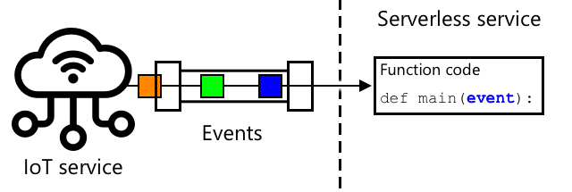
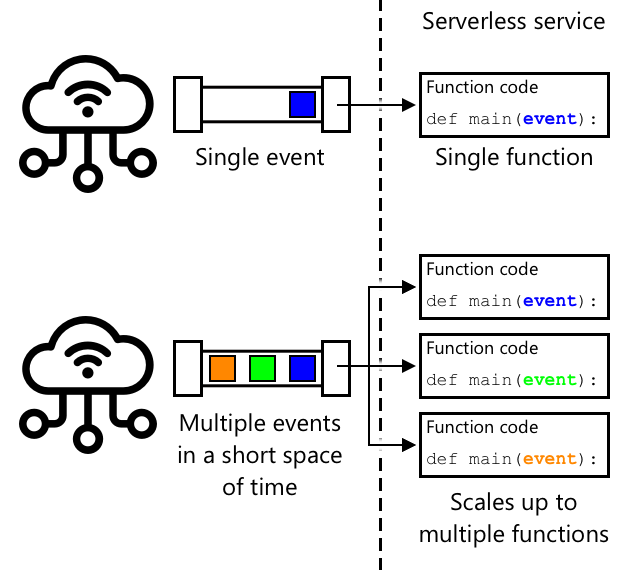
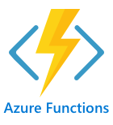
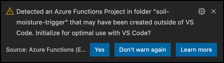

# Migrate your application logic to the cloud

Add a sketchnote if possible/appropriate


## Pre-lecture quiz

[Pre-lecture quiz](https://brave-island-0b7c7f50f.azurestaticapps.net/quiz/17)

## Introduction

In the last lesson, you learned how to connect your plant soil moisture monitoring and relay control to a cloud-based IoT service. The next step is to move the server code that controls the timing of the relay to the cloud. In this lesson you will learn how to do this using serverless functions.

In this lesson we'll cover:

* [What is serverless?](#what-is-serverless)
* [Create a serverless application](#create-a-serverless-application)
* [Create an IoT Hub event trigger](#create-an-iot-hub-event-trigger)
* [Send direct method requests from serverless code](#send-direct-method-requests-from-serverless-code)
* [Deploy your serverless code to the cloud](#deploy-your-serverless-code-to-the-cloud)

## What is serverless?

Serverless, or serverless computing, involves creating small blocks of code that are run in the cloud in response to different kinds of events. When the event happens your code is run, and it is passed data about the event. These events can be from many different things, including web requests, messages put on a queue, changes to data in a database, or messages sent to an IoT service by IoT devices.



***Events being sent from an IoT service to a serverless service, all being processed at the same time by multiple functions being run. IoT by Adrien Coquet from the [Noun Project](https://thenounproject.com)***

> 💁 If you've used database triggers before, you can think of this as the same thing, code being triggered by an event such as inserting a row.



***When many events are sent at the same time, the serverless service scales up to run them all at the same time. IoT by Adrien Coquet from the [Noun Project](https://thenounproject.com)***

Your code is only run when the event happens, there is nothing keeping your code alive at other times. The event happens, your code is loaded and run. This makes serverless very scalable - if many events happen at the same time, the cloud provider can run your function as many times as you need at the same time across whatever servers they have available. The downside to this is if you need to share information between events, you need to save it somewhere like a database rather than storing it in memory.

Your code is written as a function that takes details about the event as a parameter. You can use a wide range of programming languages to write these serverless functions.

> 🎓 Serverless is also referred to as Functions as a service (FaaS) as each event trigger is implemented as a function in code.

Despite the name, serverless does actually use servers. The naming is because you as a developer don't care about the servers needed to run your code, all you care about is that your code is run in response to an event. The cloud provider has a serverless *runtime* that manages allocating servers, networking, storage, CPU, memory and everything else needed to run your code. This model means you can't pay per server for the service, as there is no server. Instead you pay for the time your code is running, and the amount of memory used.

> 💰 Serverless is one of the cheapest ways to run code in the cloud. For example, at the time of writing, one cloud provider allows all of your serverless functions to execute a combined 1,000,000 times a month before they start charging you, and after that they charge US$0.20 for each 1,000,000 executions. When your code is not running, you don't pay.

As an IoT developer, the serverless model is ideal. You can write a function that is called in response to messages sent from any IoT device that is connected to your cloud-hosted IoT service. Your code will handle all messages sent, but only be running when needed.

✅ Look back at the code you wrote as server code listening to messages over MQTT. How might this run in the cloud using serverless? How do you think the code might be changed to support serverless computing?

> 💁 The serverless model is moving to other cloud services in addition to running code. For example, serverless databases are available in the cloud using a serverless pricing model where you pay per request made against the database, such as a query or insert, usually using pricing based on how much work is done to service the request. For example a single select of one row against a primary key will cost less than a complicated operation joining many tables and returning thousands of rows.

## Create a serverless application

The serverless computing service from Microsoft is called Azure Functions.



The short video below has an overview of Azure Functions

[](https://www.youtube.com/watch?v=8-jz5f_JyEQ)

> 🎥 Click the image above to watch a video

✅ Take a moment to do some research and read the overview of Azure Functions in the [Microsoft Azure Functions documentation](https://docs.microsoft.com/azure/azure-functions/functions-overview?WT.mc_id=academic-17441-jabenn).

To write Azure Functions, you start with an Azure Functions app in the language of your choice. Out of the box Azure Functions supports Python, JavaScript, TypeScript, C#, F#, Java, and Powershell. In this lesson you will learn how to write an Azure Functions app in Python.

> 💁 Azure Functions also supports custom handlers so you can write your functions in any language that supports HTTP requests, including older languages such as COBOL.

Functions apps consist of one or more *triggers* - functions that respond to events. You can have multiple triggers inside one function app, all sharing common configuration. For example, in the configuration file for your Functions app you can have the connection details of your IoT Hub, and all the functions in the app can use this to connect and listen for events.

### Task - install the Azure Functions tooling

One great feature of Azure Functions is that you can run them locally. The same runtime that is used in the cloud can be run on your computer, allowing you to write code that responds to IoT messages and run it locally. You can even debug your code as events are handled. Once you are happy with your code, it can be deployed to the cloud.

The Azure Functions tooling is available as a CLI, known as the Azure Functions Core Tools.

1. Install the Azure Functions core tools by following the instructions on the [Azure Functions Core Tools documentation](https://docs.microsoft.com/azure/azure-functions/functions-run-local?WT.mc_id=academic-17441-jabenn)

1. Install the Azure Functions extension for VS Code. This extension provides support for creating, debugging and deploying Azure functions.  Refer to the [Azure Functions extension documentation](https://marketplace.visualstudio.com/items?itemName=ms-azuretools.vscode-azurefunctions&WT.mc_id=academic-17441-jabenn) for instructions on installing this extension in VS Code.

When you deploy your Azure Functions app to the cloud, it needs to use a small amount of cloud storage to store things like the application files and log files. When you run your Functions app locally, you still need to connect to cloud storage, but instead of using actual cloud storage, you can use a storage emulator called [Azurite](https://github.com/Azure/Azurite). This runs locally but acts like cloud storage.

> 🎓 In Azure, the storage that Azure Functions uses is an Azure Storage Account. These accounts can store files, blobs, data in tables or data in queues. You can share one storage account between many apps, such as a Functions app and a web app.

1. Azurite is a Node.js app, so you will need to install Node.js. You can find the download and installation instructions on the [Node.js website](https://nodejs.org/). If you are using a Mac, you can also install it from [Homebrew](https://formulae.brew.sh/formula/node).

1. Install Azurite using the following command (`npm` is a tool that is installed when you install Node.js):

    ```sh
    npm install -g azurite
    ```

1. Create a folder called `azurite` for Azurite to use to store data:

    ```sh
    mkdir azurite
    ```

1. Run Azurite, passing it this new folder:

    ```sh
    azurite --location azurite
    ```

    The Azurite storage emulator will launch and be ready for the local Functions runtime to connect.

    ```output
    ➜  ~ azurite --location azurite  
    Azurite Blob service is starting at http://127.0.0.1:10000
    Azurite Blob service is successfully listening at http://127.0.0.1:10000
    Azurite Queue service is starting at http://127.0.0.1:10001
    Azurite Queue service is successfully listening at http://127.0.0.1:10001
    Azurite Table service is starting at http://127.0.0.1:10002
    Azurite Table service is successfully listening at http://127.0.0.1:10002
    ```

### Task - create an Azure Functions project

The Azure Functions CLI can be used to create a new Functions app.

1. Create a folder for your Functions app and navigate to it. Call it `soil-moisture-trigger`

    ```sh
    mkdir soil-moisture-trigger
    cd soil-moisture-trigger
    ```

1. Create a Python virtual environment inside this folder:

    ```sh
    python3 -m venv .venv
    ```

1. Activate the virtual environment:

    * On Windows run:

        ```cmd
        .venv\Scripts\activate.bat
        ```

    * On macOS or Linux, run:

        ```cmd
        source ./.venv/bin/activate
        ```

1. Run the following command to create a Functions app in this folder:

    ```sh
    func init --worker-runtime python soil-moisture-trigger
    ```

    This will create three files inside the current folder:

    * `host.json` - this JSON document contains settings for your Functions app. You won't need to modify these settings.
    * `local.settings.json` - this JSON document contains settings your app would use when running locally, such as connection strings for your IoT Hub. These settings are local only, and should not be added to source code control. When you deploy the app to the cloud, these settings are not deployed, instead your settings are loaded from application settings. This will be covered later in this lesson.
    * `requirements.txt` - this is a [Pip requirements file](https://pip.pypa.io/en/stable/user_guide/#requirements-files) that contains the Pip packages needed to run your Functions app.

1. The `local.settings.json` file has a setting for the storage account that the Functions app will use. This defaults to an empty setting, so needs to be set. To connect to the Azurite local storage emulator, set this value to the following:

    ```json
    "AzureWebJobsStorage": "UseDevelopmentStorage=true",
    ```

1. Install the necessary Pip packages using the requirements file:

    ```sh
    pip install -r requirements.txt
    ```

    > 💁 The required Pip packages need to be in this file, so that when the Functions app is deployed to the cloud, the runtime can ensure it installs the correct packages.

1. To test everything is working correctly, you can start the Functions runtime. Run the following command to do this:

    ```sh
    func start
    ```

    You will see the runtime start up and report that it hasn't found any job functions (triggers).

    ```output
    (.venv) ➜  soil-moisture-trigger func start
    Found Python version 3.9.1 (python3).
    
    Azure Functions Core Tools
    Core Tools Version:       3.0.3442 Commit hash: 6bfab24b2743f8421475d996402c398d2fe4a9e0  (64-bit)
    Function Runtime Version: 3.0.15417.0
    
    [2021-05-05T01:24:46.795Z] No job functions found.
    ```

    > ⚠️ If you get a firewall notification, grant access as the `func` application needs to be able to read and write to your network.

    > ⚠️ If you are using macOS, there may be warnings in the output:
    >
    > ```output
    > (.venv) ➜  soil-moisture-trigger func start
    > Found Python version 3.9.1 (python3).
    >
    > Azure Functions Core Tools
    > Core Tools Version:       3.0.3442 Commit hash: 6bfab24b2743f8421475d996402c398d2fe4a9e0  (64-bit)
    > Function Runtime Version: 3.0.15417.0
    >
    > [2021-06-16T08:18:28.315Z] Cannot create directory for shared memory usage: /dev/shm/AzureFunctions
    > [2021-06-16T08:18:28.316Z] System.IO.FileSystem: Access to the path '/dev/shm/AzureFunctions' is denied. Operation not permitted.
    > [2021-06-16T08:18:30.361Z] No job functions found.
    > ```
    >
    > You can ignore these as long as the Functions app starts correctly and lists the running functions. As mentioned in [this question on the Microsoft Docs Q&A](https://docs.microsoft.com/answers/questions/396617/azure-functions-core-tools-error-osx-devshmazurefu.html?WT.mc_id=academic-17441-jabenn) it can be ignored.

1. Stop the Functions app by pressing `ctrl+c`.

1. Open the current folder in VS Code, either by opening VS Code, then opening this folder, or by running the following:

    ```sh
    code .
    ```

    VS Code will detect your Functions project and show a notification saying:

    ```output
    Detected an Azure Functions Project in folder "soil-moisture-trigger" that may have been created outside of
    VS Code. Initialize for optimal use with VS Code?
    ```

    

    Select **Yes** from this notification.

1. Make sure the Python virtual environment is running in the VS Code terminal. Terminate it and restart it if necessary.

## Create an IoT Hub event trigger

The Functions app is the shell of your serverless code. To respond to IoT hub events, you can add an IoT Hub trigger to this app. This trigger needs to connect to the stream of messages that are sent to the IoT Hub and respond to them. To get this stream of messages, your trigger needs to connect to the IoT Hubs *event hub compatible endpoint*.

IoT Hub is based upon another Azure service called Azure Event Hubs. Event Hubs is a service that allows you to send and receive messages, IoT Hub extends this to add features for IoT devices. The way you connect to read messages off the IoT Hub is the same as you would if you were using Event Hubs.

✅ Do some research: Read the overview of Event Hubs in the [Azure Event Hubs documentation](https://docs.microsoft.com/azure/event-hubs/event-hubs-about?WT.mc_id=academic-17441-jabenn). How do the basic features compare to IoT Hub?

For an IoT device to connect to the IoT Hub, it has to use a secret key that ensures only allowed devices can connect. The same applies when connecting to read off messages, your code will need a connection string that contains a secret key, along with details of the IoT Hub.

> 💁 The default connection string you get has **iothubowner** permissions, which gives any code that uses it full permissions on the IoT Hub. Ideally you should connect with the lowest level of permissions needed. This will be covered in the next lesson.

Once your trigger has connected, the code inside the function will be called for every message sent to the IoT Hub, regardless of which device sent it. The trigger will be passed the message as a parameter.

### Task - get the Event Hub compatible endpoint connection string

1. From the VS Code terminal run the following command to get the connection string for the IoT Hubs Event Hub compatible endpoint:

    ```sh
    az iot hub connection-string show --default-eventhub \
                                      --output table \
                                      --hub-name <hub_name>
    ```

    Replace `<hub_name>` with the name you used for your IoT Hub.

1. In VS Code, open the `local.settings.json` file. Add the following additional value inside the `Values` section:

    ```json
    "IOT_HUB_CONNECTION_STRING": "<connection string>"
    ```

    Replace `<connection string>` with the value from the previous step. You will need to add a comma after the line above to make this valid JSON.

### Task - create an event trigger

You are now ready to create the event trigger.

1. From the VS Code terminal run the following command from inside the `soil-moisture-trigger` folder:

    ```sh
    func new --name iot-hub-trigger --template "Azure Event Hub trigger"
    ```

    This creates a new Function called `iot-hub-trigger`. The trigger will connect to the Event Hub compatible endpoint on the IoT Hub, so you can use an event hub trigger. There is no specific IoT Hub trigger.

This will create a folder inside the `soil-moisture-trigger` folder called `iot-hub-trigger` that contains this function. This folder will have the following files inside it:

* `__init__.py` - this is the Python code file that contains the trigger, using the standard Python file name convention to turn this folder into a Python module.

    This file will contain the following code:

    ```python
    from typing import List
    import logging
    import azure.functions as func
    
    def main(events: List[func.EventHubEvent]):
        for event in events:
            logging.info('Python EventHub trigger processed an event: %s',
                            event.get_body().decode('utf-8'))
    ```

    The core of the trigger is the `main` function. It is this function that is called with the events from the IoT Hub. This function has a parameter called `events` that contains a list of `EventHubEvent`. Each event in this list is a message sent to IoT Hub, along with properties that are the same as the annotations you saw in the last lesson.

    This trigger processes a list of events, rather than individual events. When you first run the trigger it wil process any unprocessed events on the IoT Hub (remember that messages are stored for a while so they are not lost if your application code is offline). After this it will generally process a list containing only one event, unless a lot of events are sent to the Hub in a short space of time.

    The core of this function loops through the list and logs the events.

* `function.json` - this contains configuration for the trigger. The main configuration is in a section called `bindings`. A binding is the term for a connection between Azure Functions and other Azure services. This function has an input binding to an event hub - it connects to an event hub and receives data.

    > 💁 You can also have output bindings so that the output of a function is sent to another service. For example you could add an output binding to a database and return the IoT Hub event from the function, and it will automatically be inserted into the database.

    ✅ Do some research: Read up on bindings in the [Azure Functions triggers and bindings concepts documentation](https://docs.microsoft.com/azure/azure-functions/functions-triggers-bindings?tabs=python&WT.mc_id=academic-17441-jabenn).

    The `bindings` section includes configuration for the binding. The values of interest are:

  * `"type": "eventHubTrigger"` - this tells the function it needs to listen to events from an Event Hub
  * `"name": "events"` - this is the parameter name to use for the Event Hub events. This matches the parameter name in the `main` function in the Python code.
  * `"direction": "in"` - this is an input binding, the data from the event hub comes into the function
  * `"connection": ""` - this defines the name of the setting to read the connection string from. When running locally, this will read this setting from the `local.settings.json` file.

    > 💁 The connection string cannot be stored in the `function.json` file, it has to be read from the settings. This is to stop you accidentally exposing your connection string.

1. Update the value of `"connection"` in the `function.json` file to point to the new value you added to the `local.settings.json` file:

    ```json
    "connection": "IOT_HUB_CONNECTION_STRING",
    ```

    > 💁 Remember - this needs to point to the setting, not contain the actual connection string.

### Task - run the event trigger

1. Make sure you are not running the IoT Hub event monitor. If this is running at the same time as the functions app, the functions app will not be able to connect and consume events.

    > 💁 Multiple apps can connect to the IoT Hub endpoints using different *consumer groups*. These are covered in a later lesson.

1. To run the Functions app, run the following command from the VS Code terminal

    ```sh
    func start
    ```

    The Functions app will start up, and will discover the `iot-hub-trigger` function. It will then process any events that have already been sent to the IoT Hub in the past day.

    ```output
    (.venv) ➜  soil-moisture-trigger func start
    Found Python version 3.9.1 (python3).
    
    Azure Functions Core Tools
    Core Tools Version:       3.0.3442 Commit hash: 6bfab24b2743f8421475d996402c398d2fe4a9e0  (64-bit)
    Function Runtime Version: 3.0.15417.0
    
    Functions:
    
            iot-hub-trigger: eventHubTrigger
    
    For detailed output, run func with --verbose flag.
    [2021-05-05T02:44:07.517Z] Worker process started and initialized.
    [2021-05-05T02:44:09.202Z] Executing 'Functions.iot-hub-trigger' (Reason='(null)', Id=802803a5-eae9-4401-a1f4-176631456ce4)
    [2021-05-05T02:44:09.205Z] Trigger Details: PartionId: 0, Offset: 1011240-1011632, EnqueueTimeUtc: 2021-05-04T19:04:04.2030000Z-2021-05-04T19:04:04.3900000Z, SequenceNumber: 2546-2547, Count: 2
    [2021-05-05T02:44:09.352Z] Python EventHub trigger processed an event: {"soil_moisture":628}
    [2021-05-05T02:44:09.354Z] Python EventHub trigger processed an event: {"soil_moisture":624}
    [2021-05-05T02:44:09.395Z] Executed 'Functions.iot-hub-trigger' (Succeeded, Id=802803a5-eae9-4401-a1f4-176631456ce4, Duration=245ms)
    ```

    Each call to the function will be surrounded by a `Executing 'Functions.iot-hub-trigger'`/`Executed 'Functions.iot-hub-trigger'` block in the output, so you can how many messages were processed in each function call.

    > If you get the following error:

      ```output
      The listener for function 'Functions.iot-hub-trigger' was unable to start. Microsoft.WindowsAzure.Storage: Connection refused. System.Net.Http: Connection refused. System.Private.CoreLib: Connection refused.
      ```

      Then check Azurite is running and you have set the `AzureWebJobsStorage` in the `local.settings.json` file to `UseDevelopmentStorage=true`.

1. Make sure your IoT device is running, You will see new soil moisture messages appearing in the Functions app.

1. Stop and restart the Functions app. You will see that it won't process messages previous messages again, it will only process new messages.

> 💁 VS Code also supports debugging your Functions. You can set break points by clicking on the border by the start of each line of code, or putting the cursor on a line of code and selecting *Run -> Toggle breakpoint*, or pressing `F9`. You can launch the debugger by selecting *Run -> Start debugging*, pressing `F5`, or selecting the *Run and debug* pane and selecting the **Start debugging** button. By doing this you can see the details of the events being processed.

## Send direct method requests from serverless code

So far your Functions app is listening to messages from the IoT Hub using the Event Hub compatible end point. You now need to send commands to the IoT device. This is done by using a different connection to the IoT Hub via the *Registry Manager*. The Registry Manager is a tool that allows you to see what devices are registered with the IoT Hub, and communicate with those devices by sending cloud to device messages, direct method requests or updating the device twin. You can also use it to register, update or delete IoT devices from the IoT Hub.

To connect to the Registry Manager, you need a connection string.

### Task - get the Registry Manager connection string

1. To get the connection string, run the following command:

    ```sh
    az iot hub connection-string show --policy-name service \
                                      --output table \
                                      --hub-name <hub_name>
    ```

    Replace `<hub_name>` with the name you used for your IoT Hub.

    The connection string is requested for the *ServiceConnect* policy using the `--policy-name service` parameter. When you request a connection string, you can specify what permissions that connection string will allow. The ServiceConnect policy allows your code to connect and send messages to IoT devices.

    ✅ Do some research: Read up on the different policies in the [IoT Hub permissions documentation](https://docs.microsoft.com/azure/iot-hub/iot-hub-devguide-security#iot-hub-permissions?WT.mc_id=academic-17441-jabenn)

1. In VS Code, open the `local.settings.json` file. Add the following additional value inside the `Values` section:

    ```json
    "REGISTRY_MANAGER_CONNECTION_STRING": "<connection string>"
    ```

    Replace `<connection string>` with the value from the previous step. You will need to add a comma after the line above to make this valid JSON.

### Task - send a direct method request to a device

1. The SDK for the Registry Manager is available via a Pip package. Add the following line to the `requirements.txt` file to add the dependency on this package:

    ```sh
    azure-iot-hub
    ```

1. Make sure the VS Code terminal has the virtual environment activated, and run the following command to install the Pip packages:

    ```sh
    pip install -r requirements.txt
    ```

1. Add the following imports to the `__init__.py` file:

    ```python
    import json
    import os
    from azure.iot.hub import IoTHubRegistryManager
    from azure.iot.hub.models import CloudToDeviceMethod
    ```

    This imports some system libraries, as well as the libraries to interact with the Registry Manager and send direct method requests.

1. Remove the code from inside the `main` method, but keep the method itself.

1. When multiple messages are received, it only makes sense to process the last one as this is the current soil moisture. It makes no sense to process messages from before. Add the following code to get the last message from the `events` parameter:

    ```python
    event = events[-1]
    ```

1. Below this, add the following code:

    ```python
    body = json.loads(event.get_body().decode('utf-8'))
    device_id = event.iothub_metadata['connection-device-id']

    logging.info(f'Received message: {body} from {device_id}')
    ```

    This code extracts the body of the event which contains the JSON message sent by the IoT device.

    It then gets the device ID from the annotations passed with the message. The body of the event contains the message sent as telemetry, the `iothub_metadata` dictionary contains properties set by the IoT Hub such as the device ID of the sender, and the time that the message was sent.

    This information is then logged. You will see this logging in the terminal when you run the Function app locally.

1. Below this, add the following code:

    ```python
    soil_moisture = body['soil_moisture']

    if soil_moisture > 450:
        direct_method = CloudToDeviceMethod(method_name='relay_on', payload='{}')
    else:
        direct_method = CloudToDeviceMethod(method_name='relay_off', payload='{}')
    ```

    This code gets the soil moisture from the message. It then checks the soil moisture, and depending on the value, creates a helper class for the direct method request for the `relay_on` or `relay_off` direct method. The method request doesn't need a payload, so an empty JSON document is sent.

1. Below this add the following code:

    ```python
    logging.info(f'Sending direct method request for {direct_method.method_name} for device {device_id}')

    registry_manager_connection_string = os.environ['REGISTRY_MANAGER_CONNECTION_STRING']
    registry_manager = IoTHubRegistryManager(registry_manager_connection_string)
    ```

    This code loads the `REGISTRY_MANAGER_CONNECTION_STRING` from the `local.settings.json` file. The values in this file are made available as environment variables, and these can be read using the `os.environ` function, a function that returns a dictionary of all the environment variables.

    > 💁 When this code is deployed to the cloud, the values in the `local.settings.json` file will be set as *Application Settings*, and these can be read from environment variables.

    The code then creates an instance of the Registry Manager helper class using the connection string.

1. Below this add the following code:

    ```python
    registry_manager.invoke_device_method(device_id, direct_method)

    logging.info('Direct method request sent!')
    ```

    This code tells the registry manager to send the direct method request to the device that sent the telemetry.

    > 💁 In the versions of the app you created in earlier lessons using MQTT, the relay control commands were sent to all devices. The code assumed you would only have one device. This version of the code sends the method request to a single device, so would work if you had multiple setups of moisture sensors and relays, sending the right direct method request to the right device.

1. Run the Functions app, and make sure your IoT device is sending data. You will see the messages being processed and the direct method requests being sent. Move the soil moisture sensor in and out of the soil to see the values change and the relay turn on and off

> 💁 You can find this code in the [code/functions](code/functions) folder.

## Deploy your serverless code to the cloud

Your code is now working locally, so the next step is to deploy the Functions App to the cloud.

### Task - create the cloud resources

Your Functions app needs to be deployed to a Functions App resource in Azure, living inside the Resource Group you created for your IoT Hub. You will also need a Storage Account created in Azure to replace the emulated one you have running locally.

1. Run the following command to create a storage account:

    ```sh
    az storage account create --resource-group soil-moisture-sensor \
                              --sku Standard_LRS \
                              --name <storage_name> 
    ```

    Replace `<storage_name>` with a name for your storage account. This will need to be globally unique as it forms part of the URL used to access the storage account. You can only use lower case letters and numbers for this name, no other characters, and it's limited to 24 characters. Use something like `sms` and add a unique identifier on the end, like some random words or your name.

    The `--sku Standard_LRS` selects the pricing tier, selecting the lowest cost general-purpose account. There isn't a free tier of storage, and you pay for what you use. The costs are relatively low, with the most expensive storage at less than US$0.05 per month per gigabyte stored.

    ✅ Read up on pricing on the [Azure Storage Account pricing page](https://azure.microsoft.com/pricing/details/storage/?WT.mc_id=academic-17441-jabenn)

1. Run the following command to create a Function App:

    ```sh
    az functionapp create --resource-group soil-moisture-sensor \
                          --runtime python \
                          --functions-version 3 \
                          --os-type Linux \
                          --consumption-plan-location <location> \
                          --storage-account <storage_name> \
                          --name <functions_app_name>
    ```

    Replace `<location>` with the location you used when creating the Resource Group in the previous lesson.

    Replace `<storage_name>` with the name of the storage account you created in the previous step.

    Replace `<functions_app_name>` with a unique name for your Functions App. This will need to be globally unique as it forms part of a URL that can be used to access the Functions App. Use something like `soil-moisture-sensor-` and add a unique identifier on the end, like some random words or your name.

    The `--functions-version 3` option sets the version of Azure Functions to use. Version 3 is the latest version.

    The `--os-type Linux` tells the Functions runtime to use Linux as the OS to host these functions. Functions can be hosted on Linux or Windows, depending on the programming language used. Python apps are only supported on Linux.

### Task - upload your application settings

When you developed your Functions App, you stored some settings in the `local.settings.json` file for the connection strings for your IoT Hub. These need to be written to Application Settings in your Function App in Azure so that they can be used by your code.

> 🎓 The `local.settings.json` file is for local development settings only, and these should not be checked into source code control, such as GitHub. When deployed to the cloud, Application Settings are used. Application Settings are key/value pairs hosted in the cloud and are read from environment variables either in your code or by the runtime when connecting your code to IoT Hub.

1. Run the following command to set the `IOT_HUB_CONNECTION_STRING` setting in the Functions App Application Settings:

    ```sh
    az functionapp config appsettings set --resource-group soil-moisture-sensor \
                                          --name <functions_app_name> \
                                          --settings "IOT_HUB_CONNECTION_STRING=<connection string>"
    ```

    Replace `<functions_app_name>` with the name you used for your Functions App.

    Replace `<connection string>` with the value of `IOT_HUB_CONNECTION_STRING` from your `local.settings.json` file.

1. Repeat the step above, but set the value of `REGISTRY_MANAGER_CONNECTION_STRING` to the corresponding value from your `local.settings.json` file.

When you run these commands, they will also output a list of all the Application Settings for the function app. You can use this to check that your values are set correctly.

> 💁 You will see a value already set for `AzureWebJobsStorage`. In your `local.settings.json` file, this was set to a value to use the local storage emulator. When you created the Functions App, you pass the storage account as a parameter, and this gets set automatically in this setting.

### Task - deploy your Functions App to the cloud

Now that the Functions App is ready, your code can be deployed.

1. Run the following command from the VS Code terminal to publish your Functions App:

    ```sh
    func azure functionapp publish <functions_app_name>
    ```

    Replace `<functions_app_name>` with the name you used for your Functions App.

The code will be packaged up and sent to the Functions App, where it will be deployed and started. There will be a lot of console output, ending in confirmation of the deployment and a list of the functions deployed. In this case the list will only contain the trigger.

```output
Deployment successful.
Remote build succeeded!
Syncing triggers...
Functions in soil-moisture-sensor:
    iot-hub-trigger - [eventHubTrigger]
```

Make sure your IoT device is running. Change the moisture levels by adjusting the soil moisture, or moving the sensor in and out of the soil. You will see the relay turn on and off as the soil moisture changes.

---

## 🚀 Challenge

In the previous lesson, you managed timing for the relay by unsubscribing from MQTT messages whilst the relay was on, and for a short while after it was turned off. You can't use this method here - you cannot unsubscribe your IoT Hub trigger.

Think about different ways you could handle this in your Functions App.

## Post-lecture quiz

[Post-lecture quiz](https://brave-island-0b7c7f50f.azurestaticapps.net/quiz/18)

## Review & Self Study

* Read up on serverless computing on the [Serverless Computing page on Wikipedia](https://wikipedia.org/wiki/Serverless_computing)
* Read about using serverless in Azure including some more examples on the [Go serverless for your IoT needs Azure blog post](https://azure.microsoft.com/blog/go-serverless-for-your-iot-needs/?WT.mc_id=academic-17441-jabenn)
* Learn more about Azure Functions on the [Azure Functions YouTube channel](https://www.youtube.com/c/AzureFunctions)

## Assignment

[Add manual relay control](assignment.md)
