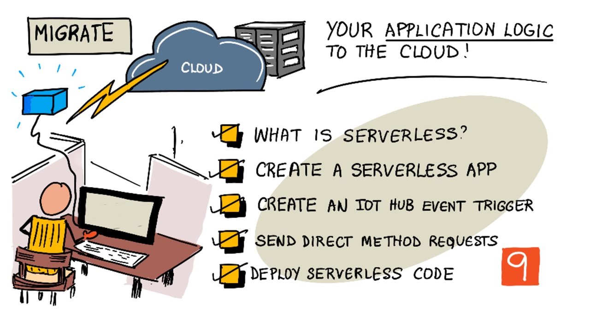

# অ্যাপ্লিকেশন লজিককে ক্লাউডে স্থানান্তর



> স্কেচনোটটি তৈরী করেছেন [Nitya Narasimhan](https://github.com/nitya). বড় সংস্করণে দেখার জন্য ছবিটিতে ক্লিক করতে হবে।

## লেকচার-পূর্ববর্তী কুইজ

[লেকচার-পূর্ববর্তী কুইজ](https://brave-island-0b7c7f50f.azurestaticapps.net/quiz/17)

## সূচনা

গত পাঠে আমরা শিখেছি কীভাবে ক্লাউড-ভিত্তিক আইওটি পরিষেবাতে আমাদের উদ্ভিদকে সংযুক্ত করতে হবে এবং মাটির আর্দ্রতা পর্যবেক্ষণ এবং রিলে নিয়ন্ত্রণ এর মতো কাজগুলো কীভাবে ক্লাউড থেকে করা যায়।  এখন পরবর্তী পদক্ষেপটি হল সার্ভার কোডকে ক্লাউডে স্থানান্তর করা যা রিলে এর টাইমিং নিয়ন্ত্রণ করে। এই পাঠে আমরা সার্ভারবিহীন (serverless) ফাংশন দ্বারা এই কাজটি করতে শিখব।

এই লেসনে রয়েছেঃ

* [সার্ভারলেস বলতে কী বোঝায়?](#সার্ভারলেস-বলতে-কী-বোঝায়)
* [একটি সার্ভারলেস অ্যাপ্লিকেশন তৈরি](#একটি-সার্ভারলেস-অ্যাপ্লিকেশন-তৈরি-করা)
* [একটি IoT Hub ইভেন্ট ট্রিগার তৈরি](#একটি-আইওটি-হাব-ইভেন্ট-ট্রিগার-তৈরি-করা)
* [সার্ভারলেস কোড থেকে ডিরেক্ট মেথড রিকুয়েস্ট পাঠানো](#সার্ভারলেস-কোড-থেকে-ডিরেক্ট-মেথড-রিকুয়েস্ট-পাঠানো)
* [ক্লাউডে সার্ভারলেস কোড ডেপ্লয় করা](#ক্লাউডে-সার্ভারলেস-কোড-ডেপ্লয়-করা)

## সার্ভারলেস বলতে কী বোঝায়?

সার্ভারলেস বা সার্ভারবিহীন কম্পিউটিং বলতে বোঝানো হয় বিভিন্ন ধরণের ইভেন্টের প্রতিক্রিয়া হিসাবে ক্লাউডে চালিত কোডের ছোট ছোট ব্লক । ইভেন্ট ঘটলে কোড চালিত হয় এবং এটি ইভেন্ট সম্পর্কিত ডেটা পাস করে। এই ইভেন্টগুলি বিভিন্ন  বিষয় সম্পর্কিত হতে পারে যেমন, ওয়েব রিকোয়েস্ট, সারিতে অপেক্ষারত বার্তাসমূহ, একটি ডাটাবেসে ডেটা পরিবর্তন করা বা আইওটি ডিভাইসগুলির মাধ্যমে আইওটি পরিষেবাতে বার্তা প্রেরণ ইত্যাদি।


> 💁 যদি আগে 'ডাটাবেস ট্রিগার' ব্যবহারের অভিজ্ঞতা থাকে, তবে এটাকেও একই জিনিস হিসাবে ভাবা যায় যা কোন ইভেন্টের মাধ্যমে কোড ট্রিগার করার মাধ্যমে কাজ করছে, যেমন একটি সারি বা row যোগ করা ।


আমাদের কোডটি কেবল তখনই রান হয়, যখন ইভেন্টটি ঘটে ; অন্য  সময় কোড সক্রিয় থাকেনা। ইভেন্টটি ঘটামাত্র কোডটি লোড হয় এবং তা চালানো হয়। এটি সার্ভারলেসকে খুব স্কেলেবল (scalable) করে তোলে - যদি একই সাথে অনেকগুলি ইভেন্ট ঘটে, তবে ক্লাউড সরবরাহকারী যতবার প্রয়োজন ততবার কোড চালাতে পারে। তবে এটির অনেক সুবিধা থাকলেও, এর নেতিবাচক দিকটি হল যদি আমাদেরকে ইভেন্টগুলির মধ্যে তথ্য আদান-প্রদানের দরকার হয়, তবে এটি ডাটাবেসের মতো কোথাও সংরক্ষণ করতে হবে।

আমাদের কোড একটি ফাংশন আকারে লেখা হয়েছে, যা প্যারামিটার হিসাবে ইভেন্টটির তথ্য গ্রহণ করে। এই সার্ভারলেস ফাংশনগুলি লিখতে আমরা অনেকগুলো প্রোগ্রামিং ভাষা ব্যবহার করতে পারি।

> 🎓 সার্ভারলেসকে অনেকসময় Functions as a service (FaaS) হিসাবেও উল্লেখ করা হয় কারণ প্রতিটি ইভেন্ট ট্রিগারকে কোড এ ফাংশন হিসাবে প্রয়োগ করা হয়।

নাম "সার্ভারলেস" হলেও, এটি আসলে সার্ভার ব্যবহার করে। নামকরণটি এমন হওয়ার পিছনে কারণ হল আমরা ডেভলাপার হিসাবে কোড চালানোর জন্য সার্ভার বিষয়ে কোন চিন্তাই করি না, আমাদের সকল মনোযোগ থাকে কোন ইভেন্টের প্রতিক্রিয়াতে কোডটি চালানো হচ্ছে কিনা সে বিষয়ে। ক্লাউড সরবরাহকারীর একটি সার্ভারলেস *রানটাইম* রয়েছে যা সার্ভার, নেটওয়ার্কিং, স্টোরেজ, সিপিইউ, মেমরি এবং কোড চালানোর জন্য প্রয়োজনীয় সমস্ত কিছুর ব্যবস্থা করে। এই মডেলটিতে সার্ভার নেই বলে, আমরা এই সার্ভিসের জন্য সার্ভার ব্যবস্থাপনার অর্থ প্রদান করতে পারব না। এর পরিবর্তে আমাদেরকে বরং কোডটির চলমান সময় এবং মেমরির ব্যবহারের পরিমাণের উপর অর্থ প্রদান করতে হবে।

> 💰  ক্লাউডে কোড কম খরচে রান করার সবচেয়ে ভালো উপায় হলো সার্ভারলেস। উদাহরণস্বরূপ, (এই লেসন লেখার সময়) যেকোন ক্লাউড সরবরাহকারী এই ফাংশনগুলিতে চার্জ শুরু করার আগে একমাসে 1000,000 বার রান করার সুযোগ দেয় এবং তারপরে তারা প্রতিটি 1,000,000 বার কোড এক্সেকিউট করার জন্য $0.20 চার্জ করে। যখন কোড চলছে না, তখন আমাদেরকে অর্থ প্রদান করতে হবেনা।

আইওটি ডেভলাপার হিসাবে সার্ভারলেস মডেলটি সর্বোত্তম। এখানে চাইলে আমরা এমন ফাংশন লিখতে পারি যা আমাদের ক্লাউড-হোস্টেড আইওটি পরিষেবাতে সংযুক্ত যেকোন আইওটি ডিভাইস থেকে প্রেরিত বার্তাগুলির সাথে যুক্ত থাকবে। আমাদের কোড এইসব প্রেরিত ম্যাসেজগুলোকে পরিচালনা করবে, তবে প্রয়োজন ব্যাতীত রান করবেনা।

✅ এমকিউটিটি-তে বার্তা গ্রহণের জন্য যে কোডটিকে সার্ভার কোড হিসাবে লিখেছি, সেটির দিকে আরেকবার লক্ষ্য করা যাক! কীভাবে এটি সার্ভারলেস ব্যবহার করে ক্লাউডে চলতে পারে? কীভাবে পরিবর্তন করলে, এই কোডটি সার্ভারলেস কম্পিউটিং সাপোর্ট করতে পারে?

> 💁 সার্ভারলেস মডেল কোড রান করার পাশপাশি কিছু বিষয়ে অন্যান্য ক্লাউড পরিষেবার দিকে যাচ্ছে। উদাহরণস্বরূপ, সার্ভারহীন ডাটাবেসগুলি ক্লাউডে পাওয়া যাচ্ছে যেখানে ডাটাবেসে পাঠানো রিকুয়েস্টের সংখ্যা অনুসারে ফী প্রদান করতে হবে, যেমন একটি  query বা row যুক্ত করা, তবে সাধারণত কতটা কাজ করা হচ্ছে তার ভিত্তিতে মূল্য নির্ধারণ করা হয়। উদাহরণস্বরূপ, প্রাইমারি কী  এর ভিত্তিতে একটি সারি সিলেক্ট করা হলে, তার খরচ অনেক কম হবে - অনেকগুলো টেবল যোগ করে একটি জটিল কাজ করার তুলনায়।

## একটি সার্ভারলেস অ্যাপ্লিকেশন তৈরি করা

মাইক্রোসফটের সার্ভারলেস অ্যাপ্লিকেশন কে বলা হয় Azure Function ।


নীচের সংক্ষিপ্ত ভিডিওটিতে অ্যাজুর ফাংশনগুলির একটি ওভারভিউ রয়েছে

[](https://www.youtube.com/watch?v=8-jz5f_JyEQ)

> 🎥 ভিডিও দেখতে উপরের ছবিতে ক্লিক করতে হবে

✅ এই পর্যায়ে একটু সময় নিয়ে কিছু পড়াশোনা করা উচিত। আর অ্যাজুর ফাংশন এর ব্যপারে জানতে হলে [Microsoft Azure Functions documentation](https://docs.microsoft.com/azure/azure-functions/functions-overview?WT.mc_id=academic-17441-jabenn) পড়া একটি ভালো উপায়।

অ্যাজুর ফাংশন লিখতে হলে, আমাদের পছন্দমতো কোন ল্যাংগুয়েজে অ্যাজুর ফাংশন এপ এ কাজ করা শুরু করতে হবে।  Python, JavaScript, TypeScript, C#, F#, Java, এবং Powershell খুবসহজেই ব্যবহার করা যায়। এই অধ্যায়ে আমরা পাইথন ব্যবহার করা অ্যাজুর ফাংশন এপ লেখা শিখবো।

> 💁 অ্যাজুর ফাংশন আবার কাস্টম হ্যান্ডলারও সাপোর্ট করে, তাই যেকোন ভাষায় এমনকি COBOLএর মতো পুরনো ল্যাঙ্গুয়েজেও তা লেখা যায়, যদি HTTP রিকোয়েস্ট সাপোর্ট করে। 

ফাংশন অ্যাপ্লিকেশনগুলিতে এক বা একাধিক *ট্রিগার* থাকে - এমন ক্রিয়াকলাপ যা ইভেন্টগুলিতে প্রতিক্রিয়া জানায়। আমাদের একটি ফাংশন অ্যাপ্লিকেশনের মধ্যে একাধিক ট্রিগার থাকতে পারে, সাধারণ একটি কনফিগারেশন নিয়েই। উদাহরণস্বরূপ, ফাংশন অ্যাপ্লিকেশনটির জন্য কনফিগারেশন ফাইলে আইওটি হাবের সংযোগের সকল তথ্য থাকতে পারে এবং অ্যাপ্লিকেশনটি্র সমস্ত ফাংশন এটি সংযোগ করতে এবং ইভেন্টগুলির তথ্য গ্রহণে এটি ব্যবহার করতে পারে

### কাজ - Azure Functions tooling ইন্সটল করা

অ্যাজুর ফাংশনগুলির একটি দুর্দান্ত বৈশিষ্ট্য হল এগুলি আমরা লোকালি চালাতে পারি। ক্লাউডের সমান রানটাইমে এটি আমাদের কম্পিউটারে চালানো যেতে পারে, যা আমাদেরকে আইওটি বার্তাগুলির প্রতিক্রিয়া জানায় এবং লোকালি চলতে পারে এমন কোড লেখার সুযোগ দেয়। এমনকি ইভেন্টগুলি হ্যান্ডেল হওয়ার সাথে সাথে আমরা নিজের কোডটি ডিবাগ করতে পারব। একবার কোড নিয়ে সন্তুষ্ট হলেই, এটি আমরা ক্লাউডে স্থাপন করতে পারবো।

Azure Functions tooling আমরা CLI এর মাধ্যমে ব্যবহার করতে পারি যাকে Azure Functions Core Tools ও বলা হয়।

1. Azure Functions Core Tools ইনস্টল করার জন্য [Azure Functions Core Tools documentation](https://docs.microsoft.com/azure/azure-functions/functions-run-local?WT.mc_id=academic-17441-jabenn) নির্দেশাবলী অনুসরণ করি।

1. VS Code এ Azure Functions extension ইন্সটল  করতে হবে। এই এক্সটেনশনে মাধ্যমে Azure functions তৈরী, ডিবাগ এবং ডেপ্লয় করা যাবে। প্রয়োজনীয় নির্দেশনা [Azure Functions extension documentation](https://marketplace.visualstudio.com/items?WT.mc_id=academic-17441-jabenn&itemName=ms-azuretools.vscode-azurefunctions) এ রয়েছে।

আমরা যখন ক্লাউডে অ্যাজুর ফাংশন অ্যাপ্লিকেশন শুরু করবো, তখন অ্যাপ্লিকেশন ফাইল এবং লগ ফাইলের মতো জিনিসগুলি সেভ রাখতে খুব অল্প পরিমাণে ক্লাউড স্টোরেজ ব্যবহার করা দরকার। যখন লোকালি আমরা ফাংশন অ্যাপ্লিকেশন চালাই তখন আমাদেরকে ক্লাউড স্টোরেজের সাথে সংযোগ স্থাপন করতে হবে, তবে প্রকৃত ক্লাউডের স্টোরেজ ব্যবহারের পরিবর্তে  একটি স্টোরেজ এমুলেটর ব্যবহার করতে হবে যেমন [Azurite](https://github.com/Azure/Azurite)। এটি লোকাল ভাবে চলে, তবে ক্লাউড স্টোরেজের মতো কাজ করে।

> 🎓 অ্যাজুরে, অ্যাজুর ফাংশনগুলি যে স্টোরেজ ব্যবহার করে তা একটি অ্যাজুর স্টোরেজ অ্যাকাউন্ট। এই অ্যাকাউন্টগুলি ফাইল, ব্লবস, টেবিলগুলিতে ডেটা সংরক্ষণ করতে পারে। এখানে চাইলেই অনেকগুলি অ্যাপ্লিকেশনের মধ্যে একটি স্টোরেজ অ্যাকাউন্ট ভাগ করা যায় যেমন একটি ফাংশন অ্যাপ এবং একটি ওয়েব অ্যাপ্লিকেশনে একই স্টোরেজ ব্যবহার করা।

1. Azurite হলো একটি Node.js এপ। তাই এটির  জন্য আগে Node.js ইন্সটল করতে হবে [Node.js website](https://nodejs.org/)এ সকল নির্দেশনা আছে। ম্যাক ব্যবহারকারীরা [Homebrew](https://formulae.brew.sh/formula/node) থেকেও ইন্সটল করতে পারবে।

1. নিচের কমান্ড ব্যবহার করে Azurite ইন্সটল করি :

    ```sh
    npm install -g azurite
    ```

1.  `azurite` নামে ফোল্ডার খুলি, এটির ডেটা স্টোর করার জন্য

    ```sh
    mkdir azurite
    ```

1. Azurite রান করি -

    ```sh
    azurite --location azurite
    ```

    Azurite স্টোরেজ ইম্যুলেটর launch হয়ে লোকাল ফাংশন  রানটাইমের জন্য অপেক্ষা করবে

    ```output
    ➜  ~ azurite --location azurite  
    Azurite Blob service is starting at http://127.0.0.1:10000
    Azurite Blob service is successfully listening at http://127.0.0.1:10000
    Azurite Queue service is starting at http://127.0.0.1:10001
    Azurite Queue service is successfully listening at http://127.0.0.1:10001
    Azurite Table service is starting at http://127.0.0.1:10002
    Azurite Table service is successfully listening at http://127.0.0.1:10002
    ```

### কাজ - একটি অ্যাজুর ফাংশন প্রজেক্ট তৈরি

Azure Functions CLI দ্বারা নতুন Functions app তৈরী করা যাবে

1. ফাংশন এপ এর জন্য ফোল্ডার খুলে সেখানে যাই, নাম দিই `soil-moisture-trigger`

    ```sh
    mkdir soil-moisture-trigger
    cd soil-moisture-trigger
    ```

1. ফোল্ডারে পাইথন ভার্চুয়াল এনভায়রনমেন্ট তৈরী করি

    ```sh
    python3 -m venv .venv
    ```

1. ভার্চুয়াল এনভায়রনমেন্ট এক্টিভেট করি

    * উইন্ডোজে:

        ```cmd
        .venv\Scripts\activate.bat
        ```

    * macOS বা Linux এ:

        ```cmd
        source ./.venv/bin/activate
        ```

1. এই ফোল্ডারে  Functions app তৈরীর জন্য নিম্নের কমান্ড রান করি:

    ```sh
    func init --worker-runtime python soil-moisture-trigger
    ```

   এটি বর্তমান ফোল্ডারের ভিতরে তিনটি ফাইল তৈরি করবে:

    * `host.json` - এই JSON ডকুমেন্টে ফাংশন অ্যাপ্লিকেশনের জন্য সেটিংস রয়েছে। এই সেটিংস পরিবর্তন করতে হবে না।
    * `local.settings.json` - এই JSON ডকুমেন্টে লোকালি চলাকালীন আমাদের অ্যাপ্লিকেশন যে সেটিংস ব্যবহার করবে সেগুলি আছে, যেমন আইওটি হাবের জন্য সংযোগ স্ট্রিং । এই সেটিংসটি কেবল লোকাল, এবং সোর্স কোড নিয়ন্ত্রণে যুক্ত করা উচিত নয়। আমরা যখন ক্লাউডে অ্যাপ স্থাপন করব তখন এই সেটিংসটি স্থাপন করা হবে না, এর পরিবর্তে আমাদের সেটিংস অ্যাপ্লিকেশন সেটিংস থেকে লোড হবে। এই পাঠের পরবর্তী অংশে বিষয়টি আলোচনা করা হবে।
    * `requirements.txt` - এটি  একটি [Pip requirements file](https://pip.pypa.io/en/stable/user_guide/#requirements-files) যা প্রয়োজনীয় পিপ ফাইলগুলো ধারণ করে।

1. এখানে `local.settings.json` ফাইলটির স্টোরেজ অ্যাকাউন্টের জন্য একটি সেটিংস রয়েছে যা অ্যাপ্লিকেশন ব্যবহার করবে। এটির ডিফল্ট হিসেবে একটি ফাঁকা সেটিং আছে, সুতরাং এটি সেট করা দরকার। Azurite স্থানীয় স্টোরেজ এমুলেটর সাথে সংযোগ করতে, এই মানটি নিম্নলিখিত ভাবে সেট করতে হবে:

    ```json
    "AzureWebJobsStorage": "UseDevelopmentStorage=true",
    ```

1. প্রয়োজনীয় ফাইলগুলি ব্যবহার করে পিপ প্যাকেজ ইনস্টল করতে হবে:

    ```sh
    pip install -r requirements.txt
    ```

    > 💁 প্রয়োজনীয় পিপ প্যাকেজগুলি এই ফাইলে থাকা দরকার, যাতে ফাংশন অ্যাপ্লিকেশনটি যখন ক্লাউডে স্থাপন করা হবে, তখন রানটাইম যেন এটি নিশ্চিত করতে পারে যে সঠিক প্যাকেজগুলি ইনস্টল হয়েছে।

1. সবকিছু সঠিকভাবে কাজ করছে তা পরীক্ষা করতে আমরা ফাংশন রানটাইম শুরু করতে পারি। এটি করার জন্য নিম্নলিখিত কমান্ডটি রান দিই:

    ```sh
    func start
    ```

   দেখা যাবে যে রানটাইম শুরু হয়েছে কিন্তু তা রিপোর্ট করবে যে এটি কোন জব ফাংশন (ট্রিগার) খুঁজে পায় নি।
   
    ```output
    (.venv) ➜  soil-moisture-trigger func start
    Found Python version 3.9.1 (python3).
    
    Azure Functions Core Tools
    Core Tools Version:       3.0.3442 Commit hash: 6bfab24b2743f8421475d996402c398d2fe4a9e0  (64-bit)
    Function Runtime Version: 3.0.15417.0
    
    [2021-05-05T01:24:46.795Z] No job functions found.
    ```

    > ⚠️ কোন ফায়ারওয়াল নোটিফিকেশন আসলে, একসেস দিতে হবে কারণ `func` এপ্লিকেশনটির এই নেটওয়ার্কে কাজ করতে হবে।

    > ⚠️ ম্যাক-ওএস ব্যবহারকারীদের আউটপুটটিতে ওয়ার্নিং থাকতে পারে:
    >
    > ```output
    > (.venv) ➜  soil-moisture-trigger func start
    > Found Python version 3.9.1 (python3).
    >
    > Azure Functions Core Tools
    > Core Tools Version:       3.0.3442 Commit hash: 6bfab24b2743f8421475d996402c398d2fe4a9e0  (64-bit)
    > Function Runtime Version: 3.0.15417.0
    >
    > [2021-06-16T08:18:28.315Z] Cannot create directory for shared memory usage: /dev/shm/AzureFunctions
    > [2021-06-16T08:18:28.316Z] System.IO.FileSystem: Access to the path '/dev/shm/AzureFunctions' is denied. Operation not permitted.
    > [2021-06-16T08:18:30.361Z] No job functions found.
    > ```
    >
    > যতক্ষণ ফাংশন অ্যাপ্লিকেশনটি সঠিকভাবে শুরু হচ্ছে এবং চলমান ফাংশনগুলির তালিকা ঠিকভাবে দেখাচ্ছে, ততক্ষণ এসব উপেক্ষা করা যায়। এখানে [Microsoft Docs Q&A](https://docs.microsoft.com/answers/questions/396617/azure-functions-core-tools-error-osx-devshmazurefu.html?WT.mc_id=academic-17441-jabenn) তেও এমনই বলা হয়েছে।

1. এবার `ctrl+c` ব্যবহার করে Functions app বন্ধ করি।

1. VS Code এ বর্তমান ফোল্ডারটি ওপেন করি:

    ```sh
    code .
    ```

    ভিএস কোড আমাদের ফাংশন প্রজেক্ট সনাক্ত করে একটি নোটিফিকেশন দেখিয়ে বলবে:

    ```output
    Detected an Azure Functions Project in folder "soil-moisture-trigger" that may have been created outside of
    VS Code. Initialize for optimal use with VS Code?
    ```

    

    এখানে **Yes** সিলেক্ট করতে হবে।

1. ভিএস কোড টার্মিনালে ভার্চুয়াল এনভায়রনমেন্ট রান করছে - এটি নিশ্চিত করতে হবে

## একটি আইওটি হাব ইভেন্ট ট্রিগার তৈরি করা

ফাংশন অ্যাপ্লিকেশন হলো আমাদের সার্ভারলেস কোডের শেল। আইওটি হাব ইভেন্টগুলির প্রতিক্রিয়া জানাতে, এই অ্যাপ্লিকেশনটিতে একটি আইওটি হাব ট্রিগার যুক্ত করা যায়। এই ট্রিগারটি আইওটি হাবে আসা বার্তাপ্রবাহের সাথে সংযুক্ত থাকা দরকার এবং তাদের প্রতিক্রিয়া জানানোর সক্ষমতা অর্জন করতে হবে। নিয়মিতভাবে বার্তা পেতে আমাদের ট্রিগারটি আইওটি হাবে *event hub compatible endpoint* এর সাথে সংযোগ স্থাপন করা দরকার।

আইওটি হাবটি Azure Event Hubs নামে পরিচিত আরেকটি অ্যাজুর সার্ভিসের সাথে যুক্ত। ইভেন্ট হাবস এমন একটি পরিষেবা যা আমাদেরকে বার্তা প্রেরণ এবং গ্রহণ করতে দেয়, আইওটি হাবটি তখন আইওটি ডিভাইসের জন্য  অতিরিক্ত বৈশিষ্ট্য যুক্ত করতে পারে। আইওটি হাব থেকে যেভাবে আমরা বার্তা গ্রহণ করেছি, ইভেন্ট হাবেও একদম একইভাবে ব্যবহার করা  যায়।

✅ কিছু গবেষণা করা যাক: [Azure Event Hubs documentation](https://docs.microsoft.com/azure/event-hubs/event-hubs-about?WT.mc_id=academic-17441-jabenn) থেকে ইভেন্ট হাব সম্পর্কে একটি সামগ্রিক ধারণা লাভ করে, এটির সাধারণ পর্যায়ের বৈশিষ্ট্যগুলোকে আইওটি হাবের সাথে তুলনা করি।

আইওটি হাবের সাথে সংযোগ স্থাপনের জন্য যেকোন আইওটি ডিভাইসকে একটি গোপন কী ব্যবহার করতে হবে যা কেবলমাত্র অনুমোদিত ডিভাইসগুলি সংযোগ করতে পারে। বার্তাগুলি পড়ার জন্য সংযোগ করার সময়ও একই বিষয় প্রযোজ্য, আমাদের কোডটিতে আইওটি হাবের বিবরণ সহ একটি গোপন কী যুক্ত connection string প্রয়োজন হবে।

> 💁 আমরা ডিফল্ট যে connection string পাই, সেটিতে **iothubowner** এর পার্মিশন থাকে যা কোন কোডে থাকলে - সম্পূর্ণ আইওটি হাবে একসেস/অনুমতি প্রদান করে। এটিকে আসলে আমাদের প্রয়োজনীয় অনুমতিগুলির সর্বনিম্ন স্তরে অর্থাৎ কম পার্মিশনে রাখা উচিত। পরবর্তী পাঠে এটি নিয়ে বিষদ আলোচনা হবে।

ট্রিগারটি একবার সংযুক্ত হয়ে গেলেই, আইওটি হাবের কাছে প্রেরিত প্রতিটি বার্তার জন্য - ফাংশনের কোডটি কল করা হবে,তা সেই ম্যাসেজ যে ডিভাইস থেকেই প্রেরিত হোক না কেন।

### কাজ - Event Hub compatible endpoint connection string তৈরী

1.  VS Code টার্মিনাল থেকে নিম্নের কমান্ড রান করি:

    ```sh
    az iot hub connection-string show --default-eventhub \
                                      --output table \
                                      --hub-name <hub_name>
    ```

    এখানে `<hub_name>` এর পরিবর্তে আমাদের ব্যবহৃত হাবের নামটি ব্যবহার করতে হবে।

1. এবার VS Code এ `local.settings.json` ফাইলটি ওপেন করে, `Values` অংশের নিম্নের অতিরিক্ত ভ্যালুগুলো যোগ করি:

    ```json
    "IOT_HUB_CONNECTION_STRING": "<connection string>"
    ```

    এখানে আগের স্টেপ থেকে পাওয়া ভ্যালু্টি `<connection string>` এর জায়গায় বসাই। JSON ফাইলটি সঠিকভাবে তৈরী করতে আমাদেরকে উপরের লাইনের পরে কমা যুক্ত করতে হবে।

### কাজ - ইভেন্ট ট্রিগার তৈরী

আমরা এখন ইভেন্ট ট্রিগার তৈরী করার কাজ শুরু করতে পারি।

1.  এখন `soil-moisture-trigger` ফোল্ডার থেকে  VS Code terminal চালু  করে নিম্নের কমান্ড রান করি:

    ```sh
    func new --name iot-hub-trigger --template "Azure Event Hub trigger"
    ```

    এটি `iot-hub-trigger` নামে নতুন একটি ফাংশন তৈরী করবে। এই ট্রিগারটি  Event Hub compatible endpoint এর সাথে সংযুক্ত  হবে। এখন আমরা ইভেন্ট  হাব ট্রিগার নিয়ে কাজ করতে পারবো।

এখন দেখা যাবে `soil-moisture-trigger` ফোল্ডারের ভেতরে `iot-hub-trigger` নামে আরেকটি ফোল্ডার তৈরী হবে যেটিতে ফাংশন রয়েছে। এই ফোল্ডারে নিম্নলিখিত ফাইলগুলো থাকবে:

* `__init__.py` - এই পাইথন ফাইলে ট্রিগার রয়েছে এবং এটিকে মডিউল হিসাবে ব্যবহারযোগ্য করার জন্য সাধারণ নীতি অনুসারে এভাবে নামকরণ করা হয়েছে। 

    এই ফাইলে অন্তর্ভুক্ত কোড:

    ```python
    from typing import List
    import logging
    import azure.functions as func
    
    def main(events: List[func.EventHubEvent]):
        for event in events:
            logging.info('Python EventHub trigger processed an event: %s',
                            event.get_body().decode('utf-8'))
    ```

    এই ট্রিগারের মূল চাবিকাঠি রয়েছে  `main` ফাংশনে । আইওটি হাব  থেকে ইভেন্টের সাথে এই ফাংশনকেই কল করা হয়।  ফাংশনটিতে  `events` নামে একটি প্যারামিটার রয়েছে যেটিতে  `EventHubEvent` লিস্ট রয়েছে। এই লিস্টের  প্রতিটি  ইভেন্ট মূলত আইওটি হাবে পাঠানো এক একটি ম্যাসেজ যাতে এনোটেশনের মত প্রপার্টিও অন্তর্ভূক্ত থাকে যেমনটা আমরা গত লেসনে  দেখেছি।

    এই  ট্রিগারটি  প্রতিটি ইভেন্ট একটি একটি করে নয়, বরং অনেকগুলো ইভেন্টের একটি লিস্ট একসাথে নিয়ে কাজ করে। যখন প্রথমবার ট্রিগার রান করা হয়, তখন এটি আইওটি হাবের অসমাপ্ত ইভেন্টগুলোর কাজ আগে সমাপ্ত করে। তারপর যদি খুব অল্প  সময়ের ভেতরে হাবে অনেকগুলো ইভেন্ট পাঠানো না হয়, তাহলে এটি  একটি ইভেন্ট  সম্বলিত লিস্ট নিয়ে  কাজ শুরু করে দিবে।

    এই ফাংশন মূলত লিস্ট ধরে কাজ করে এবং ইভেন্টগুলো নথিবদ্ধ রাখে। 

* `function.json` - এটিতে ট্রিগারের কনফিগারেশন থাকে যা মূলত `bindings` অংশে  আমরা দেখি।  বাইন্ডিং হলো মূলত  Azure Functions এবং অন্যান্য  Azure services এর মধ্যকার সংযোগ। এটিতে input binding থাকে, কোন একটি ইভেন্ট হাবের জন্য -  যা  ইভেন্ট হাবের সাথে সংযুক্ত হয় এবং ডেটা গ্রহণ করে। 

    > 💁 এছাড়াও আমরা আউটপুট বাইন্ডিং ব্যবহার করতে পারি যা  কোন ফাংশনের আউটপুটকে  আরেকটি ডিভাইসে  প্রেরণ করতে পারে। যেমন, কোন ডেটাবেসের সাথে আউটপুট বাইন্ডিং যোগ করে ফাংশন দ্বারা আইওটি  হাবের সাথে রিটার্ন করতে দিলে  - সকল ডেটা স্বংক্রিয়ভাবেই সেই ডেটাবেস এ  চলে আসবে। 

    ✅ এবার কিছু গবেষণা করা যাক: বাইন্ডিংস নিয়ে  [Azure Functions triggers and bindings concepts documentation](https://docs.microsoft.com/azure/azure-functions/functions-triggers-bindings?WT.mc_id=academic-17441-jabenn&tabs=python)পড়ে আরো জেনে  নিই এই বিষয়ে ।

     `bindings` অংশে এর কনফিগারেশনগুলো রয়েছে। এর গুরুত্বপূর্ণ কিছু  ভ্যালু হলো :

  * `"type": "eventHubTrigger"` - এটির অর্থ হলো ফাংশনকে ইভেন্ট হাব থেকে ইভেন্টের  ডেটা গ্রহণ করতে  হবে।
  * `"name": "events"` - এই প্যারামিটারটি ইভেন্ট হাবের ইভেন্টের জন্য ব্যবহৃত হয়। এটি পাইথন কোডের `main` function এর সাথে প্যারামিটার মিলিয়ে  কাজ করে।
  * `"direction": "in"` - এটি ইনপুট বাইন্ডিং, যেখানে  ইভেন্ট  হাব  থেকে ফাংশনে ডেটা আসে।
  * `"connection": ""` - কানেকশন স্ট্রিং থেকে ডেটা গ্রহণের  যে সেটিং - সেটির সংজ্ঞা নির্ধারণ করে। লোকালি রান  করলে, সেটি `local.settings.json` ফাইল থেকে সেটিংস রীড করে।

    > 💁  এই  connection string কিন্তু `function.json` ফাইলে স্টোর করা যাবেনা, এটি সেটিংস থেকেই রীড করতে হবে। এটি এভাবে সাজানো হয়েছে  যাতে আকস্মিকভাবে কানেকশন স্ট্রিং প্রকাশিত হয়ে না যায়।

1.  `"connection"` এর ভ্যালু `function.json` ফাইল থেকে নিতে হবে যাতে নতুন ভ্যালুগুলো  `local.settings.json` ফাইলে থাকে:

    ```json
    "connection": "IOT_HUB_CONNECTION_STRING",
    ```

    > 💁 মনে রাখতে হবে -  এটি যেন সেটিংস এ  পয়েন্ট  করে, এবং কানেকশন স্ট্রিং যেন এখানে না থাকে।

### কাজ - ইভেন্ট ট্রিগার রান  করা

1.  এটা নিশ্চিত করতে হবে  যে আমরা যেন আইওটি হাব ইভেন্ট মনিটরে  রান না করি। এটি এবং ফাংশন এপ্লিকেশন যদি একসাথে  রান করে, তবে ফাংশন এপ যথাযথভাবে ইভেন্টের সাথে সঠিকভাবে কানেক্ট  হতে পারবেনা,  ফলে ইভেন্টের ডেটাও  ঠিকমতো পাওয়া যাবেনা। 

    > 💁 একাধিক এপ্লিকেশন এখানে বিভিন্ন  *consumer groups* ব্যবহার করে আইওটি হাব এন্ডপয়েন্টের সাথে যুক্ত হবে। এই সংক্রান্তে আরো বিস্তারিত আমরা পরবর্তী  একটি অধ্যায়ে জানবো।

1. Functions app রান  করার জন্য,  VS Code terminal থেকে নিম্নের কোডগুলো রান দিই

    ```sh
    func start
    ```

    ফাংশন এপ  চালু হয়ে, `iot-hub-trigger` ফাংশনটি খুঁজে নিবে । তারপর এটি আগে থেকেই আইওটি হাবে আসা ইভেন্টসমূহ প্রসেস করবে। 

    ```output
    (.venv) ➜  soil-moisture-trigger func start
    Found Python version 3.9.1 (python3).
    
    Azure Functions Core Tools
    Core Tools Version:       3.0.3442 Commit hash: 6bfab24b2743f8421475d996402c398d2fe4a9e0  (64-bit)
    Function Runtime Version: 3.0.15417.0
    
    Functions:
    
            iot-hub-trigger: eventHubTrigger
    
    For detailed output, run func with --verbose flag.
    [2021-05-05T02:44:07.517Z] Worker process started and initialized.
    [2021-05-05T02:44:09.202Z] Executing 'Functions.iot-hub-trigger' (Reason='(null)', Id=802803a5-eae9-4401-a1f4-176631456ce4)
    [2021-05-05T02:44:09.205Z] Trigger Details: PartionId: 0, Offset: 1011240-1011632, EnqueueTimeUtc: 2021-05-04T19:04:04.2030000Z-2021-05-04T19:04:04.3900000Z, SequenceNumber: 2546-2547, Count: 2
    [2021-05-05T02:44:09.352Z] Python EventHub trigger processed an event: {"soil_moisture":628}
    [2021-05-05T02:44:09.354Z] Python EventHub trigger processed an event: {"soil_moisture":624}
    [2021-05-05T02:44:09.395Z] Executed 'Functions.iot-hub-trigger' (Succeeded, Id=802803a5-eae9-4401-a1f4-176631456ce4, Duration=245ms)
    ```

    এই ফাংশনের প্রতিটি কলে `Executing 'Functions.iot-hub-trigger'` অথবা `Executed 'Functions.iot-hub-trigger'` ব্লকগুলো আউটপুটে আসবে। এতে করে আমরা জানতে পারবো প্রতিটি ফাংশন কলে কতটি ম্যাসেজ প্রসেস করা হয়েছে।

    > যদি নিচের এই এররটি আসে:

      ```output
      The listener for function 'Functions.iot-hub-trigger' was unable to start. Microsoft.WindowsAzure.Storage: Connection refused. System.Net.Http: Connection refused. System.Private.CoreLib: Connection refused.
      ```

      তাহলে, এটা দেখতে হবে যে  Azurite চলছে কিনা  এবং আমরা  `local.settings.json`ফাইলে  `AzureWebJobsStorage` কে `UseDevelopmentStorage=true` করেছি কিনা সেই বিষয়টিও আমাদের নিশ্চিত করতে হবে।

1.  এখন আমাদেরকে আমাদের আইওটি ডিভাইস চলছে কিনা খেয়াল রাখটে হবে এবং দেখতে পাব যে ফাংশন এপ এ মাটির আর্দ্রতার নতুন মানগুলো দেখাচ্ছে।

1. Functions app বন্ধ করে তা Restart করি। দেখা যাবে  এটি আর  আগের ম্যাসেজগুলো প্রসেস করছেনা,  কেবল নতুন  ম্যাসেজগুলো নিয়েই কাজ করছে।

> 💁 VS Code থেকেই ফাংশন ডিবাগ করা যায়। প্রতিটি লাইনের শুরুতে বর্ডারের অংশে ক্লিক করে অথবা কার্সরকে কোন লাইনে রেখে তারপর *Run -> Toggle breakpoint* এ  গিয়ে বা `F9` প্রেস করার মাধ্যমে ব্রেকপয়েন্ট  সেট  করা যায়। এছাড়াও ডিবাগার launch করার জন্য *Run -> Start debugging* এ গিয়ে বা `F5` প্রেস করে অথবা আমরা *Run and debug* এ গিয়ে **Start debugging** এ ক্লিক করতে হবে।  এখান থেকে ইভেন্ট প্রসেসিং এর ডিটেইলস জানা যাবে।

## সার্ভারলেস কোড থেকে ডিরেক্ট মেথড রিকুয়েস্ট পাঠানো

এখন পর্যন্ত আমাদের ফাংশন অ্যাপ্লিকেশনটি আইওটি হাব থেকে ইভেন্ট হাবের সামঞ্জস্যপূর্ণ এন্ড পয়েন্টটি ব্যবহার করে ডেটা গ্রহণ করছে। আমাদেরকে এখন আইওটি ডিভাইসে কমান্ড প্রেরণ করতে হবে। এটি *রেজিস্ট্রি ম্যানেজার* এর মাধ্যমে আইওটি হাবের সাথে একটি আলাদা সংযোগ দ্বারা করা হয়। রেজিস্ট্রি ম্যানেজার এমন একটি ট্যুল যা আমাদেরকে আইওটি হাবের সাথে কী কী ডিভাইসগুলি নিবন্ধভুক্ত রয়েছে তা দেখতে এবং ডিভাইসগুলোর সাথে যোগাযোগ করার জন্য ক্লাউড থেকে ডিভাইসে ম্যাসেজ পাঠানোর সুযোগ দেয়। এক্ষেত্রে direct method requests বা ডিভাইস টুইন আপডেট করার মাধ্যমে তা করা হয়। এছাড়াও আমরা এটি দ্বারা আইওটি হাব থেকে আইওটি ডিভাইসগুলি নিবন্ধকরণ, আপডেট করতে বা ডিলিট করতে পারবো।

 Registry Manager এর সাথে কানেক্ট করার জন্য Connection String দরকারঃ

### কাজ - Registry Manager এর জন্য connection string নেয়া

1. নিচের কমান্ড রান করি:

    ```sh
    az iot hub connection-string show --policy-name service \
                                      --output table \
                                      --hub-name <hub_name>
    ```

    এখানে `<hub_name>` এর জায়গায় আমাদের ব্যবহৃত নামটি বসাই।

     *ServiceConnect* পলিসির `--policy-name service` প্যারামিটারের মাধ্যমে কানেকশন স্ট্রিং চাওয়া হয়েছে। আমরা যখন connection string এর রিকুয়েস্ট করি, পার্মিশনগুলো প্রয়োজনমতো ঠিক করতে পারবো। এখানে ServiceConnect পলিসি আইওটি ডিভাইসে কানেক্ট করে ম্যাসেজ পাঠানোর সুযোগ দেয়।

    ✅ কিছু গবেষণা করা যাক: [IoT Hub permissions documentation](https://docs.microsoft.com/azure/iot-hub/iot-hub-devguide-security#iot-hub-permissions?WT.mc_id=academic-17441-jabenn) থেকে বিভিন্ন পলিসি  সম্পর্কে জানতে হবে।

1. VS Code এ `local.settings.json` ফাইলটি ওপেন করি। তারপর `Values` অংশে নিচের ব্যালুগুলো যোগ করি:

    ```json
    "REGISTRY_MANAGER_CONNECTION_STRING": "<connection string>"
    ```

    এখানে আগের স্টেপ থেকে পাওয়া ভ্যালু্টি `<connection string>` এর জায়গায় বসাই। JSON ফাইলটি সঠিকভাবে তৈরী করতে আমাদেরকে উপরের লাইনের পরে কমা যুক্ত করতে হবে।

### কাজ - ডিভাইসে direct method request পাঠানো

1. Registry Manager এর SDK সহজেই Pip package এর মাধ্যমে পাওয়া যাবে।  `requirements.txt` ফাইলে নিচের লাইনগুলো যোগ করি প্যাকেজের ডিপেন্ডেন্সি এড করার জন্য:

    ```sh
    azure-iot-hub
    ```

1. Pip package ইন্সটল করার জন্য এটি নিশ্চিত করতে হবে যে আমরা virtual environment এক্টিভেট করেই ভিএস কোডে কাজ করছি :

    ```sh
    pip install -r requirements.txt
    ```

1.  `__init__.py` ফাইলে নিচের  ইম্পোর্টগুলো যুক্ত করি:

    ```python
    import json
    import os
    from azure.iot.hub import IoTHubRegistryManager
    from azure.iot.hub.models import CloudToDeviceMethod
    ```

     এটি কিছু সিস্টেম লাইব্রেরি এবং Registry Manager সাথে ইন্টারঅ্যাক্ট করতে এবং direct method requests প্রেরণের জন্য আরো কিছু লাইব্রেরি ইম্পোর্ট করে।

1. `main` মেথড থেকে কোডগুলো সরিয়ে ফেলি, তবে মেথডটি রাখতে হবে।

1. যখন একাধিক বার্তা গৃহীত হয়, কেবলমাত্র শেষেরটিকেই এটি প্রসেস করে কারণ এটি হল বর্তমান সময়ে মাটির আর্দ্রতা। এটির আগে থেকে আসা বার্তাগুলি প্রক্রিয়া করা নিষ্প্রয়োজন। এক্ষন `events` প্যারামিটার থেকে সর্বেশেষ ম্যাসেজ পেতে হলে নিচের কোডগুলো যুক্ত করতে হবে:

    ```python
    event = events[-1]
    ```

1. তারপর নিম্নের কোডগুলো যুক্ত করি:

    ```python
    body = json.loads(event.get_body().decode('utf-8'))
    device_id = event.iothub_metadata['connection-device-id']

    logging.info(f'Received message: {body} from {device_id}')
    ```

    এই কোডটি আইওটি ডিভাইস থেকে আসা JSON ম্যাসেজের যে ইভেন্ট বডি রয়েছে তা সংগ্রহ করে। 

    তারপর এটি ম্যাসেজের সাথে আসা এনোটেশন থেকে ডিভাইস আইডি পেয়ে যায়। ইভেন্টের বডি তে টেলিমেট্রি হিসেবে  আসা ম্যাসেজগুলো, `iothub_metadata`  ডিকশনারি যেটিতে আবার প্রেরক (Sender) এর ডিভাইস আইডি এবং সময় উল্লেখিত থাকে। 

    সকল তথ্য সংরক্ষিত (logged) থাকে। Function app কে লোকালি রান করলে এই সংরক্ষণের বিষয়টি (logging) টার্মিনালে দেখা যাবে।

1. তারপর নিচের কোডগুলো যুক্ত করি:

    ```python
    soil_moisture = body['soil_moisture']

    if soil_moisture > 450:
        direct_method = CloudToDeviceMethod(method_name='relay_on', payload='{}')
    else:
        direct_method = CloudToDeviceMethod(method_name='relay_off', payload='{}')
    ```

    এই কোডটি ম্যাসেজ থেকে মাটির আর্দ্রতা পায়। তারপর এটি মাটির আর্দ্রতা চেক করে এবং  আর্দ্রতার মানের উপর নির্ভর করে একটি  helper class তৈরী করে direct method request পাঠানোর জন্য যেখানে `relay_on` বা `relay_off` করা যাবে। এটিতে payload এর প্রয়োজন নেই, তাই একটি ফাঁকা JSON document পাঠানো  যাবে।

1. নিচের কোড যুক্ত করি:

    ```python
    logging.info(f'Sending direct method request for {direct_method.method_name} for device {device_id}')

    registry_manager_connection_string = os.environ['REGISTRY_MANAGER_CONNECTION_STRING']
    registry_manager = IoTHubRegistryManager(registry_manager_connection_string)
    ```

    এই কোডটি `local.settings.json` ফাইল থেকে `REGISTRY_MANAGER_CONNECTION_STRING` ওপেন করবে। এই ফাইলের ভ্যালুগুলো এনভায়রনমেন্ট ভ্যারিয়েবল হিসেবে প্রদর্শন করা হয় এবং এগুলো `os.environ` ফাংশন (সকল এনভায়রনমেন্ট ভ্যারিয়েবল ডিকশনারি) দ্বারা ব্যবহারযোগ্য করা যায় ।

    > 💁 এই কোডটি ক্লাউডে চলতে থাকলে,`local.settings.json` এর ভ্যালুগুলো *Application Settings* হিসেবে পাঠানো হয় যা এনভায়রনমেন্ট ভ্যারিয়েবল থেকে  ব্যবহার  করা যায়।

    কোডটি পরে সংযোগ স্ট্রিংটি ব্যবহার করে রেজিস্ট্রি ম্যানেজার হেল্পার ক্লাসের একটি পরিস্থিতি তৈরি করে।

1. নিম্নের কোড যোগ করি:

    ```python
    registry_manager.invoke_device_method(device_id, direct_method)

    logging.info('Direct method request sent!')
    ```
    এই কোডটি রেজিস্ট্রি ম্যানেজারকে টেলিমেট্রি প্রেরণকারী ডিভাইসে direct method request প্রেরণ করার নির্দেশ দেয়।

    > 💁 এমকিউটিটি ব্যবহার করে আমাদের পূর্ববর্তী পাঠগুলিতে তৈরি করা অ্যাপ্লিকেশনগুলির সংস্করণগুলিতে, রিলে নিয়ন্ত্রণ কমান্ডগুলি সমস্ত ডিভাইসে প্রেরণ করা হয়েছিল। কোড ধরে নিয়েছে যে আমাদের কেবল একটি ডিভাইস থাকবে। কোডটির এই সংস্করণটি কোন একটিমাত্র ডিভাইসে রিকুয়েস্ট প্রেরণ করে, তাই আমাদের যদি আর্দ্রতা সেন্সর এবং রিলে এর একাধিক সেটআপ থাকে, তবে এটি সঠিক ডিভাইসে সংযুক্ত হয়ে কাজ করবে।

1. Functions app রান করে এটি নিশ্চিত করতে হবে যে IoT device ডেটা পাঠাচ্ছে। আমরা দেখতে পাব যে ম্যাসেজগুলো প্রসেস হচ্ছে এবং ডিরেক্ট মেথড রিকুয়েস্ট পাঠানো হচ্ছে। সেন্সরটি নাড়ালেই আমরা ভ্যালু চেঞ্জ হতে দেখব এবং রিলে তেও এই পরিবর্তন আসবে।

> 💁 সকল কোড [code/functions](code/functions) ফোল্ডারে রয়েছে।

## ক্লাউডে সার্ভারলেস কোড ডেপ্লয় করা

আমাদের কোডটি এখন লোকালি কাজ করছে, তাই পরবর্তী পদক্ষেপে আমরা ক্লাউডে ফাংশন অ্যাপ স্থাপন করব।

### কাজ - ক্লাউড রিসোর্স তৈরী

আমাদের ফাংশন অ্যাপটি কে একটি Azure Functions App রিসোর্সে ডেপ্লয় করতে হবে,যা আমাদের আইওটি হাবে তৈরী করা রিসোর্স গ্রুপে থাকবে। এছাড়াও ইম্যুলেটেড এর পরিবর্তে আমাদের একটি স্টোরেজ একাউন্ট প্রয়োজন।

1. স্টোরেজ একাউন্ট তৈরীর জন্য নিম্নের কমান্ড রান দিই:

    ```sh
    az storage account create --resource-group soil-moisture-sensor \
                              --sku Standard_LRS \
                              --name <storage_name> 
    ```

    এখানে `<storage_name>` এর জায়গায় আমাদের স্টোরেজ একাউন্টের নাম দিতে হবে। এটি গ্লোবালি ইউনিক হতে হবে কেননা এটি URL হিসেবেও ব্যবহৃত হবে। এটির নাম ২৪ ক্যারেক্টারের মধ্যে হতে হবে এবং এখানে ছোট হাতের (lower case) ইংরেজি বর্ণ এবং সংখ্যা ব্যবহার করা যাবে। নাম হিসেবে `sms` এর সাথে কোন সংখ্যা বা নাম লেখা যেতে পারে।
    
    এখানে `--sku Standard_LRS` -ই মূল্যমান নির্ধারণ করে যা এক্ষেত্রে সর্বনিম্ন দামের জেনারেল পারপাস একাউন্ট সিলেক্ট করছে। এখানে কোন ফ্রী সার্ভিস নেই এবং আমাদেরকে ব্যবহার অনুসারে ফী দিতে হবে। তবে এখানে খরচ বেশ কম, সবথেকে দামি সার্ভিসও ০.০৫ মার্কিন ডলার প্রতি মাসে প্রতি গিগাবাইটের জন্য।
    
    ✅ মূল্যমানের ব্যপারে [Azure Storage Account pricing page](https://azure.microsoft.com/pricing/details/storage/?WT.mc_id=academic-17441-jabenn) থেকে বিস্তারিত জানা যাবে। 

1. ফাংশন এপ তৈরীর জন্য নিম্নের কমান্ড রান করি:

    ```sh
    az functionapp create --resource-group soil-moisture-sensor \
                          --runtime python \
                          --functions-version 3 \
                          --os-type Linux \
                          --consumption-plan-location <location> \
                          --storage-account <storage_name> \
                          --name <functions_app_name>
    ```

     `<location>` এর স্থলে আগের লেসনে রিসোর্স গ্রুপ তৈরীর সময় যে লোকেশন ব্যবহার করেছি, তা দিতে হবে। 

    এছাড়াও `<storage_name>` এর জায়গায় আগের অংশে ব্যবহৃত নামটিই দিতে হবে। 

    তারপর `<functions_app_name>` এও একটি ইউনিক নাম দিতে হবে। এটি গ্লোবালি ইউনিক হতে হবে কেননা ফাংশন এপ একসেস করার জন্য URL এ এটি ব্যবহৃত হবে।  এখানে `soil-moisture-sensor-` বা এই ধরণের কিছুর পরে কোন শব্দ বা নাম দেয়া যেতে পারে।

    এখানে `--functions-version 3` এই অপশনটি ব্যবহার্য Azure Functions এর ভার্সন ঠিক করে। ভার্সন-৩ ই হলো সর্বশেষ সংস্করণ। 

    আর `--os-type Linux` Functions runtime কে এই ফাংশনগুলো হোস্ট করার জন্য OS হিসেবে Linux ব্যবহারের নির্দেশ দেয়। Function গুলো প্রোগ্রামিং ভাষার উপর ভিত্তি করে, Linux বা Windows এ হোস্ট করা যাবে। পাইথন ভাষার এপ্লিকেশন হলে, তা কেবল Linux এই রান করবে। 

### কাজ - Application settings আপলোড করা

যখন আমরা ফাংশন এপ গুলো তৈরী করি, তখন `local.settings.json` ফাইলে আইওটি হাবের কানেকশন স্ট্রিংয়ের জন্য কিছু সেটিংস স্টোর হয়। এই সেটিংস গুলো Azure এ ফাংশন এপ এর এপ্লিকেশন সেটিং এও আসতে হবে যাতে আমাদের কোড তা ব্যবহার করতে পারে। 

> 🎓  `local.settings.json` ফাইলটি কেবল লোকাল ডেভলাপমেন্ট সেটিংস এর জন্য যা সোর্স কোড কন্ট্রোলেও চেক করা হয়না। যখন আমরা পুরো কার্যক্রম ক্লাউডে আনি, তখন এপ্লিকেশন সেটিংসই ব্যবহৃত হয়। এগুলো কী/ভ্যালু পেয়ার হিসেবে ক্লাউডে থাকে যা এনভায়রনমেন্ট ভ্যারিয়েবল থেকেও গ্রহণ করা যায় কোডের মাধ্যমে অথবা রানটাইমে যখন আইওটি হাবের সাথে যুক্ত করা হয়,তখন।

1. নিচের কমান্ড রান করে, `IOT_HUB_CONNECTION_STRING` সেটিংসটি ফাংশন এপ এর এপ্লিকেশন সেটিং এ ঠিক করি:

    ```sh
    az functionapp config appsettings set --resource-group soil-moisture-sensor \
                                          --name <functions_app_name> \
                                          --settings "IOT_HUB_CONNECTION_STRING=<connection string>"
    ```

    এক্ষেত্রে `<functions_app_name>` এর জায়গায় আমাদের ব্যবহৃত নামটি দিতে হবে। 

    আর `<connection string>` এর স্থলাভিষিক্ত হবে `IOT_HUB_CONNECTION_STRING` এর ভ্যালু যা আমরা `local.settings.json` ফাইল থেকে পাব। 

1. পূর্ববর্তী ধাপটি পুনরায় করি, তবে `REGISTRY_MANAGER_CONNECTION_STRING` ভ্যালু সেট করতে হবে `local.settings.json` ফাইলের ভিত্তিতে। 

আমরা যখন এই আদেশগুলি পরিচালনা করি, তখন এগুলো ফাংশন অ্যাপ্লিকেশনের জন্য সমস্ত অ্যাপ্লিকেশন সেটিংসের একটি তালিকা আউটপুট হিসেবে প্রকাশ করে। আমাদের মানগুলি সঠিকভাবে সেট করা আছে কিনা তা পরীক্ষা করতে আমরা এই সুবিধা কাজে লাগাতে পারি।

> 💁 আমরা `AzureWebJobsStorage` তে আগে থেকেই ভ্যালু সেট করা দেখবো। এক্ষেত্রে `local.settings.json` ফাইলে যা লোকাল  স্টোরেজ ইম্যুলেটর ব্যবহারের জন্য সেট করা হয়েছে। আমরা যখন ফাংশন অ্যাপ তৈরী করি, তখন এই স্টোরেজ একাউন্টটি প্যারামিটার হিসেবে পাস করা হয় যা অটোমেটিক্যালি সেটিংস এ চলে আসে।

### কাজ - ক্লাউডে ফাংশন অ্যাপ ডেপ্লয় করা

এখন যেহেতু আমাদের ফাংশন অ্যাপ রেডি রয়েছে, আমরা তা ক্লাউডে ডেপ্লয় করতে পারবো।

1. VS Code terminal এ নীচের কমান্ড রান করে Functions App পাবলিশ করি:

    ```sh
    func azure functionapp publish <functions_app_name>
    ```

    এক্ষেত্রে `<functions_app_name>` এর জায়গায় আমাদের ব্যবহৃত নামটি দিতে হবে।

কোডটি প্যাকেজ আকারে ফাংশন অ্যাপে প্রেরণ করা হবে, যেখানে এটি ডেপ্লয় এবং ব্যবহার করা শুরু করা হবে। প্রচুর কনসোল আউটপুট থাকবে, এটির ডেপ্লয়মেন্টের নিশ্চয়তা এবং ক্রিয়াকলাপগুলির একটি তালিকা দেখানো হবে। তবে এক্ষেত্রে তালিকায় কেবল ট্রিগার থাকবে।

```output
Deployment successful.
Remote build succeeded!
Syncing triggers...
Functions in soil-moisture-sensor:
    iot-hub-trigger - [eventHubTrigger]
```

আমাদের আইওটি ডিভাইসটি চলছে কিনা তা আগে নিশ্চিত করি । সেন্সরটিকে বারবার মাটির অভ্যন্তরে এবং বাইরে সরিয়ে আর্দ্রতার স্তর পরিবর্তন করি। মাটির আর্দ্রতা পরিবর্তনের সাথে সাথে আমরা রিলেটি চালু এবং বন্ধ হতে দেখবো।

---

## 🚀 চ্যালেঞ্জ

পূর্ববর্তী পাঠে, রিলে চালু থাকা অবস্থায় এবং এটি বন্ধ হওয়ার পরে অল্প সময়ের জন্য -  আমরা এমকিউটিটি বার্তাগুলি থেকে আনসাবস্ক্রাইব করে রিলে এর সময় ম্যানেজ করেছিলাম । আমরা এই পদ্ধতিটি এখানে ব্যবহার করতে পারব না - আইওটি হাব ট্রিগার আমরা আন-সাবস্ক্রাইব করতে পারব না।

আমাদের ফাংশন অ্যাপে এই সমস্যা মোকাবেলা করতে বিভিন্ন উপায় সম্পর্কে চিন্তা করি।

## লেকচার পরবর্তী কুইজ

[লেকচার পরবর্তী কুইজ](https://brave-island-0b7c7f50f.azurestaticapps.net/quiz/18)

## রিভিউ এবং স্ব-অধ্যয়ন

* সার্ভারলেস কম্পিউটিং  নিয়ে [Serverless Computing page on Wikipedia](https://wikipedia.org/wiki/Serverless_computing) থেকে আরো জানা যাবে।
* উদাহরণসহ  সার্ভারলেস নিয়ে আরো  জানা যাবে [Go serverless for your IoT needs Azure blog post](https://azure.microsoft.com/blog/go-serverless-for-your-iot-needs/?WT.mc_id=academic-17441-jabenn) থেকে।
* Azure Functions নিয়ে [Azure Functions YouTube channel](https://www.youtube.com/c/AzureFunctions) থেকে আরো জানা যাবে।

## এসাইনমেন্ট

[ম্যানুয়াল রিলে কন্ট্রোল সংযোজন](assignment.bn.md)
