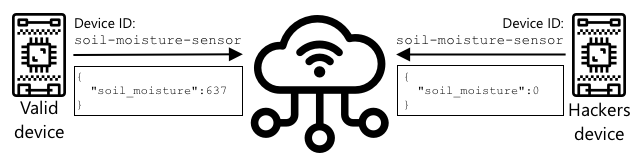
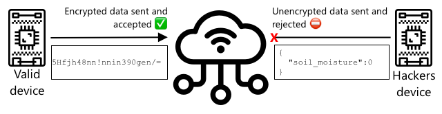
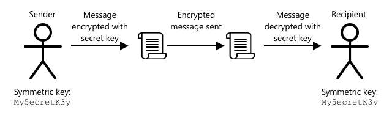
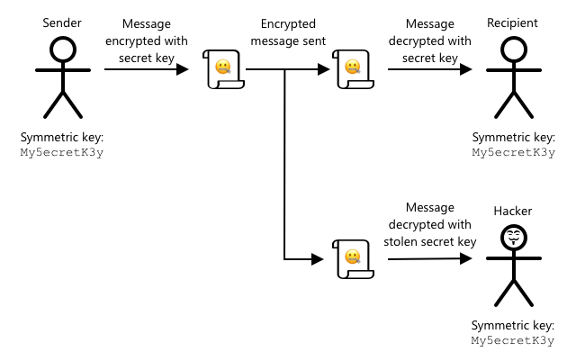
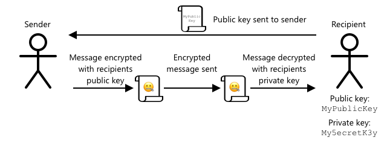
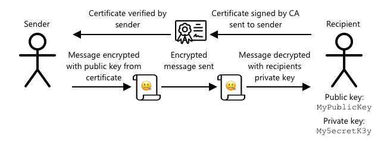

# Keep your plant secure

Add a sketchnote if possible/appropriate


## Pre-lecture quiz

[Pre-lecture quiz](https://brave-island-0b7c7f50f.azurestaticapps.net/quiz/19)

## Introduction

In the last few lessons you've created a soil monitoring IoT device and connected it to the cloud. But what if hackers working for a rival farmer managed to seize control of your IoT devices? What if they sent high soil moisture readings so your plants never got watered, or turned on your watering system to run all the time killing your plants from over-watering and costing you a small fortune in water?

In this lesson you will learn about securing IoT devices. As this is the last lesson for this project, you will also learn how to clean up your cloud resources, reducing any potential costs.

In this lesson we'll cover:

* [Why do you need to secure IoT devices?](#why-do-you-need-to-secure-iot-devices)
* [Cryptography](#cryptography)
* [Secure your IoT devices](#secure-your-iot-devices)
* [Generate and use an X.509 certificate](#generate-and-use-an-x.509-certificates)

> 🗑 This is the last lesson in this project, so after completing this lesson and the assignment, don't forget to clean up your cloud services. You will need the services to complete the assignment, so make sure to complete that first.
>
> Refer to [the clean up your project guide](../../../clean-up.md) if necessary for instructions on how to do this.

## Why do you need to secure IoT devices?

IoT security involves ensuring that only expected devices can connect to your cloud IoT service and send them telemetry, and only your cloud service can send commands to your devices. IoT data can also be personal, including medical or intimate data, so your entire application needs to consider security to stop this data being leaked.

If your IoT application is not secure, there are a number of risks:

* A fake device could send incorrect data, causing your application to respond incorrectly. For example, they could send constant high soil moisture readings, meaning your irrigation system never turns on and your plants die from lack of water
* Unauthorized users could read data from IoT devices including personal or business critical data
* Hackers could send commands to control a device in a way that could cause damage to the device or connected hardware
* By connecting to an IoT device, hackers can use this to access additional networks to get access to private systems
* Malicious users could access personal data and use this for blackmail

These are real world scenarios, and happen all the time. Some examples were given in earlier lessons, but here are some more:

* In 2018, hackers used an open WiFi access point on a fish tank thermostat to gain access to a casino's network to steal data. [The Hacker News - Casino Gets Hacked Through Its Internet-Connected Fish Tank Thermometer](https://thehackernews.com/2018/04/iot-hacking-thermometer.html)
* In 2016, the Mirai Botnet launched a denial of service attack against Dyn, an Internet service provider, taking down large portions of the Internet. This botnet used malware to connect to IoT devices such as DVRs and cameras that used default usernames and passwords, and from there launched the attack. [The Guardian - DDoS attack that disrupted internet was largest of its kind in history, experts say](https://www.theguardian.com/technology/2016/oct/26/ddos-attack-dyn-mirai-botnet)
* Spiral Toys had a database of users of their CloudPets connected toys publicly available over the Internet. [Troy Hunt - Data from connected CloudPets teddy bears leaked and ransomed, exposing kids' voice messages](https://www.troyhunt.com/data-from-connected-cloudpets-teddy-bears-leaked-and-ransomed-exposing-kids-voice-messages/).
* Strava tagged runners that you ran past and showed their routes, allowing strangers to effectively see where you live. [Kim Komndo - Fitness app could lead a stranger right to your home — change this setting](https://www.komando.com/security-privacy/strava-fitness-app-privacy/755349/).

✅ Do some research: Search for more examples IoT Hacks and breaches of IoT data, especially with personal items such as Internet connected toothbrushes or scales. Think about the impact these hacks could have on the victims or customers.

> 💁 Security is a massive topic, and this lesson will only touch on some of the basics around connecting your device to the cloud. Other topics that won't be covered include monitoring for data changes in transit, hacking devices directly, or changes to device configurations. IoT hacking is such a threat, tools like [Azure Defender for IoT](https://azure.microsoft.com/services/azure-defender-for-iot/?WT.mc_id=academic-17441-jabenn) have been developed. These tools are similar to the anti-virus and security tools you might have on your computer, just designed for small, low powered IoT devices.

## Cryptography

When a device connects to an IoT service, it uses an ID to identify itself. The problem is this ID can be cloned - a hacker could set up a malicious device that uses the same ID as a real device but sends bogus data.



***Both valid and malicious devices could use the same ID to send telemetry. Microcontroller by Template / IoT by Adrien Coquet - all from the [Noun Project](https://thenounproject.com)***

The way round this is to convert the data being sent into a scrambled format, using some kind of value to scramble the data known to the device and the cloud only. This process is called *encryption*, and the value used to encrypt the data is called an *encryption key*.



***If encryption is used, then only encrypted messages will be accepted, others will be rejected. Microcontroller by Template / IoT by Adrien Coquet - all from the [Noun Project](https://thenounproject.com)***

The cloud service can then convert the data back to a readable format, using a process called *decryption*, using either the same encryption key, or a *decryption key*. If the encrypted message cannot be decrypted by the key, the device has been hacked and the message is rejected.

The technique for doing encryption and decryption is called *cryptography*.

### Early cryptography

The earliest types of cryptography were substitution ciphers, dating back 3,500 years. Substitution ciphers involve substituting one letter for another. For example, the [Caesar cipher](https://wikipedia.org/wiki/Caesar_cipher) involves shifting the alphabet by a defined amount, with only the sender of the encrypted message, and the intended recipient knowing how many letters to shift.

The [Vigenère cipher](https://wikipedia.org/wiki/Vigenère_cipher) took this further by using words to encrypt text, so that each letter in the original text was shifted by a different amount, rather than always shifting by the same number of letters.

Cryptography was used for a wide range of purposes, such as protecting a potters glaze recipe in ancient Mesopotamia, writing secret love notes in India, or keeping ancient Egyptian magical spells secret.

### Modern cryptography

Modern cryptography is much more advanced, making it harder to crack than early methods. Modern cryptography uses complicated mathematics to encrypt data with far too many possible keys to make brute force attacks possible.

Cryptography is used in a lot of different ways for secure communications. If you are reading this page on GitHub, you may notice the web site address starts with *HTTPS*, meaning that the communication between your browser and the web servers of GitHub is encrypted. If someone was able to read the internet traffic flowing between your browser and GitHub, they wouldn't be able to read the data as it is encrypted. Your computer might even encrypt all the data on your hard drive so if someone steals it, they won't be able to read any of your data without your password.

> 🎓 HTTPS stands for HyperText Transfer Protocol **Secure**

Unfortunately, not everything is secure. Some devices have no security, others are secured using easy to crack keys, or sometimes even all the devices of the same type using the same key. There have been accounts of very personal IoT devices that all have the same password to connect to them over WiFi or Bluetooth. If you can connect to your own device, you can connect to someone else's. Once connected you could access some very private data, or have control over their device.

> 💁 Despite the complexities of modern cryptography and the claims that breaking encryption can take billions of years, the rise of quantum computing has led to the possibility of breaking all know encryption in a very short space of time!

### Symmetric and asymmetric keys

Encryption comes in two types - symmetric and asymmetric.

**Symmetric** encryption uses the same key to encrypt and decrypt the data. Both the sender and receiver need to know the same key. This is the least secure type, as the key needs to be shared somehow. For a sender to send an encrypted message to a recipient, the sender first might have to send the recipient the key.



If the key gets stolen in transit, or the sender or recipient get hacked and the key is found, the encryption can be cracked.



**Asymmetric** encryption uses 2 keys - an encryption key and a decryption key, referred to as a public/private key pair. The public key is used to encrypt the message, but cannot be used to decrypt it, the private key is used to decrypt the message but cannot be used to encrypt it.



The recipient shares their public key, and the sender uses this to encrypt the message. Once the message is sent, the recipient decrypts it with their private key. Asymmetric encryption is more secure as the private key is kept private by the recipient and never shared. Anyone can have the public key as it can only be used to encrypt messages.

Symmetric encryption is faster than asymmetric encryption, asymmetric is more secure. Some systems will use both - using asymmetric encryption to encrypt and share the symmetric key, then using the symmetric key to encrypt all data. This makes it more secure to share the symmetric key between sender and recipient, and faster when encrypting and decrypting data.

## Secure your IoT devices

IoT devices can be secured using symmetric or asymmetric encryption. Symmetric is easier, but less secure.

### Symmetric keys

When you set up your IoT device to interact with IoT Hub, you used a connection string. An example connection string is:

```output
HostName=soil-moisture-sensor.azure-devices.net;DeviceId=soil-moisture-sensor;SharedAccessKey=Bhry+ind7kKEIDxubK61RiEHHRTrPl7HUow8cEm/mU0=
```

This connection string is made of three parts separated by semi-colons, with each part a key and a value:

| Key | Value | Description |
| --- | ----- | ----------- |
| HostName | `soil-moisture-sensor.azure-devices.net` | The URL of the IoT Hub |
| DeviceId | `soil-moisture-sensor` | The unique ID of the device |
| SharedAccessKey | `Bhry+ind7kKEIDxubK61RiEHHRTrPl7HUow8cEm/mU0=` | A symmetric key known by the device and the IoT Hub |

The last part of this connection string, the `SharedAccessKey`, is the symmetric key known by both the device and the IoT Hub. This key is never sent from the device to the cloud, or the cloud to the device. Instead it is used to encrypt data that is sent or received.

✅ Do an experiment. What do you think will happen if you change the `SharedAccessKey` part of the connection string when connecting your IoT device? Try it out.

When the device first tries to connect it sends a shared access signature (SAS) token consisting of the URL of the IoT Hub, a timestamp that the access signature will expire (usually 1 day from the current time), and a signature. This signature consists of the URL and the expiry time encrypted with the shared access key from the connection string.

The IoT Hub decrypts this signature with the shared access key, and if the decrypted value matches the URL and expiry, the device is allowed to connect. It also verifies that the current time is before the expiry, to stop a malicious device capturing the SAS token of a real device and using it.

This is an elegant way to verify that the sender is the correct device. By sending some known data in both a decrypted and encrypted form, the server can verify the device by ensuring when it decrypts the encrypted data, the result matches the decrypted version that was sent. If it matches, then both the sender and recipient have the same symmetric encryption key.

> 💁 Because of the expiry time, your IoT device needs to know the accurate time, usually read from an [NTP](https://wikipedia.org/wiki/Network_Time_Protocol) server. If the time is not accurate, the connection will fail.

After the connection, all data sent to the IoT Hub from the device, or to the device from the IoT Hub will be encrypted with the shared access key.

✅ What do you think will happen if multiple devices share the same connection string?

> 💁 It is bad security practice to store this key in code. If a hacker gets your source code, they can get your key. It is also harder when releasing code as you would need to recompile with an updated key for every device. It is better to load this key from a hardware security module - a chip on the IoT device that stores encrypted values that can be read by your code.
>
> When learning IoT it is often easier to put the key in code, as you did in an earlier lesson, but you must ensure this key is not checked into public source code control.

### X.509 certificates

When you are using asymmetric encryption with a public/private key pair, you need to provide your public key to anyone who wants to send you data. The problem is, how can the recipient of your key be sure it's actually your public key, not someone else pretending to be you? Instead of providing a key, you can instead provide your public key inside a certificate that has been verified by a trusted third party, called an X.509 certificate.

X.509 certificates are digital documents that contain the public key part of the public/private key pair. They are usually issued by one of a number of trusted organizations called [Certification authorities](https://wikipedia.org/wiki/Certificate_authority) (CAs), and digitally signed by the CA to indicate the key is valid and comes from you. You trust the certificate and that the public key is from who the certificate says it is from, because you trust the CA, similar to how you would trust a passport or driving license because you trust the country issuing it. Certificates cost money, so you can also 'self-sign', that is create a certificate yourself that is signed by you, for testing purposes.

> 💁 You should never use a self-signed certificate for a production release.

These certificates have a number of fields in them, including who the public key is from, the details of the CA who issued it, how long it is valid for, and the public key itself. Before using a certificate, it is good practice to verify it by checking that is was signed by the original CA.

✅ You can read a full list of the fields in the certificate in the [Microsoft Understanding X.509 Public Key Certificates tutorial](https://docs.microsoft.com/azure/iot-hub/tutorial-x509-certificates?WT.mc_id=academic-17441-jabenn#certificate-fields)

When using X.509 certificates, both the sender and the recipient will have their own public and private keys, as well as both having X.509 certificates that contain the public key. They then exchange X.509 certificates somehow, using each others public keys to encrypt the data they send, and their own private key to decrypt the data they receive.



***Instead of sharing a public key, you can share a certificate. The user of the certificate can verify that it comes from you by checking with the certificate authority who signed it. Certificate by alimasykurm from the [Noun Project](https://thenounproject.com)***

One big advantage of using X.509 certificates is that they can be shared between devices. You can create one certificate, upload it to IoT Hub, and use this for all your devices. Each device then just needs to know the private key to decrypt the messages it receives from IoT Hub.

The certificate used by your device to encrypt messages it sends to the IoT Hub is published by Microsoft. It is the same certificate that a lot of Azure services use, and is sometimes built into the SDKs

> 💁 Remember, a public key is just that - public. The Azure public key can only be used to encrypt data sent to Azure, not to decrypt it, so it can be shared everywhere, including in source code. For example, you can see it in the [Azure IoT C SDK source code](https://github.com/Azure/azure-iot-sdk-c/blob/master/certs/certs.c).

✅ There is a lot of jargon with X.509 certificates. You can read the definitions of some of the terms you might come across in [The layman’s guide to X.509 certificate jargon](https://techcommunity.microsoft.com/t5/internet-of-things/the-layman-s-guide-to-x-509-certificate-jargon/ba-p/2203540?WT.mc_id=academic-17441-jabenn)

## Generate and use an X.509 certificate

The steps to generate an X.509 certificate are:

1. Create a public/private key pair. One of the most widely used algorithm to generate a public/private key pair is called [Rivest–Shamir–Adleman](https://wikipedia.org/wiki/RSA_(cryptosystem))(RSA).

1. Submit the public key with associated data for signing, either by a CA, or by self-signing

The Azure CLI has commands to create a new device identity in IoT Hub, and automatically generate the public/private key pair and create a self-signed certificate.

> 💁 If you want to see the steps in detail, rather than using the Azure CLI, you can find it in the [Using OpenSSL to create self-signed certificates tutorial in the Microsoft IoT Hub documentation](https://docs.microsoft.com/azure/iot-hub/tutorial-x509-self-sign?WT.mc_id=academic-17441-jabenn)

### Task - create a device identity using an X.509 certificate

1. Run the following command to register the new device identity, automatically generating the keys and certificates:

    ```sh
    az iot hub device-identity create --device-id soil-moisture-sensor-x509 \
                                      --am x509_thumbprint \
                                      --output-dir . \
                                      --hub-name <hub_name>
    ```

    Replace `<hub_name>` with the name you used for your IoT Hub.

    This will create a device with an ID of `soil-moisture-sensor-x509` to distinguish from the device identity you created in the last lesson. This command will also create 2 files in the current directory:

    * `soil-moisture-sensor-x509-key.pem` - this file contains the private key for the device.
    * `soil-moisture-sensor-x509-cert.pem` - this is the X.509 certificate file for the device.

    Keep these files safe! The private key file should not be checked into public source code control.

### Task - use the X.509 certificate in your device code

Work through the relevant guide to connect your IoT device to the cloud using the X.509 certificate:

* [Arduino - Wio Terminal](wio-terminal-x509.md)
* [Single-board computer - Raspberry Pi/Virtual IoT device](single-board-computer-x509.md)

---

## 🚀 Challenge

There are multiple ways to create, manage and delete Azure services such as Resource Groups and IoT Hubs. One way is the [Azure Portal](https://portal.azure.com?WT.mc_id=academic-17441-jabenn) - a web-based interface that gives you a GUI to manage your Azure services.

Head to [portal.azure.com](https://portal.azure.com?WT.mc_id=academic-17441-jabenn) and investigate the portal. See if you can create an IoT Hub using the portal, then delete it.

**Hint** - when creating services through the portal, you don't need to create a Resource Group up front, one can be created when you are creating the service. Make sure you delete it when you are finished!

You can find plenty of documentation, tutorials and guides on the Azure Portal in the [Azure portal documentation](https://docs.microsoft.com/azure/azure-portal/?WT.mc_id=academic-17441-jabenn).

## Post-lecture quiz

[Post-lecture quiz](https://brave-island-0b7c7f50f.azurestaticapps.net/quiz/20)

## Review & Self Study

* Read up on the history of cryptography on the [History of cryptography page on Wikipedia](https://wikipedia.org/wiki/History_of_cryptography).
* Read up on X.509 certificates on the [X.509 page on Wikipedia](https://wikipedia.org/wiki/X.509).

## Assignment

[Build a new IoT device](assignment.md)
