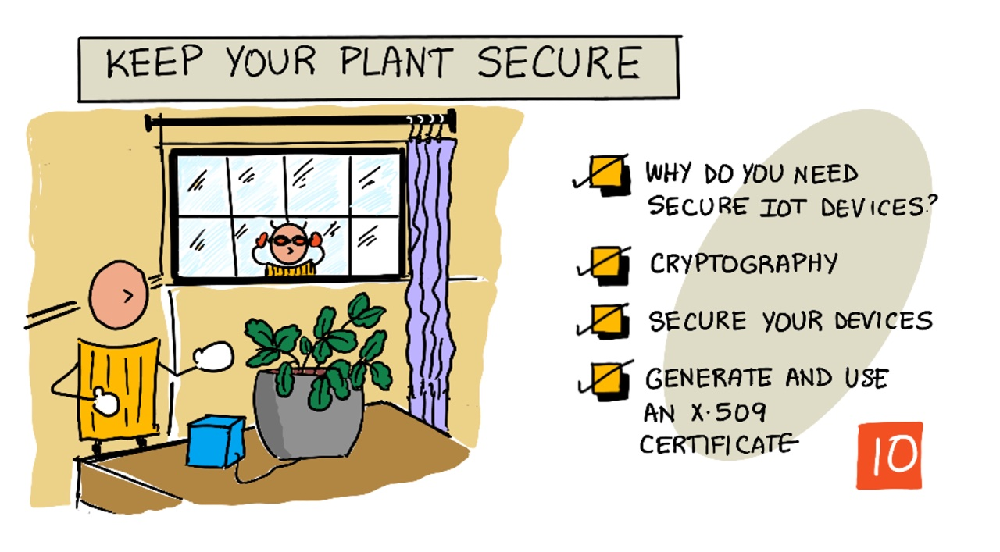

# উদ্ভিদের নিরাপত্তা নিশ্চিতকরণ



> স্কেচনোটটি তৈরী করেছেন [Nitya Narasimhan](https://github.com/nitya). বড় সংস্করণে দেখার জন্য ছবিটিতে ক্লিক করতে হবে।

## লেকচার-পূর্ববর্তী কুইজ

[লেকচার-পূর্ববর্তী কুইজ](https://thankful-pond-0eba8f10f.1.azurestaticapps.net/quiz/19)

## সূচনা


গত কয়েকটি পাঠে আমরা মাটি পর্যবেক্ষণের জন্য একটি আইওটি ডিভাইস তৈরি করেছি এবং এটিকে ক্লাউডের সাথে সংযুক্ত করেছি। তবে যদি হ্যাকাররা আমাদের আইওটি ডিভাইসগুলির নিয়ন্ত্রণ দখল করতে সক্ষম হয় তবে কী হবে? কী হবে যদি তারা মাটির আর্দ্রতার  সঠিক মান পরিবর্তন করে, উচ্চমান পাঠায় - যাতে আমাদের গাছপালা কখনই সেচ না পায় অথবা আমাদের সেচব্যবস্থা সবসময় চালু রেখে যদি আমাদের গাছগুলিকে বেশি পানিতে ডুবিয়ে রাখে ?

এই পাঠে আমরা আইওটি ডিভাইসগুলি নিরাপত্তার বিষয়ে শিখব। যেহেতু এটি এই প্রকল্পের শেষ পাঠ, আমরা আমাদের ক্লাউড সার্ভিসগুলি কীভাবে গুছিয়ে রাখতে পারি যাতে ব্যয় হ্রাস হয় - তা শিখব।

এই পাঠে আমরা দেখবো:

* [কেন আমাদের আইওটি ডিভাইসগুলি সুরক্ষিত করা দরকার?](#কেন-আমাদের-আইওটি-ডিভাইসগুলি-সুরক্ষিত-করা-দরকার)
* [সংকেতলিপি (Cryptography)](#সংকেতলিপি)
* [আমাদের আইওটি ডিভাইস নিরাপদ রাখা](#আইওটি-ডিভাইস-নিরাপত্তা)
* [X.509 Certificate তৈরী ও ব্যবহার](#X.509-Certificate-তৈরী-ও-ব্যবহার)

> 🗑 এটি এই প্রজেক্টের শেষ লেসন, সুতরাং এই পাঠ এবং এর অ্যাসাইনমেন্ট শেষ করার পরে, আমাদের ক্লাউড ্সার্ভিসগুলি আমাদেরকে অবশ্যই গুছিয়ে রেখে দিতে হবে বা clean up করতে হবে। অ্যাসাইনমেন্টটি সম্পন্ন করার জন্য আমাদের যেসব সার্ভিসগুলির প্রয়োজন হবে, সেগুলো আগে নিশ্চিত করতে হবে।

> এক্ষেত্রে [প্রজেক্ট ক্লীন-আপ গাইডে](../../../../../translations/clean-up.bn.md) নির্দেশনা পাওয়া যাবে যাতে আমরা ক্লাউড সার্ভিস গুছিয়ে রাখতে পারি।

## কেন আমাদের আইওটি ডিভাইসগুলি সুরক্ষিত করা দরকার?

আইওটি সুরক্ষার মধ্যে এটি নিশ্চিত করা হয় যে কেবলমাত্র নির্দিষ্ট কিছু ডিভাইসই আমাদের ক্লাউড আইওটি ্সার্ভিসতে সংযোগ করতে পারে এবং তাদের টেলিমেট্রি পাঠাতে পারে। এটিও নিশ্চিত করা হয় যেন কেবল আমাদের ক্লাউড সার্ভিসই আমাদের ডিভাইসে নির্দেশ পাঠাতে পারে। আইওটি ডেটা চিকিত্সা বা বেশ অন্তরঙ্গ ডেটা সহ ব্যক্তিগতও হতে পারে, তাই এই তথ্য ফাঁস হওয়া বন্ধ করতে আমাদের পুরো ব্যবস্থাপনার  সুরক্ষা বিবেচনা করা উচিত।

যদি আমাদের আইওটি অ্যাপ্লিকেশনটি সুরক্ষিত না হয় তবে বিভিন্ন ঝুঁকি রয়েছে:

* একটি নকল ডিভাইস আমাদের অ্যাপ্লিকেশনটিকে ভুলভাবে প্রতিক্রিয়া দিতে পারে। উদাহরণস্বরূপ, মাটির আর্দ্রতার সঠিক মান পরিবর্তন করে, উচ্চমান পাঠালে আমাদের সেচ ব্যবস্থা কখনই চালু হবেনা এবং আমাদের গাছপালা পানির অভাবে মারা যাবে।

* অননুমোদিত ব্যবহারকারীরা ব্যক্তিগত বা ব্যবসায়িক গুরুত্বপূর্ণ ডেটা পড়তে পারবে।

* হ্যাকাররা কোন ডিভাইসে এমনভাবে কমান্ডগুলি প্রেরণ করতে পারে যাতে ডিভাইসটি বা এর সাথে হার্ডওয়ার এর ক্ষতি করতে পারে।

* আইওটি ডিভাইসের সাথে সংযোগ স্থাপনের মাধ্যমে, হ্যাকাররা এটি অতিরিক্ত নেটওয়ার্কগুলিতে প্রবেশের অনুমতি পেয়ে যেতে পারে।

* ক্ষতিকারক ব্যবহারকারীরা ব্যক্তিগত ডেটা অ্যাক্সেস করতে এবং এটি ব্ল্যাকমেইলের জন্য ব্যবহার করতে পারে

এগুলি বাস্তব পরিস্থিতি এবং সর্বদাই ঘটে।  পূর্ববর্তী পাঠগুলিতে কিছু উদাহরণ দেওয়া হয়েছিল, এখানে আরও কিছু রয়েছে:

* 2018 সালে, হ্যাকাররা ডেটা চুরির জন্য ক্যাসিনোর নেটওয়ার্কে অ্যাক্সেস পেতে একটি ফিশ ট্যাঙ্ক থার্মোস্টেটে একটি ওপেন ওয়াইফাই অ্যাক্সেস পয়েন্ট ব্যবহার করেছিল। [সূত্রঃ The Hacker News - Casino Gets Hacked Through Its Internet-Connected Fish Tank Thermometer](https://thehackernews.com/2018/04/iot-hacking-thermometer.html)
* ২০১৬ সালে মিরাই বটনেট denial of service (Dos) এর মাধ্যমে Dyn নামক একটি ইন্টারনেট সার্ভিস প্রদানকারী সরবরাহকারীর বিরুদ্ধে আক্রমণ করে। এই বটনেট সাধারণ আইওটি ডিভাইস যেমন ডিভিআর এবং ক্যামেরাগুলিতে ডিফল্ট ব্যবহারকারীর নাম এবং পাসওয়ার্ড ব্যবহার করে এবং সেখান থেকে আক্রমণ চালিয়েছিল connect [সূত্রঃ The Guardian - DDoS attack that disrupted internet was largest of its kind in history, experts say](https://www.theguardian.com/technology/2016/oct/26/ddos-attack-dyn-mirai-botnet)
* Spiral Toys এর কাছে ইন্টারনেটে সকলের জন্য এভেইলেবল ডেটাবেস ছিলো যেটিতে তাদের ক্লাউডপেটস সংযুক্ত খেলনাগুলির ব্যবহারকারীর তথ্য ছিলো । [সূত্রঃ Troy Hunt - Data from connected CloudPets teddy bears leaked and ransomed, exposing kids' voice messages](https://www.troyhunt.com/data-from-connected-cloudpets-teddy-bears-leaked-and-ransomed-exposing-kids-voice-messages/).
* Strava তে একজন এথলিট আরেকজনকে পাশাপাশি অতিক্রম করে গেলে, একে অপরের রূট সহ অনেক ব্যক্তিগত তথ্য ফাঁস করে দেয়  [সূত্রঃ Kim Komndo - Fitness app could lead a stranger right to our home — change this setting](https://www.komando.com/security-privacy/strava-fitness-app-privacy/755349/).

✅ কিছু গবেষণা করা যাক: আরও উদাহরণের জন্য অনুসন্ধান করি আইওটি হ্যাকস এবং আইওটি ডেটা লঙ্ঘনের ঘটনাগুলি, বিশেষত ব্যক্তিগত বিষয়াদি যেমন ইন্টারনেট সংযুক্ত টুথব্রাশ বা স্কেল ব্যবহার করে হ্যাক। এই হ্যাকগুলি ভুক্তভোগী বা গ্রাহকদের উপর কী প্রভাব ফেলতে পারে সে সম্পর্কে চিন্তা করি।

> 💁 নিরাপত্তা একটি বিশাল বিষয় এবং এই পাঠটি কেবলমাত্র আমাদের ডিভাইসটিকে ক্লাউডের সাথে সংযুক্ত করার জন্য কয়েকটি প্রাথমিক বিষয় শেখাবে। অন্যান্য বিষয় যা আলোচনা করা হবে না তার মধ্যে রয়েছে ট্রানজিটে ডেটা পরিবর্তনের জন্য নজরদারি, সরাসরি ডিভাইস হ্যাকিং, বা ডিভাইস কনফিগারেশনে পরিবর্তন ইত্যাদি । IoT হ্যাকিং এর মত সমস্যা মোকাবেলা করতে [Azure Defender for IoT](https://azure.microsoft.com/services/azure-defender-for-iot/?WT.mc_id=academic-17441-jabenn) তৈরী করা হয়েছে। এটি আমাদের কম্পিউটারে ব্যবহৃত এন্টিভাইরাসেরই মতো, যা ছোট এবং কম পাওয়ারে চলমান আইওটি  ডিভাইসের জন্য বানানো।

## সংকেতলিপি

যখন কোন ডিভাইস আইওটি পরিষেবাতে সংযুক্ত থাকে, তখন এটি নিজেকে সনাক্ত করতে একটি আইডি ব্যবহার করে। সমস্যা হল এই আইডিটি ক্লোন করা যায় - হ্যাকার একটি নকল ডিভাইস সেট আপ করতে পারে যা একই আইডিটিকে আসল ডিভাইস হিসাবে ব্যবহার করে তবে ভুল ডেটা প্রেরণ করে।


এই সমস্যার সমাধানের জন্য কেবলমাত্র ডিভাইস এবং ক্লাউডের পরিচিত কিছু ভ্যালু বা গোপন সংকেত দ্বারা ডেটা আদান প্রদানের সময় তা অগোছালো করে একধরণের গোপন সংকেত-নির্ভর করে দেয়া। এই প্রক্রিয়াকে বলে *encryption* এবং যে ভ্যালু বা গোপন সংকেত দ্বারা ডেটাকে পরিবর্তিত করা হয়, তাকে বলে *encryption key* ।


যে ক্লাউড পরিষেবাটি একটি প্রক্রিয়া ব্যবহার করে ডেটাটিকে একটি পঠনযোগ্য ফর্ম্যাটে রূপান্তর করতে পারে সেই প্রক্রিয়াকে বলে *decryption (ডিক্রিপশন)* এবং এই কাজে একই এনক্রিপশন কী বা একটি *ডিক্রিপশন কী* ব্যবহার করা হয়। যদি এনক্রিপ্ট করা বার্তা কী দ্বারা ডিক্রিপ্ট করা না যায়, সেক্ষেত্রে ধরে নেয়া হয় যে ডিভাইসটি হ্যাক হয়ে গেছে এবং বার্তাটি তখন প্রত্যাখ্যান করা হয়।

এনক্রিপশন এবং ডিক্রিপশনের টেকনিককে একসাথে বলা হয় - *সংকেতলিপি (Cryptography)*  ।

### আদিপর্যায়ের সংকেতলিপি 

সবথেকে আদিযুগের সংকেতলিপি (Cryptography) ছিলো সাইফার প্রতিস্থাপন যা প্রায় ৩৫০০ বছর আগে ব্যবহার করা হতো। এগুলোতে একটি বর্ণের পরিবর্তে আরেকটি বসানো হত। উদাহরণস্বরূপ, [সিজার  সাইফারে](https://wikipedia.org/wiki/Caesar_cipher) বর্ণগুলো সামনে বা পেছনে নির্দিষ্ট সংখ্যক ঘর অবস্থান পরিবর্তন করা  হতো যে পরিবর্তনের মান কেবল প্রেরক ও গ্রাহক জানতো।

আবার [Vigenère cipher](https://wikipedia.org/wiki/Vigenère_cipher) এর ক্ষেত্রে বর্ণগুলো ভিন্ন ভিন্ন ঘর পর্যন্ত মান পরিবর্তন করতো যা সাইফার টেক্সট থেকেও কঠিন হয়ে যায়।

ক্রিপ্টোগ্রাফি বিভিন্ন উদ্দেশ্যে যেমন প্রাচীন মেসোপটেমিয়ায় একটি কুমার গ্লাইজ রেসিপি রক্ষা করা বা ভারতে প্রেমের গোপন চিঠি লেখার জন্য বা প্রাচীন মিশরীয় যাদুকরী মন্ত্রকে গোপন রাখার মতো কাজে ব্যবহার করা হয়েছিল।

### আধুনিক সংকেতলিপি (Cryptography)

আধুনিক ক্রিপ্টোগ্রাফি অনেক বেশি উন্নত, এটি প্রাথমিক পদ্ধতির চেয়ে ক্র্যাক করা আরও অনেক কঠিন করে তোলে। আধুনিক ক্রিপ্টোগ্রাফি ব্রুট ফোর্স আক্রমণকে অকার্যকর করার জন্য অনেকগুলি সম্ভাব্য কী(key) দিয়ে ডেটা এনক্রিপ্ট করতে জটিল গণিত ব্যবহার করে।

সুরক্ষিত যোগাযোগের জন্য এটি বিভিন্ন উপায়ে ব্যবহার করা হয়। যদি আমরা এই লেসনটি যদি গিটহাব এ পড়ি, তবে আমরা লক্ষ্য করতে পারি যে ওয়েব সাইটের ঠিকানাটি *https* দিয়ে শুরু হয়, যার অর্থ আমাদের ব্রাউজার এবং গিটহাবের ওয়েব সার্ভারের মধ্যে যোগাযোগ এনক্রিপ্ট করা আছে। যদি কেউ আমাদের ব্রাউজার এবং গিটহাবের মধ্যে প্রবাহিত ইন্টারনেট ট্র্যাফিক পড়তে সক্ষম হয়ও তবুও তারা এনক্রিপ্ট করা  ডেটা পড়তে সক্ষম হবে না। আমাদের কম্পিউটার এমনকি আমাদের হার্ডড্রাইভে সমস্ত ডেটা এনক্রিপ্ট করতে পারে যাতে কেউ যদি এটি চুরি করে, তবুও যেন তারা আমাদের পাসওয়ার্ড ছাড়াই আমাদের ডেটা পড়তে না পারে।

> 🎓 HTTPS হলো HyperText Transfer Protocol **Secure**

দুর্ভাগ্যক্রমে, সবকিছুই নিরাপদ নয়। কিছু ডিভাইসের কোন সুরক্ষা নেই, অন্যকিছু ডিভাইসে আবার সহজেই ক্র্যাক করা যায় এমন কী(KEY) গুলি ব্যবহার করে বা কখনও কখনও একই কী(KEY) ব্যবহার করে একই ধরণের সমস্ত ডিভাইসে। খুব ব্যক্তিগত আইওটি ডিভাইসগুলির জন্য অ্যাকাউন্ট রয়েছে যেগুলির সাথে ওয়াইফাই বা ব্লুটুথের মাধ্যমে সংযোগ করার জন্য পাসওয়ার্ড রয়েছে। আমরা যদি আমাদের নিজস্ব ডিভাইসে সংযোগ করতে পারি তবে কিন্তু আমরা চাইলে অন্য কারও ডিভাইসেও সংযোগ করতে পারি (অনুমতি ব্যাতিরেকে এটি করা অপরাধ)। একবার সংযুক্ত হয়ে আমরা কিছু খুব প্রাইভেট ডেটা অ্যাক্সেস করতে পারি, বা তাদের ডিভাইসে নিয়ন্ত্রণ রাখতে পারি।

> 💁 আধুনিক সংকেতলিপি (Cryptography) এর জটিলতা এবং এনক্রিপশন ভাঙতে বিলিয়ন বিলিয়ন বছর লাগবে - এমন দাবি স্বত্বেও কোয়ান্টাম কম্পিউটিং এর আবির্ভাবের ফলে এই এনক্রিপশন কী (KEY) গুলো ভেঙে ফেলা অনেক সহজ হয়ে গিয়েছে।

### Symmetric এবং asymmetric keys

এনক্রিপশন ২ভাবে হয় - symmetric এবং asymmetric.

**Symmetric** এনক্রিপশন ডেটা এনক্রিপ্ট এবং ডিক্রিপ্ট করতে একই কী ব্যবহার করে। প্রেরক এবং প্রাপক উভয়েরই একই কী (KEY)টি জানা দরকার। এটি সর্বনিম্ন সুরক্ষা স্তর, কারণ কী (KEY)টি শেয়ার করতে হবে। প্রেরকের দ্বারা প্রাপকের কাছে একটি এনক্রিপ্ট করা বার্তা প্রেরণের জন্য, প্রেরককে প্রথমে প্রাপককে কী (KEY) টি পাঠাতে হবে।


If the key gets stolen in transit, or the sender or recipient get hacked and the key is found, the encryption can be cracked.

যদি ট্রানজিটে কী (KEY) টি চুরি হয়ে যায়, বা প্রেরক বা প্রাপক হ্যাক হয়ে যায় এবং কী(KEY)টি পাওয়া যায়, তাহলে এনক্রিপশনটি ক্র্যাক হয়ে যাবে।


**Asymmetric** এনক্রিপশনটিতে 2টি KEY ব্যবহৃত হয় - একটি এনক্রিপশন কী এবং একটি ডিক্রিপশন কী, এটি পাবলিক/প্রাইভেট KEY Pair হিসাবে উল্লেখ করা হয়। বার্তাটি এনক্রিপ্ট করার জন্য সর্বজনীন (PUBLIC) কী ব্যবহৃত হয় তবে এটি ডিক্রিপ্ট করতে তা ব্যবহার করা যায় না। ব্যক্তিগত (PRIVATE) KEY এখানে বার্তাটি ডিক্রিপ্ট করার জন্য ব্যবহৃত হয় তবে এটি আবার এনক্রিপ্ট করার জন্য ব্যবহার করা যায় না।


প্রাপক তার পাবলিক KEY শেয়ার করে এবং প্রেরক এটি ব্যবহার করে বার্তা এনক্রিপ্ট করে। ম্যাসেজ পাঠানোর পরে,প্রাপক তার প্রাইভেট কী দ্বারা তা ডিক্রিপ্ট করে। এসিমেট্রিক এনক্রিপশন তুলনামূলকভাবে বেশি নিরাপদ কারণ এখানে প্রাপকের প্রাইভেট কী কখনই শেয়ার করা হয়না। পাবলিক কী তে যে কেউই একসেস পেতে পারে, তবে এটি দিয়ে কেবলমাত্র এনক্রিপ্ট করা যাবে। 

সিমেট্রিক পদ্ধতিটি এসিমেট্রিক এর তুলনায় দ্রুত কাজ করতে পারে, যদিও তা কম নিরাপদ। কিছু ক্ষেত্রে উভয় পদ্ধতিই ব্যবহৃত হয়। এসিমেট্রিক পদ্ধতিতে এনক্রিপ্ট করা, আবার সিমেট্রিক কী টি শেয়ার করে সকল ডেটা সিমেট্রিক কী দ্বারা এনক্রিপ্ট করা হয়। এতে করে প্রেরক ও প্রাপকের মধ্যে সিমেট্রিক কী শেয়ার করলেও সেটা অনেক বেশি নিরাপদ থাকে আবার দ্রুতও হয়।

## আইওটি ডিভাইস নিরাপত্তা

আইওটি ডিভাইসের নিরাপত্তার জন্য সিমেট্রিক এবং এসিমেট্রিক পদ্ধতি ব্যবহার করা যায়। সিমেট্রিকটি সহজ, তবে কম নিরাপদ।

### সিমেট্রিক KEYs

আইওটি হাবের সাথে আমাদের ডিভাইসের যোগাযোগ এর জন্য আমরা কানেকশন স্ট্রিং ব্যবহার করেছিলাম। উদাহরণস্বরূপ :

```output
HostName=soil-moisture-sensor.azure-devices.net;DeviceId=soil-moisture-sensor;SharedAccessKey=Bhry+ind7kKEIDxubK61RiEHHRTrPl7HUow8cEm/mU0=
```

এই কানেকশন স্ট্রিং ৩ভাগে বিভক্ত যার প্রতিটি অংশ সেমিকোলন দ্বারা পৃথকীকৃত, যেখানে প্রতি অংশে Key এবং Value রয়েছে।

| কী | ভ্যালু | বর্ণনা |
| --- | ----- | ----------- |
| Hostname | `soil-moisture-sensor.azure-devices.net` | এটি আইওটি হাবের URL |
| DeviceID | `soil-moisture-sensor` | এটি ডিভাইসের ইউনিক আইডি |
| SharedAccessKey | `Bhry+ind7kKEIDxubK61RiEHHRTrPl7HUow8cEm/mU0=` | ডিভাইস এবং আইওটি হাবের কাছে থাকা সিমেট্রিক KEY |

কানেকশন স্ট্রিং এর শেষাংশ `SharedAccessKey` মূলত একটি symmetric key যা ডিভাইস এবং আইওটি হাব উভয়ের কাছেই রয়েছে। এটি কখনই ডিভাইস থেকে ক্লাউডে বা ক্লাউড থেকে ডিভাইসে প্রেরণ করা হয়না। বরং এটি পরিবাহিত ডেটাকে এনক্রিপ্ট করে।

✅ একটি এক্সপেরিমেন্ট করা যাক। আমরা আইওটি ডিভাইসে সংযুক্ত হবার সময় কানেকশন স্ট্রিং এর `SharedAccessKey` পরিবর্তন করে দিলে কী হবে? চেষ্টা করে দেখো।


ডিভাইসটি প্রথমে আইওটি হাবের সাথে সংযোগ দেওয়ার চেষ্টা করলে, তখন URL সহ shared access signature (SAS) টোকেন , একটি  টাইমস্ট্যাম্প যেটির সিগনেচার একসেস একটি  নির্দিষ্ট সময় পর (সাধারণত বর্তমান সময় থেকে 1 দিন পর্যন্ত)  শেষ হয়ে যায় এবং একটি সিগনেচার - এসব প্রেরণ করে। এই সিগনেচারে কানেকশন স্ট্রিং থেকে ইউআরএল, মেয়াদোত্তীর্ণের সময় এবং এনক্রিপটেড শেয়ারড একসেস কী থাকে।

আইওটি হাব শেয়ারড একসেস কী দিয়ে সিগনেচারটি ডিক্রিপ্ট করে এবং যদি ডিক্রিপ্ট করা মানটি ইউআরএল এবং মেয়াদোত্তীর্ণের সময়ের সাথে মিলে যায় তবে ডিভাইসটি সংযোগ করার অনুমতি পায়। এটিও যাচাই করা হয় যে বর্তমান সময়টি মেয়াদোত্তীর্ণের সময়ের আগে যাতে করে কোন দুষ্ট (malicious) ডিভাইস কোন আসল ডিভাইসের এসএএস টোকেন ক্যাপচার করে তা  ব্যবহার করতে না পারে।

প্রেরকটি সঠিক ডিভাইস কিনা তা যাচাই করার জন্য এটি একটি উত্তম উপায়। ডিক্রিপ্ট এবং এনক্রিপ্ট করা কিছু জ্ঞাত ডেটা প্রেরণ করে সার্ভার ডিভাইসটিকে যাচাই করে দেখতে পারে যে এনক্রিপ্ট করা ডেটার ডিক্রিপ্ট ভার্সনটি, প্রেরণ করা ডিক্রিপ্ট করা সংস্করণের সাথে মেলে কিনা। যদি এটি মেলে, তবে প্রেরক এবং প্রাপক উভয়েরই একই Symmetric Encryption Key রয়েছে।

> 💁 যেহেতু এখানে মেয়াদোত্তীর্ণের একটি বিষয় রয়েছে, আমাদের আইওটি ডিভাইসের জন্য তাই বর্তমান সময়টি জানা জরুরী। সাধারণত [NTP](https://wikipedia.org/wiki/Network_Time_Protocol) সার্ভার  থেকেই এটি সময় সংক্রান্ত ডেটা নেয়। সময় সঠিক  না হলে, কানেকশন হবেনা।

সংযোগের পরে, ডিভাইস থেকে আইওটি হাবের কাছে বা আইওটি হাব থেকে ডিভাইসে প্রেরিত সমস্ত ডেটা shared access key দিয়ে এনক্রিপ্ট করা হবে।

✅ একাধিক ডিভাইস একই সংযোগের স্ট্রিং শেয়ার করলে কী ঘটবে বলে মনে হয়?

> 💁 কোডের মধ্যেই এই KEY সংরক্ষণ করা নিরাপত্তার প্রেক্ষিতে  বেশ বাজে একটি চর্চা। কোন হ্যাকার যদি আমাদের সোর্স কোড পায় তবে তারা আমাদের KEY পেয়ে যেতে পারে। এছাড়াও কোড রিলিজ করার সময় এটি আরও কঠিন হয় কারণ আমাদের প্রতিটি ডিভাইসের জন্য একটি আপডেট কী দিয়ে পুনরায় ্তা পরিবর্তন করতে হবে। একটি হার্ডওয়্যার সুরক্ষা মডিউল থেকে এই KEY লোড করা ভাল উপায়। এই মডিউল হলো আইওটি ডিভাইসের একটি চিপ যা এনক্রিপ্ট করা মানগুলিকে স্টোর করে যা আমাদের কোড দ্বারা  একসেস করা যাবে। 
>
> আইওটি শেখার সময় KEY গুলো কোডে রাখলে কাজ করা সহজ হয়, যেমন আমরা পূর্ববর্তী পাঠে করেছিলাম। তবে আমাদের অবশ্যই নিশ্চিত করতে হবে যে এই KEY জনসাধারণের জন্য সোর্স কোডে উন্মুক্ত করা হয়নি।

Devices have 2 keys, and 2 corresponding connection strings. This allows we to rotate the keys - that is switch from one key to another if the first gets compromised, and re-generate the first key.

ডিভাইসগুলিতে 2 টি কী এবং 2 টি কানেকশন স্ট্রিং রয়েছে। এটি আমাদের কীগুলির মধ্যে পরিবর্তনের অনুমতি দেয় । যদি প্রথম কী টি সমস্যার মুখে পড়ে, তবে ২য়টি ব্যবহার করা এবং প্রথম কী পুনরায় তৈরী করে।

### X.509 সার্টিফিকেট

যখন আমরা কোনও পাবলিক/প্রাইভেট কী পেয়ার এর সাথে এসিমেট্রিক এনক্রিপশন ব্যবহার করি, আমাদেরকে কেউ ডেটা প্রেরণ করতে চাইলে  তাকে আমাদের পাবলিক কী সরবরাহ করতে হবে। সমস্যাটি হল কীভাবে আমাদের প্রাপক নিশ্চিত করতে পারেন যে এটি আসলেই আমাদের পাবলিক কী এবং অন্য কেউ আমাদের রূপধারণ করে সংযোগের চেষ্টা করছে না? KEY সরবরাহ করার পরিবর্তে, আমরা বরং আমাদের পাবলিক কী এমন একটি  সার্টিফিকেটের ভিতরে সরবরাহ করতে পারি যা একটি বিশ্বস্ত তৃতীয় পক্ষ দ্বারা যাচাই করা হয়েছে এবং এটিকে বলা হয় X.509 সার্টিফিকেট।

X.509 সার্টিফিকেট হলো ডিজিটাল ডকুমেন্ট যেগুলো পাবলিক/প্রাইভেট কী পেয়ার এর পাবলিক অংশটি ধারণ করে। এগুলি সাধারণত বেশ কয়েকটি বিশ্বস্ত সংস্থার দ্বারা ইস্যু করা হয় যেগুলোকে বলা হয় [Certification authorities](https://wikipedia.org/wiki/Certificate_authority) (CAs) এবং এসকল সংস্থা এই ডকুমেন্টগুলো সাইন করে দেয় যা বোঝায় যে key গুলো সঠিক এবং ঠিক ব্যবহারকারীর কাছ থেকেই আসছে। যেভাবে আমরা পাসপোর্ট বা ড্রাইভিং লাইসেন্সে বিশ্বাস করি (যেহেতু নির্দিষ্ট কর্তৃপক্ষ দ্বারা তা স্বীকৃত,  সেভাবেই এখানেও আমরা সার্টিফিকেটগুলো বিশ্বাস করি। এগুলোর জন্য অর্থ ব্যয় হয়, তাই আমরা 'স্ব-স্বাক্ষর'ও করতে পারি, এটি পরীক্ষার উদ্দেশ্যে আমাদের স্বাক্ষরিত একটি সার্টিফিকেট তৈরি করে।

> 💁 আমাদের কোনও প্রোডাকশন রিলিজের জন্য স্ব-স্বাক্ষরিত সার্টিফিকেট ব্যবহার করা উচিত নয়।

These certificates have a number of fields in them, including who the public key is from, the details of the CA who issued it, how long it is valid for, and the public key itself. Before using a certificate, it is good practice to verify it by checking that is was signed by the original CA.

এই সার্টিফিকেট গুলির মধ্যে বেশ কয়েকটি ক্ষেত্র রয়েছে যেমন - কোথায় পাবলিক কী রয়েছে , যে CA এটির স্বীকৃতি দিয়েছে তার তথ্যাবলি, কতক্ষণের জন্য এটি বৈধ হবে তার বিবরণ এবং সেই পাবলিক কী। কোন সার্টিফিকেট  ব্যবহার করার আগে, এটি যে সিএ স্বাক্ষর করেছে তা যাচাই করা ভাল একটি চর্চা।

✅ সার্টিফিকেট গুলির সকল ক্ষেত্র এর বর্ণনা [Microsoft Understanding X.509 Public Key Certificates tutorial](https://docs.microsoft.com/azure/iot-hub/tutorial-x509-certificates?WT.mc_id=academic-17441-jabenn#certificate-fields) এ রয়েছে।

X.509 সার্টিফিকেট ব্যবহার করার সময়, প্রেরক এবং প্রাপক উভয়েরই নিজস্ব public and private keys এবং সেইসাথে উভয়েরই X.509 শংসাপত্র থাকবে যাতে পাবলিক কী রয়েছে। এরপরে তারা X.509 সার্টিফিকেট কোনভাবে বিনিময় করেন, একে অপরকে তারা পাঠানো ডেটা এনক্রিপ্ট করার জন্য পাবলিক কী এবং তাদের প্রাপ্ত ডেটা ডিক্রিপ্ট করার জন্য তাদের নিজস্ব প্রাইভেট কী ব্যবহার করে।


X.509 শংসাপত্রগুলি ব্যবহার করার একটি বড় সুবিধা হল এগুলি ডিভাইসের মধ্যে শেয়ার করা যায়। আমরা একটি শংসাপত্র তৈরি করতে পারি, এটি আইওটি হাবে আপলোড করতে পারি এবং আমাদের সমস্ত ডিভাইসের জন্য এটি ব্যবহার করতে পারি। আইওটি হাব থেকে প্রাপ্ত বার্তাগুলি ডিক্রিপ্ট করার জন্য প্রতিটি ডিভাইসটির তখন কেবল প্রাইভেট কী জানতে হবে।

আইওটি হাবের কাছে পাঠানো বার্তাগুলি এনক্রিপ্ট করার জন্য আমাদের ডিভাইস দ্বারা ব্যবহৃত শংসাপত্রটি মাইক্রোসফ্ট প্রকাশ করে। এটি একই শংসাপত্র যা প্রচুর অ্যাজুর সার্ভিস ব্যবহার করে এবং কখনও কখনও SDK-গুলিতে অন্তর্নির্মিত থাকে।

> 💁 মনে রাখতে হবে, একটি public key আসলেই 'public'. অ্যাজুরে পাবলিক কী কেবল এখানে প্রেরিত ডেটা এনক্রিপ্ট করতে ব্যবহার করা যেতে পারে, এটি ডিক্রিপ্ট করার জন্য নয়, সুতরাং এটি সোর্স কোড সহ সর্বত্র শেয়ার করা যায়।  উদাহরণস্বরূপ, আমরা [Azure IoT C SDK source code](https://github.com/Azure/azure-iot-sdk-c/blob/master/certs/certs.c) এও তা দেখতে পাবো।

✅ X.509 certificates এ কিছু নির্দিষ্ট শব্দ বা ভাষা রয়েছে। অপিরিচিত কোন  শোব্দের মুখোমুখি হলে আমরা [The layman’s guide to X.509 certificate jargon](https://techcommunity.microsoft.com/t5/internet-of-things/the-layman-s-guide-to-x-509-certificate-jargon/ba-p/2203540?WT.mc_id=academic-17441-jabenn) পড়লে তা পাবো।

## X.509 certificate তৈরী ও ব্যবহার

একটি X.509 শংসাপত্র তৈরী করার পদক্ষেপগুলি হল:

1. একটি public/private key pair তৈরী করা। এটির জন্য বহুল ব্যবহৃত একটি এলগরিদম হলো [Rivest–Shamir–Adleman](https://wikipedia.org/wiki/RSA_(cryptosystem))(RSA) পদ্ধতি।

1. CA বা self-signing এর মাধ্যমে পাবলিক কী এবং প্রয়োজনীয় তথ্য সাবমিট করা।

আইওটি হাবটিতে একটি নতুন ডিভাইস আইডেনটিটি তৈরি করতে এবং স্বয়ংক্রিয়ভাবে পাবলিক / প্রাইভেট কী পেয়ার তৈরী করতে এবং স্ব-স্বাক্ষরিত শংসাপত্র তৈরি করার জন্য আজুর সিএলআইয়ের কমান্ড রয়েছে।

> 💁 কাজের ধাপগুলো বিস্তারিত দেখতে হলে আমরা বরং CLI এর পরিবর্তে [Using OpenSSL to create self-signed certificates tutorial in the Microsoft IoT Hub documentation](https://docs.microsoft.com/azure/iot-hub/tutorial-x509-self-sign?WT.mc_id=academic-17441-jabenn) দেখতে পারি।

### কাজ -  X.509 certificate  দ্বারা ডিভাইস আইডেনটিটি তৈরী

1. নতুন ডিভাইস আইডেনটিটি তৈরীর জন্য নিম্নের কমান্ড রান দিই, স্বয়ংক্রিয়ভাবে কী এবং শংসাপত্রগুলি তৈরি করা হচ্ছে:

    ```sh
    az iot hub device-identity create --device-id soil-moisture-sensor-x509 \
                                      --am x509_thumbprint \
                                      --output-dir . \
                                      --hub-name <hub_name>
    ```

    এখানে `<hub_name>` এর জায়গায় আমাদের IoT Hub এ ব্যবহৃত নামটি দিতে হবে।

     এটি `soil-moisture-sensor-x509` এর জন্য একটি আইডি সহ ডিভাইস তৈরী করে দিবে যা আগের লেসনে তৈরী করা ডিভাইস থেকে ভিন্ন । এছাড়াও ২টি ফাইল তৈরী হবে:

    * `soil-moisture-sensor-x509-key.pem` - এই ফাইলে ডিভাইসের জন্য প্রাইভেট কী থাকে।
    * `soil-moisture-sensor-x509-cert.pem` - এটিতে X.509 সার্টিফিকেট থাকে।

    এই ফাইল গুলো সুরক্ষিত রাখতে হবে! পাবলিকে একসেস  পাওয়ার মত করে রাখা যাবেনা।

### কাজ - ডিভাইস কোডে X.509 certificate ব্যবহার

নিম্নের প্রাসঙ্গিক কোন একটি গাইড অনুসরণ করতে হবে ঃ

* [Arduino - Wio Terminal](wio-terminal-x509.md)
* [Single-board computer - Raspberry Pi/Virtual IoT device](single-board-computer-x509.md)

---

## 🚀 চ্যালেঞ্জ

Azure সার্ভিস তৈরী, পরিচালনা এবং ডিলিট করার জন্য অনেকগুলো উপায় রয়েছে। এর মধ্যে  একটি হলো [Azure Portal](https://portal.azure.com?WT.mc_id=academic-17441-jabenn) - একটি ওয়য়েব-ভিত্তিক  ইন্টারফেস এক্সেখান থেকে আমরা সহজেই Azure services ব্যবহার করতে পারি।

আমরা [portal.azure.com](https://portal.azure.com?WT.mc_id=academic-17441-jabenn) এ গিয়ে পোর্টালটি দেখতে পারি। এখানে আইওটি হাব তৈরী করে, পরে ডিলিট করে দিই।

**Hint** - পোর্টালের মাধ্যমে পরিষেবাগুলি তৈরি করার সময়, আমাদের শুরুতেই কোনও রিসোর্স গ্রুপ তৈরি করার দরকার নেই, যখন পরিষেবাটি তৈরি করা হয় তখন একটি রিসোর্স গ্রুপ তৈরি করা যেতে পারে। সবশেষে নিশ্চিত হয়ে নিতে হবে যে আমরা কাজ শেষ হয়ে গেলে এটি মুছে ফেলেছি!

Azure Portal নিয়ে ডকুমেন্ট, টিউটোরিয়াল, গাইড [Azure portal documentation](https://docs.microsoft.com/azure/azure-portal/?WT.mc_id=academic-17441-jabenn) এ পাওয়া যাবে।

## লেকচার-পরবর্তী কুইজ

[লেকচার পরবর্তী কুইজ](https://thankful-pond-0eba8f10f.1.azurestaticapps.net/quiz/20)

## রিভিউ এবং স্ব-অধ্যয়ন

* সংকেতলিপি এর ইতিহাস [History of Cryptography - Wikipedia](https://wikipedia.org/wiki/History_of_সংকেতলিপি (Cryptography))থেকে জেনে নিই।
* X.509 সার্টিফিকেট সম্পর্কে [X.509 page on Wikipedia](https://wikipedia.org/wiki/X.509) থেকে বিশদভাবে জ্ঞান অর্জন করি।

## এসাইনমেন্ট

[নতুন আইওটি ডিভাইস তৈরি](assignment.bn.md)
