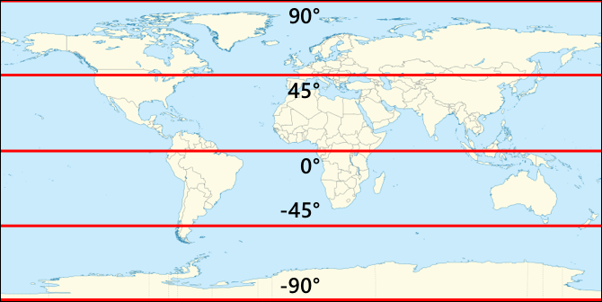
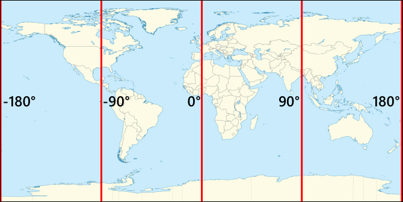
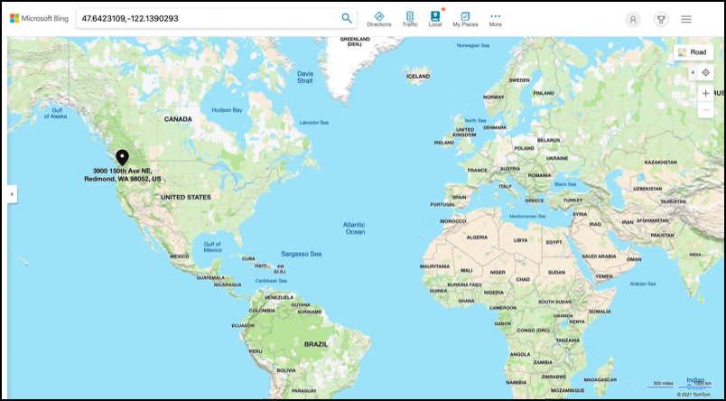
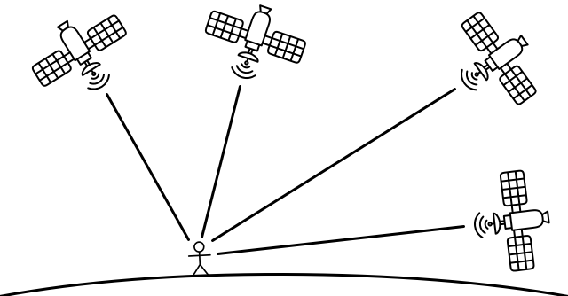

# Location tracking

## Pre-lecture quiz

[Pre-lecture quiz](https://brave-island-0b7c7f50f.azurestaticapps.net/quiz/21)

## Introduction

The main process for getting food from a farmer to a consumer involves loading boxes of produce on to trucks, ships, airplanes, or other commercial transport vehicles, and delivering the food somewhere - either directly to a customer, or to a central hub or warehouse for processing. The whole end-to-end process from farm to consumer is part of a process called the *supply chain*. The video below from Arizona State University's W. P. Carey School of Business talks about the idea of the supply chain and how it is managed in more detail.

> 🎥 Click the image above to watch a video

Adding IoT devices can drastically improve your supply chain, allowing you to manage where items are, plan transport and goods handling better, and respond quicker to problems.

When managing a fleet of vehicles such as trucks, it is helpful to know where each vehicle is at a given time. Vehicles can be fitted with GPS sensors that send their location to IoT systems, allowing the owners to pinpoint their location, see the route they have taken, and know when they will arrive at their destination. Most vehicles operate outside of WiFi coverage, so they use cellular networks to send this kind of data. Sometimes the GPS sensor is built into more complex IoT devices such as electronic log books. These devices track how long a truck has been in transit to ensure drivers are in compliance with local laws on working hours.

In this lesson you will learn how to track a vehicles location using a Global Positioning System (GPS) sensor.

In this lesson we'll cover:

* [Connected vehicles](#connected-vehicles)
* [Geospatial coordinates](#geospatial-coordinates)
* [Global Positioning Systems (GPS)](#global-positioning-systems-gps)
* [Read GPS sensor data](#read-gps-sensor-data)
* [NMEA GPS data](#nmea-gps-data)
* [Decode GPS sensor data](#decode-gps-sensor-data)

## Connected vehicles

IoT is transforming the way goods are transported by creating fleets of *connected vehicles*. These vehicles are connected to central IT systems reporting information on their location, and other sensor data. Having a fleet of connected vehicles has a wide range of benefits:

* Location tracking - you can pinpoint where a vehicle is at any time, allowing you to:

  * Get alerts when a vehicle is about to arrive at a destination to prepare a crew for unloading
  * Locate stolen vehicles
  * Combine location and route data with traffic problems to allow you to re-route vehicles mid-journey
  * Be compliant with tax. Some countries charge vehicles for the amount of mileage driven on public roads (such as [New Zealand's RUC](https://www.nzta.govt.nz/vehicles/licensing-rego/road-user-charges/)), so knowing when a vehicle is on public roads vs private roads makes it easier to calculate tax owed.
  * Know where to send maintenance crews in the event of a breakdown

* Driver telemetry - being able to ensure drivers are adhering to speed limits, cornering at appropriate speeds, braking early and efficiently, and driving safely. Connected vehicles can also have cameras to record incidents. This can be linked to insurance, giving reduced rates for good drivers.

* Driver hours compliance - ensuring drivers only drive for their legally allowed hours based on the times they turn the engine on and off.

These benefits can be combined - for example, combining driver hours compliance with location tracking to re-route drivers if they cannot reach their destination within their allowed driving hours. These can also be combined with other vehicle-specific telemetry, such as temperature data from temperature-controlled trucks, allow vehicles to be re-routed if their current route would mean goods cannot be kept at temperature.

> 🎓 Logistics is the process of transporting goods from one place to another, such as from a farm to a supermarket via one or more warehouses. A farmer packs boxes of tomatoes that are loaded onto a truck, delivered to a central warehouse, and put onto a second truck that may contain a mixture of different types of produce which are then delivered to a supermarket.

The core component of vehicle tracking is GPS - sensors that can pinpoint their location anywhere on Earth. In this lesson you will learn how to use a GPS sensor, starting with learning about how to define a location on Earth.

## Geospatial coordinates

Geospatial coordinates are used to define points on the Earth's surface, similar to how coordinates can be used to draw to a pixel on a computer screen or position stitches in cross stitch. For a single point, you have a pair of coordinates. For example, the Microsoft Campus in Redmond, Washington, USA is located at 47.6423109, -122.1390293.

### Latitude and longitude

The Earth is a sphere - a three-dimensional circle. Because of this, points are defined by dividing it into 360 degrees, the same as the geometry of circles. Latitude measures the number of degrees north to south, longitude measures the number of degrees east to west.

> 💁 No-one really knows the original reason why circles are divided into 360 degrees. The [degree (angle) page on Wikipedia](https://wikipedia.org/wiki/Degree_(angle)) covers some of the possible reasons.

Latitude is measured using lines that circle the Earth and run parallel to the equator, dividing the Northern and Southern Hemispheres into 90° each. The equator is at 0°, the North Pole is 90°, also known as 90° North, and the South Pole is at -90°, or 90° South.

Longitude is measured as the number of degrees measured east and west. The 0° origin of longitude is called the *Prime Meridian*, and was defined in 1884 to be a line from the North to the South Pole that goes through the [British Royal Observatory in Greenwich, England](https://wikipedia.org/wiki/Royal_Observatory,_Greenwich).

> 🎓 A meridian is an imaginary straight line that goes from the North Pole to the South Pole, forming a semicircle.

To measure the longitude of a point, you measure the number of degrees round the equator from the Prime Meridian to a meridian that passes through that point. Longitude goes from -180°, or 180° West, through 0° at the Prime Meridian, to 180°, or 180° East. 180° and -180° refer to the same point, the antimeridian or 180th meridian. This is a meridian on the opposite side of the Earth from the Prime Meridian.

> 💁 The antimeridian is not to be confused with the International Date Line, which is in approximately the same position, but is not a straight line and varies to fit around geo-political boundaries.

✅ Do some research: Try to find the latitude and longitude of your current location.

### Degrees, minutes and seconds vs decimal degrees

Traditionally, measurements of degrees of latitude and longitude were done using sexagesimal numbering, or base-60, a numbering system used by the Ancient Babylonians who did the first measurements and recordings of time and distance. You use sexagesimal every day probably without even realising it - dividing hours into 60 minutes and minutes into 60 seconds.

Longitude and latitude are measured in degrees, minutes and seconds, with one minute being 1/60 of a degree, and 1 second being 1/60 minute.

For example, at the equator:

* 1° of latitude is **111.3 kilometers**
* 1 minute of latitude is 111.3/60 = **1.855 kilometers**
* 1 second of latitude is 1.855/60 = **0.031 kilometers**

The symbol for a minute is a single quote, for a second it is a double quote. 2 degrees, 17 minutes, and 43 seconds for example, would be written as 2°17'43". Parts of seconds are given as decimals, for example half a second is 0°0'0.5".

Computers don't work in base-60, so these coordinates are given as decimal degrees when using GPS data in most computer systems. For example, 2°17'43" is 2.295277. The degree symbol is usually omitted.

Coordinates for a point are always given as `latitude, longitude`, so the example earlier of the Microsoft Campus at 47.6423109,-122.117198 has:

* A latitude of 47.6423109 (47.6423109 degrees north of the equator)
* A longitude of -122.1390293 (122.1390293 degrees west of the Prime Meridian).

## Global Positioning Systems (GPS)

GPS systems use multiple satellites orbiting the Earth to locate your position. You've probably used GPS systems without even knowing it - to find your location on a mapping app on your phone such as Apple Maps or Google Maps, or to see where your ride is in a ride hailing app such as Uber or Lyft, or when using satellite navigation (sat-nav) in your car.

> 🎓 The satellites in 'satellite navigation' are GPS satellites!

GPS systems work by having a number of satellites that send a signal with each satellites current position, and an accurate timestamp. These signals are sent over radio waves and are detected by an antenna in the GPS sensor. A GPS sensor will detect these signals, and using the current time measure how long it took for the signal to reach the sensor from the satellite. Because the speed of radio waves is constant, the GPS sensor can use the time stamp that was sent to work out how far away the sensor is from the satellite. By combining the data from at least 3 satellites with the positions sent, the GPS sensor is able to pinpoint its location on Earth.

> 💁 GPS sensors need antennas to detect radio waves. The antennas built into trucks and cars with on-board GPS are positioned to get a good signal, usually on the windshield or roof. If you are using a separate GPS system, such as a smartphone or an IoT device, then you need to ensure that the antenna built into the GPS system or phone has a clear view of the sky, such as being mounted on your windshield.

***By knowing the distance from the sensor to multiple satellites, the location be calculated. Satellite by Noura Mbarki from the [Noun Project](https://thenounproject.com)***

GPS satellites are circling the Earth, not at a fixed point above the sensor, so location data includes altitude above sea level as well as latitude and longitude.

GPS used to have limitations on accuracy enforced by the US military, limiting accuracy to around 5 meters. This limitation was removed in 2000, allowing an accuracy of 30 centimeters. Getting this accuracy is not always possible due to interference with the signals.

✅ If you have a smart phone, launch the mapping app and see how accurate your location is. It may take a short period of time for your phone to detect multiple satellites to get a more accurate location.

> 💁 The satellites contain atomic clocks that are incredibly accurate, but they drift by 38 microseconds (0.0000038 seconds) a day compared to atomic clocks, due to time slowing down as speed increases as predicted by Einstein's theories of special and general relativity - the satellites travel faster than the Earth's rotation. This drift has been used to prove the predictions of special and general relativity, and has to be adjusted for in the design of GPS systems. Literally time runs slower on a GPS satellite.

GPS systems have been developed and deployed by a number of countries and political unions including the US, Russia, Japan, India, the EU, and China. Modern GPS sensor can connect to most of these systems to get faster and more accurate fixes.

> 🎓 The groups of satellites in each deployment are referred to as constellations.

## Read GPS sensor data

Most GPS sensors send GPS data over UART.

> ⚠️ UART was covered in [project 2, lesson 2](../../../2-farm/lessons/2-detect-soil-moisture/README.md#universal-asynchronous-receiver-transmitter-uart). Refer back to that lesson if needed.

You can use a GPS sensor on your IoT device to get GPS data.

### Task - connect a GPS sensor and read GPS data

Work through the relevant guide to read GPS data using your IoT device:

* [Arduino - Wio Terminal](wio-terminal-gps-sensor.md)
* [Single-board computer - Raspberry Pi](pi-gps-sensor.md)
* [Single-board computer - Virtual device](virtual-device-gps-sensor.md)

## NMEA GPS data

When you ran your code, you would have seen what might appear to be gibberish in the output. This is actually standard GPS data, and it all has meaning.

GPS sensors output data using NMEA messages, using the NMEA 0183 standard. NMEA is an acronym for the [National Marine Electronics Association](https://www.nmea.org), a US-based trade organization that sets standard for communication between marine electronics.

> 💁 This standard is proprietary and sells for at least US$2,000, but enough information about it is in the public domain that most of the standard has been reverse engineered and can be used in open source and other non-commercial code.

These messages are text-based. Each message consists of a *sentence* that starts with a `$` character, followed by 2 characters to indicate the source of the message (e.g GP for the US GPS system, GN for GLONASS, the Russian GPS system), and 3 characters to indicate the type of message. The rest of the message is fields separated by commas, ending in a new line character.

Some of the types of messages that can be received are:

| Type | Description |
| ---- | ----------- |
| GGA | GPS Fix Data, including the latitude, longitude, and altitude of the GPS sensor, along with the number of satellites in view to calculate this fix. |
| ZDA | The current date and time, including the local time zone |
| GSV | Details of the satellites in view - defined as the satellited that GPS sensor can detect signals from |

> 💁 GPS data includes time stamps, so your IoT device can get the time if needed from a GPS sensor, rather than relying on an NTP server or internal real-time clock.

The GGA message includes the current location using the `(dd)dmm.mmmm` format, along with a single character to indicate direction. The `d` in the format is degrees, the `m` is minutes, with seconds as decimals of minutes. For example, 2°17'43" would be 217.716666667 - 2 degrees, 17.716666667 minutes.

The direction character can be `N` or `S` for latitude to indicate north or south, and `E` or `W` for longitude to indicate east or west. For example, a latitude of 2°17'43" would have a direction character of `N`, -2°17'43" would have a direction character of `S`.

For example - the NMEA sentence `$GNGGA,020604.001,4738.538654,N,12208.341758,W,1,3,,164.7,M,-17.1,M,,*67`

* The latitude part is `4738.538654,N`, which converts to 47.6423109 in decimal degrees. `4738.538654` is 47.6423109, and the direction is `N` (north), so it is a positive latitude.

* The longitude part is `12208.341758,W`, which converts to -122.1390293 in decimal degrees. `12208.341758` is 122.1390293°, and the direction is `W` (west), so it is a negative longitude.

## Decode GPS sensor data

Rather than use the raw NMEA data, it is better to decode it into a more useful format. There are multiple open-source libraries you can use to help extract useful data from the raw NMEA messages.

### Task - decode GPS sensor data

Work through the relevant guide to decode GPS sensor data using your IoT device:

* [Arduino - Wio Terminal](wio-terminal-gps-decode.md)
* [Single-board computer - Raspberry Pi/Virtual IoT device](single-board-computer-gps-decode.md)

---

## 🚀 Challenge

Write your own NMEA decoder! Rather than relying on third party libraries to decode NMEA sentences, can you write your own decoder to extract latitude and longitude from NMEA sentences?

## Post-lecture quiz

[Post-lecture quiz](https://brave-island-0b7c7f50f.azurestaticapps.net/quiz/22)

## Review & Self Study

* Read more on Geospatial Coordinates on the [Geographic coordinate system page on Wikipedia](https://wikipedia.org/wiki/Geographic_coordinate_system).
* Read up on the Prime Meridians on other celestial bodies besides the Earth on the [Prime Meridian page on Wikipedia](https://wikipedia.org/wiki/Prime_meridian#Prime_meridian_on_other_planetary_bodies)
* Research the various different GPS systems from various world governments and political unions such as the EU, Japan, Russia, India and the US.

## Assignment

[Investigate other GPS data](assignment.md)
