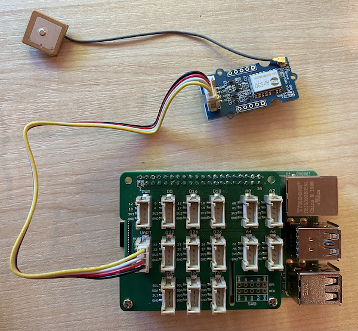

# Read GPS data - Raspberry Pi

In this part of the lesson, you will add a GPS sensor to your Raspberry Pi, and read values from it.

## Hardware

The Raspberry Pi needs a GPS sensor.

The sensor you'll use is a [Grove GPS Air530 sensor](https://www.seeedstudio.com/Grove-GPS-Air530-p-4584.html). This sensor can connect to multiple GPS systems for a fast, accurate fix. The sensor is made of 2 parts - the core electronics of the sensor, and an external antenna connected by a thin wire to pick up the radio waves from the satellites.

This is a UART sensor, so sends GPS data over UART.

## Connect the GPS sensor

The Grove GPS sensor can be connected to the Raspberry Pi.

### Task - connect the GPS sensor

Connect the GPS sensor.


1. Insert one end of a Grove cable into the socket on the GPS sensor. It will only go in one way round.

1. With the Raspberry Pi powered off, connect the other end of the Grove cable to the UART socket marked **UART** on the Grove Base hat attached to the Pi. This socket is on the middle row, on the side nearest the SD Card slot, the other end from the USB ports and ethernet socket.

    

1. Position the GPS sensor so that the attached antenna has visibility to the sky - ideally next to an open window or outside. It's easier to get a clearer signal with nothing in the way of the antenna.

## Program the GPS sensor

The Raspberry Pi can now be programmed to use the attached GPS sensor.

### Task - program the GPS sensor

Program the device.

1. Power up the Pi and wait for it to boot

1. The GPS sensor has 2 LEDs - a blue LED that flashes when data is transmitted, and a green LED that flashes every second when receiving data from satellites. Ensure the blue LED is flashing when you power up the Pi. After a few minutes the green LED will flash - if not, you may need to reposition the antenna.

1. Launch VS Code, either directly on the Pi, or connect via the Remote SSH extension.

    > ⚠️ You can refer to [the instructions for setting up and launching VS Code in lesson 1 if needed](../../../1-getting-started/lessons/1-introduction-to-iot/pi.md).

1. With newer versions of the Raspberry Pi that support Bluetooth, there is a conflict between the serial port used for Bluetooth, and the one used by the Grove UART port. To fix this, do the following:

    1. From the VS Code terminal, edit the `/boot/config.txt` file using `nano`, a built in terminal text editor with the following command:

        ```sh
        sudo nano /boot/config.txt
        ```

        > This file can't be edited by VS Code as you need to edit it with `sudo` permissions, an elevated permission. VS Code doesn't run this permission.

    1. Use your cursor keys to navigate to the end of the file. then copy the code below and paste it on the end of the file:

        ```ini
        dtoverlay=pi3-miniuart-bt
        dtoverlay=pi3-disable-bt
        enable_uart=1
        ```

        You can paste using the normal keyboard shortcuts for your device (`Ctrl+v` on Windows, Linux or Raspberry Pi OS, `Cmd+v` on macOS).

    1. Save this file and exit nano by pressing `Ctrl+x`. Press `y` when asked if you want to save the modified buffer, then press `enter` to confirm you want to overwrite `/boot/config.txt`.

        > If you make a mistake, you can exit without saving, then repeat these steps.

    1. Edit the `/boot/cmdline.txt` file in nano with the following command:

        ```sh
        sudo nano /boot/cmdline.txt
        ```

    1. This file has a number of key/value pairs separated by spaces. Remove any key/value pairs for the key `console`. They will probably look something like this:

        ```output
        console=serial0,115200 console=tty1 
        ```

        You can navigate to these entries using the cursor keys, then delete using the normal `del` or `backspace` keys.

        For example, if your original file looks like this:

        ```output
        console=serial0,115200 console=tty1 root=PARTUUID=058e2867-02 rootfstype=ext4 elevator=deadline fsck.repair=yes rootwait
        ```

        The new version will be:

        ```output
        root=PARTUUID=058e2867-02 rootfstype=ext4 elevator=deadline fsck.repair=yes rootwait
        ```

    1. Follow the steps above to save this file and exit nano

    1. Reboot your Pi, then reconnect in VS Code once the Pi has rebooted.

1. From the terminal, create a new folder in the `pi` users home directory called `gps-sensor`. Create a file in this folder called `app.py`.

1. Open this folder in VS Code

1. The GPS module sends UART data over a serial port. Install the `pyserial` Pip package to communicate with the serial port from your Python code:

    ```sh
    pip3 install pyserial
    ```

1. Add the following code to your `app.py` file:

    ```python
    import time
    import serial
    
    serial = serial.Serial('/dev/ttyAMA0', 9600, timeout=1)
    serial.reset_input_buffer()
    serial.flush()
    
    def printGPSData(line):
        print(line.rstrip())
    
    while True:
        line = serial.readline().decode('utf-8')
    
        while len(line) > 0:
            printGPSData(line)
            line = serial.readline().decode('utf-8')
    
        time.sleep(1)
    ```

    This code imports the `serial` module from the `pyserial` Pip package. It then connects to the `/dev/ttyAMA0` serial port - this is the address of the serial port that the Grove Pi Base Hat uses for its UART port. It then clears any existing data from this serial connection.

    Next a function called `printGPSData` is defined that prints out the line passed to it to the console.

    Next the code loops forever, reading as many lines of text as it can from the serial port in each loop. It calls the `printGPSData` function for each line.

    After all the data has been read, the loop sleeps for 1 second, then tries again.

1. Run this code. You will see the raw output from the GPS sensor, something like the following:

    ```output
    $GNGGA,020604.001,4738.538654,N,12208.341758,W,1,3,,164.7,M,-17.1,M,,*67
    $GPGSA,A,1,,,,,,,,,,,,,,,*1E
    $BDGSA,A,1,,,,,,,,,,,,,,,*0F
    $GPGSV,1,1,00*79
    $BDGSV,1,1,00*68
    ```

    > If you get one of the following errors when stopping and restarting your code, kill the VS Code terminal, then launch a new one and try again.

      ```output
      UnicodeDecodeError: 'utf-8' codec can't decode byte 0x93 in position 0: invalid start byte
      UnicodeDecodeError: 'utf-8' codec can't decode byte 0xf1 in position 0: invalid continuation byte
      ```

> 💁 You can find this code in the [code-gps/pi](code-gps/pi) folder.

😀 Your GPS sensor program was a success!
