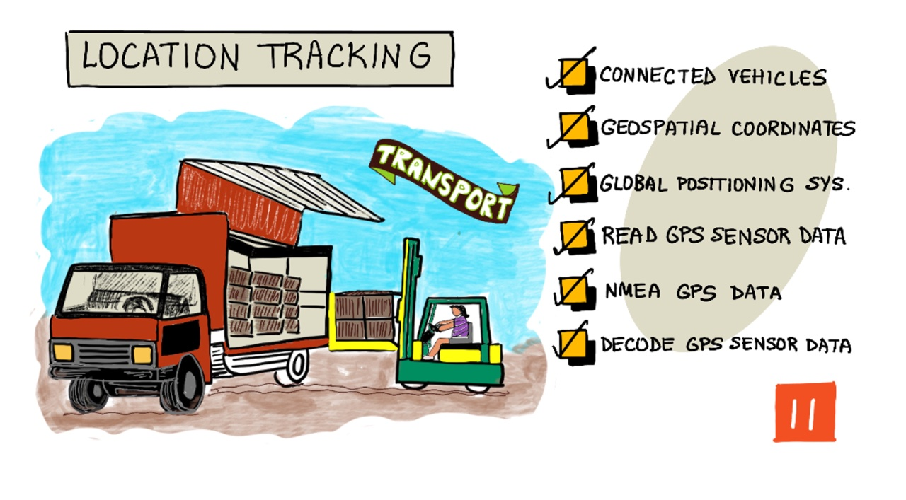

# লোকেশন ট্র্যাকিং

> স্কেচনোটটি তৈরী করেছেন [Nitya Narasimhan](https://github.com/nitya)। বড় সংস্করণে দেখার জন্য ছবিটিতে ক্লিক করতে হবে।

## লেকচার-পূর্ববর্তী কুইজ

[লেকচার-পূর্ববর্তী কুইজ](https://brave-island-0b7c7f50f.azurestaticapps.net/quiz/21)

## সূচনা

কৃষকের কাছ থেকে গ্রাহকের কাছে খাবার পৌঁছানোর মূল প্রক্রিয়াটি হল ট্রাক, জাহাজ, বিমান বা অন্যান্য বাণিজ্যিক পরিবহণ যানবাহনে পণ্য বাক্স লোড করা এবং খাদ্য সরবরাহ করা - এটি সরাসরি গ্রাহকের কাছে বা কেন্দ্রীয় হাব বা গুদামে সরবরাহ করা যেতে পারে। খামার থেকে গ্রাহক পর্যন্ত পুরো end-to-end process বা প্রক্রিয়াটি "সরবরাহ চেইন" (ব্যবসায়িক ইংরেজি  ভাষায় - *supply chain* ) নামে পরিচিত একটি প্রক্রিয়ার অংশ। অ্যারিজোনা স্টেট ইউনিভার্সিটির W. P. Carey School of Business এর নীচের ভিডিওটিতে সরবরাহ চেইনের ধারণা এবং কীভাবে এটি আরও বিশদভাবে পরিচালনা করা হয় সে সম্পর্কে আলোচনা করা হয়েছে।

> 🎥 ভিডিও দেখার জন্য উপরের ছবিতে ক্লিক করতে হবে।

আইওটি ডিভাইস যুক্ত করা আমাদের সাপ্লাই চেইনে প্রচন্ডরকমের উন্নতি করতে পারে, আমাদেরকে আইটেমগুলি কোথায় রয়েছে তা পরিচালনা করার সুযোগ দেয়, পরিবহন এবং পণ্যগুলি হ্যান্ডলিংয়ের আরও ভাল পরিকল্পনা করা এবং সমস্যার দ্রুত প্রতিক্রিয়া জানানোর মাধ্যমে কার্যক্রমে উন্নতি ঘটায়।

ট্রাকের মতো বিশাল যানবাহনের বহর পরিচালনা করার সময়, প্রতিটি যানবাহন একটি নির্দিষ্ট সময়ে কোথায় তা জানা থাকা দরকার। যানবাহনগুলিতে জিপিএস সেন্সর লাগানো যেতে পারে যা - তাদের অবস্থান আইওটি সিস্টেমে প্রেরণ করে, মালিকদেরকে গাড়ির অবস্থান জানায়, তারা যে পথটি নিয়েছে তা দেখতে এবং তারা কখন তাদের গন্তব্যে পৌঁছাবে তা জানাতে পারে। বেশিরভাগ যানবাহন ওয়াইফাই কভারেজের বাইরে কাজ করে, তাই তারা এই জাতীয় ডেটা প্রেরণে সেলুলার নেটওয়ার্কগুলি ব্যবহার করে। কখনও কখনও জিপিএস সেন্সরগুলো আরও জটিল আইওটি ডিভাইসে যেমন ইলেক্ট্রনিক লগ বুকে তৈরি করা হয়। চালকরা কাজের সময় স্থানীয় আইন মেনে চলে তা নিশ্চিত করার জন্য এই ডিভাইসগুলি ট্রাক কতক্ষণ ট্রানজিটে ছিল সেটিও পর্যন্ত ট্র্যাক করে।

এই পাঠে আমরা গ্লোবাল পজিশনিং সিস্টেম (জিপিএস) সেন্সর ব্যবহার করে কীভাবে কোন যানবাহনের অবস্থান ট্র্যাক করা যায় তা শিখব।

এই লেসনে আমরা দেখতে যাচ্ছি:

* [সংযুক্ত যানবাহনসমূহ](#সংযুক্ত-যানবাহনসমূহ)
* [ভূ-স্থানাংক](#ভূ-স্থানাংক)
* [Global Positioning Systems (GPS)](#global-positioning-systems-gps)
* [জিপিএস সেন্সর ডেটা গ্রহণ](#জিপিএস-সেন্সর-ডেটা-গ্রহণ)
* [NMEA GPS data](#nmea-gps-data)
* [GPS sensor data ডিকোড করা](#GPS-sensor-data-ডিকোড-করা)

## সংযুক্ত যানবাহনসমূহ

পণ্য পরিবহনের ক্ষেত্রে *সংযুক্ত যানবাহনসমূহ* এর ক্ষেত্রে আইওটি আমূল পরিবর্তন আনছে। কেন্দ্রীয় আইটি সিস্টেম এর সাথে এই যানগুলির অবস্থান সম্পর্কিত তথ্য এবং অন্যান্য সেন্সর ডেটা সংযুক্ত রয়েছে। এখানে রয়েছে বিস্তৃত সুবিধা, যেমন:

* লোকেশন ট্র্যাকিং - যানবাহন যেকোন সময় কোথায় রয়েছে তা আমরা চিহ্নিত করতে পারি, আমরা এখানে - 

  * যখন কোন গাড়ি আনলোডিং জন্য আসতে থাকে, কর্মকর্তা-কর্মচারীরা আগেই তা জানতে পারেন এবং যথাযথ প্রস্তুতি নিতে পারেন।
  * চুরি হওয়া গাড়ি সনাক্ত করা যায়।
  * ট্রাফিক সমস্যার সাথে অবস্থান এবং রুটের ডেটা একত্রিত করে  বিশ্লেষণ করা যায় যাতে মাঝপথে রাস্তা পরিবর্তন করার দরকার হলে দ্রুত নির্দেশনা দেয়া যায়।
  * কর সংক্রান্ত নিয়ম সহজেই মানা যায়। কিছু দেশ সরকারী রাস্তায় চালিত মাইলেজের পরিমাণ উপর নির্ভর করে যানবাহন এর উপর করারোপ করে (যেমন - [New Zealand এর RUC](https://www.nzta.govt.nz/vehicles/licensing-rego/road-user-charges/)), তাই কোন যানবাহন কখন পাবলিক রাস্তায়  আর কখন ব্যক্তিগত রাস্তায় থাকছে তা জেনে রাখলে, বকেয়া করের গণনা সহজ হয়।
  * গাড়ির সমস্যা হলে সেই পরিস্থিতিতে রক্ষণাবেক্ষণ কর্মীদের কোথায় পাঠাতে হবে তা দ্রুত জানা যায়।

* ড্রাইভার টেলিমেট্রি - বিভিন্ন বিষয়, যেমনঃ চালকরা গতির সীমা মেনে চলছে, উপযুক্ত গতিতে চালাচ্ছে, তাড়াতাড়ি এবং দক্ষতার সাথে ব্রেক করেছেন এবং নিরাপদে গাড়ি চালাচ্ছেন তা নিশ্চিত করা যায়। সংযুক্ত যানবাহনগুলিতে ঘটনা রেকর্ড করার জন্য ক্যামেরা থাকতে পারে। এটিকে ইন্স্যুরেন্সের সাথে যুক্ত করা যেতে পারে, ভাল ড্রাইভারের জন্য অতিরিক্ত সুবিধা দেওয়া যায়।

* ড্রাইভারদের যথাযথ কর্মঘন্টা নিশ্চিতকরণ - ড্রাইভারদের ইঞ্জিন চালু এবং বন্ধ করার সময়ের উপর ভিত্তি করে কেবল তাদের জন্য আইনীভাবে অনুমোদিত সময় পর্যন্ত গাড়ি চালানো নিশ্চিত করতে হবে কেননা অনেক দেশেই এই শ্রমিক আইন যথাযথভাবে মানতে হয়।

এই সুবিধাগুলি একত্রিত করা যায় - উদাহরণস্বরূপ, ড্রাইভাররা যদি তাদের অনুমতিপ্রাপ্ত ড্রাইভিং সময়ের মধ্যে তাদের গন্তব্যে পৌঁছাতে না পারে তবে রুট পরিবর্তন করে দেয়া যাবে। এগুলি অন্যান্য যানবাহন-ভিত্তিক টেলিমেট্রির সাথেও মিলিত হতে পারে, যেমন তাপমাত্রা-নিয়ন্ত্রিত ট্রাকগুলির তাপমাত্রার ডেটা - যদি তাদের বর্তমান রুটের তাপমাত্রায় পণ্য রাখা না যায় তবে যানবাহনগুলিকে অন্য রুটে পাঠাতে হবে।

> 🎓 লজিস্টিকস (LOGISTICS) হল এক জায়গা থেকে অন্য জায়গায় পণ্য পরিবহণের প্রক্রিয়া, যেমন ফার্ম বা সুপারমার্কেটে এক বা একাধিক গুদামের মাধ্যমে পণ্য পরিবহন করা। একজন কৃষক থেকে একটি ট্রাকের উপর ভর করে কোন ফসল, যেমনঃ টমেটো একটি কেন্দ্রীয় গুদামে সরবরাহ করা হয় এবং সুপার মার্কেটে সরবরাহ করার সময় বিভিন্ন ধরণের পণ্যের মিশ্রণ থাকতে পারে দ্বিতীয় ট্রাকে ।

যানবাহন ট্র্যাকিংয়ের মূল উপাদান হল জিপিএস - সেন্সর যা পৃথিবীর যে কোন জায়গায় অবস্থান নির্ধারণ করতে পারে। এই পাঠে আমরা কীভাবে একটি জিপিএস সেন্সর ব্যবহার করব তা শিখতে শুরু করব।

## ভূ-স্থানাংক

কম্পিউটারের স্ক্রিনে পিক্সেল ধরে ধরে আঁকতে যেভাবে তার স্থানাঙ্কগুলি ব্যবহার করা যায় তার অনুরূপ Geospatial coordinates বা ভূ-স্থানাংক পৃথিবীর পৃষ্ঠের পয়েন্টগুলি সংজ্ঞায়িত করতে ব্যবহৃত হয়। একক পয়েন্টের জন্য, আমাদের ২টি অক্ষ রয়েছে। উদাহরণস্বরূপ, মার্কিন যুক্তরাষ্ট্রের ওয়াশিংটনের রেডমন্ডের মাইক্রোসফ্ট ক্যাম্পাসটি 47.6423109, -122.1390293 এ অবস্থিত।

### অক্ষাংশ ও দ্রাঘিমাংশ

পৃথিবী একটি গোলক , একটি ত্রি-মাত্রিক বৃত্ত। এর কারণে, পয়েন্টগুলিকে 360 ডিগ্রিতে ভাগ করে গণনা করা হয় যা বৃত্তের জ্যামিতির সমান । অক্ষাংশ উত্তর থেকে দক্ষিণে ডিগ্রি সংখ্যার পরিমাপ করে, দ্রাঘিমাংশ পূর্ব থেকে পশ্চিমে ডিগ্রির সংখ্যা পরিমাপ করে।

> 💁 বৃত্ত 360 ডিগ্রিতে বিভক্ত হওয়ার মূল কারণটি কেউ আসলে জানে না। এখানে [degree (angle) - Wikipedia](https://wikipedia.org/wiki/Degree_(angle)) কিছু সম্ভাব্য কারণ দেয়া হয়েছে।

অক্ষাংশ এমন রেখা ব্যবহার করে পরিমাপ করা হয় যা পৃথিবীটিকে প্রদক্ষিণ করে এবং নিরক্ষরেখার (equator) সাথে সমান্তরালভাবে চলে, উত্তর এবং দক্ষিণ গোলার্ধ প্রতিটিকে 90° তে বিভক্ত করে। নিরক্ষীয় (equator) স্থান হলো 0°, উত্তর মেরু 90°, এটি 90° উত্তর হিসাবেও পরিচিত এবং দক্ষিণ মেরুটি -90° বা 90° দক্ষিণে রয়েছে।

দ্রাঘিমাংশ পূর্ব এবং পশ্চিম পরিমাপকৃত ডিগ্রির সংখ্যা হিসাবে পরিমাপ করা হয়। দ্রাঘিমাংশের 0° কে বলা হয় *প্রাইম মেরিডিয়ান* এবং এটি 1884 সালে নির্ধারিত হয় যা উত্তর থেকে দক্ষিণ মেরু পর্যন্ত একটি রেখা যেটি কিনা [British Royal Observatory in Greenwich, England](https://wikipedia.org/wiki/Royal_Observatory,_Greenwich) এর মধ্যে দিয়ে যায়।

> 🎓 মেরিডিয়ান একটি কাল্পনিক সরল রেখা যা উত্তর মেরু থেকে দক্ষিণ মেরুতে গিয়ে একটি অর্ধবৃত্ত গঠন করে ।

একটি বিন্দুর দ্রাঘিমাংশ পরিমাপ করার জন্য, আমরা প্রাইম মেরিডিয়ান থেকে অন্য মেরিডিয়ান পর্যন্ত মধ্যবর্তী নিরক্ষীয় অঞ্চলের ডিগ্রির সংখ্যা পরিমাপ করি। দ্রাঘিমাংশ -180° বা 180° পশ্চিম থেকে প্রাইম মেরিডিয়ানে 0° হয়ে 180° বা 180° পূর্ব দিকে যায়। 180° এবং -180° একই বিন্দু যা অ্যান্টিমেরিডিয়ান বা 180-তম মেরিডিয়ান হিসেবে পরিচিত। এটি প্রাইম মেরিডিয়ান থেকে পৃথিবীর বিপরীত দিকে একটি মেরিডিয়ান।

> 💁 অ্যান্টিমেরিডিয়ান এবং আন্তর্জাতিক তারিখ রেখার মধ্যে বিভ্রান্ত হওয়ার দরকার নেই। যদিও দুটিই প্রায় একই অবস্থানে রয়েছে, তবে তারিখ রেখা কোনও সরল রেখা নয় এবং ভূ-রাজনৈতিক সীমানার আশেপাশে এটি পরিবর্তিত হয়।

✅ কিছু গবেষণা করা যাক: আমাদের বর্তমান অবস্থানের অক্ষাংশ এবং দ্রাঘিমাংশ সন্ধান করার চেষ্টা করি।

### Degrees, minutes and seconds বনাম decimal degrees

ঐতিহাসিকভাবে, অক্ষাংশ এবং দ্রাঘিমাংশের ডিগ্রিগুলির পরিমাপটি sexagesimal সংখ্যায়ন বা বেস -60 ব্যবহার করে সম্পন্ন করা হত। এটি দ্বারা প্রাচীন ব্যাবিলিয়ানরা সময় এবং দূরত্বের প্রথম পরিমাপ এবং রেকর্ডিং করেছিলেন এবং তাদের দ্বারা ব্যবহৃত একটি সংখ্যায়ন ব্যবস্থা এটি । আমরা প্রতিদিন উপলব্ধিও করিনা ,অথচ sexagesimal পদ্ধতি ব্যবহার করি - ঘন্টাকে 60 মিনিট এবং মিনিটকে 60 সেকেন্ডে ভাগ করে।

দ্রাঘিমাংশ এবং অক্ষাংশকে ডিগ্রি, মিনিট এবং সেকেন্ডে পরিমাপ করা হয়, এক মিনিটের ডিগ্রির 1/60 এবং 1 সেকেন্ডটি 1/60 মিনিট হয়।

উদাহরণস্বরূপ, নিরক্ষীয় (equator) অঞ্চলে:

* 1° অক্ষাংশ হলো **111.3 কিলোমিটার**
* 1 মিনিট অক্ষাংশ হলো 111.3/60 = **1.855 কিলোমিটার**
* 1 সেকেন্ড অক্ষাংশ হলো 1.855/60 = **0.031 কিলোমিটার**

The symbol for a minute is a single quote, for a second it is a double quote. 2 degrees, 17 minutes, and 43 seconds for example, would be written as 2°17'43". Parts of seconds are given as decimals, for example half a second is 0°0'0.5".

এক মিনিটের প্রতীক হলো একটি একক উদ্ধৃতি চিহ্ন (') এবং এক সেকেন্ডের জন্য এটি দ্বি-উদ্ধৃতি চিহ্ন (")। 2 ডিগ্রি, 17 মিনিট এবং 43 সেকেন্ড কে 2°17'43"হিসাবে লেখা হবে। সেকেন্ডের অংশগুলি দশমিক হিসাবে দেওয়া হয়, উদাহরণস্বরূপ অর্ধেক সেকেন্ডকে 0° 0'0.5" লেখা হয়।

কম্পিউটার বেস -60 স্নগখ্যাপদ্ধতিতে কাজ করে না, তাই বেশিরভাগ কম্পিউটার সিস্টেমে জিপিএস ডেটা ব্যবহার করার সময় এই সমন্বয়গুলিকে দশমিক ডিগ্রি হিসাবে দেওয়া হয়। উদাহরণস্বরূপ, 2° 17'43" হল 2.295277 - ডিগ্রি চিহ্নটি সাধারণত বাদ দেওয়া হয়।

একটি পয়েন্টের জন্য স্থানাঙ্কগুলি সর্বদা `অক্ষাংশ,দ্রাঘিমাংশ  (latitude,longitude) ` হিসাবে দেওয়া হয়, সুতরাং মাইক্রোসফ্ট ক্যাম্পাসের আগের উদাহরণটিতে তার অবস্থান 47.6423109, -122.117198 এ রয়েছে:

* অক্ষাংশ 47.6423109 (47.6423109 নিরক্ষীয় অঞ্চল থেকে কত  ডিগ্রি উত্তরে রয়েছে )
* দ্রাঘিমাংশ -122.1390293 (122.1390293 প্রাইম মেরিডিয়ান থেকে কত ডিগ্রি পশ্চিমে রয়েছে).

## Global Positioning Systems (GPS)

জিপিএস সিস্টেমগুলি একাধিক উপগ্রহ ব্যবহার করে আমাদের অবস্থান সনাক্ত করতে পৃথিবী প্রদক্ষিণ করে । আমরা সম্ভবত এটি না জেনেও জিপিএস সিস্টেমগুলি ব্যবহার করেছি - অ্যাপল মানচিত্র বা গুগল ম্যাপের মতো আমাদের ফোনে একটি ম্যাপিং অ্যাপে আমাদের অবস্থান সন্ধান করতে বা Uber বা Lyft এর মতো আমাদের রাইডটি কোথায় রয়েছে তা দেখতে অথবা আমাদের গাড়িতে স্যাটেলাইট নেভিগেশন (স্যাট-ন্যাভ) ব্যবহার করার ক্ষেত্রে ।

> 🎓  'স্যাটেলাইট নেভিগেশন (স্যাট-ন্যাভ)' এ ব্যবহৃত উপগ্রহগুলো জিপিএস স্যাটেলাইট !

জিপিএস সিস্টেমগুলি বেশ কয়েকটি উপগ্রহ যা প্রতিটি উপগ্রহের বর্তমান অবস্থান এবং একটি সঠিক টাইমস্ট্যাম্প সহ একটি সংকেত প্রেরণ করে কাজ করে। এই সংকেতগুলি রেডিও তরঙ্গ এর মাধ্যমে প্রেরণ করা হয় এবং জিপিএস সেন্সরে একটি অ্যান্টেনার দ্বারা সনাক্ত করা হয়। একটি জিপিএস সেন্সর এই সংকেতগুলি সনাক্ত করবে এবং বর্তমান সময়ের পরিমাপটি ব্যবহার করে উপগ্রহ থেকে সেন্সরটি পৌঁছাতে কত সময় লেগেছে তা নির্ণয় করে। রেডিও তরঙ্গগুলির গতি অবিচ্ছিন্ন থাকার কারণে, জিপিএস সেন্সর স্যাটেলাইট থেকে সেন্সরটি কতটা দূরে রয়েছে তা নির্ধারণের জন্য প্রেরণ করা টাইমস্ট্যাম্পটি ব্যবহার করতে পারে। প্রেরিত পজিশনের সাথে কমপক্ষে 3 টি উপগ্রহের উপাত্তগুলিকে একত্রিত করে, জিপিএস সেন্সরটি পৃথিবীতে তার অবস্থান নির্ধারণ করতে সক্ষম হয়।

> 💁 জিপিএস সেন্সরগুলির রেডিও তরঙ্গগুলি সনাক্ত করতে অ্যান্টেনার প্রয়োজন। অন-বোর্ড জিপিএস সহ ট্রাক এবং গাড়িতে তৈরি অ্যান্টেনা সাধারণত উইন্ডশীল্ড বা ছাদে অবস্থিত - যা একটি ভাল সংকেত পাওয়ার জন্য যথেষ্ট । যদি আমরা একটি পৃথক জিপিএস সিস্টেম ব্যবহার করি, যেমন স্মার্টফোন বা আইওটি ডিভাইস, তবে আমাদের এটি নিশ্চিত করতে হবে যে জিপিএস সিস্টেম বা ফোনে থাকা অ্যান্টেনার সাথে আকাশের উন্মুক্ত যোগাযোগ থাকতে পারবে।

জিপিএস উপগ্রহগুলি সেন্সরের উপরে নির্দিষ্ট স্থানে অবস্থিত নয়, বরং এরা পৃথিবী প্রদক্ষিণ করছে। সুতরাং অবস্থানের ডেটাতে সমুদ্র স্তর থেকে উচ্চতার পাশাপাশি অক্ষাংশ এবং দ্রাঘিমাংশ অন্তর্ভুক্ত রয়েছে।

জিপিএসে মার্কিন সেনা দ্বারা প্রয়োগ করা নির্ভুলতার সীমাবদ্ধতা থাকত, যেখানে নির্ভুলতা প্রায় 5 মিটারের মধ্যে সীমাবদ্ধ থাকে। এই সীমাবদ্ধতাটি 2000 ্সালে উঠিয়ে নেয়া হয় এবং প্রায় ৩০ সেন্টিমিটার পর্যন্ত এক্যুরেট মান পাওয়া যেত। তবে সিগন্যালের সাথে বিভিন্ন ইন্টারফেরেন্স বা সমস্যার কারণে এই নির্ভুলতা র্জন করা সর্বদা সম্ভব হয় না।

✅ আমাদের যদি স্মার্ট ফোন থাকে তবে ম্যাপিং অ্যাপটি চালু করে দেখতে পারি আমাদের অবস্থানটি কতটা সঠিক। আরও সঠিক অবস্থান পেতে একাধিক উপগ্রহ দ্বারা সনাক্ত করার জন্য অল্প সময় নিতে পারে।

> 💁 উপগ্রহগুলিতে atomic clock রয়েছে যা অবিশ্বাস্যরূপে নির্ভুল, তবে তারা পৃথিবীতে পারমাণবিক ঘড়ির তুলনায় একদিনে 38 মাইক্রোসেকেন্ড (0.0000038 সেকেন্ড) হেরফের করে এবং সময়টি ধীরে ধীরে বেড়ে যায়। পৃথিবীর ঘূর্ণনের চেয়ে দ্রুত ভ্রমণ করায় এই ঘটনা ঘটে যা আইনস্টাইনের বিশেষ এবং সাধারণ আপেক্ষিকতার ত্বত্তে অনুমান করা হয়েছিলো এবং সময়ের এই হেরফেরই আইন্সটাইনের তত্ত্ব প্রমাণ করে। আক্ষরিক অর্থেই জিপিএস স্যাটেলাইটে সময় ধীর হয়ে যায় ।

মার্কিন যুক্তরাষ্ট্র, রাশিয়া, জাপান, ভারত, ইইউ এবং চীন সহ বেশ কয়েকটি দেশ এবং রাজনৈতিক ইউনিয়ন জিপিএস সিস্টেমগুলি বিকাশ ও স্থাপন করেছে। আধুনিক জিপিএস সেন্সর দ্রুত এবং আরও নির্ভুল ভাবে কাজ করতে পারে।

> 🎓 প্রতিটি ডেপ্লয়মেন্টে উপগ্রহের যে গুচ্ছ পাঠানো হয়, তাদেরকে 'constellations' বলা হয়।

## জিপিএস সেন্সর ডেটা গ্রহণ

বেশিরভাগ জিপিএস সেন্সর UART এর মাধ্যমে জিপিএস ডেটা প্রেরণ করে।

> ⚠️ UART বিষয়টি [project 2, lesson 2](../../../../2-farm/lessons/2-detect-soil-moisture/README.md#universal-asynchronous-receiver-transmitter-uart) এ বর্ণনা করা হয়েছে।

আমরা জিপিএস ডেটা পেতে আমাদের আইওটি ডিভাইসে একটি জিপিএস সেন্সর ব্যবহার করতে পারি।

### কাজ - জিপিএস সেন্সর কানেক্ট করে ডেটা গ্রহণ

আমাদের আইওটি ডিভাইস ব্যবহার করে জিপিএস ডেটা গ্রহণ করতে  নিম্নের প্রাসঙিক গাইডের মাধ্যমে কাজ শুরু  করি:

* [Arduino - Wio Terminal](wio-terminal-gps-sensor.md)
* [Single-board computer - Raspberry Pi](pi-gps-sensor.md)
* [Single-board computer - Virtual device](virtual-device-gps-sensor.md)

## NMEA GPS data

আমরা যখন আমাদের কোড রান করি, তখন দেখতে পেতাম যে আউটপুটটিতে কিছু হযবরল, অর্থহীন ডেটা রয়েছে । এটি আসলে স্ট্যান্ডার্ড জিপিএস ডেটা এবং এর অর্থ রয়েছে।

জিপিএস সেন্সরগুলি NMEA 0183 স্ট্যান্ডার্ড ব্যবহার করে, NMEA বার্তায় আউটপুট দেয়। NMEA এর পূর্ণরূপ [National Marine Electronics Association](https://www.nmea.org), মার্কিন যুক্তরাষ্ট্র ভিত্তিক বাণিজ্য সংস্থা যা সামুদ্রিক ইলেকট্রনিক্সের মধ্যে যোগাযোগের জন্য মান নির্ধারণ করে।

> 💁 এই স্ট্যান্ডার্ডটি মালিকানাধীন এবং কমপক্ষে ২০০০ মার্কিন ডলারে বিক্রি হয়, তবে এ সম্পর্কে পর্যাপ্ত তথ্য জনসাধারণের কাছে আছে যে স্ট্যান্ডার্ডটির বেশিরভাগ অংশই বিপরীত ইঞ্জিনিয়ারড (reverse engineered) হয়েছে এবং ওপেন সোর্স ও অন্যান্য অ-বাণিজ্যিক কোডে তাই ব্যবহার করা যেতে পারে।

এই বার্তাগুলি টেক্সট-ভিত্তিক। প্রতিটি বার্তায় একটি *বাক্য* থাকে যা একটি `$` চিহ্ন দিয়ে শুরু হয়, তারপরে বার্তাটির সোর্স বোঝানোর জন্য ২টি বর্ণ (উদাহরণস্বরূপ মার্কিন যুক্তরাষ্ট্রের জিপিএস সিস্টেমের জন্য GP,  রাশিয়ান জিপিএস সিস্টেম GLONASS এর জন্য GN) এবং 3 টি বর্ণ থাকে বার্তার ধরণটি নির্দেশ করতে। বার্তাটির বাকি অংশ কমা দ্বারা আলাদা করা থাকে এবং একটি new line দিয়ে তা শেষ হয়।

প্রাপ্ত  বার্তার কয়েকটি প্রকার হল:

| প্রকার | বর্ণনা |
| ---- | ----------- |
| GGA | GPS Fix Data যা  জিপিএস সেন্সর থেকে latitude, longitude, and altitude এর তথ্য গ্রহণের পাশাপাশি কতটি স্যাটেলাইট ব্যবহার করে  এই তথ্য নেয়া হয়েছে তাও জানায় |
| ZDA | লোকাল টাইমজোন সহ বর্তমান সময় এবগ তারিখও জানায় |
| GSV | দৃশ্যমান স্যাটেলাইটের তথ্যাবলি - যেসকল স্যাটেলাইট এর সাথে জিপিএস সেন্সর যুক্ত থাকে |

> 💁 জিপিএস ডেটাতে টাইমস্ট্যাম্প অন্তর্ভুক্ত রয়েছে, সুতরাং আমাদের আইওটি ডিভাইসটি কোনও এনটিপি সার্ভার বা অভ্যন্তরীণ রিয়েল-টাইম ক্লকের উপর নির্ভর না করে কোন জিপিএস সেন্সর থেকে সময় পেতে পারে।

GGA টাইপের ম্যাসেজে অবস্থান নির্দেশ করার জন্য নির্দিষ্ট ফর্ম্যাট ব্যবহার করে যা হলো `(dd)dmm.mmmm` যার সাথে একটি একক অক্ষর ব্যবহার করে বর্তমান অবস্থান এর দিক অন্তর্ভুক্ত করা হয়।  এই বিন্যাসে `d` হলো ডিগ্রি ,` m` এবং সেকেন্ডকে মিনিটের দশমিক হিসাবে দেখানো হয় ; উদাহরণস্বরূপ - 2° 17'43" কে 217.716666667 - 2 ডিগ্রি , 17.716666667 মিনিট হিসাবে দেখানো হবে।

দিকনির্দেশক বর্ণ `N` অথবা `S` হবে অক্ষাংশের জন্য এবং `E` বা `W` হবে দ্রাঘিমাংশের জন্য। উদাহরণস্বরূপ,  2°17'43" অক্ষাংশে দিকনির্দেশক বর্ণ হবে `N` এবং -2°17'43" হলে তখন তা হতো `S`.

উদাহরণস্বরূপ - একটি NMEA sentence হলোঃ  `$GNGGA,020604.001,4738.538654,N,12208.341758,W,1,3,,164.7,M,-17.1,M,,*67`

* অক্ষাংশ বোঝানো হচ্ছে `4738.538654,N` অংশে, যা পরিবর্তিত হয়ে 47.6423109 হচ্ছে ডেসিমাল সংখ্যাপদ্ধতিতে। `4738.538654` হলো 47.6423109 এবং এর দিক  `N` (north বা  উত্তর), তাই এটি ধ্বনাত্মক অক্ষাংশ।

* দ্রাঘিমাংশ বোঝানো হচ্ছে `12208.341758,W` অংশে, যা পরিবর্তিত হয়ে -122.1390293 হচ্ছে ডেসিমাল সংখ্যাপদ্ধতিতে। `12208.341758` হলো 122.1390293°, এবং এর দিক `W` (west বা পশ্চিম), তাই এটি ঋণাত্মক দ্রাঘিমা।

## GPS sensor data ডিকোড করা

সরাসরি NMEA data ব্যবহারের পরিবর্তে তা উপযোগী ফরম্যাটে পরিবর্তন করা উচিত। NMEA  ফরম্যাটের বার্তাগুলি থেকে দরকারী ডেটা বের করতে আমরা একাধিক ওপেন-সোর্স লাইব্রেরি ব্যবহার করতে পারি।

### কাজ - GPS sensor data ডিকোড করা

আমাদের আইওটি ডিভাইসটি ব্যবহার করে জিপিএস সেন্সর ডেটা ডিকোড করতে নিম্নের যেকোন একটি উপযোগী গাইডের মাধ্যমে কাজ শুরু করি:

* [Arduino - Wio Terminal](wio-terminal-gps-decode.md)
* [Single-board computer - Raspberry Pi/Virtual IoT device](single-board-computer-gps-decode.md)

---

## 🚀 চ্যালেঞ্জ

আমাদের নিজেদের বানানো NMEA decoder থাকলে কেমন হয় ? থার্ড পার্টি লাইব্রেরির উপর নির্ভর না করেই, নিজেদের প্রয়োজনের ডেটা গ্রহণের জন্য কী ডিকোডার বানাতে পারি? চেষ্টা করে দেখা যাক !

## লেকচার-পরবর্তী কুইজ

[লেকচার-পরবর্তী কুইজ](https://brave-island-0b7c7f50f.azurestaticapps.net/quiz/22)

## রিভিউ ও স্ব-অধ্যয়ন

* ভূ-স্থানাংকের ব্যাপারে আরো জানতে [Geographic coordinate system - Wikipedia](https://wikipedia.org/wiki/Geographic_coordinate_system)পড়ি ।
* অন্য মহাজাগতিক বস্তুর Prime Meridians সম্পর্কে জানতে [Prime Meridian page on Wikipedia](https://wikipedia.org/wiki/Prime_meridian#Prime_meridian_on_other_planetary_bodies) পড়ি।
* ইউরোপীয় ইউনিয়ন, জাপান, রাশিয়া, ভারত এবং মার্কিন যুক্তরাষ্ট্রের মতো বিভিন্ন বিশ্ব সরকার এবং রাজনৈতিক ইউনিয়নগুলির বিভিন্ন বিভিন্ন জিপিএস সিস্টেমগুলি গবেষণা করি।

## এসাইনমেন্ট

[অন্যান্য জিপিএস ডেটা পর্যালোচনা করা](assignment.bn.md)
