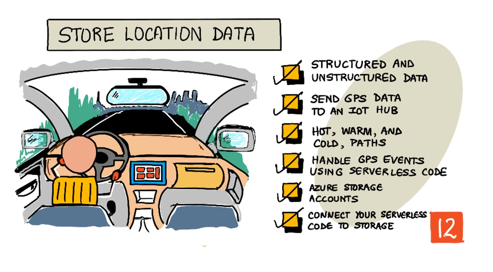
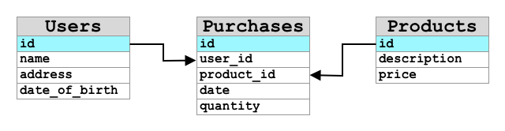
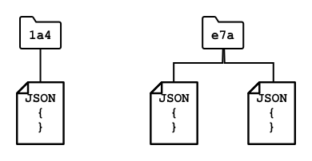
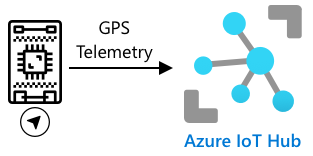
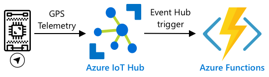
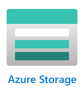
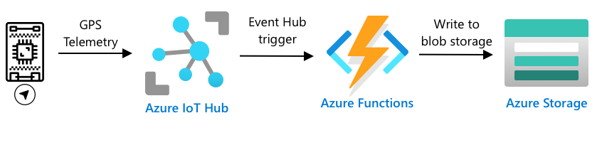

# 위치 데이터 저장



> [Nitya Narasimhan](https://github.com/nitya)의 스케치노트. 크게 보려면 클릭하세요.

## 강의 전 퀴즈

[강의 전 퀴즈](https://black-meadow-040d15503.1.azurestaticapps.net/quiz/23)

## 개요

지난 강의에서는 위치 정보를 캡처하기 위한 GPS 센서 사용법에 대해 배웠습니다. 이 데이터를 사용하여 음식을 실은 트럭으 위치와 이동 경로를 시각화 하기 위해서는 이 데이터가 클라우드의 IoT 서비스로 전송하고 어딘가에 저장해야 합니다.

이 강의에서는 IoT 데이터를 저장하는 다양한 방법과 서버리스 코드를 이용하여 IoT 서비스의 데이터를 저장하는 방법에 대해 배웁니다.

이 강의에서는 다음을 배웁니다:

- [정형 및 비정형 데이터](#정형-및-비정형-데이터)
- [IoT Hub로 GPS 데이터 전송하기](#IoT-Hub로-GPS-데이터-전송하기)
- [Hot, Warm, Cold 경로](#hot,-warm-cold-경로)
- [서버리스 코드를 이용한 GPS 이벤트 처리](#서버리스-코드를-이용한-GPS-이벤트-처리)
- [Azure Storage 계정](#Azure-Storage-계정)
- [서버리스 코드와 저장소 연결하기](#서버리스-코드와-저장소-연결하기)

## 정형 및 비정형 데이터

컴퓨터 시스템은 데이터를 다루고, 이 데이터는 다양한 모양과 크기로 제공됩니다. 단일 숫자에서 많은 양의 텍스트, 비디오 및 이미지, IoT 데이터까지 다양합니다. 데이터는 _정형 데이터_ 와 _비정형 데이터_ 두 가지 중 하나로 나눌 수 있습니다.

- **정형 데이터**는 변경되지 않는 잘 정의되고 엄격한 구조를 가진 데이터로, 일반적으로 관계가 있는 데이터 테이블에 매핑됩니다. 이름, 생년월일, 주소를 포함한 개인 정보를 예로 들 수 있습니다.

- **비정형 데이터** 는 잘 정의되고 엄격한 구조가 없는 데이터로, 자주 구조가 변경될 수 있는 데이터입니다. 문서나 스프레드 시트와 같은 것을 예로 들 수 있습니다.

✅ 조사해봅시다 : 정형 데이터와 비정형 데이터의 다른 예를 생각해 볼 수 있습니까?

> 💁 구조화는 되었지만 고정된 테이블에 맞지 않는 반정형 데이터도 존재합니다.

IoT 데이터는 주로 비정형 데이터로 간주됩니다.

대규모 상업 농장의 차량에 IoT 장치를 추가한다고 생각해봅시다. 차량 유형에 따라 다른 장치를 사용하기를 원할 것입니다. 예를 들어:

- 트랙터와 같은 농업용 차량의 경우 올바른 밭에서 동작하는지 확인하기 위한 GPS 데이터가 필요합니다.
- 식량을 창고로 나르는 배달 트럭의 경우 GPS 데이터는 물론이고 운전자가 안전하게 운전할 수 있도록 속도 및 가속 데이터를 제공하고, 운전자 식별 및 시작/정지 데이터를 제공하여 운전자가 근무 시간에 대한 현지 법률을 준수하도록 보장해야 합니다.
- 냉장 트럭의 경우 음식이 너무 뜨겁거나 차갑지 않고 운송 중에 상하지 않도록 온도 데이터도 필요합니다.

이러한 데이터는 지속적으로 변합니다. 예를 들어, 트럭 운전실에 IoT 장치가 있다면 트레일러가 변경된다면 전송하는 데이터가 변경될 수 있습니다. 예를 들어 냉장 트레일러를 사용할 때만 온도 데이터를 전송합니다.

✅ 다른 캡처되는 IoT 데이터 어떤 것이 있을까요? 트럭이 운반할 수 있는 화물의 종류와 유지 관리 데이터에 대해 생각해 보십시오.

이 데이터는 차량에 따라 변하지만 처리를 위해 모두 동일한 IoT 서비스로 전송됩니다. IoT 서비스는 이 비정형 데이터를 검색하거나 분석할 수 있는 방식으로 저장하면서 이 데이터와 다른 구조로도 작동할 수 있어야 합니다.

### SQL vs NoSQL 스토리지

데이터베이스는 데이터를 저장하고 쿼리할 수 있는 서비스입니다. 데이터 베이스는 SQL과 NoSQL 2개의 타입으로 나뉩니다.

#### SQL 데이터베이스

첫 번째 데이터베이스는 관계형 데이터베이스 관리 시스템(RDBMS) 또는 관계형 데이터베이스입니다. 이는 데이터를 추가, 제거, 업데이트 또는 쿼리하기 위해 SQL(Structured Query Language)을 사용하여 SQL 데이터베이스라고도 합니다. 이러한 데이터베이스는 스프레드시트와 유사한 잘 정의된 데이터 테이블 집합인 스키마로 구성됩니다. 각 테이블에는 여러 개의 명명된 열이 있습니다. 데이터를 삽입할 때 테이블에 행을 추가하여 각 열에 값을 넣습니다. 이렇게 하면 데이터가 매우 엄격한 구조로 유지됩니다. 열을 비워 둘 수 있지만 새 열을 추가하려면 데이터베이스에서 이 작업을 수행하여 기존 행의 값을 채워야 합니다. 이러한 데이터베이스는 한 테이블이 다른 테이블과 관계를 가질 수 있다는 점에서 관계형이라고 합니다.



예를 들어, 사용자 개인 정보를 테이블에 저장한 경우 사용자 이름과 주소가 포함된 테이블의 행에 사용되는 사용자당 내부 고유 ID가 있을 수 있습니다. 그런 다음 해당 사용자에 대한 구매 정보와 같은 다른 세부 정보를 다른 테이블에 저장하려는 경우, 해당 사용자 ID에 대한 하나의 열이 새 테이블에 저장됩니다. 사용자를 조회할 때 사용자 ID를 사용하여 한 테이블에서 사용자의 개인 정보를 가져오고 다른 테이블에서 구입한 사용자의 정보를 가져올 수 있습니다.
SQL 데이터베이스는 정형 데이터를 저장하고 데이터와 스키마가 매치하는지 확인하고자 하는 경우에 이상적입니다.

✅ 이전에 SQL을 사용해본 적이 없다면 잠시 시간을 내어 [SQL page on Wikipedia](https://wikipedia.org/wiki/SQL)에서 읽어보세요.

잘 알려진 SQL 데이터베이스로는 Microsoft SQL Server, MySQL, PostgreSQL이 있습니다.

✅ 조사해봅시다 : 이러한 몇몇 SQL 데이터베이스 및 기능에 대해 읽어봅시다.

#### NoSQL 데이터베이스

NoSQL 데이터베이스는 SQL 데이터베이스와 동일한 엄격한 구조를 가지고 있지 않기 때문에 NoSQL이라 불립니다. 또한 문서와 같은 구조화되지 않은 데이터를 저장할 수 있으므로 문서 데이터베이스라고도 불립니다.

> 💁 이름과는 무관하게 일부 NoSQL 데이터베이스에서는 SQL을 사용하여 데이터를 쿼리할 수 있습니다.



NoSQL 데이터베이스에는 데이터 저장 방법을 제한하는 미리 정의된 스키마가 없으며, 대신 일반적으로 JSON 문서를 사용하여 비정형 데이터를 삽입할 수 있습니다. 이러한 문서는 컴퓨터의 파일과 유사하게 폴더로 구성할 수 있습니다. 각 문서는 다른 문서와 다른 필드를 가질 수 있습니다. 예를 들어, 농장 차량의 IoT 데이터를 저장하는 경우 일부는 가속도계 및 속도 데이터를 위한 필드를 가질 수 있고, 다른 일부는 트레일러의 온도를 위한 필드를 가질 수 있습니다. 운반되는 농산물의 무게를 추적하기 위해 척도가 내장된 트럭과 같은 새로운 트럭 유형을 추가하는 경우, IoT장치가 해당 새로운 필드를 추가할 수 있고 그것은 데이터베이스를 변경하지 않고 저장될 수 있습니다.

잘 알려진 NoSQL 데이터베이스에는 Azure CosmosDB, MongoDB, CouchDB가 있습니다.

✅ 조사해봅시다 : 이러한 몇몇 NoSQL 데이터베이스 및 기능에 대해 읽어봅시다.
이 강의에서는 IoT 데이터를 저장하기 위해 NoSQL을 사용합니다.

## IoT Hub로 GPS 데이터 전송하기

지난 강의에서는 IoT 장치에 연결된 GPS 센서로부터 GPS 데이터를 캡처했습니다. IoT 데이터를 클라우드에 저장하기 위해서 그것을 IoT 서비스로 보내야합니다. 이전 프로젝트에서 사용한 것과 동일한 IoT 클라우드 서비스인 Azure IoT Hub를 다시 한 번 사용하게 됩니다.



### 작업 - GPS 데이터를 IoT Hub로 전송하기

1. free 티어를 사용해서 새로운 IoT Hub를 생성합니다.

   > ⚠️ 필요하다면 [프로젝트 2의 Lesson 4에서 IoT Hub 생성을 위한 지침](../../../../2-farm/lessons/4-migrate-your-plant-to-the-cloud/README.md#create-an-iot-service-in-the-cloud) 을 참조할 수 있습니다.

   새로운 리소스 그룹을 생성해야합니다. 새 리소스 그룹을 `gps-sensor`라고 지정하고, 새로운 IoT Hub의 이름을 `gps-sensor-<your name>`과 같이 `gps-sensor`에 기반한 고유한 이름으로 지정합니다.

   > 💁 이전 프로젝트에서 사용한 IoT Hub를 가지고 있다면 그것을 재사용해도 좋습니다. 다른 서비스를 만들 때 이 IoT Hub의 이름과 해당 서비스가 속한 리소스 그룹을 사용해야 합니다.

1. IoT Hub에 새 장치를 추가합니다. 해당 장치를 `gps-sensor`라 부릅니다. 장치의 연결 문자열을 가져옵니다.

1. 이전 단계의 장치 연결 문자열을 사용하여 GPS 데이터를 새로운 IoT 허브로 전송하도록 디바이스 코드를 업데이트합니다.

   > ⚠️ 필요한 경우 [프로젝트 2의 lesson 4에서 IoT와 장치를 연결하는 방법](../../../../2-farm/lessons/4-migrate-your-plant-to-the-cloud/README.md#connect-your-device-to-the-iot-service)을 참조할 수 있습니다.

1. GPS data를 전송할 때 다음 형식의 JSON으로 보냅니다:

   ```json
      {
         "gps" :
         {
            "lat" : <latitude>,
            "lon" : <longitude>
         }
      }
   ```

1. GPS 데이터를 1분마다 보내서 일일 메세지 할당량을 모두 사용하지 않도록 합니다.

Wio Terminal을 사용한다면 필요한 라이브러리들을 모두 추가하고 NTP serer에서 사용하여 시간을 설정해야 합니다. 또한 코드는 지난 수업의 기존 코드를 사용하여 GPS 위치를 보내기 전에 직렬 포트에서 모든 데이터를 읽었는지 확인해야 합니다. 다음 코드를 사용하여 JSON 문서를 생성합니다:

```cpp
DynamicJsonDocument doc(1024);
doc["gps"]["lat"] = gps.location.lat();
doc["gps"]["lon"] = gps.location.lng();
```

가상 IoT 장치를 사용하는 경우 가상 환경을 사용하여 필요한 라이브러리들을 모두 설치해야합니다.

Raspberry Pi나 가상 IoT 장치 모두 이전 강의의 기존 코드를 사용하여 위도 및 경도 값을 가져온 후 다음 코드를 사용하여 올바른 JSON 형시으로 전송합니다:

```python
message_json = { "gps" : { "lat":lat, "lon":lon } }
print("Sending telemetry", message_json)
message = Message(json.dumps(message_json))
```

> 💁 해당 코드는 [code/wio-terminal](../code/wio-terminal), [code/pi](../code/pi) or [code/virtual-device](../code/virtual-device) 폴더에 있습니다.
> 디바이스 코드를 실행하고 CLI 명령 을 사용하여 메시지가 IoT Hub로 흘러들어가고 있는지 확인합니다 .

## Hot, Warm, Cold 경로

IoT 장치에서 클라우드로 전송되는 데이터들이 항상 실시간으로 처리되는 것은 아닙니다. 어떤 데이터는 실시간 처리가 필요하고, 다른 데이터는 짧은 시간 뒤에 처리될 수 있으며, 또 다른 데이터는 훨씬 더 나중에 처리되어도 됩니다. 서로 다른 시간에 데이터를 처리하는 서로 다른 서비스로의 데이터 흐름을 Hot 경로, Warm 경로, Cold 경로라고 합니다.

### Hot 경로

Hot 경로는 실시간으로 처리되거나 거의 실시간에 근접하게 처리되어야 하는 데이터를 말합니다. 차량이 차고에 접근하고 있거나 냉장 트럭의 온도가 너무 높다는 경고를 받는 등의 경고에 Hot 경로 데이터를 사용할 수 있습니다.

Hot 경로 데이터를 사용하기 위해서 코드는 클라우드 서비스에서 이벤트를 수신하는 즉시 이벤트에 응답합니다.

### Warm 경로

Warm 경로는 수신 후 짧은 시간 동안 보고 또는 단기 분석같은 처리할 수 있는 데이터를 말합니다. 전날 수집된 데이터를 사용하는 차량 주행 거리에 대한 일일 보고서에 웜 경로 데이터를 사용할 수 있습니다.
Warm 경로 데이터는 빠르게 액세스할 수 있는 일종의 스토리지 내부의 클라우드 서비스에서 수신한 후 저장됩니다.

### Cold 경로

Cold 경로는 과거 데이터를 말하며 데이터를 장기간 저장하여 필요할 때마다 처리합니다. 예를 들어, Cold 경로를 사용하여 차량의 연간 주행 거리 보고서를 얻거나, 경로 분석을 실행하여 연료 비용을 절감할 수 있는 최적의 경로를 찾을 수 있습니다.

Cold 경로 데이터는 절대 변경되지 않고 빠르고 쉽게 쿼리할 수 있는 대량의 데이터를 저장하도록 설계된 데이터베이스인 데이터 웨어하우스에 저장됩니다. 일반적으로 클라우드 애플리케이션에서는 매일, 매주 또는 매월 정기적으로 실행되어 Warm 경로 스토리지에서 데이터 웨어하우스로 데이터를 이동하는 정기적인 작업을 수행합니다.

✅ 이 강의에서 지금까지 캡처한 데이터에 대해 생각해 봅시다. Hot 경로, Warm 경로, Cold 경로 중 어떤 데이터 입니까?

## 서버리스 코드를 이용한 GPS 이벤트 처리

데이터가 IoT 허브로 유입되면 서버리스 코드를 작성하여 Event-Hub와 호환되는 엔드포인트에 게시된 이벤트를 수신 대기할 수 있습니다. 이 경로는 Warm 경로입니다. 이 데이터는 다음 레슨에서의 여정 보고를 위해 저장되고 사용됩니다.



### 작업 - 서버리스 코드를 이용하여 GPS 이벤트 처리하기

1. Azure Functions CLI를 사용하여 Azure Functions App을 생성합니다. 파이썬 런타임을 사용하여 `gps-trigger` 폴더 안에에 만들고 Functions App 프로젝트 이름에도 동일한 이름을 사용합니다. 이 작업에 사용할 가상 환경을 생성해야 합니다.

   > ⚠️ 필요한 경우 [프로젝트 2의 Lesson 5에서 Azure Functions Project 생성을 위한 지침](../../../../2-farm/lessons/5-migrate-application-to-the-cloud/README.md#create-a-serverless-application)을 참조할 수 있습니다.

1. IoT Hub의 Event Hub 호환 엔드포인트를 사용하는 IoT Hub 이벤트 트리거를 추가합니다.

   > ⚠️ 필요한 경우 [프로젝트 2의 Lesson 5에서 IoT Hub 이벤트 트리거 생성을 위한 지침](../../../../2-farm/lessons/5-migrate-application-to-the-cloud/README.md#create-an-iot-hub-event-trigger)을 참조할 수 있습니다.

1. `local.settings.json` 파일에서 Event Hub 호환 엔드포인트 연결 문자열을 설정하고 `function.json` 파일에서 해당 항목에 대한 키를 사용합니다.

1. Azurite app을 로컬 저장 에뮬레이터로 사용합니다.

1. functions app을 실행하여 GPS 장치에서 이벤트를 수신하고 있는지 확인합니다. IoT 장치도 실행 중이고 GPS 데이터를 전송하고 있는지 확인하십시오.
   ```output
   Python EventHub trigger processed an event: {"gps": {"lat": 47.73481, "lon": -122.25701}}
   ```

## Azure Storage 계정



Azure Storage 계정은 다양한 방식으로 데이터를 저장할 수 있는 범용 스토리지 서비스입니다. 데이터를 Blob, 큐, 테이블 또는 파일로 동시에 저장할 수 있습니다.

### Blob 스토리지

_Blob_ 이라는 단어는 이진 대형 개체를 의미하지만, 구조화되지 않은 모든 데이터를 가리키는 용어가 되었습니다. IoT 데이터가 포함된 JSON 문서에서 이미지 및 동영상 파일에 이르기까지 모든 데이터를 Blob 스토리지에 저장할 수 있습니다. Blob 스토리지에는 관계형 데이터베이스의 테이블과 유사하게 데이터를 저장할 수 있는 bucket이라는 _컨테이너_ 개념이 있습니다. 이러한 컨테이너에는 Blob을 저장할 하나 이상의 폴더가 있을 수 있으며, 각 폴더에는 파일이 컴퓨터 하드 디스크에 저장되는 방식과 유사하게 다른 폴더가 포함될 수 있습니다.

이번 강의에서는 IoT 데이터를 저장하기 위해 Blob 스토리지를 사용합니다.

✅ 조사하기: [Azure Blob Storage](https://docs.microsoft.com/azure/storage/blobs/storage-blobs-overview?WT.mc_id=academic-17441-jabenn)에 대해 읽어보세요.

### Table 스토리지

Table 스토리지는 반정형 데이터를 저장할 수 있습니다. Table 스토리지는 실제로 NoSQL 데이터베이스이므로 미리 정의된 테이블 집합이 필요하지 않지만 각 행을 정의하는 고유 키를 사용하여 하나 이상의 테이블에 데이터를 저장하도록 설계되었습니다.

✅ 조사하기: [Azure Table Storage](https://docs.microsoft.com/azure/storage/tables/table-storage-overview?WT.mc_id=academic-17441-jabenn)에 대해 읽어보세요.

### Queue 스토리지

Queue 스토리지를 사용하면 최대 64KB 크기의 메시지를 큐에 저장할 수 있습니다. Queue의 뒤에 메시지를 추가하고 앞에서 읽어나갈 수 있습니다. Queue는 저장 공간이 있는 한 메시지를 무기한 저장하므로 메시지를 장기간 저장하고 필요할 때 읽을 수 있습니다. 예를 들어 GPS 데이터를 처리하기 위해 매달 작업을 실행하려는 경우 한 달 동안 매일 작업을 Queue에 추가한 다음 월말에 모든 메시지를 Queue에서 처리할 수 있습니다.

✅ 조사하기: [Azure Queue Storage](https://docs.microsoft.com/azure/storage/queues/storage-queues-introduction?WT.mc_id=academic-17441-jabenn)에 대해 읽어보세요.

### 파일 스토리지

파일 스토리지는 클라우드의 파일 저장소이며 모든 앱 또는 장치와 업계 표준 프로토콜을 사용하여 연결할 수 있습니다. 파일 스토리지에 파일을 쓴 다음 PC 또는 Mac의 드라이브로 마운트할 수 있습니다.

✅ 조사하기: [Azure File Storage](https://docs.microsoft.com/azure/storage/files/storage-files-introduction?WT.mc_id=academic-17441-jabenn)에 대해 읽어보세요.

## 서버리스 코드와 저장소 연결하기

이제 IoT Hub의 메시지를 저장하기 위해 function app을 Blob Storage에 연결해야 합니다. 이를 수행하는 방법에는 두 가지가 있습니다:

- function 코드 내에서 Blob 스토리지 Python SDK를 사용하여 Blob 스토리지에 연결하고 데이터를 Blob으로 작성합니다.
- 출력 함수 바인딩을 사용하여 함수의 반환 값을 Blob 스토리지에 바인딩하고 Blob을 자동으로 저장합니다.

이 강의에서는 Blob 스토리지와 어떻게 상호작용 하는지 확인하기 위해 Python SDK를 사용합니다.



데이터는 다음 형식의 JSON Blob으로 저장됩니다:

```json
{
    "device_id": <device_id>,
    "timestamp" : <time>,
    "gps" :
    {
        "lat" : <latitude>,
        "lon" : <longitude>
    }
}
```

### 작업 - 서버리스 코드와 저장소 연결하기

1. Azure Storage 계정을 생성합니다. 이름을 `gps<your name>`과 같이 지정합니다.

   > ⚠️ 필요한 경우 [프로젝트 2의 Lesson 5에서 저장소 계정 생성을 위한 지침](../../../../2-farm/lessons/5-migrate-application-to-the-cloud/README.md#task---create-the-cloud-resources)을 읽어보세요.

   이전 프로젝트에서 사용한 스토리지 계정이 아직 있다면 이를 다시 사용할 수 있습니다.

   > 💁 이 단원의 뒷부분에서 동일한 저장소 계정을 사용하여 Azure Functions 앱을 배포할 수 있습니다.

1. 다음 명령을 실행하여 스토리지 계정에 대한 연결 문자열을 가져옵니다.

   ```sh
   az storage account show-connection-string --output table \
                                             --name <storage_name>
   ```

   `<storage_name>`을 이전 단계에서 만든 스토리지 계정의 이름으로 변경합니다.

1. 이전 단계의 값을 사용하여 스토리지 계정 연결 문자열에 대한 새 항목을 `local.settings.json` 파일에 추가합니다. 이름을 `STORAGE_CONNECTION_STRING`으로 지정하십시오.

1. `requirements.txt` 파일에 다음 내용을 추가하여 Azure storage Pip 패키지를 설치합니다 :

   ```sh
   azure-storage-blob
   ```

   가상 환경에 이 파일의 패키지들을 설치합니다.

   > 오류가 발생하면 다음 명령을 사용하여 가상 환경의 Pip 버전을 최신 버전으로 업그레이드한 후 다시 시도하십시오.
   >
   > ```sh
   > pip install --upgrade pip
   > ```

1. `__init__.py` 파일의 `iot-hub-trigger`에 다음 import문을 추가합니다:

   ```python
   import json
   import os
   import uuid
   from azure.storage.blob import BlobServiceClient, PublicAccess
   ```

   `json` 시스템 모듈은 JSON을 읽어오고 작성하는 데 사용됩니다. `os` 시스템 모듈은 연결 문자열을 읽어오는 데 사용됩니다. `uuid` 시스템 모듈은 GPS 판독을 위한 고유 ID를 생성하는 데 사용됩니다.

   `azure.storage.blob` 패키지는 Blob 스토리지에서 작동하는 Python SDK가 포함되어 있습니다.

1. `main` 메서드 앞에 다음 도우미 함수를 추가합니다:

   ```python
   def get_or_create_container(name):
       connection_str = os.environ['STORAGE_CONNECTION_STRING']
       blob_service_client = BlobServiceClient.from_connection_string(connection_str)

       for container in blob_service_client.list_containers():
           if container.name == name:
               return blob_service_client.get_container_client(container.name)

       return blob_service_client.create_container(name, public_access=PublicAccess.Container)
   ```

   Python blob SDK에는 컨테이너가 없는 경우 컨테이너를 만드는 도우미 메서드가 없습니다. 이 코드는 `local.settings.json` 파일(또는 클라우드에 배포된 이후 애플리케이션 설정)에서 연결 문자열을 로드한 다음, 여기에서 `BlobServiceClient` 클래스를 만들어 blob 스토리지 계정과 상호 작용합니다. 그런 다음 blob 저장소 계정에 대한 모든 컨테이너를 순회하여 제공된 이름을 가진 컨테이너를 찾습니다. 해당 컨테이너를 찾으면 해당 컨테이너와 상호 작용하여 blob을 만들 수 있는 `ContainerClient` 클래스를 반환합니다. 컨테이너가 발견되지 않으면 컨테이너가 생성되고 새 컨테이너의 클라이언트가 반환됩니다.

   새 컨테이너가 생성되면 컨테이너의 Blob을 쿼리할 수 있는 공용 액세스 권한이 부여됩니다. 이것은 다음 강의에서 GPS 데이터를 지도에 시각화하는 데 사용됩니다.

1. 토양 수분과는 달리 이 코드를 사용하면 모든 이벤트를 저장할 수 있으므로 다음 코드를 `main` 함수의 `logging` 문 아래에 있는 `for event in events:` 루프 안에 추가합니다:

   ```python
   device_id = event.iothub_metadata['connection-device-id']
   blob_name = f'{device_id}/{str(uuid.uuid1())}.json'
   ```

   이 코드는 이벤트 메타데이터에서 장치 ID를 가져온 다음 이를 사용하여 Blob 이름을 만듭니다. Blob은 폴더에 저장될 수 있으며 장치 ID는 폴더 이름에 사용되므로 각 장치는 하나의 폴더에 모든 GPS 이벤트를 포함합니다. Blob 이름은 이 폴더 다음에 슬래시로 구분된 문서 이름으로, Linux 및 macOS 경로와 유사합니다(Windows와 유사하지만 Windows는 백슬래시를 사용함). 문서 이름은 Python의 `uuid` 모듈을 사용하여 생성된 고유 ID이며 파일 형식은 `json`을 사용합니다.

   예를 들어, `gps-sensor` 디바이스 ID의 경우 Blob 이름은 `gps-sensor/a9487ac2-b9cf-11eb-b5cd-1e00621e3648.json`이 됩니다.

1. 이 뒤에 다음 코드를 추가합니다:

   ```python
   container_client = get_or_create_container('gps-data')
   blob = container_client.get_blob_client(blob_name)
   ```

   이 코드는 `get_or_create_container` 도우미 클래스를 사용하여 컨테이너 클라이언트를 가져온 다음 blob 이름을 사용하여 blob 클라이언트 개체를 가져옵니다. 이러한 blob 클라이언트는 기존 blob을 참조하거나, 이 경우처럼 새로운 blob을 참조할 수 있습니다.

1. 이 뒤에 다음 코드를 추가합니다:

   ```python
   event_body = json.loads(event.get_body().decode('utf-8'))
   blob_body = {
       'device_id' : device_id,
       'timestamp' : event.iothub_metadata['enqueuedtime'],
       'gps': event_body['gps']
   }
   ```

   이렇게 하면 Blob Storage에 기록될 Blob의 본문이 빌드됩니다. 이는 장치 ID, 원격 분석이 IoT Hub로 전송된 시간 및 원격 분석의 GPS 좌표가 포함하는 JSON 문서입니다.

   > 💁 메시지가 전송된 시간을 가져오려면 현재 시간이 아니라 메시지의 대기열에 포함된 시간을 사용하는 것이 중요합니다. Functions App이 실행되고 있지 않으면 선택되기 전에 잠시 동안 허브에 있을 수 있습니다.

1. 이 코드 아래에 다음을 추가합니다:

   ```python
   logging.info(f'Writing blob to {blob_name} - {blob_body}')
   blob.upload_blob(json.dumps(blob_body).encode('utf-8'))
   ```

   이 코드는 blob이 세부 정보와 함께 작성될 예정임을 기록한 다음, blob 본문을 새 blob의 내용으로 업로드합니다.

1. Functions app을 실행합니다. 출력에서 모든 GPS 이벤트에 대해 Blob이 작성되는 것을 볼 수 있습니다.

   ```output
   [2021-05-21T01:31:14.325Z] Python EventHub trigger processed an event: {"gps": {"lat": 47.73092, "lon": -122.26206}}
   ...
   [2021-05-21T01:31:14.351Z] Writing blob to gps-sensor/4b6089fe-ba8d-11eb-bc7b-1e00621e3648.json - {'device_id': 'gps-sensor', 'timestamp': '2021-05-21T00:57:53.878Z', 'gps': {'lat': 47.73092, 'lon': -122.26206}}
   ```

   > 💁 동시에 IoT Hub 이벤트 모니터를 실행하고 있지는 않은지 확인합니다.

> 💁 해당 코드는 [code/functions](../code/functions) 폴더에 있습니다.

### 작업 - 업로드된 Blob 확인

1. 생성된 blob을 보려면 스토리지 계정을 보고 관리할 수 있는 무료 도구인 [Azure Storage Explorer](https://azure.microsoft.com/features/storage-explorer/?WT.mc_id=cademic-17441-jaben)를 사용하거나 CLI에서 확인할 수 있습니다.

   1. CLI를 사용하기 위해서는 우선적으로 계정 key가 필요합니다. 다음 명령어를 실행하여 해당 key를 얻습니다:

      ```sh
      az storage account keys list --output table \
                                   --account-name <storage_name>
      ```

      `<storage_name>`을 스토리지 계정의 이름으로 수정합니다.

      `key1`의 값을 복사합니다.

   1. 다음 명령어를 실행하여 컨테이너의 Blob을 나열합니다.

      ```sh
      az storage blob list --container-name gps-data \
                           --output table \
                           --account-name <storage_name> \
                           --account-key <key1>
      ```

      `<storage_name>` 을 스토리지 계정의 이름으로 바꾸고, `<key1>`값을 이전 단계에서 복사한 `<key1>` 값으로 바꿉니다.

      그러면 컨테이너의 모든 Blob이 나열됩니다:

      ```output
      Name                                                  Blob Type    Blob Tier    Length    Content Type              Last Modified              Snapshot
      ----------------------------------------------------  -----------  -----------  --------  ------------------------  -------------------------  ----------
      gps-sensor/1810d55e-b9cf-11eb-9f5b-1e00621e3648.json  BlockBlob    Hot          45        application/octet-stream  2021-05-21T00:54:27+00:00
      gps-sensor/18293e46-b9cf-11eb-9f5b-1e00621e3648.json  BlockBlob    Hot          45        application/octet-stream  2021-05-21T00:54:28+00:00
      gps-sensor/1844549c-b9cf-11eb-9f5b-1e00621e3648.json  BlockBlob    Hot          45        application/octet-stream  2021-05-21T00:54:28+00:00
      gps-sensor/1894d714-b9cf-11eb-9f5b-1e00621e3648.json  BlockBlob    Hot          45        application/octet-stream  2021-05-21T00:54:28+00:00
      ```

   1. 다음 명령어를 이용하여 blob 중 하나를 다운로드 합니다:

      ```sh
      az storage blob download --container-name gps-data \
                               --account-name <storage_name> \
                               --account-key <key1> \
                               --name <blob_name> \
                               --file <file_name>
      ```

      `<storage_name>`를 스토리지 계정의 이름으로 바꿉니다. `<key1>` 값을 이전 단계에서 복사한 `<key1>` 값으로 바꿉니다.

      폴더 이름을 포함하여 마지막 단계 출력의 `Name` 열에 있는 전체 이름으로 `<blob_name>`을 바꿉니다. `<file_name>`을 blob을 저장할 로컬 파일의 이름으로 바꿉니다.

   다운로드가 완료되면 이 JSON 파일을 VS Code에서 열 수 있으며 GPS 위치 세부 정보가 포함된 Blob이 표시됩니다:

   ```json
   {
     "device_id": "gps-sensor",
     "timestamp": "2021-05-21T00:57:53.878Z",
     "gps": { "lat": 47.73092, "lon": -122.26206 }
   }
   ```

### 업무 - Functions App을 클라우드에 배포가히

이제 Function app이 작동하므로 클라우드에 배포할 수 있습니다.

1. 이전에 생성한 스토리지 계정을 사용하여 새로운 Azure Functions app을 생성합니다. `gps-sensor-`와 같이 이름을 지정하고 끝 부분에 임의의 단어나 이름과 같은 고유 식별자를 추가합니다.

   > ⚠️ 필요하다면 [프로젝트 2의 Lesson 5에서 Functions app을 생성하기 위한 지침](../../../../2-farm/lessons/5-migrate-application-to-the-cloud/README.md#task---create-the-cloud-resources)을 읽어보세요.

1. `IOT_HUB_CONNECTION_STRING`과 `STORAGE_CONNECTION_STRING` 값을 Application 설정에 업로드합니다.

   > ⚠️ 필요하다면 [프로젝트 2의 Lesson 5에서 Application 설정 업로드를 위한 지침](../../../../2-farm/lessons/5-migrate-application-to-the-cloud/README.md#task---upload-your-application-settings)을 읽어보세요.

1. 로컬에 있는 Functions app을 클라우드로 배포합니다.

   > ⚠️ 필요하다면 [프로젝트 2의 Lesson 5에서 Functions app 배포를 위한 지침](../../../../2-farm/lessons/5-migrate-application-to-the-cloud/README.md#task---deploy-your-functions-app-to-the-cloud)을 읽어보세요.

---

## 🚀 도전

GPS 데이터는 완벽하게 정확하지 않으며, 특히 터널과 높은 건물의 지역에서 감지되는 위치는 수 미터 정도 떨어져 있을 수 있습니다.

위성 내비게이션이 이를 어떻게 이것을 극복할 수 있을지 생각해 보세요. 위성 내비게이션이 당신의 위치를 더 잘 예측할 수 있게 해주는 데이터에는 무엇이 있습니까?

## 강의 후 퀴즈

[강의 후 퀴즈](https://black-meadow-040d15503.1.azurestaticapps.net/quiz/24)

## 복습 및 자습

- 정형 데이터에 대해 [Data model page on Wikipedia](https://wikipedia.org/wiki/Data_model)에서 더 읽어보세요.
- 반정형 데이터에 대해 [Semi-structured data page on Wikipedia](https://wikipedia.org/wiki/Semi-structured_data)에서 더 읽어보세요
- 비정형 데이터에 대해 [Unstructured data page on Wikipedia](https://wikipedia.org/wiki/Unstructured_data)에서 더 읽어보세요
- Azure 스토리지와 다른 스토리지 타임에 대해 더 알아보고 싶다면 [Azure Storage documentation](https://docs.microsoft.com/azure/storage/?WT.mc_id=academic-17441-jabenn)를 참고하세요.

## 과제

[함수 바인딩 조사](../assignment.md)
