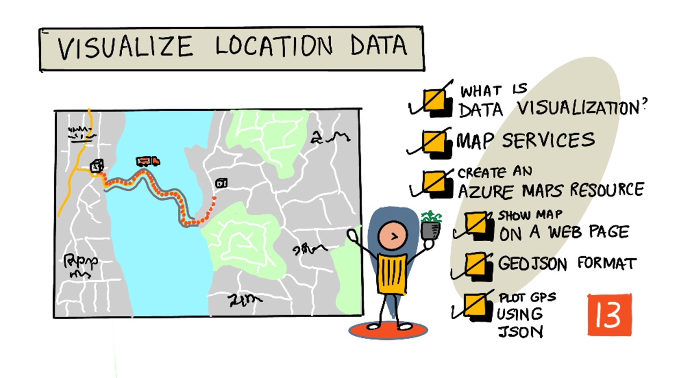
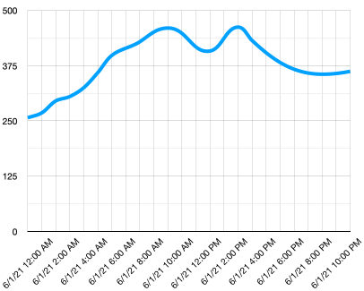
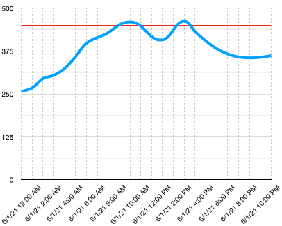
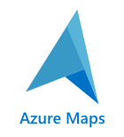
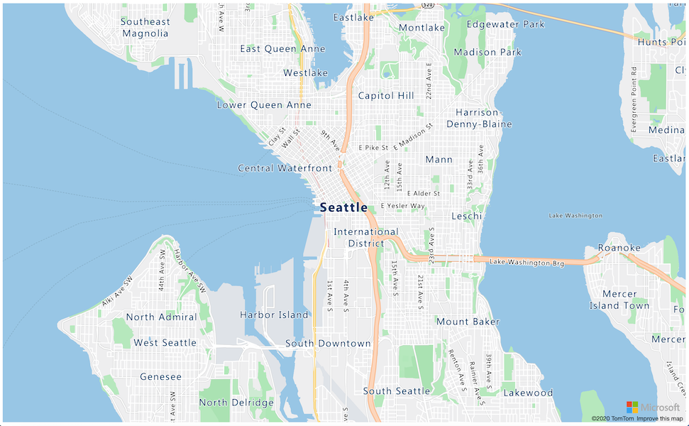
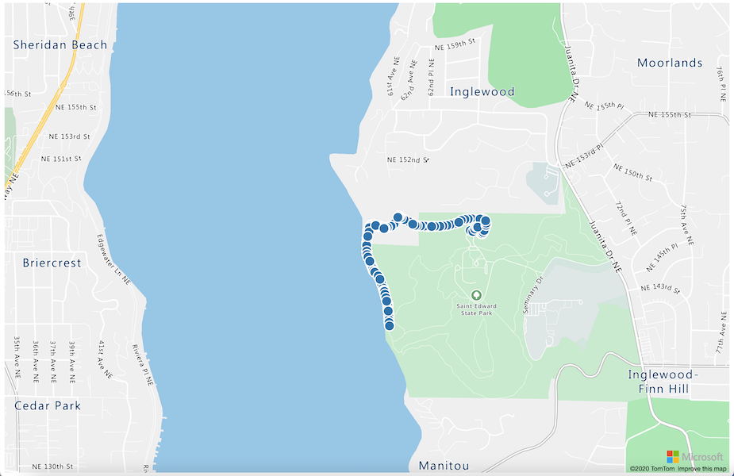

# লোকেশন ডেটা প্রদর্শন



> স্কেচনোটটি তৈরী করেছেন [Nitya Narasimhan](https://github.com/nitya)। বড় সংস্করণে দেখার জন্য ছবিটিতে ক্লিক করতে হবে।

## লেকচার-পূর্ববর্তী কুইজ

[লেকচার-পূর্ববর্তী কুইজ](https://brave-island-0b7c7f50f.azurestaticapps.net/quiz/25)

## সূচনা

গত পাঠে আমরা শিখেছি কিভাবে সার্ভারবিহীন কোড ব্যবহার করে স্টোরেজ কন্টেইনারে ক্লাউডে সংরক্ষণ করতে আমাদেরকে সেন্সর থেকে জিপিএস ডেটা পেতে হয়। এখন আমরা দেখবো কিভাবে একটি Azure ম্যাপে সেই পয়েন্টগুলি দেখানো যায়। আমরা একটি ওয়েব পেজে একটি মানচিত্র তৈরি করতে শিখব, GeoJSON ডেটা ফরম্যাট এবং আমাদেরকে ম্যাপে ক্যাপচার করা সমস্ত জিপিএস পয়েন্ট প্লট করার জন্য এটি কীভাবে ব্যবহার করতে হবে তা শিখব।

এই লেসনে আমরা দেখবোঃ

* [ডেটা ভিস্যুয়ালাইজেশন কী ?](#ডেটা-ভিস্যুয়ালাইজেশন-কী)
* [ম্যাপ সার্ভিস](#ম্যাপ-সার্ভিস)
* [Azure Maps রিসোর্স তৈরী করা](#Azure-Maps-রিসোর্স-তৈরী-করা)
* [ওয়েব  পেইজে ম্যাপ প্রদর্শন](#ওয়েব-পেইজে-ম্যাপ-প্রদর্শন)
* [GeoJSON ফরম্যাট](#geojson-ফরম্যাট)
* [GeoJSON দ্বারা ম্যাপে জিপিএস ডেটা প্লট করা](#GeoJSON-দ্বারা-ম্যাপে-জিপিএস-ডেটা-প্লট-করা)

> 💁 এই লেসনে HTML এবং JavaScript এর ব্যবহার থাকবে। এই ল্যাংগুয়েজগুলো ব্যবহার করে ওয়েব ডেভলাপমেন্ট বিষয়ে আরো জানতে চাইলে [Web development for beginners](https://github.com/microsoft/Web-Dev-For-Beginners) কারিক্যুলাম দেখতে পারি।

## ডেটা ভিস্যুয়ালাইজেশন কী

ডেটা দৃশ্যায়ন বা ভিস্যুয়ালাইজেশন, নাম  থেকেই বোঝা যায়, ডেটা ভিজুয়ালাইজ বা প্রদর্শন করা হয় এমন উপায়ে যা মানুষের পক্ষে বোঝা সহজ হয়। এটি সাধারণত চার্ট এবং গ্রাফের সাথে যুক্ত থাকে, মানুষকে কেবল তথ্য উপাত্তকে আরও ভালভাবে বুঝতে সাহায্য করার পাশাপাশি, তাদের প্রয়োজনীয় সিদ্ধান্ত নিতেও সাহায্য করে।

একটি সহজ উদাহরণ নিই- শুরুর দিকের একটি প্রজেক্টে আমরা মাটির আর্দ্রতা সংগ্রহ করেছি । ১লা জুন ২০২১ -এর জন্য প্রতি ঘণ্টায় মাটির আর্দ্রতার তথ্যের একটি টেবিল নিম্নরূপ :

| সময়             | মান     |
| ---------------- | ------: |
| 01/06/2021 00:00 |     257 |
| 01/06/2021 01:00 |     268 |
| 01/06/2021 02:00 |     295 |
| 01/06/2021 03:00 |     305 |
| 01/06/2021 04:00 |     325 |
| 01/06/2021 05:00 |     359 |
| 01/06/2021 06:00 |     398 |
| 01/06/2021 07:00 |     410 |
| 01/06/2021 08:00 |     429 |
| 01/06/2021 09:00 |     451 |
| 01/06/2021 10:00 |     460 |
| 01/06/2021 11:00 |     452 |
| 01/06/2021 12:00 |     420 |
| 01/06/2021 13:00 |     408 |
| 01/06/2021 14:00 |     431 |
| 01/06/2021 15:00 |     462 |
| 01/06/2021 16:00 |     432 |
| 01/06/2021 17:00 |     402 |
| 01/06/2021 18:00 |     387 |
| 01/06/2021 19:00 |     360 |
| 01/06/2021 20:00 |     358 |
| 01/06/2021 21:00 |     354 |
| 01/06/2021 22:00 |     356 |
| 01/06/2021 23:00 |     362 |

একজন সাধারণ মানুষ হিসাবে, এই ডেটা বোঝা কঠিন হতে পারে। এটি কোন অর্থ ছাড়া সংখ্যার একটি প্রাচীর মাত্র। এই ডেটা ভিজ্যুয়ালাইজ করার প্রথম পদক্ষেপ হিসাবে, এটি একটি লাইন চার্টে প্লট করা যেতে পারে:



এই লাইন চার্টটি আরো উন্নত করা যেতে পারে যদি আমরা মাটির আর্দ্রতার মান 450 হলে, স্বয়ংক্রিয় জল ব্যবস্থা চালু করা হয়েছিল এটি বোঝাতে একটি লাইন টেনে দিই।



এই চার্টটি খুব তাড়াতাড়ি দেখায় যে মাটির আর্দ্রতার মাত্রা কত ছিল এবং ঠিক কোন পয়েন্ট থেকে সেচ ব্যবস্থা চালু হয়েছিল।

ডেটা ভিজ্যুয়ালাইজ করার জন্য চার্টই একমাত্র হাতিয়ার নয়। আইওটি ডিভাইসগুলি যেগুলি আবহাওয়া ট্র্যাক করে সেগুলিতে ওয়েব অ্যাপস বা মোবাইল অ্যাপ থাকতে পারে যা বিভিন্ন প্রতীক ব্যবহার করে আবহাওয়ার অবস্থা  যেমন মেঘলা দিনের জন্য মেঘের প্রতীক, বৃষ্টির দিনের জন্য বৃষ্টির চিহ্ন ইত্যাদি। ডেটা ভিজ্যুয়ালাইজ করার অনেক উপায় আছে, কিছু বেশ সিরিয়াস, আবার কিছু অনেক মজার।

✅ আমরা ডেটা ভিজ্যুয়ালাইজেশনের যেসব উপায় ইতোমধ্যে দেখেছি, সে সম্পর্কে চিন্তা করি। কোন পদ্ধতিগুলি সবচেয়ে পরিষ্কার এবং দ্রুততম সিদ্ধান্ত নেওয়ার সুযোগ দেয় ?

ভালো ভিজ্যুয়ালাইজেশনগুলি মানুষকে দ্রুত সিদ্ধান্ত নিতে সহায়তা করে। উদাহরণস্বরূপ, শিল্প যন্ত্রপাতি থেকে সব ধরনের রিডিং স্ক্রিনে দেখানো হলে, এগুলো বিশ্লেষণ করা কঠিন। কিন্তু যদি আমরা যেকোন সমস্যাজনক পরিস্থিতিতে একটি লাল বাতি জ্বালাই, তাহলে একজন মানুষ সহজে সিদ্ধান্ত নিতে পারে।

জিপিএস ডেটা নিয়ে কাজ করার সময় সবচেয়ে স্পষ্ট দৃশ্যায়ন হলো একটি মানচিত্রে ডেটা প্লট করা। উদাহরণস্বরূপ ডেলিভারি ট্রাক এর অবস্থাম দেখানো একটি মানচিত্র, একটি কারখানার শ্রমিকদের ট্রাক কখন আসবে তা দেখতে সাহায্য করতে পারে। যদি এই মানচিত্রটি তাদের বর্তমান অবস্থানে ট্রাকের শুধু ছবি দেখানোর পাশাপাশি ট্রাকের অন্যান্য তথ্য সম্পর্কে ধারণা দেয়, তাহলে প্লান্টের শ্রমিকরা সেই অনুযায়ী পরিকল্পনা করতে পারে। যদি তারা তাদের কারখানার কাছাকাছি একটি রেফ্রিজারেটেড ট্রাক দেখতে পায় তবে তারা দ্রুত প্রস্তুতি নিতে পারে।

## ম্যাপ সার্ভিস

মানচিত্র নিয়ে কাজ করা বেশ চিত্তাকর্ষক একটি  কাজ। ম্যাপের জন্য অনেকগুলো সার্ভিস যেমন Bing মানচিত্র, লিফলেট, ওপেন স্ট্রিট মানচিত্র এবং গুগল মানচিত্র থেকে বেছে নেওয়া যায়। এই লেসনে আমরা [Azure Maps](https://azure.microsoft.com/services/azure-maps/?WT.mc_id=academic-17441-jabenn) নিয়ে আরো বিস্তারিত জানবো এবং কীভাবে ডেটা প্লট করা হবে তা শিখবো



Azure ম্যাপ হলো ভূ-স্থানিক পরিষেবা এবং SDK- এর একটি সংগ্রহ যা ওয়েব এবং মোবাইল অ্যাপ্লিকেশনগুলিকে ভৌগলিক প্রেক্ষাপট সরবরাহ করতে নতুন ম্যাপিং ডেটা ব্যবহার করে। ডেভেলপারদের সুন্দর, ইন্টারেক্টিভ মানচিত্র তৈরির জন্য ট্যুল দেওয়া হয় যা সুপারিশকৃত ট্রাফিক রুট প্রদান, ট্রাফিক ঘটনা সম্পর্কে তথ্য প্রদান, অভ্যন্তরীণ নেভিগেশন, অনুসন্ধান ক্ষমতা, উচ্চতা তথ্য, আবহাওয়া পরিষেবা এবং আরও অনেক কিছু করতে পারে।

✅ এখানে কিছু [কোড স্যাম্পল](https://docs.microsoft.com/samples/browse?WT.mc_id=academic-17441-jabenn&products=azure-maps) রয়েছে যা আমরা এক্সপেরিমেন্ট করে দেখতে পারি। 

আমরা বিভিন্নভাবে মানচিত্র প্রদর্শন করতে পারি, যেমনঃ ফাঁকা ক্যানভাস, টাইলস, স্যাটেলাইট ইমেজ, রাস্তা সহ স্যাটেলাইট ইমেজ, গ্রেস্কেল মানচিত্র, উচ্চতা দেখানোর জন্য ছায়াময় মানচিত্র, রাতের দৃশ্যের মানচিত্র এবং হাই-কনট্রাস্ট ইত্যাদি । [Azure Event Grid](https://azure.microsoft.com/services/event-grid/?WT.mc_id=academic-17441-jabenn) এর সাথে একীভূত করে আমরা আমাদের মানচিত্রে রিয়েল-টাইম আপডেট পেতে পারি। আমাদের মানচিত্রের আচরণ এবং ভিস্যুয়াল পরিবর্তন করতে পারি বিভিন্ন নিয়ন্ত্রণ যুক্ত করে, যেমনঃ pinch, drag এবং ক্লিক করার মতো অপারেশনের মাধ্যমে। মানচিত্রের রূপ পরিবর্তন করতে, আমরা বাবল, লাইন, বহুভুজ, হিটম্যাপ এবং আরও অনেক কিছু অন্তর্ভুক্ত করতে পারি। কোন মানচিত্রটি বাস্তবায়ন করবো তা আমাদের SDK এর পছন্দের উপর নির্ভর করে।

[REST API](https://docs.microsoft.com/javascript/api/azure-maps-rest/?WT.mc_id=academic-17441-jabenn&view=azure-maps-typescript-latest) ব্যবহার করে আমরা Azure Maps APIs একসেস করতে পারি। এছাড়াও এটির [Web SDK](https://docs.microsoft.com/azure/azure-maps/how-to-use-map-control?WT.mc_id=academic-17441-jabenn) বা মোবাইলের জন্য [Android SDK](https://docs.microsoft.com/azure/azure-maps/how-to-use-android-map-control-library?WT.mc_id=academic-17441-jabenn&pivots=programming-language-java-android) আমরা কাজে লাগাতে পারি।

এই পাঠে, আমরা একটি মানচিত্র আঁকতে এবং আমাদের সেন্সরের জিপিএস অবস্থানের পথ প্রদর্শন করতে ওয়েব SDK ব্যবহার করবো।

## Azure Maps রিসোর্স তৈরী করা

আমাদের প্রথম ধাপ হল একটি Azure Maps অ্যাকাউন্ট তৈরি করা।

### কাজ - Azure Maps রিসোর্স তৈরী করা

1. টার্মিনাল বা কমান্ড প্রম্পট থেকে নিম্নের কমান্ড রান করে `gps-sensor` রিসোর্স গ্রুপে Azure Maps রিসোর্স তৈরী করি। 

    ```sh
    az maps account create --name gps-sensor \
                           --resource-group gps-sensor \
                           --accept-tos \
                           --sku S1
    ```

    এটি Azure Maps রিসোর্স তৈরী করবে যার নাম `gps-sensor` । এক্ষেত্রে `S1` tier ব্যবহৃত হচ্ছে যা একটি paid tier যাতে অনেকগুলো ফীচার থাকে।

    > 💁  Azure Maps ব্যবহারের খরচ সম্পর্কে জানতে, [Azure Maps pricing page](https://azure.microsoft.com/pricing/details/azure-maps/?WT.mc_id=academic-17441-jabenn) পড়তে পারি।

1. ম্যাপের জন্য API key প্রয়োজন। নীচের কমান্ড দিয়ে তা পাওয়া যাবেঃ

    ```sh
    az maps account keys list --name gps-sensor \
                              --resource-group gps-sensor \
                              --output table
    ```

    এখানে `PrimaryKey` ভ্যালুটি কপি করে নিতে হবে।

## ওয়েব পেইজে ম্যাপ প্রদর্শন

এখন আমরা পরবর্তী পদক্ষেপ নিতে পারি যা হলো একটি ওয়েব পেজে মানচিত্র প্রদর্শন করা। ছোট ওয়েব অ্যাপের জন্য মাত্র একটি `html` ফাইল ব্যবহার করবো; তবে এক্ষেত্রে মনে রাখতে হবে যে একটি উত্পাদন শিল্প বা দলগত পরিবেশে, ওয়েব অ্যাপ্লিকেশনে সম্ভবত আরো কিছু চলমান অংশ থাকবে!

### Task - ওয়েব  পেইজে ম্যাপ প্রদর্শন

1. এখন index.html নামে একটি ফাইল তৈরী করতে হবে লোকাল কম্পিউটারের কোন ফোল্ডারে । HTML মার্ক-আপ দিয়ে ম্যাপ স্থাপন করিঃ

    ```html
    <html>
    <head>
        <style>
            #myMap {
                width:100%;
                height:100%;
            }
        </style>
    </head>
    
    <body onload="init()">
        <div id="myMap"></div>
    </body>
    </html>
    ```

    ম্যাপটি `myMap` `div` এ তৈরী হবে । পেইজের প্রস্থ এবং উচ্চতা ঠিক করার জন্য কিছু HTML স্টাইল ব্যবহার করলেই হবে।

    > 🎓`div` একটি ওয়েব পেজের একটি বিভাগ বা অংশ যেটিতে আমরা নাম এবং স্টাইল পরিবর্তন করতে পারি সহজেই ।

1. শুরুতেই `<head>` ট্যাগের অধীনে একটি এক্সটার্নাল style sheet যুক্ত করতে হবে ম্যাপ সুন্দরভাবে প্রদর্শনের জন্য। এছাড়াও ম্যাপের ব্যবহার নিয়ন্ত্রণ করতে, একটি বাহ্যিক script ফাইল দরকার যা আমরা Web SDK থেকে পাব:

    ```html
    <link rel="stylesheet" href="https://atlas.microsoft.com/sdk/javascript/mapcontrol/2/atlas.min.css" type="text/css" />
    <script src="https://atlas.microsoft.com/sdk/javascript/mapcontrol/2/atlas.min.js"></script>
    ```

    এই স্টাইল শীটে মানচিত্রটি কেমন দেখায় সেটির সেটিংস রয়েছে এবং স্ক্রিপ্ট ফাইলে মানচিত্র লোড করার কোড রয়েছে। এই কোড যোগ করার কাজটি C++ এ হেডার ফাইল বা পাইথন মডিউল ইম্পোর্ট করার অনুরূপ।

1. এবার নিম্নের স্ক্রিপ্ট ব্লক যোগ করি

    ```javascript
    <script type='text/javascript'>
        function init() {
            var map = new atlas.Map('myMap', {
                center: [-122.26473, 47.73444],
                zoom: 12,
                authOptions: {
                    authType: "subscriptionKey",
                    subscriptionKey: "<subscription_key>",

                }
            });
        }
    </script>
    ```

    এক্ষেত্রে `<subscription_key>` এর পরিবর্তে API key ব্যবহার করতে হবে Azure Maps একাউন্টের।

    যদি আমরা `index.html` পেজটি ব্রাউজারে ওপেন করি, তাহলে আমরা ম্যাপ দেখতে পাব যা Seattle অঞ্চলে ফোকাস করে।

    

    ✅ মানচিত্র প্রদর্শন পরিবর্তন করতে জুম এবং কেন্দ্রের পরামিতিগুলি নিয়ে পরীক্ষা করি। আমরা অক্ষাংশ এবং দ্রাঘিমাংশের সাথে সম্পর্কিত বিভিন্ন স্থানাঙ্ক যোগ করে মানচিত্রে পরিবর্তন লক্ষ্য করতে পারবো।

> 💁 Web apps নিয়ে কাজ করা ক্ষেত্রে একটি ভালো উপায় হলো [http-server](https://www.npmjs.com/package/http-server) কে লোকালি ইন্সটল করা। তবে আমাদেরকে [node.js](https://nodejs.org/) এবং [npm](https://www.npmjs.com/) ইন্সটল করতে হবে আগেই। এগুলো ইনস্টল হয়ে গেলে, `index.html` ফাইলে নেভিগেট করে, ` http-server` টাইপ করলে ওয়েব অ্যাপটি একটি স্থানীয় ওয়েব সার্ভারে খুলবে [http://127.0.0.1:8080/](http://127.0.0.1:8080/) ।

## GeoJSON ফরম্যাট

এখন যেহেতু মানচিত্র প্রদর্শনের সাথে আমাদের ওয়েব অ্যাপটি রয়েছে, আমাদেরকে আমাদের স্টোরেজ অ্যাকাউন্ট থেকে জিপিএস ডেটা বের করতে হবে এবং এটি মানচিত্রের উপরে মার্কারের একটি স্তরে প্রদর্শন করতে হবে। আমরা এটি করার আগে, [GeoJSON](https://wikipedia.org/wiki/GeoJSON) ফর্ম্যাটটি দেখি যা Azure মানচিত্রের জন্য প্রয়োজনীয়।

[GeoJSON](https://geojson.org/) হল একটি ওপেন স্ট্যান্ডার্ড JSON স্পেসিফিকেশন যা ভৌগোলিক-নির্দিষ্ট ডেটা হ্যান্ডেল করার জন্য ডিজাইন করা হয়েছে বিশেষ ফর্ম্যাটিং সহ। আমরা [geojson.io](https://geojson.io) ব্যবহার করে নমুনা ডেটা পরীক্ষা করে এটি সম্পর্কে জানতে পার্রি, যা GeoJSON ফাইলগুলি ডিবাগ করার জন্য একটি দরকারী ট্যুল।

GeoJSON ডেটার একটি নমুনা ফাইলঃ

```json
{
  "type": "FeatureCollection",
  "features": [
    {
      "type": "Feature",
      "geometry": {
        "type": "Point",
        "coordinates": [
          -2.10237979888916,
          57.164918677004714
        ]
      }
    }
  ]
}
```

একটি বিশেষ বৈশিষ্ট্য হল ডেটাকে একটি 'ফিচারকলেকশন' এর মধ্যে 'ফিচার' হিসেবে নেস্ট করা। সেই বস্তুর মধ্যে অক্ষাংশ এবং দ্রাঘিমাংশ নির্দেশকারী 'স্থানাঙ্ক' এর 'জ্যামিতি' পাওয়া যাবে।

✅ GeoJSON তৈরি করার সময়, বস্তুর মধ্যে 'অক্ষাংশ' এবং 'দ্রাঘিমাংশ' এর ক্রমটির দিকে মনোযোগ দিতে হবে নয়তো মান অনুযায়ী অবস্থান যেখানে দেখা উচিত, সেখানে তা উপস্থাপিত হবে না! GeoJSON পয়েন্টের জন্য `lon,lat` এই ক্রমানুসারে ডেটা প্রদান করতে হয় , `lat,lon` ফরম্যাটে নয়।

`জ্যামিতি` বিভিন্ন ধরনের হতে পারে, যেমন একক বিন্দু বা বহুভুজ। এই উদাহরণে, আমরা কাজ করছি বিন্দু নিয়ে যার দুটি স্থানাঙ্কঃ দ্রাঘিমাংশ এবং অক্ষাংশ রয়েছে।

✅ Azure Maps সকল GeoJSON এবং এর সাথে অতিরিক্ত কিছু [উন্নত বৈশিষ্ট্য](https://docs.microsoft.com/azure/azure-maps/extend-geojson?WT.mc_id=academic-17441-jabenn) সাপোর্ট করে যেমনঃ বৃত্ত এবং অন্যান্য জ্যামিতিক গঠন আঁকার ক্ষমতা।

## GeoJSON দ্বারা ম্যাপে জিপিএস ডেটা প্লট করা

এখন আমরা আগের পাঠে যে স্টোরেজটি তৈরি করেছিলাম সেখান থেকে ডেটা গ্রহণ করার জন্য প্রস্তুত। এগুলো ব্লব স্টোরেজে বেশ কয়েকটি ফাইল হিসাবে সংরক্ষণ করা হয়েছে যাতে আমাদেরকে ফাইলগুলি পুনরুদ্ধার করতে হয় এবং সেগুলি বিশ্লেষণ করতে হবে যাতে Azure Maps সেই ডেটা ব্যবহার করতে পারে।

### কাজ - ওয়েব পেজ থেকে একসেস করার জন্য স্টোরেজ কনফিগার করা

আমরা যদি ডেটা আনতে আমাদের স্টোরেজে কল করি, তবে আমাদের ব্রাউজারের কনসোলে অনেক এরর দেখে অনেকেই অবাক হইয়ে যেতে পারে। এর কারণ হল এই স্টোরেজে [CORS](https://developer.mozilla.org/docs/Web/HTTP/CORS) এর জন্য আমাদেরকে পার্মিশন সেট করতে হবে যাতে বাইরের ওয়েব অ্যাপস থেকে ডেটা একসেস করা যায়।

> 🎓 CORS এর পূর্ণরূপ হলো "Cross-Origin Resource Sharing" এবং সাধারণত নিরাপত্তাজনিত কারণে Azure এ এটি স্পষ্টভাবে সেট করা প্রয়োজন। যেসকল সাইটগুলিকে ডেটা একসেস করার অনুমতি দেয়ার প্রয়োজন নেই, তা আমরা এখান থেকে নিয়ন্ত্রণ করতে পারি।

1. নিম্নের কমান্ড রান করে CORS চালু করি:

    ```sh
    az storage cors add --methods GET \
                        --origins "*" \
                        --services b \
                        --account-name <storage_name> \
                        --account-key <key1>
    ```

    এখানে `<storage_name>` এর জায়গায় আমাদের ব্যবহৃত স্টোরেজটির নাম দিতে হবে এবং  `<key1>` এর  পরিবর্তে স্টোরেজ একাউন্টের key দিতে হবে।

    এই কমান্ড যেকোনো ওয়েবসাইটকে (ওয়াইল্ডকার্ড `*` চিহ্ন মানে হলো 'যেকোনো') আমাদের স্টোরেজ অ্যাকাউন্ট থেকে একটি *GET* অনুরোধ করার জন্য অনুমতি দেয়, অর্থাৎ ডেটা পাওয়ার সুযোগ করে দেয়। আর `--services b` মানে হলো শুধুমাত্র ব্লবগুলির জন্য এই সেটিং প্রয়োগ করা হচ্ছে।

### কাজ - স্টোরেজ থেকে জিপিএস ডেটা লোড করা

1. `init` ফাংশনের সবগুলো কনটেন্টকে নিম্নের কোড দিয়ে রিপ্লেস করে দিইঃ

    ```javascript
    fetch("https://<storage_name>.blob.core.windows.net/gps-data/?restype=container&comp=list")
        .then(response => response.text())
        .then(str => new window.DOMParser().parseFromString(str, "text/xml"))
        .then(xml => {
            let blobList = Array.from(xml.querySelectorAll("Url"));
                blobList.forEach(async blobUrl => {
                    loadJSON(blobUrl.innerHTML)                
        });
    })
    .then( response => {
        map = new atlas.Map('myMap', {
            center: [-122.26473, 47.73444],
            zoom: 14,
            authOptions: {
                authType: "subscriptionKey",
                subscriptionKey: "<subscription_key>",
    
            }
        });
        map.events.add('ready', function () {
            var source = new atlas.source.DataSource();
            map.sources.add(source);
            map.layers.add(new atlas.layer.BubbleLayer(source));
            source.add(features);
        })
    })
    ```

    আর `<storage_name>` এর জায়গায় আমাদের ব্যবহৃত স্টোরেজের নামটি দিতে হবে আর `<subscription_key>` এর পরিবর্তে API key দিতে হবে Azure Maps একাউন্ট এর ।

    এখানে বেশ কিছু ঘটনা ঘটছে। প্রথমে, কোডটি আমাদের স্টোরেজ অ্যাকাউন্টের নাম ব্যবহার করে নির্মিত একটি ইউআরএল এন্ডপয়েন্ট ব্যবহার করে আমাদের ব্লব কন্টেইনার থেকে জিপিএস ডেটা নিয়ে আসে। এই ইউআরএল `gps-data` থেকে পুনরুদ্ধার করে, রিসোর্সের ধরন নির্দেশ করে একটি কন্টেইনার (`restype=container`) এবং সমস্ত ব্লব সম্পর্কে তথ্য তালিকাভুক্ত করে। এই তালিকাটি ব্লবগুলি নিজেরা রিটার্ন দেবে না, তবে প্রতিটি ব্লবের জন্য একটি URL রিটার্ন করবে যা ব্লব ডেটা লোড করতে ব্যবহার করা যেতে পারে।

    > 💁 এই ইউআরএলটি আমাদের ব্রাউজারে সমস্ত ব্লবের বিষদ বিবরণ দেখতে পারে। প্রতিটি আইটেমের একটি `Url` প্রপার্টি থাকবে, যার দ্বারা আমরা আমাদের ব্রাউজারেও ব্লবের বিষয়বস্তু দেখতে পারি।

    এই কোডটি তারপর প্রতিটি ব্লব লোড করে, একটি `loadJSON` ফাংশন কল করে, যা পরবর্তীতে তৈরি করা হবে। এটি তখন মানচিত্রের নিয়ন্ত্রণ তৈরি করে এবং `ready` ইভেন্টে কোড যোগ করে। ওয়েব পেজে মানচিত্র প্রদর্শিত হলে এই ইভেন্টকে কল করা হয়।

    প্রস্তুতকৃত ইভেন্টটি একটি Azure Maps ডেটা উৎস তৈরি করে - একটি কন্টেইনার যা GeoJSON ডেটা ধারণ করে যা পরে পপুলেটেড হবে। এই ডেটা সোর্সটি তখন একটি বাবল বা বুদবুদ স্তর তৈরি করতে ব্যবহৃত হয় - এটি GeoJSON এর প্রতিটি বিন্দুকে কেন্দ্র করে মানচিত্রে বৃত্তের একটি সেট তৈরী করে।

1. `loadJSON` ফাংশনটি `init` ফাংশনের নীচে স্ক্রিপ্ট ব্লক হিসেবে যোগ করিঃ

    ```javascript
    var map, features;

    function loadJSON(file) {
        var xhr = new XMLHttpRequest();
        features = [];
        xhr.onreadystatechange = function () {
            if (xhr.readyState === XMLHttpRequest.DONE) {
                if (xhr.status === 200) {
                    gps = JSON.parse(xhr.responseText)
                    features.push(
                        new atlas.data.Feature(new atlas.data.Point([parseFloat(gps.gps.lon), parseFloat(gps.gps.lat)]))
                    )
                }
            }
        };
        xhr.open("GET", file, true);
        xhr.send();
    }    
    ```

    এই ফাংশনটি ফেচ রুটিন দ্বারা কল করে, JSON ডেটার মাধ্যমে বিশ্লেষণ করা হয় এবং এটিকে জিওজেসন হিসাবে দ্রাঘিমাংশ এবং অক্ষাংশ স্থানাঙ্ক হিসাবে রূপান্তরিত করা হয়।
     একবার বিশ্লেষণ করা হলে, ডেটা একটি জিওজেসন `ফিচার` এর অংশ হিসাবে সেট করা হয়। মানচিত্রটি চালু হবে এবং ডেটা প্লটিং এর পথে ছোট ছোট বাবল উপস্থিত হবেঃ

1. ব্রাউজারে HTML পেইজটি লোড করি। এটি প্রথমে ম্যাপ লোড করবে, তারপর সকল জিপিএস ডেটা স্টোরেজ থেকে সংগ্রহ করে তা ম্যাপে প্লট করে দিবে।

    

> 💁 সকল কোড পাওয়া যাবে এখানে [code](./code) ফোল্ডারটিতে ।

---

## 🚀 চ্যালেঞ্জ

একটি মানচিত্রে মার্কার হিসেবে স্ট্যাটিক ডেটা প্রদর্শন করতে পারাটা বেশ বড় একটি সাফল্য। টাইমস্ট্যাম্পড JSON ফাইল ব্যবহার করে অ্যানিমেশন যুক্ত করতে এবং সময়ের সাথে চিহ্নিতকারীদের পথ দেখানোর জন্য এই ওয়েব অ্যাপটির কী আরো উন্নয়ন ঘটানো যায়? মানচিত্রের মধ্যে অ্যানিমেশন ব্যবহারের [কিছু নমুনা](https://azuremapscodesamples.azurewebsites.net/) দেওয়া হল।

## লেকচার-পরবর্তী কুইজ

[লেকচার-পরবর্তী কুইজ](https://brave-island-0b7c7f50f.azurestaticapps.net/quiz/26)

##  রিভিউ এবং স্ব-অধ্যয়ন

IoT ডিভাইস নিয়ে কাজ করার ক্ষেত্রে Azure Maps খুবই ভালো একটি ট্যুল।

* [Azure Maps documentation নিয়ে Microsoft docs](https://docs.microsoft.com/azure/azure-maps/tutorial-iot-hub-maps?WT.mc_id=academic-17441-jabenn) থেকে পড়ে ইউজ কেইস গুলো আমরা দেখতে পারি।
* এছাড়াও Azure Maps নিয়ে আমাদের জ্ঞান আরো বাড়ানোর জন্য আমরা আমাদের জন্য [route finding app তৈরী করতে পারি Azure Maps self-guided learning module ব্যবহার করে](https://docs.microsoft.com/learn/modules/create-your-first-app-with-azure-maps/?WT.mc_id=academic-17441-jabenn) ।

## এসাইনমেন্ট

[অ্যাপ ডেপ্লয় করা](assignment.bn.md)
