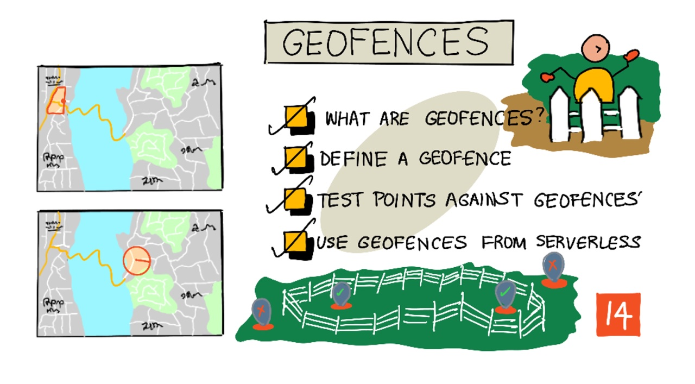
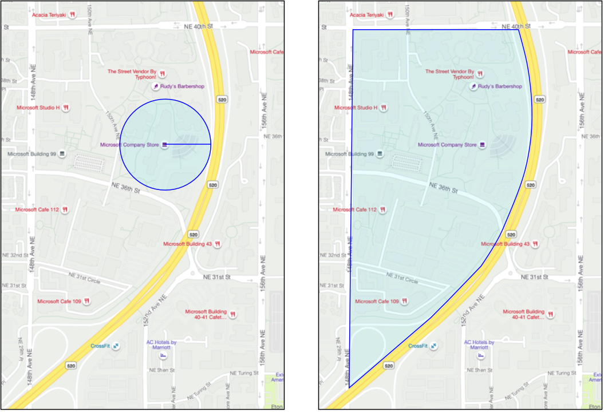
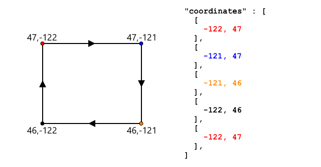
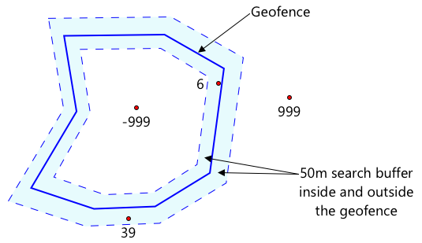
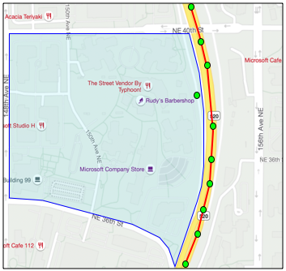
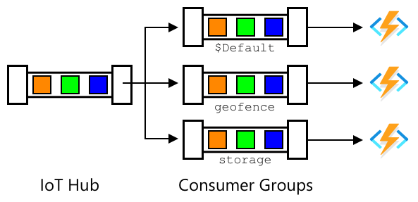

# Geofences



> Sketchnote by [Nitya Narasimhan](https://github.com/nitya). Click the image for a larger version.

This video gives an overview of geofences and how to use them in Azure Maps, topics that will be covered in this lesson:

[](https://www.youtube.com/watch?v=nsrgYhaYNVY)

> 🎥 Click the image above to watch a video

## Pre-lecture quiz

[Pre-lecture quiz](https://brave-island-0b7c7f50f.azurestaticapps.net/quiz/27)

## Introduction

In the last 3 lessons, you have used IoT to locate the trucks carrying your produce from your farm to a processing hub. You've captured GPS data, sent it to the cloud to store, and visualized it on a map. The next step in increasing the efficiency of your supply chain is to get an alert when a truck is about to arrive at the processing hub, so that the crew needed to unload can be ready with forklifts and other equipment as soon as the vehicle arrives. This way they can unload quickly, and you are not paying for a truck and driver to wait.

In this lesson you will learn about geofences - defined geospatial regions such as an area within a 2km minute drive of a processing hub, and how to test if GPS coordinates are inside or outside a geofence, so you can see if your GPS sensor has arrived or left an area.

In this lesson we'll cover:

* [What are geofences](#what-are-geofences)
* [Define a geofence](#defining-a-geofence)
* [Test points against a geofence](#testing-points-against-a-geofence)
* [Use geofences from serverless code](#use-geofences-from-serverless-code)

> 🗑 This is the last lesson in this project, so after completing this lesson and the assignment, don't forget to clean up your cloud services. You will need the services to complete the assignment, so make sure to complete that first.
>
> Refer to [the clean up your project guide](../../../clean-up.md) if necessary for instructions on how to do this.

## What are Geofences

A geofence is a virtual perimeter for a real-world geographic region. Geofences can be circles defined as a point and a radius (for example a circle 100m wide around a building), or a polygon covering an area such as a school zone, city limits, or university or office campus.



> 💁 You may have already used geofences without knowing. If you've set a reminder using the iOS reminders app or Google Keep based off a location, you have used a geofence. These apps will set up a geofence based off the location given and alert you when your phone enters the geofence.

There are many reasons why you would want to know that a vehicle is inside or outside a geofence:

* Preparation for unloading - getting a notification that a vehicle has arrived on-site allows a crew to be prepared to unload the vehicle, reducing vehicle waiting time. This can allow a driver to make more deliveries in a day with less waiting time.
* Tax compliance - some countries, such as New Zealand, charge road taxes for diesel vehicles based on the vehicle weight when driving on public roads only. Using geofences allows you to track the mileage driven on public roads as opposed to private roads on sites such as farms or logging areas.
* Monitoring theft - if a vehicle should only remain in a certain area such as on a farm, and it leaves the geofence, it might have been stolen.
* Location compliance - some parts of a work site, farm or factory may be off-limits to certain vehicles, such as keeping vehicles that carry artificial fertilizers and pesticides away from fields growing organic produce. If a geofence is entered, then a vehicle is outside of compliance and the driver can be notified.

✅ Can you think of other uses for geofences?

Azure Maps, the service you used in the last lesson to visualize GPS data, allows you to define geofences, then test to see if a point is inside or outside of the geofence.

## Define a geofence

Geofences are defined using GeoJSON, the same as the points that were added to the map in the previous lesson. In this case, instead of being a `FeatureCollection` of `Point` values, it is a `FeatureCollection` containing a `Polygon`.

```json
{
   "type": "FeatureCollection",
   "features": [
     {
       "type": "Feature",
       "geometry": {
         "type": "Polygon",
         "coordinates": [
           [
             [
               -122.13393688201903,
               47.63829579223815
             ],
             [
               -122.13389128446579,
               47.63782047131512
             ],
             [
               -122.13240802288054,
               47.63783312249837
             ],
             [
               -122.13238388299942,
               47.63829037035086
             ],
             [
               -122.13393688201903,
               47.63829579223815
             ]
           ]
         ]
       },
       "properties": {
         "geometryId": "1"
       }
     }
   ]
}
```

Each point on the polygon is defined as a longitude, latitude pair in an array, and these points are in an array that is set as the `coordinates`. In a `Point` in the last lesson, the `coordinates` was an array containing 2 values, latitude and longitude, for a `Polygon` it is an array of arrays containing 2 values, longitude, latitude.

> 💁 Remember, GeoJSON uses `longitude, latitude` for points, not `latitude, longitude`

The polygon coordinates array always has 1 more entry than the number of points on the polygon, with the last entry being the same as the first, closing the polygon. For example, for a rectangle there would be 5 points.



In the image above, there is a rectangle. The polygon coordinates starts at the top-left at 47,-122, then moves right to 47,-121, then down to 46,-121, then right to 46, -122, then back up to the start point at 47, -122. This gives the polygon 5 points - top-left, top-right, bottom-right, bottom-left, then top-left to close it out.

✅ Try creating a GeoJSON polygon around your home or school. Use a tool like [GeoJSON.io](https://geojson.io/).

### Task - define a geofence

To use a geofence in Azure maps, first it has to be uploaded to your Azure Maps account. Once uploaded, you will get a unique ID that you can use to test a point against the geofence. To upload geofences to Azure Maps, you need to use the maps web API. You can call the Azure Maps web API using a tool called [curl](https://curl.se).

> 🎓 Curl is a command line tool to make requests against web endpoints

1. If you are using Linux, macOS, or a recent version of Windows 10 you probably have curl installed already. Run the following from your terminal or command line to check:

    ```sh
    curl --version
    ```

    If you don't see version information for curl, you will need to install it from the [curl downloads page](https://curl.se/download.html).

    > 💁 If you are experienced with Postman, then you can use that instead if you prefer.

1. Create a GeoJSON file containing a polygon. You will be testing this using your GPS sensor, so create a polygon around your current location. You can either create one manually by editing the GeoJSON example given above, or use a tool like [GeoJSON.io](https://geojson.io/).

    The GeoJSON will need to contain a `FeatureCollection`, containing a `Feature` with a `geometry` of type `Polygon`.

    You **MUST** also add a `properties` element at the same level as the `geometry` element, and this has to contain a `geometryId`:

    ```json
    "properties": {
        "geometryId": "1"
    }
    ```

    If you use [GeoJSON.io](https://geojson.io/), then you will manually have to add this item to the empty `properties` element, either after downloading the JSON file, or in the JSON editor in the app.

    This `geometryId` must be unique in this file. You can upload multiple geofences as multiple `Features` in the `FeatureCollection` in the same GeoJSON file, as long as each one has a different `geometryId`. Polygons can have the same `geometryId` if they are uploaded from a different file at a different time.

1. Save this file as `geofence.json`, and navigate to where it is saved in your terminal or console.

1. Run the following curl command to create the GeoFence:

    ```sh
    curl --request POST 'https://atlas.microsoft.com/mapData/upload?api-version=1.0&dataFormat=geojson&subscription-key=<subscription_key>' \
         --header 'Content-Type: application/json' \
         --include \
         --data @geofence.json
    ```

    Replace `<subscription_key>` in the URL with the API key for your Azure Maps account.

    The URL is used to upload map data via the `https://atlas.microsoft.com/mapData/upload` API. The call includes an `api-version` parameter to specify which Azure Maps API to use, this is to allow the API to change over time but maintain backwards compatibility. The data format that is uploaded is set to `geojson`.

    This will run the POST request to the upload API and return a list of response headers which includes a header called `location`

    ```output
    content-type: application/json
    location: https://us.atlas.microsoft.com/mapData/operations/1560ced6-3a80-46f2-84b2-5b1531820eab?api-version=1.0
    x-ms-azuremaps-region: West US 2
    x-content-type-options: nosniff
    strict-transport-security: max-age=31536000; includeSubDomains
    x-cache: CONFIG_NOCACHE
    date: Sat, 22 May 2021 21:34:57 GMT
    content-length: 0
    ```

    > 🎓 When calling a web endpoint, you can pass parameters to the call by adding a `?` followed by key value pairs as `key=value`, separating the key value pairs by a `&`.

1. Azure Maps doesn't process this immediately, so you will need to check to see if the upload request has finished by using the URL given in the `location` header. Make a GET request to this location to see the status. You will need to add your subscription key to the end of the `location` URL by adding `&subscription-key=<subscription_key>` to the end, replacing `<subscription_key>` with the API key for your Azure Maps account. Run the following command:

    ```sh
    curl --request GET '<location>&subscription-key=<subscription_key>'
    ```

    Replace `<location>` with the value of the `location` header, and `<subscription_key>` with the API key for your Azure Maps account.

1. Check the value of `status` in the response. If it is not `Succeeded`, then wait a minute and try again.

1. Once the status comes back as `Succeeded`, look at the `resourceLocation` from the response. This contains details on the unique ID (known as a UDID) for the GeoJSON object. The UDID is the value after `metadata/`, and not including the `api-version`. For example, if the `resourceLocation` was:

    ```json
    {
      "resourceLocation": "https://us.atlas.microsoft.com/mapData/metadata/7c3776eb-da87-4c52-ae83-caadf980323a?api-version=1.0"
    }
    ```

    Then the UDID would be `7c3776eb-da87-4c52-ae83-caadf980323a`.

    Keep a copy of this UDID as you will need it to test the geofence.

## Test points against a geofence

Once the polygon has been uploaded to Azure Maps, you can test a point to see if it is inside or outside the geofence. You do this by making a web API request, passing in the UDID of the geofence, and the latitude and longitude of the point to test.

When you make this request, you can also pass a value called the `searchBuffer`. This tells the Maps API how accurate to be when returning results. The reason for this is GPS is not perfectly accurate, and sometimes locations can be out by meters if not more. The default for the search buffer is 50m, but you can set values from 0m to 500m.

When results are returned from the API call, one of the parts of the result is a `distance` measured to the closest point on the edge of the geofence, with a positive value if the point is outside the geofence, negative if it is inside the geofence. If this distance is less than the search buffer, the actual distance is returned in meters, otherwise the value is 999 or -999. 999 means that the point is outside the geofence by more than the search buffer, -999 means it is inside the geofence by more than the search buffer.



In the image above, the geofence has a 50m search buffer.

* A point in the center of the geofence, well inside the search buffer has a distance of **-999**
* A point well outside the search buffer has a distance of **999**
* A point inside the geofence and inside the search buffer, 6m from the geofence, has a distance of **6m**
* A point outside the geofence and inside the search buffer, 39m from the geofence, has a distance of **39m**

It is important to know the distance to the edge of the geofence, and combine this with other information such as other GPS readings, speed and road data when making decisions based off a vehicle location.

For example, imagine GPS readings showing a vehicle was driving along a road that ends up running next to a geofence. If a single GPS value is inaccurate and places the vehicle inside the geofence, despite there being no vehicular access, then it can be ignored.



In the above image, there is a geofence over part of the Microsoft campus. The red line shows a truck driving along the 520, with circles to show the GPS readings. Most of these are accurate and along the 520, with one inaccurate reading inside the geofence. There is no way that reading can be correct - there are no roads for the truck to suddenly divert from the 520 onto campus, then back onto the 520. The code that checks this geofence will need to take the previous readings into consideration before acting on the results of the geofence test.

✅ What additional data would you need to check to see if a GPS reading could be considered correct?

### Task - test points against a geofence

1. Start by building the URL for the web API query. The format is:

    ```output
    https://atlas.microsoft.com/spatial/geofence/json?api-version=1.0&deviceId=gps-sensor&subscription-key=<subscription-key>&udid=<UDID>&lat=<lat>&lon=<lon>
    ```

    Replace `<subscription_key>` with the API key for your Azure Maps account.

    Replace `<UDID>` with the UDID of the geofence from the previous task.

    Replace `<lat>` and `<lon>` with the latitude and longitude that you want to test.

    This URL uses the `https://atlas.microsoft.com/spatial/geofence/json` API to query a geofence defined using GeoJSON. It targets the `1.0` api version. The `deviceId` parameter is required and should be the name of the device the latitude and longitude comes from.

    The default search buffer is 50m, and you can change this by passing an additional parameter of `searchBuffer=<distance>`, setting `<distance>` to the search buffer distance in meters, form 0 to 500.

1. Use curl to make a GET request to this URL:

    ```sh
    curl --request GET '<URL>'
    ```

    > 💁 If you get a response code of `BadRequest`, with an error of:
    >
    > ```output
    > Invalid GeoJSON: All feature properties should contain a geometryId, which is used for identifying the geofence.
    > ```
    >
    > then your GeoJSON is missing the `properties` section with the `geometryId`. You will need to fix up your GeoJSON, then repeat the steps above to re-upload and get a new UDID.

1. The response will contain a list of `geometries`, one for each polygon defined in the GeoJSON used to create the geofence. Each geometry has 3 fields of interest, `distance`, `nearestLat` and `nearestLon`.

    ```output
    {
        "geometries": [
            {
                "deviceId": "gps-sensor",
                "udId": "7c3776eb-da87-4c52-ae83-caadf980323a",
                "geometryId": "1",
                "distance": 999.0,
                "nearestLat": 47.645875,
                "nearestLon": -122.142713
            }
        ],
        "expiredGeofenceGeometryId": [],
        "invalidPeriodGeofenceGeometryId": []
    }
    ```

    * `nearestLat` and `nearestLon` are the latitude and longitude of a point on the edge of the geofence that is closest to the location being tested.

    * `distance` is the distance from the location being tested to the closest point on the edge of the geofence. Negative numbers mean inside the geofence, positive outside. This value will be less than 50 (the default search buffer), or 999.

1. Repeat this multiple times with locations inside and outside the geofence.

## Use geofences from serverless code

You can now add a new trigger to your Functions app to test the IoT Hub GPS event data against the geofence.

### Consumer groups

As you will remember from previous lessons, the IoT Hub will allow you to replay events that have been received by the hub but not processed. But what would happen if multiple triggers connected? How will it know which one has processed which events.

The answer is it can't! Instead you can define multiple separate connections to read off events, and each one can manage the replay of unread messages. These are called *consumer groups*. When you connect to the endpoint, you can specify which consumer group you want to connect to. Each component of your application will connect to a different consumer group



In theory up to 5 applications can connect to each consumer group, and they will all receive messages when they arrive. It's best practice to have only one application access each consumer group to avoid duplicate message processing, and ensure when restarting all queued messages are processed correctly. For example, if you launched your Functions app locally as well as running it in the cloud, they would both process messages, leading to duplicate blobs stored in the storage account.

If you review the `function.json` file for the IoT Hub trigger you created in an earlier lesson, you will see the consumer group in the event hub trigger binding section:

```json
"consumerGroup": "$Default"
```

When you create an IoT Hub, you get the `$Default` consumer group created by default. If you want to add an additional trigger, you can add this using a new consumer group.

> 💁 In this lesson, you will use a different function to test the geofence to the one used to store the GPS data. This is to show how to use consumer groups and separate the code to make it easier to read and understand. In a production application there are many ways you might architect this - putting both on one function, using a trigger on the storage account to run a function to check the geofence, or using multiple functions. There is no 'right way', it depends on the rest of your application and your needs.

### Task - create a new consumer group

1. Run the following command to create a new consumer group called `geofence` for your IoT Hub:

    ```sh
    az iot hub consumer-group create --name geofence \
                                     --hub-name <hub_name>
    ```

    Replace `<hub_name>` with the name you used for your IoT Hub.

1. If you want to see all the consumer groups for an IoT Hub, run the following command:

    ```sh
    az iot hub consumer-group list --output table \
                                   --hub-name <hub_name>
    ```

    Replace `<hub_name>` with the name you used for your IoT Hub. This will list all the consumer groups.

    ```output
    Name      ResourceGroup
    --------  ---------------
    $Default  gps-sensor
    geofence  gps-sensor
    ```

> 💁 When you ran the IoT Hub event monitor in an earlier lesson, it connected to the `$Default` consumer group. This was why you can't run the event monitor and an event trigger. If you want to run both, then you can use other consumer groups for all your function apps, and keep `$Default` for the event monitor.

### Task - create a new IoT Hub trigger

1. Add a new IoT Hub event trigger to your `gps-trigger` function app that you created in an earlier lesson. Call this function `geofence-trigger`.

    > ⚠️ You can refer to [the instructions for creating an IoT Hub event trigger from project 2, lesson 5 if needed](../../../2-farm/lessons/5-migrate-application-to-the-cloud/README.md#create-an-iot-hub-event-trigger).

1. Configure the IoT Hub connection string in the `function.json` file. The `local.settings.json` is shared between all triggers in the Function App.

1. Update the value of the `consumerGroup` in the `function.json` file to reference the new `geofence` consumer group:

    ```json
    "consumerGroup": "geofence"
    ```

1. You will need to use the subscription key for your Azure Maps account in this trigger, so add a new entry to the `local.settings.json` file called `MAPS_KEY`.

1. Run the Functions App to ensure it is connecting and processing messages. The `iot-hub-trigger` from the earlier lesson will also run and upload blobs to storage.

    > To avoid duplicate GPS readings in blob storage, you can stop the Functions App you have running in the cloud. To do this, use the following command:
    >
    > ```sh
    > az functionapp stop --resource-group gps-sensor \
    >                     --name <functions_app_name>
    > ```
    >
    > Replace `<functions_app_name>` with the name you used for your Functions App.
    >
    > You can restart it later with the following command:
    >
    > ```sh
    > az functionapp start --resource-group gps-sensor \
    >                     --name <functions_app_name>
    > ```
    >
    > Replace `<functions_app_name>` with the name you used for your Functions App.

### Task - test the geofence from the trigger

Earlier in this lesson you used curl to query a geofence to see if a point was located inside or outside. You can make a similar web request from inside your trigger.

1. To query the geofence, you need its UDID. Add a new entry to the `local.settings.json` file called `GEOFENCE_UDID` with this value.

1. Open the `__init__.py` file from the new `geofence-trigger` trigger.

1. Add the following import to the top of the file:

    ```python
    import json
    import os
    import requests
    ```

    The `requests` package allows you to make web API calls. Azure Maps doesn't have a Python SDK, you need to make web API calls to use it from Python code.

1. Add the following 2 lines to the start of the `main` method to get the Maps subscription key:

    ```python
    maps_key = os.environ['MAPS_KEY']
    geofence_udid = os.environ['GEOFENCE_UDID']    
    ```

1. Inside the `for event in events` loop, add the following to get the latitude and longitude from each event:

    ```python
    event_body = json.loads(event.get_body().decode('utf-8'))
    lat = event_body['gps']['lat']
    lon = event_body['gps']['lon']
    ```

    This code converts the JSON from the event body to a dictionary, then extracts the `lat` and `lon` from the `gps` field.

1. When using `requests`, rather than building up a long URL as you did with curl, you can use just the URL part and pass the parameters as a dictionary. Add the following code to define the URL to call and configure the parameters:

    ```python
    url = 'https://atlas.microsoft.com/spatial/geofence/json'

    params = {
        'api-version': 1.0,
        'deviceId': 'gps-sensor',
        'subscription-key': maps_key,
        'udid' : geofence_udid,
        'lat' : lat,
        'lon' : lon
    }
    ```

    The items in the `params` dictionary will match the key value pairs you used when calling the web API via curl.

1. Add the following line of code to call the web API:

    ```python
    response = requests.get(url, params=params)
    ```

    This calls the URL with the parameters, and gets back a response object.

1. Add the following code below this:

    ```python
    distance = response_body['geometries'][0]['distance']

    if distance == 999:
        logging.info('Point is outside geofence')
    elif distance > 0:
        logging.info(f'Point is just outside geofence by a distance of {distance}m')
    elif distance == -999:
        logging.info(f'Point is inside geofence')
    else:
        logging.info(f'Point is just inside geofence by a distance of {distance}m')
    ```

    This code assumes 1 geometry, and extracts the distance from that single geometry. It then logs different messages based off the distance.

1. Run this code. You will see in the logging output if the GPS coordinates are inside or outside the geofence, with a distance if the point is within 50m. Try this code with different geofences based off the location of your GPS sensor, try moving the sensor (for example tethered to WiFi from a mobile phone, or with different coordinates on the virtual IoT device) to see this change.

1. When you are ready, deploy this code to your Functions app in the cloud. Don't forget to deploy the new Application Settings.

    > ⚠️ You can refer to [the instructions for uploading Application Settings from project 2, lesson 5 if needed](../../../2-farm/lessons/5-migrate-application-to-the-cloud/README.md#task---upload-your-application-settings).

    > ⚠️ You can refer to [the instructions for deploying your Functions app from project 2, lesson 5 if needed](../../../2-farm/lessons/5-migrate-application-to-the-cloud/README.md#task---deploy-your-functions-app-to-the-cloud).

> 💁 You can find this code in the [code/functions](code/functions) folder.

---

## 🚀 Challenge

In this lesson you added one geofence using a GeoJSON file with a single polygon. You can upload multiple polygons at the same time, as long as they have different `geometryId` values in the `properties` section.

Try uploading a GeoJSON file with multiple polygons and adjust your code to find which polygon the GPS coordinates are closest to or in.

## Post-lecture quiz

[Post-lecture quiz](https://brave-island-0b7c7f50f.azurestaticapps.net/quiz/28)

## Review & Self Study

* Read more on geofences and some of their use cases on the [Geofencing page on Wikipedia](https://en.wikipedia.org/wiki/Geo-fence).
* Read more on Azure Maps geofencing API on the [Microsoft Azure Maps Spatial - Get Geofence documentation](https://docs.microsoft.com/rest/api/maps/spatial/getgeofence?WT.mc_id=academic-17441-jabenn).
* Read more on consumer groups in the [Features and terminology in Azure Event Hubs - Event consumers documentation on Microsoft docs](https://docs.microsoft.com/azure/event-hubs/event-hubs-features?WT.mc_id=academic-17441-jabenn#event-consumers)

## Assignment

[Send notifications using Twilio](assignment.md)
