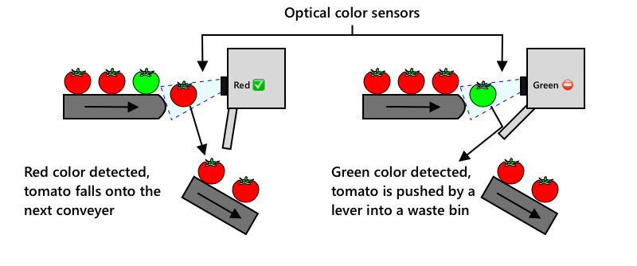
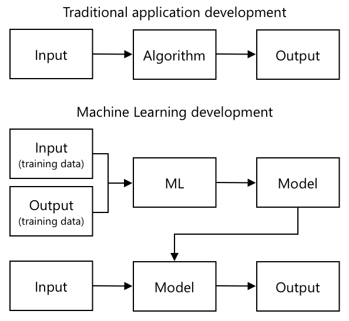
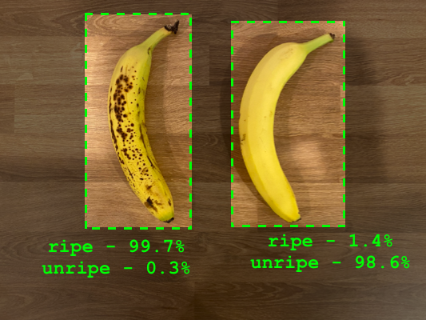
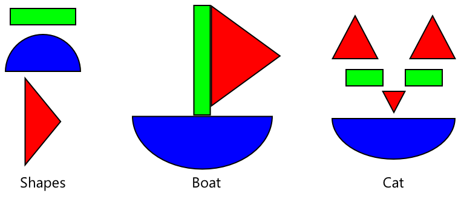
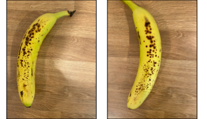
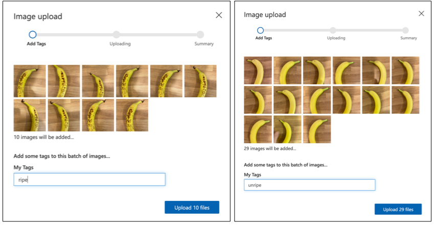
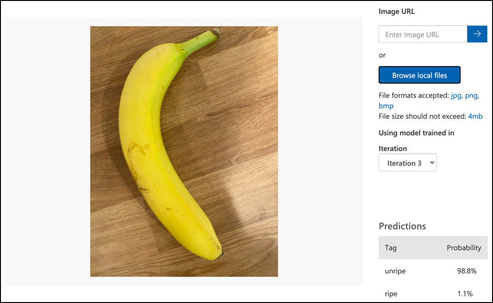

# Train a fruit quality detector

This video gives an overview of the Azure Custom Vision service, a service that will be covered in this lesson.

[](https://www.youtube.com/watch?v=TETcDLJlWR4)

> 🎥 Click the image above to watch the video

## Pre-lecture quiz

[Pre-lecture quiz](https://brave-island-0b7c7f50f.azurestaticapps.net/quiz/29)

## Introduction

The recent rise in Artificial Intelligence (AI) and Machine Learning (ML) is providing a wide range of capabilities to todays developers. ML models can be trained to recognize different things in images, including unripe fruit, and this can be used in IoT devices to help sort produce either as it is being harvested, or during processing in factories or warehouses.

In this lesson you will learn about image classification - using ML models to distinguish between images of different things. You will learn how to train an image classifier to distinguish between fruit that is good, and fruit that is bad, either under or over ripe, bruised, or rotten.

In this lesson we'll cover:

* [Using AI and ML to sort food](#using-ai-and-ml-to-sort-food)
* [Image classification via Machine Learning](#image-classification-via-machine-learning)
* [Train an image classifier](#train-an-image-classifier)
* [Test your image classifier](#test-your-image-classifier)
* [Retrain your image classifier](#retrain-your-image-classifier)

## Using AI and ML to sort food

Feeding the global population is hard, especially at a price that makes food affordable for all. One of the largest costs is labor, so farmers are increasingly turning to automation and tools like IoT to reduce their labor costs. Harvesting by hand is labor intensive (and often backbreaking work), and is being replaced by machinery, especially in richer nations. Despite the savings in cost of using machinery to harvest, there is a downside - the ability to sort food as it is being harvested.

Not all crops ripen evenly. Tomatoes, for example, can still have some green fruits on the vine when the majority is ready for harvest. Although it is a waste to harvest these early, it is cheaper and easier for the farmer to harvest everything using machinery and dispose of the unripe produce later.

✅ Have a look at different fruits or vegetables, either growing near you in farms or in your garden, or in shops, Are they all the same ripeness, or do you see variation?

The rise of automated harvesting moved the sorting of produce from the harvest to the factory. Food would travel on long conveyer belts with teams of people picking over the produce removing anything that wasn't up to the required quality standard. Harvesting was cheaper thanks to machinery, but there was still a cost to manually sort food.



***If a red tomato is detected it continues its journey uninterrupted. If a green tomato is detected it is flicked into a waste bin by a lever. tomato by parkjisun from the Noun Project - from the [Noun Project](https://thenounproject.com)***

The next evolution was to use machines to sort, either built into the harvester, or in the processing plants. The first generation of these machines used optical sensors to detect colors, controlling actuators to push green tomatoes into a waste bin using levers or puffs of air, leaving red tomatoes to continue on a network of conveyor belts.

The video below shows one of these machines in action.

[](https://www.youtube.com/watch?v=AcRL91DouAU)

> 🎥 Click the image above to watch a video

In this video, as tomatoes fall from one conveyer belt to another, green tomatoes are detected and flicked into a bin using levers.

✅ What conditions would you need in a factory or in a field for these optical sensors to work correctly?

The latest evolutions of these sorting machines take advantage of AI and ML, using models trained to distinguish good produce from bad, not just by obvious color differences such as green tomatoes vs red, but by more subtle differences in appearance that can indicate disease or bruising.

## Image classification via Machine Learning

Traditional programming is where you take data, apply an algorithm to the data, and get output. For example, in the last project you took GPS coordinates and a geofence, applied an algorithm that was provided by Azure Maps, and got back a result of if the point was inside or outside the geofence. You input more data, you get more output.



Machine learning turns this around - you start with data and known outputs, and the machine learning algorithm learns from the data. You can then take that trained algorithm, called a *machine learning model* or *model*, and input new data and get new output.

> 🎓 The process of a machine learning algorithm learning from the data is called *training*. The inputs and known outputs are called *training data*.

For example, you could give a model millions of pictures of unripe bananas as input training data, with the training output set as `unripe`, and millions of ripe banana pictures as training data with the output set as `ripe`. The ML algorithm will then create a model based off this data. You then give this model a new picture of a banana and it will predict if the new picture is a ripe or an unripe banana.

> 🎓 The results of ML models are called *predictions*



ML models don't give a binary answer, instead they give probabilities. For example, a model may be given a picture of a banana and predict `ripe` at 99.7% and `unripe` at 0.3%. Your code would then pick the best prediction and decide the banana is ripe.

The ML model used to detect images like this is called an *image classifier* - it is given labelled images, and then classifies new images based off these labels.

> 💁 This is an over-simplification, and there are many other ways to train models that don't always need labelled outputs, such as unsupervised learning. If you want to learn more about ML, check out [ML for beginners, a 24 lesson curriculum on Machine Learning](https://aka.ms/ML-beginners).

## Train an image classifier

To successfully train an image classifier you need millions of images. As it turns out, once you have an image classifier trained on millions or billions of assorted images, you can re-use it and re-train it using a small set of images and get great results, using a process called *transfer learning*.

> 🎓 Transfer learning is where you transfer the learning from an existing ML model to a new model based off new data.

Once an image classifier has been trained for a wide variety of images, it's internals are great at recognizing shapes, colors and patterns. Transfer learning allows the model to take what it has already learned in recognizing image parts, and use that to recognize new images.



You can think of this as a bit like children's shape books, where once you can recognize a semi-circle, a rectangle and a triangle, you can recognize a sailboat or a cat depending on the configuration of these shapes. The image classifier can recognize the shapes, and the transfer learning teaches it what combination makes a boat or a cat - or a ripe banana.

There are a wide range of tools that can help you do this, including cloud-based services that can help you train your model, then use it via web APIs.

> 💁 Training these models takes a lot of computer power, usually via Graphics Processing Units, or GPUs. The same specialized hardware that makes games on your Xbox look amazing can also be used to train machine learning models. By using the cloud you can rent time on powerful computers with GPUs to train these models, getting access to the computing power you need, just for the time you need it.

## Custom Vision

Custom Vision is a cloud based tool for training image classifiers. It allows you to train a classifier using only a small number of images. You can upload images through a web portal, web API or an SDK, giving each image a *tag* that has the classification of that image. You then train the model, and test it out to see how well it performs. Once you are happy with the model, you can publish versions of it that can be accessed through a web API or an SDK.


> 💁 You can train a custom vision model with as little as 5 images per classification, but more is better. You can get better results with at least 30 images.

Custom Vision is part of a range of AI tools from Microsoft called Cognitive Services. These are AI tools that can be used either without any training, or with a small amount of training. They include speech recognition and translation, language understanding and image analysis. These are available with a free tier as services in Azure.

> 💁 The free tier is more than enough to create a model, train it, then use it for development work. You can read about the limits of the free tier on the [Custom Vision Limits and quotas page on Microsoft docs](https://docs.microsoft.com/azure/cognitive-services/custom-vision-service/limits-and-quotas?WT.mc_id=academic-17441-jabenn).

### Task - create a cognitive services resource

To use Custom Vision, you first need to create two cognitive services resources in Azure using the Azure CLI, one for Custom Vision training and one for Custom Vision prediction.

1. Create a Resource Group for this project called `fruit-quality-detector`

1. Use the following command to create a free Custom Vision training resource:

    ```sh
    az cognitiveservices account create --name fruit-quality-detector-training \
                                        --resource-group fruit-quality-detector \
                                        --kind CustomVision.Training \
                                        --sku F0 \
                                        --yes \
                                        --location <location>
    ```

    Replace `<location>` with the location you used when creating the Resource Group.

    This will create a Custom Vision training resource in your Resource Group. It will be called `fruit-quality-detector-training` and use the `F0` sku, which is the free tier. The `--yes` option means you agree to the terms and conditions of the cognitive services.
    
> 💁 Use `S0` sku if you already have a free account using any of the Cognitive Services.

1. Use the following command to create a free Custom Vision prediction resource:

    ```sh
    az cognitiveservices account create --name fruit-quality-detector-prediction \
                                        --resource-group fruit-quality-detector \
                                        --kind CustomVision.Prediction \
                                        --sku F0 \
                                        --yes \
                                        --location <location>
    ```

    Replace `<location>` with the location you used when creating the Resource Group.

    This will create a Custom Vision prediction resource in your Resource Group. It will be called `fruit-quality-detector-prediction` and use the `F0` sku, which is the free tier. The `--yes` option means you agree to the terms and conditions of the cognitive services.

### Task - create an image classifier project

1. Launch the Custom Vision portal at [CustomVision.ai](https://customvision.ai), and sign in with the Microsoft account you used for your Azure account.

1. Follow the [create a new Project section of the build a classifier quickstart on the Microsoft docs](https://docs.microsoft.com/azure/cognitive-services/custom-vision-service/getting-started-build-a-classifier?WT.mc_id=academic-17441-jabenn#create-a-new-project) to create a new Custom Vision project. The UI may change and these docs are always the most up to date reference.

    Call your project `fruit-quality-detector`.

    When you create your project, make sure to use the `fruit-quality-detector-training` resource you created earlier. Use a *Classification* project type, a *Multiclass* classification type, and the *Food* domain.

    

✅ Take some time to explore the Custom Vision UI for your image classifier.

### Task - train your image classifier project

To train an image classifier, you will need multiple pictures of fruit, both good and bad quality to tag as good and bad, such as an ripe and an overripe banana.

> 💁 These classifiers can classify images of anything, so if you don't have fruit to hand of differing quality, you can use two different types of fruit, or cats and dogs!

Ideally each picture should be just the fruit, with either a consistent background, or a wide variety of backgrounds. Ensure there's nothing in the background that is specific to ripe vs unripe fruit.

> 💁 It's important not to have specific backgrounds, or specific items that are not related to the thing being classified for each tag, otherwise the classifier may just classify based on the background. There was a classifier for skin cancer that was trained on moles both normal and cancerous, and the cancerous ones all had rulers against them to measure the size. It turned out the classifier was almost 100% accurate at identifying rulers in pictures, not cancerous moles.

Image classifiers run at very low resolution. For example Custom Vision can take training and prediction images up to 10240x10240, but trains and runs the model on images at 227x227. Larger images are shrunk to this size, so ensure the thing you are classifying takes up a large part of the image otherwise it may be too small in the smaller image used by the classifier.

1. Gather pictures for your classifier. You will need at least 5 pictures for each label to train the classifier, but the more the better. You will also need a few additional images to test the classifier. These images should all be different images of the same thing. For example:

    * Using 2 ripe bananas, take some pictures of each one from a few different angles, taking at least 7 pictures (5 to train, 2 to test), but ideally more.

        

    * Repeat the same process using 2 unripe bananas

    You should have at least 10 training images, with at least 5 ripe and 5 unripe, and 4 testing images, 2 ripe, 2 unripe. Your images should be png or jpegs, small than 6MB. If you create them with an iPhone for example they may be high-resolution HEIC images, so will need to be converted and possibly shrunk. The more images the better, and you should have a similar number of ripe and unripe.

    If you don't have both ripe and unripe fruit, you can use different fruits, or any two objects you have available. You can also find some example images in the [images](./images) folder of ripe and unripe bananas that you can use.

1. Follow the [upload and tag images section of the build a classifier quickstart on the Microsoft docs](https://docs.microsoft.com/azure/cognitive-services/custom-vision-service/getting-started-build-a-classifier?WT.mc_id=academic-17441-jabenn#upload-and-tag-images) to upload your training images. Tag the ripe fruit as `ripe`, and the unripe fruit as `unripe`.

    

1. Follow the [train the classifier section of the build a classifier quickstart on the Microsoft docs](https://docs.microsoft.com/azure/cognitive-services/custom-vision-service/getting-started-build-a-classifier?WT.mc_id=academic-17441-jabenn#train-the-classifier) to train the image classifier on your uploaded images.

    You will be given a choice of training type. Select **Quick Training**.

The classifier will then train. It will take a few minutes for the training to complete.

> 🍌 If you decide to eat your fruit whilst the classifier is training, make sure you have enough images to test with first!

## Test your image classifier

Once your classifier is trained, you can test it by giving it a new image to classify.

### Task - test your image classifier

1. Follow the [test your model documentation on the Microsoft docs](https://docs.microsoft.com/azure/cognitive-services/custom-vision-service/test-your-model?WT.mc_id=academic-17441-jabenn#test-your-model) to test your image classifier. Use the testing images you created earlier, not any of the images you used for training.

    

1. Try all the testing images you have access to and observe the probabilities.

## Retrain your image classifier

When you test your classifier, it may not give the results you expect. Image classifiers use machine learning to make predictions about what is in an image, based of probabilities that particular features of an image mean that it matches a particular label. It doesn't understand what is in the image - it doesn't know what a banana is or understand what makes a banana a banana instead of a boat. You can improve your classifier by retraining it with images it gets wrong.

Every time you make a prediction using the quick test option, the image and results are stored. You can use these images to retrain your model.

### Task - retrain your image classifier

1. Follow the [use the predicted image for training documentation on the Microsoft docs](https://docs.microsoft.com/azure/cognitive-services/custom-vision-service/test-your-model?WT.mc_id=academic-17441-jabenn#use-the-predicted-image-for-training) to retrain your model, using the correct tag for each image.

1. Once you model has been retrained, test on new images.

---

## 🚀 Challenge

What do you think would happen if you used a picture of a strawberry with a model trained on bananas, or a picture of an inflatable banana, or a person in a banana suit, or even a yellow cartoon character like someone from the Simpsons?

Try it out and see what the predictions are. You can find images to try with using [Bing Image search](https://www.bing.com/images/trending).

## Post-lecture quiz

[Post-lecture quiz](https://brave-island-0b7c7f50f.azurestaticapps.net/quiz/30)

## Review & Self Study

* When you trained your classifier, you would have seen values for *Precision*, *Recall*, and *AP* that rate the model that was created. Read up on what these values are using [the evaluate the classifier section of the build a classifier quickstart on the Microsoft docs](https://docs.microsoft.com/azure/cognitive-services/custom-vision-service/getting-started-build-a-classifier?WT.mc_id=academic-17441-jabenn#evaluate-the-classifier)
* Read up on how to improve your classifier from the [how to improve your Custom Vision model on the Microsoft docs](https://docs.microsoft.com/azure/cognitive-services/custom-vision-service/getting-started-improving-your-classifier?WT.mc_id=academic-17441-jabenn)

## Assignment

[Train your classifier for multiple fruits and vegetables](assignment.md)
