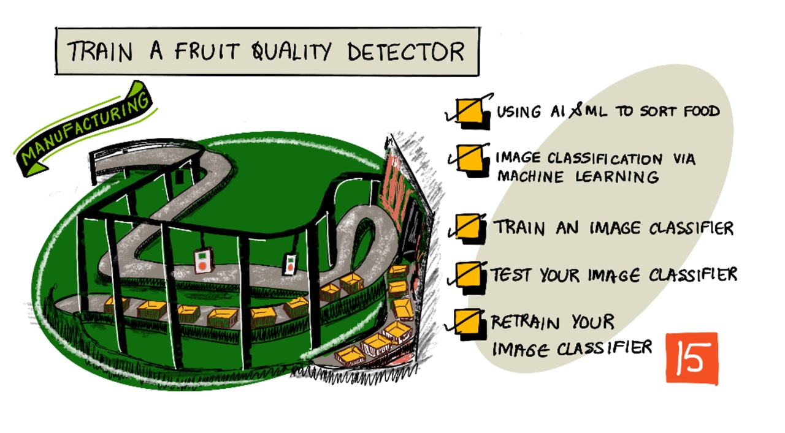

# খাদ্যপণ্যের গুণমান সনাক্তকারী মডেলকে ট্রেনিং প্রদান



> স্কেচনোটটি তৈরী করেছেন [Nitya Narasimhan](https://github.com/nitya)। বড় সংস্করণে দেখার জন্য ছবিটিতে ক্লিক করতে হবে।

এই ভিডিওটি Azure কাস্টম ভিশন সার্ভিসর একটি সংক্ষিপ্ত বিবরণ দেয়, যা এই পাঠে আমরা বিস্তারিত জানবো।

[](https://www.youtube.com/watch?v=TETcDLJlWR4)

> 🎥 উপরের ছবিতে ক্লিক করে ভিডিওটি দেখে নিই

## লেকচার-পূর্ববর্তী কুইজ

[লেকচার-পূর্ববর্তী কুইজ](https://black-meadow-040d15503.1.azurestaticapps.net/quiz/29)

## সূচনা

কৃত্রিম বুদ্ধিমত্তা (এআই) এবং মেশিন লার্নিং (এমএল) -এর সাম্প্রতিক উন্নতি আজকের ডেভেলপারদের বিস্তৃত ক্ষমতা প্রদান করছে। এমএল মডেলগুলিকে চিত্রের বিভিন্ন জিনিস চিনতে প্রশিক্ষণ দেওয়া যেতে পারে যেমন অপরিপক্ক ফল সনাক্তকরণ এবং এটি আইওটি ডিভাইসেও ব্যবহার করা যেতে পারে ।

এই পাঠে আমরা ইমেজ বা ছবির শ্রেণিবিন্যাস সম্পর্কে জানতে পারব - এমএল মডেল ব্যবহার করে বিভিন্ন জিনিসের ছবির মধ্যে পার্থক্য করা ছাড়াও কিভাবে একটি ইমেজ ক্লাসিফায়ারকে প্রশিক্ষণ দিতে হয় যে ফলটি ভাল এবং খারাপ ফল তা জানবো।

এই পাঠে আমরা শিখবো :

* [AI এবং ML দ্বারা পণ্য শ্রেনিবদ্ধকরণ](#AI-এবং-ML-দ্বারা-পণ্য-শ্রেনিবদ্ধকরণ)
* [মেশিন লার্নিং দ্বারা ছবি চিহ্নিতকরণ](#মেশিন-লার্নিং-দ্বারা-ছবি-চিহ্নিতকরণ)
* [ইমেজ ক্লাসিফায়ারকে প্রশিক্ষণ প্রদান](#ইমেজ-ক্লাসিফায়ারকে-প্রশিক্ষণ-প্রদান)
* [ইমেজ ক্লাসিফায়ারকে টেস্ট করা](#ইমেজ-ক্লাসিফায়ারকে-মূল্যায়ণ)
* [ইমেজ ক্লাসিফায়ারকে পুনরায় প্রশিক্ষণ প্রদান](#ইমেজ-ক্লাসিফায়ারকে-পুনরায়-প্রশিক্ষণ)

## AI এবং ML দ্বারা পণ্য শ্রেনিবদ্ধকরণ

বিশ্বব্যাপী জনসাধারণের খাদ্যের যোগান দেয়া কঠিন, বিশেষত কমদামে দামে সহজলভ্য করে সরবরাহ করা। সবচেয়ে বড় খরচ হল শ্রম, তাই কৃষকরা তাদের শ্রম খরচ কমাতে ক্রমবর্ধমান অটোমেশন এবং আইওটি এর মতো সরঞ্জামগুলির দিকে ঝুঁকছেন। হাতে ফসল তোলা খুবই শ্রমসাধ্য কাজ যা যন্ত্রপাতি দ্বারা প্রতিস্থাপিত হচ্ছে, বিশেষত ধনী দেশগুলিতে। ফসল কাটার জন্য যন্ত্রপাতি ব্যবহারের খরচ বাঁচানো সত্ত্বেও, একটি নেতিবাচক দিক রয়েছে - খাদ্য সংগ্রহ করার সময় ফসল সঠিকভাবে সাজানো (sort করা)।

সব ফসল সমানভাবে পরিপক্ব হয়না। উদাহরণস্বরূপ, টমেটো ক্ষেতে কিছু কিছু সবুজ ফল থাকতেই এই ফসল তোলার জন্য প্রস্তুত থাকে। যদিও তাড়াতাড়ি ফসল তোলা অপচয়, তবুও কৃষকের জন্য যন্ত্রপাতি ব্যবহার করে সব ফসল সংগ্রহ করা এবং পরবর্তীতে অপরিপক্ক ফসলের নিষ্পত্তি করা সস্তা এবং সহজ।

✅ আমাদের কাছাকাছি খামারে বা আমাদের বাগানে বা দোকানে থাকা বিভিন্ন ফল বা সবজি পর্যবেক্ষণ করি। সেগুলি কি একই রকম পরিপক্ক নাকি বৈচিত্র দেখা যাচ্ছে ?

স্বয়ংক্রিয় পদ্ধতিতে ফসল তোলার ফলে, উৎপাদিত পণ্যের শ্রেণিবিন্যাস কার্যক্রম বর্তমানে কারখানায় হয়ে থাকে। খাদ্য লম্বা কনভেয়ার বেল্ট দিয়ে যাবে এবং শ্রমিকেরা নিম্নমানের পণ্য অপসারণ করবে। যন্ত্রপাতির কল্যাণে ফসল কাটা ও সংগ্রহ করার ক্ষেত্রে খরচ কম ছিল, কিন্তু ম্যানুয়ালি পণ্য বাছাই করা অতিরিক্ত খরচ ও শ্রমের কাজ।


এই যাত্রায় পরবর্তী বিবর্তন ছিল মেশিনগুলিকে বাছাই করার জন্য ব্যবহার করা, হয় হার্ভেস্টারে নির্মিত অথবা প্রক্রিয়াকরণ কারখানায়। এই মেশিনের প্রথম প্রজন্ম অপটিক্যাল সেন্সর ব্যবহার করে রং সনাক্ত করে, অ্যাকচুয়েটরগুলিকে নিয়ন্ত্রণ করে সবুজ টমেটোকে একটি পাত্রে ধাক্কা দিয়ে ফেলে দিতো, বাতাসের লিভার বা পফ ব্যবহার করে। আবার লাল টমেটো গুলোকে ছেড়ে দিতো যাতে তারা কনভেয়র বেল্টে এগিয়ে যেতে থাকে।

নীচের ভিডিওটি এই মেশিনগুলির মধ্যে একটিকে দেখায়।

[](https://www.youtube.com/watch?v=AcRL91DouAU)

> 🎥 উপরের ছবিতে ক্লিক করে ভিডিওটি দেখে নিই

এই ভিডিওতে, টমেটো যখন একটি পরিবাহক বেল্ট (conveyer belt) থেকে অন্যটিতে যায়, সবুজ টমেটো সনাক্ত করা হয় এবং লিভারের সাহায্যে একটি আলাদা পাত্রে সরিয়ে ফেলা হয়।

✅ এই অপটিক্যাল সেন্সরগুলি সঠিকভাবে কাজ করার জন্য কারখানায় বা খেতে কেমন অবস্থার প্রয়োজন হবে?

এই বাছাই মেশিনের সর্বশেষ বিবর্তন এআই এবং এমএল এর সুবিধা গ্রহণ করে, ভাল পণ্যকে খারাপ থেকে আলাদা করার জন্য প্রশিক্ষিত মডেলগুলি ব্যবহার কর। এটি কেবলমাত্র সবুজ টমেটো বনাম লাল রঙের সুস্পষ্ট রঙের পার্থক্য দ্বারা নয়, বরং পণ্যের অবস্থা থেকে আরও সূক্ষ্ম পার্থক্য ধরতে পারে যা রোগ বা ক্ষত নির্দেশ করে ।

## মেশিন লার্নিং দ্বারা ছবি চিহ্নিতকরণ

সার্বজনীনভাবে প্রোগ্রামিং হলো এমন একটি কার্যক্রম যেখানে আমরা ডেটা গ্রহণ করি, ডেটাতে একটি অ্যালগরিদম প্রয়োগ এবং আউটপুট পাই। উদাহরণস্বরূপ, গত প্রজেক্টে আমরা জিপিএস কোঅর্ডিনেটস এবং একটি জিওফেন্স নিয়েছি্লাম, একটি অ্যালগরিদম প্রয়োগ করা হয়েছিলো যা Azure ম্যাপ দ্বারা সরবরাহ করা হয়েছিল এবং জিওফেন্সের ভিতরে বা বাইরে পয়েন্ট থাকলে তার ফলাফল পেয়েছিলাম। আমরা আরও ডেটা ইনপুট নিলে, আমরা আরও বেশি আউটপুট পাব।


মেশিন লার্নিং এটিকে সম্পূর্ণ উল্টোদিক থেকে করে - আমরা ডেটা এবং পরিচিত আউটপুট দিয়ে শুরু করি এবং মেশিন লার্নিং অ্যালগরিদম সেই সংগৃহীত ফলাফলের ডেটা থেকে শিখে যে তাকে কী করতে হবে। তারপর আমরা সেই প্রশিক্ষিত অ্যালগরিদম নিতে পারি, যাকে বলা হয় *মেশিন লার্নিং মডেল* বা শুধুমাত্র *মডেল*, এবং এটিতে নতুন ডেটা ইনপুট করে আমরা নতুন আউটপুট পাব।

> 🎓 তথ্য থেকে মেশিন লার্নিং অ্যালগরিদম শেখার প্রক্রিয়াকে বলা হয় *প্রশিক্ষণ (training)*। ইনপুট এবং পরিচিত আউটপুটগুলিকে *প্রশিক্ষণ ডেটা (training data)*বলা হয়।

উদাহরণস্বরূপ, ইনপুট ট্রেনিং ডেটা হিসাবে আমরা একটি মডেলকে কাঁচা কলা এর কয়েক লক্ষ ছবি দিতে পারি, প্রশিক্ষণ আউটপুটকে `কাঁচা` হিসাবে সেট করতে পারি, এবং একইভাবে লক্ষ লক্ষ পাকা কলার ছবিগুলিকে প্রশিক্ষণ ডেটা হিসাবে আউটপুট সেট `পাকা` হিসাবে সেট করতে পারি। এমএল অ্যালগরিদম তারপর এই ডেটা ভিত্তিক একটি মডেল তৈরি করবে। আমরা তারপর এই মডেলটিকে যেকোন একটি কলার একটি নতুন ছবি দিলে, এটি জানাবে যে নতুন ছবিটি একটি পাকা নাকি কাঁচা কলা।

> 🎓 এমএল মডেলের ফলাফলকে বলা হয় *পূর্বাভাস (predictions)* ।


এমএল মডেলগুলি বাইনারি উত্তর দেয় না, বরং তারা সম্ভাব্যতা দেয়। উদাহরণস্বরূপ, একটি মডেলকে একটি কলার ছবি দেওয়া হলে এবং `পাকা` তে ৯৯.৭% এবং `কাঁচা` তে ০.০৩% এর রেজাল্ট দিতে পারে। আমাদের কোড তারপর সেই পূর্বাভাস বাছাই করবে এবং কলা পাকা - এই সিদ্ধান্ত নেবে।

এইরকম ছবি সনাক্ত করতে ব্যবহৃত এমএল মডেলটিকে বলা হয় *ইমেজ ক্লাসিফায়ার* - এটিকে লেবেলযুক্ত ছবি দেওয়া হয় এবং তারপরে এই লেবেলগুলির ভিত্তিতে নতুন চিত্রগুলি শ্রেণিবদ্ধ করা হয়।

> 💁 এটি একটি অতি-সরলীকরণ ব্যখ্যা এবং মডেলগুলিকে প্রশিক্ষণ দেওয়ার আরও অনেক উপায় রয়েছে যা সর্বদা লেবেলযুক্ত আউটপুটগুলির প্রয়োজন হয় না, যেমন unsupervised learning প্রক্রিয়া। আমরা যদি এমএল সম্পর্কে আরও জানতে চাই, তাহলে [মেশিন লার্নিং এর ২৪ লেসনের কারিক্যুলামটি](https://aka.ms/ML-beginners) দেখি।

## ইমেজ ক্লাসিফায়ারকে প্রশিক্ষণ প্রদান

একটি ইমেজ ক্লাসিফায়ার সফলভাবে প্রশিক্ষণের জন্য আমাদের লক্ষ লক্ষ ইমেজ প্রয়োজন। যেমন দেখা যাচ্ছে, একবার আমাদের লক্ষ লক্ষ বা কোটি কোটি ইমেজের উপর প্রশিক্ষণপ্রাপ্ত একটি ইমেজ ক্লাসিফায়ার হয়ে গেলে, আমরা এটি পুনরায় ব্যবহার করতে পারি এবং ছবিগুলির একটি ছোট সেট ব্যবহার করে পুনরায় প্রশিক্ষণ দিতে পারি এবং *ট্রান্সফার লার্নিং* নামক একটি প্রক্রিয়া ব্যবহার করে দুর্দান্তরকমের এক্যুরেট ফলাফল পেতে পারি। ।

> 🎓 ট্রান্সফার লার্নিং হল এমন প্রক্রিয়া যেখানে আমরা একটি বিদ্যমান এমএল মডেল থেকে নতুন ডেটা ভিত্তিক নতুন মডেলে আগের  লার্নিং ট্রান্সফার করি।

একবার ইমেজ ক্লাসিফায়ারকে বিভিন্ন ধরণের চিত্রের জন্য প্রশিক্ষণ দেওয়া হলে, এর অভ্যন্তরীণ আকার, রঙ এবং নিদর্শনগুলি সনাক্ত করতে বেশ পারদর্শী হয়ে যায়। ট্রান্সফার লার্নিং এর দ্বারা মডেলটি ইমেজ পার্টস এর ইতিমধ্যে যা শিখেছে তা নিতে এবং নতুন ইমেজ চিনতে বেশ সুবিধা হয়।


আমরা এটিকে ছোটদেরকে আকার-আকৃতি চেনানোর জন্য ছবির বইয়ের মতো মনে করতে পারি, যেখানে একবার আমরা একটি অর্ধ-বৃত্ত, একটি আয়তক্ষেত্র এবং একটি ত্রিভুজ চিনতে পারিদ। আমরা এই আকারগুলির কনফিগারেশনের উপর নির্ভর করে একটি পাল তোলা নৌকা বা একটি বিড়ালকে চিনতে পারি। ইমেজ ক্লাসিফায়ার আকার চিনতে পারে এবং ট্রান্সফার লার্নিং এটি শেখায় যে কী কী সমন্বয় করে একটি নৌকা বা একটি বিড়াল তৈরি করে - অথবা একটি কীভাবে একটি পাকা কলা পাওয়া যায়।

ক্লাউড-ভিত্তিক সার্ভিসগুলি যা আমাদেরকে আমাদের মডেলকে প্রশিক্ষণ দিতে সাহায্য করে। তারপর ওয়েব এপিআইয়ের মাধ্যমে এটি ব্যবহার করতে পারি। 

> 💁 এই মডেলগুলিকে প্রশিক্ষণ দিতে প্রচুর কম্পিউটার রিসোর্স লাগে, সাধারণত গ্রাফিক্স প্রসেসিং ইউনিট বা জিপিইউ এর মাধ্যমে তা করা হয়। এটি সেই বিশেষ হার্ডওয়্যার যা আমাদের এক্সবক্সে গেমগুলি চালায়। মেশিন লার্নিং মডেলগুলি প্রশিক্ষণের জন্যও এটি ব্যবহার করা যেতে পারে। ক্লাউড ব্যবহার করে আমরা এই মডেলগুলিকে প্রশিক্ষণের জন্য জিপিইউ সহ শক্তিশালী কম্পিউটারের রিসোর্স পেতে পারি, আমাদের প্রয়োজনীয় কম্পিউটিং পাওয়ার এর অ্যাক্সেস পেতে পারি, কেবল আমাদের প্রয়োজনীয় সময়ের জন্য - এতে করে আমাদের খরচও কম, কাজও হয়ে যাবে।

## কাস্টম ভিশন

কাস্টম ভিশন হল ইমেজ ক্লাসিফায়ার প্রশিক্ষণের জন্য একটি ক্লাউড ভিত্তিক টুল। এটি আমাদেরকে অল্প সংখ্যক চিত্র ব্যবহার করে একটি ক্লাসিফায়ার প্রশিক্ষণ দেওয়ার অনুমতি দেয়। আমরা একটি ওয়েব পোর্টাল, ওয়েব এপিআই বা একটি এসডিকে এর মাধ্যমে ছবি আপলোড করতে পারি, প্রতিটি ইমেজকে একটি *ট্যাগ* দিতে পারি যেটি সেই ছবির শ্রেণিবিন্যাস নির্দেশ করে। তারপরে আমরা মডেলটিকে প্রশিক্ষণ দিব এবং এটি কতটা ভাল কাজ করে তা পরীক্ষা করে দেখব। একবার আমরা মডেলটি নিয়ে সন্তুষ্ট হলে, আমরা এর সংস্করণগুলি প্রকাশ করতে পারি যা একটি ওয়েব API বা SDK এর মাধ্যমে ব্যবহার করা যায়।


> 💁 একটি কাস্টম ভিশন মডেলকে প্রতি শ্রেণিবিন্যাসের জন্য কমপক্ষে  5টির মতো প্রশিক্ষণ ছবি দিতে পারি, তবে যত বেশী দিতে পারবো, তত ভালো। উন্নত ফলাফলের জন্য কমপক্ষে 30 টি ছবি দেয়া উচিত।

কাস্টম ভিশন মাইক্রোসফটের কগনিটিভ সার্ভিস নামে পরিচিত এআই টুলের একটি অংশের অংশ। এগুলি হল এআই টুলস যা কোনো প্রশিক্ষণ ছাড়াই ব্যবহার করা যেতে পারে অথবা অল্প পরিমাণে প্রশিক্ষণ দিয়ে ব্যবহার করা যেতে পারে। এর মধ্যে রয়েছে speech recognition, অনুবাদ, ভাষা বোঝা এবং চিত্র বিশ্লেষণ। এগুলি Azure সার্ভিস হিসাবে উপলব্ধ আছে, Free tier এ।

> 💁 বিনামূল্যে স্তর বা  Free tier  একটি মডেল তৈরি করা, প্রশিক্ষণ দেওয়া, তারপর উন্নয়ন কাজের জন্য এটি ব্যবহার করার জন্য যথেষ্ট। [মাইক্রোসফট ডকস এ কাস্টম ভিশন এর লিমিট এবং কোটা - এই পেইজে](https://docs.microsoft.com/azure/cognitive-services/custom-vision-service/limits-and-quotas?WT.mc_id=academic-17441-jabenn) বিনামূল্যে স্তর (Free tier) সম্পর্কে আমরা পড়তে পারি 

### কাজ - কগনিটিভ সার্ভিস রিসোর্স তৈরী

কাস্টম ভিশন ব্যবহার করার জন্য, আমাদেরকে প্রথমে Azure CLI ব্যবহার করে Azure- এ দুটি cognitive services resources তৈরি করতে হবে, একটি কাস্টম ভিশন প্রশিক্ষণের জন্য এবং একটি কাস্টম ভিশন ফলাফলের জন্য।

1. একটি রিসোর্স গ্রুপ তৈরী করি যার নাম `fruit-quality-detector`

1. একটি বিনামূল্যে কাস্টম ভিশন প্রশিক্ষণ রিসোর্স তৈরি করতে নিম্নলিখিত কমান্ডটি ব্যবহার ্করি:

    ```sh
    az cognitiveservices account create --name fruit-quality-detector-training \
                                        --resource-group fruit-quality-detector \
                                        --kind CustomVision.Training \
                                        --sku F0 \
                                        --yes \
                                        --location <location>
    ```

     `<location>` এর স্থলে রিসোর্স গ্রুপ তৈরীতে যে লোকেশোন দেয়া হয়েছে তা বসাই।

    এটি আমাদের রিসোর্স গ্রুপে একটি কাস্টম ভিশন ট্রেনিং রিসোর্স তৈরি করবে। এটিকে নাম দেয়া হবে `fruit-quality-detector-training` (ফলের-গুণ-সনাক্তকারী-প্রশিক্ষণ) এবং `F0` sku ব্যবহার করি, যা বিনামূল্য স্তরে পাওয়া যায়। `--yes` অপশনের অর্থ হল কগনিটিভ সার্ভিসের শর্তাবলীতে আমরা সম্মত।

> 💁 আমরা যদি ইতিমধ্যে কোন ফ্রী একাউন্ট থেকে কগনিটিভ সার্ভিস ব্যবহার করে থাকি, তাহলে `S0` sku ব্যবহার করতে হবে।

1. একটি বিনামূল্যে কাস্টম ভিশন প্রেডিকশোন রিসোর্স তৈরি করতে নিম্নলিখিত কমান্ডটি ব্যবহার করি:

    ```sh
    az cognitiveservices account create --name fruit-quality-detector-prediction \
                                        --resource-group fruit-quality-detector \
                                        --kind CustomVision.Prediction \
                                        --sku F0 \
                                        --yes \
                                        --location <location>
    ```

    `<location>` এর স্থলে রিসোর্স গ্রুপ তৈরীতে যে লোকেশোন দেয়া হয়েছে তা বসাই।

    এটি আমাদের রিসোর্স গ্রুপে একটি কাস্টম ভিশন ্প্রেডিকশন রিসোর্স তৈরি করবে। এটিকে বলা হবে `fruit-quality-detector-prediction` এবং 'F0' স্কু ব্যবহার করি, যা ফ্রী। `-yes` অপশনের  অর্থ হল কগনিটিভ সার্ভিসের শর্তাবলীতে আমরা সম্মত।

### কাজ - ইমেজ ক্লাসিফায়ার প্রজেক্ট তৈরী

1. Custom Vision portal চালু করি [CustomVision.ai](https://customvision.ai) এবুং Azure এর জন্য ব্যবহৃত মাইক্রোসফট একাউন্টে লগিন করি।

1. এখন [একটি ক্লাসিফায়ার নির্মাণের জন্য নতুন প্রজেক্ট তৈরি করার প্রক্রিয়া - Microsoft docs](https://docs.microsoft.com/azure/cognitive-services/custom-vision-service/getting-started-build-a-classifier?WT.mc_id=academic-17441-jabenn#create-a-new-project) পড়ে নতুন কাস্টম ভিশন প্রজেক্ট নির্মাণ করি।

    প্রজেক্টের নাম দিই `fruit-quality-detector`.

    আমরা এখন আমাদের প্রজেক্ট তৈরি করি, আমাদের আগে তৈরি করা `fruit-quality-detector-training` রিসোর্স ব্যবহার করতে হবে। একটি *ক্লাসিফিকেশন* প্রজেক্ট টাইপ, একটি *মাল্টিক্লাস* ক্লাসিফিকেশন টাইপ এবং *ফুড* ডোমেইন ব্যবহার করি।

    

✅ ইমেজ ক্লাসিফায়ারের জন্য কাস্টম ভিশন ইউআই এক্সপ্লোর করার জন্য কিছু সময় নিই।

### কাজ - ইমেজ ক্লাসিফায়ারকে প্রশিক্ষণ প্রদান

একটি ইমেজ ক্লাসিফায়ারকে প্রশিক্ষণ দেওয়ার জন্য, আমাদের ভাল এবং খারাপ উভয় গুণের ফলের একাধিক ছবি প্রয়োজন হবে, যেমন একটি পাকা এবং একটি অতিরিক্ত পাকা কলা।

> 💁এই ক্লাসিফায়ারগুলো যেকোনো কিছুর ছবিকে শ্রেণীবদ্ধ করতে পারে। তাই যদি আমাদের কাছে ভিন্ন মানের ফল না থাকে তবে আমরা অন্য যেকোন দুটি ভিন্ন ধরনের ফল ব্যবহার করতে পারেন, অথবা বিড়াল এবং কুকুর -  এই ধর০ণের ক্লাসিফিকেশনও করতে পারি!

আদর্শভাবে প্রতিটি ছবিতে শুধু ফল থাকা উচিত, যার মধ্যে একটি সামঞ্জস্যপূর্ণ ব্যাকগ্রাউণ্ড , অথবা বিভিন্ন প্রকারের ব্যাকগ্রাউণ্ড থাকতে হবে। নিশ্চিত করি যে ব্যাকগ্রাউণ্ড এ এমন কিছু নেই যা পাকা বনাম কাঁচা ফলের সনাক্তকরণে প্রভাব ফেলবে।

> 💁 নির্দিষ্ট ব্যাকগ্রাউণ্ড বা নির্দিষ্ট আইটেম না থাকাই ভালো যা ক্লাসিফায়ারের জন্য অপ্রাসঙ্গিক, অন্যথায় ক্লাসিফায়ারের কেবল ব্যাকগ্রাউণ্ড এর উপর ভিত্তি করে শ্রেণীবদ্ধ করতে পারে। ত্বকের ক্যান্সারের জন্য একটি ক্লাসিফায়ার ছিল যা মোলগুলির স্বাভাবিক এবং ক্যান্সারযুক্ত উভয় এর জন্য প্রশিক্ষিত ছিল। ক্যান্সারযুক্ত মোলের ছবিতে আকার পরিমাপের জন্য সেখানে স্কেল রাখা ছিলো। এটি দেখা যায় যে, ক্লাসিফায়ারের ছবিগুলিতে স্কেল্গুলোকে চিহ্নিত করার ক্ষেত্রে প্রায় 100% নির্ভুল ছিল, কিন্তু সত্যিকারের ক্যান্সারযুক্ত মোল এর ক্ষেত্রে (ছবিতে স্কেল না রেখে) তা ততটা ভালো প্রেডিকশন দিতে পারেনি।।

ইমেজ ক্লাসিফায়ার খুব কম রেজ্যুলেশনে চলে। উদাহরণস্বরূপ, কাস্টম ভিশন 10240x10240 পর্যন্ত প্রশিক্ষণ এবং ভবিষ্যদ্বাণী চিত্র গ্রহণ করতে পারে, কিন্তু 227x227 রেজ্যুলেশনে চিত্রগুলিতে মডেলটি প্রশিক্ষণ এবং রান করে। বড় আকারের ছবিগুলি এই আকারে সঙ্কুচিত হয়, তাই আমাদেরকে নিশ্চিত করতে হবে যে আমরা যে জিনিসটি শ্রেণিবদ্ধ করছি তা চিত্রের একটি বড় অংশ দখল করে অন্যথায় এটি ক্লাসিফায়ার দ্বারা পরিবর্তিত ছোট ছবিতে খুবই ছোট হয়ে যেতে পারে।

1. আমাদের ক্লাসিফায়ারের জন্য ছবি সংগ্রহ করতে হবে। ক্লাসিফায়ারকে প্রশিক্ষণের জন্য আমাদেরকে প্রতিটি লেবেলের কমপক্ষে .৫ টি ছবির প্রয়োজন হবে, তবে বেশি হলে আরও ভাল। ক্লাসিফায়ার পরীক্ষা করার জন্য আমাদের কয়েকটি অতিরিক্ত চিত্রেরও প্রয়োজন হবে। এই ছবিগুলি সব একই জিনিসের ভিন্ন চিত্র হওয়া উচিত। উদাহরণ স্বরূপ:

    * ২টি পাকা কলা নিয়ে, কয়েকটি ভিন্ন অবস্থান থেকে প্রত্যেকটির কিছু ছবি তুলি, কমপক্ষে ৭ টি ছবি তুলতে হবে (৫ টি প্রশিক্ষণ, ২টি পরীক্ষা)। কিন্তু আরও বেশি ছবি তুলতে পারলে ভালো।

        

    * ২টি কাঁচা কলা একই কাজটি আবারও করি।

    আমাদের কমপক্ষে ১০টি প্রশিক্ষণ চিত্র থাকতে হবে, যার মধ্যে কমপক্ষে ৫ টি পাকা এবং ৫ টি কাঁচা এবং ৪ টি পরীক্ষার চিত্র, যেখানে ২টি পাকা, ২টি কাঁচা। আমাদের ছবিগুলি png বা jpegs হওয়া উচিত যা 6MB এর চেয়ে ছোট। যদি আমরা সেগুলোকে আইফোন দিয়ে ধারণ করি, উদাহরণস্বরূপ সেগুলো হতে পারে উচ্চ রেজোলিউশনের HEIC ছবি, তাই রূপান্তর করতে হবে এবং সম্ভবত সঙ্কুচিত হতে হবে। মনে রাখতে হবে, যত বেশি ছবি তত ভাল এবং আমাদের একই সংখ্যক পাকা এবং কাঁচা ্কলার ছবি থাকতে হবে।

    যদি আমাদের পাকা এবং কাঁচা উভয় ফলই না থাকে, তাহলে আমরা বিভিন্ন ফল, অথবা আমাদের কাছে থাকা যেকোনো দুটি বস্তু ব্যবহার করতে পারব। আমরা পাকা এবং কাঁচা কলাগুলির [images](./images) ফোল্ডারে কিছু উদাহরণ চিত্র খুঁজে পাব যা আমরা ব্যবহার চাইলে করতে পারি।

1. এক্ষেত্রে সহজে অনুসরণযোগ্য গাইড হিসেবে [ক্লাসিফায়ারের জন্য ছবি আপলোড ও ট্যাগ](https://docs.microsoft.com/azure/cognitive-services/custom-vision-service/getting-started-build-a-classifier?WT.mc_id=academic-17441-jabenn#upload-and-tag-images) ্দেখতে পারি। পাকা কলাকে `ripe` এবং কাঁচাগুলোকে  `unripe` হিসেবে ট্যাগ দিই।

    

1. এখন [ক্লাসিফায়ারের ট্রেনিং কুইকস্টার্ট গাইড ](https://docs.microsoft.com/azure/cognitive-services/custom-vision-service/getting-started-build-a-classifier?WT.mc_id=academic-17441-jabenn#train-the-classifier) দেখে ট্রেনিং সম্পন্ন করি।

   ট্রেনিং টাইপের জন্য **Quick Training**  নির্বাচন করি।

> 🍌 ক্লাসিফায়ার প্রশিক্ষণ চলাকালীন যদি এই ফলগুলো খাওয়ার চিন্তা মাথায় আসে, তাহলে আগেই যথেষ্ট সংখ্যক ছবি তুলে রাখি !

## ইমেজ ক্লাসিফায়ারকে মূল্যায়ণ

একবার এই ক্লাসিফায়ার ট্রেইনড হয়ে গেলে,  এটিতে ছবি চিহ্নিতকরণের জন্য করার জন্য একটি নতুন (টেস্ট) চিত্র দিয়ে এটি পরীক্ষা করি।

### কাজ - ইমেজ ক্লাসিফায়ারকে মূল্যায়ণ

1. এক্ষেত্রে সহজে অনুসরণযোগ্য [মডেল টেস্ট করার গাইড](https://docs.microsoft.com/azure/cognitive-services/custom-vision-service/test-your-model?WT.mc_id=academic-17441-jabenn#test-your-model) অনুসরণ করি, নতুন ছবি দিয়ে টেস্ট করতে।

    

1. আমাদের কাছে থাকা সমস্ত ছবিগুলি দিয়ে চেষ্টা করি এবং ফলাফলের নির্ভুল হবার সম্ভাবনা পর্যবেক্ষণ করি।

## ইমেজ ক্লাসিফায়ারকে পুনরায় প্রশিক্ষণ

যখন আমরা আমাদের ক্লাসিফায়ার পরীক্ষা করি, এটি আমাদের প্রত্যাশিত ফলাফল নাও দিতে পারে। ইমেজ ক্লাসিফায়ার মেশিন লার্নিং ব্যবহার করে একটি ছবিতে কি আছে সে সম্পর্কে ভবিষ্যদ্বাণী করে, সম্ভাবনার উপর ভিত্তি করে একটি ইমেজের বিশেষ বৈশিষ্ট্য (একটি নির্দিষ্ট লেবেলের) সাথে মিলিয়ে দেখে। এটি ছবিতে কি আছে তা বোঝে না - এটি একটি কলা কী তা জানে না বা বুঝতে পারেনা যে একটি কলা ও নৌকার মধ্যে কী পার্থক্য। কোন ভুল থাকলে, আমরা আমাদের ক্লাসিফায়ারকে ইমেজ দিয়ে পুনরায় প্রশিক্ষণ দিয়ে আরো উন্নত করতে পারি।

প্রতিবার আমরা quick test ব্যবহার করে রান দিলে, ছবি এবং ফলাফল সংরক্ষণ করা হয়। আমরা আমাদের মডেল পুনরায় প্রশিক্ষণ দিতে এই ছবি ব্যবহার করতে পারি।

### কাজ - ইমেজ ক্লাসিফায়ারকে পুনরায় প্রশিক্ষণ

1. এক্ষেত্রে সহজে অনুসরণযোগ্য গাইড হিসেবে [Predicted ছবি ব্যবহার করে ট্রেনিং প্রদান - এই ডকুমেন্ট ](https://docs.microsoft.com/azure/cognitive-services/custom-vision-service/test-your-model?WT.mc_id=academic-17441-jabenn#use-the-predicted-image-for-training) পড়ে, আমাদের মডেলকে পুনরায় প্রশিক্ষণ দিতে পারি, সঠিক ট্যাগ ব্যবহার করে।

1. মডেলকে retrain করা হয়ে গেলে, টেস্ট ইমেজ দিয়ে পরীক্ষা করে দেখি।

---

## 🚀 চ্যালেঞ্জ

যদি আমরা কলার উপর প্রশিক্ষিত একটি মডেলকে একটি স্ট্রবেরি এর ছবি অথবা একজন ব্যক্তি যিনি কলার স্যুট বা কস্টিউম পরে রয়েছেন অথবা একটি হলুদ রঙের কার্টুন চরিত্র যেমন সিম্পসন এর ছবি দিয়ে টেস্ট করতে যাই, তাহলে কোন ধরণের ফলাফল আসতে পারে বলে মনে হয় ?

নিশ্চিত না হলে, আমরা বরং কাজটি আসলেই করে দেখি যে কেমন ফলাফল আসে। ছবি আমরা [Bing Image search](https://www.bing.com/images/trending) থেকেই পেয়ে যাব।

## লেকচার-পরবর্তী কুইজ

[লেকচার-পরবর্তী কুইজ](https://black-meadow-040d15503.1.azurestaticapps.net/quiz/30)

##  রিভিউ এবং স্ব-অধ্যয়ন


* যখন ক্লাসিফায়ারকে প্রশিক্ষণ দিচ্ছিলাম, তখন সেখানে আমরা হয়তো *Precision*, *Recall*, and *AP* এর মান দেখেছি যা তৈরি করা মডেলটিকে রেটিং দেয়। এই মানগুলি কী তা সম্পর্কে আরো জানতে আমরা [ক্লাসিফায়ার মূল্যায়ন সংক্রান্ত ডকুমেন্ট](https://docs.microsoft.com/azure/cognitive-services/custom-vision-service/getting-started-build-a-classifier?WT.mc_id=academic-17441-jabenn#evaluate-the-classifier) পড়তে পারি।
* ক্লাসিফায়ারের মান আরো উন্নত করার জন্য [কাস্টম ভিশন মানোন্নয়ন সংক্রান্ত ডকুমেন্ট](https://docs.microsoft.com/azure/cognitive-services/custom-vision-service/getting-started-improving-your-classifier?WT.mc_id=academic-17441-jabenn) পড়তে পারি।


## এসাইনমেন্ট

[বিভিন্ন ফল ও সবজির জন্য ক্লাসিফায়ার তৈরী](assignment.bn.md)
