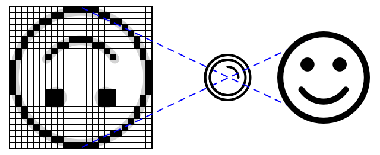
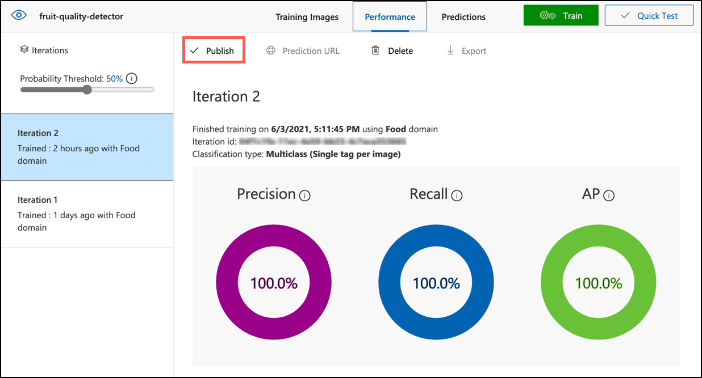
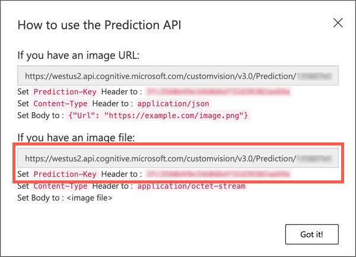
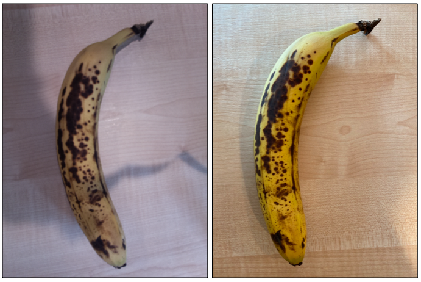

# Check fruit quality from an IoT device

Add a sketchnote if possible/appropriate


## Pre-lecture quiz

[Pre-lecture quiz](https://brave-island-0b7c7f50f.azurestaticapps.net/quiz/31)

## Introduction

In the last lesson you learned about image classifiers, and how to train them to detect good and bad fruit. To use this image classifier in an IoT application, you need to be able to capture an image using some kind of camera, and send this image to the cloud to be classified.

In this lesson you will learn about camera sensors, and how to use them with an IoT device to capture an image. You will also learn how to call the image classifier from your IoT device.

In this lesson we'll cover:

* [Camera sensors](#camera-sensors)
* [Capture an image using an IoT device](#capture-an-image-using-an-iot-device)
* [Publish your image classifier](#publish-your-image-classifier)
* [Classify images from your IoT device](#classify-images-from-your-iot-device)
* [Improve the model](#Improve-the-model)

## Camera sensors

Camera sensors, as the name suggests, are cameras that you can connect to your IoT device. They can take still images, or capture streaming video. Some will return raw image data, others will compress the image data into an image file such as a JPEG or PNG. Usually the cameras that work with IoT devices are much smaller and lower resolution that what you might be used to, but you can get high resolution cameras that will rival top end phones. You can get all manner of interchangeable lenses, multiple camera setups, infra-red thermal cameras, or UV cameras.



Most camera sensors use image sensors where each pixel is a photodiode. A lens focuses the image onto the image sensor, and thousands or millions of photodiodes detect the light falling on each one, and record that as pixel data.

> 💁 Lenses invert images, the camera sensor then flips the image back the right way round. This is the same in your eyes - what you see is detected upside down on the back of your eye and your brain corrects it.

> 🎓 The image sensor is known as an Active-Pixel Sensor (APS), and the most popular type of APS is a complementary metal-oxide semiconductor sensor, or CMOS. You may have heard the term CMOS sensor used for camera sensors.

Camera sensors are digital sensors, sending image data as digital data, usually with the help of a library that provides the communication. Cameras connect using protocols like SPI to allow them to send large quantities of data - images are substantially larger than single numbers from a sensor such as a temperature sensor.

✅ What are the limitations around image size with IoT devices? Think about the constraints especially on microcontroller hardware.

## Capture an image using an IoT device

You can use your IoT device to capture and image to be classified.

### Task - capture an image using an IoT device

Work through the relevant guide to capture an image using your IoT device:

* [Arduino - Wio Terminal](wio-terminal-camera.md)
* [Single-board computer - Raspberry Pi](pi-camera.md)
* [Single-board computer - Virtual device](virtual-device-camera.md)

## Publish your image classifier

You trained your image classifier in the last lesson. Before you can use it from your IoT device, you need to publish the model.

### Model iterations

When your model was training in the last lesson, you may notice that the **Performance** tab shows iterations on the side. When you first trained the model you would have seen *Iteration 1* in training. When you improved the model using the prediction images, you would have seen *Iteration 2* in training.

Every time you train the model, you get a new iteration. This is a way to keep track of the different versions of your model trained on different data sets. When you do a **Quick Test**, there is a drop-down you can use to select the iteration, so you can compare the results across multiple iterations.

When you are happy with an iteration, you can publish it to make it available to be used from external applications. This way you can have a published version that is used by your devices, then work on a new version over multiple iterations, then publish that once you are happy with it.

### Task - publish an iteration

Iterations are published from the Custom Vision portal.

1. Launch the Custom Vision portal at [CustomVision.ai](https://customvision.ai) and sign in if you don't have it open already.

1. Select the **Performance** tab from the options at the top

1. Select the latest iteration from the *Iterations* list on the side

1. Select the **Publish** button for the iteration

    

1. In the *Publish Model* dialog, set the *Prediction resource* to the `fruit-quality-detector-prediction` resource you created in the last lesson. Leave the name as `Iteration2`, and select the **Publish** button.

1. Once published, select the **Prediction URL** button. This will show details of the prediction API, and you will need these to call the model from your IoT device. The lower section is labelled *If you have an image file*, and this is the details you want. Take a copy of the URL that is shown which will be something like:

    ```output
    https://<location>.api.cognitive.microsoft.com/customvision/v3.0/Prediction/<id>/classify/iterations/Iteration2/image
    ```

    Where `<location>` will be the location you used when creating your custom vision resource, and `<id>` will be a long ID made up of letters and numbers.

    Also take a copy of the *Prediction-Key* value. This is a secure key that you have to pass when you call the model. Only applications that pass this key are allowed to use the model, any other applications are rejected.

    

✅ When a new iteration is published, it will have a different name. How do you think you would change the iteration an IoT device is using?

## Classify images from your IoT device

You can now use these connection details to call the image classifier from your IoT device.

### Task - classify images from your IoT device

Work through the relevant guide to classify images using your IoT device:

* [Arduino - Wio Terminal](wio-terminal-classify-image.md)
* [Single-board computer - Raspberry Pi/Virtual IoT device](single-board-computer-classify-image.md)

## Improve the model

You may find that the results you get when using the camera connected to your IoT device don't match what you would expect. The predictions are not always as accurate as using images uploaded from your computer. This is because the model was trained on different data to what is being used for predictions.

To get the best results for an image classifier, you want to train the model with images that are as similar to the images used for predictions as possible. If you used your phone camera to capture images for training, for example, the image quality, sharpness, and color will be different to a camera connected to an IoT device.



In the image above, the banana picture on the left was taken using a Raspberry Pi Camera, the one on the right was taken of the same banana in the same location using an iPhone. There is a noticeable difference in quality - the iPhone picture is sharper, with brighter colors and more contrast.

✅ What else might cause the images captured by your IoT device to have incorrect predictions? Think about the environment an IoT device might be used in, what factors can affect the image being captured?

To improve the model, you can retrain it using the images captured from the IoT device.

### Task - improve the model

1. Classify multiple images of both ripe and unripe fruit using your IoT device.

1. In the Custom Vision portal, retrain the model using the images on the *Predictions* tab.

    > ⚠️ You can refer to [the instructions for retraining your classifier in lesson 1 if needed](../1-train-fruit-detector/README.md#retrain-your-image-classifier).

1. If your images look very different to the original ones used to train, you can delete all the original images by selecting them in the *Training Images* tab and selecting the **Delete** button. To select an image, move your cursor over it and a tick will appear, select that tick to select or deselect the image.

1. Train a new iteration of the model and publish it using the steps above.

1. Update the endpoint URL in your code, and re-run the app.

1. Repeat these steps until you are happy with the results of the predictions.

---

## 🚀 Challenge

How much does image resolution or lighting affect the prediction?

Try changing the resolution of the images in your device code and see if it makes a difference to the quality of the images. Also try changing lighting.

If you were to create a production device to sell to farms or factories, how would you ensure it gives consistent results all the time?

## Post-lecture quiz

[Post-lecture quiz](https://brave-island-0b7c7f50f.azurestaticapps.net/quiz/32)

## Review & Self Study

You trained your custom vision model using the portal. This relies on having images available - and in the real world you may not be able to get training data that matches what the camera on your device captures. You can work round this by training directly from your device using the training API, to train a model using images captured from your IoT device.

* Read up on the training API in the [Using the Custom Vision SDK quick start](https://docs.microsoft.com/azure/cognitive-services/custom-vision-service/quickstarts/image-classification?tabs=visual-studio&pivots=programming-language-python&WT.mc_id=academic-17441-jabenn)

## Assignment

[Respond to classification results](assignment.md)
