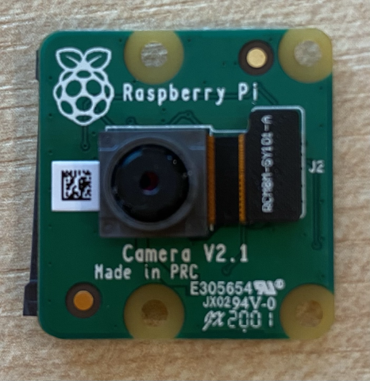
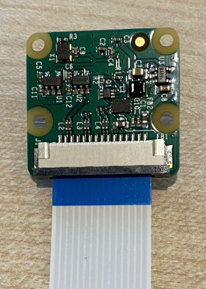
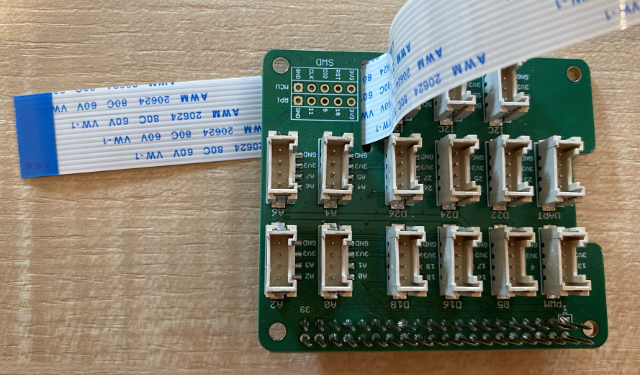
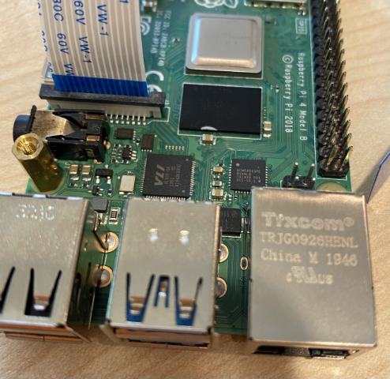
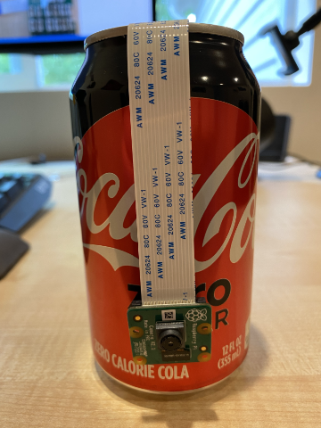

# Capture an image - Raspberry Pi

In this part of the lesson, you will add a camera sensor to your Raspberry Pi, and read images from it.

## Hardware

The Raspberry Pi needs a camera.

The camera you'll use is a [Raspberry Pi Camera Module](https://www.raspberrypi.org/products/camera-module-v2/). This camera is designed to work with the Raspberry Pi and connects via a dedicated connector on the Pi.

> 💁 This camera uses the [Camera Serial Interface, a protocol from the  Mobile Industry Processor Interface Alliance](https://wikipedia.org/wiki/Camera_Serial_Interface), known as MIPI-CSI. This is a dedicated protocol for sending images

## Connect the camera

The camera can be connected to the Raspberry Pi using a ribbon cable.

### Task - connect the camera



1. Power off the Pi.

1. Connect the ribbon cable that comes with the camera to the camera. To do this, pull gently on the black plastic clip in the holder so that it comes out a little bit, then slide the cable into the socket, with the blue side facing away from the lens, the metal pin strips facing towards the lens. Once it is all the way in, push the black plastic clip back into place.

    You can find an animation showing how to open the clip and insert the cable on the [Raspberry Pi Getting Started with the Camera module documentation](https://projects.raspberrypi.org/en/projects/getting-started-with-picamera/2).

    

1. Remove the Grove Base Hat from the Pi.

1. Pass the ribbon cable through the camera slot in the Grove Base Hat. Make sure the blue side of the cable faces towards the analog ports labelled **A0**, **A1** etc.

    

1. Inset the ribbon cable into the camera port on the Pi. Once again, pull the black plastic clip up, insert the cable, then push the clip back in. The blue side of the cable should face the USB and ethernet ports.

    

1. Refit the Grove Base Hat

## Program the camera

The Raspberry Pi can now be programmed to use the camera using the [PiCamera](https://pypi.org/project/picamera/) Python library.

### Task - program the camera

Program the device.

1. Power up the Pi and wait for it to boot

1. Launch VS Code, either directly on the Pi, or connect via the Remote SSH extension.

1. By default the camera socket on the Pi is turned off. You can turn it on by running the following commands from your terminal:

    ```sh
    sudo raspi-config nonint do_camera 0
    sudo reboot
    ```

    This will toggle a setting to enable the camera, then reboot the Pi to make that setting take effect. Wait for the Pi to reboot, then re-launch VS Code.

1. From the terminal, create a new folder in the `pi` users home directory called `fruit-quality-detector`. Create a file in this folder called `app.py`.

1. Open this folder in VS Code

1. To interact with the camera, you can use the PiCamera Python library. Install the Pip package for this with the following command:

    ```sh
    pip3 install picamera
    ```

1. Add the following code to your `app.py` file:

    ```python
    import io
    import time
    from picamera import PiCamera
    ```

    This code imports some libraries needed, including the `PiCamera` library.

1. Add the following code below this to initialize the camera:

    ```python
    camera = PiCamera()
    camera.resolution = (640, 480)
    camera.rotation = 0
    
    time.sleep(2)
    ```

    This code creates a PiCamera object, sets the resolution to 640x480. Although higher resolutions are supported (up to 3280x2464), the image classifier works on much smaller images (227x227) so there is no need to capture and send larger images.

    The `camera.rotation = 0` line sets the rotation of the image. The ribbon cable comes in to the bottom of the camera, but if your camera was rotated to allow it to point easier at the item you want to classify, then you can change this line to the number of degrees of rotation.

    

    For example, if you suspend the ribbon cable over something so that it is at the top of the camera, then set the rotation to be 180:

    ```python
    camera.rotation = 180
    ```

    The camera takes a few seconds to start up, hence the `time.sleep(2)`

1. Add the following code below this to capture the image as binary data:

    ```python
    image = io.BytesIO()
    camera.capture(image, 'jpeg')
    image.seek(0)
    ```

    This codes creates a `BytesIO` object to store binary data. The image is read from the camera as a JPEG file and stored in this object. This object has a position indicator to know where it is in the data so that more data can be written to the end if needed, so the `image.seek(0)` line moves this position back to the start so that all the data can be read later.

1. Below this, add the following to save the image to a file:

    ```python
    with open('image.jpg', 'wb') as image_file:
        image_file.write(image.read())
    ```

    This code opens a file called `image.jpg` for writing, then reads all the data from the `BytesIO` object and writes that to the file.

    > 💁 You can capture the image directly to a file instead of a `BytesIO` object by passing the file name to the `camera.capture` call. The reason for using the `BytesIO` object is so that later in this lesson you can send the image to your image classifier.

1. Point the camera at something and run this code.

1. An image will be captured and saved as `image.jpg` in the current folder. You will see this file in the VS Code explorer. Select the file to view the image. If it needs rotation, update the `camera.rotation = 0` line as necessary and take another picture.

> 💁 You can find this code in the [code-camera/pi](code-camera/pi) folder.

😀 Your camera program was a success!
