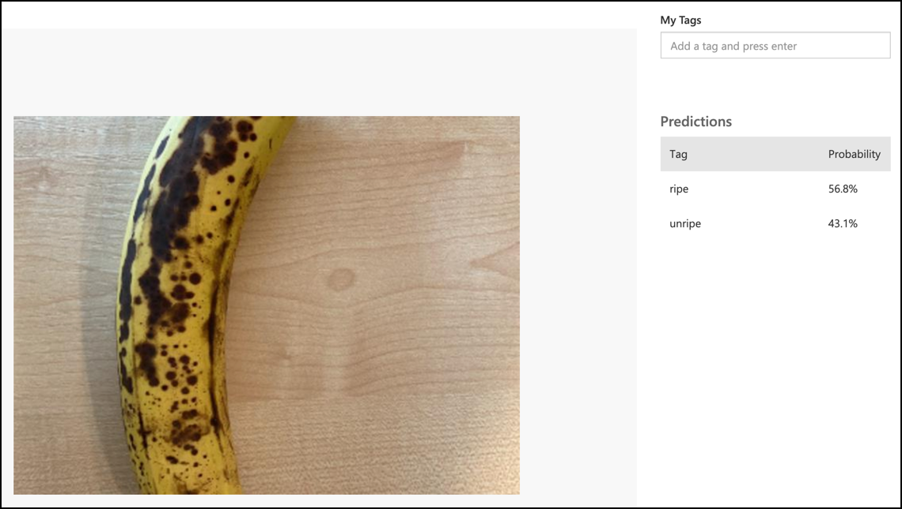

# Classify an image - Virtual IoT Hardware and Raspberry Pi

In this part of the lesson, you will add send the image captured by the camera to the Custom Vision service to classify it.

## Send images to Custom Vision

The Custom Vision service has a Python SDK you can use to classify images.

### Task - send images to Custom Vision

1. Open the `fruit-quality-detector` folder in VS Code. If you are using a virtual IoT device, make sure the virtual environment is running in the terminal.

1. The Python SDK to send images to Custom Vision is available as a Pip package. Install it with the following command:

    ```sh
    pip3 install azure-cognitiveservices-vision-customvision
    ```

1. Add the following import statements at the top of the `app.py` file:

    ```python
    from msrest.authentication import ApiKeyCredentials
    from azure.cognitiveservices.vision.customvision.prediction import CustomVisionPredictionClient
    ```

    This brings in some modules from the Custom Vision libraries, one to authenticate with the prediction key, and one to provide a prediction client class that can call Custom Vision.

1. Add the following code to to the end of the file:

    ```python
    prediction_url = '<prediction_url>'
    prediction_key = '<prediction key>'
    ```

    Replace `<prediction_url>` with the URL you copied from the *Prediction URL* dialog earlier in this lesson. Replace `<prediction key>` with the prediction key you copied from the same dialog.

1. The prediciton URL that was provided by the *Prediction URL* dialog is designed to be used when calling the REST endpoint directly. The Python SDK uses parts of the URL in different places. Add the following code to break apart this URL into the parts needed:

    ```python
    parts = prediction_url.split('/')
    endpoint = 'https://' + parts[2]
    project_id = parts[6]
    iteration_name = parts[9]
    ```

    This splits the URL, extracting the endpoint of `https://<location>.api.cognitive.microsoft.com`, the project ID, and the name of the published iteration.

1. Create a predictor object to perform the prediction with the following code:

    ```python
    prediction_credentials = ApiKeyCredentials(in_headers={"Prediction-key": prediction_key})
    predictor = CustomVisionPredictionClient(endpoint, prediction_credentials)
    ```

    The `prediction_credentials` wrap the prediction key. These are then used to create a prediction client object pointing at the endpoint.

1. Send the image to custom vision using the following code:

    ```python
    image.seek(0)
    results = predictor.classify_image(project_id, iteration_name, image)
    ```

    This rewinds the image back to the start, then sends it to the prediction client.

1. Finally, show the results with the following code:

    ```python
    for prediction in results.predictions:
        print(f'{prediction.tag_name}:\t{prediction.probability * 100:.2f}%')
    ```

    This will loop through all the predictions that have been returned and show them on the terminal. The probabilities returned are floating point numbers from 0-1, with 0 being a 0% chance of matching the tag, and 1 being a 100% chance.

    > 💁 Image classifiers will return the percentages for all tags that have been used. Each tag will have a probability that the image matches that tag.

1. Run your code, with your camera pointing at some fruit, or an appropriate image set, or fruit visible on your webcam if using virtual IoT hardware. You will see the output in the console:

    ```output
    (.venv) ➜  fruit-quality-detector python app.py
    ripe:   56.84%
    unripe: 43.16%
    ```

    You will be able to see the image that was taken, and these values in the **Predictions** tab in Custom Vision.

    

> 💁 You can find this code in the [code-classify/pi](code-classify/pi) or [code-classify/virtual-device](code-classify/virtual-device) folder.

😀 Your camera program was a success!
