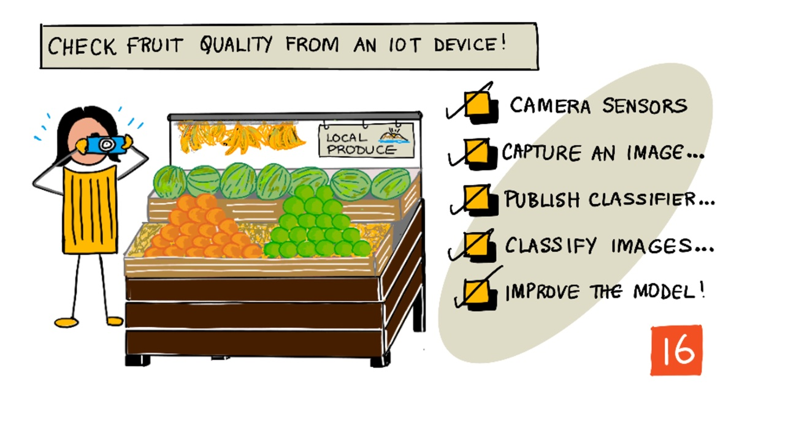

# IoT ডিভাইস ব্যবহার করে ফল এর মান যাচাই 



> স্কেচনোটটি তৈরী করেছেন [Nitya Narasimhan](https://github.com/nitya)। বড় সংস্করণে দেখার জন্য ছবিটিতে ক্লিক করতে হবে।

## লেকচার-পূর্ববর্তী কুইজ

[লেকচার-পূর্ববর্তী কুইজ](https://black-meadow-040d15503.1.azurestaticapps.net/quiz/31)

## সূচনা

পূর্ববর্তী লেসন এ আমরা ইমেজ ক্লাসিফায়ার নিয়ে জানলাম এবং আরো জেনেছি কিভাবে তাদেরকে প্রশিক্ষিত (train) করা যায় ভাল এবং খারাপ ফল সনাক্ত করার জন্য। এই ইমেজ ক্লাসিফায়ার IoT এপ্লিকেশন এ ব্যবহার করতে আমাদেরকে কোনো ধরনের ক্যামেরা দিয়ে ইমেজ ক্যাপচার করতে হবে এবং সেই ইমেজটি ক্লাউড এ পাঠাতে হবে।


এই লেসন এ আমরা ক্যামেরা সেন্সর নিয়ে জানবো এবং কিভাবে এগুলোকে IoT ডিভাইস এর সাথে ব্যবহার করে ইমেজ ক্যাপচার করতে হয় তা শিখবো। এছাড়াও আমরা দেখবো কিভাবে ইমেজ ক্লাসিফায়ারকে IoT ডিভাইস থেকে কল করতে হয়। 

এই লেসন এ আমরা কভার করবোঃ 

* [ক্যামেরা সেন্সর](#ক্যামেরা-সেন্সর)
* [IoT ডিভাইস ব্যবহার করে ইমেজ ক্যাপচার করা](#IoT-ডিভাইস-ব্যবহার-করে-ইমেজ-ক্যাপচার-করা)
* [আমাদের ইমেজ ক্লাসিফায়ার পাবলিশ করি](#আমাদের-ইমেজ-ক্লাসিফায়ার-পাবলিশ-করি)
* [IoT ডিভাইস থেকে ইমেজ ক্লাসিফাই করা](#IoT-ডিভাইস-থেকে-ইমেজ-ক্লাসিফাই-করা)
* [Model উন্নত করা](#Model-উন্নত-করা)

## ক্যামেরা সেন্সর

ক্যামেরা সেন্সর, তার নামের মতই এমন ক্যামেরা যা IoT ডিভাইস এর সাথে কানেক্ট করা যায়। এগুলো স্থিরচিত্র অথবা স্ট্রিমিং ভিডিও ক্যাপচার করতে পারে, কিছু ডিভাইস গুলো মূল ইমেজ ডাটা ফেরত পাঠাই , বাকি গুলো  ইমেজ ডাটা কমপ্রেস করে JPEG অথবা PNG টাইপ এর ইমেজ ফাইল বানাবে। সাধারণত যে কামেরা  গুলো IoT ডিভাইস গুলোর সাথে ব্যবহার করা হয়  আমরা যেগুলো ব্যবহার করে অভ্যস্ত সেগুলো থেকে অনেক ছোট সাইজ এর এবং কম রেজোলিউশান এর, কিন্তু আমরা হাই রেজোলিউশান এর ক্যামেরা নিতে পারি যেগুলো আধুনিক ফোন গুলার সাথে টেক্কা দেয়। আমরা সব ধরনের ইন্টারচেঞ্জেবল লেন্স, কয়েকটা ক্যামেরা সেটাপ, ইনফ্রারেড থার্মাল ক্যামেরা অথবা ইউভি ক্যামেরা নিতে পারি।


বেশিরভাগ ক্যামেরা সেন্সর ইমেজ সেন্সর ব্যবহার করে যেখানে প্রত্যেক পিক্সেল হল ফটোডায়োড। একটা লেন্স ইমেজ সেন্সর এর উপর ইমেজ টাকে ফোকাস করে এবং হাজার অথবা  লক্ষ লক্ষ ফটোডায়োড প্রত্যেকে তার উপর আপতিত আলো ডিটেক্ট করে এবং পিক্সেল ডাটা হিসাবে রেকর্ড করে।

> 💁 লেন্স ইমেজ কে উল্টায়, পরে ক্যামেরা সেন্সর আবার ঠিক ভাবে ইমেজটাকে উল্টায়। ঠিক একই রকম আমাদের চোখে হয় - আমরা যা দেখি তা চোখের পিছনে উল্টো ভাবে ডিটেক্ট করে এবুং ব্রেন সেটাকে ঠিক করে। 

> 🎓 ইমেজ সেন্সরটা একটিভ-পিক্সেল সেন্সর (APS) হিসেবে পরিচিত, এবং সবচেয়ে জনপ্রিয় টাইপ এর  APS হল কমপ্লিমেন্টারি মেটাল-অক্সাইড সেমিকন্ডাক্টর সেন্সর,  অথবা CMOS। আমরা শুনে থাকতে পারি  ক্যামেরা সেন্সর এ CMOS সেন্সর ব্যবহার এর টার্ম টা।


ক্যামেরা সেন্সর হল ডিজিটাল সেন্সর , ইমেজ ডাটা কে ডিজিটাল ডাটা হিসেবে পাঠায়, সাধারণত যে লাইব্রেরি কমিউনিকেশন প্রদান করে তার সাহায্য নিয়ে, ক্যামেরা গুলো কানেক্ট করে SPI এর মত প্রোটকল ব্যবহার করে যা তাদের বড় পরিমাণে ডাটা পাঠাতে অনুমোদন দেয় - ইমেজ গুলো temperature সেন্সর এর মত সেন্সর থেকে পাওয়া সিংগেল নাম্বার থেকে যথেষ্ট পরিমাণে বড়।


✅ IoT ডিভাইস গুলোর ইমেজ সাইজ এর সীমাবদ্ধতা কি কি? সীমাবদ্ধতাগুলো চিন্তা করি বিশেষ করে মাইক্রোকন্ট্রোলার হার্ডওয়ার এর উপর।


## IoT ডিভাইস ব্যবহার করে ইমেজ ক্যাপচার করা

আমরা আমাদের IoT ডিভাইস  ক্যাপচার এবং ইমেজ ক্লাসিফাই করতে ব্যবহার করতে পারি।

### কাজ - IoT ডিভাইস ব্যবহার করে ইমেজ ক্যাপচার করা

নিম্নের কোন একটি প্রাসঙ্গিক গাইড এর মাধ্যমে IoT ডিভাইস ব্যবহার করে ইমেজ ক্যাপচার করিঃ 


* [Arduino - Wio Terminal](../wio-terminal-camera.md)
* [Single-board computer - Raspberry Pi](../pi-camera.md)
* [Single-board computer - Virtual device](../virtual-device-camera.md)


## আমাদের ইমেজ ক্লাসিফায়ার পাবলিশ করি

আমরা শেষ লেসন এ ইমেজ ক্লাসিফায়ার ট্রেন করেছিলাম। IoT ডিভাইস এটা ব্যবহার করার আগে, আমাদের model তা পাবলিশ করতে হবে। 

### Model Iteration

যখন আমাদের মডেলে শেষ লেসন এ ট্রেনিং হচ্ছিলো, আমরা হয়ত খেয়াল করছিলাম যে **Performance** ট্যাব সাইড এ Iteration গুলো দেখায়। যখন আমরা প্রথম model টা ট্রেন করি তখন আমরা দেখে থাকতে পারি  *Iteration 1* ট্রেইনিং এ। যখন আমরা model টাকে  প্রেডিকশন ইমেজ ব্যবহার করে আরো উন্নত করি, তখন আমরা দেখে থাকতে পারি *Iteration 2* ট্রেইনিং এ।

প্রতেকবার আমরা যখন model টাকে ট্রেইন করি, আমরা নতুন Iteration পাই। এভাবে আমরা বিভিন্ন ডাটাসেট এর উপর ট্রেইন করা আমাদের model এর বিভিন্ন ভার্সন ট্র্যাক করতে পারি। যখন আমরা **Quick Test** করি, এখানে আমরা Iteration সিলেক্ট করার একটি ড্রপডাউন মেনু পাই, যেন আমরা বিভিন্ন Iteration এর রেজাল্ট তুলনা করতে পারি।

যখন আমরা একটি Iteration নিয়ে সন্তুষ্ট হই, আমরা এটাকে পাবলিশ করতে পারি এক্সটার্নাল এপ্লিকেশন থেকে ব্যবহার সহজলভ্য করার জন্য। এভাবে আমরা আমাদের ডিভাইস দিয়ে ব্যবহার করা একটি পাবলিক ভার্সন পেতে পারি, পরে আরো নতুন কিছু Iteration এর উপর নতুন ভার্সন নিয়ে কাজ করতে পারি, পরে যখন আমরা এটা নিয়ে সন্তুষ্ট হব তখন এটা পাবলিশ করতে পারি।

### কাজ - Iteration পাবলিশ করা 

Iteration গুলো কাস্টম ভিসন পোর্টাল থেকে পাবলিশ করতে হয়।

1. [CustomVision.ai](https://customvision.ai) তে কাস্টম ভিসন পোর্টাল লঞ্চ করি এবং সাইন ইন করি যদি ইতিমধ্যে এটা খুলে না থাকি। পরে আমাদের `fruit-quality-detector`  প্রোজেক্ট খুলি।


1. উপরের  অপশন থেকে **Performance** ট্যাব সিলেক্ট করি।

1. সাইড এর *Iterations* লিস্ট থেকে সর্বশেষ Iteration সিলেক্ট করি।

1. Iteration এর জন্য **Publish** বাটন সিলেক্ট করি।

    


1. *Publish Model* ডায়লগ এ, *Prediction resource* এ আগের লেসন এ আমাদের তৈরি রিসোর্স `fruit-quality-detector-prediction` সেট করি। নাম হিসেবে  `Iteration2` রাখি, এবং **Publish** বাটন সিলেক্ট করি। 


1. একবার পাবলিশ করা হলে, **Prediction URL** বাটন সিলেক্ট করি। এটা প্রেডিকশন এপিআই এর ডিটেলস দেখাবে, এবং আমাদের IoT ডিভাইস থেকে model কে কল করতে এগুলো দরকার হবে। নিচের সেকশন কে *If you have an image file* হিসেবে লেবেল করা এবং এই ডিটেইল গুলো আমরা চাই। দেখানো URL এর কপি করি যেটা কিছু টা এরকম হবেঃ

    ```output
    https://<location>.api.cognitive.microsoft.com/customvision/v3.0/Prediction/<id>/classify/iterations/Iteration2/image
    ```
    যেখানে `<location>` হবে কাস্টম ভিসন পোর্টাল রিসোর্স তৈরি করার সময় ব্যবহার করা লোকেশন, এবং `<id>` হবে অনেকগুলো লেটার এবং নাম্বার দিয়ে তৈরি করা লম্বা আইডি।

    এছাড়াও *Prediction-Key* ভ্যালু এর একটি কপি নিই। এটা একটি সিকিউরড কী (KEY) যেটা model কে কল করার সময় পাস করা হয়। শুধুমাত্র যে আপ্লিকেশন গুলো এই কি পাস করবে তাদেরকে model টা ব্যবহার করতে দেয়া হবে, অন্য সব আপ্লিকেশন কে প্রত্যাখ্যান হবে।

    


✅ যখন একটি নতুন Iteration পাবলিশ করা হয়, তখন এটার অন্য নাম থাকে। IoT ডিভাইস এর ব্যবহার করা Iteration আমরা কিভাবে পরিবর্তন করা যায় সেটা আমরা কিভাবে চিন্তা করতে পারি।

## IoT ডিভাইস থেকে ইমেজ ক্লাসিফাই করা

আমরা এখন এই কানেকশন ডিটেইলস গুলো IoT ডিভাইস থেকে ইমেজ ক্লাসিফায়ার কল করার জন্য ব্যবহার করতে পারি।

### কাজ - আমাদের IoT ডিভাইস থেকে ইমেজ ক্লাসিফাই করা

প্রাসঙ্গিক গাইড এর মাধ্যমে কাজ IoT ডিভাইস ব্যবহার করে ইমেজ ক্যাপচার করিঃ

* [Arduino - Wio Terminal](../wio-terminal-classify-image.md)
* [Single-board computer - Raspberry Pi/Virtual IoT device](../single-board-computer-classify-image.md)

## Model উন্নত করা

আমরা যেনে থাকতে পারি যে, IoT ডিভাইস এর সাথে কানেক্টেড থাকা ক্যামেরা থেকে আমরা আশানুরূপ রেজাল্ট নাও পেতে পারি। আমাদের কম্পিউটার থেকে আপলোড করা ইমেজ ব্যবহার করা  প্রেডিকশন গুলো সবসময় সঠিক হয় না।  এটার কারন হল Model যে ডাটার উপর ট্রেইন করা হয়েছে তার থেকে ভিন্ন ডাটা প্রেডিকশন এর জন্য ব্যবহার করা।

ইমেজ ক্লাসিফায়ার থেকে সবচেয়ে ভাল রেজাল্ট এর জন্য, আমরা প্রেডিকশন এর জন্য ব্যবহার করা ইমেজ এর মত যথাসম্ভব অনুরূপ  ইমেজ উপর আমাদের model ট্রেইন করতে চাবো। উদাহরণ স্বরূপ, আমরা যদি ট্রেইনিং এর ইমেজ ক্যাপচার এর জন্য ফোন ক্যামেরা ব্যবহার করি, সেটার ইমেজ কোয়ালিটি, শার্পনেস, এবং কালার একট IoT ডিভাইস এর সাথে কানেক্টেড ক্যামেরা থেকে ভিন্ন হবে।


উপরের ইমেজ এ, বামের কলার ছবি একটি রাস্পবেরি পাই ক্যামেরা থেকে নেয়া হয়েছিল, ডানের টা একই কলার ছবি আইফোন ক্যামেরা থেকে নেয়া হয়েছিল। এখানের কোয়ালিটির দিক থেকে লক্ষণীয় ভিন্নতা আছে - আইফোন এর ছবি টা শার্পার,  উজ্জ্বল কালার সহ এবং বেশি কন্ট্রাস্ট এর।


✅ আমাদের IoT ডিভাইস দিয়ে ক্যাপচার করা ইমেজ এর ভুল প্রেডিকশন এর জন্য আর কি কি কারন থাকতে পারে? একটা IoT ডিভাইস যে পরিবেশে ব্যবহার করা হতে পারে সেটা নিয়ে চিন্তা করি, কি কি ফ্যাক্টর ক্যাপচার করা ইমেজ কে প্রভাবিত করতে পারে।

মডেল কে উন্নত করার জন্য, আমরা IoT ডিভাইস থেকে ক্যাপচার করা ইমেজ দিয়ে  রিট্রেইন করতে পারি।

---

### কাজ - মডেল উন্নত করা

1. আমাদের IoT ডিভাইস দিয়ে পাকা এবং কাঁচা ফলের কিছু ইমেজ ক্লাসিফাই করি।

1. কাস্টম ভিসন পোর্টাল এ, *Predictions* ট্যাব এর ইমেজ ব্যবহার করে রিট্রেইন করি।

     > ⚠️আমরা  [এই সিরিজের ১ম লেসন থেকে ক্লাসিফায়ার retain করার জন্য প্রয়োজনীয় নির্দেশনা](../1-train-fruit-detector/README.md#retrain-your-image-classifier) দেখতে পারি, যদি প্রয়োজন হয়।


1. যদি আমাদের ইমেজ ট্রেইনিং এ ব্যবহার করা আসল ইমেজ থেকে দেখতে অনেক ভিন্ন হয়, আমরা আসল ইমেজ গুলো *Training Images* ট্যাব সিলেক্ট করে এবং **Delete** বাটন সিলেক্ট করে ডিলিট করতে পারি। ইমেজ সিলেক্ট করার জন্য, আমাদের কার্সর তা এর উপর মুভ করি এবং একটি টিক আসবে, টিক টা সিলেক্ট অথবা ডিসিলেক্ট করি ইমেজ সিলেক্ট অথবা ডিসিলেক্ট করার জন্য।

1. একটি নতুন Iteration ট্রেইন করি এবং উপরের ধাপ ব্যবহার করে পাবলিশ করি।

1. আমাদের কোড এর endpoint URL আপডেট করি, এবং অ্যাপ তা পুনরায় রান করি।

1. প্রেডিকশন এর রেসাল্ট নিয়ে সন্তুষ্ট না হওয়া পর্যন্ত এই ধাপ গুলো Iteration করি।

---


## 🚀 চ্যালেঞ্জ

ইমেজ এর রেজোলিউশন অথবা আলোর উপস্থিতি এখানে প্রেডিকশন কে কতটুকু প্রভাবিত করে?

আমাদের ডিভাইস এর কোড এ ইমেজ এর রেজোলিউশন পরিবর্তন করার চেষ্টা করি এবং দেখি এটা ইমেজ এর কোয়ালিটি তে কোন পার্থক্য আনে কিনা। এছাড়াও আলো চেঞ্জ করেও চেষ্টা করে দেখতে পারি।

যদি আমরা এই প্রোডাকশন ডিভাইসটি কোন ফার্ম অথবা ফ্যাক্টরি তে বিক্রয়ের জন্য তৈরী করি, আমরা কিভাবে নিশ্চিত করতে পারি যে এটা সব সময় ধারাবাহিকভাবে ভালো ফলাফল দিবে?

## লেকচার-পরবর্তী কুইজ

[লেকচার-পরবর্তী কুইজ](https://black-meadow-040d15503.1.azurestaticapps.net/quiz/32)

## রিভিউ ও স্ব-অধ্যয়ন

আমরা আমাদের কাস্টম ভিসন মডেল পোর্টাল ব্যবহার করে ট্রেইন করেছি। এটা ইমেজ এর সহজলভ্যতার উপর নির্ভর করে - এবং বাস্তব জগতে আমরা আমাদের ক্যামেরা ডিভাইস এর সাথে মিলে এমন ট্রেইনিং ডাটা হয়ত পাবো না। আমরা এটার বদলে আমাদের ডিভাইস থেকে সরাসরি ট্রেইনিং করতে পারি করতে এপিআই ব্যবহার করে, IoT ডিভাইস থেকে ক্যাপচার করা ইমেজ দিয়ে মডেল ট্রেইন করার জন্য।

* ট্রেইনিং এপিআই সম্পর্কে আরো জানতে [using the Custom Vision SDK quick start](https://docs.microsoft.com/azure/cognitive-services/custom-vision-service/quickstarts/image-classification?WT.mc_id=academic-17441-jabenn&tabs=visual-studio&pivots=programming-language-python) দেখতে পারি।

## এসাইনমেন্ট

[ক্লাসিফিকেশন রেজাল্টের প্রতিক্রিয়া জানানো](assignment.bn.md)
