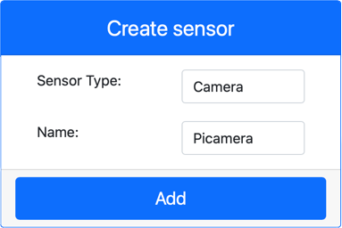
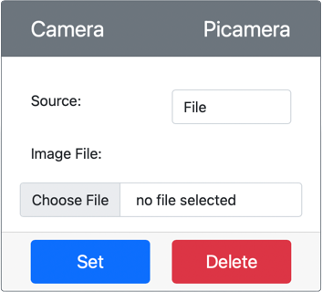
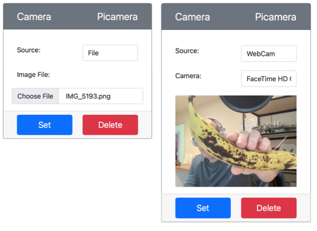

# Capture an image - Virtual IoT Hardware

In this part of the lesson, you will add a camera sensor to your virtual IoT device, and read images from it.

## Hardware

The virtual IoT device will use a simulated camera that sends either images from files, or from your webcam.

### Add the camera to CounterFit

To use a virtual camera, you need to add one to the CounterFit app

#### Task - add the camera to CounterFit

Add the Camera to the CounterFit app.

1. Create a new Python app on your computer in a folder called `fruit-quality-detector` with a single file called `app.py` and a Python virtual environment, and add the CounterFit pip packages.

    > ⚠️ You can refer to [the instructions for creating and setting up a CounterFit Python project in lesson 1 if needed](../../../1-getting-started/lessons/1-introduction-to-iot/virtual-device.md).

1. Install an additional Pip package to install a CounterFit shim that can talk to Camera sensors by simulating some of the [Picamera Pip package](https://pypi.org/project/picamera/). Make sure you are installing this from a terminal with the virtual environment activated.

    ```sh
    pip install counterfit-shims-picamera
    ```

1. Make sure the CounterFit web app is running

1. Create a camera:

    1. In the *Create sensor* box in the *Sensors* pane, drop down the *Sensor type* box and select *Camera*.

    1. Set the *Name* to `Picamera`

    1. Select the **Add** button to create the camera

    

    The camera will be created and appear in the sensors list.

    

## Program the camera

The virtual IoT device can now be programmed to use the virtual camera.

### Task - program the camera

Program the device.

1. Make sure the `fruit-quality-detector` app is open in VS Code

1. Open the `app.py` file

1. Add the following code to the top of `app.py` to connect the app to CounterFit:

    ```python
    from counterfit_connection import CounterFitConnection
    CounterFitConnection.init('127.0.0.1', 5000)
    ```

1. Add the following code to your `app.py` file:

    ```python
    import io
    from counterfit_shims_picamera import PiCamera
    ```

    This code imports some libraries needed, including the `PiCamera` class from the counterfit_shims_picamera library.

1. Add the following code below this to initialize the camera:

    ```python
    camera = PiCamera()
    camera.resolution = (640, 480)
    camera.rotation = 0
    ```

    This code creates a PiCamera object, sets the resolution to 640x480. Although higher resolutions are supported, the image classifier works on much smaller images (227x227) so there is no need to capture and send larger images.

    The `camera.rotation = 0` line sets the rotation of the image in degrees. If you need to rotate the image from the webcam or the file, set this as appropriate. For example, if you want to change the image of a banana on a webcam in landscape mode to be portrait, set `camera.rotation = 90`.

1. Add the following code below this to capture the image as binary data:

    ```python
    image = io.BytesIO()
    camera.capture(image, 'jpeg')
    image.seek(0)
    ```

    This codes creates a `BytesIO` object to store binary data. The image is read from the camera as a JPEG file and stored in this object. This object has a position indicator to know where it is in the data so that more data can be written to the end if needed, so the `image.seek(0)` line moves this position back to the start so that all the data can be read later.

1. Below this, add the following to save the image to a file:

    ```python
    with open('image.jpg', 'wb') as image_file:
        image_file.write(image.read())
    ```

    This code opens a file called `image.jpg` for writing, then reads all the data from the `BytesIO` object and writes that to the file.

    > 💁 You can capture the image directly to a file instead of a `BytesIO` object by passing the file name to the `camera.capture` call. The reason for using the `BytesIO` object is so that later in this lesson you can send the image to your image classifier.

1. Configure the image that the camera in CounterFit will capture. You can either set the *Source* to *File*, then upload an image file, or set the *Source* to *WebCam*, and images will be captured from your web cam. Make sure you select the **Set** button after selecting a picture or selecting your webcam.

    

1. An image will be captured and saved as `image.jpg` in the current folder. You will see this file in the VS Code explorer. Select the file to view the image. If it needs rotation, update the `camera.rotation = 0` line as necessary and take another picture.

> 💁 You can find this code in the [code-camera/virtual-iot-device](code-camera/virtual-iot-device) folder.

😀 Your camera program was a success!
