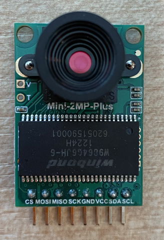
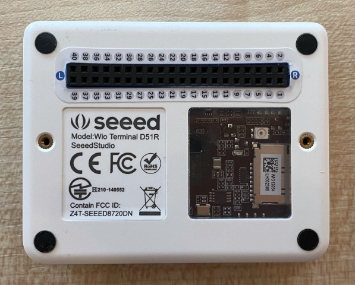
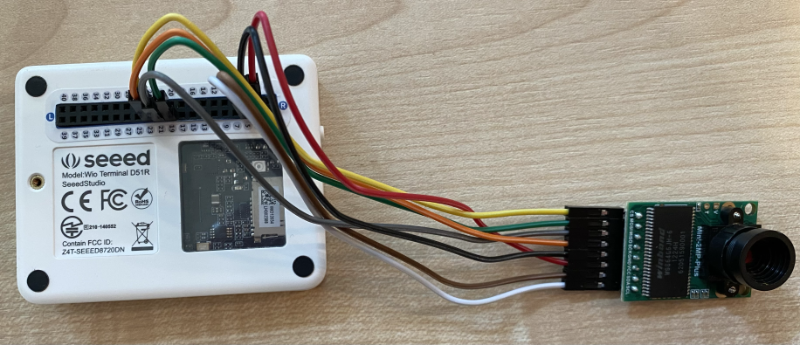
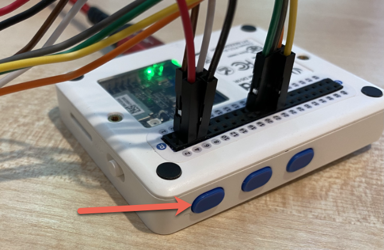
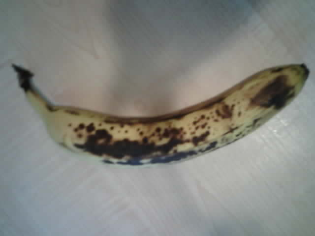

# Capture an image - Wio Terminal

In this part of the lesson, you will add a camera to your Wio Terminal, and capture images from it.

## Hardware

The Wio Terminal needs a camera.

The camera you'll use is an [ArduCam Mini 2MP Plus](https://www.arducam.com/product/arducam-2mp-spi-camera-b0067-arduino/). This is a 2 megapixel camera based on the OV2640 image sensor. It communicates over an SPI interface to capture images, and uses I<sup>2</sup>C to configure the sensor.

## Connect the camera

The ArduCam doesn't have a Grove socket, instead it connects to both the SPI and I<sup>2</sup>C busses via the GPIO pins on the Wio Terminal.

### Task - connect the camera

Connect the camera.



1. The pins on the base of the ArduCam need to be connected to the GPIO pins on the Wio Terminal. To make it easier to find the right pins, attach the GPIO pin sticker that comes with the Wio Terminal around the pins:

    

1. Using jumper wires, make the following connections:

    | ArduCAM pin | Wio Terminal pin | Description                             |
    | ----------- | ---------------- | --------------------------------------- |
    | CS          | 24 (SPI_CS)      | SPI Chip Select                         |
    | MOSI        | 19 (SPI_MOSI)    | SPI Controller Output, Peripheral Input |
    | MISO        | 21 (SPI_MISO)    | SPI Controller Input, peripheral Output |
    | SCK         | 23 (SPI_SCLK)    | SPI Serial Clock                        |
    | GND         | 6 (GND)          | Ground - 0V                             |
    | VCC         | 4 (5V)           | 5V power supply                         |
    | SDA         | 3 (I2C1_SDA)     | I<sup>2</sup>C Serial Data              |
    | SCL         | 5 (I2C1_SCL)     | I<sup>2</sup>C Serial Clock             |

    

    The GND and VCC connections provide a 5V power supply to the ArduCam. It runs at 5V, unlike Grove sensors that run at 3V. This power comes directly from the USB-C connection that powers the device.

    > 💁 For the SPI connection the pin labels on the ArduCam and the Wio Terminal pin names used in code still use the old naming convention. The instructions in this lesson will use the new naming convention, except when the pin names are used in code.

1. You can now connect the Wio Terminal to your computer.

## Program the device to connect to the camera

The Wio Terminal can now be programmed to use the attached ArduCAM camera.

### Task - program the device to connect to the camera

1. Create a brand new Wio Terminal project using PlatformIO. Call this project `fruit-quality-detector`. Add code in the `setup` function to configure the serial port.

1. Add code to connect to WiFi, with your WiFi credentials in a file called `config.h`. Don't forget to add the required libraries to the `platformio.ini` file.

1. The ArduCam library isn't available as an Arduino library that can be installed from the `platformio.ini` file. Instead it will need to be installed from source from their GitHub page. You can get this by either:

    * Cloning the repo from [https://github.com/ArduCAM/Arduino.git](https://github.com/ArduCAM/Arduino.git)
    * Heading to the repo on GitHub at [github.com/ArduCAM/Arduino](https://github.com/ArduCAM/Arduino) and downloading the code as a zip from from the **Code** button

1. You only need the `ArduCAM` folder from this code. Copy the entire folder into the `lib` folder in your project.

    > ⚠️ The entire folder must be copied, so the code is in `lib/ArduCam`. Do not just copy the contents of the `ArduCam` folder into the `lib` folder, copy the entire folder over.

1. The ArduCam library code works for multiple types of camera. The type of camera you want to use is configured using compiler flags - this keeps the built library as small as possible by removing code for cameras you are not using. To configure the library for the OV2640 camera, add the following to the end of the `platformio.ini` file:

    ```ini
    build_flags =
        -DARDUCAM_SHIELD_V2
        -DOV2640_CAM
    ```

    This sets 2 compiler flags:

      * `ARDUCAM_SHIELD_V2` to tell the library the camera is on an Arduino board, known as a shield.
      * `OV2640_CAM` to tell the library to only include code for the OV2640 camera

1. Add a header file into the `src` folder called `camera.h`. This will contain code to communicate with the camera. Add the following code to this file:

    ```cpp
    #pragma once
    
    #include <ArduCAM.h>
    #include <Wire.h>
    
    class Camera
    {
    public:
        Camera(int format, int image_size) : _arducam(OV2640, PIN_SPI_SS)
        {
            _format = format;
            _image_size = image_size;
        }
    
        bool init()
        {
            // Reset the CPLD
            _arducam.write_reg(0x07, 0x80);
            delay(100);
    
            _arducam.write_reg(0x07, 0x00);
            delay(100);
    
            // Check if the ArduCAM SPI bus is OK
            _arducam.write_reg(ARDUCHIP_TEST1, 0x55);
            if (_arducam.read_reg(ARDUCHIP_TEST1) != 0x55)
            {
                return false;
            }
                
            // Change MCU mode
            _arducam.set_mode(MCU2LCD_MODE);
    
            uint8_t vid, pid;
    
            // Check if the camera module type is OV2640
            _arducam.wrSensorReg8_8(0xff, 0x01);
            _arducam.rdSensorReg8_8(OV2640_CHIPID_HIGH, &vid);
            _arducam.rdSensorReg8_8(OV2640_CHIPID_LOW, &pid);
            if ((vid != 0x26) && ((pid != 0x41) || (pid != 0x42)))
            {
                return false;
            }
            
            _arducam.set_format(_format);
            _arducam.InitCAM();
            _arducam.OV2640_set_JPEG_size(_image_size);
            _arducam.OV2640_set_Light_Mode(Auto);
            _arducam.OV2640_set_Special_effects(Normal);
            delay(1000);
    
            return true;
        }
    
        void startCapture()
        {
            _arducam.flush_fifo();
            _arducam.clear_fifo_flag();
            _arducam.start_capture();
        }
    
        bool captureReady()
        {
            return _arducam.get_bit(ARDUCHIP_TRIG, CAP_DONE_MASK);
        }
    
        bool readImageToBuffer(byte **buffer, uint32_t &buffer_length)
        {
            if (!captureReady()) return false;
    
            // Get the image file length
            uint32_t length = _arducam.read_fifo_length();
            buffer_length = length;
    
            if (length >= MAX_FIFO_SIZE)
            {
                return false;
            }
            if (length == 0)
            {
                return false;
            }
    
            // create the buffer
            byte *buf = new byte[length];
    
            uint8_t temp = 0, temp_last = 0;
            int i = 0;
            uint32_t buffer_pos = 0;
            bool is_header = false;
    
            _arducam.CS_LOW();
            _arducam.set_fifo_burst();
            
            while (length--)
            {
                temp_last = temp;
                temp = SPI.transfer(0x00);
                //Read JPEG data from FIFO
                if ((temp == 0xD9) && (temp_last == 0xFF)) //If find the end ,break while,
                {
                    buf[buffer_pos] = temp;
    
                    buffer_pos++;
                    i++;
                    
                    _arducam.CS_HIGH();
                }
                if (is_header == true)
                {
                    //Write image data to buffer if not full
                    if (i < 256)
                    {
                        buf[buffer_pos] = temp;
                        buffer_pos++;
                        i++;
                    }
                    else
                    {
                        _arducam.CS_HIGH();
    
                        i = 0;
                        buf[buffer_pos] = temp;
    
                        buffer_pos++;
                        i++;
    
                        _arducam.CS_LOW();
                        _arducam.set_fifo_burst();
                    }
                }
                else if ((temp == 0xD8) & (temp_last == 0xFF))
                {
                    is_header = true;
    
                    buf[buffer_pos] = temp_last;
                    buffer_pos++;
                    i++;
    
                    buf[buffer_pos] = temp;
                    buffer_pos++;
                    i++;
                }
            }
            
            _arducam.clear_fifo_flag();
    
            _arducam.set_format(_format);
            _arducam.InitCAM();
            _arducam.OV2640_set_JPEG_size(_image_size);
    
            // return the buffer
            *buffer = buf;
        }
    
    private:
        ArduCAM _arducam;
        int _format;
        int _image_size;
    };
    ```

    This is low level code that configures the camera using the ArduCam libraries, and extracts the images when required using the SPI bus. This code is very specific to the ArduCam, so you don't need to worry about how it works at this point.

1. In `main.cpp`, add the following code beneath the other `include` statements to include this new file and create an instance of the camera class:

    ```cpp
    #include "camera.h"

    Camera camera = Camera(JPEG, OV2640_640x480);
    ```

    This creates a `Camera` saving the images as JPEGs at a resolution of 640 by 480. Although higher resolutions are supported (up to 3280x2464), the image classifier works on much smaller images (227x227) so there is no need to capture and send larger images.

1. Add the following code below this to define a function to setup the camera:

    ```cpp
    void setupCamera()
    {
        pinMode(PIN_SPI_SS, OUTPUT);
        digitalWrite(PIN_SPI_SS, HIGH);
    
        Wire.begin();
        SPI.begin();
    
        if (!camera.init())
        {
            Serial.println("Error setting up the camera!");
        }
    }
    ```

    This `setupCamera` function starts by configuring the SPI chip select pin (`PIN_SPI_SS`) as high, making the Wio Terminal the SPI controller. It then starts the I<sup>2</sup>C and SPI busses. Finally it initializes the camera class which configures the camera sensor settings and ensures everything it wired up correctly.

1. Call this function at the end of the `setup` function:

    ```cpp
    setupCamera();
    ```

1. Build and upload this code, and check the output from the serial monitor. If you see `Error setting up the camera!` then check the wiring to ensure all cables are connecting the correct pins on the ArduCam to the correct GPIO pins on the Wio Terminal, and all jumper cables are seated correctly.

## Capture an image

The Wio Terminal can now be programmed to capture an image when a button is pressed.

### Task - capture an image

1. Microcontrollers run your code continuously, so it's not easy to trigger something like taking a photo without reacting to a sensor. The Wio Terminal has buttons, so the camera can be set up to be triggered by one of the buttons. Add the following code to the end of the `setup` function to configure the C button (one of the three buttons on the top, the one closest to the power switch).

    

    ```cpp
    pinMode(WIO_KEY_C, INPUT_PULLUP);
    ```

    The mode of `INPUT_PULLUP` essentially inverts an input. For example, normally a button would send a low signal when not pressed, and a high signal when pressed. When set to `INPUT_PULLUP`, they send a high signal when not pressed, and a low signal when pressed.

1. Add an empty function to respond to the button press before the `loop` function:

    ```cpp
    void buttonPressed()
    {
        
    }
    ```

1. Call this function in the `loop` method when the button is pressed:

    ```cpp
    void loop()
    {
        if (digitalRead(WIO_KEY_C) == LOW)
        {
            buttonPressed();
            delay(2000);
        }
    
        delay(200);
    }
    ```

    This key checks to see if the button is pressed. If it is pressed, the `buttonPressed` function is called, and the loop delays for 2 seconds. This is to allow time for the button to be released so that a long press isn't registered twice.

    > 💁 The button on the Wio Terminal is set to `INPUT_PULLUP`, so send a high signal when not pressed, and a low signal when pressed.

1. Add the following code to the `buttonPressed` function:

    ```cpp
    camera.startCapture();
 
    while (!camera.captureReady())
        delay(100);

    Serial.println("Image captured");

    byte *buffer;
    uint32_t length;

    if (camera.readImageToBuffer(&buffer, length))
    {
        Serial.print("Image read to buffer with length ");
        Serial.println(length);

        delete(buffer);
    }
    ```

    This code begins the camera capture by calling `startCapture`. The camera hardware doesn't work by returning the data when you request it, instead you send an instruction to start capturing, and the camera will work in the background to capture the image, convert it to a JPEG, and store it in a local buffer on the camera itself. The `captureReady` call then checks to see if the image capture has finished.

    Once the capture has finished, the image data is copied from the buffer on the camera into a local buffer (array of bytes) with the `readImageToBuffer` call. The length of the buffer is then sent to the serial monitor.

1. Build and upload this code, and check the output on the serial monitor. Every time you press the C button, an image will be captured and you will see the image size sent to the serial monitor.

    ```output
    Connecting to WiFi..
    Connected!
    Image captured
    Image read to buffer with length 9224
    Image captured
    Image read to buffer with length 11272
    ```

    Different images will have different sizes. They are compressed as JPEGs and the size of a JPEG file for a given resolution depends on what is in the image.

> 💁 You can find this code in the [code-camera/wio-terminal](code-camera/wio-terminal) folder.

😀 You have successfully captured images with your Wio Terminal.

## Optional - verify the camera images using an SD card

The easiest way to see the images that were captured by the camera is to write them to an SD card in the Wio Terminal and then view them on your computer. Do this step if you have a spare microSD card and a microSD card socket in your computer, or an adapter.

The Wio Terminal only supports microSD cards of up to 16GB in size. If you have a larger SD card then it won't work.

### Task - verify the camera images using an SD card

1. Format a microSD card as FAT32 or exFAT using the relevant applications on your computer (Disk Utility on macOS, File Explorer on Windows, or using command line tools in Linux)

1. Insert the microSD card in the socket just below the power switch. Make sure it is all the way in until it clicks and stays in place, you may need to push it using a fingernail or a thin tool.

1. Add the following include statements at the top of the `main.cpp` file:

    ```cpp
    #include "SD/Seeed_SD.h"
    #include <Seeed_FS.h>
    ```

1. Add the following function before the `setup` function:

    ```cpp
    void setupSDCard()
    {
        while (!SD.begin(SDCARD_SS_PIN, SDCARD_SPI))
        {
            Serial.println("SD Card Error");
        }
    }
    ```

    This configures the SD card using the SPI bus.

1. Call this from the `setup` function:

    ```cpp
    setupSDCard();
    ```

1. Add the following code above the `buttonPressed` function:

    ```cpp
    int fileNum = 1;

    void saveToSDCard(byte *buffer, uint32_t length)
    {
        char buff[16];
        sprintf(buff, "%d.jpg", fileNum);
        fileNum++;
    
        File outFile = SD.open(buff, FILE_WRITE );
        outFile.write(buffer, length);
        outFile.close();

        Serial.print("Image written to file ");
        Serial.println(buff);
    }
    ```

    This defines a global variable for a file count. This is used for the image file names so multiple images can be captured with incrementing file names - `1.jpg`, `2.jpg` and so on.

    It then defines the `saveToSDCard` that takes a buffer of byte data, and the length of the buffer. A file name is created using the file count, and the file count is incremented ready for the next file. The binary data from the buffer is then written to the file.

1. Call the `saveToSDCard` function from the `buttonPressed` function. The call should be **before** the buffer is deleted:

    ```cpp
    Serial.print("Image read to buffer with length ");
    Serial.println(length);

    saveToSDCard(buffer, length);
    
    delete(buffer);
    ```

1. Build and upload this code, and check the output on the serial monitor. Every time you press the C button, an image will be captured and saved to the SD card.

    ```output
    Connecting to WiFi..
    Connected!
    Image captured
    Image read to buffer with length 16392
    Image written to file 1.jpg
    Image captured
    Image read to buffer with length 14344
    Image written to file 2.jpg
    ```

1. Power off the microSD card and eject it by pushing it in slightly and releasing, and it will pop out. You may need to use a thin tool to do this. Plug the microSD card into your computer to view the images.

    

    > 💁 It may take a few images for the white balance of the camera to adjust itself. You will notice this based on the color of the images captured, the first few may look off color. You can always work around this by changing the code to capture a few images that are ignored in the `setup` function.
