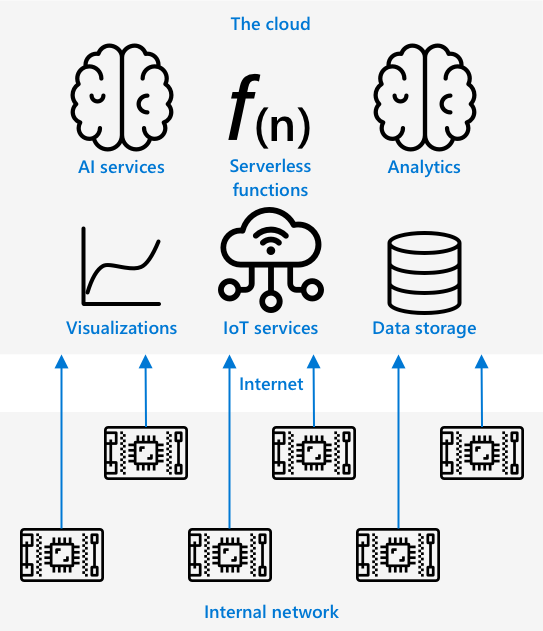
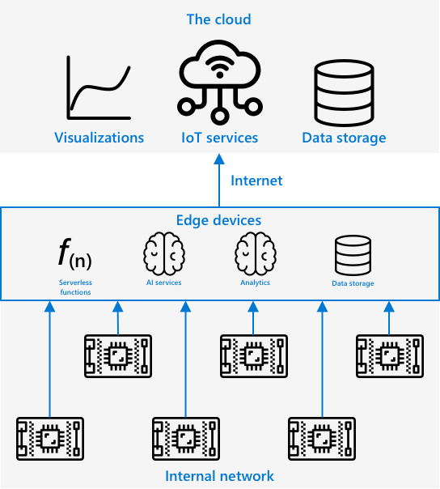
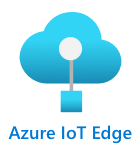
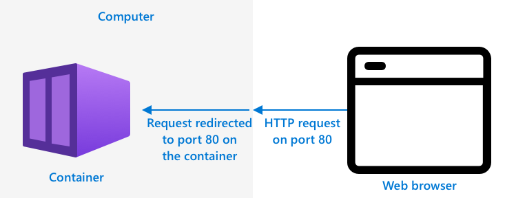
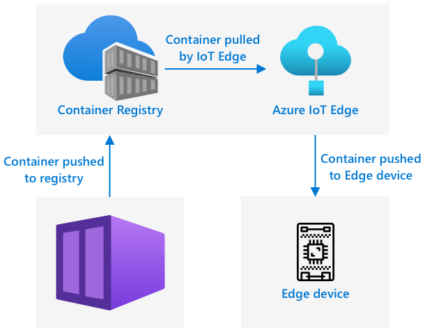
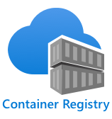

# Run your fruit detector on the edge

This video gives an overview of running image classifiers on IoT devices, the topic that is covered in this lesson.

[](https://www.youtube.com/watch?v=_K5fqGLO8us)

## Pre-lecture quiz

[Pre-lecture quiz](https://brave-island-0b7c7f50f.azurestaticapps.net/quiz/33)

## Introduction

In the last lesson you used your image classifier to classify ripe and unripe fruit, sending an image captured by the camera on your IoT device over the internet to a cloud service. These calls take time, cost money, and depending on the kind of image data you are using, could have privacy implications.

In this lesson you will learn about how to run machine learning (ML) models on the edge - on IoT devices running on your own network rather than in the cloud. You will learn the benefits and drawbacks of edge computing versus cloud computing, how to deploy your AI model to the edge, and how to access it from your IoT device.

In this lesson we'll cover:

* [Edge computing](#edge-computing)
* [Azure IoT Edge](#Azure-IoT-Edge)
* [Register an IoT Edge device](#register-an-iot-edge-device)
* [Set up an IoT Edge device](#set-up-an-iot-edge-device)
* [Export your model](#export-your-model)
* [Prepare your container for deployment](#prepare-your-container-for-deployment)
* [Deploy your container](#deploy-your-container)
* [Use your IoT Edge device](#use-your-iot-edge-device)

## Edge computing

Edge computing involves having computers that process IoT data as close as possible to where the data is generated. Instead of having this processing in the cloud, it is moved to the edge of the cloud - your internal network.



In the lessons so far, you have had devices gathering data and sending data to the cloud to be analyzed, running serverless functions or AI models in the cloud.



Edge computing involves moving some of the cloud services off the cloud and onto computers running on the same network as the IoT devices, only communicating with the cloud if needed. For example, you can run AI models on edge devices to analyse fruit for ripeness, and only send analytics back to the cloud, such as the number of ripe pieces of fruit vs unripe.

✅ Think about the IoT applications you have built so far. Which parts of them could be moved to the edge.

### Upsides

The upsides of edge computing are:

1. **Speed** - edge computing is ideal for time-sensitive data as actions are done on the same network as the device, rather than making calls across the internet. This enables higher speeds as internal networks can run at substantially faster speeds than internet connections, with the data travelling much shorter distance.

    > 💁 Despite optical cables being used for internet connections allowing data to travel at the speed of light, data can take time to travel around the world to cloud providers. For example, if you are sending data from Europe to cloud services in the US it takes at least 28ms for the data to cross the atlantic in an optical cable, and that is ignoring the time taken to get the data to the transatlantic cable, convert from electrical to light signals and back again the other side, then from the optical cable to the cloud provider.

    Edge computing also requires less network traffic, reducing the risk of your data slowing down due to congestion on the limited bandwidth available for an internet connection.

1. **Remote accessibility** - edge compute works when you have limited or no connectivity, or connectivity is too expensive to use continually. For example when working in humanitarian disaster areas where infrastructure is limited, or in developing nations.

1. **Lower costs** - performing data collection, storage, analysis, and triggering actions on edge device reduces usage of cloud services which can reduce the overall cost of your IoT application. There has been a recent rise in devices designed for edge computing, such as AI accelerator boards like the [Jetson Nano from NVIDIA](https://developer.nvidia.com/embedded/jetson-nano-developer-kit), which can run AI workloads using GPU-based hardware on devices that cost less than US$100.

1. **Privacy and security** - with edge compute, data stays on your network and is not uploaded to the cloud. This is often preferred for sensitive and personally identifiable information, especially because data does not need to be stored after it has been analyzed, which greatly reduces the risk of data leaks. Examples include medical data and security camera footage.

1. **Handling insecure devices** - if you have devices with known security flaws that you don't want to connect directly to your network or the internet, then you can connect them to a separate network to a gateway IoT Edge device. This edge device can then also have a connection to your wider network or the internet, and manage the data flows back and forth.

1. **Support for incompatible devices** - if you have devices that cannot connect to IoT Hub, for example devices that can only connect using HTTP connections or devices that only have Bluetooth to connect, you can use an IoT edge device as a gateway device, forwarding on messages to IoT Hub.

✅ Do some research: What other upsides might there be to edge computing?

### Downsides

There are downsides to edge computing, where the cloud may be a preferred option:

1. **Scale and flexibility** - cloud computing can adjust to network and data needs in real-time by adding or reducing servers and other resources. To add more edge computers requires manually adding more devices.

1. **Reliability and resiliency** - cloud computing provides multiple servers often in multiple locations for redundancy and disaster recovery. To have the same level of redundancy on the edge requires large investments and a lor of configuration work.

1. **Maintenance** - cloud service providers provide system maintenance and updates.

✅ Do some research: What other downsides might there be to edge computing?

The downsides are really the opposite of the upsides of using the cloud - you have to build and manage these devices yourself, rather than relying on the expertise and scale of cloud providers.

Some of the risks are mitigated by the very nature of edge computing. For example, if you have an edge device running in a factory gathering data from machinery, you don't need to think about some disaster recovery scenarios. If the power to the factory goes out then you don't need a backup edge device as the machines that generate the data the edge device processes will also be without power.

For IoT systems, you'll often want a blend of cloud and edge computing, leveraging each service based on the needs of the system, its customers, and its maintainers.

## Azure IoT Edge



Azure IoT Edge is a service that can help you to move workloads out of the cloud and to the edge. You set up a device as an edge device, and from the cloud you can deploy code to that edge device. This allows you to mix the capabilities of the cloud and the edge.

> 🎓 *Workloads* is a term for any service that does some kind of work, such as AI models, applications, or serverless functions.

For example, you can train an image classifier in the cloud, then from the cloud deploy it to an edge device. Your IoT device then sends images to the edge device for classification, rather than sending the images over the internet. If you need to deploy a new iteration of the model, you can train it in the cloud and use IoT Edge to update the model on the edge device to your new iteration.

> 🎓 Software that is deployed to IoT Edge is known as *modules*. By default IoT Edge runs modules that communicate with IoT Hub, such as the `edgeAgent` and `edgeHub` modules. When you deploy an image classifier, this is deployed as an additional module.

IoT Edge is built into IoT Hub, so you can manage edge devices using the same service you would use to manage IoT devices, with the same level of security.

IoT Edge runs code from *containers* - self contained applications that are run in isolation from the rest of the applications on your computer. When you run a container it act's like a separate computer running inside your computer, with it's own software, services and applications running. Most of the time containers cannot access anything on your computer unless you choose to share things like a folder with the container. The container then exposes services via an open port that you can connect to or expose to your network.



For example, you can have a container with a web site running on port 80, the default HTTP port, and you can then expose it from your computer also on port 80.

✅ Do some research: Read up on containers and services such as Docker or Moby.

You can use Custom Vision to download image classifiers and deploy them as containers, either running direct to a device or deployed via IoT Edge. Once they are running in a container, they can be accessed using the same REST API as the cloud version, but with the endpoint pointing to the Edge device running the container.

## Register an IoT Edge device

To use an IoT Edge device, it needs to be registered in IoT Hub.

### Task - register an IoT Edge device

1. Create an IoT Hub in the `fruit-quality-detector` resource group. Give it a unique name based around `fruit-quality-detector`.

1. Register an IoT Edge device called `fruit-quality-detector-edge` in your IoT Hub. The command to do this is similar to the one used to register a non-edge device, except you pass the `--edge-enabled` flag.

    ```sh
    az iot hub device-identity create --edge-enabled \
                                      --device-id fruit-quality-detector-edge \
                                      --hub-name <hub_name>
    ```

    Replace `<hub_name>` with the name of your IoT Hub.

1. Get the connection string for your device using the following command:

    ```sh
    az iot hub device-identity connection-string show --device-id fruit-quality-detector-edge \
                                                      --output table \
                                                      --hub-name <hub_name>
    ```

    Replace `<hub_name>` with the name of your IoT Hub.

    Take a copy of the connection string that is shown in the output.

## Set up an IoT Edge device

Once you have created the edge device registration in your IoT Hub, you can set up the edge device.

### Task - Install and start the IoT Edge Runtime

**The IoT Edge runtime only runs Linux containers.** It can be run on Linux, or on Windows using Linux Virtual Machines.

* If you are using a Raspberry Pi as your IoT device, then this runs a supported version of Linux and can host the IoT Edge runtime. Follow the [Install Azure IoT Edge for Linux guide on Microsoft docs](https://docs.microsoft.com/azure/iot-edge/how-to-install-iot-edge?WT.mc_id=academic-17441-jabenn) to install IoT Edge and set the connection string.

    > 💁 Remember, Raspberry Pi OS is a variant of Debian Linux.

* If you are not using a Raspberry Pi, but have a Linux computer, you can run the IoT Edge runtime. Follow the [Install Azure IoT Edge for Linux guide on Microsoft docs](https://docs.microsoft.com/azure/iot-edge/how-to-install-iot-edge?WT.mc_id=academic-17441-jabenn) to install IoT Edge and set the connection string.

* If you are using Windows, you can install the IoT Edge runtime in a Linux Virtual Machine by following the [Install and start the IoT Edge runtime section of the Deploy your first IoT Edge module to a Windows device quickstart on Microsoft docs](https://docs.microsoft.com/azure/iot-edge/quickstart?WT.mc_id=academic-17441-jabenn#install-and-start-the-iot-edge-runtime). You can stop when you reach the *Deploy a module* section.

* If you are using macOS, you can create a virtual machine (VM) in the cloud to use for your IoT Edge device. These are computers you can create in the cloud and access over the internet. You can create a Linux VM that has IoT Edge installed. Follow the [Create a virtual machine running IoT Edge guide](vm-iotedge.md) for instructions on how to do this.

## Export your model

To run the classifier at the edge, it needs to be exported from Custom Vision. Custom Vision can generate two types of models - standard models and compact models. Compact models use various techniques to reduce the size of the model, making it small enough to be downloaded and deployed on IoT devices.

When you created the image classifier, you used the *Food* domain, a version of the model that is optimized for training on food images. In Custom Vision, you change the domain of your project, using your training data to train a new model with the new domain. All of the domains supported by Custom Vision are available as standard and compact.

### Task - train your model using the Food (compact) domain

1. Launch the Custom Vision portal at [CustomVision.ai](https://customvision.ai) and sign in if you don't have it open already. Then open your `fruit-quality-detector` project.

1. Select the **Settings** button (the ⚙ icon)

1. In the *Domains* list, select *Food (compact)*

1. Under *Export Capabilities*, make sure *Basic platforms (Tensorflow, CoreML, ONNX, ...)* is selected.

1. At the bottom of the Settings page, select **Save Changes**.

1. Retrain the model with the **Train** button, selecting *Quick training*.

### Task - export your model

Once the model has been trained, it needs to be exported as a container.

1. Select the **Performance** tab, and find your latest iteration that was trained using the compact domain.

1. Select the **Export** button at the top.

1. Select **DockerFile**, then choose a version that matches your edge device:

    * If you are running IoT Edge on a Linux computer, a Windows computer or a Virtual Machine, select the *Linux* version.
    * If you are running IoT Edge on a Raspberry Pi, select the *ARM (Raspberry Pi 3)* version.

    > 🎓 Docker is one of the most popular tools for managing containers, and a DockerFile is a set of instructions on how to set up the container.

1. Select **Export** to get Custom Vision to create the relevant files, then **Download** to download them in a zip file.

1. Save the files to your computer, then unzip the folder.

## Prepare your container for deployment



Once you have downloaded your model, it needs to be built into a container, then pushed to a container registry - an online location where you can store containers. IoT Edge can then download the container from the registry and push it to your device.



The container registry you will use for this lesson is Azure Container Registry. This is not a free service, so to save money make sure you [clean up your project](../../../clean-up.md) once you are finished.

> 💁 You can see the costs of using an Azure Container Registry in the [Azure Container Registry pricing page](https://azure.microsoft.com/pricing/details/container-registry/?WT.mc_id=academic-17441-jabenn)

### Task - install Docker

To build and deploy the classifier classifier, you'll need to install [Docker](https://www.docker.com/).

1. Follow the Docker installation instructions on the [Docker install page](https://www.docker.com/products/docker-desktop) to install Docker Desktop or the Docker engine. Ensure it is running after installation.

### Task - create a container registry resource

1. Run the following command from your Terminal or command prompt to create an Azure Container Registry resource:

    ```sh
    az acr create --resource-group fruit-quality-detector \
                  --sku Basic \
                  --name <Container registry name>
    ```

    Replace `<Container registry name>` with a unique name for your container registry, using letters and numbers only. Base this around `fruitqualitydetector`. This name becomes part of the URL to access the container registry, so needs to be globally unique.

1. Log in to the Azure Container Registry with the following command:

    ```sh
    az acr login --name <Container registry name>
    ```

    Replace `<Container registry name>` with the name you used for your container registry.

1. Set the container registry into admin mode so you can generate a password with the following command:

    ```sh
    az acr update --admin-enabled true \
                 --name <Container registry name>
    ```

    Replace `<Container registry name>` with the name you used for your container registry.

1. Generate passwords for your container registry with the following command:

    ```sh
     az acr credential renew --password-name password \
                             --output table \
                             --name <Container registry name>
    ```

    Replace `<Container registry name>` with the name you used for your container registry.

    Take a copy of the value of `PASSWORD`, as you will need this later.

### Task - build your container

What you downloaded from Custom Vision was a DockerFile containing instructions on how the container should be built, along with application code that will be run inside the container to host your custom vision model, along with a REST API to call it. You can use Docker to build a tagged container from the DockerFile, then push it to your container registry.

> 🎓 Containers are given a tag that defines a name and version for them. When you need to update a container you can build it with the same tag but a newer version.

1. Open your terminal or command prompt and navigate to the unzipped model that you downloaded from Custom Vision.

1. Run the following command to build and tag the image:

    ```sh
    docker build --platform <platform> -t <Container registry name>.azurecr.io/classifier:v1 .
    ```

    Replace `<platform>` with the platform that this container will run on. If you are running IoT Edge on a Raspberry Pi, set this to `linux/arm64`, otherwise set this to `linux/amd64`.

    > 💁 If you are running this command from the device you are running IoT Edge from, such as running this from your Raspberry Pi, you can omit the `--platform <platform>` part as it defaults to the current platform.

    Replace `<Container registry name>` with the name you used for your container registry.

    > 💁 If you are running Linux you nay need to use `sudo` to run this command.

    Docker will build the image, configuring all the software needed. The image will then be tagged as `classifier:v1`.

    ```output
    ➜  d4ccc45da0bb478bad287128e1274c3c.DockerFile.Linux docker build --platform linux/amd64 -t  fruitqualitydetectorjimb.azurecr.io/classifier:v1 .
    [+] Building 102.4s (11/11) FINISHED
     => [internal] load build definition from Dockerfile
     => => transferring dockerfile: 131B
     => [internal] load .dockerignore
     => => transferring context: 2B
     => [internal] load metadata for docker.io/library/python:3.7-slim
     => [internal] load build context
     => => transferring context: 905B
     => [1/6] FROM docker.io/library/python:3.7-slim@sha256:b21b91c9618e951a8cbca5b696424fa5e820800a88b7e7afd66bba0441a764d6
     => => resolve docker.io/library/python:3.7-slim@sha256:b21b91c9618e951a8cbca5b696424fa5e820800a88b7e7afd66bba0441a764d6
     => => sha256:b4d181a07f8025e00e0cb28f1cc14613da2ce26450b80c54aea537fa93cf3bda 27.15MB / 27.15MB
     => => sha256:de8ecf497b753094723ccf9cea8a46076e7cb845f333df99a6f4f397c93c6ea9 2.77MB / 2.77MB
     => => sha256:707b80804672b7c5d8f21e37c8396f319151e1298d976186b4f3b76ead9f10c8 10.06MB / 10.06MB
     => => sha256:b21b91c9618e951a8cbca5b696424fa5e820800a88b7e7afd66bba0441a764d6 1.86kB / 1.86kB
     => => sha256:44073386687709c437586676b572ff45128ff1f1570153c2f727140d4a9accad 1.37kB / 1.37kB
     => => sha256:3d94f0f2ca798607808b771a7766f47ae62a26f820e871dd488baeccc69838d1 8.31kB / 8.31kB
     => => sha256:283715715396fd56d0e90355125fd4ec57b4f0773f306fcd5fa353b998beeb41 233B / 233B
     => => sha256:8353afd48f6b84c3603ea49d204bdcf2a1daada15f5d6cad9cc916e186610a9f 2.64MB / 2.64MB
     => => extracting sha256:b4d181a07f8025e00e0cb28f1cc14613da2ce26450b80c54aea537fa93cf3bda
     => => extracting sha256:de8ecf497b753094723ccf9cea8a46076e7cb845f333df99a6f4f397c93c6ea9
     => => extracting sha256:707b80804672b7c5d8f21e37c8396f319151e1298d976186b4f3b76ead9f10c8
     => => extracting sha256:283715715396fd56d0e90355125fd4ec57b4f0773f306fcd5fa353b998beeb41
     => => extracting sha256:8353afd48f6b84c3603ea49d204bdcf2a1daada15f5d6cad9cc916e186610a9f
     => [2/6] RUN pip install -U pip
     => [3/6] RUN pip install --no-cache-dir numpy~=1.17.5 tensorflow~=2.0.2 flask~=1.1.2 pillow~=7.2.0
     => [4/6] RUN pip install --no-cache-dir mscviplib==2.200731.16
     => [5/6] COPY app /app
     => [6/6] WORKDIR /app
     => exporting to image
     => => exporting layers
     => => writing image sha256:1846b6f134431f78507ba7c079358ed66d944c0e185ab53428276bd822400386
     => => naming to fruitqualitydetectorjimb.azurecr.io/classifier:v1
    ```

### Task - push your container to your container registry

1. Use the following command to push your container to your container registry:

    ```sh
    docker push <Container registry name>.azurecr.io/classifier:v1
    ```

    Replace `<Container registry name>` with the name you used for your container registry.

    > 💁 If you are running Linux you nay need to use `sudo` to run this command.

    The container will be pushed to the container registry.

    ```output
    ➜  d4ccc45da0bb478bad287128e1274c3c.DockerFile.Linux docker push fruitqualitydetectorjimb.azurecr.io/classifier:v1
    The push refers to repository [fruitqualitydetectorjimb.azurecr.io/classifier]
    5f70bf18a086: Pushed 
    8a1ba9294a22: Pushed 
    56cf27184a76: Pushed 
    b32154f3f5dd: Pushed 
    36103e9a3104: Pushed 
    e2abb3cacca0: Pushed 
    4213fd357bbe: Pushed 
    7ea163ba4dce: Pushed 
    537313a13d90: Pushed 
    764055ebc9a7: Pushed 
    v1: digest: sha256:ea7894652e610de83a5a9e429618e763b8904284253f4fa0c9f65f0df3a5ded8 size: 2423
    ```

1. To verify the push, you can list the containers in your registry with the following command:

    ```sh
    az acr repository list --output table \
                           --name <Container registry name> 
    ```

    Replace `<Container registry name>` with the name you used for your container registry.

    ```output
    ➜  d4ccc45da0bb478bad287128e1274c3c.DockerFile.Linux az acr repository list --name fruitqualitydetectorjimb --output table
    Result
    ----------
    classifier
    ```

    You will see your classifier listed in the output.

## Deploy your container

Your container can now be deployed to your IoT Edge device. To deploy you need to define a deployment manifest - a JSON document that lists the modules that will be deployed to the edge device.

### Task - create the deployment manifest

1. Create a new file called `deployment.json` somewhere on your computer.

1. Add the following to this file:

    ```json
    {
        "content": {
            "modulesContent": {
                "$edgeAgent": {
                    "properties.desired": {
                        "schemaVersion": "1.1",
                        "runtime": {
                            "type": "docker",
                            "settings": {
                                "minDockerVersion": "v1.25",
                                "loggingOptions": "",
                                "registryCredentials": {
                                    "ClassifierRegistry": {
                                        "username": "<Container registry name>",
                                        "password": "<Container registry password>",
                                        "address": "<Container registry name>.azurecr.io"
                                      }
                                }
                            }
                        },
                        "systemModules": {
                            "edgeAgent": {
                                "type": "docker",
                                "settings": {
                                    "image": "mcr.microsoft.com/azureiotedge-agent:1.1",
                                    "createOptions": "{}"
                                }
                            },
                            "edgeHub": {
                                "type": "docker",
                                "status": "running",
                                "restartPolicy": "always",
                                "settings": {
                                    "image": "mcr.microsoft.com/azureiotedge-hub:1.1",
                                    "createOptions": "{\"HostConfig\":{\"PortBindings\":{\"5671/tcp\":[{\"HostPort\":\"5671\"}],\"8883/tcp\":[{\"HostPort\":\"8883\"}],\"443/tcp\":[{\"HostPort\":\"443\"}]}}}"
                                }
                            }
                        },
                        "modules": {
                            "ImageClassifier": {
                                "version": "1.0",
                                "type": "docker",
                                "status": "running",
                                "restartPolicy": "always",
                                "settings": {
                                    "image": "<Container registry name>.azurecr.io/classifier:v1",
                                    "createOptions": "{\"ExposedPorts\": {\"80/tcp\": {}},\"HostConfig\": {\"PortBindings\": {\"80/tcp\": [{\"HostPort\": \"80\"}]}}}"
                                }
                            }
                        }
                    }
                },
                "$edgeHub": {
                    "properties.desired": {
                        "schemaVersion": "1.1",
                        "routes": {
                            "upstream": "FROM /messages/* INTO $upstream"
                        },
                        "storeAndForwardConfiguration": {
                            "timeToLiveSecs": 7200
                        }
                    }
                }
            }
        }
    }
    ```

    > 💁 You can find this file in the [code-deployment/deployment](code-deployment/deployment) folder.

    Replace the three instances of`<Container registry name>` with the name you used for your container registry. One is in the `ImageClassifier` module section, the other two are in the `registryCredentials` section.

    Replace `<Container registry password>` in the `registryCredentials` section with your container registry password.

1. From the folder containing your deployment manifest, run the following command:

    ```sh
    az iot edge set-modules --device-id fruit-quality-detector-edge \
                            --content deployment.json \
                            --hub-name <hub_name>
    ```

    Replace `<hub_name>` with the name of your IoT Hub.

    The image classifier module will be deployed to your edge device.

### Task - verify the classifier is running

1. Connect to the IoT edge device:

    * If you are using a Raspberry Pi to run IoT Edge, connect using ssh either from your terminal, or via a remote SSH session in VS Code
    * If you are running IoT Edge in a Linux container on Windows, follow the steps in the [Verify successful configuration guide](https://docs.microsoft.com/azure/iot-edge/how-to-install-iot-edge-on-windows?view=iotedge-2018-06&tabs=powershell&WT.mc_id=academic-17441-jabenn#verify-successful-configuration) to connect to the IoT Edge device.
    * If you are running IoT Edge on a virtual machine, you can SSH into the machine using the `adminUsername` and `password` you set when creating the VM, and using either the IP address or DNS name:

        ```sh
        ssh <adminUsername>@<IP address>
        ```

        Or:

        ```sh
        ssh <adminUsername>@<DNS Name>
        ```

        Enter your password when prompted

1. Once you are connected, run the following command to get the list of IoT Edge modules:

    ```sh
    iotedge list
    ```

    > 💁 You may need to run this command with `sudo`.

    You will see the running modules:

    ```output
    jim@fruit-quality-detector-jimb:~$ iotedge list
    NAME             STATUS           DESCRIPTION      CONFIG
    ImageClassifier  running          Up 42 minutes    fruitqualitydetectorjimb.azurecr.io/classifier:v1
    edgeAgent        running          Up 42 minutes    mcr.microsoft.com/azureiotedge-agent:1.1
    edgeHub          running          Up 42 minutes    mcr.microsoft.com/azureiotedge-hub:1.1
    ```

1. Check the logs for the Image classifier module with the following command:

    ```sh
    iotedge logs ImageClassifier
    ```

    > 💁 You may need to run this command with `sudo`.

    ```output
    jim@fruit-quality-detector-jimb:~$ iotedge logs ImageClassifier
    2021-07-05 20:30:15.387144: I tensorflow/core/platform/cpu_feature_guard.cc:142] Your CPU supports instructions that this TensorFlow binary was not compiled to use: AVX2 FMA
    2021-07-05 20:30:15.392185: I tensorflow/core/platform/profile_utils/cpu_utils.cc:94] CPU Frequency: 2394450000 Hz
    2021-07-05 20:30:15.392712: I tensorflow/compiler/xla/service/service.cc:168] XLA service 0x55ed9ac83470 executing computations on platform Host. Devices:
    2021-07-05 20:30:15.392806: I tensorflow/compiler/xla/service/service.cc:175]   StreamExecutor device (0): Host, Default Version
    Loading model...Success!
    Loading labels...2 found. Success!
     * Serving Flask app "app" (lazy loading)
     * Environment: production
       WARNING: This is a development server. Do not use it in a production deployment.
       Use a production WSGI server instead.
     * Debug mode: off
     * Running on http://0.0.0.0:80/ (Press CTRL+C to quit)
    ```

### Task - test the image classifier

1. You can use CURL to test the image classifier using the IP address or host name of the computer that is running the IoT Edge agent. Find the IP address:

    * If you are on the same machine that IoT Edge is running, you can use `localhost` as the host name.
    * If you are using a VM, you can use either the IP address or the DNS name of the VM
    * Otherwise you can obtain the IP address of the machine running IoT Edge:
      * On Windows 10, follow the [Find your IP address guide](https://support.microsoft.com/windows/find-your-ip-address-f21a9bbc-c582-55cd-35e0-73431160a1b9?WT.mc_id=academic-17441-jabenn)
      * On macOS, follow the [How to find you IP address on a Mac guide](https://www.hellotech.com/guide/for/how-to-find-ip-address-on-mac)
      * On linux, follow the section on finding your private IP address in the [How to find your IP address in Linux guide](https://opensource.com/article/18/5/how-find-ip-address-linux)

1. You can test the container with a local file by running the following curl command:

    ```sh
    curl --location \
         --request POST 'http://<IP address or name>/image' \
         --header 'Content-Type: image/png' \
         --data-binary '@<file_Name>' 
    ```

    Replace `<IP address or name>` with the IP address or host name of the computer running IoT Edge. Replace `<file_Name>` with the name of the file to test.

    You will see the prediction results in the output:

    ```output
    {
        "created": "2021-07-05T21:44:39.573181",
        "id": "",
        "iteration": "",
        "predictions": [
            {
                "boundingBox": null,
                "probability": 0.9995615482330322,
                "tagId": "",
                "tagName": "ripe"
            },
            {
                "boundingBox": null,
                "probability": 0.0004384400090202689,
                "tagId": "",
                "tagName": "unripe"
            }
        ],
        "project": ""
    }
    ```

    > 💁 There is no need to provide a prediction key here, as this is not using an Azure resource. Instead security would be configured on the internal network based on internal security needs, rather than relying on a public endpoint and an API key.

## Use your IoT Edge device

Now that your Image Classifier has been deployed to an IoT Edge device, you can use it from your IoT device.

### Task - use your IoT Edge device

Work through the relevant guide to classify images using the IoT Edge classifier:

* [Arduino - Wio Terminal](wio-terminal.md)
* [Single-board computer - Raspberry Pi/Virtual IoT device](single-board-computer.md)

### Model retraining

One of the downsides to running image classifiers on IoT Edge is that they are not connected to your Custom Vision project. If you look at the **Predictions** tab in Custom Vision you won't see the images that were classified using the Edge-based classifier.

This is the expected behavior - images are not sent to the cloud for classification, so they won't be available in the cloud. One of the upsides of using IoT Edge is privacy, ensuring that images don't leave your network, another is being able to work offline, so no relying on uploading images when the device has no internet connection. The downside is improving your model - you would need to implement another way of storing images that can be manually re-classified to improve and re-train the image classifier.

✅ Think about ways to upload images to retrain the classifier.

---

## 🚀 Challenge

Running AI models on edge devices can be faster that in the cloud - the network hop is shorter. THey can also be slower as the hardware than runs the model may not be as powerful as the cloud.

Do some timings and compare if the call to your edge device is faster or slower than the call to the cloud? Think about reasons to explain the difference, or lack of difference. Research ways to run AI models faster on the edge using specialized hardware.

## Post-lecture quiz

[Post-lecture quiz](https://brave-island-0b7c7f50f.azurestaticapps.net/quiz/34)

## Review & Self Study

* Read more about containers on the [OS-level virtualization page on Wikipedia](https://wikipedia.org/wiki/OS-level_virtualization)
* Read more on edge computing, with an emphasis on how 5G can help expand edge computing in the [What is edge computing and why does it matter? article on NetworkWorld](https://www.networkworld.com/article/3224893/what-is-edge-computing-and-how-it-s-changing-the-network.html)
* Learn more about running AI services in IoT Edge by watching the [Learn How to Use Azure IoT Edge on a Pre-Built AI Service on the Edge to do Language Detection episode of Learn Live on Microsoft Channel9](https://channel9.msdn.com/Shows/Learn-Live/Sharpen-Your-AI-Edge-Skills-Episode-4-Learn-How-to-Use-Azure-IoT-Edge-on-a-Pre-Built-AI-Service-on-t?WT.mc_id=academic-17441-jabenn)

## Assignment

[Run other services on the edge](assignment.md)
