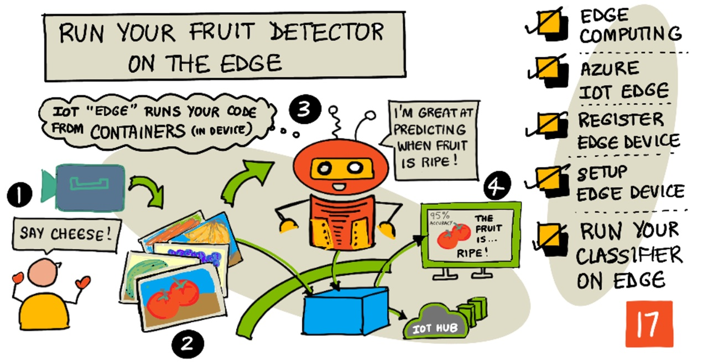

# Edge এ Fruit Detector পরিচালনা করা



> স্কেচনোটটি তৈরী করেছি [Nitya Narasimhan](https://github.com/nitya)। বড় সংস্করণে দেখার জন্য ছবিটিতে ক্লিক করতে হবে।

এই ভিডিওটি আইওটি ডিভাইসে চলমান ইমেজ ক্লাসিফায়ারগুলির একটি সংক্ষিপ্ত বিবরণ দেয়, যে বিষয়টি এই পাঠেই অন্তর্ভুক্ত।

[](https://www.youtube.com/watch?v=_K5fqGLO8us)

> 🎥 উপরের ছবিতে ক্লিক করে ভিডিওটি দেখে নিই

## লেকচার-পূর্ববর্তী কুইজ

[লেকচার-পূর্ববর্তী কুইজ](https://black-meadow-040d15503.1.azurestaticapps.net/quiz/33)

## সূচনা

গত পাঠে আমরা পাকা এবং কাঁচা ফলের শ্রেণিবিন্যাস করতে ইমেজ ক্লাসিফায়ার ব্যবহার করেছি, ইন্টারনেটে আমাদের আইওটি ডিভাইসে ক্যামেরা দ্বারা ধারণ করা একটি ছবি ক্লাউড সার্ভিসে পাঠিয়েছি। এই কাজগুলি হতে সময় নেয়, অর্থ ব্যয় হয় এবং আমরা যে ধরণের ছবি ব্যবহার করছি, তার উপর নির্ভর করে গোপনীয়তা সুংক্রান্ত বিষয়ের প্রভাব থাকতে পারে।

এই পাঠে আমরা শিখবো কিভাবে মেশিন লার্নিং (এমএল) মডেলগুলি Edge এ চালানো যায় - ক্লাউডের পরিবর্তে আমাদের নিজের নেটওয়ার্কে চলমান আইওটি ডিভাইসে। আমরা ক্লাউড কম্পিউটিং বনাম Edge কম্পিউটিং এর সুবিধা এবং অসুবিধা সম্বন্ধে জানবো, কিভাবে আমাদের AI মডেলকে Edge এ স্থাপন করবো এবং কিভাবে আমাদের IoT ডিভাইস থেকে এটি অ্যাক্সেস করবো সেটিও দেখবো।

এই পাঠে আমরা শিখবো :

* [Edge computing](#edge-computing)
* [Azure IoT Edge](#Azure-IoT-Edge)
* [IoT Edge device রেজিস্টার করা](#IoT-Edge-device-রেজিস্টার-করা)
* [IoT Edge device সেটাপ করা](#IoT-Edge-device-সেটাপ-করা)
* [মডেল এক্সপোর্ট করা](#মডেল-এক্সপোর্ট-করা)
* [ডেপ্লয়মেন্টের জন্য কন্টেইনার প্রস্তুতকরণ](#ডেপ্লয়মেন্টের-জন্য-কন্টেইনার-প্রস্তুতকরণ)
* [কন্টেইনার ডেপ্লয় করা](#কন্টেইনার-ডেপ্লয়-করা)
* [আমাদের IoT Edge device ব্যবহার করা](#আমাদের-IoT-Edge-device-ব্যবহার-করা)

## Edge computing

Edge কম্পিউটিংয়ের ধারণা টি এমন যে যেখানে ডেটা তৈরী বা যেখান থেকেই গৃহীত হয়, সেখানকার কাছাকাছি ডেটা প্রসেস করতে পারা। ক্লাউডে এই প্রসেসিং এর পরিবর্তে, এটি ক্লাউডের Edge এ স্থানান্তরিত হয় - যেটি কিনা আমাদের অভ্যন্তরীণ নেটওয়ার্ক।


এ পর্যন্ত পাঠগুলিতে আমরা শিখেছি কীভাবে আমাদের কাছের ডিভাইসগুলি তথ্য সংগ্রহ এবং ক্লাউডে ডেটা পাঠানোর জন্য বিশ্লেষণ করে, ক্লাউডে সার্ভারহীন ফাংশন বা এআই মডেল কীভাবে চালানো হয়।


Edge কম্পিউটিং এ মূলত কিছু ক্লাউড পরিষেবা বা সার্ভিসকে ক্লাউড থেকে সরিয়ে এবং IoT ডিভাইস যে নেটওয়ার্কে চলমান সেই একই নেটওয়ার্কের কোন কম্পিউটারে নিয়ে আসা। শুধুমাত্র প্রয়োজন হলেই ক্লাউডের সাথে যোগাযোগ করা হবে। উদাহরণস্বরূপ, আমরা কোন ফল পাকা কিনা তা বিশ্লেষণ করতে Edge এর ডিভাইসে এআই মডেল চালাতে পারি এবং শুধুমাত্র বিশ্লেষণগুলি ক্লাউডে ফেরত পাঠাতে পারি, যেমন ফলের পাকা বনাম কাঁচা ফলের সংখ্যা।

✅ আমরা এতদিন পর্যন্ত শেখা আইওটি অ্যাপ্লিকেশনগুলি সম্পর্কে চিন্তা করি। তাদের কোন অংশগুলি Edge এ নিয়ে আসা যেতে পারে।

### সুবিধা

Edge কম্পিউটিং এর সুবিধা গুলো হলো:

1. **দ্রততা** -  সময়-সংবেদনশীল (time-sensitive) তথ্যের জন্য খুবই সুবিধাজনক কারণ সমগ্র ইন্টারনেট জুড়ে সংযোগ করার পরিবর্তে লোকাল ডিভাইসেই কাজগুলি করা হয়। এটি উচ্চ গতিতে তা করতে সক্ষম হয় কারণ অভ্যন্তরীণ নেটওয়ার্কগুলি ইন্টারনেট সংযোগের তুলনায় যথেষ্ট দ্রুত গতিতে চলতে পারে, যার ডেটা অনেক কম দূরত্বে ভ্রমণ করে।

    > 💁 ইন্টারনেট সংযোগের জন্য অপটিক্যাল ক্যাবল ব্যবহার করা হলেও , আলোর গতিতে ডেটা পরিবহণের সুযোগ দেয়া হলেও, ডেটা ক্লাউড প্রোভাইডারদের কাছে পৌছতে সময় নিতে পারে। উদাহরণস্বরূপ, যদি আমরা ইউরোপ থেকে মার্কিন যুক্তরাষ্ট্রে ক্লাউড পরিষেবাদিতে ডেটা পাঠাই তবে অপটিক্যাল ক্যাবলে আটলান্টিক অতিক্রম করতে ডেটার জন্য কমপক্ষে 28ms সময় লাগে (এখানে তাও উপেক্ষা করা হচ্ছে - ট্রান্সঅ্যাটলান্টিক কেবলে ডেটা পাওয়া, বৈদ্যুতিক থেকে আলোকীয় সংকেতে রূপান্তর এবং তারপর আবার অপটিক্যাল ক্যাবল থেকে ক্লাউড প্রোভাইডারের কাছে পৌছানোর মত বিষয়গুলো)।

    Edge কম্পিউটিংয়ের জন্য কম নেটওয়ার্ক ট্র্যাফিকের প্রয়োজন হয়, এতে করে ইন্টারনেট সংযোগের সীমিত ব্যান্ডউইথের সমস্যা বা এর মধ্যে যানজটের ফলে আমাদের ডেটা পরিবহন ধীর হওয়ার ঝুঁকি হ্রাস করে।

1. **দূরবর্তী সংযোগ নিয়ন্ত্রণ** - Edge কম্পিউটিং কাজ করে যখন আমাদের কোন ইন্টারনেট সংযোগ থাকেনা বা খুবই সীমিত পর্যায়ের হয়। উদাহরণস্বরূপ যখন পরিবেশগত দূর্যোগ ঘটে, তখন ইন্টারনেটের কোন একসেস থাকেনা।

1. **অল্প খরচ** - Edge ডিভাইসে ডেটা সংগ্রহ, সঞ্চয়, বিশ্লেষণ এবং ট্রিগারিং কার্যক্রম সম্পাদন করা ক্লাউড পরিষেবার ব্যবহার হ্রাস করে যা আমাদের আইওটি অ্যাপ্লিকেশনের সামগ্রিক খরচ কমাতে পারে। Edge কম্পিউটিংয়ের জন্য ডিজাইন করা ডিভাইসে সাম্প্রতিক অনেক উন্নয়ন হয়েছে, সম্প্রতি এআই এক্সিলারেটর বোর্ড যেমন [NVIDIA জেটসন ন্যানো](https://developer.nvidia.com/embedded/jetson-nano-developer-kit) এর আবির্ভাব ঘটেছে, যা GPU-ভিত্তিক হার্ডওয়্যার ব্যবহার করে AI ওয়ার্কলোডগুলি চালাতে পারে যে ডিভাইসগুলির দাম US $100 এরও কম।

1. **গোপনীয়তা এবং নিরাপত্তা** - Edge কম্পিউটিং এর ক্ষেত্রে ডেটা আমাদের নেটওয়ার্কে থাকে এবং ক্লাউডে আপলোড করা হয় না। এটি প্রায়শই সংবেদনশীল এবং ব্যক্তিগতভাবে শনাক্তযোগ্য তথ্যের জন্য অধিকতর কল্যাণজনক। এছাড়াও ডেটা বিশ্লেষণ করার পরে ডেটা সংরক্ষণ করার প্রয়োজন হয় না, যা ডেটা ফাঁসের ঝুঁকি অনেক কমিয়ে দেয়। উদাহরণগুলির মধ্যে রয়েছে মেডিকেল ডেটা এবং সিসিটিভি ক্যামেরা ফুটেজ।

1. **অনিরাপদ ডিভাইসগুলি পরিচালনা করা** - যদি আমাদের জানামতে নিরাপত্তা ত্রুটিযুক্ত কোন ডিভাইস থাকে যা আমরা সরাসরি আমাদের নেটওয়ার্ক বা ইন্টারনেটের সাথে সংযুক্ত করতে চাই না, সেগুলিকে একটি পৃথক নেটওয়ার্কে গেটওয়ে আইওটি Edge ডিভাইসে সংযুক্ত করতে পারি। এই Edge ডিভাইসটি আমাদের বৃহত্তর নেটওয়ার্ক বা ইন্টারনেটের সাথেও সংযোগ স্থাপন করতে পারে এবং ডেটা প্রবাহকে সামনে পেছনে পরিচালনা করতে পারে।

1. **অসামঞ্জস্যপূর্ণ ডিভাইসের জন্য সাপোর্ট** - যদি আমাদের এমন ডিভাইস থাকে যা IoT হাবের সাথে সংযোগ করতে পারে না, উদাহরণস্বরূপ এমন ডিভাইস যা শুধুমাত্র HTTP সংযোগ ব্যবহার করে সংযোগ করতে পারে বা যে ডিভাইসগুলিতে কেবলমাত্র ব্লুটুথ সংযোগ আছে- সেক্ষেত্রে আমরা একটি IoT Edge ডিভাইসকে গেটওয়ে ডিভাইস হিসাবে ব্যবহার করতে পারি , IoT Hub- এ বার্তা পাঠানোর জন্য।

✅ কিছু গবেষণা করি: Edge কম্পিউটিং এর অন্য কোন কোন সুবিধা থাকতে পারে?

### অসুবিধা

Edge কম্পিউটিংয়ের আবার কিছু অসুবিধাও রয়েছে, যেসব ক্ষেত্রে ক্লাউড ভালো অপশন হতে পারে:

1. **স্কেল এবং ফ্লেক্সিবিলিটি** - ক্লাউড কম্পিউটিং এ সার্ভার এবং অন্যান্য রিসোর্স সংযোজন বা হ্রাস করে রিয়েল -টাইমে নেটওয়ার্ক এবং ডেটা প্রয়োজনের সাথে সামঞ্জস্য করতে পারে। কিন্তু Edge এর সুবিধা কম্পিউটারে যোগ করার জন্য ম্যানুয়ালি আরো ডিভাইস যোগ করা প্রয়োজন।

1. **নির্ভরযোগ্যতা এবং সহনশীলতা** - ক্লাউড কম্পিউটিং এ অপ্রয়োজনীয় অতিরিক্ত রিসোর্স এবং দুর্যোগকালীন পরিস্থিতি এড়ানোর জন্য প্রায়ই একাধিক স্থানে একাধিক সার্ভার সরবরাহ করে। Edge এ একই মাত্রার অপ্রয়োজনীয়তার জন্য বড় বিনিয়োগ এবং কনফিগারেশনের কাজ প্রয়োজন।

1. **রক্ষণাবেক্ষণ** - ক্লাউড পরিষেবা প্রদানকারীরারাই সিস্টেম রক্ষণাবেক্ষণ এবং আপডেট প্রদান করে।

✅ কিছু গবেষণা করি: Edge কম্পিউটিংয়ে অন্য কোন অসুবিধা থাকতে পারে?

ক্লাউড ব্যবহার করার অসুবিধার মধ্যে দেখা যায় - আমরা ক্লাউড সরবরাহকারীদের দক্ষতা এবং স্কেলের উপর নির্ভর করতে পারবোনা, বরং আমাদেরকে এই ডিভাইসগুলি নিজেই তৈরি এবং পরিচালনা করতে হবে।

Edge কম্পিউটিংয়ের দ্বারা কিছু ঝুঁকি প্রশমিত করা যায়। উদাহরণস্বরূপ, যদি আমাদের যন্ত্রপাতি সহ কারখানায় যেখান থেকে ডেটা সংগ্রহ করা হয়, সেখানেই  একটি Edge ডিভাইস থাকে, তাহলে আমাদেরকে দুর্যোগ  পরিস্থিতি সম্পর্কে ভাবতে হবে না। যদি কারখানার বিদ্যুৎ চলে যায় তাহলে আমাদের ব্যাকআপ Edge ডিভাইসের প্রয়োজন হবে না কারণ মেশিনগুলি ডেটা তৈরির পর, Edge ডিভাইসের প্রক্রিয়াগুলিও বিদ্যুৎবিহীন পরিচালনা করা যাবে।

IoT সিস্টেমের জন্য, আমরা প্রায়ই ক্লাউড এবং Edge কম্পিউটিং এর মিশ্রণ এর কৌশল গ্রহণ করি যেখানে সিস্টেম এর গ্রাহকদের এবং এর রক্ষণাবেক্ষণকারীদের প্রয়োজনের উপর ভিত্তি করে প্রতিটি সেবার সুবিধা পাওয়া যায়।

## Azure IoT Edge


Azure IoT Edge হল একটি পরিষেবা যা আমাদেরকে কাজের চাপকে ক্লাউডের বাইরে এবং Edge এ সরিয়ে নিতে সাহায্য করতে পারে। আমরা একটি Edge ডিভাইস হিসাবে একটি ডিভাইস সেট আপ, এবং ক্লাউড থেকে আমরা যে Edge ডিভাইসে কোড স্থাপন করতে পারি। এটি আমাদেরকে ক্লাউড এবং Edge এর ক্ষমতাগুলির সর্বোচ্চ ব্যবহার নিশ্চিত করে।

> 🎓 *Workloads* বলতে সেসকল সার্ভিস বোঝায় যেগুলো কোন ধরনের কাজ করে, যেমন এআই মডেল, অ্যাপ্লিকেশন বা সার্ভারলেস ফাংশন।

উদাহরণস্বরূপ, আমরা ক্লাউডে একটি ইমেজ ক্লাসিফায়ার প্রশিক্ষণ দিতে পারি, তারপর ক্লাউড থেকে এটি একটি Edge ডিভাইসে স্থাপন করি। আমাদের আইওটি ডিভাইস তারপর ইন্টারনেটে ছবি পাঠানোর পরিবর্তে Edge ডিভাইসে ইমেজ পাঠায় শ্রেণীবিন্যাসের জন্য। যদি আমাদের মডেলের পরিবর্তন বা উন্নয়ন প্রয়োজন হয়, তাহলে আমরা এটিকে ক্লাউডে প্রশিক্ষণ দিতে পারি এবং আইওটি Edge ব্যবহার করে Edge ডিভাইসে মডেলটিকে  আমরা আপডেট করতে পারি।

> 🎓 IoT Edge- এ যে সফটওয়্যারটি মোতায়েন করা হয় তা *মডিউল* নামে পরিচিত। ডিফল্টরূপে IoT Edge মডিউল চালায় যা IoT Hub- এর সাথে যোগাযোগ করে, যেমন `edgeAgent` এবং` edgeHub` মডিউল। যখন আমরা একটি ইমেজ ক্লাসিফায়ার স্থাপন করি, এটি একটি অতিরিক্ত মডিউল হিসাবে স্থাপন করা হয়।

আইওটি Edge আইওটি হাবের মধ্যেই তৈরি করা হয়েছে, তাই আমরা একই স্তরের সুরক্ষা সহ আইওটি ডিভাইসগুলি পরিচালনা করতে যে পরিষেবাটি ব্যবহার করি, সেই একই সার্ভিস দিয়ে আমরা Edge ডিভাইসগুলি পরিচালনা করতে পারি।

আইওটি Edge *কনটেইনার* থেকে কোড চালায় - এটি স্বয়ংসম্পূর্ণ অ্যাপ্লিকেশন যা আমাদের কম্পিউটারে বাকি অ্যাপ্লিকেশন থেকে বিচ্ছিন্নভাবে চালানো হয়। যখন আমরা একটি কন্টেইনার চালাই তখন এটি আমাদের কম্পিউটারের ভিতরে একটি পৃথক কম্পিউটারের মতো কাজ করে, যার নিজস্ব সফ্টওয়্যার, পরিষেবা এবং অ্যাপ্লিকেশনগুলি চলছে। বেশিরভাগ সময় কনটেইনার আমাদের কম্পিউটারে কিছু অ্যাক্সেস করতে পারে না যতক্ষণ না আমরা কন্টেইনারের সাথে একটি ফোল্ডারের মতো জিনিস ভাগ করা বেছে নেই। কন্টেইনার তারপর একটি খোলা পোর্টের মাধ্যমে সার্ভিসগুলি প্রকাশ করে যা আমরা আমাদের নেটওয়ার্কে সংযোগ করতে বা প্রকাশ করতে পারি।


উদাহরণস্বরূপ, আমরা পোর্ট 80, ডিফল্ট HTTP পোর্টে চলমান একটি ওয়েব সাইটকে একটি কন্টেইনার রাখতে পারি এবং আমরা এটি আমাদের কম্পিউটার থেকে পোর্ট 80 তেও প্রকাশ করতে পারি।

✅ কিছু গবেষণা করি: Docker বা Moby এর মতো সার্ভিস এবং কন্টেইনার সম্পর্কে আরো পড়ি।

আমরা ইমেজ ক্লাসিফায়ার ডাউনলোড করার জন্য কাস্টম ভিশন ব্যবহার করতে পারি এবং সেগুলোকে কনটেইনার হিসেবে স্থাপন করতে পারি, হয় সরাসরি কোনো ডিভাইসে চালানো অথবা আইওটি Edge এর মাধ্যমে মোতায়েন করা যেতে পারে। একবার একটা কন্টেইনার চলতে থাকলে, ক্লাউড সংস্করণের মতো একই REST API ব্যবহার করে এটি একসেস করা যেতে পারে, তবে endpoint টি কন্টেইনার চালানোর জন্য Edge ডিভাইসের দিকে নির্দেশ করে।

## IoT Edge device রেজিস্টার করা

একটি আইওটি Edge ডিভাইস ব্যবহার করার জন্য, এটি আইওটি হাব -এ রেজিস্ট্রেশন হওয়া প্রয়োজন।

### Task - IoT Edge device রেজিস্টার করা

1. `fruit-quality-detector` রিসোর্স গ্রুপে আইওটি হাব তৈরী করি। এটাকে ইউনিক একটা নাম দেয়া যেতে পারে, যেমনঃ `fruit-quality-detector`

1. একটি IoT Edge device রেজিস্ট্রেশন করি, নাম দিই `fruit-quality-detector-edge`। এটি করার কমান্ডটি একটি non-edge ডিভাইস নিবন্ধনের জন্য ব্যবহৃত কমান্ডের অনুরূপ, তবে `--edge-enabled` ফ্ল্যাগটি পাস করা যাবেনা।

    ```sh
    az iot hub device-identity create --edge-enabled \
                                      --device-id fruit-quality-detector-edge \
                                      --hub-name <hub_name>
    ```

    `<hub_name>` এর স্থলে আমাদের আইওটি হাবের নাম বসাই।

1. নিম্নলিখিত কমান্ড ব্যবহার করে আমাদের ডিভাইসের জন্য সংযোগ স্ট্রিং নিই:

    ```sh
    az iot hub device-identity connection-string show --device-id fruit-quality-detector-edge \
                                                      --output table \
                                                      --hub-name <hub_name>
    ```

    `<hub_name>` এর স্থলে আমাদের আইওটি হাবের নাম বসাই।

    আউটপুটে দেখানো কানেকশন স্ট্রিং এর কপি রাখি।

## IoT Edge device সেটাপ করা

একবার IoT হাব এ এজ ডিভাইস রেজিস্ট্রেশন তৈরি করে নিলে, আমরা এজ ডিভাইস সেট আপ করতে পারবো।

### Task - Install and start the IoT Edge Runtime

**IoT Edge runtime কেবল Linux container এ রান করে।** এটি লিনাক্সে চলবে অথবা লিনাক্স ভার্চুয়াল মেশিন ব্যবহার করে উইন্ডোজে চালানো যাবে।

* আমরা যদি আমাদের আইওটি ডিভাইস হিসাবে রাস্পবেরি পাই ব্যবহার করি, তাহলে এটি লিনাক্সের একটি সাপোর্টেড সংস্করণ চালায় এবং আইওটি Edge রানটাইম হোস্ট করতে পারে। এক্ষেত্রে আমরা [Microsoft docs এর লিনাক্স গাইডের জন্য Azure আইওটি Edge ইনস্টলেশন](https://docs.microsoft.com/azure/iot-edge/how-to-install-iot-edge?WT.mc_id=academic-17441-jabenn) পড়ে দেখতে পারি।

    > 💁 মনে রাখতে হবে, রাস্পবেরি পাই ওএস ডেবিয়ান লিনাক্সের একটি রূপ।

* আমরা যদি রাস্পবেরি পাই ব্যবহার না করি, কিন্তু একটি লিনাক্স কম্পিউটার থাকে, তাহলে আমরা IoT Edge রানটাইম চালাতে পারবো। এক্ষেত্রে আমরা [লিনাক্স গাইডের জন্য Azure আইওটি এজ ইনস্টলেশন](https://docs.microsoft.com/azure/iot-edge/how-to-install-iot-edge?WT.mc_id=academic-17441-jabenn) পড়ে দেখতে পারি।

*  উইন্ডোজে আমরা IoT Edge runtime ইন্সটল করতে পারি Linux Virtual Machine ব্যবহার করে, যার জন্য [উইন্ডোজে IoT Edge runtime পরিচালনা ](https://docs.microsoft.com/azure/iot-edge/quickstart?WT.mc_id=academic-17441-jabenn#install-and-start-the-iot-edge-runtime) পড়তে পারি।  *Deploy a module* সেকশনে যাওয়ার পর কাজ বন্ধ করতে হবে।

* macOS ব্যবহারকারী হল্র ক্লাউডে virtual machine (VM) তৈরী করতে পারি। IoT Edge িন্সটল করা লিনাক্স ভিএম আমরা ডেপ্লয় করতে পারি। এজন্য [IoT Edge এর জন্য ভার্চুয়াল মেশিন](vm-iotedge.md) পড়ে দেখতে পারি।

## মডেল এক্সপোর্ট করা

Edge এ ক্লাসিফায়ার চালানোর জন্য, এটি কাস্টম ভিশন থেকে এক্সপোর্ট করতে হবে। কাস্টম ভিশন দুই ধরণের মডেল তৈরি করতে পারে - স্ট্যান্ডার্ড মডেল এবং কমপ্যাক্ট মডেল। কম্প্যাক্ট মডেলগুলি মডেলের আকার কমাতে বিভিন্ন কৌশল ব্যবহার করে, এটি আইওটি ডিভাইসে ডাউনলোড এবং মোতায়েনের জন্য যথেষ্ট ছোট করে তোলে।

যখন আমরা ইমেজ ক্লাসিফায়ার তৈরি করি, তখন আমরা *Food* ডোমেইন ব্যবহার করেছিলাম, মডেলটির একটি সংস্করণ যা Food ইমেজগুলিতে প্রশিক্ষণের জন্য অপ্টিমাইজ করা হয়েছে। কাস্টম ভিশনে, আমরা আমাদের প্রকল্পের ডোমেইন পরিবর্তন করতে, আমাদের প্রশিক্ষণ তথ্য ব্যবহার করে নতুন ডোমেনের সাথে একটি নতুন মডেলকে প্রশিক্ষণ দিতে হবে। কাস্টম ভিশন দ্বারা সমর্থিত সমস্ত ডোমেইন স্ট্যান্ডার্ড এবং কমপ্যাক্ট হিসাবে পাওয়া যায়।

### কাজ - মডেলটিকে Food (compact) domain এ ট্রেইনিং প্রদান

1. Custom Vision portal এ যাওয়ার জন্য [CustomVision.ai](https://customvision.ai) তে ক্লিক করি এবং সাইন ইন করে নিই যদি আগে থেকে সাইন ইন করা না থাকে। এখন `fruit-quality-detector` প্রজেক্টটি চালু করি।

1. এখন **Settings** সিলেক্ট করি (এই ⚙ চিহ্ন)

1. *Domains* লিস্ট থেকে, নির্বাচন করি *Food (compact)*

1. তারপর *Export Capabilities* থেকে *Basic platforms (Tensorflow, CoreML, ONNX, ...)* সিলেক্ট করি।

1. Settings পেইজের একদম নীচে থাকা **Save Changes** এ সিলেক্ট করি।

1. এখন **Train** এ ক্লিক করে, *Quick training* অপশনটি নির্বাচন করে মডেলকে ট্রেইন করি।

### Task - মডেল এক্সপোর্ট করা

মডেলটি একবার ট্রেইন হয়ে গেলে কন্টেইনার সহ এক্সপোর্ট করতে হবে।

1. **Performance** ট্যাবে গিয়ে কম্প্যাক্ট ডোমেইনের গত ইটারেশন টি তে যাই।

1. সেখানে উপরের দিকে **Export** বাটনে ক্লিক করি।

1.  **DockerFile** সিলেক্ট করি, তারপর আমাদের Edge ডিভাইসের সাথে মিলে এমন একটি ভার্সন নির্বাচন করি:

    * Linux computer, Windows computer বা Virtual Machine এ IoT Edge ব্যবহার করলে, *Linux* ভার্সনটি সিলেক্ট করি।
    * Raspberry Pi এ IoT Edge ব্যবহার করলে , *ARM (Raspberry Pi 3)* ভার্সনটি সিলেক্ট করি।

    > 🎓 Docker হলো কনটেইনার পরিচালনার জন্য সবচেয়ে জনপ্রিয় ট্যুলগুলির মধ্যে একটি এবং ডকার ফাইল হল কন্টেইনার সেট আপ করার জন্য নির্দেশাবলীর একটি সেট।

1. এবার **Export** এ ক্লিক করলে Custom Vision এর প্রয়োজনীয় ফাইলগুলি তৈরী হয়ে যাবে। তারপর **Download** এ ক্লিক করে জিপ ফাইল আকারে এগুলো ডাউনলোড করি।

1. কম্পিউটারে সেভ করার পর ফোল্ডারটি unzip করি।

## ডেপ্লয়মেন্টের জন্য কন্টেইনার প্রস্তুতকরণ


একবার মডেলটি ডাউনলোড করার পরে, এটি একটি কনটেইনার বিল্ড করা প্রয়োজন, তারপর একটি কনটেইনার রেজিস্ট্রিতে পুশ করতে হবে - যা একটি অনলাইন স্টোরেজ যেখানে আমরা তা সংরক্ষণ করতে পারি। IoT Edge তারপর রেজিস্ট্রি থেকে কন্টেইনারটি ডাউনলোড করে আমাদের ডিভাইসে পুশ করতে পারবে।


এই পাঠের জন্য যে কন্টেইনার রেজিস্ট্রি ব্যবহার করব তা হল Azure Container Registry। এটি কোন ফ্রী সার্ভিস নয়, তাই অর্থের অপচয় রোধ করার জন্য কাজ শেষ হওয়ার পর আমাদেরকে [clean up your project](../../../clean-up.md) অনুসরণ করে এটি বন্ধ করে দিতে হবে।

> 💁 Azure Container Registry ব্যবহারের খরচ আমরা [Azure Container Registry pricing page](https://azure.microsoft.com/pricing/details/container-registry/?WT.mc_id=academic-17441-jabenn) থেকে দেখতে পারি ।

### কাজ - Docker ইন্সটল করা

ক্লাসিফায়ার বিল্ড এবং ডেপলয় করার জন্য আমাদেরকে [Docker](https://www.docker.com/) ইন্সটল করে রাখতে হবে।

1. [Docker install page](https://www.docker.com/products/docker-desktop) থেকে দেখে নিই কীভাবে এটি ইন্সটল করতে হবে।

### কাজ - container registry resource তৈরী

1. Azure Container Registry resource তৈরীর জন্য টার্মিনাল বা কমান্ড প্রম্পট থেকে নীচের কমান্ড রান দিই:

    ```sh
    az acr create --resource-group fruit-quality-detector \
                  --sku Basic \
                  --name <Container registry name>
    ```

    `<Container registry name>` এর স্থলে একটি ইউনিক নাম দিই কেবল অক্ষর ও সংখ্যা ব্যবহার করে। এক্ষেত্রে `fruitqualitydetector`এর কাছাকাছি কোন নাম দেয়াই সমীচীন হবে। কন্টেইনার রেজিস্ট্রি তে একসেস করার জন্য URL এর একটি অংশে এই নাম ব্যবহৃত হবে। তাই নামটিকে ইউনিক হতে হবে।

1. নিম্নের কমান্ড ব্যবহার করে Azure Container Registry তে লগিন করি:

    ```sh
    az acr login --name <Container registry name>
    ```

   `<Container registry name>` এর স্থলে কন্টেনার রেজিস্ট্রি এর নাম বসাই

1. Container registry টি admin mode এ সেট করি যাতে পাসওয়ার্ড সেট করা যায়ঃ 

    ```sh
    az acr update --admin-enabled true \
                 --name <Container registry name>
    ```

    `<Container registry name>` এর স্থলে কন্টেনার রেজিস্ট্রি এর নাম বসাই।

1. নিম্নের কমান্ড দিয়ে পাসওয়ার্ড সেট করি:

    ```sh
     az acr credential renew --password-name password \
                             --output table \
                             --name <Container registry name>
    ```

    `<Container registry name>` এর স্থলে কন্টেনার রেজিস্ট্রি এর নাম বসাই

    `PASSWORD` এর ভ্যালুটি কপি করে কোথাও সংরক্ষণ করে রাখি কেননা পরে এটির প্রয়োজন হবে

### কাজ - কন্টেইনার তৈরী করা

আমরা কাস্টম ভিশন থেকে যা ডাউনলোড করেছিলাম তা একটি ডকারফাইল যা কন্টেইনারটি কীভাবে তৈরি করা উচিত তার নির্দেশাবলী, অ্যাপ্লিকেশন কোড সহ কাস্টম ভিশন মডেল হোস্ট করার প্রয়োজনীয় ফাইল এবং REST API রয়েছে। আমরা DockerFile থেকে একটি ট্যাগযুক্ত কন্টেইনার তৈরি করতে Docker ব্যবহার করতে পারি, তারপর কন্টেইনার রেজিস্ট্রিতে এটি পুশ করে দিই।

> 🎓 কনটেইনারগুলিকে একটি ট্যাগ দেওয়া হয় যা তাদের জন্য একটি নাম এবং সংস্করণ নির্ধারণ করে। যখন একটি কন্টেইনার আপডেট করার প্রয়োজন তখন আমরা এটি একই ট্যাগ দিয়ে তৈরি করতে পারি কিন্তু ভিন্ন ভার্সনে। 

1. টার্মিনাল বা কমান্ড প্রম্পট থেকে ন্যাভিগেট করে কা্সটম ভিশনের unzipped model এ যাই।

1. নিম্নের কমান্ড দিয়ে ইমেজগুলো বিল্ড এবং ট্যাগ করি:

    ```sh
    docker build --platform <platform> -t <Container registry name>.azurecr.io/classifier:v1 .
    ```

    এখন `<platform>` এর স্থলে যে প্লাটফর্মে কন্টেইনার রান করবে, সেটি দিই। রাস্পবেরি পাই হলে `linux/arm64`, য়ার অন্যসব কিছুতেই `linux/amd64` দিতে হবে।

    > 💁 একই ডিভাইস থেকে IoT Edge চালানো এবং এই কমান্ডঅগুলো রান করা হলে, `--platform <platform>` অংশটি বাদ দেয়া যেতে পারে কেননা ডিফল্ট হিসেবে এটি কমান্ড চলমান ডিভাইস্টিকে সিলেক্ট করে রাখে।

   `<Container registry name>` এর স্থলে কন্টেনার রেজিস্ট্রি এর নাম বসাই

    > 💁 লিনাক্স ব্যবহারকারী করে হলে, এই কমান্ড রান করার জন্য `sudo` যোগ করতে হতে পারে।

    Docker এখানে ইমেজ তৈরি করবে, প্রয়োজনীয় সব সফটওয়্যার কনফিগার করবে। তারপর ছবিটি `classifier:v1` হিসেবে ট্যাগ করা হবে।

    ```output
    ➜  d4ccc45da0bb478bad287128e1274c3c.DockerFile.Linux docker build --platform linux/amd64 -t  fruitqualitydetectorjimb.azurecr.io/classifier:v1 .
    [+] Building 102.4s (11/11) FINISHED
     => [internal] load build definition from Dockerfile
     => => transferring dockerfile: 131B
     => [internal] load .dockerignore
     => => transferring context: 2B
     => [internal] load metadata for docker.io/library/python:3.7-slim
     => [internal] load build context
     => => transferring context: 905B
     => [1/6] FROM docker.io/library/python:3.7-slim@sha256:b21b91c9618e951a8cbca5b696424fa5e820800a88b7e7afd66bba0441a764d6
     => => resolve docker.io/library/python:3.7-slim@sha256:b21b91c9618e951a8cbca5b696424fa5e820800a88b7e7afd66bba0441a764d6
     => => sha256:b4d181a07f8025e00e0cb28f1cc14613da2ce26450b80c54aea537fa93cf3bda 27.15MB / 27.15MB
     => => sha256:de8ecf497b753094723ccf9cea8a46076e7cb845f333df99a6f4f397c93c6ea9 2.77MB / 2.77MB
     => => sha256:707b80804672b7c5d8f21e37c8396f319151e1298d976186b4f3b76ead9f10c8 10.06MB / 10.06MB
     => => sha256:b21b91c9618e951a8cbca5b696424fa5e820800a88b7e7afd66bba0441a764d6 1.86kB / 1.86kB
     => => sha256:44073386687709c437586676b572ff45128ff1f1570153c2f727140d4a9accad 1.37kB / 1.37kB
     => => sha256:3d94f0f2ca798607808b771a7766f47ae62a26f820e871dd488baeccc69838d1 8.31kB / 8.31kB
     => => sha256:283715715396fd56d0e90355125fd4ec57b4f0773f306fcd5fa353b998beeb41 233B / 233B
     => => sha256:8353afd48f6b84c3603ea49d204bdcf2a1daada15f5d6cad9cc916e186610a9f 2.64MB / 2.64MB
     => => extracting sha256:b4d181a07f8025e00e0cb28f1cc14613da2ce26450b80c54aea537fa93cf3bda
     => => extracting sha256:de8ecf497b753094723ccf9cea8a46076e7cb845f333df99a6f4f397c93c6ea9
     => => extracting sha256:707b80804672b7c5d8f21e37c8396f319151e1298d976186b4f3b76ead9f10c8
     => => extracting sha256:283715715396fd56d0e90355125fd4ec57b4f0773f306fcd5fa353b998beeb41
     => => extracting sha256:8353afd48f6b84c3603ea49d204bdcf2a1daada15f5d6cad9cc916e186610a9f
     => [2/6] RUN pip install -U pip
     => [3/6] RUN pip install --no-cache-dir numpy~=1.17.5 tensorflow~=2.0.2 flask~=1.1.2 pillow~=7.2.0
     => [4/6] RUN pip install --no-cache-dir mscviplib==2.200731.16
     => [5/6] COPY app /app
     => [6/6] WORKDIR /app
     => exporting to image
     => => exporting layers
     => => writing image sha256:1846b6f134431f78507ba7c079358ed66d944c0e185ab53428276bd822400386
     => => naming to fruitqualitydetectorjimb.azurecr.io/classifier:v1
    ```

### কাজ - কন্টেইনারকে কন্টেইনার রেজিস্ট্রিতে পুশ করা 

1. কন্টেইনারকে কন্টেইনার রেজিস্ট্রিতে পুশ করার জন্য নিম্নের কমান্ড রান দিই:

    ```sh
    docker push <Container registry name>.azurecr.io/classifier:v1
    ```

    `<Container registry name>` এর স্থলে কন্টেনার রেজিস্ট্রি এর নাম বসাই

    > 💁 লিনাক্স ব্যবহারকারী করে হলে, এই কমান্ড রান করার জন্য `sudo` যোগ করতে হতে পারে।

    কন্টেইনারটি পুশ হয়ে যাবে।

    ```output
    ➜  d4ccc45da0bb478bad287128e1274c3c.DockerFile.Linux docker push fruitqualitydetectorjimb.azurecr.io/classifier:v1
    The push refers to repository [fruitqualitydetectorjimb.azurecr.io/classifier]
    5f70bf18a086: Pushed 
    8a1ba9294a22: Pushed 
    56cf27184a76: Pushed 
    b32154f3f5dd: Pushed 
    36103e9a3104: Pushed 
    e2abb3cacca0: Pushed 
    4213fd357bbe: Pushed 
    7ea163ba4dce: Pushed 
    537313a13d90: Pushed 
    764055ebc9a7: Pushed 
    v1: digest: sha256:ea7894652e610de83a5a9e429618e763b8904284253f4fa0c9f65f0df3a5ded8 size: 2423
    ```

1. Push ঠিকমত হয়েছে কিনা তা ভেরিফাই করার জন্য কন্টেইনারের লিস্ট দেখতে পারি:

    ```sh
    az acr repository list --output table \
                           --name <Container registry name> 
    ```

   `<Container registry name>` এর স্থলে কন্টেনার রেজিস্ট্রি এর নাম বসাই

    ```output
    ➜  d4ccc45da0bb478bad287128e1274c3c.DockerFile.Linux az acr repository list --name fruitqualitydetectorjimb --output table
    Result
    ----------
    classifier
    ```

    ক্লাসিফায়ারের লিস্ট চলে আসবে।

## কন্টেইনার ডেপ্লয় করা

কন্টেইনার এখন আইওটি এজ ডিভাইসে স্থাপন করা যেতে পারে। ডেপ্লয় করার জন্য একটি deployment manifest কে ডিফাইন করতে হবে - এটি একটি JSON ডকুমেন্ট যা Edgeডিভাইসে মডিউলগুলি তালিকাভুক্ত করে।

### কাজ - deployment manifest তৈরী করা

1. আমাদের কম্পিউটারে `deployment.json` নামে একটি ফাইল তৈরী করি।

1. নিম্নের অংশটুকু সেই ফাইলে যোগ করি:

    ```json
    {
        "content": {
            "modulesContent": {
                "$edgeAgent": {
                    "properties.desired": {
                        "schemaVersion": "1.1",
                        "runtime": {
                            "type": "docker",
                            "settings": {
                                "minDockerVersion": "v1.25",
                                "loggingOptions": "",
                                "registryCredentials": {
                                    "ClassifierRegistry": {
                                        "username": "<Container registry name>",
                                        "password": "<Container registry password>",
                                        "address": "<Container registry name>.azurecr.io"
                                      }
                                }
                            }
                        },
                        "systemModules": {
                            "edgeAgent": {
                                "type": "docker",
                                "settings": {
                                    "image": "mcr.microsoft.com/azureiotedge-agent:1.1",
                                    "createOptions": "{}"
                                }
                            },
                            "edgeHub": {
                                "type": "docker",
                                "status": "running",
                                "restartPolicy": "always",
                                "settings": {
                                    "image": "mcr.microsoft.com/azureiotedge-hub:1.1",
                                    "createOptions": "{\"HostConfig\":{\"PortBindings\":{\"5671/tcp\":[{\"HostPort\":\"5671\"}],\"8883/tcp\":[{\"HostPort\":\"8883\"}],\"443/tcp\":[{\"HostPort\":\"443\"}]}}}"
                                }
                            }
                        },
                        "modules": {
                            "ImageClassifier": {
                                "version": "1.0",
                                "type": "docker",
                                "status": "running",
                                "restartPolicy": "always",
                                "settings": {
                                    "image": "<Container registry name>.azurecr.io/classifier:v1",
                                    "createOptions": "{\"ExposedPorts\": {\"80/tcp\": {}},\"HostConfig\": {\"PortBindings\": {\"80/tcp\": [{\"HostPort\": \"80\"}]}}}"
                                }
                            }
                        }
                    }
                },
                "$edgeHub": {
                    "properties.desired": {
                        "schemaVersion": "1.1",
                        "routes": {
                            "upstream": "FROM /messages/* INTO $upstream"
                        },
                        "storeAndForwardConfiguration": {
                            "timeToLiveSecs": 7200
                        }
                    }
                }
            }
        }
    }
    ```

    > 💁 এই ফাইলটি [code-deployment/deployment](code-deployment/deployment) folder এ পাওয়া যাবে।

    ৩টি `<Container registry name>` এর জায়গায় আমাদের ব্যবহৃত container registry এর নাম বসাই। ১টি `ImageClassifier` মডিউলে, বাকি ২টি `registryCredentials` অংশে রয়েছে।

    এখন `<Container registry password>` অংশের `registryCredentials` সেকশনে পাসওয়ার্ড দিই।

1. যে ফোল্ডারে deployment manifest রয়েছে সেখানে নিম্নের কমান্ড রান করি:

    ```sh
    az iot edge set-modules --device-id fruit-quality-detector-edge \
                            --content deployment.json \
                            --hub-name <hub_name>
    ```

    `<hub_name>` এর স্থলে আমাদের IoT Hub এর নাম বসাই।

    Edge ডিভাইসে ইমেজ ক্লাসিফায়ার মডিউলটি ডেপ্লয় হয়ে যাবে।

### কাজ - ক্লাসিফায়ারটি চলছে কিনা তা ভেরিফাই করা

1. IoT edge device এ কানেক্ট করা:

    * Raspberry Pi ব্যবহারকারী হলে, কানেক্ট করতে হবে হয় ssh দিয়ে terminal থেকে থেকে অথবা কোন VS Code থেকে কোন remote SSH session  ব্যবহার করে।
    * উইন্ডোজে Linux container ব্যবহারকারী হলে, [verify successful configuration guide](https://docs.microsoft.com/azure/iot-edge/how-to-install-iot-edge-on-windows?WT.mc_id=academic-17441-jabenn&view=iotedge-2018-06&tabs=powershell#verify-successful-configuration) টি অনুসরণ করতে হবে।
    * Virtual machine ব্যবহারকারী হলে, `adminUsername` এবং `password` সেট করার সময়ই SSH করে রাখা যায় 

        ```sh
        ssh <adminUsername>@<IP address>
        ```

        অথবা:

        ```sh
        ssh <adminUsername>@<DNS Name>
        ```

        পাসওয়ার্ড চাইলে, তা প্রবেশ করাই।

1. কানেক্ট হয়ে গেলে, IoT Edge module গুলো দেখার জন্য নিম্নের কমান্ড রান দিই :

    ```sh
    iotedge list
    ```

    > 💁 এখানে `sudo` কমান্ড ব্যবহারের প্রয়োজন হতে পারে।

    রানিং মডিউলগুলো দেখা যাবে:

    ```output
    jim@fruit-quality-detector-jimb:~$ iotedge list
    NAME             STATUS           DESCRIPTION      CONFIG
    ImageClassifier  running          Up 42 minutes    fruitqualitydetectorjimb.azurecr.io/classifier:v1
    edgeAgent        running          Up 42 minutes    mcr.microsoft.com/azureiotedge-agent:1.1
    edgeHub          running          Up 42 minutes    mcr.microsoft.com/azureiotedge-hub:1.1
    ```

1. Image classifier module এর লগ হিস্টোরি দেখতে নিম্নের কমান্ড রান দিই :

    ```sh
    iotedge logs ImageClassifier
    ```

    > 💁 এই কমান্ড এর সাথে `sudo` ব্যবহারের প্রয়োজন হতে পারে।

    ```output
    jim@fruit-quality-detector-jimb:~$ iotedge logs ImageClassifier
    2021-07-05 20:30:15.387144: I tensorflow/core/platform/cpu_feature_guard.cc:142] Your CPU supports instructions that this TensorFlow binary was not compiled to use: AVX2 FMA
    2021-07-05 20:30:15.392185: I tensorflow/core/platform/profile_utils/cpu_utils.cc:94] CPU Frequency: 2394450000 Hz
    2021-07-05 20:30:15.392712: I tensorflow/compiler/xla/service/service.cc:168] XLA service 0x55ed9ac83470 executing computations on platform Host. Devices:
    2021-07-05 20:30:15.392806: I tensorflow/compiler/xla/service/service.cc:175]   StreamExecutor device (0): Host, Default Version
    Loading model...Success!
    Loading labels...2 found. Success!
     * Serving Flask app "app" (lazy loading)
     * Environment: production
       WARNING: This is a development server. Do not use it in a production deployment.
       Use a production WSGI server instead.
     * Debug mode: off
     * Running on http://0.0.0.0:80/ (Press CTRL+C to quit)
    ```

### কাজ - ইমেজ ক্লাসিফায়ার টেস্ট করা

1. CURL দিয়ে image classifier টেস্ট করা যায় যেখানে IP address বা আমাদের কম্পিউটারের হোস্ট নেইম ব্যবহার করা হবে যেটিতে IoT Edge agent চলমান রয়েছে। IP address খুজে বের করি:

    * IoT Edge যে মেশিনে রান হুচ্ছে সেটি থেকে কাজ করলে, হোস্ট নেম হবে `localhost` ।
    * VM (ভার্চুয়াল মেশিন) থেকে কাজ করলে  IP address অথবা ভিএম এর DNS name দিতে হবে।
    * অন্যথায় IoT Edge যে মেশিনে চলছে সেটির আইপি এড্রেস জানার অন্য, যা করতে হবে তা হলো:
      * Windows 10 এ [find your IP address guide](https://support.microsoft.com/windows/find-your-ip-address-f21a9bbc-c582-55cd-35e0-73431160a1b9?WT.mc_id=academic-17441-jabenn) অনুসরণ করি।
      * macOS হলে [how to find you IP address on a Mac guide](https://www.hellotech.com/guide/for/how-to-find-ip-address-on-mac) অনুসরণ করি।
      * linux হলে, [how to find your IP address in Linux guide](https://opensource.com/article/18/5/how-find-ip-address-linux) থেকে প্রাইভেট এড্রেসের অংশটি অনুসরণ করি।

1. কন্টেইনারকে লোকাল ফাইল দিয়ে টেস্ট করতে নীচের curl কমান্ড ব্যবহার করি:

    ```sh
    curl --location \
         --request POST 'http://<IP address or name>/image' \
         --header 'Content-Type: image/png' \
         --data-binary '@<file_Name>' 
    ```

    `<IP address or name>` এর জায়গায় আমাদের IP address বা host name দিই যেটি থেকে IoT Edge চলছে এবং `<file_Name>` ঙ্গের জায়গায় যে ফাইল দিয়ে টেস্ট করা হবে, সেটির নাম দিই।

   আউটপুটে প্রেডিকশন রেজাল্ট দেখা যাবে।

    ```output
    {
        "created": "2021-07-05T21:44:39.573181",
        "id": "",
        "iteration": "",
        "predictions": [
            {
                "boundingBox": null,
                "probability": 0.9995615482330322,
                "tagId": "",
                "tagName": "ripe"
            },
            {
                "boundingBox": null,
                "probability": 0.0004384400090202689,
                "tagId": "",
                "tagName": "unripe"
            }
        ],
        "project": ""
    }
    ```

    > 💁 এখানে একটি প্রেডিকশন কী (key) সরবরাহ করার প্রয়োজন নেই, কারণ এটি Azure রিসোর্স ব্যবহার করছে না। পাবলিক এন্ডপয়েন্ট এবং এপিআই কী (key) -এর উপর নির্ভর না করে, এর পরিবর্তে অভ্যন্তরীণ নিরাপত্তার প্রয়োজনের ভিত্তিতে অভ্যন্তরীণ নেটওয়ার্কে নিরাপত্তা কনফিগার করা হবে।

## আমাদের IoT Edge device ব্যবহার করা

এখন যেহেতু ইমেজ ক্লাসিফায়ার একটি আইওটি এজ ডিভাইসে স্থাপন করা হয়েছে, এটি আমাদের আইওটি ডিভাইস থেকে ব্যবহার করতে পারবো।

### কাজ - আমাদের IoT Edge device ব্যবহার

IoT Edge classifier দিয়ে ছবি ক্লাসিফাই করতে, নিম্নের গাইডগুলো অনুসরণ করি:

* [Arduino - Wio Terminal](../wio-terminal.md)
* [Single-board computer - Raspberry Pi/Virtual IoT device](../single-board-computer.md)

### Model retraining

IoT Edge- এ ইমেজ ক্লাসিফায়ার চালানোর একটি সমস্যা হল এগুলি কাস্টম ভিশন প্রজেক্টের সাথে সংযুক্ত নয়। যদি কাস্টম ভিশনে  **Predictions** ট্যাবটি দেখি, তবে এজ-ভিত্তিক ক্লাসিফায়ার ব্যবহার করে শ্রেণীবদ্ধ করা ছবিগুলি দেখতে পাব না।

সত্যি বলতে গেলে এটি একেবারে প্রত্যাশিত একটি  আচরণ - ছবিগুলি ক্লাউডে শ্রেণিবিন্যাসের জন্য পাঠানো হয় না, তাই সেগুলি ক্লাউডে পাওয়া যাবে না। আইওটি এজ ব্যবহার করার একটি সুবিধা হল গোপনীয়তা, নিশ্চিত করা যে ছবিগুলি আমাদের নেটওয়ার্ক  এর বাইরে যাবেনা। আবার এটি অফলাইনে কাজ করতে সক্ষম হচ্ছে, তাই যখন ডিভাইসে ইন্টারনেট সংযোগ নেই তখন ছবি আপলোড করার উপর নির্ভর করে না। নেতিবাচক দিকটি হলো যে আমাদের মডেলের উন্নতি ঠিকমত হচ্ছেনা - আমাদেরকে ইমেজ ক্লাসিফায়ারের উন্নতি এবং পুনরায় প্রশিক্ষণের জন্য ম্যানুয়ালি পুনরায় ক্লাসিফাই করা যায় এমন ছবি সংরক্ষণের অন্য উপায় বাস্তবায়ন করতে হবে।


✅ ক্লাসিফায়ার পুনরায় প্রশিক্ষণ দেওয়ার জন্য ছবি আপলোড করার উপায় সম্পর্কে চিন্তা করি।

---

## 🚀 চ্যালেঞ্জ

Edge ডিভাইসে AI মডেল চালানো ক্লাউডের তুলনায় দ্রুততর হতে পারে - কারণ সেখানে network hop ছোট । তবে হার্ডওয়্যার এর ফলে তা ধীরও হতে পারে ,আর তাই মডেলটি ক্লাউডের মতো শক্তিশালী নাও হতে পারে।

সময়ক্ষেপন এর নোট নিই এবং তুলনা করি আমাদের Edge ডিভাইসে কাজ, ক্লাউডে কাজ করার চেয়ে দ্রুত বা ধীর - কোনটি ঘটে? পার্থক্য এর কারণ, বা পার্থক্য না থাকলে সেটি সম্পর্কে চিন্তা করি। বিশেষ হার্ডওয়্যার ব্যবহার করে Edge ডিভাইসে এআই মডেলগুলি দ্রুত চালানোর উপায়গুলি গবেষণা করি।


## লেকচার-পরবর্তী কুইজ

[লেকচার-পরবর্তী কুইজ](https://black-meadow-040d15503.1.azurestaticapps.net/quiz/34)

##  রিভিউ এবং স্ব-অধ্যয়ন

* কন্টেইনার সম্পর্কে জানতে পড়তে পারি - [OS-level virtualization page on Wikipedia](https://wikipedia.org/wiki/OS-level_virtualization)
* Edge computing সম্পর্কে জানতে হলে, পড়তে পারি - [what is edge computing and why does it matter? article on NetworkWorld](https://www.networkworld.com/article/3224893/what-is-edge-computing-and-how-it-s-changing-the-network.html)
* IoT Edge এ চলমান AI service সম্পর্কে জানতে হলে, পড়তে পারি - [learn how to use Azure IoT Edge on a pre-built AI service on the Edge to do language detection episode of Learn Live on Microsoft Channel9](https://channel9.msdn.com/Shows/Learn-Live/Sharpen-Your-AI-Edge-Skills-Episode-4-Learn-How-to-Use-Azure-IoT-Edge-on-a-Pre-Built-AI-Service-on-t?WT.mc_id=academic-17441-jabenn)

## এসাইনমেন্ট

[Edge এ বিভিন্ন সার্ভিস পরিচালনা করা](assignment.bn.md)
