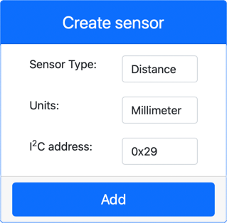
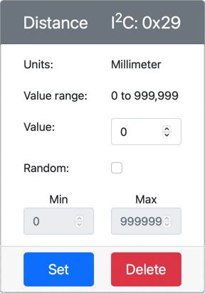

# Detect proximity - Virtual IoT Hardware

In this part of the lesson, you will add a proximity sensor to your virtual IoT device, and read distance from it.

## Hardware

The virtual IoT device will use a simulated distance sensor.

In a physical IoT device you would use a sensor with a laser ranging module to detect distance.

### Add the distance sensor to CounterFit

To use a virtual distance sensor, you need to add one to the CounterFit app

#### Task - add the distance sensor to CounterFit

Add the distance sensor to the CounterFit app.

1. Open the `fruit-quality-detector` code in VS Code, and make sure the virtual environment is activated.

1. Install an additional Pip package to install a CounterFit shim that can talk to distance sensors by simulating the [rpi-vl53l0x Pip package](https://pypi.org/project/rpi-vl53l0x/), a Python package that interacts with [a VL53L0X time-of-flight distance sensor](https://wiki.seeedstudio.com/Grove-Time_of_Flight_Distance_Sensor-VL53L0X/). Make sure you are installing this from a terminal with the virtual environment activated.

    ```sh
    pip install counterfit-shims-rpi-vl53l0x
    ```

1. Make sure the CounterFit web app is running

1. Create a distance sensor:

    1. In the *Create sensor* box in the *Sensors* pane, drop down the *Sensor type* box and select *Distance*.

    1. Leave the *Units* as `Millimeter`

    1. This sensor is an I<sup>2</sup>C sensor, so set the address to `0x29`. If you used a physical VL53L0X sensor it would be hardcoded to this address.

    1. Select the **Add** button to create the distance sensor

    

    The distance sensor will be created and appear in the sensors list.

    

## Program the distance sensor

The virtual IoT device can now be programmed to use the simulated distance sensor.

### Task - program the time of flight sensor

1. Create a new file in the `fruit-quality-detector` project called `distance-sensor.py`.

    > 💁 An easy way to simulate multiple IoT devices is to do each in a different Python file, then run them at the same time.

1. Start a connection to CounterFit with the following code:

    ```python
    from counterfit_connection import CounterFitConnection
    CounterFitConnection.init('127.0.0.1', 5000)
    ```

1. Add the following code below this:

    ```python
    import time
    
    from counterfit_shims_rpi_vl53l0x.vl53l0x import VL53L0X
    ```

    This imports the sensor library shim for the VL53L0X time of flight sensor.

1. Below this, add the following code to access the sensor:

    ```python
    distance_sensor = VL53L0X()
    distance_sensor.begin()
    ```

    This code declares a distance sensor, then starts the sensor.

1. Finally, add an infinite loop to read distances:

    ```python
    while True:
        distance_sensor.wait_ready()
        print(f'Distance = {distance_sensor.get_distance()} mm')
        time.sleep(1)
    ```

    This code waits for a value to be ready to read from the sensor, then prints it to the console.

1. Run this code.

    > 💁 Don't forget this file is called `distance-sensor.py`! Make sure to run this via Python, not `app.py`.

1. You will see distance measurements appear in the console. Change the value in CounterFit to see this value change, or use random values.

    ```output
    (.venv) ➜  fruit-quality-detector python distance-sensor.py 
    Distance = 37 mm
    Distance = 42 mm
    Distance = 29 mm
    ```

> 💁 You can find this code in the [code-proximity/virtual-iot-device](code-proximity/virtual-iot-device) folder.

😀 Your proximity sensor program was a success!