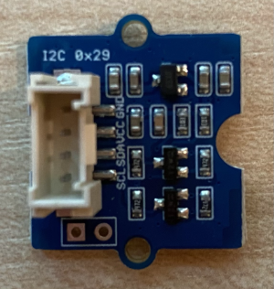
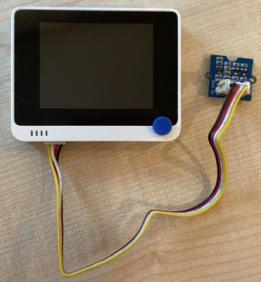
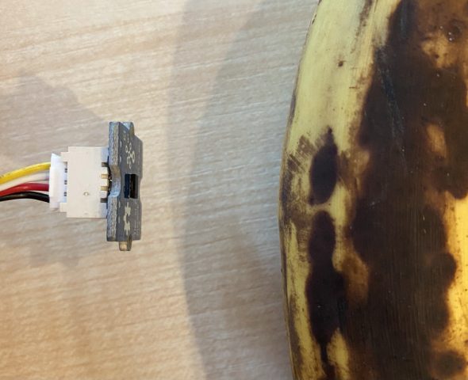

# Detect proximity - Wio Terminal

In this part of the lesson, you will add a proximity sensor to your Wio Terminal, and read distance from it.

## Hardware

The Wio Terminal needs a proximity sensor.

The sensor you'll use is a [Grove Time of Flight distance sensor](https://www.seeedstudio.com/Grove-Time-of-Flight-Distance-Sensor-VL53L0X.html). This sensor uses a laser ranging module to detect distance. This sensor has a range of 10mm to 2000mm (1cm - 2m), and will report values in that range pretty accurately, with distances above 1000mm reported as 8109mm.

The laser rangefinder is on the back of the sensor, the opposite side to the Grove socket.

This is an I<sup>2</sup>C sensor.

### Connect the time of flight sensor

The Grove time of flight sensor can be connected to the Wio Terminal.

#### Task - connect the time of flight sensor

Connect the time of flight sensor.



1. Insert one end of a Grove cable into the socket on the time of flight sensor. It will only go in one way round.

1. With the Wio Terminal disconnected from your computer or other power supply, connect the other end of the Grove cable to the left-hand side Grove socket on the Wio Terminal as you look at the screen. This is the socket closest to from the power button. This is a combined digital and I<sup>2</sup>C socket.



1. You can now connect the Wio Terminal to your computer.

## Program the time of flight sensor

The Wio Terminal can now be programmed to use the attached time of flight sensor.

### Task - program the time of flight sensor

1. Create a brand new Wio Terminal project using PlatformIO. Call this project `distance-sensor`. Add code in the `setup` function to configure the serial port.

1. Add a library dependency for the Seeed Grove time of flight distance sensor library to the projects `platformio.ini` file:

    ```ini
    lib_deps =
        seeed-studio/Grove Ranging sensor - VL53L0X @ ^1.1.1
    ```

1. In `main.cpp`, add the following below the existing include directives to declare an instance of the `Seeed_vl53l0x` class to interact with the time of flight sensor:

    ```cpp
    #include "Seeed_vl53l0x.h"
    
    Seeed_vl53l0x VL53L0X;
    ```

1. Add the following to the bottom of the `setup` function to initialize the sensor:

    ```cpp
    VL53L0X.VL53L0X_common_init();
    VL53L0X.VL53L0X_high_accuracy_ranging_init();
    ```

1. In the `loop` function, read a value from the sensor:

    ```cpp
    VL53L0X_RangingMeasurementData_t RangingMeasurementData;
    memset(&RangingMeasurementData, 0, sizeof(VL53L0X_RangingMeasurementData_t));

    VL53L0X.PerformSingleRangingMeasurement(&RangingMeasurementData);
    ```

    This code initializes a data structure to read data into, then passes it into the `PerformSingleRangingMeasurement` method where it will be populated with the distance measurement.

1. Below this, write out the distance measurement, then delay for 1 second:

    ```cpp
    Serial.print("Distance = ");
    Serial.print(RangingMeasurementData.RangeMilliMeter);
    Serial.println(" mm");

    delay(1000);
    ```

1. Build, upload and run this code. You will be able to see distance measurements with the serial monitor. Position objects near the sensor and you will see the distance measurement:

    ```output
    Distance = 29 mm
    Distance = 28 mm
    Distance = 30 mm
    Distance = 151 mm
    ```

    The rangefinder is on the back of the sensor, so make sure you use the correct side when measuring distance.

    

> 💁 You can find this code in the [code-proximity/wio-terminal](code-proximity/wio-terminal) folder.

😀 Your proximity sensor program was a success!
