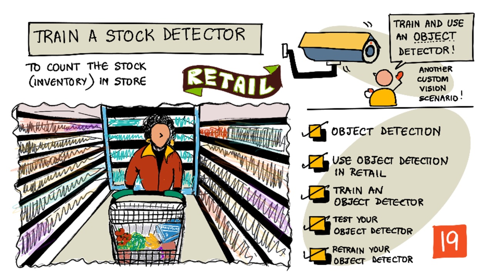
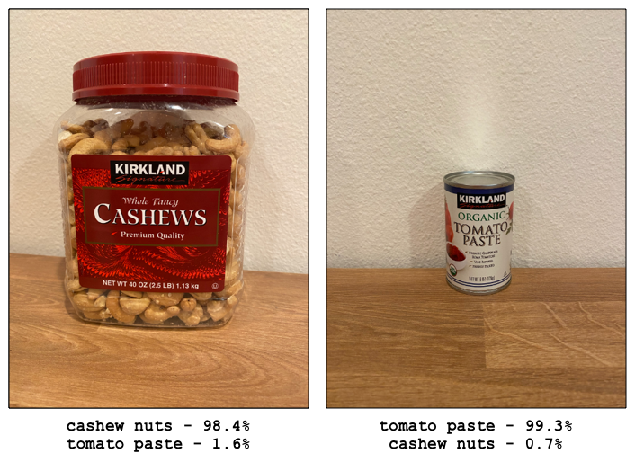
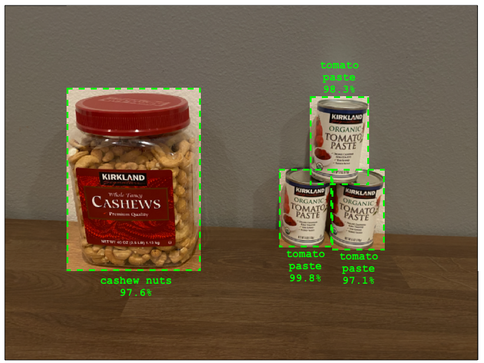
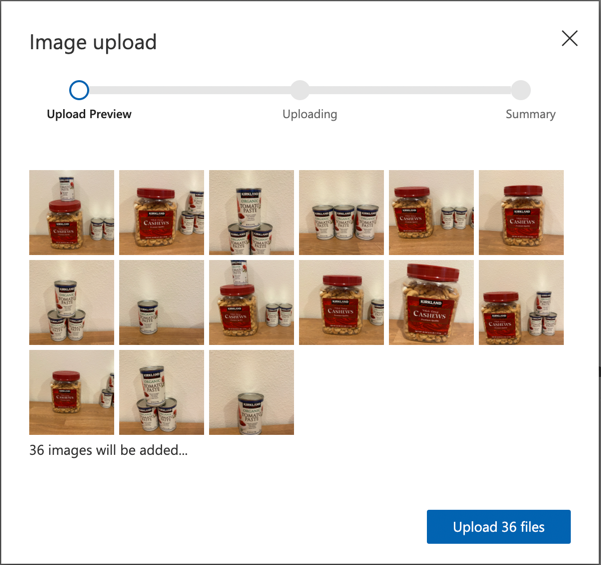
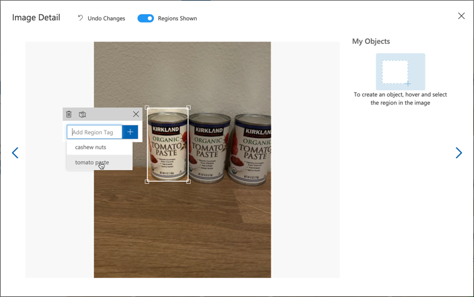
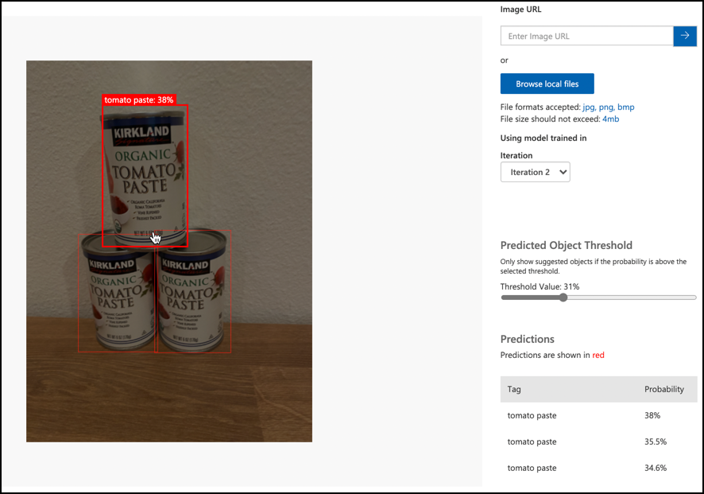

# Train a stock detector

> Sketchnote by [Nitya Narasimhan](https://github.com/nitya). Click the image for a larger version.

This video gives an overview of Object Detection the Azure Custom Vision service, a service that will be covered in this lesson.

> 🎥 Click the image above to watch the video

## Pre-lecture quiz

[Pre-lecture quiz](https://black-meadow-040d15503.1.azurestaticapps.net/quiz/37)

## Introduction

In the previous project, you used AI to train an image classifier - a model that can tell if an image contains something, such as ripe fruit or unripe fruit. Another type of AI model that can be used with images is object detection. These models don't classify an image by tags, instead they are trained to recognize objects, and can find them in images, not only detecting that the image is present, but detecting where in the image it is. This allows you to count objects in images.

In this lesson you will learn about object detection, including how it can be used in retail. You will also learn how to train an object detector in the cloud.

In this lesson we'll cover:

* [Object detection](#object-detection)
* [Use object detection in retail](#use-object-detection-in-retail)
* [Train an object detector](#train-an-object-detector)
* [Test your object detector](#test-your-object-detector)
* [Retrain your object detector](#retrain-your-object-detector)

## Object detection

Object detection involves detecting objects in images using AI. Unlike the image classifier you trained in the last project, object detection is not about predicting the best tag for an image as a whole, but for finding one or more objects in an image.

### Object detection vs image classification

Image classification is about classifying an image as a whole - what are the probabilities that the whole image matches each tag. You get back probabilities for every tag used to train the model.

In the example above, two images are classified using a model trained to classify tubs of cashew nuts or cans of tomato paste. The first image is a tub of cashew nuts, and has two results from the image classifier:

| Tag            | Probability |
| -------------- | ----------: |
| `cashew nuts`  | 98.4%       |
| `tomato paste` | 1.6%        |

The second image is of a can of tomato paste, and the results are:

| Tag            | Probability |
| -------------- | ----------: |
| `cashew nuts`  | 0.7%        |
| `tomato paste` | 99.3%       |

You could use these value with a threshold percentage to predict what was in the image. But what if an image contained multiple cans of tomato paste, or both cashew nuts and tomato paste? The results would probably not give you what you want. This is where object detection comes in.

Object detection involves training a model to recognize objects. Instead of giving it images containing the object and telling it each image is one tag or another, you highlight the section of an image that contains the specific object, and tag that. You can tag a single object in an image or multiple. This way the model learns what the object itself looks like, not just what images that contain the object look like.

When you then use it to predict images, instead of getting back a list of tags and percentages, you get back a list of detected objects, with their bounding box and the probability that the object matches the assigned tag.

> 🎓 *Bounding boxes* are the boxes around an object.

The image above contains both a tub of cashew nuts and three cans of tomato paste. The object detector detected the cashew nuts, returning the bounding box that contains the cashew nuts with the percentage chance that that bounding box contains the object, in this case 97.6%. The object detector has also detected three cans of tomato paste, and provides three separate bounding boxes, one for each detected can, and each one has a percentage probability that the bounding box contains a can of tomato paste.

✅ Think of some different scenarios you might want to use image-based AI models for. Which ones would need classification, and which would need object detection?

### How object detection works

Object detection uses complex ML models. These models work by diving the image up into multiple cells, then checks if the center of the bounding box is the center of an image that matches one of the images used to train the model. You can think of this as kind of like running an image classifier over different parts of the image to look for matches.

> 💁 This is a drastic over-simplification. There are many techniques for object detection, and you can read more about them on the [Object detection page on Wikipedia](https://wikipedia.org/wiki/Object_detection).

There are a number of different models that can do object detection. One particularly famous model is [YOLO (You only look once)](https://pjreddie.com/darknet/yolo/), which is incredibly fast and can detect 20 different class of objects, such as people, dogs, bottles and cars.

✅ Read up on the YOLO model at [pjreddie.com/darknet/yolo/](https://pjreddie.com/darknet/yolo/)

Object detection models can be re-trained using transfer learning to detect custom objects.

## Use object detection in retail

Object detection has multiple uses in retail. Some include:

* **Stock checking and counting** - recognizing when stock is low on shelves. If stock is too low, notifications can be sent to staff or robots to re-stock shelves.
* **mask detection** - in stores with mask policies during public health events, object detection can recognize people with masks and those without.
* **Automated billing** - detecting items picked off shelves in automated stores and billing customers appropriately.
* **Hazard detection** - recognizing broken items on floors, or spilled liquids, alerting cleaning crews.

✅ Do some research: What are some more use cases for object detection in retail?

## Train an object detector

You can train an object detector using Custom Vision, in a similar way to how you trained an image classifier.

### Task - create an object detector

1. Create a Resource Group for this project called `stock-detector`

1. Create a free Custom Vision training resource, and a free Custom Vision prediction resource in the `stock-detector` resource group. Name them `stock-detector-training` and `stock-detector-prediction`.

    > 💁 You can only have one free training and prediction resource, so make sure you've cleaned up your project from the earlier lessons.

    > ⚠️ You can refer to [the instructions for creating training and prediction resources from project 4, lesson 1 if needed](../../../4-manufacturing/lessons/1-train-fruit-detector/README.md#task---create-a-cognitive-services-resource).

1. Launch the Custom Vision portal at [CustomVision.ai](https://customvision.ai), and sign in with the Microsoft account you used for your Azure account.

1. Follow the [Create a new Project section of the Build an object detector quickstart on the Microsoft docs](https://docs.microsoft.com/azure/cognitive-services/custom-vision-service/get-started-build-detector?WT.mc_id=academic-17441-jabenn#create-a-new-project) to create a new Custom Vision project. The UI may change and these docs are always the most up to date reference.

    Call your project `stock-detector`.

    When you create your project, make sure to use the `stock-detector-training` resource you created earlier. Use the *Object Detection* project type, and the *Products on Shelves* domain.

    

    ✅ The products on shelves domain is specifically targeted for detecting stock on store shelves. Read more on the different domains in the [Select a domian documentation on Microsoft Docs](https://docs.microsoft.com/azure/cognitive-services/custom-vision-service/select-domain?WT.mc_id=academic-17441-jabenn#object-detection)

✅ Take some time to explore the Custom Vision UI for your object detector.

### Task - train your object detector

To train your model you will need a set of images containing the objects you want to detect.

1. Gather images that contain the object to detect. You will need at least 15 images containing each object to detect from a variety of different angles and in different lighting conditions, but the more the better. This object detector uses the *Products on shelves* domain, so try to set up the objects as if they were on a store shelf. You will also need a few images to test the model. If you are detecting more than one object, you will want some testing images that contain all the objects.

    > 💁 Images with multiple different objects count towards the 15 image minimum for all the objects in the image.

    Your images should be png or jpegs, small than 6MB. If you create them with an iPhone for example they may be high-resolution HEIC images, so will need to be converted and possibly shrunk. The more images the better, and you should have a similar number of ripe and unripe.

    The model is designed for products on shelves, so try to take the photos of the objects on shelves.

    You can find some example images that you can use in the [images](./images) folder of cashew nuts and tomato paste that you can use.

1. Follow the [Upload and tag images section of the Build an object detector quickstart on the Microsoft docs](https://docs.microsoft.com/azure/cognitive-services/custom-vision-service/get-started-build-detector?WT.mc_id=academic-17441-jabenn#upload-and-tag-images) to upload your training images. Create relevant tags depending on the types of objects you want to detect.

    

    When you draw bounding boxes for objects, keep them nice and tight around the object. It can take a while to outline all the images, but the tool will detect what it thinks are the bounding boxes, making it faster.

    

    > 💁 If you have more than 15 images for each object, you can train after 15 then use the **Suggested tags** feature. This will use the trained model to detect the objects in the untagged image. You can then confirm the detected objects, or reject and re-draw the bounding boxes. This can save a *lot* of time.

1. Follow the [Train the detector section of the Build an object detector quickstart on the Microsoft docs](https://docs.microsoft.com/azure/cognitive-services/custom-vision-service/get-started-build-detector?WT.mc_id=academic-17441-jabenn#train-the-detector) to train the object detector on your tagged images.

    You will be given a choice of training type. Select **Quick Training**.

The object detector will then train. It will take a few minutes for the training to complete.

## Test your object detector

Once your object detector is trained, you can test it by giving it new images to detect objects in.

### Task - test your object detector

1. Use the **Quick Test** button to upload testing images and verify the objects are detected. Use the testing images you created earlier, not any of the images you used for training.

    

1. Try all the testing images you have access to and observe the probabilities.

## Retrain your object detector

When you test your object detector, it may not give the results you expect, the same as with image classifiers in the previous project. You can improve your object detector by retraining it with images it gets wrong.

Every time you make a prediction using the quick test option, the image and results are stored. You can use these images to retrain your model.

1. Use the **Predictions** tab to locate the images you used for testing

1. Confirm any accurate detections, delete an incorrect ones and add any missing objects.

1. Retrain and re-test the model.

---

## 🚀 Challenge

What would happen if you used the object detector with similar looking items, such as same brand cans of tomato paste and chopped tomatoes?

If you have any similar looking items, test it out by adding images of them to your object detector.

## Post-lecture quiz

[Post-lecture quiz](https://black-meadow-040d15503.1.azurestaticapps.net/quiz/38)

## Review & Self Study

* When you trained your object detector, you would have seen values for *Precision*, *Recall*, and *mAP* that rate the model that was created. Read up on what these values are using [the Evaluate the detector section of the Build an object detector quickstart on the Microsoft docs](https://docs.microsoft.com/azure/cognitive-services/custom-vision-service/get-started-build-detector?WT.mc_id=academic-17441-jabenn#evaluate-the-detector)
* Read more about object detection on the [Object detection page on Wikipedia](https://wikipedia.org/wiki/Object_detection)

## Assignment

[Compare domains](assignment.md)
